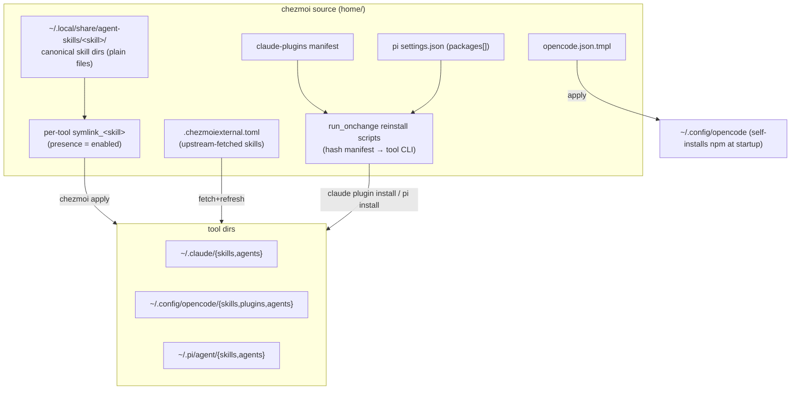

# feat: Reproducible agent setup (skills, agents, plugins) across Claude / OpenCode / Pi

## Summary

Make the agent environment — skills, agents, and tool plugins for Claude Code,
OpenCode, and Pi — reproducible through chezmoi using three mechanisms:
*vendored files*, *upstream-fetched* (`.chezmoiexternal.toml`), and *declarative
reinstall* (a committed manifest the tool replays). A canonical skill body lives
once in `home/.chezmoitemplates/agent-skills/` with thin per-tool wrappers for
selective rollout; per-tool reinstall scripts mirror the existing
Brewfile → `run_onchange` pattern. No `npx skills`. Sources track current by
default; pinning is opt-in. Existing skills are migrated into the model, and an
offline Docker test plus a manual live-restore checklist verify it.

## Problem Frame

Agent configuration arrives through uncoordinated paths and drifts: 7 skills via
`.chezmoiexternal.toml` (Claude only), 4 authored skills (Claude only), Claude
marketplace plugins, OpenCode npm/local plugins, and Pi extensions — with no
single place that reproduces the set on a fresh machine. The brainstorm
(see origin) established WHAT: reproduce, don't manage; chezmoi as umbrella;
three mechanisms; current-by-default. This plan defines HOW, building on the
repo's existing idioms (`run_onchange` hash-triggered installers, OS-guarded
`.tmpl`, bats + Docker tests) rather than inventing new machinery.

The mechanism details were verified against tool sources during the brainstorm:
`claude plugin install` / `marketplace` exist; OpenCode self-installs `plugin[]`
at startup; Pi reinstalls via `pi install` from `settings.json` `packages[]`.

---

## Key Technical Decisions

- **KTD1 — Canonical skill dir + per-tool directory symlink.** Each skill's
  canonical tree (`SKILL.md` + optional `references/`) is deployed once by chezmoi
  to `~/.local/share/agent-skills/<skill>/` (source
  `home/private_dot_local/share/agent-skills/<skill>/`) as **plain files** — not
  templated, so literal `{{ }}` in skill content (common in agent skills) is never
  interpreted. Per-tool enablement is a chezmoi **directory symlink**: a
  `symlink_<skill>.tmpl` in each tool's skills dir whose rendered content is the
  canonical path; presence of the symlink = enabled for that tool. One symlink per
  skill regardless of file count — `references/` follows automatically. This is
  exactly what `npx skills` does at runtime (default symlink mode across
  claude-code / opencode / pi — all verified to follow directory symlinks;
  OpenCode scans with `symlink: true`). **First-apply caveat:** a symlink whose
  target name sorts before the canonical dir is created before it (transient
  dangle, resolved within the same `chezmoi apply` run); a `run_after_` script can
  enforce ordering if it ever matters. This replaces an earlier wrapper-include
  design that failed two ways — `{{ template }}` would execute literal braces in
  skill bodies, and multi-file skills needed one wrapper per file (see
  Alternatives Considered).

- **KTD2 — Reinstall scripts mirror the Brewfile installer.** Claude and Pi
  plugin reinstall are `run_onchange_after_*.sh.tmpl` scripts that hash a
  committed manifest (`# # {{ include "<manifest>" | sha256sum }}`) and invoke the
  tool CLI — same shape as `run_onchange_after_install-packages.sh.tmpl`. Not
  `modify_` scripts (those rewrite a file from stdin; here we drive an installer).

- **KTD3 — Commit the portable manifest, not raw tool state.** Claude's
  `installed_plugins.json` / `known_marketplaces.json` carry absolute paths,
  timestamps, and project-scoped entries — not committed. A small committed
  manifest records marketplace sources + user-scope plugins, seeded once by a
  generator from live state (R8) and curated. Pi commits `settings.json`
  `packages[]` (already portable git/npm sources).

- **KTD4 — `opencode.json` becomes a template.** Committed as `.tmpl` with an
  `.is_darwin` guard so the macOS-only `@rynfar/meridian` `file://` brew path is
  emitted only on darwin and never breaks a Linux/Docker apply.

- **KTD5 — Current by default; pin by exception.** Upstream skills stay on
  `.chezmoiexternal.toml` tracking `main` with uniform `refreshPeriod`; npm/
  marketplace versions track their channel. Pinning a specific source to an
  immutable ref is opt-in. Tests assert presence and set-matches-manifest, never
  versions. **Reproducibility is set-level, not behavior-level:** restoring on a
  fresh machine pulls whatever upstream currently is, which may have changed or
  been removed — a present-but-broken source passes the presence tests. Recovery
  path: when a current-tracked source breaks or disappears, pin it to a
  last-known-good ref (the opt-in escape hatch). This is the deliberate trade for
  staying current; it is not a reproducibility guarantee of exact behavior.

- **KTD6 — Secrets excluded with op guards.** `~/.pi/agent/auth.json` and any
  secret injection are excluded or guarded by `{{ if lookPath "op" }}` (mirroring
  `dot_zshenv.tmpl` and `modify_dot_claude.json`) so Docker/CI apply without
  1Password does not fail.

---

## High-Level Technical Design

Three mechanisms feed the tool dirs: vendored files (one canonical skill dir +
per-tool symlinks), upstream-fetched (external), and declarative reinstall
(manifest → `run_onchange` → tool CLI). OpenCode npm plugins self-install from the
committed config.

---

## Requirements Traceability

| Origin requirement | Unit(s) |
|---|---|
| R1, R2 (vendored skills, canonical+include) | U1, U2 |
| R3 (Claude standalone agents as files) | U2 |
| R4, R4b (upstream-fetched, no name collision) | U6 |
| R5, R5b, R6, R7 (OpenCode config/plugins/agents) | U3 |
| R8, R9, R10, R11, R11b (Claude manifest + reinstall + drift) | U4, U7 |
| R12, R13, R14 (Pi skills/agents, extensions, secrets) | U5 |
| R15 (inventory + 3-bucket classification) | U6 |
| R16 (offline Docker verification) | U8 |
| R17 (live restore checklist) | U8 |

---

## Implementation Units

### U1. Canonical skill dir + per-tool symlink mechanism (herdr pilot)

- **Goal:** Establish the canonical-dir + directory-symlink convention, proven
  end-to-end on herdr across Claude, OpenCode, and Pi — including the multi-file
  case (a `references/` subdir riding along through the single dir symlink).
- **Requirements:** R1, R2.
- **Dependencies:** none.
- **Files:**
  - `home/private_dot_local/share/agent-skills/herdr/SKILL.md` (+ a
    `references/` file — include one even if synthetic, to exercise multi-file)
  - `home/private_dot_claude/skills/symlink_herdr.tmpl`
  - `home/private_dot_config/opencode/skills/symlink_herdr.tmpl`
  - `home/private_dot_pi/agent/skills/symlink_herdr.tmpl`
  - `tests/templates.bats`, `tests/smoke.bats`
- **Approach:** Canonical tree deployed as plain files (no `.tmpl` → skill content
  with literal `{{ }}` is never interpreted). Each `symlink_herdr.tmpl` renders to
  `{{ .chezmoi.homeDir }}/.local/share/agent-skills/herdr`. Selective rollout =
  which `symlink_` files exist. The dir symlink carries `references/`
  automatically — no per-file wrappers.
- **Execution note:** Pilot the multi-file path now (herdr with a `references/`
  file) so the directory-symlink behavior is proven before U2/U6 migrate in bulk.
- **Patterns to follow:** templated symlink form from chezmoi docs
  (`symlink_*.tmpl` content = target path); `.is_darwin`/var templating like
  `dot_zshenv.tmpl`; `render_template` in `tests/helpers/common.bash`.
- **Test scenarios:**
  - `Covers R2.` After apply, `~/.claude/skills/herdr`, OpenCode, and Pi skills
    dirs each resolve (through the symlink) to the canonical `SKILL.md` content.
  - Reading `references/<file>` through the symlink in each tool dir succeeds
    (multi-file rides along).
  - A skill whose `symlink_` file is absent for one tool does not appear there.
  - The `symlink_*.tmpl` renders to the correct absolute canonical path on Linux.
- **Verification:** `make test-templates` + Docker apply: herdr (with its
  reference file) is reachable in all three tool dirs via the symlink; absent
  where no `symlink_` exists.

### U2. Migrate authored skills into the canonical model

- **Goal:** Move the 4 authored skills (`review-plan`, `markdown-new`,
  `react-doctor`, `tdd-integration`) and Claude standalone agents into the
  canonical-dir + symlink model, choosing target tools per skill (review each).
- **Requirements:** R1, R2, R3.
- **Dependencies:** U1.
- **Files:**
  - `home/private_dot_local/share/agent-skills/<skill>/...` (canonical trees
    moved from `home/private_dot_claude/skills/<skill>/`)
  - `home/private_dot_claude/skills/symlink_<skill>.tmpl` (+ OpenCode/Pi
    `symlink_` files for any skill chosen multi-tool)
  - `home/private_dot_claude/agents/` (standalone agents committed as files)
- **Approach:** For each authored skill, decide tool targets (default: keep
  Claude-only unless the skill is tool-agnostic). Move the tree to the canonical
  location and replace the direct source with a `symlink_` per targeted tool.
  Standalone Claude agents (not bundle-provided) are committed as plain files.
- **Patterns to follow:** U1 symlink convention.
- **Test scenarios:**
  - Each migrated skill resolves to identical content in Claude through its
    symlink after apply (content parity pre/post migration).
  - A skill marked multi-tool resolves in each targeted tool dir.
  - `Test expectation:` no behavioral change to skill content — assert the
    canonical bytes equal the pre-migration `private_dot_claude/skills/<skill>`.
- **Verification:** migrated skills are byte-identical at the canonical path to
  their pre-migration source; each targeted tool dir resolves through the symlink.

### U3. OpenCode config, plugins, and agents

- **Goal:** Make OpenCode reproducible: templated config (meridian guarded),
  committed local plugins, standalone agents, and skill files.
- **Requirements:** R5, R5b, R6, R7.
- **Dependencies:** none.
- **Files:**
  - `home/private_dot_config/opencode/opencode.json.tmpl` (convert from current
    untracked `opencode.json`; `.is_darwin` guard around the `@rynfar/meridian`
    `file://` entry)
  - `home/private_dot_config/opencode/plugins/` (`herdr-agent-state.js`, `rtk.ts`)
  - `home/private_dot_config/opencode/agents/` (standalone, non-bundle agents)
  - `home/private_dot_config/opencode/skills/` (handled via U1/U2 wrappers where
    multi-tool; tool-only skills vendored here)
  - `home/.chezmoiignore` (ensure `node_modules/` excluded)
- **Approach:** Template the config so npm plugins (`oh-my-openagent`) self-install
  at startup on every machine while meridian's absolute brew path renders only on
  darwin. Commit local plugin and agent files verbatim.
- **Patterns to follow:** `.is_darwin` guard from `.chezmoiignore`; `lookPath`/
  conditional emission from `dot_zshenv.tmpl`.
- **Test scenarios:**
  - `Covers R5.` Rendering `opencode.json.tmpl` on Linux omits the meridian
    `file://` entry; on darwin includes it.
  - Rendered JSON is valid (`jq .` succeeds) on both OSes.
  - Local plugin files land in `~/.config/opencode/plugins/` after apply.
  - `node_modules/` is absent from the source tree.
- **Verification:** `make test-templates` renders valid JSON on Linux; apply in
  Docker places plugins/agents/skills; meridian entry absent on Linux render.

### U4. Claude marketplace manifest + reinstall script

- **Goal:** Reproduce Claude marketplace plugins from a committed manifest via a
  `run_onchange` reinstall script; exclude project-scoped plugins and raw config.
- **Requirements:** R8, R9, R10, R11.
- **Dependencies:** none.
- **Files:**
  - `home/private_dot_config/agent-setup/claude-plugins.toml` (or `.json`) —
    committed manifest: marketplace name → source, plus user-scope
    `plugin@marketplace` list
  - `scripts/` generator that seeds the manifest from live `installed_plugins.json`
    (`scope: user`) + `known_marketplaces.json` sources
  - `home/.chezmoiscripts/run_onchange_after_install-claude-plugins.sh.tmpl`
  - `tests/scripts.bats`
- **Approach:** Generator builds the initial manifest (one-time, then curated).
  The reinstall script hashes the manifest, runs `claude plugin marketplace add`
  for each source then `claude plugin install <plugin@marketplace>`, idempotently,
  and reports partial failures (marketplace added but install failed) instead of
  exiting success. Project-scoped entries are filtered out. Guard the whole script
  on `command -v claude`.
- **Patterns to follow:** hash-trigger + OS/tool guards from
  `run_onchange_after_install-packages.sh.tmpl`; graceful tool-missing fallback
  from `modify_dot_claude.json`.
- **Test scenarios:**
  - `Covers R10.` Generator excludes `scope: project` entries from the manifest.
  - Script is a no-op on a machine where all plugins are already installed
    (idempotency).
  - `Covers R9.` Simulated install failure surfaces a non-zero/reported status,
    not silent success.
  - Script renders and passes `bash -n` on Linux even without `claude` present
    (guarded).
- **Verification:** rendered script passes `bash -n`; manifest validates; on a
  real machine, running it installs the listed plugins idempotently (live path,
  see U8/R17).

### U5. Pi extensions, skills, agents, and secrets

- **Goal:** Reproduce Pi via committed `settings.json` `packages[]` and a
  `pi install`/`pi update` reinstall script; commit standalone skills/agents;
  exclude secrets.
- **Requirements:** R12, R13, R14.
- **Dependencies:** none.
- **Files:**
  - `home/private_dot_pi/agent/settings.json` (or `.tmpl` if the local
    `pi-agent-browser` absolute path must be made portable)
  - `home/private_dot_pi/agent/skills/` (standalone skills, or U1 wrappers)
  - `home/private_dot_pi/agent/agents/` (hand-authored agents — the 9 non-ce kept
    after the orphan cleanup)
  - `home/.chezmoiscripts/run_onchange_after_install-pi-extensions.sh.tmpl`
  - `home/.chezmoiignore` (exclude `~/.pi/agent/auth.json`, `node_modules/`)
- **Approach:** Commit `packages[]` (git/npm sources portable). Reinstall script
  hashes `settings.json` and runs `pi install <source>` / `pi update`, guarded on
  `command -v pi`. The local `pi-agent-browser` absolute path is templated or its
  package vendored (see Open Questions). `auth.json` excluded; any secret use
  guarded by `lookPath "op"`.
- **Patterns to follow:** KTD2 reinstall shape; `.chezmoiignore` exclusions;
  op-guard from `dot_zshenv.tmpl`.
- **Test scenarios:**
  - `Covers R14.` `auth.json` is not present in the source tree; apply in Docker
    (no `op`) does not fail.
  - Reinstall script renders and passes `bash -n` without `pi` present (guarded).
  - `settings.json` is valid JSON after render.
- **Verification:** rendered script passes `bash -n`; apply in Docker excludes
  secrets and places skills/agents; live `pi install` path covered in U8/R17.

### U6. Consolidation, migration, and collision check

- **Goal:** Produce the reproduced-items inventory (3 buckets), migrate existing
  upstream-fetched skills under the unified model, and guarantee no name
  collisions.
- **Requirements:** R4, R4b, R15.
- **Dependencies:** U1, U2.
- **Files:**
  - `home/.chezmoiexternal.toml` (reconcile the 7 skill entries; keep
    upstream-fetched, uniform refresh; extend to other tools only where chosen)
  - `docs/` short inventory note (vendored / upstream-fetched / declarative-
    reinstall classification)
  - `scripts/` or `tests/` collision check (vendored-symlink vs upstream-fetched
    name overlap within a tool's skills dir)
- **Approach:** Inventory only items that will be reproduced (input to the
  manifests), classify each into one bucket, and verify no skill name is supplied
  by both a vendored `symlink_` and an external entry in the same tool dir
  (chezmoi reports inconsistent state on overlap). Run this check **before apply**
  (a `tests/templates.bats` gate) so a clash fails fast rather than at apply time.
  Keep the 7 external skills upstream-fetched; migrate authored ones via U2.
- **Test scenarios:**
  - `Covers R4b.` Collision check fails when a skill name exists both as a
    `symlink_` and an external entry for the same tool.
  - Inventory lists every reproduced item in exactly one bucket.
- **Verification:** collision check passes on the real tree; inventory complete.

### U7. Drift check

- **Goal:** Detect divergence between the committed Claude manifest and live
  installed plugins.
- **Requirements:** R11b.
- **Dependencies:** U4.
- **Files:**
  - `scripts/` drift checker (regenerate manifest from live
    `installed_plugins.json` user-scope, diff against committed)
  - `tests/scripts.bats`
- **Approach:** Reuse the U4 generator to produce a fresh manifest from live
  state, diff against the committed one, and report added/removed/renamed plugins.
  Runnable on demand and as a CI check (skipped gracefully where `claude` state is
  absent).
- **Test scenarios:**
  - Identical live and committed state → clean diff (exit 0).
  - A plugin present live but absent from the manifest → reported.
- **Verification:** drift check reports a synthetic divergence in a fixture.

### U8. Tests: offline Docker + live-restore checklist

- **Goal:** Verify reproduction offline in Docker (vendored bytes, tmpl render,
  manifest/script validity) and provide a manual live-restore checklist for the
  network-dependent paths.
- **Requirements:** R16, R17.
- **Dependencies:** U1–U7.
- **Files:**
  - `tests/templates.bats` (wrappers + `opencode.json.tmpl` render on Linux)
  - `tests/scripts.bats` (`bash -n` on rendered reinstall scripts; manifest valid)
  - `tests/smoke.bats` (post-apply: skills/agents land in expected tool dirs;
    secrets excluded)
  - `docs/` live-restore checklist (R17: run upstream fetch, `claude plugin
    install`, OpenCode startup `bun install`, `pi install`; confirm plugins land
    and function)
- **Approach:** Extend the existing bats suites and Docker flow. Offline coverage
  (R16) asserts placement + render + validity without network or `op`. **Externals
  need network:** `chezmoi apply` fetches the 7 `.chezmoiexternal.toml` archives,
  so the offline Docker run applies with externals excluded
  (`chezmoi apply --exclude=externals`) and asserts only the vendored
  canonical-dir + symlinks, `.tmpl` renders, and script/manifest validity. The
  upstream-fetched bucket is verified in a networked apply or the R17 checklist,
  not offline. Where a step needs a tool CLI absent in the container, assert
  script/manifest validity rather than executing install.
- **Execution note:** Run the R17 live-restore of the U1 pilot (one skill, all
  three tools, real `claude plugin install` / `pi install` / OpenCode startup) as
  an acceptance gate **before** U2/U6 migrate in bulk — so the reinstall half is
  proven live on one item before bulk adoption, not first during a real restore.
- **Patterns to follow:** `smoke.bats` `@test` + `assert_*` with `is_linux`/skip
  guards; Docker flow in `docker/docker-compose.yml`; `render_template` helper.
- **Test scenarios:**
  - `Covers R16.` After offline Docker apply (externals excluded), herdr/migrated
    skills resolve via symlink in each targeted tool dir; `auth.json` absent;
    `node_modules/` absent.
  - Rendered reinstall scripts pass `bash -n` on Linux without the tool CLIs.
  - `opencode.json.tmpl` renders valid JSON without the meridian entry on Linux.
- **Verification:** `make test-ubuntu` / `make test-docker` green; the R17 live
  checklist is run against the U1 pilot before bulk migration and once on a real
  machine for the full set.

---

## Alternatives Considered

- **Wrapper-include for skills** (`.chezmoitemplates/agent-skills/<skill>/` +
  per-tool `{{ template ... }}` wrappers): rejected as primary (was the original
  KTD1). Two failures — the `template` action executes literal `{{ }}` inside
  skill bodies (common in agent skills, which document templating), and multi-file
  skills need one wrapper per file (3N files, drift-prone). A safer variant uses
  the `include` function (returns raw content, no execution) but still fans out
  per file. Directory symlinks (KTD1) avoid both and match how `npx skills` works.
- **Manifest + generator for skills** (`.chezmoidata` → `run_onchange`
  materializer copying canonical trees per tool): uniform and avoids template
  execution, but reintroduces a copy step when one declarative symlink suffices.
  Held as fallback if symlink-following ever breaks in a tool.
- **Per-tool-uniform mechanism** (one manifest per tool reinstalls everything for
  that tool, vs. the per-item-type split): would sidestep the symlink/external
  name-collision the U6 check guards, but no tool exposes a single installer
  covering vendored skills + plugins together — the per-item-type split maps to
  what each tool actually supports.
- **Committing raw tool state files** (`installed_plugins.json`, etc.): rejected —
  non-portable (absolute paths, timestamps, project scope).

---

## Scope Boundaries

### Deferred to Follow-Up Work

- Promoting more authored/third-party skills to multi-tool (each needs review;
  U2 migrates current ones, defaults Claude-only unless tool-agnostic).
- Automating the R17 live-restore as a CI/make target (manual checklist for now).

### Deferred for later (from origin)

- Catalog/discovery UX for finding new skills.

### Outside this effort's identity (from origin)

- `npx skills` or any bespoke skill-management CLI.
- Supply-chain hardening beyond opt-in pinning (allowlists, signatures, mandatory
  version pins) — proportionate boundary for single-user dotfiles.
- Managing bundle non-skill internals beyond reinstall.
- `oh-my-openagent.json` (excluded per user decision).

---

## Risks & Dependencies

- **chezmoi inconsistent state** if a vendored `symlink_` and an external entry
  supply the same skill name in one tool dir → mitigated by U6 collision check,
  run pre-apply.
- **First-apply symlink ordering** — a `symlink_<skill>` may be created before its
  canonical-dir target (alphabetical apply order), a transient dangle resolved
  within the same `chezmoi apply` run → acceptable for read-at-startup tools; a
  `run_after_` symlink step is the escape hatch if strict ordering is ever needed.
- **Live reinstall not exercised in CI** (tool CLIs absent in Docker) → offline
  validity checks (U8) + R17 manual checklist; honest gap recorded.
- **`pi-agent-browser` absolute path** in `packages[]` is machine-specific →
  template or vendor (Open Questions).
- **Dependencies:** `claude plugin` and `pi` CLIs present on real machines;
  OpenCode self-installs `plugin[]`; brew-provided meridian on macOS (Brewfile);
  host rule — never `chezmoi apply` on host, validate via `make test-local` /
  `make test-ubuntu`.

---

## Open Questions

Deferred to implementation:

- **`pi-agent-browser` local path:** make portable (templated path) or vendor the
  local package — decide when touching `settings.json` in U5.
- **Out-of-repo install frequency:** informs how aggressively U7's drift check
  should run (on-demand vs every CI run).

---

## Sources & Research

- Origin requirements: `docs/brainstorms/2026-06-26-reproduce-agent-setup-requirements.md`
  (mechanisms, current-by-default, tool-behavior verification).
- Repo patterns to mirror: `home/.chezmoiscripts/run_onchange_after_install-packages.sh.tmpl`
  (hash-trigger installer), `home/.chezmoiexternal.toml` (external entry format),
  `home/modify_dot_claude.json` (stdin-modify + tool guards),
  `home/dot_zshenv.tmpl` (`lookPath "op"` guard), `home/.chezmoiignore` (OS
  conditionals), `tests/helpers/common.bash` (`chezmoi_test_init`,
  `render_template`), `docker/docker-compose.yml` + `Makefile` (test flow).
- Skill mechanism verified against chezmoi docs + tool sources: chezmoi
  `symlink_<name>.tmpl` deploys a templated symlink whose content is the target
  path and supports **directory** targets; the `include` function returns raw file
  content (no template execution) while the `template` action executes it; OpenCode
  scans skills with `symlink: true` and `npx skills` uses symlink mode by default
  across claude-code / opencode / pi — all follow directory symlinks. `.chezmoitemplates`
  is therefore not used; the canonical dir is a normal deployed target.
