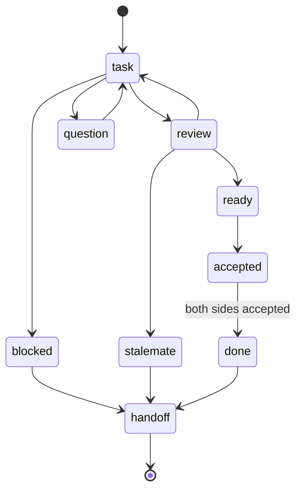

# feat: herdr-pair peer-agent skill (claude↔claude, claude↔pi)

## Summary

Stage 3 of the herdr-skills family: a vendored-and-adapted `herdr-pair` skill that lets two coding agents collaborate as **peers** inside herdr — one tab, two agent panes, plain-text messages with a structured header, turn-based until both sides agree the work is done. The base (`hcaiano/skills/skills/herdr-pair`) pairs claude↔codex; this plan adapts it for **claude↔claude** and **claude↔pi**, drops codex, moves the racy mechanics into tested scripts, and adds a chezmoi run-script that keeps herdr's agent-state integrations current so the turn-taking is reliable.

During the testing phase the protocol is injected into both peers via `--append-system-prompt-file` (props), reading the skill's protocol file straight from the repo working tree — no `chezmoi apply` on the host, and it covers pi (which does not auto-load Claude-format skills). Once herdr-skills are deployed natively to all agents, the header-trigger auto-load takes over and the injection is dropped.

---

## Execution Amendment — 2026-06-28 (transport = Model B, initiator-driven)

> Recorded during execution at the user's request. This **supersedes the base's symmetric message transport** that the original round-trip sequence diagram and `Receiving` flow assumed. Identity (peer-role `a`/`b`, KTD1), props injection (KTD2), scripts-for-racy-mechanics (KTD3), agent-status+fallback (KTD4), integration refresh (KTD5), and per-tab session (KTD6) are all unchanged; requirements R1–R9 still hold.

**Decision.** Transport is **Model B (initiator-driven)**, and **claude is always the initiator/driver**. Role `a` = claude-initiator owns *all* herdr transport (split / `send-text`+Enter / `read` / `wait`). Role `b` = partner (claude or pi) **only replies in its own pane output**, prefixing the reply with the swapped `[pair b -> a kind=K sid=S]` header; it never runs herdr or bash and never discovers a pane. claude-`a` reads `b`'s pane and parses the `kind` from the header (the machine signal) plus the prose body (for comprehension).

**Why not the base's symmetric Model A.** Model A needs *every* agent to drive herdr from injected prose — exactly the risk this plan already flags for pi ("*props-injected pi may not follow the protocol faithfully*"), and worse for opencode. Model B removes that risk, is centralized in claude's tested scripts, and as a bonus covers **claude↔opencode** for free (opencode as a respond-in-text partner) even though opencode is out of scope here.

**Directionality.** Bidirectional *conversation* (a↔b replies, both directions) works. Bidirectional *initiation* (a non-claude agent like `pi→claude` starting/driving a pair) is **not** supported by Model B and is **deferred to follow-up** — it would require making pi/opencode full herdr drivers (the fragile path). Model A remains the eventual *native-deployment* vision once skills are deployed to all agents.

**File-structure impact.**
- Adds a 4th script **`scripts/recv.sh`** (not in the original Output Structure): a pure pane-output parser that extracts the latest `[pair * -> a …]` block → `kind`/`sid`/`body`. Pure text in → offline unit-testable.
- `references/peer-protocol.md` becomes a **simple responder spec** (no herdr instructions; the partner just replies in-format).
- `SKILL.md` is an **initiator-only driver loop** (send → wait → read partner pane → parse → react), not the base's symmetric send/receive.

**Approach.** Implement U2–U5 under Model B, then run a **bounded live-probe of pi inside herdr** (confirm pi replies in-format and is idle-detectable) before finalizing U3/U4, then refine.

This amendment resolves Open Questions: the role-label scheme is `a`/`b` (settled), and the pi send-verify glyph question is downgraded — Model B's partner-side has no glyph to verify, and the initiator's send-verify leans on `agent-status`/output-marker (KTD4) rather than a pi-specific glyph.

---

## Problem Frame

Stage 2 (`ask-agent`) gives a **one-shot** consult: fire a question, get an answer, done. It cannot iterate — the asked agent answers once and exits. Some work needs two agents going back and forth: propose → review → revise → agree. herdr already provides the substrate (panes, `send-text`, `agent-status`, `wait`), and a battle-tested protocol exists in the base skill, but it is hardcoded to claude↔codex and assumes both peers auto-load the same Claude-format skill.

We need a peer-pair skill that works for the agents we actually run (claude, pi — codex is out), survives `claude↔claude` (where the two panes can't be told apart by agent type), and does not depend on every agent natively understanding the protocol yet.

---

## Scope Boundaries

### In scope (Stated)

- Vendored, adapted `herdr-pair` skill under the chezmoi source tree.
- Pairs: **claude↔claude** and **claude↔pi**.
- Peer-role identity decoupled from agent type.
- Racy mechanics (session state, spawn+inject, send+verify) extracted into `scripts/`, mirroring the `ask-agent` layout.
- Protocol injection via props (`--append-system-prompt-file`) for the testing phase; documented auto-load path for later.
- A chezmoi run-script that refreshes herdr's agent-state integrations (pi, claude, opencode) reproducibly.
- shellcheck + a structure smoke test; a documented manual live-E2E procedure.

### Out of scope

- **opencode** as a pair member (its persistent mode is a TUI / server-ACP — deferred to a follow-up).
- **codex** anywhere (dropped from the base).
- Native deployment of herdr-skills to every agent (the "later" that lets us drop props injection).
- Concurrent multi-pair orchestration beyond what the base already isolates per `(workspace, tab)`.

### Deferred to Follow-Up Work

- opencode pairing (TUI send/verify, or `opencode serve`/`acp` transport).
- Dropping props injection once skills are natively available to pi/opencode.
- Vendoring the herdr agent-state hooks into the source tree (vs. the run-script approach chosen here) if version drift becomes painful.

---

## Requirements

- **R1.** A pair can be bootstrapped from one pane via the skill, discovering or spawning the partner pane in the same tab.
- **R2.** Identity works for `claude↔claude` (two panes whose `agent` field is identically `claude`) and `claude↔pi`.
- **R3.** Messages carry the structured header `[pair <self> -> <partner> kind=<kind> sid=<sid>]`; bodies are plain prose; the kinds state machine matches the base (task/review/question/ready/accepted/blocked/stalemate/handoff); completion = both sides `accepted`.
- **R4.** Session state persists per `(workspace, tab)` under `~/.herdr-coworkers/<ws>/<tab_slug>/session.json`, mutated atomically (two agents race).
- **R5.** A spawned partner receives the protocol — claude via auto-load (deployed) or `--append-system-prompt-file` (testing); pi always via `--append-system-prompt-file` until it has the skill natively.
- **R6.** Turn-taking waits for the partner to finish its turn before sending, with a fallback when `agent-status` is unreliable.
- **R7.** herdr's agent-state integrations for the relevant agents are kept current reproducibly (clean machine gets working `agent-status`).
- **R8.** The skill source is chezmoi-managed without conflicting with `.chezmoiexternal.toml` or duplicating managed files; CI (no herdr) still applies cleanly.
- **R9.** Read-only/default-safety posture is documented (the pair edits files by design when given a coding task — this is `--rw`-equivalent, unlike `ask-agent`'s read-only default; the SKILL.md must make that explicit).

---

## High-Level Technical Design

Directional, not implementation spec.

### Component layout

```
~/.claude/skills/herdr-pair/        (source: home/private_dot_claude/skills/herdr-pair/)
  SKILL.md            orchestration brain: bootstrap, receive, kinds, guards, closing, modes
  references/
    peer-protocol.md  injectable protocol (props mode + non-claude peers)
    workbench-tab.md  optional shared-process tab
  scripts/
    session.sh        atomic create/read/update of session.json (peer-role schema)
    spawn-partner.sh  split pane + run partner agent + inject protocol + wait-ready
    send.sh           compose header+body, send-text+Enter, verify delivery (per-agent)

~/.config/herdr/...                 (existing, managed)
home/.chezmoiscripts/run_onchange_after_install-herdr-integrations.sh.tmpl   (new)
```

### Message round-trip (sequence)

```mermaid
sequenceDiagram
    participant A as Peer A (initiator, this pane)
    participant FS as session.json
    participant B as Peer B (partner pane)
    A->>A: bootstrap: pane get → ws/tab/agent
    A->>B: discover in tab; if absent → spawn-partner.sh (split + run + inject)
    A->>FS: session.sh create (roles → {agent_type, pane_id}, sid)
    A->>B: send.sh kind=task  (send-text + Enter + read-verify)
    A->>FS: session.sh update (round++, last_status[A]=task)
    B->>B: header detected → load/injected protocol
    B->>A: send.sh kind=review/ready
    A->>B: send.sh kind=accepted
    B->>A: send.sh kind=accepted
    A->>A: both accepted → kind=handoff to user; trash this tab's session dir
```

### Kinds state machine



---

## Key Technical Decisions

- **KTD1 — Peer-role identity, not agent-type.** Header becomes `[pair <self> -> <partner> kind=… sid=…]`; `session.json` maps each role label (e.g. `a`/`b`) to `{agent_type, pane_id}`. The base keys partner discovery on "the agent whose type is the opposite of self," which collapses when both are `claude`. Roles are assigned at bootstrap (initiator = `a`, partner = `b`) and never inferred from agent type. The skill `description` trigger is updated to match the new `[pair …]` prefix.

- **KTD2 — Protocol injection via `--append-system-prompt-file` (testing) → header auto-load (later).** Both `claude` and `pi` support `--append-system-prompt-file` (verified). During testing, the partner is spawned with `--append-system-prompt-file <repo>/…/references/peer-protocol.md`, reading the file directly from the working tree. This (a) avoids `chezmoi apply` on the host, (b) covers pi which does not auto-load Claude skills, (c) is identical for both pair types. When skills are natively deployed, the partner auto-loads on seeing the header and the injection flag is dropped. SKILL.md documents both modes.

- **KTD3 — Racy mechanics in `scripts/`, decisions in SKILL.md.** Mirror the `ask-agent` layout (`scripts/`, `scripts/agents/` style). Atomic JSON update, spawn+inject, and send+verify are extracted so they are shellcheck-clean and unit-testable; the kinds state machine, progress guards, and orchestration stay as instructions in SKILL.md. Avoids copy-paste bash drift and matches repo convention.

- **KTD4 — `agent-status` with output-marker fallback.** Turn-taking primarily uses `herdr wait agent-status <partner> --status idle`. Because pi's integration is currently v2 (herdr wants v3) and its reliability is unverified, `send.sh`/the wait step falls back to `herdr wait output <partner> --match <sentinel> --timeout …` when status waiting is unavailable or times out. The pair must not hard-depend on integration freshness.

- **KTD5 — Integration refresh via run-script keyed on herdr version; do not vendor the hooks.** A `run_onchange_after_install-herdr-integrations.sh.tmpl` runs `herdr integration install claude pi opencode`, guarded by `command -v herdr` (CI/Docker skip → exit 0), tolerant (`set -u`, never fails apply), mirroring `run_onchange_after_link-herdr-command-palette.sh.tmpl`. Idempotency/re-run is keyed on the herdr version via a `# {{ output "herdr" "--version" … }}` hash trigger so it re-installs when herdr upgrades (exactly when hooks go stale). The hook *contents* stay owned by herdr (it bumps versions) rather than being vendored stale into the source tree.

- **KTD6 — Session path per `(workspace, tab)`.** Keep the base's `~/.herdr-coworkers/<ws>/<tab_slug>/session.json` with `tab_slug = ${TAB_ID//:/_}`, and all mutations via temp-file + `mv`. Concurrent pairs in different tabs of one workspace stay isolated; receiving never falls back to a workspace-level path.

---

## Output Structure

New files (greenfield skill dir + one run-script):

```
home/private_dot_claude/skills/herdr-pair/
  SKILL.md
  references/
    peer-protocol.md
    workbench-tab.md
  scripts/
    session.sh
    spawn-partner.sh
    send.sh
home/.chezmoiscripts/
  run_onchange_after_install-herdr-integrations.sh.tmpl
tests/
  smoke.bats            (extended, not created)
```

---

## Implementation Units

### U1. Session-state helper script

**Goal:** Atomic create/read/update of the per-tab session file with the peer-role schema.
**Requirements:** R4, R2.
**Dependencies:** none.
**Files:** `home/private_dot_claude/skills/herdr-pair/scripts/session.sh`; test `tests/smoke.bats` (session-state cases).
**Approach:** Subcommands `create|get|update`. `create` writes roles `a`/`b` → `{agent_type, pane_id}`, `sid`, `round=0`, `last_status`, `no_progress_count`, `workbench`, `created_at`; refuses to clobber an existing session for the same tab (caller decides resume/overwrite). `update` reads → mutates (`round`, `last_status[role]`, `no_progress_count`) → writes via `tmp.$$` + `mv`. Path derived from `workspace_id` + `tab_slug=${TAB_ID//:/_}`. Use `python3` for JSON (matches base; jq not assumed).
**Patterns to follow:** base SKILL.md atomic-update snippet; `ask-agent/scripts/*.sh` flag-parsing/`set -euo pipefail` style.
**Test scenarios:**
- Happy: `create` writes a well-formed file at the per-tab path; `get` round-trips it.
- Edge: `create` when a session file already exists for the tab → non-zero exit, no clobber.
- Concurrency: two `update`s in sequence each preserve prior fields (no lost write); temp file is `mv`-d, never partially written.
- Edge: `tab_id` containing `:` is flattened to `_` in the on-disk path.
- Error: `get`/`update` on a missing session file → clear non-zero error, no invented state.

### U2. Injectable peer protocol

**Goal:** A self-contained protocol document a non-auto-loading agent (pi) or a testing-mode claude can be seeded with via `--append-system-prompt-file`.
**Requirements:** R3, R5.
**Dependencies:** none.
**Files:** `home/private_dot_claude/skills/herdr-pair/references/peer-protocol.md`.
**Approach:** Condense the send/receive rules, header format, kinds semantics, completion signal, and the one-line fallback hint into agent-agnostic prose. No claude/codex-specific glyphs. Must instruct the receiver to treat `[pair …]`-prefixed input as machine-to-machine and reply in the same format.
**Patterns to follow:** base "Message format" + "Receiving" + "Kinds" sections, rewritten for peer-roles.
**Test scenarios:** `Test expectation: none — static protocol prose; correctness is validated by live E2E in U8.`

### U3. Partner-spawn + protocol-injection script

**Goal:** Given a partner agent type, split a pane, launch the partner with the protocol injected, and wait until it is ready.
**Requirements:** R1, R5, R6.
**Dependencies:** U2.
**Files:** `home/private_dot_claude/skills/herdr-pair/scripts/spawn-partner.sh`; manual live coverage (see U8).
**Approach:** `herdr pane split <self> --direction right --no-focus` → parse `pane_id`. Build the partner command for the pane's interactive shell (pi/opencode are shell functions, not PATH binaries — do not use `command -v` to get a path): `claude --append-system-prompt-file <proto>` / `pi --append-system-prompt-file <proto> --tools …`. Run via `herdr pane run`. Wait readiness with `herdr wait agent-status <pane> --status idle`, falling back to `herdr wait output <pane> --match <sentinel>` (KTD4). No retry on spawn failure — surface recent pane output and exit non-zero (base hard rule).
**Execution note:** pi's interactive prompt glyph / submit semantics are unknown — derive them with a bounded live probe before finalizing the readiness check.
**Patterns to follow:** base "Spawn flow"; `run_onchange_after_link-herdr-command-palette.sh.tmpl` tolerant-guard style.
**Test scenarios:**
- Manual/live (claude partner): split → spawn → reaches ready; pane reused, not duplicated.
- Manual/live (pi partner): same, with protocol file injected; pi acknowledges the protocol on first message.
- Error: partner binary/function unavailable → non-zero, recent pane output surfaced, no retry.
- Static: shellcheck clean; `command -v herdr` absent → fails fast with a clear message.

### U4. Send-with-verify script

**Goal:** Compose a protocol message and deliver it to the partner pane, verifying it was actually submitted.
**Requirements:** R3, R6.
**Dependencies:** U1.
**Files:** `home/private_dot_claude/skills/herdr-pair/scripts/send.sh`; manual live coverage (see U8).
**Approach:** Compose `[pair <self> -> <partner> kind=<kind> sid=<sid>]\n\n<body>` in a temp file (heredoc-safe). `herdr pane send-text <pane>` (literal write — `herdr agent send <target>` is the agent-keyed equivalent) then `herdr pane send-keys <pane> Enter`; verify by reading the partner's buffer via `herdr pane read <pane> --source recent-unwrapped` for the header and detecting the "still in input buffer" failure (one retry). The glyph/notice strings are **per-agent** — claude from the base; **pi derived empirically** (execution note). On verified delivery, call `session.sh update`. A failed send does not update the session.
**Execution note:** derive pi's prompt glyph and any "queued"/"submitted" notice strings from the U3 live probe; do not assume the claude/codex glyphs apply to pi.
**Patterns to follow:** base "Sending (with verify)" + "Pre-send" sections.
**Test scenarios:**
- Manual/live: claude→claude delivery verified (header leaves the input buffer); session `round`/`last_status` updated.
- Manual/live: claude→pi delivery verified with pi glyphs.
- Edge: partner `working` and message is not a `STOP —` interrupt → waits for idle (or the fallback) before sending.
- Error: Enter never submits after one retry → non-zero, session NOT updated.
- Static: shellcheck clean; body with quotes/`$`/backticks survives via the temp-file path.

### U5. SKILL.md orchestration

**Goal:** The orchestration brain wiring U1–U4: bootstrap, receiving, kinds state machine, progress guards, closing, and the two protocol-delivery modes.
**Requirements:** R1, R2, R3, R6, R9; honors R5.
**Dependencies:** U1, U2, U3, U4.
**Files:** `home/private_dot_claude/skills/herdr-pair/SKILL.md`.
**Approach:** Adapt the base. Frontmatter `description` triggers on `[pair …]` and on `/herdr-pair`. Up front: confirm `HERDR_ENV=1` + `HERDR_PANE_ID`, else stop. Bootstrap (resolve self, discover/spawn partner via U3, create session via U1, send first message via U4). Receiving (re-resolve self, load session, sid/sender match, dispatch by kind). Progress guards (`no_progress_count`, stalemate). Closing (both `accepted` → `handoff` + trash this tab's session dir). Document **modes**: testing = props injection (point partners at `references/peer-protocol.md` in the working tree); later = native auto-load. State explicitly (R9) that a pair **edits files by design** — it is not the read-only consult that `ask-agent` is.
**Patterns to follow:** base SKILL.md structure; `ask-agent/SKILL.md` for the modes/flags tone; Stage-1 `herdr/SKILL.md` for the in-herdr preamble and id-opacity rules.
**Test scenarios:** `Test expectation: structure-only — validated by U8 (frontmatter valid, file present, references resolve). Behavior validated by live E2E.`

### U6. Workbench-tab reference

**Goal:** Optional shared-process tab doc, adapted to the peer-role session schema.
**Requirements:** supports R4.
**Dependencies:** U1.
**Files:** `home/private_dot_claude/skills/herdr-pair/references/workbench-tab.md`.
**Approach:** Port the base reference; fix the session path to the per-tab form (`<ws>/<tab_slug>/`) and the atomic-update reference to `session.sh`.
**Test scenarios:** `Test expectation: none — static reference prose.`

### U7. chezmoi run-script: refresh herdr integrations

**Goal:** A clean machine (and an upgraded herdr) gets current agent-state hooks so `agent-status` works.
**Requirements:** R7, R8.
**Dependencies:** none.
**Files:** `home/.chezmoiscripts/run_onchange_after_install-herdr-integrations.sh.tmpl`; test `tests/smoke.bats` (skip-without-herdr case) or `tests/scripts.bats`.
**Approach:** Mirror `run_onchange_after_link-herdr-command-palette.sh.tmpl`: `set -u`, `command -v herdr` guard → exit 0 when absent, tolerant of a stopped server. Run `herdr integration install claude pi opencode` (claude+pi are pair-required; opencode included because it is already in our agent set). Hash-trigger on herdr version (`# {{ output "herdr" "--version" | sha256sum }}`) so it re-runs on upgrade. Confirm it does not fight `.chezmoiremove`/managed-dir purging (hooks land in managed dirs `~/.claude/hooks`, `~/.pi/agent/extensions` as unmanaged files — chezmoi tolerates by default; verify).
**Patterns to follow:** `run_onchange_after_link-herdr-command-palette.sh.tmpl` exactly.
**Test scenarios:**
- Happy (template): renders with the version hash trigger present.
- Edge (CI/no herdr): script exits 0 and prints a skip message — apply does not fail. `Covers R8.`
- Static: shellcheck clean (template delimiters accounted for).

### U8. Tests + manual live-E2E procedure

**Goal:** Lock in the automatable coverage and document the live procedure CI can't run.
**Requirements:** R8; verification for R1–R6.
**Dependencies:** U1–U7.
**Files:** `tests/smoke.bats` (extended); a manual procedure block in `SKILL.md` or `docs/`.
**Approach:** bats: skill dir exists, `SKILL.md` frontmatter parses, `scripts/*.sh` present and shellcheck-clean (lean on `make lint`), `session.sh` unit cases from U1, U7 skip-without-herdr case. Document the manual live-E2E: inside herdr, run a claude↔claude pair then a claude↔pi pair on a trivial task, confirm both reach mutual `accepted` and the session dir is trashed on close.
**Execution note:** characterization-first for `session.sh` — write the bats cases before finalizing the script.
**Test scenarios:**
- Structure: `home/private_dot_claude/skills/herdr-pair/SKILL.md` exists and frontmatter is valid.
- Static: all three scripts pass shellcheck via `make lint`.
- Integration (template): U7 script skips cleanly when `herdr` is absent (CI). `Covers R8.`
- Manual/live: full claude↔claude and claude↔pi round-trips to mutual `accepted` + cleanup.

---

## Risks & Dependencies

- **pi TUI send/verify is unknown until probed.** The base's verify heuristics are claude/codex-specific. *Mitigation:* U3 bounded live probe derives pi's glyph/notice; U4 keys the verify on per-agent strings.
- **pi `agent-status` reliability on v2.** Turn-taking may stall. *Mitigation:* KTD4 output-marker fallback + KTD5 refresh to v3.
- **Props-injected pi may not follow the protocol faithfully** (prompt-only, not enforced). *Mitigation:* tight `peer-protocol.md`; live-E2E gate; document the limitation if pi drifts.
- **herdr integration install writes into chezmoi-managed dirs** (`~/.claude/hooks`, `~/.pi/agent/extensions`). *Mitigation:* unmanaged files in managed dirs are tolerated by chezmoi; U7 verifies no `.chezmoiremove` conflict.
- **No CI coverage for the live pair** (needs herdr + interactive agents). *Mitigation:* documented manual procedure; CI covers structure + shellcheck + skip-paths only.
- **`.chezmoiexternal.toml` collision.** *Mitigation:* U1 checks that `herdr-pair` is not externally managed before adding it to the source tree (project rule).

---

## Open Questions — Deferred to Implementation

- Exact pi interactive prompt glyph, submit semantics, and any "queued/submitted" notice strings (derive in U3 live probe).
- Whether `herdr wait agent-status` is reliable for a pi pane on the v2 hook, or whether U7's refresh to v3 is a hard prerequisite for the pi pair.
- Whether props-injected pi reliably emits the `[pair …]` header format across turns.
- Final role-label scheme (`a`/`b` vs. agent-qualified like `claude-1`) — settle when wiring U1↔U5.

---

## Sources & Research

- Base skill: `hcaiano/skills/skills/herdr-pair/SKILL.md` + `references/workbench-tab.md` (commit `7f22cb9`). Pairs claude↔codex; this plan adapts it.
- Roadmap/origin: `memory/herdr-skills-roadmap` (Stage 3 decisions, 2026-06-26).
- Repo patterns: `home/private_dot_claude/skills/ask-agent/` (Stage 2, scripts layout), `home/private_dot_claude/skills/herdr/SKILL.md` (Stage 1, in-herdr control), `home/.chezmoiscripts/run_onchange_after_link-herdr-command-palette.sh.tmpl` (run-script guard pattern).
- Verified facts (2026-06-26, this machine): herdr 0.7.1; `claude`/`codex` are PATH binaries, `opencode`/`pi` are zsh functions; `pi` interactive by default + `--append-system-prompt(-file)` + `--tools` + `--mode rpc`; `claude` supports `--append-system-prompt-file`; `herdr integration status` → pi v2<v3, claude v6<v7, opencode v5<v7.
- Verified command vocabulary (2026-06-28, herdr 0.7.1, live `--help`): write = `herdr pane send-text <pane> <text>` / `herdr agent send <target> <text>` (both literal); submit = `herdr pane send-keys <pane> Enter`; combined text+Enter = `herdr pane run <pane> <cmd>`; read/verify = `herdr {pane,agent} read <id> --source visible|recent|recent-unwrapped [--lines N] [--format text|ansi]`; turn-taking = `herdr wait agent-status <pane> --status idle|working|blocked|done|unknown [--timeout MS]` and `herdr wait output <pane> --match <text> [--source …] [--regex] [--timeout MS]`; agent-keyed readiness also `herdr agent wait <target> --status …`. Cross-checked against pi-bellwether (joelhooks, MIT v0.1.0) — a pi package that drives herdr via the same `agent send` + `pane send-keys Enter` + `agent read --source` calls.
