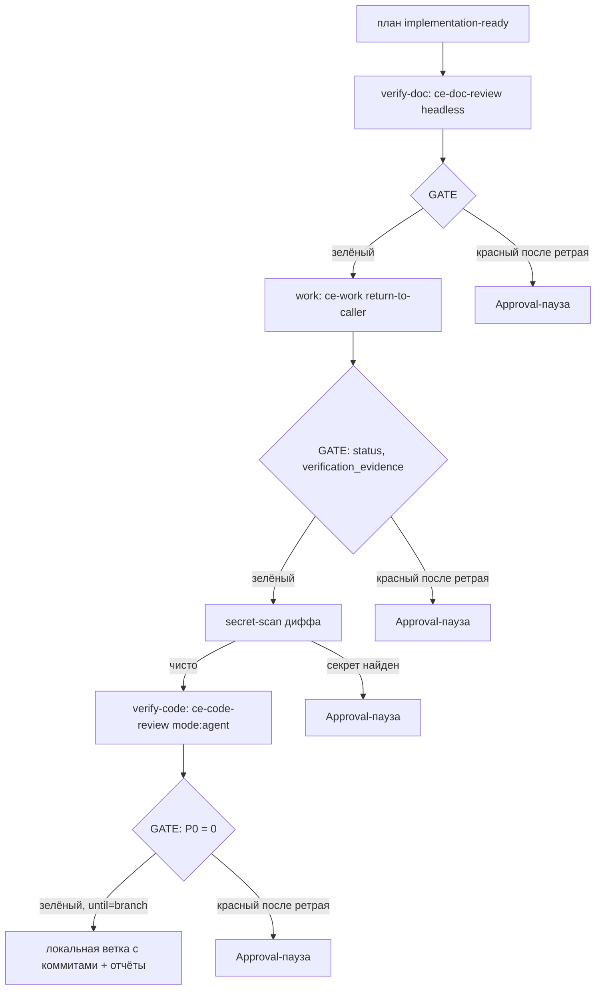
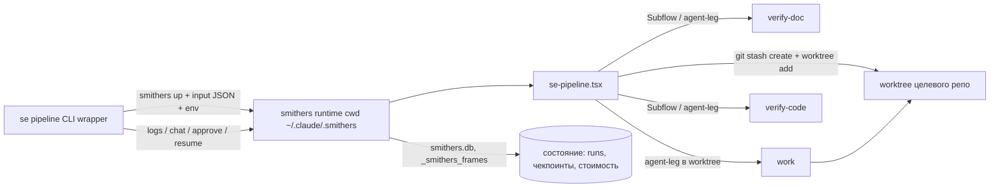
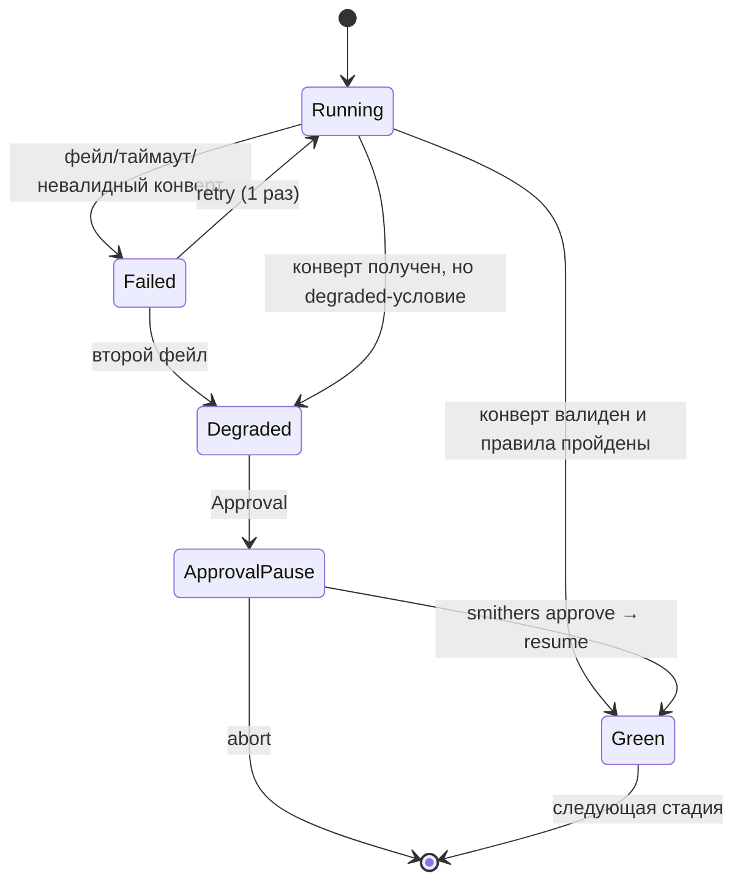

# Smithers Pipeline (хребет se-pipeline) - Plan

## Goal Capsule

- **Цель:** durable-хребет `se-pipeline.tsx` на Smithers — verify-doc → work → verify-code как обёртки headless-режимов существующих скиллов, с GATE-проверками кодом, чекпоинтами и ретраями; запуск и наблюдение через CLI.
- **Product authority:** Andrew (solo). Приёмка — сравнительная фаза на рабочих задачах integration.app.
- **Профиль исполнения:** код в этом репозитории (`home/private_dot_claude/dot_smithers/`), работает против внешних целевых репозиториев. Запуск стадий тратит реальные деньги ($15-бюджеты на плечо) — прогоны end-to-end только осознанно, разработка через спайк и фикстуры.
- **Стоп-условия (все проверяются в спайке U1, до постройки хребта):** resume/Approval не работают в 0.27.0 → стоп, эскалация (возможен апгрейд на 0.28.0 как пре-юнит); конверт `ce-work mode:return-to-caller` не воспроизводится headless-вызовом из агента Smithers → стоп, эскалация.
- **Открытые блокеры:** нет.

---

## Product Contract

### Summary

Первый срез workflow-системы на Smithers: один durable-прогон гонит готовый implementation-ready план через verify-doc → work → verify-code над рабочим репозиторием и оставляет проверенную закоммиченную ветку. Стадии переиспользуют существующие скиллы через их headless-режимы; Smithers добавляет crash-safety, ретраи и машинные гейты между стадиями.

### Problem Frame

Сегодня цепочка plan → review → work → review живёт в интерактивной сессии Claude: прогон умирает с терминалом, переходы между стадиями держатся на дисциплине LLM и подтверждениях человека, стоимость не фиксируется. `lfg` из плагина compound-engineering уже описывает автономную цепочку с GATE-логикой, но исполняется той же хрупкой сессией. Многочасовая автономная работа над рабочими задачами требует исполнителя, который переживает падения и не задаёт вопросов.

### Key Decisions

- **Обёртки, не нативный перенос.** Стадия = плечо, вызывающее существующий плагинный скилл в headless-режиме (`ce-doc-review mode:headless`, `ce-work mode:return-to-caller`, `ce-code-review mode:agent`). Принятая coverage-дельта: полные se-*-обёртки (локальный конверт + внешние консалты + синтез) стадиями не воспроизводятся — стадия даёт плагинное ревью без шага синтеза, переходы контролируют машинные гейты (KTD2). Логика плагина переиспользуется целиком и подхватывает его обновления; нативное переписывание отложено до стадий, которым нужен параллельный рой с по-плечевым скорингом (ревью-флоты, фаза 3).
- **GATE-логика lfg — спецификация переходов.** Проверки конвертов (`status: complete`, `verification_evidence`, наличие артефактов), ретрай стадии 1×, стоп с отчётом после второго фейла — переносятся из прозы lfg в код workflow.
- **Граница автономии: локально всё без спроса, наружу — после доверия.** Коммиты в рабочую ветку — сами; push/PR — режим `--until=pr`, включается после сравнительной фазы. Красный гейт — пауза на `<Approval>`, не смерть прогона.
- **Без денежного потолка на старте.** Стоимость каждого прогона фиксируется в журнале с первого дня; лимит установим по фактическим данным. Smithers сквозного бюджета не даёт — это осознанный ручной паттерн.
- **PR от имени пользователя.** Отдельная bot-identity не заводится (подтверждено).

### Requirements

**Хребет пайплайна**

- R1. `se-pipeline.tsx` — durable Smithers-прогон стадий verify-doc → work → verify-code над целевым репозиторием; вход — существующий план `ce-unified-plan/v1` с `artifact_readiness: implementation-ready` и `execution: code`. Без валидного плана прогон не стартует.
- R2. Каждая стадия — обёртка headless-режима существующего плагинного скилла (ce-*); логика стадий в workflow не дублируется. Принятая дельта: локальный+внешний синтез se-*-скиллов стадиями не воспроизводится (Key Decisions).
- R3. Границы стадий — GATE-проверки конвертов кодом workflow; правила lfg: ретрай упавшей verify-стадии 1×, второй фейл — стоп с отчётом о недостающих полях. Исключение — work: упавшая work-стадия без ретрая идёт сразу на Approval (KTD5).
- R4. Чекпоинт после каждой стадии; прерванный или упавший прогон резюмится с последней зелёной стадии, не с нуля.

**Автономия и гейты**

- R5. Внутри прогона нет блокирующих вопросов: work коммитит в рабочую ветку без подтверждений; красный GATE ставит прогон на паузу `<Approval>` с продолжением через `smithers chat`/CLI.
- R6. Глубина прогона — параметр: `--until=branch` (стоп на локальной закоммиченной ветке; дефолт сравнительной фазы) и `--until=pr` (полный автопилот). В MVP реализуется `branch`; параметр закладывается сразу, `pr` — следующая фаза.
- R7. Прогон работает в изолированном worktree целевого репозитория; основная рабочая копия не изменяется.
- R14. Между work и verify-code — секрет-скан диффа рабочей ветки; срабатывание переводит гейт в degraded → Approval до внешней отправки кода (KTD10).

**Наблюдаемость**

- R8. RunId, вердикты стадий и стоимость (`total_cost_usd` по стадиям) фиксируются в персистентности Smithers с первого прогона.
- R9. Прогон переживает закрытие терминала; статус, логи и reattach доступны из CLI (`smithers logs/chat <runId>`).

**Интерфейс**

- R10. CLI первичен: тонкий враппер `se pipeline <plan-path> [--until=...]` поверх `bunx smithers up`; все входы — аргументы и файлы, интерактива внутри прогона нет.
- R11. *(Deferred — см. Scope Boundaries; не входит в MVP.)* Скилл-адаптер опционален: собирает входы (путь к плану, ветка, режим), запускает тот же CLI, наблюдает и презентует результат. CLI самодостаточен без него.

**Целевые репозитории и деплой**

- R12. Первичная цель — рабочие репозитории (integration.app); валидационная команда целевого проекта по умолчанию берётся из `## Verification Contract` плана, override — `--validate-cmd`; используется гейтами (автообнаружение из конфига целевого репо — deferred, KTD8). Команды my-mac-setup не зашиваются.
- R13. Исходники системы живут в `home/private_dot_claude/dot_smithers/` (chezmoi-managed); мутабельное состояние прогонов — вне managed-дерева.

### Key Flows

- F1. Запуск прогона
  - **Trigger:** `se pipeline docs/plans/<план>.md --until=branch` в целевом репозитории.
  - **Steps:** валидация плана → worktree → verify-doc → GATE → work → GATE → verify-code → GATE → финал.
  - **Outcome:** закоммиченная ветка + отчёты стадий; ни одного вопроса по пути.
  - **Covers:** R1–R4, R6, R7, R10.
- F2. Красный гейт
  - **Trigger:** GATE не прошёл после ретрая (P0-находки, отсутствует verification_evidence, фейл стадии).
  - **Steps:** прогон встаёт на `<Approval>` → пользователь видит контекст через `smithers chat <runId>` → продолжает, откатывает или останавливает.
  - **Outcome:** человек — обработчик исключений, не шаг подтверждения.
  - **Covers:** R3, R5, R9.
- F3. Сравнительная фаза (приёмка системы)
  - **Trigger:** подобрана рабочая задача; Andrew делает её руками, параллельно — пайплайн с `--until=branch`.
  - **Steps:** обе ветки сравниваются вручную; наблюдения и стоимость прогона — материал для решения.
  - **Outcome:** когда результаты сопоставимы — включается `--until=pr`.
  - **Covers:** R6, R8, R12.

### Acceptance Examples

- AE1. **Covers R1–R4, R6, R7, R10.** Given валидный implementation-ready план, when `se pipeline план.md --until=branch`, then прогон проходит три стадии без вопросов и оставляет ветку с коммитами и отчёты стадий.
- AE2. **Covers R3, R5.** Given verify-code вернул P0-находку, when GATE красный после ретрая, then прогон на `<Approval>`-паузе и доступен через `smithers chat`.
- AE3. **Covers R4, R9.** Given терминал закрыт во время стадии work, then прогон продолжается (или резюмится с чекпоинта командой resume), результат не теряется.
- AE4. **Covers R1.** Given план с `artifact_readiness: requirements-only` или отсутствующий файл, when запуск, then прогон не стартует и печатает причину.

### Success Criteria

- Сравнительная фаза: на подобранных рабочих задачах результат пайплайна сопоставим с ручным (оценивает Andrew, формальной метрики нет).
- Прогон на реальной задаче проходит end-to-end без единого вопроса при зелёных гейтах.
- После любого падения прогон восстановим без повторной оплаты пройденных стадий.

### Scope Boundaries

Deferred (фазы после MVP):

- Стадии plan (обёртка ce-plan pipeline-mode) и commit/PR + CI-автофикс (`--until=pr`) — фаза 2.
- Нативные ревью-флоты: селектор ростера, разно-харнессные плечи, детерминированный merge, судьи/скоринг на `@smithers-orchestrator/scorers` — фаза 3.
- `se-debug` (цикл отладки с тестом-оракулом) и learnings-стадия (`ce-compound mode:headless` + memory store) — после хребта.
- **Скилл-адаптер se-pipeline** — разговорный вход (R11). CLI-first достаточно для обкатки и сравнительной фазы; скилл не улучшает хребет. Вынесен из MVP.
- **Dev-container вокруг work-стадии** — allow/deny-лист инструментов, изоляция сети и кредов (KTD12). MVP работает без него на доверенных задачах.
- **Автообнаружение validate-cmd из конфига целевого репо** — требует модели доверия к чужим коммитам (KTD8); MVP берёт команду только от оператора.
- **Консолидация staging.ts** — миграция `se-code-review.tsx`/`se-doc-review.tsx` на общий `lib/staging.ts` после того, как он докажет себя в MVP. Дубль принят сейчас, чтобы не блокировать хребет и не рисковать работающими донорами (KTD4); эта фаза его закрывает.
- Сквозной денежный бюджет прогона, нотификации об Approval-паузах, bot-identity для PR.
- Бэкап состояния прогонов (`~/.claude/.smithers/` при переустановке машины теряется) — принятый риск MVP.

### Sources / Research

- `docs/ideation/2026-07-14-smithers-workflow-system-ideation.html` — flow-by-flow анализ переноса, сводная таблица headless-режимов, прио-арт Smithers.
- `home/private_dot_claude/dot_smithers/workflows/se-code-review.tsx`, `se-doc-review.tsx` — отработанный паттерн snapshot → Parallel → collect; источник кода staging/spawn.
- lfg SKILL.md (плагин compound-engineering 3.19.0) — GATE-логика, ретраи: спецификация переходов хребта.
- Smithers @ `6453e94` (source-verified): Branch.js, Subflow.js, approval.mdx + CLI `approve` (apps/cli/src/index.js#L7018-L7076), resume-опции (index.js#L1625-L1664), Ralph/Loop.js, Worktree.js; smithers-fusions/src/{pipeline,engine}.ts — идиомы `gate()` и восстановления состояния из persisted outputs.

---

## Planning Contract

**Product Contract preservation:** без изменений, кроме Outstanding Questions — три deferred-вопроса разрешены планированием (fork vs scratch → KTD1; передача артефактов между стадиями → KTD2; обнаружение валидационной команды → KTD8) и убраны из Product Contract.

### Key Technical Decisions

- KTD1. **Свой `se-pipeline.tsx`, не форк smithers-fusions.** Fusions панельно-специфичен (N-моделей → судья → синтез на фазу) и не использует Subflow. Заимствуем идиомы: `gate()`-предикаты над `ctx.outputMaybe(...)`, вывод состояния прогона исключительно из persisted outputs (переживает crash/resume без своего state), `<Approval onDeny>` между фазами. Источник: `smithers-fusions/src/pipeline.ts`, `engine.ts`.
- KTD2. **Стадии: Subflow childRun — рекомендация, inline agent-leg — fallback; решает спайк U1.** verify-стадии в идеале — `<Subflow workflow={seCodeReview} mode="childRun">` (переиспользование проверенных workflows, независимый retry/resume-скоуп); каверза — opt-in разрешение произвольных output-имён в 0.27.0 и env-var-driven входы существующих workflows (`CODE_REVIEW_REPO` читается на module level). Если Subflow в 0.27.0 не взлетает за день спайка — inline agent-legs по паттерну `se-code-review.tsx:170-227` (копия, не абстракция). Направляющее решение, не спецификация. **Вердикт U1 (спайк, runId `1415f3a6`):** Subflow childRun работает в 0.27.0 — `se-doc-review.tsx` обёрнут без изменений, child получил свой run (`<runId>:child:doc-review:0`), smoke claude=ok/opencode=ok. Каверза env разрешилась: module-level `DOC_REVIEW_REPO` читается из окружения родительского процесса при `smithers up`; per-run env работает на уровне процесса (один прогон = один `up`), но per-Subflow env внутри одного прогона невозможен — для разных значений на стадию входы должны переехать в `input` child-workflow. Opt-in для произвольных output-имён не потребовался: результат child читается из его schema-ключа с буквальным именем `output`, он есть у обоих доноров. **Решение: verify-стадии = Subflow childRun.**
- KTD3. **Гейты — предикаты над Zod-валидированными выводами стадий; work-гейт вдобавок исполняет валидацию детерминированно.** Предикаты чистые (тестируемые), а исполнение внешних эффектов (запуск validate-cmd, git rev-parse) делает код границы стадии и передаёт результат в предикат. Правила из lfg: verify-doc — конверт получен и валиден (контентный гейт по находкам — вне MVP, конверт advisory для work); work — `status: complete` + `verification_evidence` непусто + `final_commit_sha` совпадает с `git rev-parse HEAD` ветки (KTD13) **И** validate-cmd целевого репо, запущенная кодом гейта в worktree, вернула 0 (self-report агента не является ground truth); verify-code — P0 = 0 (P1-счётчик пишется в вердикт гейта, не блокирует). Доверие self-reported P0-счётчику — осознанный MVP-риск (независимой сверки нет); компенсация — сравнительная фаза F3, где человек сравнивает ветки руками до включения `--until=pr`. **Семантика approve по гейтам:** G3 (P0) approve = waive с записью в журнал и продолжение; G1/G2 approve после жёсткого фейла стадии = одна доп. попытка стадии (третий прогон; для work — по условиям KTD5: конверт есть → повтор на нетронутой ветке, без reset), вторая пауза на том же гейте предлагает только abort; `deny` всегда роняет прогон. Красный после `retries={1}` → `<Approval>`. Деградация ≠ пройдено: недоступный/невалидный внешний конверт, срабатывание секрет-скана — отдельное состояние `degraded` → Approval, никогда не тихий pass. **Вердикт U1 по механике доп. попытки (runId `55fc587d`, `8f22d27e`):** доп. попытка после approve выражается монтированием нового узла (fresh nodeId по условию `approval.approved`), attempt-счётчик исходного узла не переиспользуется; вторая пауза на том же гейте — второй Approval-узел, `deny` валит прогон (`Task failed: gate2`). Для ручного вмешательства работает и `smithers retry-task --run-id <id> --node-id <node>`: сбрасывает узел вместе с зависимыми (catch-узел, гейт) и сам ресюмит прогон — проверено на уже упавшем прогоне.
- KTD13. **`final_commit_sha` — pipeline-расширение конверта ce-work.** Документированный `mode:return-to-caller` не содержит SHA коммита; pipeline-owned jsonSchema, передаваемая `ClaudeCodeAgent`, расширяет конверт обязательным полем `final_commit_sha`, которое агент заполняет. work-гейт сверяет его с HEAD ветки прогона. SHA-привязка — расширение, не часть документированного контракта скилла. **Вердикт U1 (runId `11663ec9` без явного запроса коммита, `8a49a49e` с ним):** фактический конверт полностью совпал с документированной формой (status/plan_path/changed_files/u_ids_attempted/u_ids_completed/verification_results/verification_evidence/blockers/behavior_change/standalone_shipping_skipped), SHA в нём отсутствует — расширение нужно, и оно работает: `final_commit_sha` вернулся и совпал с `git rev-parse HEAD` фикстуры. **Критическая находка:** глобальная политика пользователя «NEVER commit unless explicitly asked» (`~/.claude/CLAUDE.md`) протекает в headless `claude -p` — без явного запроса коммита ce-work вернул `status: complete` с незакоммиченными файлами. Промпт work-стадии обязан содержать явный запрос коммита (формулировка «You are EXPLICITLY REQUESTED to commit … this instruction is the explicit commit request» проверена прогоном).
- KTD4. **Worktree — проверенный ручной паттерн, не `<Worktree>`.** `git worktree add` от committed HEAD целевого репо по механике `se-code-review.tsx:119-142`, но без шага `git stash create` — он снимает грязное tracked-состояние в снапшот (уместно для ревью-доноров, замораживающих WIP), а пайплайну WIP оператора в автономной ветке не нужен (компонент `<Worktree>` в 0.27.0 не убирает за собой — авто-reaping только в 0.28.0). Один worktree на прогон; ветка `se/<plan-slug>-<runId-short>` (детерминированно, без коллизий); lock-файл на целевой репо (один прогон на репо); sweep осиротевших worktree при старте.
- KTD5. **Resume — нативный `up --resume --run-id <runId>`; work-стадия делается идемпотентной явно.** Завершённые задачи мемоизированы (не перезапускаются — выводы из SQLite); прерванные перезапускаются с нуля. Каверза work-стадии: мемоизация покрывает только *завершённые* задачи, но коммиты work живут в git, а не в SQLite — прерванный посреди work прогон перезапустит ce-work на ветке с частичными коммитами. Поэтому branch reset — условный, по причине рестарта: прерванный посреди work прогон (конверта нет, частичные коммиты) при (пере)старте детерминированно сбрасывает ветку прогона на записанный pre-stage SHA и запускает ce-work с чистого состояния; если же конверт получен, но гейт красный (например, пустое `verification_evidence`), доп. попытка запускает ce-work на нетронутой ветке — его документированный idempotency-путь осматривает готовую работу и дозаполняет evidence без реимплементации (lfg step 2). Авто-ретрай для work **не** слепой — упавшая work-стадия идёт сразу на Approval, а не на молчаливый повторный многочасовой прогон. Изменение кода workflow или импортируемых им модулей (lib/gates.ts, lib/envelopes.ts) блокирует resume жёстко (RESUME_METADATA_MISMATCH; хэш содержимого файла, не git): override-флага в 0.27.0 нет (`--accept-workflow-change` появляется только после 0.27.0) — escape hatch: `smithers fork <workflow> --run-id <id> --frame <n>` от чекпоинта либо откат файла workflow к исходному содержимому. Во время разработки U3/U4 каждая правка исходников делает in-flight прогоны нерезюмируемыми. Resume/Approval подтверждены source-research для 0.27.0; спайк U1 проверяет прогоном, включая kill после реального коммита. **Вердикт U4 (реализация):** детерминированный branch-reset «при (пере)старте» для kill-resume-посреди-work в примитивах 0.27.0 нереализуем — завершённые compute-задачи мемоизированы и не перезапускаются при resume, а промпт агентной задачи статичен (нет per-attempt хука для кода). Реализовано: (1) reset ЕСТЬ на approve-пути — `work-extra-prep` перед доп. попыткой применяет условие KTD5 (конверт есть → нетронутая ветка/idempotency-путь; конверта нет → `git reset --hard` на pre-stage SHA); (2) kill-resume-путь компенсируется документированной идемпотентностью ce-work (осматривает готовую работу) плюс жёстким work-гейтом (SHA/validate-cmd/evidence). Дубли коммитов на этом пути не исключены детерминированно — проверяется фикстурным сценарием раннбука U7; при неприемлемости — эскалация в апгрейд 0.28.0. **Резолюция (U9, 2026-07-16, git-only, БЕЗ jj):** дубль устранён детерминированно переносом коммита из агента в пайплайн — work-промпт больше не просит коммит (ce-work без запроса не коммитит, U1/KTD13), а `workGateFn` коммитит сам через guarded `git add -A && git commit` (только грязное дерево). Коммит теперь принадлежит одной мемоизируемой gate-задаче, не агенту: kill-после-commit/до-персиста → resume видит чистое дерево → коммит не повторяется; re-run агента коммитов не делает вовсе. Не требует `<Worktree>`/jj (см. U9 Батч 3). Acceptance — фикстурный kill-resume под 0.28 (U9 Verification).
- KTD6. **Launch-механика — как у существующих workflows.** `cd ~/.claude/.smithers && ./node_modules/.bin/smithers up workflows/se-pipeline.tsx --input '{"planPath":"...","until":"branch"}'` + env `PIPELINE_REPO=<abs path>`; состояние (smithers.db, runs/) остаётся в `~/.claude/.smithers/` — вне chezmoi-дерева (R13 выполняется существующей структурой).
- KTD7. **Валидация плана на входе + пин содержимого.** Гейт-0 читает frontmatter (`artifact_readiness: implementation-ready`, `execution: code`), считает hash содержимого; work-стадия перед стартом перепроверяет hash — план, отредактированный во время Approval-паузы, роняет прогон на явную ошибку, а не строит код по устаревшей спеке.
- KTD8. **Валидационная команда: дефолт из плана, override флагом; из конфига репо — нельзя.** ~~Только от оператора через `--validate-cmd`, с hard error при отсутствии.~~ **Пересмотрено 2026-07-15 после первого реального F3** (оператор дал `bun test` в корне монорепы → встроенный раннер bun утянул e2e/playwright → таймаут гейта). Новое решение: **по умолчанию команда извлекается из `## Verification Contract` самого плана** (`lib/plan.ts extractValidateCmd`, gate-0) — план это доверенный операторский вход, и он уже содержит узкие с таймаутами команды (их кладёт `/se-plan`). `--validate-cmd` — только override / для legacy-планов. Извлекаются лишь исполнимые check/test/typecheck-строки; отбрасываются server/watch/e2e/VRT и мутирующие (`fix`/`format`, иначе грязнят worktree → падает clean-tree-проверка work-гейта). Резолвленная команда и её источник логируются. **Граница доверия неизменна:** из плана извлекать безопасно, из конфига целевого репо (`.se-pipeline.json` чужого коммита) — по-прежнему исключено. Таймаут гейта — параметр `--validate-timeout` (дефолт 600 с). Автообнаружение из конфига репо — отдельная фаза с моделью доверия, не сюда.
- KTD10. **Secret-scan гейт перед внешней отправкой кода.** work-стадия производит дифф автономно; verify-code отправляет его во внешние LLM (claude, opencode). Между G2 и verify-code — детерминированный секрет-скан диффа рабочей ветки (gitleaks или аналог); срабатывание high-entropy/known-secret паттернов переводит гейт в `degraded` → Approval **до** любой внешней отправки. Ошибка исполнения самого сканера (нет бинарника, краш, таймаут) — тоже `degraded` → Approval, никогда не чистый pass. Инструмент устанавливается как зависимость системы (Brewfile), не целевого репо.
- KTD11. **План и конфиг читаются по абсолютному пути от лаунчера, не из worktree.** Worktree прогона создаётся от committed HEAD (KTD4) и видит только закоммиченный код; путь к плану и `--validate-cmd` приходят из аргументов CLI и передаются стадиям как абсолютные значения — worktree намеренно изолирован и видит только committed-состояние кода целевого репо. Preflight: грязное рабочее дерево целевого репо → предупреждение (не отказ; изоляция это и есть фича). KTD7 hash-пин считается по абсолютному пути плана, одинаковому для всех стадий.
- KTD12. **Лимиты инструментов work-агента — отложены (dev-container).** MVP запускает work-агента с `acceptEdits` без allow/deny-листа инструментов; изоляция — только worktree и cwd. Осознанный риск для обкатки на своих/доверенных задачах. Тот же непокрытый surface — запуск validate-cmd кодом гейта (KTD3): она исполняет только что изменённый агентом код (скрипты package.json, Makefile) с полными правами оператора; принимается вместе с риском work-агента и закрывается тем же dev-container'ом. Целевая защита — dev-container вокруг work-стадии (сеть, деструктивные git-операции, доступ к кредам) — отдельная фаза после хребта.
- KTD9. **stream-json воркэраунд — проверить и, возможно, снять в спайке.** Source-research показал: фикс `95b4f5736` уже внутри тега v0.27.0 (вопреки комментариям в обоих workflows «0.28.0, unreleased»). Спайк U1 проверяет subagent-heavy прогон без `outputFormat: "json"`; если чисто — override снимается в U4 попутной правкой, комментарии исправляются. **Вердикт U1 (runId `a9b4b686`):** capture чист на default stream-json — probe с двумя параллельными сабагентами вернул StructuredOutput без искажений; фикс действительно внутри 0.27.0. Override снимаем в U4, комментарии доноров правим. Свидетельство умеренное (2 сабагента против тяжёлых ревью-сессий) — после снятия override пронаблюдать первый реальный ревью-прогон.

- KTD14. **Миграция на Smithers 0.28 — что меняется, что нет.** Проверено диффом тарболов 0.27.0/0.28.0 (2026-07-16, `npm pack` + сверка `docs/llms-full.txt`). **Три худшие причуды НЕ изменились — митигации остаются:** (1) `retries?: number` дефолт всё ещё `Infinity` с backoff (llms-full 3472) → явные `retries={0|1}` на каждой Task обязательны; (2) `ctx.input` без Zod-дефолтов («Input fields also arrive as supplied, with no Zod defaults applied, so coalesce any field you do not require», 484) → коалесцирование `?? default` остаётся; (3) `ClaudeCodeAgent` не умеет native structured output — только `AnthropicAgent`/`OpenAIAgent` ставят `supportsNativeStructuredOutput`; CLI-агенты = prompt-inject + text-extract + schema-retry, «valid JSON shape does not guarantee meaningful values» (12641) → строгая envelope-обёртка `parseWorkEnvelope` остаётся правильной (смена агента на API-billed ради native JSON не стоит потери подписки/Claude Code tools). **Что даёт апгрейд:** (A) нативный `<Worktree>`/`<MergeQueue>` заменяет бОльшую часть `lib/staging.ts` (локи, sweep, branch-нейминг, base-detect); (B) **чинит KTD5** — worktree jj-backed, jj непрерывно авто-снапшотит working copy на bookmark, land/merge-шаг коммитит bookmark детерминированно → коммит перестаёт быть делом агента, дубля на kill-resume нет; (C) `estimateCostUsd`/`modelTokenPrices` из `smithers-orchestrator/scorers` (llms-full 1005) заменяют самопальную прайс-таблицу `lib/cost.ts` — событие `TokenUsageReported` по-прежнему без costUsd (16891), USD считаем из токенов, но официальными хелперами вместо дрейфующих констант; (D) provenance binding `ctx.prove(table,{nodeId})` → `ProofBinding{iteration,digest}` (1222) — engine-enforced «approval валиден только для одобренного артефакта», заменяет ручной plan-hash plumbing (KTD7) и закрывает review-finding о непересканиваемых approval-pause коммитах. **Ловушка (критично):** jj-backed worktree непрерывно снапшотит → `git status --porcelain` видит ЧИСТОЕ дерево даже с правками, `git checkout/restore` файла не липнет (llms-full 5504). Наш work-гейт (KTD3) держится на git-dirty + `headSha===baseSha` + `final_commit_sha==HEAD` — все три под jj ломаются молча (гейт пропустит пустышку или уронит хорошую работу). Замена: доказывать работу сверкой **tree-хэша** базы и головы (`git rev-parse <base>^{tree}` ≠ `git rev-parse @^{tree}`) либо `git diff <base>...@` / `jj diff --from <base> --to @` — сравнение содержимого, а не dirty-state, устойчиво к jj-снапшотам. jj не отключить чисто (резолв VCS: `SMITHERS_JJ_PATH` → бандленный jj → jj в PATH → git fallback; бандл идёт раньше git, флага «форсить git» нет) → миграция = принять jj-семантику. Побочный выигрыш: три хрупкие git-проверки схлопываются в один tree-хэш-сверк.

### High-Level Technical Design

Компоненты и границы:

Машина состояний гейта (одинакова для всех трёх границ):

### Assumptions

- Resume/Approval работают в 0.27.0 как задокументировано — подтверждено чтением исходников, не прогоном; U1 проверяет первым.
- Headless-режимы скиллов (`mode:return-to-caller`, `mode:agent`, doc-review headless) воспроизводятся при вызове через `claude -p` из workflow-агента — существующие workflows это доказывают для ревью; для `ce-work` проверяет U4.
- `bun install` — ручной одноразовый шаг оператора (chezmoi его не выполняет). **Важно:** новый контур `bun test` (U2/U3/U4) импортит zod/smithers-orchestrator, а `node_modules` в source-дире `home/private_dot_claude/dot_smithers/` нет (gitignored; зависимости живут только в рантайм-дире `~/.claude/.smithers`). Значит нужен `bun install` в самом source-дире, либо `bun test` указывает на рантайм-дир — иначе сьют падает на резолве импортов до запуска тестов. Имплементер выбирает один из вариантов в U2.
- Дев-цикл U1–U7: разработка и прогоны `smithers up` идут прямо из source-дира `home/private_dot_claude/dot_smithers/` (его .gitignore уже исключает node_modules/, runs/, executions/, *.db) после `bun install` там же; рантайм-дир `~/.claude/.smithers` получает готовые workflows обычным chezmoi-потоком по завершении юнита — живые файлы в нём руками не редактируются (иначе дрейф от source).

### Sequencing

U1 (спайк — включая пробу ce-work headless, стоп-условие проверяется здесь) и U2 (хелперы) — параллельно; U3 после обоих; U4 после U3; U5 после U3 (может идти параллельно с U4); U6 после U4+U5; U7 — последним. (U8 удалён — в deferred.)

---

## Implementation Units

### U1. Спайк: примитивы 0.27.0 и решение Subflow vs inline

**Goal:** прогоном подтвердить самые рискованные допущения до постройки хребта: resume (`up --resume --run-id`), `<Approval>` + `smithers approve`, `<Branch>`-гейты, Subflow childRun **и — главное — headless-вызов `ce-work mode:return-to-caller` из агента Smithers** (единственная стадия без прио-арта). Решить KTD2; зафиксировать реальный конверт ce-work; проверить stream-json без override (KTD9).
**Requirements:** R1, R3, R4, R5 (де-риск).
**Dependencies:** нет.
**Files:** `home/private_dot_claude/dot_smithers/workflows/spike-pipeline.tsx` (временный, удаляется после фиксации решений).
**Approach:** (а) три Task-стадии с искусственными выводами; один гейт красный → Approval → approve → resume; (б) kill -9 **после реального коммита** в стадии, не только на игрушечных выводах → resume не дублирует коммиты; (в) kill процесса пока прогон стоит на Approval-паузе → `up --resume` возвращает в waiting-approval, approve доводит до конца; (г) Subflow, оборачивающий `se-doc-review.tsx` со смоук-входом, с проверкой передачи per-run env (`DOC_REVIEW_REPO` читается на module level — каверза KTD2); (д) headless-проба ce-work: агент Smithers вызывает `ce-work mode:return-to-caller` на фикстурном репо, получает конверт без блокирующих вопросов, коммитит — записать фактический JSON конверта (поля status/verification_evidence и наличие/отсутствие SHA); (е) зафиксировать, где 0.27.0 пишет per-task `total_cost_usd` (persisted state/metaJson vs только NDJSON-лог прогона) — вход для решения U6 о едином сторе стоимости; (ж) approve после жёсткого фейла стадии = доп. попытка: проверить, чем выражается перезапуск упавшей стадии в 0.27.0 (attempt-механика / `smithers retry-task` + resume) и что вторая пауза на том же гейте оставляет только abort — вердикт в KTD3. Итог — правки KTD2 (Subflow vs inline), KTD9 (stream-json), KTD13 (реальная форма конверта) в этом плане.
**Execution note:** throwaway-код; цель — записанные ответы, не качество кода. Прогоны на этом репо и фикстуре (дёшево), не на рабочих.
**Test scenarios:** `Test expectation: none — спайк, результаты фиксируются правками KTD2/KTD9/KTD13 и заметкой в Verification Contract.`
**Verification:** KTD2/KTD9/KTD13 обновлены с вердиктами; resume (три сценария а/б/в), approve, Subflow-env и ce-work headless-конверт продемонстрированы (runId'ы в заметке); зафиксированы стор per-task стоимости (е) и механика доп. попытки после approve (ж). Если ce-work headless не воспроизводится — стоп по стоп-условию Goal Capsule, эскалация (перенесено сюда с U4).

### U2. Общие хелперы: staging, lock, ветки, sweep

**Goal:** извлечь и дополнить механику работы с целевым репо: snapshot/worktree, run-lock, именование веток, уборка сирот.
**Requirements:** R7, R13.
**Dependencies:** нет.
**Files:** `home/private_dot_claude/dot_smithers/workflows/lib/staging.ts` (новый; извлечение из `se-code-review.tsx:87-142` без изменения поведения донора), `lib/staging.test.ts`.
**Approach:** `stageRunWorktree(repo, branch, baseSha)` — создаёт worktree на **именованной ветке прогона** `se/<slug>-<runId8>` (не detached HEAD — иначе work-коммиты уйдут в никуда, а verify-code целится в пустую ветку) от baseSha (= `git rev-parse HEAD` целевого репо; без stash-снапшота, KTD4), с проверкой коллизии имени; `acquireRepoLock(repo, runId)` — lock-файл с runId; staleness определяется по **состоянию прогона** (`smithers ps`/smithers.db), не по живости pid: лок держат все не-терминальные прогоны (running, waiting-approval, interrupted-resumable) — иначе Approval-пауза без живого процесса ложно считается мёртвой и лок крадётся; реапится только терминальный прогон; `sweepOrphans(repo)` — `git worktree prune` + удаление worktree только терминальных runId, порядок: sweep до re-register резюмируемого runId (resume сначала помечает runId живым, потом sweep); `cleanupSnapshot` — как у донора, но с логом вместо молчаливого catch.
**Patterns to follow:** `git()` wrapper через `execFileSync` (`se-code-review.tsx:87-89`); `detectBaseRef()` (`:98-111`).
**Test scenarios (bun test):** happy: staging создаёт worktree на именованной ветке (не detached), коммит в ней виден на ветке; ветка детерминирована и уникальна между двумя runId; edge: повторный acquireRepoLock того же репо при не-терминальном прогоне — отказ; лок прогона в waiting-approval (нет живого pid) — **не** реапится; лок терминального прогона — реапится; sweep не трогает worktree не-терминального runId; error: worktree add в занятый путь — внятная ошибка.
**Verification:** `bun test` в `home/private_dot_claude/dot_smithers/` зелёный (после `bun install` в этом же source-дире — см. Assumptions); поведение донора (`se-code-review.tsx`) не изменено.

### U3. Скелет se-pipeline.tsx: вход, гейты, Approval, чекпоинты

**Goal:** каркас прогона — валидация плана, последовательность стадий-заглушек, гейты как код, Approval-паузы, выходная схема с runId/вердиктами.
**Requirements:** R1, R3, R4, R5, R6, R8.
**Dependencies:** U1, U2.
**Files:** `home/private_dot_claude/dot_smithers/workflows/se-pipeline.tsx`, `workflows/lib/gates.ts`, `lib/gates.test.ts`.
**Approach:** `createSmithers` с `input: {planPath, until}` (Zod-enum `branch|pr`; `pr` в MVP — явный отказ «не реализовано»); гейт-0: frontmatter-валидация + hash плана (KTD7); стадии по выбору U1 (Subflow или agent-leg заглушки); `gates.ts` — чистые функции `docReviewGate(env)`, `workGate(env)`, `codeReviewGate(env)` возвращают `{state: green|failed|degraded, reasons[], p1Count?}`; между стадиями `<Branch>`/условный JSX по `ctx.outputMaybe`; красное → `<Approval onDeny="fail">`; выходная Task пишет сводку (runId, стадии, вердикты, пути отчётов).
**Patterns to follow:** skeleton `createSmithers`/`outputs`/`TryCatchFinally` из `se-code-review.tsx:63-69, 202-227`; `gate()`-идиома из `smithers-fusions/src/pipeline.ts`.
**Test scenarios (bun test, gates.ts):** happy: валидные конверты каждой стадии → green; edge: verification_evidence пустое / не привязано к SHA → failed с причиной; P0=0 при 12×P1 → green с p1Count=12; degraded: конверт-мусор (не парсится) → degraded, не failed и не green; вход: `--until=pr` → отказ с сообщением; план requirements-only → отказ гейта-0 (AE4).
**Verification:** `bun test` зелёный; `smithers up ... --input '{"planPath":"<фикстура>","until":"branch"}'` со стадиями-заглушками проходит до конца; красная заглушка демонстрирует Approval → approve → resume (AE2, AE3 на заглушках).

### U4. Стадии-адаптеры: verify-doc, work, verify-code

**Goal:** живые стадии вместо заглушек; конверты стадий валидируются схемами; degraded-обработка; привязка evidence к SHA; secret-scan между work и verify-code.
**Requirements:** R2, R3, R5, R7, R12, R14.
**Dependencies:** U3.
**Files:** `home/private_dot_claude/dot_smithers/workflows/se-pipeline.tsx`, `workflows/lib/envelopes.ts`, `lib/envelopes.test.ts`; `workflows/se-code-review.tsx` и `workflows/se-doc-review.tsx` — только правка комментариев/снятие override по KTD9.
**Approach:** verify-doc и verify-code — по вердикту U1: Subflow над существующими workflows либо agent-legs по паттерну донора (маркер рекурсии `[se-pipeline-stage]`, read-only контракт для ревью-стадий). work — `ClaudeCodeAgent({cwd: worktreePath, permissionMode: "acceptEdits", jsonSchema: <конверт return-to-caller + final_commit_sha, KTD13>, timeoutMs: <часы, не 15м>, maxBudgetUsd: <лог-крупный аварийный стоп-кран (runaway circuit breaker, значение решает имплементер, срабатывание логируется); решение «без денежного потолка» остаётся про планирование, не про аварию>})`, промпт: «invoke ce-work mode:return-to-caller <план>»; коммиты остаются в именованной ветке прогона (U2). **Параметры work-плеча — не копия ревью-плеч:** таймаут в часах (многочасовая работа — цель системы, не 10-15-мин ревью), бюджет без потолка с логированием (KTD решение), `retries={1}` для work отключён — упавшее work-плечо идёт сразу на Approval (KTD5), не на слепой повторный многочасовой прогон. После work: `envelopes.ts` парсит конверт, гейт проверяет `status`, непустое `verification_evidence`, `final_commit_sha == git rev-parse HEAD`, и запускает validate-cmd в worktree (exit≠0 → failed) — см. KTD3. После work и до verify-code — секрет-скан диффа рабочей ветки (KTD10): срабатывание → degraded → Approval, внешняя отправка не происходит. verify-code запускается из worktree прогона на его ветке с `base:<pre-stage SHA>` (грамматика аргументов code-review: bare branch / `base:<ref>`; токена `branch:<name>` не существует). Валидационная команда целевого репо (KTD8) — только из `--validate-cmd`, передаётся стадии; план и команда читаются по абсолютному пути от лаунчера, не из worktree (KTD11). KTD9: если спайк дал зелёный — снять `outputFormat: "json"` override и исправить комментарии в двух существующих workflows (попутная правка, поведение не меняется).
**Patterns to follow:** spawn-паттерн `se-code-review.tsx:170-192`; двухслойная валидация (CLI jsonSchema + Zod refine) `:26-61`; recursion guard `:148,157-158`.
**Test scenarios:** unit (bun test, envelopes.ts): happy-парс конверта work; отсутствие verification_evidence → failed; `final_commit_sha` не совпадает с HEAD → failed; validate-cmd exit≠0 → failed; секрет в диффе → degraded; ошибка запуска сканера (нет бинарника/таймаут) → degraded; обрезанный JSON → degraded. Integration (фикстурный мини-репо с планом-однострочником): полный прогон `--until=branch` оставляет ветку + отчёты (AE1); verify-code возвращает P0 на подсаженной ошибке → Approval (AE2); kill во время work **после реального коммита** → resume сбрасывает ветку на pre-stage SHA и не дублирует коммиты (AE3, branch-reset per KTD5, не мемоизация).
**Verification:** фикстурный end-to-end зелёный; конверты всех трёх стадий лежат рядом с чекпоинтом (в stageDir прогона); `smithers logs <runId>` показывает стоимость по стадиям.

### U5. CLI-враппер `se`

**Goal:** одна команда запуска/наблюдения вместо bunx-заклинаний.
**Requirements:** R9, R10.
**Dependencies:** U3.
**Files:** `home/private_dot_claude/dot_smithers/bin/se` (bash; путь установки в PATH — решает имплементер по конвенции репо, см. Open Questions), тест в `tests/smoke.bats`.
**Approach:** подкоманды: `se pipeline <plan-path> [--until=branch|pr] [--validate-cmd '...'] [--attach]` (валидация аргументов, abs-путь плана и validate-cmd, cwd = целевой репо → env `PIPELINE_REPO`, exec `smithers up` из `~/.claude/.smithers`); `se list` (`smithers ps` + фильтр pipeline-прогонов, статус Approval-пауз); `se logs|chat <runId>`, `se approve|deny <runId>`, `se abort <runId>`, `se resume <runId>` (`up --resume --run-id`, печатает точную команду при отказе). Никакого интерактива. Контекст Approval-паузы: `se list`/`se logs` показывают для стоящего прогона стадию, состояние гейта и его reasons[], счётчик попыток, ветку/SHA и стоимость на текущий момент; последствия `approve`/`deny`/`abort` описывает раннбук (U7).
**Контракт `se pipeline`:** по умолчанию detached — стартует прогон, **сразу печатает runId и возвращается**; durable-прогон живёт в фоне и переживает терминал. `--attach` стримит логи прогона. Ctrl-C на attached = **detach** (прогон продолжается), не abort; остановка — только явно `se abort <runId>`. Approval-пауза управляется набором `se approve` (продолжить) / `se deny` (onDeny:fail — прервать прогон) / `se abort` (жёсткая остановка); rollback ветки в MVP не автоматизирован — оператор откатывает ветку целевого репо руками (отмечено в раннбуке).
**Patterns to follow:** launch-команды из `home/private_dot_claude/skills/se-code-review/SKILL.md:32-35`; shellcheck-дисциплина репо.
**Test scenarios (bats):** happy: `se pipeline` с фикстурным планом собирает корректную команду (dry-эхо-режим); error: несуществующий план → exit≠0 с причиной; `--until=xyz` → exit≠0 (валидация enum); `se resume` без runId → usage.
**Verification:** `make lint` (shellcheck) зелёный; `bats tests/smoke.bats` зелёный.

### U6. Наблюдаемость: реестр прогонов и стоимость

**Goal:** ответ на «какие прогоны есть и почём» без ручного grep.
**Requirements:** R8, R9.
**Dependencies:** U4, U5.
**Files:** `home/private_dot_claude/dot_smithers/workflows/se-pipeline.tsx` (выходная Task), `bin/se` (`se list` обогащение).
**Approach:** **единый авторитетный стор стоимости** — выходная схема прогона (не лог, не отдельная таблица): `se list` и аудит читают `total_cost_usd` по стадиям только оттуда. Спайк U1 фиксирует, где 0.27.0 пишет per-task стоимость; если не в persisted state — извлечение переносится в `se list` (пост-hoc парс лога по runId), но пишущая сторона одна. R8/KTD6/Verification ссылаются на этот же стор. `se list` показывает runId → план → репо → ветка → статус → стоимость. Approval-паузы видны в `se list` (`waiting-approval`).
**Test scenarios:** happy: после фикстурного прогона `se list` показывает строку с ненулевой стоимостью и веткой; edge: прогон на Approval-паузе виден со статусом; `Test expectation: none` для форматирования вывода.
**Verification:** ручная проверка на фикстурном прогоне; bats-тест на код возврата и наличие runId в выводе.

### U7. Смоук-тесты, фикстура и раннбук сравнительной фазы

**Goal:** повторяемая проверка системы и инструкция приёмки.
**Requirements:** Success Criteria, F3.
**Dependencies:** U4, U5, U6.
**Files:** `tests/smoke.bats` (дополнение), `docs/se-pipeline.md` (раннбук: запуск, наблюдение, approve/resume, сравнительная фаза, известные ограничения), фикстурный мини-репо (путь решает имплементер: `tests/fixtures/pipeline-repo/` или генерация скриптом).
**Approach:** bats-смоук: `se`-валидации без запуска LLM (дешёвые пути); раннбук описывает F3 пошагово — как подобрать задачу, запустить оба трека, где смотреть ветки/стоимость, критерий включения `--until=pr`.
**Test scenarios (bats):** `se` присутствует и исполняем после `chezmoi apply` (template-тест уровня репо); негативные CLI-пути из U5 стабильны.
**Verification:** `make test-templates` и `bats tests/smoke.bats` зелёные; раннбук проверен прогоном по нему на фикстуре.

_(U8 «Скилл-адаптер se-pipeline» вынесен в Scope Boundaries → deferred: CLI-first достаточно для MVP и сравнительной фазы.)_

### U9. Миграция на Smithers 0.28

**Goal:** поднять source+рантайм на 0.28; заменить ручной worktree-паттерн нативным `<Worktree>`; переписать доказательство работы work-гейта на tree-хэш (jj-семантика, KTD14); заменить самопальную прайс-таблицу официальным `estimateCostUsd`; опц. provenance binding для гейтов. **KTD5-дубль коммита закрывается конструктивно** (коммитит land-шаг на bookmark, не агент).
**Requirements:** R7 (изоляция/durable — переработка), R3 (work-гейт), R8 (cost), R4 (resume без дублей).
**Dependencies:** MVP U1–U7 завершены. Основание и решения — KTD14. Частично поглощает deferred «Консолидация staging.ts» (Scope Boundaries): staging усыхает, а не мигрирует доноров.
**Files:** `package.json` (bump `smithers-orchestrator` 0.27.0→0.28.0), `workflows/se-pipeline.tsx` (worktree→`<Worktree>`, work-гейт tree-хэш, land-шаг), `workflows/lib/staging.ts` (усохнет — локи/sweep/branch-нейминг отдаём движку; оставляем лишь непокрытое), `lib/gates.ts`+`gates.test.ts` (`workGate` на tree-хэш), `lib/cost.ts`+`cost.test.ts` (→ scorers-хелперы), опц. gate-0 на `ctx.prove`, `docs/se-pipeline.md`, `tests/smoke.bats`.
**Approach (батчами, TDD, за раз не мигрируем):**
- **Батч 1 — bump+baseline:** `package.json` 0.28.0 → `bun install` → прогнать текущие `bun test`/`bats`/`make test-templates`, зафиксировать ЭМПИРИЧЕСКИ что ломается (ожидаемо: `<Worktree>` API, порцелайн-гейт). Не чинить — каталогизировать. Пин точных сигнатур `<Worktree>`/`<MergeQueue>`/`ctx.worktreePath`/`estimateCostUsd` по установленному пакету, не по прозе доки.
- **Батч 2 — гейт на tree-хэш (ядро корректности):** red-first `workGate`: `base_tree ≠ head_tree` → работа есть, равны → пусто/фейл; убрать зависимость от `git status --porcelain`, `headSha===baseSha`, `final_commit_sha==HEAD`. Envelope-`final_commit_sha` (KTD13) → advisory; источник истины = diff база..голова.
- **Батч 3 — KTD5-фикс git-only guarded commit (выбрано 2026-07-16 вместо `<Worktree>`).** Чтение реального API 0.28 показало: `<Worktree>` — тонкая декларация (`WorktreeProps: path/branch/baseBranch`), явного land-пропа нет, land-идемпотентность на kill-resume не проверена → рерайт прод-workflow под неё = высокий риск при платной верификации. Проще и безопаснее, и **не требует jj**: вынести коммит из агента в детерминированную guarded-задачу пайплайна. Промпт work перестаёт просить коммит (по вердикту U1/KTD13 ce-work без явного запроса НЕ коммитит → изменения остаются в рабочем дереве); `workGateFn` сам делает `git add -A && git commit`, но только если дерево грязное — на kill-после-commit/до-персиста resume видит чистое дерево и не дублирует. Proof-of-work — tree-хэш base vs HEAD (Батч 2). `staging.ts`/lock/sweep остаются (работают). Нативный `<Worktree>`/jj + `<MergeQueue>` — **deferred** (отдельная фаза, если понадобится нативная изоляция; порцелайн-ловушка KTD14 к git-only не применяется).
- **Батч 4 — cost:** `lib/cost.ts` → `estimateCostUsd`/`modelTokenPrices`; тест на согласованность порядка величины (допуск — прайс мог обновиться).
- **Батч 5 (опц.) — `ctx.prove`:** gate-0 plan-hash → provenance binding; approval-rescan.
Каждый батч: `bun test` зелёный до следующего. Правка workflow-исходников ломает resume in-flight прогонов (RESUME_METADATA_MISMATCH) → мигрируем при отсутствии живых прогонов.
**Test scenarios:** unit — `workGate` tree-хэш (есть/нет работы; jj-clean-tree не обманывает гейт); cost — `estimateCostUsd` даёт ту же величину порядка. Integration (фикстура, под 0.28) — полный `--until=branch`: ветка с коммитом от land-шага; **kill посреди work → resume БЕЗ дубля коммита** (ключевая регрессия против 0.27, KTD5 закрыт); секрет-скан по-прежнему degraded→Approval.
**Verification:** `bun test`/`make lint`/`bats tests/smoke.bats`/`make test-templates` зелёные; KTD5-идемпотентность (guarded commit no-op на чистом дереве → resume без дубля) доказана git-тестами `staging.test.ts`; фикстурный full-pipeline end-to-end под 0.28 — оставшийся пункт (блокирован org-Claude, см. ниже); раннбук обновить (0.28, git-only KTD5) — не сделано.

### U9 Прогресс/Результаты (2026-07-16)

**Сделано и проверено (unit/git, `bun test` 69/0, транспиляция OK, `make lint` чист кроме предсуществующего SC2034):**

- **Батч 1 (bump+baseline):** `smithers-orchestrator` 0.27.0→0.28.0 в source-дире (`bun install`, jj-бинарь `@smithers-orchestrator/jj-darwin-arm64` доверен → `trustedDependencies` в package.json). Baseline зелёный на обеих версиях. API запинён из установленного пакета: `Worktree`/`MergeQueue`/`resolveWorktreePath`/`ctx.worktreePath`/`ctx.prove`/`ProofBinding`/`captureWorkingCopyCommit`/`withCommitRange` есть; текущие импорты живы. Схема `smithers.db`: `_smithers_runs(run_id,status,parent_run_id,…)`, `_smithers_events(run_id,seq,type,payload_json)` — `readRunUsage`/`makeGetRunState` совместимы. childRun-строка = colon-runId `run-…:child:verify-doc:0`; CLI `output`/`tree` отвергают colon-id (`InvalidRunId /^[a-z0-9_-]{1,64}$/`) — child читать через sqlite напрямую.
- **Батч 2 (tree-хэш гейт):** `lib/gates.ts workGate` — `WorkGateInput{raw,baseTree,headTree,validateExitCode}` (снят `headSha`/`final_commit_sha==HEAD`); proof = `baseTree≠headTree`; `final_commit_sha` → advisory. Тесты `gates.test.ts` под новый контракт (в т.ч. «jj-clean-tree обман не проходит»).
- **Батч 3 (git-only KTD5):** `lib/staging.ts` — новые `commitWorkGuarded(worktreePath,msg)` (коммит только грязного дерева, возвращает bool) + `treeHash(cwd,ref='HEAD')`. `se-pipeline.tsx`: work-промпт больше НЕ просит коммит; `workGateFn` зовёт `commitWorkGuarded`+`treeHash`; extra-prep reset чистит и грязное дерево (`!parsed.ok && (moved||dirty)`). `staging.test.ts` доказывает идемпотентность: повторный `commitWorkGuarded` на чистом дереве → `false`, тот же HEAD/commit-count (KTD5 acceptance без Claude).
- **Профиль моделей (Balanced, запрос оператора):** `se-pipeline.tsx` `WORK_MODEL=claude-opus-4-8`/fallback `claude-sonnet-5`, `REVIEW_MODEL=claude-sonnet-5`/fallback `claude-haiku-4-5`; `se-doc-review.tsx` claudeAgent → `claude-sonnet-5`/fallback `claude-haiku-4-5`. Fable нигде. Применение подтверждено в логе (`--model claude-sonnet-5 --fallback-model claude-haiku-4-5`). opencode-плечо не тронуто.

**БЛОКЕР (не код, не 0.28): org-level Claude `org_level_disabled`.** Full-pipeline smoke не проходит — verify-doc `review-claude` (и далее work/verify-code) Anthropic отвергает: `Claude five_hour usage limit exceeded (rate_limit_event rejected: org_level_disabled).. org-level concurrency throttle`. Установлено: (1) auth = Claude **Max-подписка** (claude.ai OAuth, firstParty), НЕ API-ключ (`ANTHROPIC_API_KEY` unset); API free-tier 5 RPM — не наш путь; (2) блок **model-agnostic** (Sonnet бьётся так же, `fallbackModel` не спасает); (3) **не** контенция с интерактивной сессией (Claude звал только пайплайн); (4) короткий `claude -p` probe проходит, длинная агентная сессия — нет; (5) личная сессия 26%/5h не исчерпана. Вывод: org-ограничение Anthropic на headless-агентный Claude — решается на стороне аккаунта/org (console.anthropic.com / support), из кода нечинимо. 5 прогонов подтвердили стену (run-1784194060726, …226922, …861209 crashed на review-claude, …195253748, …196417514 — все cancelled).

**НЕ начато:** Батч 4 (`lib/cost.ts` → `estimateCostUsd`/`modelTokenPrices` из `smithers-orchestrator/scorers`), Батч 5 (`ctx.prove` для gate-0/KTD7), обновление раннбука `docs/se-pipeline.md` (0.28 + git-only KTD5 + снять KTD5-дубль из «Известных ограничений»), фикстурный full-pipeline end-to-end (блокирован org-Claude). **Тех-долг:** Subflow-вариантность типов `se-pipeline.tsx:443` (0.28 ужесточил типы; транспиляция/рантайм OK). **Не закоммичено** (все правки U9 в рабочем дереве).

**Судьба 0.28 отложена:** три худшие причуды (retries/input/JSON-envelope) 0.28 НЕ починил (KTD14); git-only KTD5-фикс 0.27-совместим → альтернатива — откат bump на 0.27.0 с сохранением KTD5/tree-хэш выигрыша (нулевой миграционный риск). Оператор выбрал ждать сброса org-Claude и верифицировать 0.28 end-to-end.

---

## Verification Contract

| Команда | Что проверяет | Юниты |
|---|---|---|
| `bun test` (в `home/private_dot_claude/dot_smithers/`) | хелперы staging/lock/ветки, гейты, конверты | U2, U3, U4 |
| `make lint` | shellcheck CLI-враппера | U5 |
| `bats tests/smoke.bats` | CLI-валидации, наличие `se` после apply | U5, U7 |
| `make test-templates` | шаблоны chezmoi не сломаны новыми файлами | U7 |
| Фикстурный end-to-end (`se pipeline` на мини-репо, раннбук `docs/se-pipeline.md`) | AE1–AE4 вживую: три стадии, красный гейт → approve → resume, kill после коммита → resume без дублей, секрет в диффе → degraded | U4, U6, U7 |

Примечание: `bun test` — новый для этого репо контур (TS-код workflows до сих пор не тестировался); заводится в U2 и обязателен с этого момента. End-to-end тратит деньги — гоняется вручную по раннбуку, не в CI.

**Заметка U1 (спайк, 2026-07-14): стоп-условия Goal Capsule НЕ сработали.** RunId'ы демонстраций (все — spike-pipeline.tsx, прогоны из source-дира):

- (а) красный гейт → Approval-пауза (exit 3, owner-процесс завершается) → `smithers approve` → `up --resume` → доп. попытка → finished: `55fc587d-7488-4c8c-a377-264a0665094a`.
- (б) kill -9 после завершения commit-задачи → форс-резюм: commit мемоизирован, дублей нет (5 коммитов до/после): `run-1784036851218`. Контрпример: kill -9 посреди commit-задачи (после `git commit`, до персиста) → resume перезапустил задачу, коммит задублирован (6→7) — подтверждает условный branch-reset KTD5: `run-1784036977832`. Операционная деталь: форс-резюм убитого прогона отклоняется с `RUN_STILL_RUNNING`, пока heartbeat мёртвого owner'а свеж (~30–45 с); рабочая форма команды — `up <wf> --run-id <id> --resume true --force true`, её же печатает `smithers why <id>`.
- (в) kill/выход на Approval-паузе → `up --resume` без решения возвращает в `waiting-approval`, approve доводит до конца: `55fc587d`.
- (г) Subflow childRun вокруг `se-doc-review.tsx` (smoke): child-run `1415f3a6-…:child:doc-review:0`, claude=ok/opencode=ok; per-run env через окружение процесса `smithers up` — работает (KTD2).
- (д) ce-work headless: `11663ec9` (конверт complete, но файлы не закоммичены — см. находку KTD13), `8a49a49e` (явный запрос коммита → коммит `c306a3b`, `final_commit_sha` совпал с HEAD, bun test 5 pass, 67 с, без единого вопроса).
- (е) per-task стоимость: 0.27.0 НЕ персистит USD нигде — `_smithers_events`/`TokenUsageReported` и agent-trace ndjson несут только токены (input/output/cacheRead/…); `costUsd` не заполняется ни claude-code-, ни opencode-адаптером, `total_cost_usd` из результата claude CLI отбрасывается при capture. Вход для U6: считать USD из токенов по прайс-таблице (стор — те же TokenUsageReported-события в smithers.db) либо принять токены как первичную метрику; «grep total_cost_usd в логе» из комментариев доноров в 0.27.0 не работает.
- (ж) approve после жёсткого фейла = fresh-node доп. попытка: успех — `55fc587d`; второй фейл → второй Approval → deny → abort: `8f22d27e` (затем `smithers retry-task` сбросил узел с зависимыми и довёл прогон до finished). Вердикт в KTD3.

Спайк-файл `workflows/spike-pipeline.tsx` оставлен как референс до постройки U3/U4; удаляется по DoD.

## Definition of Done

- Все юниты завершены и верифицированы своими контурами; спайк U1 удалён, его вердикты зафиксированы в KTD2/KTD9/KTD13.
- AE1–AE4 продемонстрированы на фикстуре (раннбук содержит runId последних успешных демонстраций).
- Красный гейт останавливает прогон на Approval; `se approve` + `se resume` доводят его до конца; убитый прогон (в т.ч. после реального коммита work) резюмится без повторной оплаты пройденных стадий и без дублирования коммитов (branch-reset per KTD5).
- work-гейт исполняет validate-cmd в worktree и сверяет `final_commit_sha` — зелёная ветка не держится на self-report агента; секрет-скан отрабатывает до внешней отправки.
- После прогонов в целевом репо не остаётся осиротевших worktree и локов; лок не крадётся у Approval-пауз (`acquireRepoLock`/`sweepOrphans` по состоянию прогона, доказано тестом и фикстурным прогоном).
- `se list` показывает прогоны со стоимостью из единого стора; `se pipeline` detached печатает runId сразу; набор Approval-команд (`approve`/`deny`/`abort`/`resume`) работает.
- Комментарии про stream-json в двух существующих workflows соответствуют действительности (исправлены или подтверждены) — по вердикту KTD9.
- Экспериментальный и брошенный код удалён из диффа; `make lint`, `bun test`, `bats tests/smoke.bats`, `make test-templates` зелёные.
- Раннбук сравнительной фазы готов — следующая фаза (реальные задачи integration.app) может стартовать без дополнительной работы по инфраструктуре.

## Open Questions

Deferred to implementation:

- Путь установки `bin/se` в PATH (симлинк из dotfiles vs `~/.local/bin` — по конвенции репо; проверить, как репо ставит другие исполняемые файлы). Решить до U5, т.к. блокирует верификацию U5/U7.
- Форма фикстурного мини-репо (статическая в `tests/fixtures/` vs генерация скриптом) — по вкусу имплементера, важна воспроизводимость.
- Точная схема конверта `ce-work mode:return-to-caller` — фиксируется спайком U1 (не U4); `final_commit_sha` добавляется как pipeline-расширение (KTD13) независимо от документированной формы.
- Установка секрет-скан-инструмента (gitleaks) в Brewfile — зависимость системы (KTD10); добавить при реализации U4.

### From 2026-07-14 review

- Критерий включения `--until=pr`: оставить субъективным («результаты сопоставимы», явное решение Success Criteria) или задать лёгкий чек-лист в раннбуке U7 (например: N прогонов подряд без P0-находок, чистый секрет-скан, приемлемая дельта стоимости к ручному треку). (external opencode product-lens + local product-lens)

## U-DEPLOY. Синк chezmoi и вычистка временного деплоя (deferred, обнаружено 2026-07-15)

**Проблема (факты на 2026-07-15):** R13 предполагал, что `home/private_dot_claude/dot_smithers/` — chezmoi-managed source. По факту доставка НЕ работает:

- Есть ДВА отдельных клона `Seigiard/my-mac-setup`: рабочий `~/Projects/my-mac-setup` (HEAD с коммитами se-pipeline, **не запушен**) и chezmoi-source `~/.local/share/chezmoi/home` (HEAD `f10dc66`, отстал на десятки коммитов, `dot_smithers` в нём **никогда не было** → `chezmoi apply ~/.claude/.smithers` = «not managed»).
- Рантайм `~/.claude/.smithers` — отдельный дир со СТАРЫМИ донорами (`se-code-review.tsx`/`se-doc-review.tsx` с ещё не снятым `outputFormat:"json"` override); его юзает скилл `/se-code-review`. Наши прогоны шли НЕ отсюда, а из source-дира рабочего репо (там `bun install`, `node_modules`, `smithers.db`).
- Временный обход для F3 (сделан 2026-07-15): `~/.local/bin/se` → симлинк на `bin/executable_se` рабочего репо; в живой `~/.zshenv` — TEMP-блок `export SE_SMITHERS_DIR=<source-дир рабочего репо>`. Живёт вне chezmoi, будущий `chezmoi apply` затрёт `~/.zshenv`.

**Что сделать (порядок):**

1. `git push` коммитов se-pipeline из рабочего репо.
2. Решить модель: один канонический чекаут vs два. Синкнуть chezmoi-source (`~/.local/share/chezmoi`) с рабочим репо (общий remote — SSH vs HTTPS различаются, но origin один) — `chezmoi update` / `git pull` в source-клоне.
3. Решить принципиально: **должен ли рантайм-дир `.smithers` быть chezmoi-managed вообще.** В нём смешаны source (workflows/lib/bin) и мутабельный стейт (node_modules/, smithers.db, runs/, executions/ — исключены `dot_smithers/.gitignore`). Варианты: (а) chezmoi деплоит только workflows/lib/bin, стейт живёт рядом и игнорируется; (б) source остаётся в репо, рантайм получает workflows через `run_`-скрипт (симлинк/rsync), не через прямое управление файлами. Проверить, что apply не сносит `node_modules`/`smithers.db` рантайма.
4. После рабочего деплоя (se-pipeline в реальном `~/.claude/.smithers`, `se` default `SE_SMITHERS_DIR` резолвится сам): **убрать временное** — TEMP-блок из `~/.zshenv`, ручной симлинк `~/.local/bin/se` (заменить на chezmoi `symlink_se.tmpl`, который уже в source, но не задеплоен).
5. Выровнять рантайм-донор с репо (снятый stream-json override, KTD9), чтобы `/se-code-review` и se-pipeline-стадии не расходились.
6. Проверить весь путь на чистой машине через `make test-ubuntu` (template-тест наличия `se` после apply — U7 уже заложен, но реально не гонялся, т.к. chezmoi-source без dot_smithers).

### F3 #2 — 2026-08-12, platform PRD-2727 (VRT walkback inherited diffs)

Первый рабочий прогон на Smithers 0.32: `run-1786540714733`, green без пауз,
~70 мин, $17.35 / 33.0M токенов. Ветка `se/2026-08-12-001-fix-vrt-walkback-inherite-40714733`
(база — свежий main 15837fb5c1). Ручной трек — PR #2653 (та же задача, дожата
руками после утреннего упавшего прогона на 0.29).

- Полнота: оба трека тронули один и тот же набор из 9 файлов. Пайплайн
  +653/−35, ручной +1077/−65 — ручной крупнее за счёт более широких тестов
  (222 vs 134 строки в vrt-capture-ci.test.ts) и пост-раннового
  hardening-коммита (guard массивов атрибуции).
- verify-code: 0×P0, 2×P1 (оба — «файл пересёк границу 1000 строк»),
  3×P2, 4×P3. Гейт green.
- simplify: degraded по дизайну — apply сломал тест no-hardcoded-port,
  весь apply откачен, находки в ветку не попали. Защитный контур
  (revert вместо тихого success) отработал на реальной задаче.
- stashCreateSafe-фикс подтверждён: стадия, убившая утренний прогон
  (run-1786528537862), прошла на реальном диффе.
- Ручное сравнение веток (качество, какие тесты глубже) — за оператором.

### F3 #2, прогон 2 — 2026-08-12, platform PRD-2727 follow-up (VRT walkback duplication)

`run-1786544239413` (запущен из другой сессии, сопровождался здесь):
терминал `stopped-after-second-failure:work`, $5.43 / 7.7M токенов. Ветка
`se/…-44239413` с одним work-коммитом (d78895c7e0, база — main с уже
влитым PR #2653) сохранена; validate на ней руками зелёный — кандидат на
ручной salvage.

- Красный №1 (gate-work): validate-cmd плана тянет тест с импортом
  `@membranehq/sdk/dist` — в чистом worktree dist не собран. Починено
  руками (`bunx turbo run build --filter=@membranehq/sdk`), approve.
- Owner умер на паузе → approve завис в waiting-event → `se resume`
  поднял нового owner'а (штатно).
- Красный №2 (gate-work-extra): `checks/no-hardcoded-port.test.ts` падает
  только под движком (краш чекера в spawn-подпроцессе; подозрение на
  sandbox движка); из любого шелла, включая `bash -lc`, — 7/7 зелёный.
  Вторая пауза → автостоп с отчётом.
- Оба урока внесены в раннбук (секция выбора validate-cmd). Для чек-листа
  `--until=pr` прогон не считается green — серия начинается заново.
