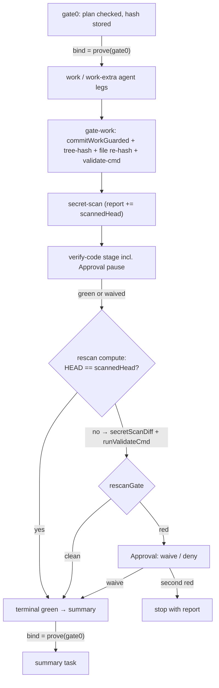

# se-pipeline Batch 5 — Plan Provenance and Approval Rescan - Plan

**Target repo:** my-mac-setup (all paths repo-relative). Working code lives under `home/private_dot_claude/dot_smithers/`.

---

## Goal Capsule

Close the last two accepted risks of the se-pipeline MVP: (1) the stored plan-hash row is unprotected — a mutated `gate0` output row silently passes; (2) commits an operator adds to the run branch during a verify-code Approval pause reach terminal green without secret-scan or validate-cmd. After this work, row tampering parks the run (`BOUND_STALE`) and operator commits are re-scanned and re-validated before green.

Authority: this plan > `docs/se-pipeline.md` runbook > code comments. Stop and surface (do not guess) when: `bind`/`BOUND_STALE` behavior contradicts the Planning Contract; a change requires touching the runtime dir `~/.claude/.smithers` or running `chezmoi apply`; a test needs a live Claude agent. Do not launch nested se-pipeline runs from inside the work; unit tests and transpile are the proof.

---

## Product Contract

### Summary

Add a ProofBinding chain from the gate-0 plan-hash row to the expensive downstream tasks, and a post-approval rescan stage between verify-code green and terminal green that re-runs secret-scan and validate-cmd when the branch HEAD moved during a pause.

### Problem Frame

The work gate re-reads the plan file and re-hashes it (KTD7), but the *stored* hash in the `gate0` output row is trusted blindly — a row mutation (bug, manual sqlite edit, partial restore) would gate work against a stale spec. Separately, the U4–U7 code review flagged (accepted at the time): during a verify-code Approval pause the operator often hand-commits fixes on the run branch before approving; those commits bypass the secret-scan (which scanned `base..HEAD` earlier) and validate-cmd (which ran at the work gate), so a leaked secret or broken build can ride a waive into terminal green — the exact state the pipeline exists to prevent. Smithers 0.28 ships an official provenance mechanism (`ctx.prove` + `bind`) that covers the first gap at the engine level.

### Requirements

Provenance (KTD7):
- R1. Mutation of the persisted gate-0 output row (the plan-hash authority) parks the run as `BOUND_STALE` before any bound task dispatches; it never silently passes a gate.
- R2. Mid-run edits of the plan *file* keep failing the work gate via the existing re-hash — provenance binding complements the file check, it does not replace it.

Approval rescan:
- R3. Commits added to the run branch after the secret-scan stage ran must pass a fresh secret-scan (`base..HEAD`) and a fresh validate-cmd run before the run reaches terminal green.
- R4. A red rescan pauses at an Approval: approve = waive with a note in the summary, deny = fail; a second red on the same stage stops with a report (existing stage rule).
- R5. When HEAD did not move, the rescan is a cheap deterministic no-op green — runs without operator commits behave exactly as today (modulo one extra compute task in the tree).
- R6. The rescan stage is resume-safe: node set is deterministic, all git reads happen inside task closures (never at render), and memoized outputs replay without re-executing.

### Scope Boundaries

- Rescan covers only the path after verify-code green (including its waive path). The work-stage approve path keeps its conditional branch reset; the secret-scan stage's own waive keeps its meaning (operator accepted *that* finding — but commits added later still hit the rescan).
- Out: F3 comparison protocol, deploy/chezmoi changes, upstream smithersai/smithers#1342, `<Worktree>`/jj adoption, changes to `se` CLI.

### Acceptance Examples

- AE1. During a verify-code pause the operator commits a file containing `awsAccessKeyId = "AKIA…"` to the run branch, then approves. Rescan goes red (leak), run pauses; approve → green with a waive note in the summary; deny → run fails.
- AE2. Same setup but the operator commit breaks the validate-cmd. Rescan red (validate), same Approval semantics.
- AE3. No operator commits: rescan compute sees an unmoved HEAD and returns green; gate verdicts and branch state match a pre-Batch-5 run.
- AE4. `sqlite3 smithers.db "UPDATE gate0 SET plan_hash='tampered' …"` on a paused run, then resume: the run parks `waiting-event`/`BOUND_STALE` instead of continuing (verified live once, as a fixture demo — engine behavior, not unit-testable).

---

## Planning Contract

### Key Technical Decisions

- KTD-A. **ProofBinding is row-chain integrity only; the file re-hash stays.** `ctx.prove(table, {nodeId})` digests a persisted output row (SHA-256 of canonical JSON); the engine re-verifies at every render and immediately before every dispatch, and on mismatch parks the run (`BOUND_STALE`) without consuming retries. Nothing in the provenance path reads the filesystem, so it cannot detect plan-file edits — `workGateFn`'s re-read + re-hash remains the file guard (R2).
- KTD-B. **Bind the expensive legs, not every node.** `bind={ctx.prove(outputs.gate0, {nodeId: "gate0"})}` goes on the work attempt tasks (`work`, `work-extra`) and the terminal summary task. Gates and cheap compute stay unbound: each bind adds park surface, and the bound work legs already fence the costly/irreversible actions. `ctx.prove` returns `undefined` until the row exists, and authoring `bind` with `undefined` blocks scheduling (`waiting-bound`) — acceptable, since work renders only after gate-0 exists.
- KTD-C. **Rescan is a `stageBlock` with `waiveOnApprove: true` and a compute attempt (no agent).** The attempt task reads the current worktree HEAD inside its closure; if it equals the threaded scanned SHA it reports clean, otherwise it runs `secretScanDiff(worktree, baseSha)` and `runValidateCmd(validateCmd, worktree, timeout)` and reports both. A new pure `rescanGate` in `gates.ts` turns the report into a verdict (fail-closed on missing/unparseable report, like every other gate). Waive fits the actor: the red is caused by the operator's own commits, mirroring secret-scan waive semantics; the second-pause stop rule comes free from `stageBlock`.
- KTD-D. **SHA-threading via output rows, not new tables.** The secret-scan attempt's report JSON gains a `scannedHead` field (`gitHead(worktree)` at scan time). The rescan attempt reads it with `ctx.outputMaybe("agentReport", {nodeId: "secret-scan"})` (falling back to the `-extra` node), same pattern the summary task already uses. Missing `scannedHead` (older row shape) → rescan treats HEAD as moved (fail-closed, R3).
- KTD-E. **Render purity.** All git/fs reads stay inside Task closures — the workflow body renders on every reconcile; a render-time `gitHead` would both violate determinism and break replay (existing discipline, restated because the rescan tempts a render-time HEAD check).
- KTD-F. **Migration window.** New nodes + `bind` metadata make in-flight runs unresumable (`RESUME_METADATA_MISMATCH`). Land only with no live runs (currently true; the one `running`-marked row from 2026-07-14 is a known orphan).

### High-Level Technical Design



Engine-level (not workflow code): any later mutation of the `gate0` row flips the bound tasks to `bound-stale` and the run to `waiting-event`/`BOUND_STALE` at the next render or dispatch. Memoized (finished) tasks do not re-verify — binding guards scheduling, not history.

### Assumptions

- The verify-code pause is the only pause where operator commits are a realistic path (work-stage approve resets or preserves via envelope; secret-scan waive is an explicit risk acceptance). If operators start hand-committing during *work* pauses, that path needs its own threading — deferred.
- The `scannedHead` addition lives in the secret-scan report JSON string (inside the existing `agentReport` output row), not in a schema column — no new output table; smithers output schemas stay untouched except the summary `stages` list.

---

## Implementation Units

### U1. Pure rescan verdict

**Goal:** `rescanGate` — pure function turning a rescan report into a gate verdict, fail-closed.
**Requirements:** R3, R4, R5.
**Dependencies:** none.
**Files:** `home/private_dot_claude/dot_smithers/workflows/lib/gates.ts`, `home/private_dot_claude/dot_smithers/workflows/lib/gates.test.ts`.
**Approach:** Input is the parsed rescan report: `{ moved: boolean, scan?: SecretScanResult, validateExitCode?: number | null, scannedHead?, currentHead? }`. Verdicts: not moved → green; moved + scan clean + validate 0 → green (with an informational reason naming the new HEAD); leak or scanner error → degraded (mirrors secret-scan gate); validate ≠ 0 or missing pieces when moved → failed. `undefined`/unparseable raw → failed (no result ≠ pass).
**Execution note:** TDD; mirror the existing `#given/#when/#then` style and Russian test names in `gates.test.ts`.
**Test scenarios:**
- not moved → green, no reasons.
- moved, clean scan, validate 0 → green with informational reason.
- moved, scan `found` → degraded, reason contains redacted details slice. Covers AE1.
- moved, scan `error` → degraded (scanner crash is never a pass).
- moved, validate exit 3 → failed with exit code in reason. Covers AE2.
- moved, `validateExitCode: null` (not executed) → failed (canonical-plan KTD3: agent self-report is never ground truth).
- raw `undefined` / invalid JSON → failed.
**Verification:** new tests green in `bun test`, no existing gate tests broken.

### U2. Rescan stage wiring + SHA-threading

**Goal:** thread `scannedHead` from the secret-scan attempt and add the rescan `stageBlock` between verify-code green and terminal green.
**Requirements:** R3, R4, R5, R6.
**Dependencies:** U1.
**Files:** `home/private_dot_claude/dot_smithers/workflows/se-pipeline.tsx`.
**Approach:** (1) Secret-scan attempt report JSON gains `scannedHead: gitHead(staged.worktreePath)` captured inside the task closure. (2) After `code.status === "green"`, insert `stageBlock({ name: "rescan", waiveOnApprove: true, … })`: the attempt is a compute Task (`retries={0}`) that reads the prior scan row, compares `gitHead` now vs `scannedHead` (missing → treat as moved, KTD-D), on moved runs `secretScanDiff` + `runValidateCmd` (same `gate0.validateCmd`/timeout), and reports the U1 input shape; the gate is `rescanGate`. `terminal = "green"` moves inside `rescan.status === "green"`; waive note pushed like the other stages. (3) Summary `stages` loop gains `"rescan"`. All reads inside closures (KTD-E).
**Test scenarios:** unit-level logic lives in U1; this unit's proof is structural — `Test expectation: transpile + full suite -- stage wiring is engine-executed, not unit-testable without a run` — plus scenario docs for the live fixture demos: AE1 (secret in operator commit → red → waive/deny), AE2 (broken validate), AE3 (no commits → no-op green, verdict set matches pre-change run).
**Verification:** `bun test` green; `bun build workflows/se-pipeline.tsx --target=bun` succeeds; AE1–AE3 documented as runnable fixture recipes in the runbook (executed in the acceptance phase, not by unit tests).

### U3. ProofBinding chain from gate-0

**Goal:** engine-level integrity for the stored plan-hash row.
**Requirements:** R1, R2.
**Dependencies:** none (parallel to U2; both touch `se-pipeline.tsx` — land U2 first to avoid conflict churn).
**Files:** `home/private_dot_claude/dot_smithers/workflows/se-pipeline.tsx`.
**Approach:** `const gate0Proof = ctx.prove(outputs.gate0, { nodeId: "gate0" })` (the plan-hash task is `<Task id="gate0">` — not `gate-0`; render-time pure, returns `undefined` until the row exists). Author `bind={gate0Proof}` on the work attempt tasks inside `makeAttempt` for the work stage and on the terminal summary task (KTD-B). Do not remove or weaken `workGateFn`'s file re-hash (R2). Note the park semantics in a comment: mismatch → `BOUND_STALE`, resume after re-producing the authority row.
**Test scenarios:** `Test expectation: transpile only -- bind verification is engine behavior; the unit carries AE4 as a live acceptance recipe` (pause a fixture run at an Approval, mutate `gate0.plan_hash` via sqlite3, resume, expect `waiting-event` + `BOUND_STALE` in `smithers why`).
**Verification:** `bun test` green, transpile green, AE4 recipe written into the runbook.

### U4. Runbook and summary docs

**Goal:** operator-facing truth catches up.
**Requirements:** R3, R4 (semantics table), R1 (BOUND_STALE recovery).
**Dependencies:** U1–U3.
**Files:** `docs/se-pipeline.md`.
**Approach:** approve-semantics table gains the rescan row (waive = accept own commits; second red = stop); "Известные ограничения" drops the approval-rescan item (остаток ревью п.1) and gains the memoization caveat (finished tasks don't re-verify binds); a short "BOUND_STALE" recovery note (what parked it, `smithers why`, re-produce authority or revert the row); AE1–AE4 fixture recipes.
**Test scenarios:** Test expectation: none -- docs-only unit.
**Verification:** runbook sections present; no stale claims about unscanned operator commits remain.

---

## Verification Contract

From the repo root (`my-mac-setup`):

```bash
cd home/private_dot_claude/dot_smithers && bun install --frozen-lockfile && bun test
cd home/private_dot_claude/dot_smithers && bun build workflows/se-pipeline.tsx --target=bun --outfile=/tmp/se-pipeline-batch5.js
```

Both must exit 0. `bun test` covers U1 plus the whole existing suite (76 tests before this work — regressions there are failures of this plan). No live-agent or full-pipeline runs are part of the contract; AE1–AE4 are operator-run acceptance recipes.

---

## Definition of Done

- U1–U4 complete; all listed test scenarios implemented and green; Verification Contract commands exit 0.
- No behavior change for runs without operator commits beyond the extra rescan compute node (AE3).
- `workGateFn` file re-hash intact (R2); `bind` present on work legs and summary (R1).
- Runbook updated (U4); AE1–AE4 recipes documented.
- No dead or experimental code left from abandoned approaches; comments follow the constraint-only policy.

---

## Sources & Research

- Provenance API (research pass, 2026-07-16, against installed 0.28.0): `ProofBinding` type — `node_modules/@smithers-orchestrator/graph/src/ProofBinding.d.ts`; `prove`/`boundStale` — `node_modules/@smithers-orchestrator/driver/src/SmithersCtx.js` (~270–328); digest/verify — `driver/src/provenance.js`, `engine/src/provenance.js`; dispatch-time re-verify and `BOUND_STALE` park — `engine/src/engine.js` (~7185, ~7059); memoized-replay-wins — `engine.js` (~7151): finished tasks never re-verify. Usage chapter: `node_modules/smithers-orchestrator/docs/llms-full.txt` ("Provenance binding").
- Approve-path mechanics: `home/private_dot_claude/dot_smithers/workflows/se-pipeline.tsx` — `stageBlock` (~247–340), secret-scan/verify-code wiring (~495–590), summary threading (~590–630).
- Prior decisions: `docs/plans/2026-07-14-001-feat-smithers-pipeline-plan.md` (KTD3, KTD5, KTD7, KTD10, остаток ревью U4–U7 п.1), `docs/plans/2026-07-16-se-pipeline-0.28-migration-handoff.md`.
