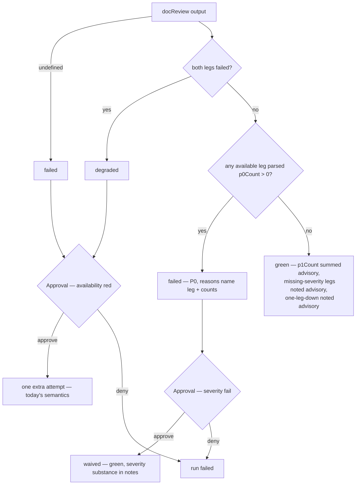

# Verify-Doc Blocking Gate on P0 Findings - Plan

## Goal Capsule

- **Objective:** make se-pipeline's `docReviewGate` block on P0-grade plan-review findings, mirroring the proven `codeReviewGate` pattern, while keeping the free-form markdown envelope contract intact.
- **Authority:** this plan > `docs/se-pipeline.md` runbook conventions > existing code comments. The origin requirements doc is the product contract; its tolerance rule (unparseable severity → advisory, never fail the leg) overrides the pipeline-wide fail-closed instinct for the severity layer only.
- **Stop conditions:** evidence that the SEVERITY-line prompt addition causes envelope schema failures (silent whole-leg re-run loops) in real legs → stop and surface; any change that would weaken the existing leg-availability fail-closed checks → stop.
- **Execution profile:** TDD for parser and gate logic (pure functions with existing test files); smoke-first for pipeline wiring.
- **Prerequisite:** the uncommitted 2026-07-24 diff (`readDocReviewAdvisory`, `extractValidateCmd`, full-runId `reportDir`) must be committed before execution starts (see Risks & Dependencies).

---

## Product Contract

### Summary

verify-doc's two review legs (claude + opencode) return free-form markdown envelopes; the gate only checks the legs ran. A P0-grade flaw in a plan review cannot stop the pipeline. This plan adds a machine-readable severity summary line inside each envelope, threads it through the stage output schemas, and teaches `docReviewGate` to block on parsed P0 — with an operator waive path and tolerant degradation to today's behavior when the summary is missing or unparseable.

### Problem Frame

The pipeline's two review stages have asymmetric gate power. verify-code returns structured JSON and `codeReviewGate` blocks on `p0Count > 0` (KTD3 of `docs/plans/2026-07-14-001-feat-smithers-pipeline-plan.md`) — proven in run-1784221992328, which paused on 3×P0 before landing. verify-doc's content gate was a deliberate MVP scope-cut in that same KTD3 ("контентный гейт по находкам — вне MVP"). This plan promotes the deferred content gate now that the P0-blocking pattern is proven. The 2026-07-24 mitigation (`readDocReviewAdvisory` threading envelopes into the work prompt) makes findings visible to the work agent but gives the deterministic gate no power to act on them.

### Requirements

Severity contract:

- R1. Each non-smoke review leg emits a machine-readable severity summary (`maxSeverity`, `p0Count`, `p1Count`) alongside — not instead of — the markdown envelope; smoke-mode severity may be injected into stage output fields for fixture verification (KTD-F).
- R2. The existing envelope validity contract (`≥500` chars, last line `Review complete`, `SMOKE OK` bypass) stays unchanged; the severity layer never affects envelope validity.

Gate semantics:

- R3. `docReviewGate` fails when any available leg reports a parsed `p0Count > 0`; P1 counts are advisory (attached to the verdict, never blocking) — same blocking semantics as `codeReviewGate`, though the extraction surface differs and is riskier (KTD-B).
- R4. Two-leg disagreement resolves fail-closed: the max severity across available legs wins (one leg's parsed P0 blocks even if the other reports zero).
- R5. Missing or unparseable severity summary degrades to today's leg-availability-only behavior for that leg — it never fails the leg or the gate by itself. Leg availability itself stays fail-closed (both legs down → `degraded`, unchanged).

Operator path:

- R6. verify-doc gains a waive path scoped to severity-produced fails: operator approve waives the P0 and continues; the waiver — including the severity substance, not just the decision — lands in the durable run notes. Leg-availability reds (crash `failed`, both-legs-down `degraded`) keep today's approve = one-extra-attempt semantics and are not waivable on first approve.

Verification:

- R7. `gates.test.ts` covers: P0 blocks, P1 advisory, severity missing → today's behavior, legs disagree (max-of-legs).
- R8. A fixture smoke run with an injected P0 summary pauses at `gate-verify-doc`.

### Scope Boundaries

- Out of scope: independent verification of self-reported severity counts (same accepted risk as verify-code, `docs/se-pipeline.md:344`); the compensating control remains the F3 comparative phase.
- Out of scope: prose-vs-summary cross-checking. The machine line is authoritative; a leg whose prose describes a blocker but whose summary says `p0Count: 0` slips the gate.
- Out of scope: P1-threshold blocking. P1 stays advisory regardless of count.
- Deferred to follow-up work: severity summaries for the standalone `se-doc-review` skill synthesis flow beyond the one-line SEVERITY-strip note (U6); `se-code-review`'s standalone skill is untouched by this plan.

---

## Planning Contract

### Key Technical Decisions

- KTD-A. **SEVERITY line lives inside the envelope text**, immediately before the final `Review complete` line — not a second field in the final-JSON wrapper. The `{"envelope": "..."}` wrapper is a fixed one-field contract shared with code-review, and strict JSON-only contracts on CLI review legs are the documented failure that made the envelope free-form (KTD14 of the 2026-07-14 plan; invalid envelopes trigger silent whole-agent re-runs, `docs/se-pipeline.md:160-162`). A third option — making the doc leg's whole payload structured JSON like verify-code's — is also rejected: the free-form markdown envelope is itself the product (skill synthesis and `readDocReviewAdvisory` consume it), and changing the legs' content type would break those consumers for no gate benefit.
- KTD-B. **Parser reads one protected location only**: the last non-empty line immediately before the terminal `Review complete` line. If that line does not start with `SEVERITY: `, or its JSON fails to parse (try/catch; counts must be non-negative integers), return `undefined` — never a throw, and never a scan of the envelope body. Rationale: review envelopes quote prose, suggested edits, and (in reviews of this very feature) literal `SEVERITY:` examples — a position-independent last-match scan is spoofable by a later decoy line zeroing out a real P0. Restricting to the protected slot makes decoys inert; a misordered trailing pair degrades to `undefined` → advisory, the designed fail-open behavior (KTD-D). `reviewSchema.refine` stays untouched (R2).
- KTD-C. **Severity fields are optional additions to both stage schemas** (`outputSchema` in `se-doc-review.tsx`, its mirror `docReviewSchema` in `se-pipeline.tsx`, kept in sync). Optional keeps old persisted outputs valid on resume (back-compat) and means the gate receives severity with no plumbing change — `gateFn` already gets the full serialized docReview output.
- KTD-D. **Tolerance layering:** leg availability stays fail-closed (existing ladder: no output → `failed`, both legs down → `degraded`); only the new, additive severity layer degrades to advisory when unparseable. This deliberately diverges from the blanket "degraded is never a silent pass" convention (KTD3, 2026-07-14 plan) and is safe because the severity layer strictly adds blocking power — its absence returns the gate to exactly today's behavior, never below it. To keep systemic parse failure observable rather than silently inert, every run surfaces per-leg severity-parse status (parsed / missing) in the run notes and `verify-doc.result.json`.
- KTD-E. **Waive is predicate-scoped and carries substance:** verify-doc's `stageBlock` gets a waive predicate over the gate verdict instead of a bare `waiveOnApprove: true`. Approve waives only severity-produced fails (parsed P0); crash `failed` and both-legs-down `degraded` keep the existing approve = one-extra-attempt path — a blanket flag would let a transient double-timeout be waived into a run with no doc review at all, weakening leg-availability handling. A waived P0 spec flaw exists only in `/tmp` envelope files that `readDocReviewAdvisory` reads fail-soft — a resume after tmp-cleanup would silently lose it. The waive note therefore embeds the per-leg severity summaries, gate reasons, and a trimmed excerpt of the P0 findings read fail-soft from the envelope files (durable via `summary.notes`) — content, not just the decision.
- KTD-F. **Smoke severity injection:** smoke legs return `SMOKE OK` and never emit a SEVERITY line, so R8 is unreachable without a test-only injection input that the se-doc-review output task stamps into the severity fields in smoke mode. Without it the spec's own verification step is unimplementable. Injection proves gate and waive wiring end-to-end; it deliberately bypasses parsing, so parser correctness against real envelopes is proven by the U1 fixture tests and the U2 wiring test, not by the smoke run.

### High-Level Technical Design

Gate decision ladder after the change (severity checks are additive — everything above them is today's behavior):

Data flow: leg prompt (`reviewPrompt` extraRules) → envelope with `SEVERITY: {...}` line → se-doc-review output task parses per leg (`parseSeveritySummary`) → optional `claudeSeverity`/`opencodeSeverity` in stage output → `docReviewSchema` roundtrip → `docReviewGate` → `stageBlock` waive predicate → notes + `verify-doc.result.json` (severity fields surface there automatically).

### Assumptions

- Both-legs-severity-missing → green advisory-only is accepted (a real but unparseable double-P0 passes); only parsed P0 blocks, per the origin doc's tolerance rule.
- The SEVERITY line leaking into `readDocReviewAdvisory`'s work-prompt injection and the standalone skill's synthesis is low-harm; U4/U6 strip it as hygiene, not correctness.

### Risks & Dependencies

- **Prerequisite (blocking):** the working tree carries the `readDocReviewAdvisory`, `extractValidateCmd`, and full-runId `reportDir` fixes uncommitted. Commit that diff before U1 starts; do not execute this plan via se-pipeline until it is on committed HEAD — a durable run builds its worktree from committed state and would silently build against code missing these fixes.
- **Prompt-contract violation:** an LLM leg may omit or malform the SEVERITY line; the gate then silently loses blocking power for that leg (by design, R5). Residual risk accepted — mirrors the unverified self-report risk of verify-code.
- **Envelope regression:** the new prompt line is the only change touching envelope generation; if legs start failing `reviewSchema.refine`, the cost is silent re-runs inside the same attempt. KTD-B minimizes this by leaving the refine untouched; a misordered trailing pair costs only the severity layer (advisory fallback), never envelope validity. The U5 smoke run plus one real leg observation is the check.

---

## Implementation Units

### U1. Severity summary contract and tolerant parser

- **Goal:** define the SEVERITY line format, teach the leg prompt to emit it, and parse it tolerantly.
- **Requirements:** R1, R2, R5 (parser side); KTD-A, KTD-B.
- **Dependencies:** none.
- **Files:** `home/private_dot_claude/dot_smithers/workflows/lib/severity-summary.ts` (new), `home/private_dot_claude/dot_smithers/workflows/lib/severity-summary.test.ts` (new), `home/private_dot_claude/dot_smithers/workflows/se-doc-review.tsx` (`reviewPrompt` extraRules).
- **Approach:** `parseSeveritySummary(envelope: string)` returns `{ maxSeverity, p0Count, p1Count } | undefined`. Protected-slot extraction per KTD-B: only the last non-empty line before the terminal `Review complete` line is considered; JSON in try/catch; counts must be non-negative integers, `maxSeverity` a loose uppercased string — anything else → `undefined`. Prompt addition to extraRules: emit exactly one `SEVERITY: {"maxSeverity":"P0|P1|P2|none","p0Count":N,"p1Count":N}` line immediately before the final `Review complete` line, matching the highest severity present in the review prose; severity parsing never affects envelope validity. The prompt change lands in `reviewPrompt`'s extraRules in `se-doc-review.tsx`, not `lib/consult-prompt.ts` — the shared hard rules serve both review workflows and the severity line is doc-review-specific; this satisfies the origin doc's consult-prompt-contract requirement through the layer that actually owns the envelope contract. Export `reviewSchema` from `se-doc-review.tsx` (or lift it into `lib/`) so the refine regression test exercises the real schema, not a copy.
- **Execution note:** implement the parser test-first; it is a pure function with clear fixtures.
- **Patterns to follow:** `parseLeg` in `workflows/lib/review-merge.ts` (try/catch → mark failed, never throw); `severityCount` in `workflows/lib/gates.ts` (tolerant uppercased string matching).
- **Test scenarios:**
  - Valid SEVERITY line in the protected slot (last non-empty line before terminal `Review complete`) → parsed values returned.
  - No SEVERITY line (including `SMOKE OK` envelopes) → `undefined`.
  - Malformed JSON after the prefix, or non-numeric/negative counts → `undefined`.
  - Realistic multi-section envelope fixture — headings, quoted suggested edits, a code fence containing a decoy `SEVERITY:` string, real line in the protected slot → real line parsed, decoys inert.
  - Decoy `SEVERITY:` lines in the body but protected slot empty or non-SEVERITY → `undefined` (decoys never win).
  - SEVERITY line after `Review complete` (misordered trailing pair) → `undefined` (fail-open to advisory, KTD-B).
  - Envelope with SEVERITY line in the slot still ends with `Review complete` → passes the exported real `reviewSchema.refine` (regression guard for R2).
- **Verification:** `bun test workflows/lib/severity-summary.test.ts` green; refine regression case green.

### U2. Thread severity through the stage output schemas

- **Goal:** per-leg severity lands in the doc-review stage output and survives the pipeline's schema roundtrip.
- **Requirements:** R1; KTD-C, KTD-F.
- **Dependencies:** U1.
- **Files:** `home/private_dot_claude/dot_smithers/workflows/se-doc-review.tsx` (output task + `outputSchema`), `home/private_dot_claude/dot_smithers/workflows/se-pipeline.tsx` (`docReviewSchema` mirror).
- **Approach:** output task calls `parseSeveritySummary` on each leg's envelope and sets optional `claudeSeverity` / `opencodeSeverity` fields (`{ maxSeverity: string, p0Count: number, p1Count: number }`). Both schemas gain the same optional fields — keep them in sync (they are a declared mirror pair). Smoke injection (KTD-F): an optional workflow input (e.g. `smokeSeverity`) that the output task stamps into both severity fields when running in smoke mode, bypassing envelope parsing.
- **Test scenarios:**
  - Wiring test (real parse path, not injection): output task fed a real envelope file containing a SEVERITY line in the protected slot → `claudeSeverity`/`opencodeSeverity` populated.
  - Output with severity fields survives `JSON.stringify`/`JSON.parse` roundtrip and validates against `docReviewSchema`.
  - Output without severity fields (old shape) still validates — back-compat for resumed runs.
  - Smoke mode with `smokeSeverity` input → fields stamped; without it → fields absent.
- **Verification:** `bun test` green; schema parity between the two files confirmed by test or direct comparison.

### U3. docReviewGate severity blocking

- **Goal:** the gate blocks on parsed P0, advisory on P1, degrades to today's behavior when severity is missing.
- **Requirements:** R3, R4, R5; KTD-D.
- **Dependencies:** U2 (field names).
- **Files:** `home/private_dot_claude/dot_smithers/workflows/lib/gates.ts` (`DocReviewStageOutput`, `docReviewGate`), `home/private_dot_claude/dot_smithers/workflows/lib/gates.test.ts`.
- **Approach:** extend `DocReviewStageOutput` with the optional per-leg severity fields. Ladder order preserved: no output → `failed`; both legs failed → `degraded` (severity never consulted); any available leg with parsed `p0Count > 0` → `failed`, reasons naming the leg and counts; otherwise `green` with `p1Count` summed across available legs and advisory reasons for each leg whose severity is missing. Failed verdicts carry a machine-readable cause marker (extend `GateResult` with e.g. `cause: "severity" | "availability"`) so the U4 waive predicate keys on it instead of parsing reason strings. Pure predicate — no I/O, mirroring `codeReviewGate`.
- **Execution note:** extend the existing `describe("docReviewGate")` block test-first; keep the four current tests passing unchanged.
- **Patterns to follow:** `codeReviewGate` (`p0Count > 0` → failed with `p1Count` attached); existing docReviewGate fixtures in `gates.test.ts:76-97`.
- **Test scenarios:**
  - Covers R3: one leg `p0Count: 1`, other `p0Count: 0` → `failed` (fail-closed max, also covers R4).
  - Both legs report P0 → `failed`, reasons name both legs.
  - P1-only counts → `green`, `p1Count` equals the sum, no blocking.
  - Covers R5: both legs ok, both severity fields absent → `green` (today's behavior), advisory reason noting severity unavailable.
  - One leg failed (no envelope), surviving leg P0 → `failed`.
  - One leg failed, surviving leg severity missing → `green` with both advisory reasons.
  - Both legs failed → `degraded` regardless of any severity fields (existing behavior preserved).
  - `undefined` input → `failed` (existing test unchanged).
  - Cause marker: P0 fail carries `cause: "severity"`; no-output and both-legs-down verdicts carry `cause: "availability"`.
- **Verification:** `bun test workflows/lib/gates.test.ts` green, including the four pre-existing docReviewGate tests.

### U4. Pipeline wiring: waive path, notes, advisory hygiene

- **Goal:** operator can waive a doc-review P0 with the substance durably recorded; SEVERITY machine lines stay out of the work prompt.
- **Requirements:** R6; KTD-E.
- **Dependencies:** U3.
- **Files:** `home/private_dot_claude/dot_smithers/workflows/se-pipeline.tsx` (verify-doc `stageBlock` options, notes branch, `readDocReviewAdvisory`), `docs/se-pipeline.md` (runbook).
- **Approach:** extend `stageBlock` with a waive predicate over the gate verdict (e.g. `waiveOn: (verdict) => verdict.cause === "severity"`); verify-doc passes it so approve waives only parsed-P0 fails while `cause: "availability"` reds keep the existing extra-attempt path (KTD-E). Verify-code's existing `waiveOnApprove: true` behavior stays untouched (a blanket predicate). Waive notes branch embeds per-leg severity summaries, gate reasons, and a trimmed fail-soft excerpt of the P0 findings from the envelope files. Push a per-leg severity-parse status line into run notes on every run (KTD-D observability). Strip `SEVERITY:` machine lines in `readDocReviewAdvisory` before injecting envelopes into the work prompt. Runbook: document the new gate semantics (P0 blocks, P1 advisory, missing → advisory-only), the waive-predicate split, the waive recipe, and the tolerance-layering rationale (KTD-D).
- **Test scenarios:** Test expectation: minimal unit coverage — if `readDocReviewAdvisory` is exportable, one test that SEVERITY lines are stripped from the advisory block; the waive branch and notes content are proven by the U5 smoke run, not unit tests (they live inside workflow wiring).
- **Verification:** `bun test` green; runbook section present; U5 smoke run shows the waive note with severity substance in `summary.notes`.

### U5. Fixture smoke: injected P0 pauses the pipeline

- **Goal:** prove end-to-end that a P0 severity summary parks the run at `gate-verify-doc` and that approve waives with a durable note.
- **Requirements:** R8; KTD-F.
- **Dependencies:** U2, U3, U4.
- **Files:** `home/private_dot_claude/dot_smithers/workflows/se-pipeline.tsx` (plumb the smoke severity injection through to the verify-doc stage), `tests/fixtures/make-pipeline-fixture.sh` (only if the fixture needs a knob), `docs/se-pipeline.md` (smoke recipe).
- **Approach:** expose the U2 `smokeSeverity` input at the pipeline level (flag or env var on the smoke path). Run the fixture with `p0Count: 1` injected: expect `waiting-approval` at `gate-verify-doc`; approve → run continues green with the waive note; `verify-doc.result.json` in the report dir carries the severity fields. Also run the fixture without injection: expect green pass-through (regression).
- **Test scenarios:** Test expectation: none as unit tests — this unit is the smoke verification itself (injected P0 pauses; approve waives; no-injection run stays green).
- **Verification:** both fixture runs behave as described; recipe recorded in the runbook.

### U6. Standalone skill synthesis hygiene

- **Goal:** the standalone se-doc-review skill's human-facing synthesis does not echo raw SEVERITY machine lines.
- **Requirements:** supports R1 rollout cleanliness; Assumptions item 2.
- **Dependencies:** U1 (line format exists).
- **Files:** `home/private_dot_claude/skills/se-doc-review/SKILL.md` (Phase 5 synthesis instructions).
- **Approach:** one instruction line: strip `SEVERITY:` machine lines from synthesized output; they are pipeline gate input, not review content.
- **Test scenarios:** Test expectation: none — prose instruction in a skill doc.
- **Verification:** SKILL.md carries the instruction.

---

## Verification Contract

| Gate | Command | Proves |
|---|---|---|
| Unit tests | `cd home/private_dot_claude/dot_smithers && bun test` | U1–U3 logic, schema back-compat, refine regression guard (R1, R2, R3, R4, R5, R7) |
| Smoke: P0 pause | fixture run with injected `p0Count: 1` (U5 recipe, `docs/se-pipeline.md`) | R8 — run parks `waiting-approval` at `gate-verify-doc`; approve → waive note with substance (R6) |
| Smoke: pass-through | fixture run without injection | No regression — green end-to-end, severity fields absent, gate behaves as today |

Primary validate command for pipeline gate-0: `cd home/private_dot_claude/dot_smithers && bun test`.

---

## Definition of Done

- All `bun test` suites green in `home/private_dot_claude/dot_smithers`, including the four pre-existing docReviewGate tests unchanged and the new U1/U2/U3 cases.
- Both U5 fixture smoke runs verified and their recipe recorded in `docs/se-pipeline.md`.
- Runbook documents the new gate semantics, waive-predicate split, waive recipe, and KTD-D tolerance layering.
- Per-leg severity-parse status visible in run notes and `verify-doc.result.json`.
- Prerequisite diff committed before execution started (Goal Capsule prerequisite honored).
- Old-shape doc-review outputs (no severity fields) still validate and gate exactly as today.
- No abandoned experimental code in the diff; SEVERITY-strip hygiene present in `readDocReviewAdvisory` and the standalone SKILL.md.
