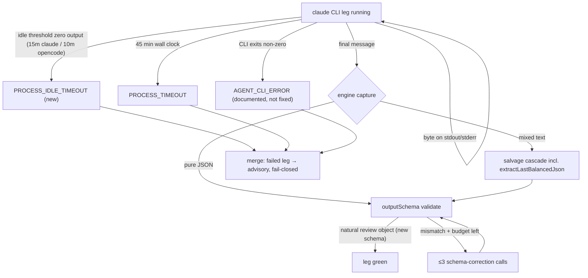

# Review-Leg Idle Timeout and Report Schema Unwrap - Plan

## Goal Capsule

The external claude review leg has died two ways in two days: run `9925bb0d` burned the full 45-min `timeoutMs` cap (`PROCESS_TIMEOUT`) after the CLI went silent for 10+ minutes, and run `89938dd6` failed both attempts with `AGENT_CLI_ERROR` (the CLI itself exited non-zero mid-review). Fix two things the workflow controls: (A) wire the engine's existing `idleTimeoutMs` into the review agent profiles so a silent CLI dies at the idle threshold (~15 min) instead of 45; (B) drop the `{"report": "<stringified JSON>"}` double-wrap on the code-review legs — opportunistic contract hygiene, not a fix for an observed death: no logged incident is attributed to the wrapper, but it fights the agent's natural output shape and blocks the engine's built-in JSON salvage from landing. Both changes live in `home/private_dot_claude/dot_smithers/workflows/`.

Explicitly NOT a goal: rescuing `AGENT_CLI_ERROR` crashes (a dead CLI process has no output to salvage — that failure class is documented, not fixed, here).

---

## Product Contract

### Summary

Review legs (claude + opencode) in se-code-review, se-doc-review, and the se-pipeline verify stages get a fast stall kill, and the code-review output contract stops fighting the agent's natural output shape.

### Problem Frame

- A stalled claude CLI produces zero output but stays alive; the only kill today is the hard 45-min `timeoutMs`. The engine's spawn layer already implements an idle timer (`PROCESS_IDLE_TIMEOUT`, reset on every stdout/stderr byte) — our `AGENT_PROFILES` simply never set `idleTimeoutMs`.
- The code-review legs demand `{"report": "<the whole plugin review JSON as an escaped string>"}`. The plugin naturally emits the raw review object; the double-wrap can turn a correct review into a capture failure (KTD14 risk class — no logged incident is attributed to the wrapper to date; this is hygiene, not incident response). The engine already runs a 5-strategy salvage cascade ending in `extractLastBalancedJson` plus up to 3 schema-correction calls — but salvage lands on the raw object, which then fails the wrapper schema.

### Requirements

- R1. `AGENT_PROFILES.codeReview`, `.docReview`, `.opencodeReview` carry `idleTimeoutMs`, forwarded by `makeClaudeReviewAgent` and `makeOpencodeReviewAgent` to the agent constructors. The `work` profile does NOT get an idle timeout.
- R2. Idle values: 15 minutes for the claude profiles (`codeReview`, `docReview`), 10 minutes for `opencodeReview` (its total cap is 15 min); each strictly less than its profile's `timeoutMs`. Values are provisional until U1's healthy-gap measurement confirms the observed healthy inter-chunk silence ceiling sits below them. (Bun floors configured idle values to ≥5s — irrelevant at this scale.)
- R3. Retry policy is unchanged: `codeReview.retries` stays 0 (budget-incident decision, commit 566c321), `docReview`/`opencodeReview` stay 1. An idle-killed docReview attempt (~10 min) plus a full retry (~25 min) still fits the 55-min verify-doc Subflow cap.
- R4. The code-review leg `outputSchema` accepts the plugin's natural review shape — a JSON object with a string `status` field, extra fields passed through — replacing the `{report: string}` wrapper. The schema is defined once in `workflows/lib/` and imported by both se-code-review and the se-pipeline verify-code legs (no hand-mirrored copies).
- R5. The claude code-review leg's injected `--json-schema` payload matches the new shape (object with required `status`), scoped to `profile: 'codeReview'` only — `makeWorkAgent`'s `{report: string}` wrapper and the docReview `{envelope}` wrapper are untouched.
- R6. `mergeReviewReports`/`parseLeg` and the report-to-disk output tasks consume the new shape with the existing fail-closed contract intact: parse failure never throws, a failed leg yields a `failed` verdict, single-leg survival stays an advisory merge.
- R7. The se-doc-review envelope contract is untouched: `{"envelope": "<free-form markdown>"}` stays as-is (KTD-A of the 2026-07-24-002 plan; KTD14).
- R8. `bun test` green from `home/private_dot_claude/dot_smithers`; existing cap invariants hold (budget fits inside timeout; Subflow ≥ 2× longest leg).

### Scope Boundaries

Deferred to follow-up work:
- Root-causing the `AGENT_CLI_ERROR` crash class (why the claude CLI exits non-zero on huge-diff sessions). This plan only documents the taxonomy.
- Any stall-scoped retry mechanism (smithers retries are cause-blind; see KTD-C).
- Idle timeout for the `work` profile.
- Severity parsing / doc-review gate changes (owned by the 2026-07-24-002 plan, currently executing in pipeline run-1784891845176).

---

## Planning Contract

### Key Technical Decisions

- **KTD-A. Native `idleTimeoutMs`, no wrapper scripts.** (session-settled: user-directed — chosen over a PATH-shadow wrapper that kills the CLI on stdout silence: `BaseCliAgentOptions.idleTimeoutMs` is already wired end-to-end into the spawn layer's idle timer; the fix is plumbing one number, not building a watchdog.)
- **KTD-B. Idle values 15 min (claude) / 10 min (opencode), review profiles only, provisional until measured.** The single observed stall is thin evidence for a threshold: a healthy leg can also produce zero bytes for a while (rate-limit backoff, one long API call, doc-review's 12-17-min subagent phases have no inter-chunk-gap telemetry), and with `codeReview.retries: 0` a false idle-kill irrecoverably discards a live review. So the values sit above the observed pathological floor, and U1 carries a grounding step: measure inter-chunk gaps from healthy run logs (timestamped `AgentTraceEvent` lines) before finalizing; raise the values if the healthy ceiling crowds them. The `work` leg is excluded — long locally-silent commands (installs, test suites) are legitimate there.
- **KTD-C. Retry policy untouched.** Smithers `retries` is a cause-blind Task prop; there is no way to retry only idle-kills. Raising `codeReview.retries` above 0 would reopen the 2026-07-23 budget incident (deterministic failure re-billed per attempt, runs 89938dd6/07ffc75d). Accepted degradation: an idle-killed codeReview leg fails fast and the merge proceeds single-leg advisory — strictly better than today (same outcome, 35 minutes sooner).
- **KTD-D. Unwrap the report contract instead of adding a salvage parser.** (session-settled: user-directed — chosen over the originally proposed custom "extract last JSON object" parser: the engine already implements that exact salvage (`extractLastBalancedJson`, 5-strategy cascade, `maxSchemaRetries` default 3 correction calls), so a workflow-side parser is dead code. The productive change is removing the double-wrap so natural output and salvage output both validate.) Honesty note: this is opportunistic contract cleanup, not incident response — neither observed death is fixed by it (`89938dd6` was a CLI crash with no final message to parse; `9925bb0d` was a stall), and no logged capture failure is attributed to the wrapper. The payoff is removing a documented risk class (KTD14) and simplifying the contract, priced accordingly (small, test-covered change).
- **KTD-E. `maxSchemaRetries` left at default 3.** The engine's budget guard already skips correction calls at zero remaining budget; no explicit prop needed.

### High-Level Technical Design

### Assumptions

- The healthy-leg inter-chunk silence ceiling is below 15 min (claude) / 10 min (opencode). This is unmeasured at plan time — U1's grounding step measures it from existing run logs before the values are final. If a false positive ever shows up post-land, the remedy is a one-line profile value change.
- `OpenCodeAgent` honors `idleTimeoutMs` identically (both agents extend `BaseCliAgentOptions`; both spawn paths carry the idle timer pair).
- The plugin's `mode:agent` review JSON keeps a stable top-level string `status` field — `parseLeg` already depends on this today after unwrapping.

### Risks & Dependencies

- **Concurrent pipeline run.** Pipeline run-1784891845176 (verify-doc gate plan) is landing a branch that edits `se-pipeline.tsx` and `gates.ts`. This plan touches `agents.ts`, `se-code-review.tsx`, `review-merge.ts`, and the verify-code leg schema in `se-pipeline.tsx` — merge/rebase this plan's branch after that run's branch lands to avoid conflicting edits to `se-pipeline.tsx`.
- **On-disk report shape changes.** The se-code-review skill synthesis reads the leg reports from `/tmp/ce-code-review/run-*/out/`. U2 must keep the disk artifact a self-contained JSON document (serialize the raw object) and confirm the skill's consumption path doesn't assume the wrapper.
- Reap lag: `timeoutMs`/idle kills reach the caller with up to ~13 min lag (documented quirk); caller wait caps already account for it, idle-kill only shortens the timeline.

---

## Implementation Units

### U1. Wire idleTimeoutMs into review agent profiles

**Goal:** A silent review CLI dies in ~10 minutes with `PROCESS_IDLE_TIMEOUT` instead of burning the full hard cap.

**Requirements:** R1, R2, R3.

**Dependencies:** none.

**Files:**
- `home/private_dot_claude/dot_smithers/workflows/lib/agents.ts`
- `home/private_dot_claude/dot_smithers/workflows/lib/agents.test.ts`

**Approach:** Add `idleTimeoutMs: 15 * 60_000` to `codeReview` and `docReview`, and `idleTimeoutMs: 10 * 60_000` to `opencodeReview` in `AGENT_PROFILES`; leave `work` without it. Forward the field in `makeClaudeReviewAgent` and `makeOpencodeReviewAgent` constructor options. No Task-level changes — retries and Task `timeoutMs` overrides stay as they are.

**Execution note:** Before finalizing the values, ground them: extract inter-chunk gaps from at least one healthy claude review leg's run log (timestamped `AgentTraceEvent` lines in `~/.claude/.smithers/logs/` / `smithers logs <runId>`), including a doc-review leg's subagent phase. If the observed healthy ceiling approaches the chosen value for a profile, raise that profile's value and record the measurement in the commit message.

**Patterns to follow:** existing `AGENT_PROFILES` invariant tests in `agents.test.ts` (budget-fits-timeout, codeReview-never-retries).

**Test scenarios:**
- Every review profile has `idleTimeoutMs` set and `idleTimeoutMs < timeoutMs` (per-profile values, not one constant).
- `work` profile has no `idleTimeoutMs`.
- Factory-built agents carry their profile's idle value (assert on constructed instance options/fields).
- Existing invariants (budget fits timeout; codeReview retries 0) still pass unchanged.

**Verification:** `bun test` green; a stalled claude leg in a future run is expected to fail with `CLI idle timed out after 900000ms` rather than `CLI timed out after 2700000ms`.

### U2. Unwrap the code-review report contract to the natural review object

**Goal:** The code-review legs' output contract matches what the plugin actually emits, so native structured output and engine salvage both validate without the stringified-JSON indirection.

**Requirements:** R4, R5, R6, R7.

**Dependencies:** none (independent of U1).

**Files:**
- `home/private_dot_claude/dot_smithers/workflows/lib/review-schema.ts` (new — single source of the natural-shape leg schema)
- `home/private_dot_claude/dot_smithers/workflows/se-code-review.tsx`
- `home/private_dot_claude/dot_smithers/workflows/se-pipeline.tsx` (verify-code legs: new output key + merge call site)
- `home/private_dot_claude/dot_smithers/workflows/lib/agents.ts` (codeReview-scoped json-schema payload)
- `home/private_dot_claude/dot_smithers/workflows/lib/review-merge.ts`
- `home/private_dot_claude/dot_smithers/workflows/lib/review-merge.test.ts`

**Approach:** Define the natural-shape schema once in `lib/review-schema.ts` — object with required string `status`, all other fields passed through (no deep findings validation; the merge layer stays the tolerant consumer) — and import it in both workflows; no hand-mirrored copies. Three scoping constraints discovered at review time:
- **se-pipeline output keys:** the verify-code legs currently emit the shared `agentReport` key (`{report: string}`), which the work leg, secret-scan, rescan, and merge nodes also use. Register a NEW output-schema key (e.g. `reviewLeg`) for the two verify-code legs; `agentReport` stays untouched for every other node.
- **Merge call site, not `parseLeg`:** `parseLeg` already parses the review object itself from its string arg with one `JSON.parse` and needs NO change. The edit is where `raw` is sourced (today `claudeOut?.report`): feed the unwrapped leg object re-serialized (`JSON.stringify`) into `ReviewLeg.raw`, preserving parseLeg's string contract and try/catch fail-closed behavior.
- **json-schema scoping:** branch `makeClaudeReviewAgent` so only `profile: 'codeReview'` emits the natural-object `--json-schema` payload; `docReview` keeps the `{envelope}` wrapper (R7), and `stringFieldJsonSchema('report')` stays untouched for `makeWorkAgent`.

Adapt the report-to-disk output tasks to serialize the object as a standalone JSON document at the same paths. Doc-review (`envelope` field) is explicitly not touched.

**Patterns to follow:** `parseLeg` in `review-merge.ts` (never throw, failed verdict on any parse problem); the tolerant-consumer stance from `mergeReviewReports`.

**Test scenarios:**
- Shared schema: raw plugin object with extra unknown fields validates; object without `status` fails validation; both workflows import the same export (no duplicate literals).
- Merge call site: unwrapped leg object → serialized into `ReviewLeg.raw` → `parseLeg` parses it, verdict preserved (`parseLeg` itself unchanged).
- `parseLeg` with malformed/absent input → `failed` leg verdict, no throw (existing behavior, regression-guarded).
- `mergeReviewReports` with one natural-shape leg failed → advisory merge.
- Scoping regressions: docReview agent still receives the `{envelope}` json-schema; `makeWorkAgent` still receives `{report: string}`; existing se-doc-review tests green.

**Verification:** `bun test` green; a manual standalone se-code-review run against a trivial diff produces disk reports in the raw-object shape and the skill synthesis consumes them.

### U3. Runbook: failure taxonomy and salvage semantics

**Goal:** The next "claude leg помер" gets diagnosed from the runbook in one lookup, not a fresh investigation.

**Requirements:** R3 (documentation side), supports Scope Boundaries deferrals.

**Dependencies:** U1, U2 (documents their landed behavior).

**Files:**
- `docs/se-pipeline.md`

**Approach:** Add to the Smithers-причуды/troubleshooting section: the three leg-failure codes and their meaning (`PROCESS_IDLE_TIMEOUT` = stall killed at the profile's idle threshold, 15 min claude / 10 min opencode; `PROCESS_TIMEOUT` = hard cap, ~13-min reap lag; `AGENT_CLI_ERROR` = the CLI itself died — error text carries the CLI's output tail, no salvage possible, deferred follow-up); the engine's built-in capture path (salvage cascade + `maxSchemaRetries` 3, correction skipped at zero budget); the unwrapped report contract and its single source in `lib/review-schema.ts`.

**Test expectation:** none — documentation unit.

**Verification:** runbook section names all three codes with the diagnostic command (`sqlite3 ~/.claude/smithers.db` query on `_smithers_attempts.error_json`).

---

## Verification Contract

| Check | Command | Proves |
|---|---|---|
| Unit tests | `cd home/private_dot_claude/dot_smithers && bun test` | U1 profile invariants, U2 schema/merge behavior, no regressions (R1-R8) |
| Transpile | covered by bun test run | workflows still build |
| Manual smoke (post-land, first real run) | `smithers up workflows/se-code-review.tsx` on a small diff | disk reports in raw-object shape; skill synthesis consumes them (R4-R6) |

Primary validate-cmd for pipeline execution: `cd home/private_dot_claude/dot_smithers && bun test`.

---

## Definition of Done

- All three review profiles carry `idleTimeoutMs` (15 min claude, 10 min opencode), grounded against measured healthy inter-chunk gaps; `work` does not; invariant tests enforce both.
- `codeReview.retries` still 0; no retry-policy drift.
- Code-review legs (standalone + verify-code) validate the natural review object via the single `lib/review-schema.ts` export; the `{report: string}` wrapper is gone from the code-review leg schemas, the codeReview json-schema payload, and the disk writers — while `parseLeg`, `makeWorkAgent`'s wrapper, and the docReview `{envelope}` contract are unchanged.
- Doc-review envelope contract byte-identical to before.
- `bun test` green from `home/private_dot_claude/dot_smithers`.
- Runbook documents the three failure codes, the salvage cascade, and the new report shape.
- Landed after (or rebased onto) the verify-doc gate plan's branch from run-1784891845176.
