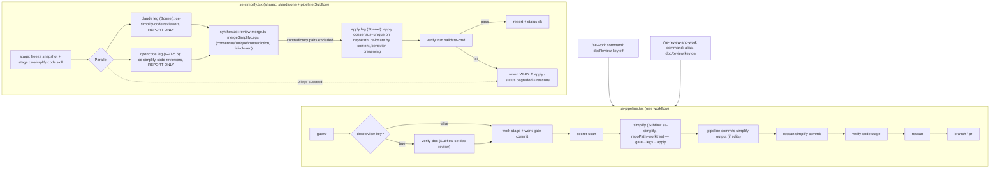

# se-simplify stage + se-work doc-review fork - Plan

## Goal Capsule

Three linked changes to the local `se-*` skill/workflow set (all under `home/private_dot_claude/`):

1. **Two named commands over one pipeline.** Today `se-work` runs the full durable pipeline verify-doc → work → verify-code, with no way to run it without plan-review. This is a **deliberate workflow choice**, not a cost argument: when a plan is already prepared and human-reviewed, the user should be able to run the pipeline without plan-review — and, when they do want it, to opt in by command. Split into two **skill entrypoints** so the user never has to remember a flag: `se-work` runs the pipeline without doc-review; `se-review-and-work` is the same command with the doc-review key set. Internally there is one `se-pipeline.tsx` and one `docReview` key the user never types — zero duplicated pipeline code.
2. **New `se-simplify`.** A standalone skill + smithers workflow that runs the compound-engineering `ce-simplify-code` pass with **two cross-model verification legs** (claude + opencode), exactly mirroring the harness shape of `se-code-review` / `se-doc-review`. Confirmed mode: **apply**, not report-only — the two legs report simplification candidates, then a single apply point actually applies the consensus and verifies behavior is preserved.
3. **Simplify is a permanent pipeline stage, right-sized by an autonomous gate.** Insert simplify after `work`, before `verify-code`, so the code that gets reviewed is the tidied code — in **both** commands. There is no user flag; a right-sizing gate (deterministic + optional cheap classifier) decides per run whether the work-diff is worth simplifying, biased to **skip when unsure** (skipping simplify is harmless; running it auto-mutates code — see R14/KTD-I). The stage is a **shared module** — one `se-simplify.tsx` workflow, reused standalone AND imported into the pipeline as a Subflow (the same pattern `se-pipeline.tsx` already uses for `se-doc-review.tsx`), never duplicated logic.

Resulting stage sequences:
- `se-work`: work → simplify → verify-code → (branch/pr)
- `se-review-and-work`: verify-doc → work → simplify → verify-code → (branch/pr)

Explicitly NOT a goal: changing verify-doc or verify-code review internals beyond making verify-doc conditional; adding models beyond one new review profile; a report-only ("propose but don't apply") simplify mode (rejected as redundant by the user); a `simplify` on/off flag (the stage is always present and autonomously run-or-skipped by the R14 gate, never user-toggled).

---

## Product Contract

### Summary

`se-work` stops running plan-review on already-prepared plans and gains an always-on apply-and-verify simplify stage before code review; the old full behavior is preserved under a second command name `se-review-and-work` (same pipeline, doc-review key set). The user picks behavior by command name, never by a flag. The simplify logic lives once, in a new `se-simplify.tsx` workflow, reused standalone and as a pipeline Subflow, with models matched to what `ce-simplify-code` uses (Sonnet class).

### Problem Frame

- **No control over verify-doc.** `se-work` always runs the verify-doc stage; there is no way to run the pipeline without plan-review short of editing the workflow. When a plan is already implementation-ready and human-reviewed, re-running plan-review is not wanted — but the choice should be the user's, made by command name, not hardcoded. (The stage's real cost — two external plan-review legs, ~10-20 min, ~$5-6 claude — is stated as fact, not as a "wasted work" claim; the justification for the split is workflow control, not proven waste. See OQ4.)
- **No simplify in the durable pipeline.** `ce-simplify-code` exists only as an in-session compound-engineering skill. The durable pipeline has no tidy-before-review step, so `verify-code` reviews raw work-stage output including cruft that a simplify pass would have removed.
- **Two-leg cross-model pattern not reused for simplify.** `se-code-review` and `se-doc-review` both run two independent external legs (claude on Sonnet, opencode on GPT-5.5) plus a local pass, then synthesize — the strongest signal is agreement across model families. Simplify has no equivalent; a single-model simplify pass has no cross-check.

### Requirements

- **R1.** `lib/agents.ts` gains a `simplifyReview` profile (claude legs `claude-sonnet-5`, fallback `claude-haiku-4-5`; opencode leg `openai/gpt-5.5`), with `idleTimeoutMs < timeoutMs` per the existing profile invariants. Sonnet class matches `ce-simplify-code`'s stated reviewer tier. A separate `simplifyApply` model choice (Sonnet, see R5) is also defined here, not scattered at call sites.
- **R2.** New workflow `home/private_dot_claude/dot_smithers/workflows/se-simplify.tsx`: take the **repo path as an explicit workflow input** (`repoPath`), defaulting to `SIMPLIFY_REPO` env only for standalone use — never a module-scope `process.env ?? process.cwd()` read, because in the pipeline the `se` CLI sets the repo env to the operator's launch checkout and the run-worktree path is a runtime-only value (feasibility, conf 75). Then: freeze a snapshot of `repoPath` (reusing `se-code-review.tsx`'s `stash create` + detached worktree stage), run `Parallel(claude, opencode)` report-only legs, synthesize (code), apply once on `repoPath`, verify, emit a report + per-leg status. Each leg is error-boundaried — a failed leg degrades to advisory. If **zero** legs succeed, the stage does not silently no-op: it emits `degraded` (pipeline) / reports the failure (standalone), never a clean success with an empty finding set (adversarial, conf 75). Carries a recursion-guard marker like the other harnesses.
- **R3.** Report-only consult contract: each external leg runs `ce-simplify-code`'s reviewer phase (the reuse/quality/efficiency personas) on the frozen snapshot and returns findings; it applies, edits, commits **nothing** (mirrors `se-code-review`'s NO-CHANGES rule). The leg output is the **raw review object** (`{status, findings[]}`) emitted via a dedicated json-schema — NOT a `{report: "<stringified JSON>"}` wrapper, which would fail the merge's `parseLeg` (it requires a top-level `findings` array) and mark every leg failed (feasibility, conf 75). Reuse `lib/review-schema.ts`'s `reviewLegSchema` for this shape rather than defining a third schema.
- **R4.** Synthesis reuses, not duplicates, the existing review scaffolding: **extend `lib/review-merge.ts`** with a new exported `mergeSimplifyLegs` that reuses its fail-closed `parseLeg`, rather than a hand-mirrored `simplify-merge.ts` (scope-guardian/feasibility, conf 75). Note: `review-merge.ts`'s `mergeReviewReports` does **not** compute file/line-proximity matching — it flattens legs tagged by source, by deliberate design — so it is a template only for the fail-closed parse path, not for consensus detection. The new function must **specify the matching algorithm explicitly**: same file + line within N lines + a concrete similarity check on `description`/`suggested_change`, classifying into consensus (2 legs) / unique (1 leg). **Contradictory** pairs (legs disagree on the same code, not merely differ) are demoted to advisory-only and **excluded from auto-apply**, surfaced in the report (adversarial, conf 75). Fail-closed: a parse problem never throws; a failed leg yields advisory; single-leg survival still produces a usable finding set.
- **R5.** Single apply point: one claude leg (Sonnet) applies the synthesized consensus + unique findings on `repoPath`, honoring `ce-simplify-code`'s behavior-preservation and never-remove-a-safety-check rules. Line numbers in findings are **advisory anchors** — the apply leg re-locates each finding by surrounding content, because intra-batch edits shift subsequent line numbers (adversarial, conf 75). After applying, run the verification command; on failure the stage **reverts the whole apply and reports `degraded`** (a batch apply + single `validate-cmd` cannot attribute a failure to one finding, so surgical "revert the offending change" is not operational — see Open Questions OQ3). Standalone `se-simplify` **requires an explicit `validate-cmd` input** (or refuses to apply): only the pipeline path has gate-0 and a Verification Contract, so a standalone run has no default validate source (feasibility/adversarial, conf 75).
- **R6.** New `se-simplify` SKILL.md wrapper mirroring the `se-code-review` skill: launch the harness in the background first, then synthesize the leg reports. **The workflow's apply leg is the single apply owner** — the SKILL wrapper does NOT run a separately-applying local `ce-simplify-code` pass (which would give standalone two apply owners mutating while legs analyze a frozen snapshot — coherence/feasibility/scope/adversarial, conf 100). Any local pass is report-only, contributing findings to the synthesis; the workflow applies once. Recursion guard; cost note.
- **R7.** `se-pipeline.tsx` `inputSchema` gains a single `docReview: boolean` (default `false`) key. The verify-doc stage runs only when `docReview` is true. The simplify stage is **always present** (no user flag; its R14 gate decides run-or-skip per run), inserted **after the existing secret-scan stage and before verify-code** — so simplify's own external report legs receive content that the shared pre-external-LLM secret scan (KTD10) has already cleared, exactly like verify-code's legs. It is a `Subflow` over `se-simplify.tsx` with `input={{ repoPath: staged.worktreePath, ... }}` — the run worktree, never the target-repo env. No `simplify` flag exists.
- **R8.** Two skill entrypoints, so the user selects behavior by command name, never a flag: `se-work` SKILL.md launches the pipeline with `docReview` off; `se-review-and-work` SKILL.md is an alias that launches the same pipeline with the `docReview` key on. The `se` CLI (`bin/`) exposes the single doc-review key that the `se-review-and-work` command passes; the user never types it.
- **R9.** The simplify stage's applied output is **committed by the pipeline** after the subflow returns (a pipeline-owned deterministic commit mirroring `commitWorkGuarded`), and that commit is **re-scanned for secrets before verify-code's external legs run** (reusing the existing rescan primitive) — because simplify runs after the first secret-scan, its new commit is not yet covered. Without the commit, `se-simplify.tsx` (templated from `se-code-review.tsx`, which has no commit step) leaves its edits uncommitted; verify-code (`git log base..HEAD`) never sees them and the branch HEAD excludes the tidied code — defeating the stage's purpose (feasibility, conf 100).
- **R10.** Simplify reuses the pipeline's **shared** pre-external secret boundary (R7 sequencing — it runs after secret-scan), not a simplify-special scan. What IS simplify-specific because only simplify auto-mutates: the apply leg carries a **forbidden-paths denylist** it never edits — credentials, 1Password templates (`*.tmpl` containing `op://`), `dot_zshenv*`, agent permission rules, shell startup files — and ignores prompt-injection from repo content. Snapshot hygiene: `/tmp/ce-simplify/run-<ts>` worktrees get trap/finally cleanup so a crashed run leaves no readable snapshot. (The standalone case — `se-simplify` / `se-code-review` run OUTSIDE the pipeline, where no KTD10 scan exists — is a shared gap deferred to `docs/issues/2026-07-27-002-standalone-harness-secret-boundary.md`, not solved here.) (security-lens, conf 75-100.)
- **R11.** `opencode.json.tmpl` (`home/private_dot_config/opencode/opencode.json.tmpl`) gains `permission.external_directory` allow entries for `/tmp/ce-simplify/*`, `/tmp/ce-simplify/**/*`, `/private/tmp/ce-simplify/*`, `/private/tmp/ce-simplify/**/*` — otherwise the opencode simplify leg cannot read its staged snapshot and fails before review (feasibility/opencode, conf 100). A smoke assertion checks the entries exist.
- **R12.** `bun test` green from `home/private_dot_claude/dot_smithers`: new `simplifyReview` profile invariants, `mergeSimplifyLegs` behavior (consensus/unique/contradiction/fail-closed), pipeline gating (verify-doc skipped when `docReview:false`, present when `docReview:true`; simplify always inserted after secret-scan and before verify-code; simplify commit lands after secret-scan and is rescanned before verify-code; subflow targets `staged.worktreePath`), no regressions to existing suites.
- **R13.** `docs/se-pipeline.md` runbook documents the new stage, the single `docReview` flag, and the two skill entrypoints; the CLAUDE.md project map / skill-routing table is updated to name `se-review-and-work` and `se-simplify`.
- **R14.** Simplify is gated by an autonomous right-sizing check (resolves OQ1) — no user flag. A shared `lib/stage-gate.ts` deterministic pre-check runs first: skip when the work-diff is empty, or is documentation-only / generated / vendored / lockfile / purely mechanical (formatting, rename) churn — honoring `ce-simplify-code`'s own preflight, measured on the known post-work diff (`git diff --stat base..HEAD`, executable-code lines only). When the deterministic check is inconclusive, an optional cheap classifier (Haiku) answers "is this diff substantive enough to warrant simplify?" with the bias **skip when unsure** — the inverse of the review stages' run-when-unsure bias, because skipping simplify is harmless (untidy code) while running it auto-mutates and costs. A skipped simplify stage reports `skipped` with the reason, never a silent pass. Generalizing this gate to the code-review and doc-review stages is deferred to `docs/issues/2026-07-27-001-unified-stage-rightsizing-evaluator.md`.

### Scope Boundaries

Deferred / out of scope:
- Changing verify-doc or verify-code review internals — this plan only makes verify-doc conditional and inserts a stage after secret-scan (before verify-code).
- A report-only simplify mode (variant "A") — user rejected it as redundant.
- A `simplify` on/off flag — simplify is autonomous: always present in both commands, run-or-skipped by the R14 right-sizing gate, never toggled by the user.
- Generalizing the right-sizing gate to the code-review and doc-review stages — deferred to `docs/issues/2026-07-27-001-unified-stage-rightsizing-evaluator.md`. This plan gates only simplify.
- Any new model family beyond the one `simplifyReview` profile and the `simplifyApply` choice (the R14 classifier reuses the existing cheapest-tier / Haiku model).

---

## Planning Contract

### Key Technical Decisions

- **KTD-A. Apply-and-verify, two cross-model report legs (variant B).** (session-settled: user-directed — variant A "propose-only findings, never apply" explicitly rejected as redundant.) The two external legs are report-only (they can't both mutate the same tree); a single downstream apply point applies the cross-model consensus and then verifies behavior is preserved.
- **KTD-B. Shared via Subflow, not inline and not duplicated prose.** `se-simplify.tsx` is the single source of the stage. The pipeline imports it as a `Subflow`, exactly as it already imports `se-doc-review.tsx` (`seDocReviewSubflow`, `se-pipeline.tsx:42/49/592`). Rejected: inlining the legs into the pipeline (the way verify-code is inlined) — simplify's apply+verify tail is too heavy to inline twice, and the user's explicit ask is "shared module, no duplication."
- **KTD-C. Two named commands over ONE workflow; the only variable is a doc-review key the user never types.** (session-settled: user-directed — the objection was to *remembering/typing flags*, not to a flag existing internally; and there must be zero duplicated pipeline code.) `se-pipeline.tsx` is ~49K; copying it would fork all future maintenance and duplicate the spine. Instead: simplify becomes an always-present, autonomously-gated stage (no flag; run-or-skip decided by R14), and a single `docReview` key is the one input difference. `se-work` and `se-review-and-work` are thin SKILL.md wrappers over the same `se` CLI — `se-review-and-work` is literally `se-work` with the doc-review key set. Duplication: none (one workflow, one key, two one-line command wrappers).
- **KTD-D. Externals constrained to reviewers-only via the consult prompt — treated as an UNPROVEN assumption, not a proven precedent.** `ce-simplify-code` natively applies (its Steps 3-4). The external consult prompt instructs it to run only Steps 1-2 (scope + three persona reviewers) and return aggregated findings, applying nothing. This is a **materially harder ask** than the cited `se-code-review`→`ce-code-review` case: `ce-code-review` is report-only *by default*, whereas here we suppress an apply-*default* skill's mutation via prompt (adversarial, conf 75). Because the whole two-report-leg architecture collapses if a leg applies anyway, U0 validates it with a cheap spike **before** U1-U3 are built.
- **KTD-E. Apply verification reuses the validate-cmd; failure reverts the WHOLE apply and degrades — never silent-passes, and never claims surgical revert.** The apply leg's behavior-preservation check is the plan's validate-cmd (pipeline: the work-gate command; standalone: a required input, R5). A batch apply of consensus+unique findings followed by a single validate-cmd cannot attribute a failure to one finding, so the committed behavior is **revert-all-and-degrade**, not "revert the offending change." Per-finding commit+verify isolation is a costlier alternative deferred to Open Questions (OQ3). Consistent with the pipeline's gate philosophy and the "never round a skipped/failed step up to completed" rule.
- **KTD-F. Models: `simplifyReview` = Sonnet class (per `ce-simplify-code`); apply leg = Sonnet, not Opus.** The reviewers match `ce-simplify-code`'s "balanced mid-tier / Sonnet class" guidance. The apply leg executes already-decided findings under a behavior-preservation guard — high-care but not deep-reasoning — so Sonnet is the right cost/quality point; Opus (the `work` profile) is reserved for implementation-from-scratch.
- **KTD-G. `se-simplify.tsx` takes `repoPath` as an explicit workflow input; env is standalone-only.** In the pipeline the `se` CLI sets `PIPELINE_REPO`/`DOC_REVIEW_REPO` to the operator's launch checkout, and the isolated run-worktree path exists only at runtime — a module-scope `process.env ?? process.cwd()` read (as `se-code-review.tsx` does) would make the apply leg mutate the operator's live repo mid-run, violating the pipeline's isolation guarantee and CLAUDE.md's "never edit files inside the run's worktree while the run is live." The pipeline subflow passes `repoPath: staged.worktreePath`; standalone falls back to `SIMPLIFY_REPO` (feasibility, conf 75).
- **KTD-H. Simplify sits after secret-scan and before verify-code; its commit is rescanned; the secret boundary is shared, not reinvented.** The pipeline already secret-scans before external LLMs (KTD10). Simplify itself sends to external legs, so it must run **after** that scan (an earlier draft placed it before — backwards, it would leak unscanned content). Sequence: work-gate commit → secret-scan → simplify (gate → legs → apply → pipeline commit) → rescan the simplify commit → verify-code. The commit + rescan reuse `commitWorkGuarded` and the existing rescan primitive. A simplify-special input scan (an earlier R10) is dropped as duplication of the shared boundary; only the apply-leg forbidden-paths denylist is simplify-specific (it is the only stage that mutates). (feasibility/security, conf 100; user-directed.)
- **KTD-I. Simplify is autonomously right-sized, not user-flagged, with a skip-when-unsure bias.** (resolves OQ1 — the fork is logic-driven, not cost-driven, so simplify stays in the pipeline; the open question was only whether it must run on *every* diff.) A shared `lib/stage-gate.ts` decides run/skip: deterministic first (empty / doc-only / generated / lockfile / mechanical → skip; honors `ce-simplify-code`'s preflight), cheap Haiku classifier only when the deterministic rule is inconclusive. Bias is **skip when unsure** — deliberately the inverse of `ce-code-review`'s run-when-unsure, because simplify auto-mutates (a wrong run edits low-value code and costs) while a wrong skip merely leaves code untidy. The same gate generalized to the read-only review stages (run-when-unsure bias there) is a separate follow-up (`docs/issues/2026-07-27-001-…`), kept out of this plan to avoid reopening KTD-C.

### High-Level Technical Design

### Assumptions

- **Both new commands run simplify; the doc-review key is the only difference.** `se-review-and-work` = `se-work` + doc-review (simplify runs in both — it is new relative to today's `se-work`, not a differentiator between the two new commands). This is a superset of today's `se-work` behavior — acceptable per the user's stated target sequences.
- **`ce-simplify-code` can be driven reviewers-only via prompt** (run Steps 1-2, skip 3-4, return findings) without a native flag. This is UNPROVEN and harder than the `ce-code-review` precedent (that skill is report-only by default; this one applies by default). **Validated by U0's real-run spike** (a real `ce-simplify-code` invocation with the consult prompt on a dirty repo, confirming it changes nothing and returns parseable findings) BEFORE U1-U3 are built — not by U3's `smoke` run, which by definition skips the real `ce-simplify-code` invocation.
- **Line references in leg findings are advisory anchors, not authoritative offsets.** Because the apply leg edits a batch of findings sequentially, the first edit shifts every later line number in the same file; the apply leg re-locates each finding by surrounding content. (The earlier claim that "nothing mutates the tree so line references stay valid" was false across a batch apply and is retired.)
- **Pipeline apply targets the isolated run worktree; standalone requires an explicit `validate-cmd`.** In the pipeline, `repoPath` = the run worktree (isolated, frozen against human edits). Standalone `se-simplify` targets `SIMPLIFY_REPO` and must be given a `validate-cmd` input — there is no gate-0 / Verification Contract outside the pipeline to supply one.

### Risks & Dependencies

- **Behavior-preservation guarantee is only as strong as validate-cmd.** A thin validate-cmd (e.g. typecheck only) lets a behavior-changing "simplification" through. Mitigation: KTD-E degrade-on-failure + the apply leg carries `ce-simplify-code`'s never-remove-a-safety-check rules verbatim; documented as a known limit, not silently trusted.
- **Added pipeline cost/time — net effect unquantified (see OQ1).** `se-work` now runs an extra multi-leg stage (2 report legs + 1 apply + verify), which has strictly more stages than verify-doc, so it is likely a real time/cost add, not the "cost-neutral" wash an earlier draft claimed. `se-review-and-work` keeps verify-doc AND adds simplify — a pure add. Whether always-on simplify is worth this is deferred to Open Questions OQ1; the cost note (R13) documents the measured figures once available.
- **Behavior-preservation bounded by validate-cmd coverage.** Even with revert-on-failure, a thin validate-cmd (or a touched file with weak test coverage) lets a behavior-changing "simplification" pass verification and ship. Mitigation: R5 revert-all-and-degrade + R10 apply-safety policy + the never-remove-safety-check rules; documented as a known limit, coverage-gating deferred to OQ.
- **`se-pipeline.tsx` concurrent edits.** Any in-flight pipeline plan editing `se-pipeline.tsx` must land first; rebase this branch after it (same hazard called out in the 2026-07-24-003 plan).
- **Dependency:** the `se` CLI source (`home/private_dot_claude/dot_smithers/bin/`) must accept and forward the single `--doc-review` flag before the skills can pass it (U6).

---

## Implementation Units

### U0. Spike: validate reviewers-only consult before building the harness

**Goal:** Confirm the load-bearing assumption (KTD-D) — that `ce-simplify-code` can be driven Steps-1-2-only, applying nothing — BEFORE the harness that depends on it is built.

**Requirements:** KTD-D, R3.

**Dependencies:** none. **Blocks:** U1-U3 (do not build the harness until this passes).

**Files:** none (throwaway spike; record the outcome in the commit message / a scratch note).

**Approach:** On a dirty throwaway repo, invoke `ce-simplify-code` once with the draft report-only consult prompt (run scope + three persona reviewers, apply/edit/commit nothing, return the raw `{status, findings[]}` object). Confirm: (1) the working tree is unchanged after the run (git status clean of new edits), (2) the returned payload parses as a review object with a top-level `findings` array. If it applies anyway or won't emit parseable findings, STOP — the two-report-leg architecture is invalid as designed and needs rethinking (escalate to the user) rather than proceeding into U1-U3.

**Verification:** documented spike result: tree unchanged + parseable findings, or an explicit stop with the failure captured.

### U1. `simplifyReview` profile + apply-model in `lib/agents.ts`

**Goal:** One home for the simplify legs' models, caps, and retry policy, matching `ce-simplify-code`'s Sonnet tier.

**Requirements:** R1.

**Dependencies:** U0 passed.

**Files:**
- `home/private_dot_claude/dot_smithers/workflows/lib/agents.ts`
- `home/private_dot_claude/dot_smithers/workflows/lib/agents.test.ts`

**Approach:** Add a `simplifyReview` profile to `AGENT_PROFILES` (`model: "claude-sonnet-5"`, `fallbackModel: "claude-haiku-4-5"`, `timeoutMs`/`idleTimeoutMs`/`maxBudgetUsd`/`retries` sized like `docReview` — simplify review is judgment-heavy but lighter than a code diff). Reuse `makeClaudeReviewAgent` / `makeOpencodeReviewAgent`: add a `profile: "simplifyReview"` branch to the claude factory that emits the **raw review object** json-schema (reuse `reviewLegJsonSchema` from `lib/review-schema.ts`, as `codeReview` does — NOT the `{report}`/`{envelope}` string wrapper, per R3; a string wrapper breaks `parseLeg`). Define the apply-leg model choice as a named constant/profile (Sonnet) so the apply Task reads it from here.

**Patterns to follow:** the existing `codeReview` profile (raw-object json-schema via `reviewLegJsonSchema`) and the `docReview`/`opencodeReview` invariant tests (`budget-fits-timeout`, `idleTimeoutMs < timeoutMs`).

**Test scenarios:**
- `simplifyReview` present; `idleTimeoutMs < timeoutMs`; budget fits inside timeout.
- Claude factory with `profile:"simplifyReview"` carries the Sonnet model + fallback + the raw-object json-schema (not a string wrapper).
- Apply-model constant resolves to a Sonnet-class model.
- Existing profile invariants unchanged.

**Verification:** `bun test` green.

### U2. `mergeSimplifyLegs` synthesis + `stage-gate.ts` right-sizing (lib)

**Goal:** (a) A single tolerant consumer that merges two simplify legs' findings into consensus/unique/contradiction, fail-closed — reusing the existing scaffolding, not a third copy. (b) A deterministic right-sizing gate that decides whether simplify is worth running on a given diff.

**Requirements:** R3 (schema reuse), R4 (merge), R14 (gate).

**Dependencies:** none (independent of U1); both gated on U0.

**Files:**
- `home/private_dot_claude/dot_smithers/workflows/lib/review-schema.ts` (reuse `reviewLegSchema` for the simplify legs; extend only if a `dimension` field must be added — do NOT fork a `simplify-schema.ts`)
- `home/private_dot_claude/dot_smithers/workflows/lib/review-merge.ts` (add exported `mergeSimplifyLegs`)
- `home/private_dot_claude/dot_smithers/workflows/lib/review-merge.test.ts`
- `home/private_dot_claude/dot_smithers/workflows/lib/stage-gate.ts` (new — deterministic right-sizing decision)
- `home/private_dot_claude/dot_smithers/workflows/lib/stage-gate.test.ts` (new)

**Approach (merge):** Reuse `reviewLegSchema` for the leg findings shape (a review object with a top-level `findings[]`; each finding carries file/line + `description`/`suggested_change`, plus `dimension: reuse|quality|efficiency`). Add `mergeSimplifyLegs(legs)` to `review-merge.ts` that reuses the existing fail-closed `parseLeg`. **`mergeReviewReports` is NOT a template for the matching logic** — it flattens by source tag and does no proximity detection (deliberate, per its own comment). Specify the matching algorithm explicitly: two findings match when same file + line within N lines (choose N, e.g. 3) + a similarity check on `description`/`suggested_change`; matched → `consensus` (both sources), unmatched → `unique` (attributed). Findings whose `suggested_change` **conflicts** on the same location → `contradiction`, advisory-only, excluded from auto-apply (R4). Fail-closed: parse problem never throws; failed leg → advisory; single-leg survival → usable unique set; **zero successful legs → explicit degraded result**. Pure data.

**Approach (gate):** `shouldRunSimplify(diffStat)` in `stage-gate.ts` takes the parsed `git diff --stat base..HEAD` (file list + per-file line counts + file types) and returns `{run: boolean, reason: string, inconclusive: boolean}`. Deterministic rules: empty diff → skip; only doc/markdown, generated, vendored, lockfile, or purely mechanical (formatting/rename) paths → skip (honor `ce-simplify-code`'s preflight); a threshold of substantive executable-code churn → run. When neither a clear-skip nor a clear-run rule fires, return `inconclusive: true` (the workflow then invokes the cheap classifier — U3/U5). Pure function, no LLM, no I/O — the caller passes the diff stat in.

**Patterns to follow:** `lib/review-merge.ts` `parseLeg` fail-closed try/catch (reuse verbatim); `ce-simplify-code` preflight categories for the gate's skip taxonomy; `ce-code-review`'s "executable-code lines only" counting.

**Test scenarios:**
- Merge: two agreeing legs → consensus; one-leg-only → unique; conflicting suggestions same location → contradiction excluded-from-apply; malformed JSON → advisory no throw; zero legs → explicit degraded.
- Gate: empty diff → skip; markdown/lockfile-only diff → skip (reason names the category); substantive code diff → run; mixed/borderline diff → `inconclusive:true` (defers to classifier).

**Verification:** `bun test` green.

### U3. `se-simplify.tsx` workflow

**Goal:** The shared stage: snapshot → two report-only legs → synthesize → apply → verify → output, targeting an explicit `repoPath`.

**Requirements:** R2, R3, R5, R10 (data boundary + cleanup), R11 (opencode permission), R14 (right-sizing gate).

**Dependencies:** U0 passed, U1, U2 (incl. `stage-gate.ts`), R11 (opencode permission entry must exist or the opencode leg fails).

**Files:**
- `home/private_dot_claude/dot_smithers/workflows/se-simplify.tsx` (new)
- `home/private_dot_claude/dot_smithers/workflows/lib/consult-prompt.ts` (add the simplify report-only hard-rules variant — mandatory, per KTD-D: enforce Steps 1-2 only, apply/commit nothing, never-remove-safety-check)
- `home/private_dot_config/opencode/opencode.json.tmpl` (R11 `/tmp/ce-simplify` allow entries)

**Approach:** Start from `se-code-review.tsx` as the template but take **`repoPath` as an explicit workflow input** (default `SIMPLIFY_REPO` env for standalone), and derive the stage/apply cwd from that input — never a module-scope `process.env ?? process.cwd()` (KTD-G). **Right-sizing gate first (R14):** before staging or dispatching any leg, compute the scope's `git diff --stat` and call `shouldRunSimplify` (U2); on a clear skip — or on `inconclusive` followed by a cheap Haiku classifier answering not-worth-it (bias: skip when unsure) — emit `skipped` with the reason and run no legs/apply/verify. Otherwise proceed. Reuse its `stage()` (stash-create snapshot of `repoPath` + detached worktree under `/tmp/ce-simplify/run-<ts>`, stage the `ce-simplify-code` plugin skill dir for opencode). The pre-external secret boundary is **not reinvented here** — in the pipeline, simplify runs after the shared secret-scan (R7); the standalone-outside-pipeline gap is deferred (R10 / follow-up issue). `Parallel` two report-only legs whose consult prompt (from `consult-prompt.ts`) runs Steps 1-2 only and returns the raw review object, changing nothing. After both legs (error-boundaried), a code node calls `mergeSimplifyLegs`; contradictions are excluded from the apply set. Then an **apply Task** (claude, Sonnet, `permissionMode: acceptEdits`, cwd = `repoPath`) applies consensus+unique, re-locating by content (line numbers advisory), honoring behavior-preservation + never-remove-safety-check + the R10 forbidden-paths denylist (credentials, `op://` templates, `dot_zshenv*`, permission/shell-init files). Then a **verify Task** runs the validate-cmd (required input in standalone); failure → **revert the whole apply** and emit `degraded`; zero successful legs → `degraded` without applying. Final `output` Task writes the report + per-leg status + apply/verify outcome; a trap/finally cleans up the snapshot worktree even on crash (R10). Support `smoke:true` (trivial prompts, no real work).

**Patterns to follow:** `se-code-review.tsx` (stage/parallel/error-boundary/output shape); `se-pipeline.tsx` work + gate tasks and `lib/envelopes.ts` `runValidateCmd` / `secretScanDiff` for the verify tail and the pre-external scan.

**Test scenarios (where unit-testable) + smoke:**
- `smoke:true` wires stage → 2 legs → synth → (no-op apply) → output without invoking real `ce-simplify-code`; the apply/stage cwd comes from the `repoPath` input, not env.
- A report leg that returns findings applying nothing leaves the snapshot unchanged (report-only contract holds).
- Apply on a trivial diff produces edits; validate-cmd pass → status ok; forced validate-cmd fail → status degraded, **whole apply reverted**.
- Zero successful legs → status degraded, no edits applied.
- Standalone with no `validate-cmd` input → refuses to apply (does not silently skip verification).
- Gate skip: a doc-only / empty scope → status `skipped` with reason, no legs dispatched.

**Verification:** `bun test` green; a manual `smoke` run prints stageDir + both leg statuses; one real standalone run (with a `validate-cmd`) on a trivial dirty repo tidies it and stays green; the opencode leg reads its snapshot (R11 entry present).

### U4. `se-simplify` SKILL.md wrapper

**Goal:** User-facing standalone skill that runs the harness and synthesizes — with a single apply owner.

**Requirements:** R6, R5 (standalone validate-cmd).

**Dependencies:** U3.

**Files:**
- `home/private_dot_claude/skills/se-simplify/SKILL.md` (new)

**Approach:** Clone the structure of `home/private_dot_claude/skills/se-code-review/SKILL.md`: recursion guard marker (`[ce-simplify-external-consult]`), Phase 1 resolve scope + resolve the required `validate-cmd` (refuse to apply if none), Phase 2 launch `se-simplify.tsx` in background (passing `repoPath` + `validate-cmd`), Phase 3 collect leg reports, Phase 4 synthesize consensus/unique + report what the workflow's apply leg applied. **The workflow's apply leg is the single apply owner** — the SKILL does NOT invoke a separately-applying local `ce-simplify-code` pass (that would give standalone two apply owners, mutating the live repo while the legs analyze a frozen snapshot: stale line refs, double/conflicting edits — the consensus P1 across both external legs + local scope). If a local pass is desired for a third finding source, it runs report-only and feeds synthesis; it never applies. Cost note (2 report legs + apply + verify; Sonnet legs).

**Patterns to follow:** `se-code-review/SKILL.md` phase structure and delivery-by-mode; but drop the "run the local plugin that applies" step in favor of a single workflow-owned apply.

**Test scenarios:** N/A (prose skill) — validated by U3 smoke + one real invocation.

**Verification:** Skill invocable; a real run (with a `validate-cmd`) tidies a trivial branch via the workflow's single apply and reports applied-by-dimension; no double-apply.

### U5. Pipeline: conditional verify-doc + always-on simplify Subflow (sequenced + committed)

**Goal:** verify-doc runs only when the doc-review key is set; the simplify subflow is always rendered after the secret-scan stage (its R14 gate runs-or-skips), its applied output committed and rescanned before verify-code.

**Requirements:** R7, R9 (commit), R12, R14 (gate handling).

**Dependencies:** U3.

**Files:**
- `home/private_dot_claude/dot_smithers/workflows/se-pipeline.tsx`
- pipeline test file(s) under `home/private_dot_claude/dot_smithers/workflows/` (add gating + sequencing cases)

**Approach:** Add a single `docReview: z.boolean().default(false)` to `inputSchema`. Gate the verify-doc `stageBlock` render on `ctx.input.docReview` (when false, `work` binds directly to gate0, summary/notes omit verify-doc cleanly). Import `se-simplify.tsx` as `seSimplifySubflow` (same `as unknown as WorkflowDefinition<unknown>` cast used for `seDocReviewSubflow`). Render it **between the existing secret-scan stage and verify-code** — so simplify's external report legs only ever see content the shared secret-scan already cleared (R7/KTD-H; NOT before secret-scan, which would leak unscanned content) — with `input={{ repoPath: staged.worktreePath, validateCmd, ... }}` (the run worktree, never `repoDir`/env, per KTD-G). The subflow owns the R14 right-sizing gate internally (U3), so the pipeline always renders it but the subflow may return `skipped` cheaply. After the subflow returns, add a **pipeline-owned deterministic commit** of the worktree (mirror `commitWorkGuarded`) — **conditional on applied edits**: `skipped` / degraded-no-edits → no commit; `ok`-with-edits → commit, then **rescan that commit** (reuse the existing rescan primitive) before verify-code's external legs run, so simplify's new content is secret-cleared too (R9). Confirm the rescan `scannedHead` bookkeeping still keys on a single monotonic HEAD with the (possibly absent) extra commit. Update the summary/`stages` list and terminal-status handling for the simplify stage's `ok`/`skipped`/`degraded` outcomes and the now-optional verify-doc stage.

**Patterns to follow:** the `verify-doc` Subflow wiring (`se-pipeline.tsx:590-617`), the `stageBlock` gate helper, and `commitWorkGuarded` for the simplify commit.

**Test scenarios:**
- `docReview:false` (default) → verify-doc absent; work still gated on gate0.
- `docReview:true` → verify-doc present (regression guard).
- simplify Subflow always present, positioned after secret-scan and before verify-code (assert order — simplify's external legs run downstream of the shared secret-scan).
- simplify's applied edits are committed after secret-scan and rescanned before verify-code (assert commit + rescan land before verify-code's legs).
- simplify returns `skipped` (gate) → no simplify commit, no rescan; verify-code runs on the work commit.
- The simplify subflow input targets `staged.worktreePath`, never `repoDir`/env.
- Smoke pipeline run with `{docReview:false}` reaches verify-code with the simplify commit in `base..HEAD`.

**Verification:** `bun test` green; a `smoke` pipeline run renders work → secret-scan → simplify → (commit + rescan) → verify-code (and prepends verify-doc when the key is on).

### U6. `se-work` / `se-review-and-work` skills + `se` CLI doc-review key

**Goal:** Two named commands over one pipeline; the user never types a flag.

**Requirements:** R8.

**Dependencies:** U5.

**Files:**
- `home/private_dot_claude/skills/se-work/SKILL.md` (edit: launch without the doc-review key)
- `home/private_dot_claude/skills/se-review-and-work/SKILL.md` (new: alias that launches with the doc-review key)
- `home/private_dot_claude/dot_smithers/bin/` `se` CLI source (add one `--doc-review` flag mapping to the `docReview` input)

**Approach:** Extend the `se` CLI so `se pipeline` accepts `--doc-review` and forwards it into the workflow `--input` (`docReview:true`); absent = `false`. Edit `se-work` SKILL.md: launch command omits `--doc-review`; update its cost/time note honestly (verify-doc removed, simplify added; simplify has strictly more stages so it is likely a real time/cost add, not neutral — see OQ1). Add `se-review-and-work` SKILL.md as a thin alias that passes `--doc-review`, cross-linking that it is the full plan-review variant; state plainly it is `se-work` with plan-review turned on, and that it keeps verify-doc AND adds simplify (a pure cost add). Keep the argument contract (`plan-path`, `until:pr`, `validate-cmd:`) intact in both. The user picks by command name; neither skill asks the user to type the key.

**Patterns to follow:** current `se-work/SKILL.md` phase structure; the `se` CLI's existing flag parsing (`--until`, `--validate-cmd`).

**Test scenarios:** CLI flag parse unit test if the CLI has a test harness; else manual: `se pipeline <plan> --doc-review` echoes `docReview:true` forwarded; no flag echoes `docReview:false`.

**Verification:** `se-work` launches a run with verify-doc absent + simplify present; `se-review-and-work` launches the full verify-doc → work → simplify → verify-code run.

### U7. Docs + smoke coverage

**Goal:** Runbook and project map reflect the new stage, the single flag, and the skills.

**Requirements:** R13, R12 (smoke), R11 (opencode permission smoke).

**Dependencies:** U1-U6.

**Files:**
- `docs/se-pipeline.md`
- `CLAUDE.md` (project skill-routing / map, if it enumerates se-* skills)
- `tests/smoke.bats` (skill/workflow presence + opencode permission check)

**Approach:** Document the simplify stage, the single `docReview` flag (simplify is autonomous — gated by R14, not a user flag), and the two entrypoints in `docs/se-pipeline.md`; update any se-* skill list. Add smoke assertions that the new skill/workflow files are present and managed AND that `opencode.json.tmpl` carries the `/tmp/ce-simplify` allow entries (R11).

**Test scenarios:** `make test-local` diff clean of surprises; `bats tests/smoke.bats` green (including the opencode permission assertion).

**Verification:** `make test-templates` + `bats tests/smoke.bats` green.

---

## Verification Contract

| Check | Command | Covers |
|---|---|---|
| Spike | manual U0 (throwaway repo) | KTD-D reviewers-only assumption before any harness build |
| Unit tests | `cd home/private_dot_claude/dot_smithers && bun test` | U1 profile invariants, U2 `mergeSimplifyLegs` (consensus/unique/contradiction/fail-closed) + `stage-gate.ts` right-sizing (skip/run/inconclusive), U5 gating + simplify-after-secret-scan + conditional-commit-and-rescan-before-verify-code + subflow-targets-worktree, no regressions (R1-R14) |
| Transpile | covered by the bun test run | all workflows still build |
| Harness smoke | `cd ~/.claude/.smithers && ./node_modules/.bin/smithers up workflows/se-simplify.tsx --input '{"smoke":true}'` | U3 wiring |
| Chezmoi | `make test-templates` then `bats tests/smoke.bats` | U7 managed-file presence, opencode `/tmp/ce-simplify` permission entries, no template break |

Primary validate-cmd for pipeline execution of this plan: `cd home/private_dot_claude/dot_smithers && bun test`.

---

## Definition of Done

- U0 spike passed (or the design was escalated): `ce-simplify-code` confirmed drivable reviewers-only before the harness was built.
- `/se-work` runs work → simplify → verify-code (no doc-review); `/se-review-and-work` runs verify-doc → work → simplify → verify-code; both over the single `se-pipeline.tsx`, differing only by one `docReview` key the user never types (no copied workflow, zero duplicated pipeline code).
- `se-simplify` exists as a standalone skill + `se-simplify.tsx` workflow taking an explicit `repoPath` input, running two cross-model report-only legs (raw-object output, Sonnet claude + GPT-5.5 opencode) → `mergeSimplifyLegs` (consensus/unique; contradictions excluded from apply) → **single** apply (workflow-owned) → verify; a failed leg degrades to advisory; zero successful legs or a failed post-apply verification → revert-whole-apply + degraded, never a silent success.
- Simplify is autonomously right-sized (R14/KTD-I): a shared `lib/stage-gate.ts` skips it on empty/doc-only/mechanical diffs (deterministic) or a skip-when-unsure classifier verdict, reporting `skipped` — never a user flag, never a silent pass.
- In the pipeline, simplify runs after the shared secret-scan (so its external legs see only cleared content) and before verify-code; when it applied edits, its output is committed and rescanned before verify-code so the branch HEAD includes the tidied code; a `skipped` run adds no commit; the subflow targets `staged.worktreePath`, never the operator's live repo. The apply leg honors a forbidden-paths denylist (creds / `op://` templates / shell-init / permission files).
- `opencode.json.tmpl` allows `/tmp/ce-simplify`; the opencode leg reads its snapshot.
- The pipeline reuses `se-simplify.tsx` as a Subflow, and `mergeSimplifyLegs` extends `review-merge.ts` — one source per concern, no duplication.
- Models match `ce-simplify-code` (Sonnet class reviewers); apply leg on Sonnet.
- `bun test` green from `home/private_dot_claude/dot_smithers`; `make test-templates` + `bats tests/smoke.bats` green.
- `docs/se-pipeline.md` and the project skill map document the new stage, the single `docReview` flag, and the two entrypoints.
- The Open Questions below are resolved with the user before or during implementation (they gate design shape, not mechanics).

---

## Open Questions (strategic — resolve with the user)

These are design-shape forks that three independent review legs raised; they are deliberately NOT settled in this plan.

- **OQ1 — RESOLVED.** The fork is logic-driven, not cost-driven (user), so simplify stays in the pipeline; the cost-premise framing is moot. The narrow remaining question — must simplify run on *every* diff — is answered by R14 / KTD-I: an autonomous right-sizing gate (deterministic + cheap classifier, skip-when-unsure) decides per run, with no user flag. Generalizing the gate to code-review/doc-review is the follow-up `docs/issues/2026-07-27-001-unified-stage-rightsizing-evaluator.md`.
- **OQ2 — RESOLVED: keep the two-leg cross-model harness (option A).** (user-directed.) Rationale: because the output is **auto-applied**, cross-model consensus earns its keep *more* than in a human-read review — a simplification both models make independently is safer to auto-apply than one model's idea, and the behavior-preservation guarantee is only as strong as validate-cmd, so a second independent filter before mutation is worth its cost. Consistent with the settled KTD-A. Deterministic tools (linters/formatters) are not a substitute for the judgment personas (reuse/parameter-sprawl/concurrency), so the LLM legs stay full-scope. The cheaper single-native alternative (B) is noted but not taken.
- **OQ3 — RESOLVED: revert-whole-apply + degrade (option A).** (user-directed.) A failed simplify verify means "no tidy this run" — harmless, matching the R14 skip-when-unsure philosophy — so paying N× (per-finding) or logN× (bisect) validate-cmd cost to salvage partial tidying is poor ROI. Per-finding isolation (B/C) is a **revisit-if-frequent-failures** fallback, not built now: if runs start degrading often in practice, reopen and add bisect.
- **OQ4 — RESOLVED: reframe as a deliberate workflow choice (option B).** (user-directed — the fork is logic-driven, not cost-driven.) The Problem Frame and Goal Capsule no longer claim verify-doc is "wasted / no-signal" (an unproven assertion); they frame the split as giving the user explicit control over whether plan-review runs, by command name. No run-data citation (A) needed, since the plan no longer claims verify-doc is proven useless.
- **OQ5 — RESOLVED: accept the silent change (option C).** (user-directed — single-user personal tooling; there are no unaware callers.) No runtime notice. The R13 doc / skill-map update is the only (incidental) record; nothing extra is added.
- **OQ6 — RESOLVED: reuse the shared secret boundary; denylist on apply; standalone → follow-up.** (user-directed.) The secret-input concern is pipeline-wide, not simplify-special: the pipeline already secret-scans before external LLMs (KTD10), so simplify runs **after** that scan and reuses it (R7/KTD-H — corrected from an earlier backwards draft that put simplify before the scan). The only simplify-specific control is the apply-leg forbidden-paths denylist (R10), since simplify is the sole mutating stage; code-review/doc-review are read-only. The standalone-outside-pipeline gap (no KTD10 scan for `se-simplify` / `se-code-review` run directly) is a shared concern deferred to `docs/issues/2026-07-27-002-standalone-harness-secret-boundary.md`.
