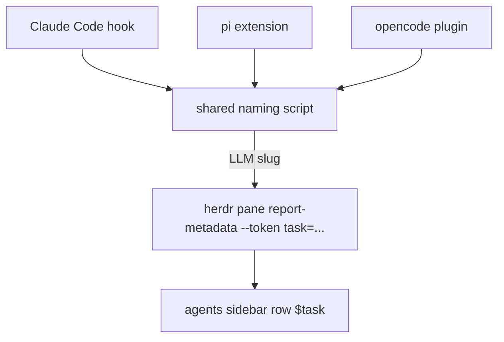
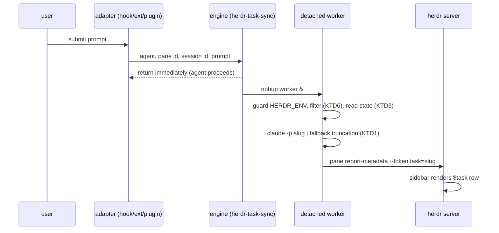

# Herdr Agent Task Sync - Plan

## Goal Capsule

- **Objective:** show what each coding agent (Claude Code, pi, opencode) is working on in the herdr agents sidebar, as a short English slug that names the session's task and updates live as prompts arrive.
- **Product authority:** the Product Contract below; product decisions settled in dialogue on 2026-08-10.
- **Open blockers:** none.
- **Stop conditions:** if `herdr pane report-metadata` or a capture event does not behave as the Sources describe, stop and surface it — do not redesign the transport mid-implementation.
- **Product Contract preservation:** changed: R5, AE3 — the exhausted naming chain publishes nothing instead of a truncated prompt line; changed: R6 mechanism — the model, not a local heuristic, decides name stability; added: R11, AE5, AE6 — event-driven resume/compaction naming for claude, session-name seeding for named pi sessions, prompt-driven otherwise. All are user decisions from the 2026-08-10 doc review. F1's Covers list completed (R4, R5 added).

---

## Product Contract

### Summary

A thin custom task-sync layer: one adapter per agent (a Claude Code hook, a pi extension, an opencode plugin) captures each submitted prompt and calls one shared naming script. The script derives an English slug for the session's task via an LLM and publishes it to herdr as a `task` metadata token; the agents sidebar renders it under the agent row. All files are chezmoi-managed in this repo.

### Problem Frame

With several agents running in parallel, every row in the herdr agents sidebar reads the same: workspace name plus the agent kind ("claude"). Nothing says which agent is doing what, so choosing the right pane means focusing each one in turn. Existing plugins cover only parts of the need: `wyattjoh/herdr-plugin-renamer` names panes from the first prompt but supports no opencode and never updates; `justcyl/pi-herdr-tab-sync` covers only named pi sessions.

### Key Decisions

- KD1. **Build a thin custom layer instead of adopting `herdr-plugin-renamer`** (session-settled: user-directed — chosen over renamer-as-base and fork/PR: only the custom layer gives unified logic, opencode coverage, and live updates in one place). Governs R1, R7.
- KD2. **LLM-generated English slug, not a truncated raw prompt** (session-settled: user-directed — chosen over raw-prompt display: readable names are worth a model call per recompute). Governs R4, R5.
- KD3. **The slug names the session's task, not the latest prompt** (session-settled: user-directed — chosen over per-prompt renaming: "продолжай"-style prompts must not rename the session). Governs R6.
- KD4. **Update granularity is per prompt submission** (session-settled: user-approved — in-turn subtask status would require reading agent internals and is out of scope). Governs R7.

### Requirements

**Coverage**

- R1. Every Claude Code, pi, and opencode session running in a herdr-managed pane publishes its task name to herdr; sessions outside herdr (`HERDR_ENV` unset) are silently skipped.
- R2. The agents sidebar shows the task name under the agent row, rendered from the `task` pane-metadata token via the sidebar rows configuration in the herdr `config.toml`.
- R3. Subagent traffic does not overwrite the pane's task name: opencode child sessions (those with a `parentID`) and any other non-main-session events are filtered out.

**Naming**

- R4. The task name is a short English slug of 2–4 words (shape: `cache-review`), generated by an LLM.
- R5. When slug generation fails or no naming model is available, the layer publishes nothing: the previous slug stays, and a session with no slug yet shows no task line. The sidebar never shows a stale error, and naming never blocks the agent.
- R6. The slug reflects the running session's overall task. Service and continuation prompts (short acknowledgements, "продолжай", "да") do not change the name. The name changes only when the session's task actually changes; the naming step receives session context, not just the newest prompt, to decide.
- R11. A Claude Code session is named from its transcript on session start and resume (before any prompt, when history exists) and re-derived around context compaction. A pi session whose pi-side session name exists seeds its task from that name on session start. opencode sessions, and pi sessions without a name, stay unnamed until their first substantive prompt.

**Update behavior**

- R7. The name recomputes on prompt submission. Within an agent turn the name is static; working/idle state remains the job of herdr's own state icon.
- R8. Adapters are non-blocking: capturing a prompt and publishing metadata must not delay prompt handling, agent startup, or shutdown.

**Management**

- R9. All new files — adapters, the shared script, and the sidebar configuration — are chezmoi-managed in this repo. Adapters live beside herdr's managed integration files (which forbid in-place edits) and never modify them.
- R10. `chezmoi apply` keeps working in CI/Docker where herdr, the agents, or the naming model are absent: installation steps are guarded the same way the existing herdr-integrations run-script is. A smoke test covers the new managed files.

### Key Flows

- F1. Prompt to sidebar
  - **Trigger:** the user submits a prompt to an agent inside a herdr pane.
  - **Steps:** the agent-specific adapter captures the prompt text and session id; the shared script filters service prompts (per R6) and subagent traffic (per R3); for a substantive prompt it asks the naming model for a slug given session context; it publishes the slug as the pane's `task` token.
  - **Outcome:** the agents sidebar row shows the current slug; on filtered prompts the previous slug stays.
  - **Covers:** R1, R3, R4, R5, R6, R7.

### Acceptance Examples

- AE1. **Covers R6.** Given a claude session named `cache-review`, when the user sends "продолжай", then the sidebar still shows `cache-review`.
- AE2. **Covers R6.** Given the same session, when the user sends a prompt that starts a different piece of work ("now fix the flaky login test"), then the slug changes to name the new task.
- AE3. **Covers R5.** Given no naming engine is usable, when the user sends a substantive prompt, then the pane's task token stays unchanged (empty for a fresh session) and the agent's response is not delayed.
- AE4. **Covers R3.** Given an opencode session whose subagent emits messages, when those messages arrive, then the pane's task name does not change.
- AE5. **Covers R11.** Given a resumed Claude Code session with history, when the session starts (before any prompt), then the pane's task token shows a slug derived from the transcript's first substantive user entry.
- AE6. **Covers R11.** Given a pi session named via `/name` or resume, when it starts inside a herdr pane, then the pane's task token shows that name normalized to slug shape.

### Scope Boundaries

- Renaming herdr tabs — deferred for later; the user split it into a separate follow-up piece of work.
- Outer terminal window/tab title (the `herdr-window-title-sync` territory) — out; not needed.
- Worktree/branch/workspace renaming (the `herdr-plugin-renamer` feature set) — out.
- In-turn live status (what the agent is doing inside one turn) — out per KD4.

### Dependencies / Assumptions

- herdr 0.8.0 is installed; `herdr pane report-metadata --token` and custom `$name` sidebar tokens are verified against the installed binary.
- herdr agent integrations for claude, pi, and opencode are already installed and refreshed by `home/.chezmoiscripts/run_onchange_after_3-setup-herdr-integrations.sh.tmpl`.
- Per-agent capture points are verified: Claude Code `UserPromptSubmit` hook (stdin JSON carries `prompt` and `session_id`), pi extension event `before_agent_start` (carries `prompt`), opencode plugin hook `chat.message` (message text lives in the parts array of the second argument).
- Assumption: a per-recompute model call is acceptable in latency and cost for interactive use.

### Sources / Research

- `herdr pane report-metadata <pane_id> --source ID --token NAME=VALUE [--seq N]` and `herdr workspace report-metadata` — CLI of the installed herdr 0.8.0; the binary's embedded default config documents custom sidebar row tokens (`$name`) fed from pane metadata.
- Claude Code hooks reference (`UserPromptSubmit` input JSON): https://code.claude.com/docs/en/hooks
- pi extension API: type definitions shipped with pi 0.84.1 (`@earendil-works/pi-coding-agent`, `core/extensions/types.d.ts`), event `before_agent_start`; an earlier `input` event also exists.
- opencode plugin API: `@opencode-ai/plugin` type definitions, hook `chat.message`; https://opencode.ai/docs/plugins. The installed herdr integration plugin demonstrates child-session filtering by `parentID`.
- Prior art: https://github.com/wyattjoh/herdr-plugin-renamer (naming approach, `$task` sidebar rows example), https://github.com/rjyo/herdr-window-title-sync, https://github.com/justcyl/pi-herdr-tab-sync.
- herdr's managed integration files (installed by `herdr integration install`) carry the header "add custom hooks beside this file instead of editing it" — the sanctioned extension point R9 builds on.
- Repo wiring patterns: Claude hooks live at `home/private_dot_claude/hooks/executable_*.sh` and are wired in `home/private_dot_claude/private_settings.json.tmpl` (the `SessionStart` block already references a herdr-installed script); the non-blocking detach precedent is `nohup … >/dev/null 2>&1 &` in `home/private_dot_config/herdr/plugins/herdr-caffeinate/lib.sh`; the CI guard precedent is the `command -v herdr || exit 0` + `lookPath` pattern in `home/.chezmoiscripts/run_onchange_after_3-setup-herdr-integrations.sh.tmpl`.

---

## Planning Contract

### Key Technical Decisions

- KTD1. **Naming engine chain: one-shot `pi` with a fast model, then `claude -p` with a haiku-class model, then no publish.** Implements KD2 (covers R4, R5). (session-settled: user-directed — chosen over per-agent engines and claude-only naming: one shared chain, `pi` first as the faster and cheaper call.) Cross-provider egress is accepted by the same decision: prompt text from any agent's session may reach pi's provider or Anthropic for naming. Each engine call gets the naming prompt on stdin, never as argv, and runs under a per-engine hard timeout (about 30 s; macOS has no coreutils `timeout`, use a watchdog kill). On failure or expiry the chain advances; an exhausted chain publishes nothing (per R5). Engine calls are isolated in one function of the shared script. Verify pi's exact one-shot flags against `pi --help` at implementation; in `docs/external-agent-cli-flags.md` only the `claude -p` row is live-verified.
- KTD2. **Non-blocking pipeline: adapter → detached worker → publish.** Covers R8. The adapter hands the prompt to the shared script, which detaches the naming worker with the repo's `nohup … >/dev/null 2>&1 &` precedent and returns immediately. The worker filters, names, and publishes `herdr pane report-metadata "$HERDR_PANE_ID" --source task-sync --token task=<slug>`.
- KTD3. **Per-pane session state under `~/.cache/herdr-task-sync/`.** Covers R6. One state file keyed by pane id + agent session id holds exactly three fields: `slug`, `first_prompt`, `latest_prompt`. The naming call receives those three fields with the instruction to return the previous slug unless the session's task changed. A new session id resets the state. The state directory is created with mode 700 and files are written under umask 077; each worker run deletes state files not modified within N days (N picked at implementation time).
- KTD4. **File placement:** shared engine at `home/dot_local/bin/executable_herdr-task-sync` (deploys to `~/.local/bin/`, on PATH); Claude hook at `home/private_dot_claude/hooks/executable_herdr-task-sync-hook.sh` with a new `UserPromptSubmit` block in `home/private_dot_claude/private_settings.json.tmpl`; pi extension at `home/dot_pi/agent/extensions/herdr-task-sync.ts` (new source dir); opencode plugin at `home/private_dot_config/opencode/plugins/herdr-task-sync.ts` (new source dir). Covers R9. `.chezmoiexternal.toml` has no collisions with these paths. herdr's own `herdr-agent-state.*` files stay untouched.
- KTD5. **Cross-platform via runtime guards, not `.chezmoiignore`.** Covers R10. The new files apply on Linux/CI harmlessly (the existing `.claude/hooks` files already do); every entry point exits silently when `HERDR_ENV` is unset or `herdr` is not on PATH. No new `.chezmoiignore` entries.
- KTD6. **Model-decided name stability.** Covers R6. (session-settled: user-directed — chosen over a local length-threshold/allowlist filter: no heuristic covers all continuations, and a threshold misclassifies short real tasks.) The only local filter is a guard against empty or whitespace-only prompts. Every other prompt goes to the naming chain with the previous slug and session context; the model returns the previous slug unchanged unless the session's task changed.
- KTD7. **Recursion guard.** The worker exports `HERDR_TASK_SYNC_ACTIVE=1` before invoking any naming engine; the engine's guard step exits 0 when that variable is set. A naming call that itself fires agent hooks (a one-shot `pi` run hitting the pi extension, or `claude -p` hitting the `UserPromptSubmit` path) therefore cannot spawn a second worker.
- KTD8. **Slug normalization before publish.** The LLM slug (from either engine) is normalized before any state write or publish: lowercase; characters outside `[a-z0-9-]` replaced with `-` and runs collapsed; length capped at 40. If the result is empty, nothing is published. This bounds LLM output before it reaches the `--token` argument and the sidebar.
- KTD9. **Event-driven naming for claude; prompt-driven for pi/opencode.** Covers R11. (session-settled: user-directed — chosen over reading pi/opencode session stores everywhere: claude's hook events carry the transcript path for free, the other two need per-format research and can be added later.) For claude, a `SessionStart` hook (fires on startup, resume, and after compaction; stdin JSON carries `session_id`, `transcript_path`, `source`) calls the engine in transcript mode, so a resumed session is named before any prompt arrives; a `PreCompact` hook re-derives the name the same way around compaction. For pi, the extension also subscribes to `session_start` and, when `pi.getSessionName()` returns a name, publishes it as the initial task (normalized per KTD8, no model call) — the accessor and event `justcyl/pi-herdr-tab-sync` demonstrates. opencode sessions, and unnamed pi sessions, publish nothing until their first substantive prompt. Verify the `source` field semantics against the Claude Code hooks docs at implementation.

### High-Level Technical Design

The diagram is directional guidance; per-unit Approach fields are authoritative.

### Assumptions

- Routing pi and opencode prompt text through `claude -p` is acceptable: prompt text already leaves the machine to each agent's model provider.
- `claude -p` latency of a few seconds is acceptable because the call is detached from the agent's turn (KTD2).
- pi loads `.ts` extensions and opencode loads `.ts` plugins from their respective directories without registration or a build step (the installed `rtk.ts` files demonstrate both).
- Applying the new files on Linux/CI is harmless under KTD5's runtime guards.
- `jq` parses the hook's stdin JSON; it is Brewfile-managed (`home/private_dot_config/brewfiles/Brewfile`) and preinstalled on the CI runners that execute `tests/scripts.bats`.
- Several panes can recompute concurrently and share one Claude quota with the user's own interactive Claude Code work; at personal scale this contention is accepted.

### Open Questions

- Deferred to implementation: the exact model flags for the one-shot `pi` and `claude` naming calls (KTD1).
- Deferred to implementation: confirm `UserPromptSubmit` fires only for user-typed prompts and never for subagent traffic; add a claude-side filter only if that assumption fails (raised by external review; the premise is unverified).

---

## Implementation Units

### U1. Shared task-sync engine script

- **Goal:** one script owns filtering, state, naming, and publishing; adapters stay thin.
- **Requirements:** R1, R4, R5, R6, R7, R8, R11. Implements KTD1, KTD2, KTD3, KTD6, KTD7, KTD8, KTD9.
- **Dependencies:** none.
- **Files:** `home/dot_local/bin/executable_herdr-task-sync` (new), `tests/scripts.bats` (extend).
- **Approach:**
  1. CLI contract: `herdr-task-sync --agent <name> --session <id> [--pane <id>] [--transcript <path>] [--set <name>]` with the prompt on stdin; pane id defaults to `$HERDR_PANE_ID`. `--set` publishes the given name directly (normalized per KTD8, state updated, no engine call) — the pi session-name seed path.
  2. Guards first: exit 0 silently when `HERDR_ENV` != 1, `HERDR_TASK_SYNC_ACTIVE` is set (per KTD7), pane id is empty, or `herdr` is not on PATH (per KTD5).
  3. Detach the worker per KTD2; the entry path never waits on the model.
  4. Worker: filter per KTD6 layer 1 → read/update state per KTD3 → name per KTD1 (engine chain on stdin, per-engine hard timeout) → normalize per KTD8 → publish per KTD2.
  5. Serialize concurrent workers per pane (newest wins) with the `--seq` parameter of `report-metadata` (`--seq N` is in the herdr 0.8.0 CLI help).
  6. Transcript mode per KTD9: with `--transcript <path>` and empty stdin, derive the naming context from the transcript's substantive user entries (the SessionStart and PreCompact hooks call this mode); an empty prompt without a transcript publishes nothing (per KTD6's guard).
- **Patterns to follow:** `home/private_dot_config/herdr/plugins/herdr-caffeinate/lib.sh` (detach), `home/.chezmoiscripts/run_onchange_after_3-setup-herdr-integrations.sh.tmpl` (tolerant guards), `home/private_dot_claude/hooks/executable_fff-grep-guard.sh` (hook script shape).
- **Test scenarios** (in `tests/scripts.bats`, with a stub `herdr` on PATH recording its argv):
  1. `bash -n` passes on the deployed script.
  2. With `HERDR_ENV` unset, the script exits 0 and the stub records no call.
  3. Covers AE1. A continuation prompt ("продолжай") with a stubbed engine returning the previous slug leaves the published `task` value unchanged.
  4. Covers AE3. With neither `pi` nor `claude` usable, a substantive prompt produces no `report-metadata` call and leaves the state unchanged.
  5. A substantive prompt with a stubbed `pi` produces a `report-metadata` call with the stub's slug and writes it to the state file.
  6. A new session id resets the stored context.
  7. Covers R8. With a stubbed engine that sleeps, the `herdr-task-sync` invocation itself returns before the stub finishes; the publish happens asynchronously.
  8. A stubbed engine returning a hostile string (newline, `$(...)`, ANSI escape) yields a recorded `--token task=` value matching `[a-z0-9-]{1,40}` (per KTD8).
  9. With `HERDR_TASK_SYNC_ACTIVE=1` in the environment, the engine exits 0 and the stub records no call (per KTD7).
  10. With `pi` failing (non-zero exit) and `claude` stubbed, the slug comes from `claude`; with both engines timing out, nothing is published (chain order per KTD1).
  11. The state directory is created with mode 700 (per KTD3).
  12. Covers AE5. With `--transcript` pointing at a fixture JSONL and empty stdin, the slug derives from the fixture's first substantive user entry; empty stdin without `--transcript` publishes nothing.
  13. Covers AE6. `--set "Fix CI flake"` publishes `fix-ci-flake` without calling any engine and writes it to the state file.
- **Verification:** `bats tests/scripts.bats` passes; `make lint` passes.

### U2. Claude Code adapter

- **Goal:** every Claude Code prompt inside herdr reaches the engine.
- **Requirements:** R1, R8, R11. Implements KTD4 for claude.
- **Dependencies:** U1.
- **Files:** `home/private_dot_claude/hooks/executable_herdr-task-sync-hook.sh` (new), `home/private_dot_claude/private_settings.json.tmpl` (extend), `tests/smoke.bats` (extend), `tests/templates.bats` (extend).
- **Approach:**
  1. Hook script parses the `UserPromptSubmit` stdin JSON with `jq -r`, extracts `prompt`, `session_id`, and `transcript_path`, pipes the prompt to `herdr-task-sync --agent claude --session <session_id> --transcript <transcript_path>` with all output redirected to `/dev/null`, and exits 0 unconditionally. The redirect is load-bearing: Claude Code injects UserPromptSubmit stdout into the conversation context on exit 0.
  2. Environment guards live in the engine (U1 step 2); the hook adds none of its own.
  3. Add a new top-level `UserPromptSubmit` block in the settings template beside `SessionStart`, calling the hook with a short timeout — the first `UserPromptSubmit` entry in this repo.
  4. Wire the same hook into `SessionStart` and `PreCompact` (event name passed as the hook's argument, mirroring the dispatch in herdr's own `herdr-agent-state.sh`); on those events the hook calls the engine in transcript mode (`--transcript <transcript_path>`, empty stdin) per KTD9.
- **Patterns to follow:** the `SessionStart` block in `home/private_dot_claude/private_settings.json.tmpl` (wiring shape); `home/.claude/hooks/herdr-agent-state.sh` header rule — sibling file, never edit the managed one.
- **Test scenarios:**
  1. Smoke: deployed `~/.claude/settings.json` contains `UserPromptSubmit`, `SessionStart`, and `PreCompact` entries referencing `herdr-task-sync-hook.sh` (mirror the `outputStyle` grep test shape).
  2. Smoke: the hook file is deployed and executable.
  3. Scripts: with `HERDR_ENV` unset, the hook consumes stdin JSON and exits 0.
  4. Scripts: the hook produces empty stdout on both the guarded path and the active path.
  5. Templates: `tests/templates.bats` renders `private_settings.json.tmpl` (mirroring the `opencode.json.tmpl` case) and asserts the `UserPromptSubmit` block is present.
- **Verification:** `bats tests/smoke.bats` and `bats tests/scripts.bats` pass.

### U3. pi adapter

- **Goal:** every pi prompt inside herdr reaches the engine; a named pi session seeds its task at start.
- **Requirements:** R1, R8, R11. Implements KTD4, KTD9 for pi.
- **Dependencies:** U1.
- **Files:** `home/dot_pi/agent/extensions/herdr-task-sync.ts` (new), `tests/smoke.bats` (extend).
- **Approach:**
  1. Subscribe to `before_agent_start`; read its `prompt` field.
  2. Subscribe to `session_start`; when `pi.getSessionName()` returns a name, spawn the engine with `--set <name>` (per KTD9/R11).
  3. Obtain the session id via `ctx.sessionManager.getSessionId()` — the accessor the installed herdr-agent-state extension already uses; skip silently when it returns undefined.
  4. Guard on `HERDR_ENV`; spawn `herdr-task-sync --agent pi --session <id>` detached, prompt on stdin; never await the result.
- **Patterns to follow:** the installed `~/.pi/agent/extensions/herdr-agent-state.ts` for extension shape and socket-era conventions (read-only reference; it is herdr-managed and not in this repo).
- **Test scenarios:**
  1. Smoke: the extension file is deployed to `~/.pi/agent/extensions/`.
  2. Smoke: the deployed file subscribes to `before_agent_start` and `session_start` (grep).
  3. Test expectation for runtime behavior: none — pi's extension runtime is not present in CI; behavior is covered by U6 live verification.
- **Verification:** `bats tests/smoke.bats` passes.

### U4. opencode adapter

- **Goal:** every opencode user message inside herdr reaches the engine; subagent messages do not.
- **Requirements:** R1, R3, R8. Implements KTD4 for opencode.
- **Dependencies:** U1.
- **Files:** `home/private_dot_config/opencode/plugins/herdr-task-sync.ts` (new), `tests/smoke.bats` (extend).
- **Approach:**
  1. Implement the `chat.message` hook; extract text from text-type entries in the parts array.
  2. Subscribe to the `event` hook and track child-session ids from `parentID`-bearing session events — the `chat.message` input itself carries no `parentID`; the installed `herdr-agent-state.js` demonstrates this two-hook pattern.
  3. Filter `chat.message` events against the tracked child-session set per R3.
  4. Guard on `HERDR_ENV`; spawn `herdr-task-sync --agent opencode --session <sessionID>` detached, prompt on stdin.
- **Patterns to follow:** the installed `~/.config/opencode/plugins/herdr-agent-state.js` for plugin shape and child-session filtering (read-only reference).
- **Test scenarios:**
  1. Smoke: the plugin file is deployed to `~/.config/opencode/plugins/`.
  2. Smoke: the deployed file references `chat.message` and `parentID` (grep) — the `parentID` grep is the static stand-in for AE4.
  3. Test expectation for runtime behavior: none — opencode's plugin runtime is not present in CI; behavior is covered by U6 live verification.
- **Verification:** `bats tests/smoke.bats` passes.

### U5. Agents-sidebar configuration

- **Goal:** the sidebar renders the `task` token under each agent row.
- **Requirements:** R2.
- **Dependencies:** none (renders empty until U1–U4 publish).
- **Files:** `home/private_dot_config/herdr/config.toml` (extend), `tests/smoke.bats` (extend).
- **Approach:** add `[ui.sidebar.agents]` with `rows = [["state_icon", "agent"], ["$task"]]` to the managed config.
- **Patterns to follow:** existing sections of the same file; the embedded default-config comment in the herdr binary documents the row tokens.
- **Test scenarios:**
  1. Smoke: deployed `~/.config/herdr/config.toml` contains `[ui.sidebar.agents]` and `$task` (grep).
- **Verification:** `bats tests/smoke.bats` passes.

### U6. Live verification on the host

- **Goal:** prove the end-to-end flow (AE1–AE4) on the real machine after the user syncs and applies.
- **Requirements:** R1–R8 end-to-end.
- **Dependencies:** U1–U5.
- **Files:** none (verification-only unit).
- **Approach:** after the user runs `chezmoi apply` (forbidden for the agent on this host), drive one session per agent inside herdr and check `herdr pane get <pane_id>` metadata plus the visible sidebar.
- **Test scenarios:**
  1. Covers AE2. A substantive prompt to claude changes the pane's `task` token within a few seconds.
  2. Covers AE1. A follow-up "продолжай" leaves the token unchanged.
  3. Covers AE3. With both naming engines made unavailable, prompting leaves the task unchanged and the agent undelayed.
  4. Covers AE4. An opencode run that spawns subagents keeps the main task name.
  5. A pi session updates its token on `before_agent_start`.
  6. Covers AE5. A resumed claude session shows its slug right after resume, before any prompt.
  7. After `/compact` in a claude session, the slug re-derives from the compacted session (per R11).
  8. Covers AE6. A resumed pi session with a session name shows that name (slug-normalized) right after start.
- **Verification:** all five checks observed; sidebar shows per-agent slugs.

---

## Verification Contract

| Gate | Command | Proves |
|---|---|---|
| Shell lint | `make lint` | U1, U2 scripts pass shellcheck |
| Script behavior | `bats tests/scripts.bats` | U1 engine logic, U2 hook guard behavior |
| Deployed files | `make test-ubuntu` (runs `tests/smoke.bats` in Docker) | U2–U5 files deploy; R10 CI tolerance |
| Template render | `make test-templates` | settings template renders with the new hook block |
| Dry-run | `make test-local` | `chezmoi diff` shows only intended targets |
| Live flow | manual, per U6 | AE1–AE4 on the host |

`chezmoi apply` on the host is the user's step; the agent never runs it (repo rule).

---

## Definition of Done

- U1–U5 landed; all Verification Contract gates except the manual U6 pass locally and in Docker.
- U6 checks observed on the host after the user applies.
- No dead-end or experimental code remains in the diff (abandoned naming-engine attempts removed).
- The plan's Open Questions carry no `blocking` items.
