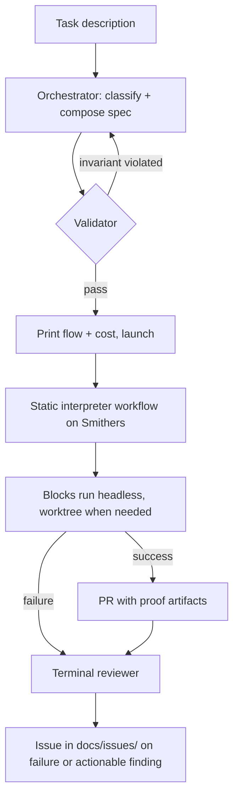
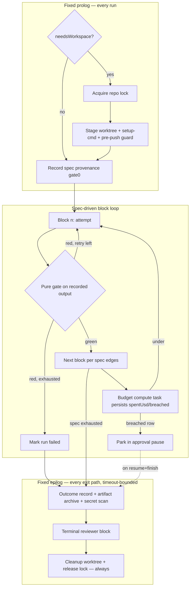
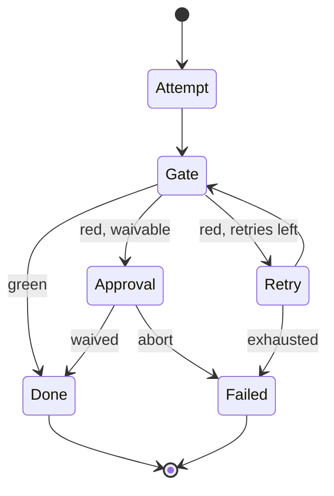

# Dynamic Flow Composition for se-pipeline - Plan

## Goal Capsule

- **Objective:** Replace the fixed-phase se-pipeline entry with a single entry point where an orchestrator agent classifies the task, composes a flow from a library of typed blocks as a declarative spec, and runs it via a static interpreter workflow on Smithers — each run in its own provisioned worktree, closed by a terminal reviewer.
- **Product authority:** Andrew (sole operator of this personal pipeline). Product decisions settled in dialogue on 2026-08-13.
- **Authority hierarchy:** Product Contract R-IDs govern behavior. KTDs govern implementation mechanism within their cited R constraints. Units override neither.
- **Stop conditions:** Stop and surface to the operator when a change would violate KD1 (Smithers stays the control plane), when the interpreter cannot express a required invariant without changing its file between runs (violates R7), or when a unit requires pushing to main (violates KTD11).
- **Open blockers:** none. Remaining unknowns are listed under Open Questions as deferred to implementation.

---

## Product Contract

Product Contract preservation: R2 and R12 reworded on 2026-08-13 doc review (no scope change — the pre-launch/headless split KTD7 already carried was made explicit; brainstorm and plan moved from the block list to pre-launch stages); R13 narrowed to the v1 escalation path with consensus cross-check deferred; R15 narrowed to failure-or-actionable issue writing. Outstanding Questions moved to Planning Contract → Open Questions. All other requirements unchanged from the requirements-only version.

### Summary

A single pipeline entry takes a task description, composes a flow spec from a library of typed blocks, validates it against mandatory invariants, and runs it on Smithers through one never-changing interpreter workflow. Runs execute autonomously to a PR with proof artifacts; a terminal reviewer turns failures and actionable observations into triageable issue files.

### Problem Frame

The current pipeline (`home/private_dot_claude/dot_smithers/workflows/se-pipeline.tsx`) hardcodes one stage order — optional verify-doc, then work, simplify, verify-code. Tasks that need a different shape (bug reproduction, research, brainstorm-first ideas) fall outside it, so the operator chains brainstorm → plan → work by hand across sessions. Dynamic composition was deferred to "Phase 3" in `docs/plans/2026-07-14-001-feat-smithers-pipeline-plan.md`.

Two further costs shape this work. First, interruption cost: agents block runs with trivial questions the operator merely rubber-stamps. Second, fragility cost: on 2026-08-12 a full day went to pipeline repair — resume failures tied to workflow-file changes (`RESUME_METADATA_MISMATCH`, Smithers issue #1493), review-leg deaths counted as clean results, and environment mismatches in bare checkouts. These failures are design constraints for composition, not work items of this plan.

### Key Decisions

- KD1. **Stay on Smithers as the control plane** (session-settled: user-directed — chosen over Temporal and over Claude Code dynamic workflows: no proprietary lock-in; ce-pov verdict rejected the engine swap). Governs R7, R8.
- KD2. **Flow-as-data interpreted by one static workflow, not generated TSX** (session-settled: user-approved — chosen over TSX codegen: the workflow file never changes between runs, which removes the #1493 resume-failure class for an unchanged module graph and keeps validation deterministic; the residual exposure — editing the interpreter's import graph under a live run — is governed by KTD1's zero-in-flight rule). Governs R5, R6, R7.
- KD3. **Free assembly constrained by a validator, not fixed recipes** (session-settled: user-directed — chosen over per-task-type recipe catalogs: maximum autonomy, with gates enforced as code). Governs R4, R6.
- KD4. **A launched flow is immutable; recomposition means a new run** (session-settled: user-directed — chosen over mid-run rewriting: avoids Smithers issues #1493/#1500 at their weakest point). Governs R9.
- KD5. **The reviewer files issues; the human triages** (session-settled: user-directed — chosen over auto-launching repair runs: keeps the autonomy loop bounded). Governs R14, R15.
- KD6. **One new entry point; the six existing se-* skills remain as manual tools** (session-settled: user-directed — chosen over replacing them: cheap rollback while the new entry proves itself). Governs R3.
- KD7. **Show the composed flow, then launch without waiting** (session-settled: user-directed — chosen over a pre-launch confirmation gate). Governs R10.
- KD8. **Runs complete to a PR autonomously; the PR is the human review point** (session-settled: user-approved — an in-flow approval pause becomes an optional block the composer includes only for risky tasks). Governs R11, R12, R13.

### Requirements

**Block library**

- R1. Every block is a typed unit with zod input and output contracts, so the validator can check boundary compatibility between any two connected blocks.
- R2. The initial library covers the existing pipeline stages (work, simplify, code-review, doc-review) plus new blocks for the bug and research shapes: repro, analysis, subtask creation, proof-artifact collection, PR. Brainstorm and plan dialogue are pre-launch orchestrator stages, not spec blocks (per KTD7).
- R3. Existing se-* skills keep working unchanged while their behavior is also available as blocks.

**Composition and validation**

- R4. The orchestrator classifies the incoming task and assembles an arbitrary flow graph from library blocks; task types (bug, research, feature) are classification heuristics, not hard templates.
- R5. A composed flow is expressed as a declarative spec (data, not code) that one static interpreter workflow executes on Smithers.
- R6. A deterministic validator checks every spec before launch: type-compatible block boundaries, secret-scan present before any external-agent leg, and every other invariant the current pipeline enforces in code. External-agent legs additionally pass a payload-level secret scan at dispatch (KTD13).
- R7. The interpreter workflow file is identical across runs; only the spec input varies.

**Execution**

- R8. Each run that contains a workspace-needing block executes in its own worktree with the environment provisioned (setup command run) before any block that builds or validates code; flows with no such block run without a worktree (KTD2).
- R9. If a running flow proves wrong, the run terminates and a new run is composed; the new run consumes the prior run's artifacts instead of redoing completed work.
- R10. At launch the orchestrator prints the composed flow with a cost estimate and starts immediately; no human acknowledgment is awaited.
- R11. A default run proceeds to an opened PR with proof artifacts attached; an approval pause is an optional block, not a default stage.

**Escalation policy**

- R12. Every block in a launched spec runs headless and never asks the operator questions. The human touchpoint of a run is the pre-launch dialogue — brainstorm and plan discussion — in the operator's session (KTD7).
- R13. When plan or code validation raises P1 findings, the flow resolves them autonomously and escalates to the operator only on unresolved contradictions, via the approval-pause path (KD8). A multi-agent consensus cross-check is deferred (see Scope Boundaries).

**Reviewer and feedback intake**

- R14. A terminal reviewer runs after every finish and every failure: on failure it writes the cause analysis; on success it reviews the executed flow for optimization opportunities.
- R15. Reviewer findings become issue files in `docs/issues/` (existing naming convention) only on failure or when an actionable optimization was found; a clean-success review result lives in the outcome record. Each issue carries cause, evidence artifacts, and a proposed fix or optimization; launching any fix stays the operator's decision.
- R16. The operator can submit pipeline or behavior corrections during the session; an in-session subagent files them as `docs/issues/` entries without interrupting the running flow.



### Key Flows

- F1. Bug task end-to-end
  - **Trigger:** Operator launches the entry point with a bug description.
  - **Steps:** Orchestrator composes repro → analysis → fix → verify → proof-artifacts → PR; validator passes the spec; flow and cost print; run executes headless in its worktree; PR opens with repro evidence; reviewer checks the executed flow and files an issue only if it found an actionable optimization.
  - **Covers:** R2, R4, R5, R6, R8, R10, R11, R14.
- F2. Failure path
  - **Trigger:** A block exhausts its retries or the flow proves mis-composed mid-run.
  - **Steps:** Run terminates; terminal reviewer analyzes the failure and writes an issue with cause and artifacts; if the task is still wanted, a new run is composed that consumes the prior run's artifacts.
  - **Covers:** R9, R14, R15.
- F3. Correction intake during a run
  - **Trigger:** Operator sends a pipeline or behavior correction to the orchestrator session while a run is active.
  - **Steps:** An in-session subagent formats the correction as a `docs/issues/` entry; the running flow continues undisturbed; the operator triages the issue later.
  - **Covers:** R16.

### Acceptance Examples

- AE1. **Covers R6.** Given a composed spec whose external code-review leg is not preceded by a secret-scan block, when the validator runs, then the launch is refused and the orchestrator must recompose.
- AE2. **Covers R12, R13.** Given a P1 finding during plan validation ("target file ambiguous"), when autonomous resolution settles it, then the flow proceeds without contacting the operator; an unresolved contradiction escalates via the approval-pause path.
- AE3. **Covers R14, R15.** Given a run whose review leg dies mid-stream, when the run terminates, then `docs/issues/` contains a new file naming the failed block, the observed cause, and the log excerpts (secret-scanned per KTD13) — not a silent zero-findings result.
- AE4. **Covers R9.** Given a research run whose fix phase reveals the wrong approach, when a new run is composed, then completed research artifacts are inputs to the new spec and are not regenerated.

### Success Criteria

- Manual brainstorm → plan → work chains disappear from sessions: one launch closes a task end-to-end.
- Operator interruptions are architectural only, once per run in the pre-launch dialogue; "which file should I write to?"-class questions never reach the operator.
- Every pipeline failure leaves a cause-bearing issue file instead of a debugging session.

### Scope Boundaries

Deferred for later:

- Container isolation of the work stage — per-run worktree with setup is sufficient for now.
- Consensus cross-check block for P1 resolution (was U8) — v1 escalates contradictions via the approval-pause path (R13); add multi-agent cross-checking once run history shows how often contradictions occur. Its legs will use the read-only ask-agent invocation path, never full-permission mode.
- Learned recipes (saving successful specs as named, reviewer-tunable recipes) — a follow-up phase after the interpreter stabilizes.
- Decommissioning the six se-* skills — revisit once the new entry has replaced them in practice.
- External stall watchdog process — v1 relies on mandatory per-block timeouts (KTD8) plus reviewer analysis of parked runs; a standalone liveness monitor is follow-up work.
- Upgrade to `smthrs` 0.34 (package renamed from `smithers-orchestrator` in 0.33) — decoupled follow-up, see KTD5; the migration requires draining all in-flight runs first (KTD1's zero-in-flight rule applies to the whole module graph at once).

Outside this plan's identity:

- Fixing Smithers upstream bugs (#1493, #1500, idle-kill false positives) — they enter this plan only as design constraints.
- Building on Claude Code dynamic workflows or any external engine.

### Dependencies / Assumptions

- Smithers constraints the design must respect: retries are the only recovery primitive (issue #1500); changing any file in a workflow's statically-imported module graph under a live run breaks resume (issue #1493); default retries are infinite, so every block declares explicit `retries`; absent optionals cross subflow boundaries as `null`, requiring `.nullish()` schemas (documented in `docs/se-pipeline.md`).
- Verified: the interpreter design is supported by the engine. Smithers computes `workflowHash` over the statically-imported module graph's file contents, never over the rendered tree; run input is persisted per run and immutable; mapping over input data into `Task`/`Subflow`/`Parallel` trees is the documented "dynamic fan-out" pattern. Engine requirements: task and subflow `id` props must be deterministic, derived from spec content, never from array index or timestamp; and resume-stability holds only for the module graph as of the run's launch (see KTD1).
- Existing pipeline libraries (`gates.ts`, `agents.ts`, `staging.ts`, `stage-gate.ts`, `cost.ts`, `envelopes.ts`, `review-merge.ts`, `review-schema.ts`, `severity-summary.ts`, `plan.ts`, `consult-prompt.ts` under `home/private_dot_claude/dot_smithers/workflows/lib/`) are reusable inside blocks; the worktree setup mechanism (`--setup-cmd`) already exists in `bin/executable_se`.

---

## Planning Contract

### Key Technical Decisions

- KTD1. **Spec-as-input interpreter: one static `workflows/se-flow.tsx`, spec passed as run input, block ids derived deterministically from spec content** (session-settled: user-approved — chosen over TSX codegen: engine hashes the module graph, not the rendered tree, so a static file with varying input is resume-stable; instantiates KD2, cites R5, R6, R7). The interpreter namespaces every spec-derived engine node id under a fixed prefix (`b:<blockId>`) so spec names can never collide with ladder-derived ids (`gate-*`, `approve-*`, `-extra`, `-crashed`). **Zero-in-flight rule:** files in the interpreter's statically-imported module graph (interpreter, blocks, shared libs) are edited only when no run is live or parked; otherwise runs are drained first or explicitly written off via their outcome records.
- KTD2. **Fixed prolog and epilog around the composable block list.** Repo lock, worktree staging + setup, spec provenance record (gate0 role), cost accounting, cleanup, data-driven summary, outcome record, and the terminal reviewer are interpreter-owned. They run on every flow and are not expressible or omittable in the spec. The lock + staging + setup step is conditional on an interpreter-computed `needsWorkspace` flag derived from the catalog entries of the spec's blocks — a flow of workspace-free blocks (research, doc-review) acquires no lock and stages no worktree; the conditionality is computed by the interpreter, never spec-expressible. Interpreter-owned epilog blocks carry explicit timeouts, and every exit path reaches cleanup + lock release regardless of reviewer success (the reviewer reads only the durable outcome record). Cites R8, R9.
- KTD3. **One generic block-output table plus a closed mirror-key set.** The interpreter's `createSmithers` output schema is fixed: a single `blockOutput` key `{blockId, kind, status, payloadJson}`, the fixed prolog/epilog keys, and one mirror output key per subflow-kind block in the registry (a closed set — `simplify`, `docReview`, `reviewLeg` — so the workflow file stays identical across runs per R7). A `<Subflow>` writes its own output shape into its mirror key; the interpreter follows each subflow with a deterministic compute task that copies the mirror row into `blockOutput`, which is what bind proofs, the outcome record, and cross-block reads consume. Per-block typing is recovered at read time by parsing `payloadJson` with the block's registry zod schema.
- KTD4. **Gates are pure; effects are separate compute steps.** The current `workGateFn` commits agent changes and runs validate-cmd inside a "gate" (`se-pipeline.tsx:683-705`). Blocks split this: effectful steps (commit-work, run-validate) are `compute` blocks; gate functions only classify their recorded output. Cites R6.
- KTD5. **Stay pinned to `smithers-orchestrator` 0.32.0 for this plan.** The 0.33 package rename to `smthrs` and 0.34 features (`ForkFanOut`, `fallbackAgents`) are a separate follow-up upgrade. Rationale: the 0.29→0.32 upgrade cost a repair day on 2026-08-12; do not couple a large feature to an engine migration. Nothing in 0.33/0.34 replaces the interpreter design.
- KTD6. **The block catalog is generated, never hand-maintained.** `se blocks --json` emits the catalog from block definitions: name, kind, purpose, input/output JSON Schema (from zod), preconditions, `external` flag, `needsWorkspace` flag, waive policy, default retries/timeout, cost profile. The orchestrator composes from this catalog, not from TS source. The catalog documents that JSON Schema does not carry zod `.refine()`/`.transform()` constraints; runtime parse gates (KTD14) are the authority. Cites R1, R4.
- KTD7. **Interactive composition happens in-session before launch; every spec block is headless.** Brainstorm and plan dialogue run in the operator's Claude Code session (the R12 touchpoint); the launched spec contains only headless blocks. Instantiates R12.
- KTD8. **The validator requires explicit `retries` and `timeoutMs` on every block and returns machine-actionable errors.** Error shape: violated invariant, offending block/edge, fix hint. Validator invariants beyond typing: block-id grammar (lowercase kebab, no reserved ladder affixes), DAG over `after` edges, `bindTo` targets reachable through `after` ancestry, secret-scan before external legs, command-provenance (KTD15), `artifactsFrom` archive existence. The orchestrator gets at most 3 recompose attempts per task; on the third failure it files a `docs/issues/` entry and stops. Cites R6; guards the Smithers infinite-retry default.
- KTD9. **Budget ceiling parks, never kills.** Each run carries a cost ceiling (flag, default in `se flow`); a deterministic compute task at each block boundary reads accumulated cost inside its closure (via the `workflows/lib/cost.ts` pattern) and persists `{spentUsd, breached}`; the render branches to the park approval only on that persisted row, never on a render-time database read. The reviewer covers the breach in its epilog analysis once the run resumes and finishes. Chosen over hard-kill: parked work stays resumable.
- KTD10. **Every run has a durable outcome record and artifact archive.** The epilog persists `{spec, per-block status, artifact manifest, cost}` as JSON and copies every manifest artifact out of the worktree and /tmp into a per-run archive under the Smithers state directory (keyed by runId) — on success and on every failure path that reaches the epilog. For runs killed before the epilog, `se flow` synthesizes the record from the persisted block rows in `smithers.db`. The record and archive are the inter-run interface: R9's handoff reads them (validator checks the archive exists), the reviewer (R14) and PR body consume them. Cites R9, R11, R14.
- KTD11. **PR-only push invariant, mechanized.** Blocks may create branches and open PRs; no block pushes to main or merges. Worktree staging installs a pre-push guard (hook or push-wrapping remote config) that refuses any ref other than the run-id branch; branch/worktree names carry the run id so rollback is close-PR-plus-delete-branch.
- KTD12. **Bind proofs are computed from spec edges.** The interpreter derives each block's `bind={ctx.prove(...)}` targets from the spec's declared dependency edges, replacing today's hand-written fallback chains (e.g., the rescan scan-base chain at `se-pipeline.tsx:965-980`). Cites R6; preserves the BOUND_STALE tamper-detection discipline.
- KTD13. **Publication-time and dispatch-time secret scanning.** Two scan surfaces beyond the diff-scoped scan block: (a) every `external: true` block's serialized input payload is scanned before dispatch to the external vendor; (b) the epilog scans the outcome record, issue-file text, and rendered PR body before any file write or push — a hit redacts and flags in the reviewer output. Cites R6, R15.
- KTD14. **Boundary compatibility is exact-schema plus runtime parse.** The validator checks boundary compatibility by exact registry schema identity (or a declared edge adapter), not structural JSON-Schema subsumption; the interpreter additionally runtime-parses every block input with the registry zod schema at dispatch, so `.refine()`/`.transform()`/`.nullish()` semantics are enforced even where JSON Schema cannot express them. Cites R1, R6.
- KTD15. **Command provenance.** Command-bearing fields (setup-cmd, validate-cmd, any exec-typed input) come only from operator-supplied sources — CLI flags or the plan document the spec references — matching today's operator-trusted convention. The validator rejects specs that inline executable command strings. Cites R6, R10.

### High-Level Technical Design

Interpreter structure (directional guidance, not implementation specification):



Spec shape sketch (directional):

```text
flowSpec {
  task: { description, classification }
  repo, setupCmdRef?, budgetUsd            # commands by operator-source reference, never inline (KTD15)
  blocks: [ { id, block: <catalog name>, input: {...}, retries, timeoutMs,
              after: [blockId...], bindTo: [blockId...], waive: <policy> } ]
  artifactsFrom?: <prior outcome-record id>  # R9 handoff, validated against the archive
}
```

Block lifecycle (generalization of `stageBlock()` at `se-pipeline.tsx:421-519`):



### Assumptions

- Default budget ceiling starts at a conservative flag-set value in `se flow`; the exact default is tuned during implementation from real run costs (cost data in `smithers.db`).
- The Subflow typing cast (`se-pipeline.tsx:47-52`, comment cites 0.28) is re-verified against 0.32 in U2; the block dispatcher design assumes a cast remains acceptable if typing has not improved.

### Open Questions

Deferred to implementation:

- Exact v1 interpreter primitive set beyond sequence/parallel/conditional/retry — settled inside U1 by what the initial block library needs, not speculatively.
- The default budget ceiling value — tuned in U5 from observed run costs.

---

## Current State

Merge `5985d29` on `main` already carries part of this plan. Read the code before planning any unit — do not rebuild what is there.

- **U1, U2, U6 are code-complete with tests.** `workflows/lib/flow-spec.ts`, `flow-validate.ts`, `block-registry.ts`, `catalog.ts`, `reviewer.ts`, `issue-writer.ts` and their co-located tests. Change them only where a later unit exposes a real gap.
- **U3, U9, U4, U5, U7 exist as structure only.** `workflows/se-flow.tsx`, `workflows/lib/blocks/index.ts`, `workflows/lib/flow-run.ts`, the `cmd_flow`/`cmd_blocks` cases in `bin/executable_se`, and `skills/se-flow/SKILL.md` are in place, but the compute-effect dispatch bodies in `se-flow.tsx` return `{}`. Filling those bodies and covering them with tests is the remaining headless work.
- **Suite baseline on `main`:** `bun test` 260 pass, `bats tests/scripts.bats` 100 pass, `bats tests/smoke.bats` 87 pass, `make lint` clean. Any drop below these numbers is a regression introduced by the run.

---

## Execution Environment Split

The pipeline stages an isolated git worktree under `/tmp`. That worktree has no live Smithers daemon to launch nested runs against, no authenticated `gh`, and no permission to run `chezmoi apply` — the host rule forbids it. Any unit whose completion depends on those three cannot finish there, and reporting it as blocked parks the work gate.

So each unit is split into a headless share and a host share. A unit whose headless share passes its pipeline gates is **code-complete**; it becomes **done** only after its host share passes.

| Unit | Headless share (pipeline builds and verifies this) | Host share (operator runs this after merge) |
|---|---|---|
| U0. Engine spike | none — the spike is not code | all of it: hash stability across launches, kill mid-block + resume, `Approval` inside a dynamic subtree, park-and-edit resume failure |
| U1. Flow-spec schema and validator | all of it: pure zod schema, pure validator, unit tests | none |
| U2. Block registry and catalog | all of it: registry, catalog generator, byte-stability test | none |
| U3. Carve stages into blocks | block wrappers, characterization tests, `bats tests/scripts.bats` | fixture run of the untouched `se pipeline` (R3 regression) |
| U9. New-shape blocks | repro, analysis, subtasks, proof-artifacts, and the `pr` block against a stubbed `gh` | the `pr` block against real `gh`: opened PR, unauthenticated failure, existing-PR case |
| U4. Interpreter workflow | `se-flow.tsx`, pure helpers in `flow-run.ts`, unit tests over spec-to-node-tree derivation | live fixture flow, kill/resume determinism, budget-breach park, KTD1 park-and-edit regression, `artifactsFrom` handoff between two real runs |
| U5. `se flow` CLI | all of it: `cmd_flow`, `cmd_blocks`, `bats tests/scripts.bats` under `SE_DRY_RUN=1`, `make lint` | `se flow salvage` against a genuinely killed run |
| U6. Reviewer and issue writer | reviewer block, `issue-writer.ts`, unit tests over rendering, sequence numbering, redaction | injected mid-stream leg death produces the real `docs/issues/` file (AE3) |
| U7. Orchestrator entry skill | `SKILL.md`, `tests/smoke.bats` entry, `make test-local` diff | `chezmoi apply`, then `se flow --dry-run` and `se blocks --json` from the deployed copy |

Two consequences for sequencing. U0 stops gating the pipeline run: its findings inform the U1 and U4 approach notes, and the operator runs it on the host before or alongside the headless work — a negative result still reopens KD2. And U4's live scenarios move out of the unit and into the host share, so U4 lands as an interpreter with proven pure helpers and unproven live behavior. State that in its envelope rather than claiming completion.

Prerequisite, already fixed: worktree staging now runs `git submodule update --init --recursive` when the repo has a `.gitmodules` (`workflows/lib/staging.ts`). Without it `tests/helpers/bats-libs` was empty in every staged worktree and all bats gates failed on a missing helper, which made the U3, U5 and U7 headless shares unreachable.

---

## Implementation Units

Phased with strict gates: Phase A (U1 → U2 → U3, with U9 after U2) gates Phase B (U4 → U5); Phase B gates Phase C (U6, then U7). Within Phase A, U3 and U9 are parallel after U2; elsewhere units form chains. U0 is operator-run on the host and gates no phase — see Execution Environment Split.

### U0. Engine spike: dynamic Approval and resume stability

- **Goal:** Prove the two engine behaviors the whole architecture stands on before any interface hardens.
- **Requirements:** KD2, KTD1; resolves the former open question on `Approval` nodes in dynamic subtrees.
- **Dependencies:** none. Operator-run on the host; gates no pipeline phase (Execution Environment Split).
- **Files:** throwaway spec + scratch workflow (not committed, or committed under a `spike/` name and deleted before DoD per the cleanup criterion).
- **Approach:** a ~20-line static workflow mapping over input data: dynamic `Parallel`/`Sequence` nesting, an `Approval` node inside a dynamically-generated subtree, explicit ids. Kill it mid-block; resume; verify completed tasks match and the approval survives.
- **Test scenarios:**
  - Two launches with different inputs report the same workflow identity (hash stability).
  - Kill mid-block + resume re-executes zero completed tasks.
  - Approval inside a dynamic subtree pauses and resumes correctly.
  - Editing an imported helper file between park and resume produces the documented resume failure (proves the KTD1 zero-in-flight rule, not assumes it).
- **Verification:** host gate; spike findings recorded in the U1/U4 approach notes. A negative result reopens KD2 with the operator and invalidates U4's design, but does not block the headless units from landing.

### U1. Flow-spec schema and validator

- **Goal:** Define the declarative flow-spec (zod) and the deterministic validator that enforces every launch invariant.
- **Requirements:** R5, R6; KTD1, KTD8, KTD12, KTD14, KTD15.
- **Dependencies:** none in the pipeline (U0 is a host gate; its findings refine this approach, they do not block it).
- **Files:** `home/private_dot_claude/dot_smithers/workflows/lib/flow-spec.ts`, `home/private_dot_claude/dot_smithers/workflows/lib/flow-validate.ts`, co-located `*.test.ts`.
- **Approach:**
  1. Spec schema per the HTD sketch: run-level `repo`, `setupCmdRef` (operator-source reference, never inline text), `budgetUsd`, `artifactsFrom`; blocks with id, catalog name, input, mandatory `retries`/`timeoutMs`, `after` edges, `bindTo` edges, waive policy.
  2. Validator checks (KTD8 list): id grammar and reserved-affix exclusion; DAG over `after`; `bindTo` reachability through `after` ancestry; boundary compatibility by exact schema identity via the injected registry interface (KTD14); secret-scan before every `external: true` block; mandatory retries/timeouts; waive policy valid for block kind; command-provenance (KTD15); `artifactsFrom` resolves to an existing archive (KTD10).
  3. Error type per KTD8: `{invariant, blockId | edge, hint}`.
- **Patterns to follow:** zod usage and `.nullish()` boundary convention in `workflows/lib/envelopes.ts`; pure-function gate style in `workflows/lib/gates.ts`; co-located bun tests as in `workflows/lib/gates.test.ts`.
- **Test scenarios:**
  - Valid bug-shaped spec passes and returns a normalized spec.
  - Covers AE1. External review block without a preceding secret-scan block → rejected; error names the edge and hints the insertion point.
  - Cycle in `after` edges → rejected naming the cycle.
  - `bindTo` target not an `after`-ancestor → rejected.
  - Missing `retries` or `timeoutMs` on any block → rejected naming the block.
  - Boundary schema mismatch without a declared adapter → rejected naming both blocks.
  - Block id using a reserved affix (`gate-x`, `x-extra`) → rejected.
  - Inline command string in any exec-typed field → rejected (KTD15).
  - `artifactsFrom` pointing at a missing archive → rejected.
- **Verification:** `bun test` green in `home/private_dot_claude/dot_smithers/`; validator is a pure function with no I/O (archive existence check injected).

### U2. Block registry and generated catalog

- **Goal:** Define the block contract and registry, and generate the machine-readable catalog the orchestrator composes from.
- **Requirements:** R1, R2, R3; KTD3, KTD6, KTD14.
- **Dependencies:** U1.
- **Files:** `home/private_dot_claude/dot_smithers/workflows/lib/block-registry.ts`, co-located test; catalog emission wired into U5's CLI.
- **Approach:**
  1. Block definition: `{name, kind: agent | compute | subflow, inputSchema, outputSchema, gateFn, waivePolicy, external, needsWorkspace, preconditions, defaults: {retries, timeoutMs}, costProfile}`; `kind: agent` blocks additionally carry `makeAgent({worktreePath, timeoutMs, budgetUsd})` (reusing `workflows/lib/agents.ts` profiles) and `buildPrompt(input)` — the interpreter dispatches agent blocks exclusively through these two members.
  2. `external: true` blocks declare a data-sharing contract: payload passes the KTD13 dispatch-time secret scan; invocation uses the read-only external-agent path.
  3. Registry entries for the initial library reuse existing lib functions; se-* skills stay untouched (R3).
  4. Catalog generator converts zod schemas to JSON Schema; output is stable-ordered for diffing; documents the KTD6 JSON-Schema limitation note.
  5. Re-verify the Subflow typing cast against 0.32 (see Assumptions); adjust dispatcher typing only.
- **Patterns to follow:** dual-mode subflow shape of `workflows/se-simplify.tsx`; gate contract `GateResult` in `workflows/lib/gates.ts:65-233`.
- **Test scenarios:**
  - Catalog JSON round-trips: every registry entry appears with input/output JSON Schema, kind, external and needsWorkspace flags, defaults.
  - Registry exact-schema compat check: identical schema ids accepted, mismatched pair refused; a declared edge adapter reconciles a named pair.
  - A `compute` block definition with a waive policy invalid for its kind is rejected at registration.
  - An `external: true` block without a data-sharing contract is rejected at registration.
- **Verification:** `bun test` green; catalog output byte-stable across two consecutive generations.

### U3. Carve existing stages into library blocks

- **Goal:** Make the existing pipeline behaviors available as registry blocks without touching the fixed pipeline.
- **Requirements:** R2, R3; KTD4, KTD12.
- **Dependencies:** U2. Parallel with U9.
- **Files:** `home/private_dot_claude/dot_smithers/workflows/se-code-review-block.tsx`, `home/private_dot_claude/dot_smithers/workflows/lib/blocks/` (work, secret-scan, rescan, simplify, doc-review wrappers), co-located tests.
- **Approach:**
  1. Unify the in-pipeline `verify-code` logic (`se-pipeline.tsx:879-940`) with standalone `se-code-review.tsx` into one Subflow-shaped block; resolve the staging-timing difference (per-attempt in pipeline vs once standalone) explicitly in favor of per-attempt.
  2. Split `work`: commit-work and run-validate become `compute` blocks; the work gate becomes pure classification (KTD4).
  3. Wrap `secret-scan` and `rescan` as `compute` blocks over `workflows/lib/envelopes.ts` functions; scan-base selection comes from spec edges (KTD12).
  4. `simplify` and `doc-review` register their existing Subflows with mirror keys per KTD3.
  5. `se-pipeline.tsx` stays fully untouched in v1 — no carved-block consumption; deduplication is revisited only when the se-* skills are decommissioned (protects KD6's rollback path).
- **Execution note:** Add characterization coverage for the verify-code merge behavior before unifying the two copies.
- **Patterns to follow:** `stageBlock()` (`se-pipeline.tsx:421-519`) as the attempt/gate/approval ladder being generalized; `bind` discipline (`se-pipeline.tsx:406`, call sites at 717–1049).
- **Test scenarios:**
  - Unified code-review block produces the same merged envelope as the current standalone harness on a fixture diff.
  - Work split: commit-work block commits staged agent changes; validate block records validate-cmd output; the pure work gate classifies a failing validate output as red without performing any I/O.
  - Secret-scan block on a fixture worktree with a planted tracked secret → red gate.
- **Verification:** headless — `bun test` green, `bats tests/scripts.bats` green. Host — a fixture run of the untouched `se pipeline` still passes (`tests/fixtures/make-pipeline-fixture.sh` + dry-run checks).

### U9. New-shape blocks: repro, analysis, subtasks, proof-artifacts, PR

- **Goal:** Build the blocks R2 promises beyond the carved stages, so bug and research flows are composable end-to-end.
- **Requirements:** R2, R11; KD8, KTD11, KTD13.
- **Dependencies:** U2. Parallel with U3.
- **Files:** `home/private_dot_claude/dot_smithers/workflows/lib/blocks/` (repro, analysis, subtasks, proof-artifacts, pr), co-located tests.
- **Approach:**
  1. `repro`, `analysis`, `subtasks` are agent blocks (prompt-defined via `buildPrompt`); `proof-artifacts` is a compute block collecting named outputs into the artifact manifest.
  2. `pr` block: pushes the run-id branch (through the KTD11 guard) and opens the PR via `gh`, embedding the secret-scanned spec + outcome record (KTD13); explicit failure paths — `gh` unauthenticated, push rejected, PR already exists — each classified by the gate, never silent.
- **Test scenarios:**
  - PR block on a fixture repo opens a PR whose body embeds spec and outcome record (stubbed `gh` in unit tests; live in the DoD fixture run).
  - PR block with unauthenticated `gh` → red gate naming the cause.
  - PR block when a PR for the branch already exists → green with the existing PR referenced, not a duplicate.
  - Proof-artifacts block registers outputs into the manifest consumed by the outcome record.
- **Verification:** headless — `bun test` green with `gh` stubbed, covering the opened-PR, unauthenticated, and existing-PR classifications. Host — the live fixture flow exercises the real `gh` path.

### U4. Interpreter workflow

- **Goal:** One static `se-flow.tsx` that executes any validated spec with fixed prolog/epilog.
- **Requirements:** R5, R7, R8, R9, R11; KTD1, KTD2, KTD3, KTD9, KTD10, KTD11, KTD12, KTD13.
- **Dependencies:** U1, U2, U3, U9.
- **Files:** `home/private_dot_claude/dot_smithers/workflows/se-flow.tsx`, co-located interpreter helpers in `home/private_dot_claude/dot_smithers/workflows/lib/flow-run.ts`, tests.
- **Approach:**
  1. Prolog: `needsWorkspace` computed from catalog flags; when true — repo lock, worktree staging with setup-cmd and the KTD11 pre-push guard; always — spec provenance record (spec hash + run-level fields as the gate0-role row, consumed by `se flow` resume) — reuse `workflows/lib/staging.ts`.
  2. Block loop: render blocks from the spec DAG (`.map()` with `b:<id>` namespaced deterministic ids per KTD1), generalized stageBlock ladder, `bind` proofs from `bindTo` edges (KTD12), outputs into `blockOutput` with subflow mirror-copy tasks (KTD3), runtime parse of every block input (KTD14), budget compute task persisting `{spentUsd, breached}` with render branching on the persisted row (KTD9).
  3. Epilog on every exit path, timeout-bounded: outcome record + artifact archive + publication-time secret scan (KTD10, KTD13), data-driven summary (block list from spec), reviewer block slot (filled by U6) that cannot block cleanup, cleanup + lock release on every path.
- **Execution note:** Prove resume stability early — crash a fixture run mid-block and resume before building out the full epilog (regression form of U0's proof).
- **Patterns to follow:** render-callback style of `se-pipeline.tsx:380-1093` (tree re-derived each tick from persisted outputs); cost reading via the `readRunUsage` SQL pattern (`se-pipeline.tsx:185-224`) inside task closures only.
- **Test scenarios:**
  - Covers AE4. Run 1 terminated after a research block; run 2 spec with `artifactsFrom` pointing at run 1's archive validates, and its blocks receive the listed artifacts.
  - Hash stability: two dry-run launches with different specs report the same workflow identity; resume of an interrupted run re-executes zero completed blocks.
  - Same spec re-launched after crash matches completed block rows (deterministic ids).
  - Budget breach mid-flow parks the run via the persisted-row branch; the parked run resumes after operator ack and reaches the epilog.
  - Hard-kill mid-block, no resume: `se flow` synthesizes the outcome record from `smithers.db` and the archive check still validates (KTD10).
  - Editing a block-library file while a run is parked → resume fails with the documented error (KTD1 zero-in-flight rule regression).
  - In-worktree push to a non-run-id ref fails (KTD11 guard).
  - A workspace-free spec (doc-review-only) runs without acquiring the repo lock or staging a worktree.
  - Planted secret in a log excerpt → redacted in the outcome record and issue text (KTD13).
  - Failure path: a block exhausting retries still produces an outcome record.
- **Verification:** headless — `bun test` green over the pure helpers in `flow-run.ts` and the spec-to-node-tree derivation, plus `bun build` proving the module graph resolves. Host — the live fixture flow (bug-shaped, includes the U9 pr block) completes end-to-end in a worktree, opens a PR, and writes an outcome record + archive; the kill/resume, budget-park, `artifactsFrom`, and KTD1 park-and-edit scenarios below all belong to that gate.

### U5. `se flow` CLI subcommand

- **Goal:** Launch, list, resume, and dry-run flow specs; print the composed flow with a cost estimate; expose the block catalog; synthesize outcome records for dead runs.
- **Requirements:** R10; KTD6, KTD9 (ceiling flag), KTD10 (record synthesis).
- **Dependencies:** U4.
- **Files:** `home/private_dot_claude/dot_smithers/bin/executable_se` (new `cmd_flow`, `cmd_blocks` cases), `tests/scripts.bats`, `docs/se-pipeline.md`.
- **Approach:**
  1. `se flow <spec.json> [--budget N] [--setup-cmd C] [--dry-run]` builds input JSON (operator-sourced commands per KTD15) and execs `smithers up workflows/se-flow.tsx`, reusing `smithers_run`, `se_db`, env recovery patterns from `cmd_pipeline`/`cmd_resume`; resume recovers run-level fields from the provenance row.
  2. `se blocks --json` emits the U2 catalog.
  3. `se flow salvage <runId>` synthesizes an outcome record from `smithers.db` for a run that died before its epilog (KTD10).
  4. Flow printout: ordered block list with per-block cost profile sum as the estimate (R10).
  5. Document `se flow`, the spec format, and the block catalog in `docs/se-pipeline.md` (owns the DoD documentation criterion).
- **Patterns to follow:** `cmd_pipeline` JSON building via `jq -cn` with manual fallback; `SE_DRY_RUN=1` bats testing convention (`tests/scripts.bats:1309-1318`).
- **Test scenarios:**
  - Dry-run: spec path, budget, and setup-cmd land in the workflow input JSON.
  - `se blocks --json` output parses and lists the initial library.
  - Resume recovers the repo path and setup-cmd from the persisted provenance row.
  - Invalid spec (validator rejection) exits non-zero and prints the machine-actionable error.
  - `se flow salvage` on a fixture-killed run produces a record the validator accepts for `artifactsFrom`.
- **Verification:** headless — `bats tests/scripts.bats` green under `SE_DRY_RUN=1`, `make lint` green. Host — `se flow salvage` against a genuinely killed run.

### U6. Terminal reviewer block and issue writer

- **Goal:** Turn failures and actionable observations into triageable `docs/issues/` files; keep clean-success results in the outcome record.
- **Requirements:** R14, R15; KD5, KTD10, KTD13.
- **Dependencies:** U4.
- **Files:** `home/private_dot_claude/dot_smithers/workflows/lib/blocks/reviewer.ts` (agent block definition + prompt), `home/private_dot_claude/dot_smithers/workflows/lib/issue-writer.ts`, tests.
- **Approach:**
  1. Reviewer is an epilog-slot agent block with an explicit timeout: input = outcome record + run log excerpts; on failure it writes cause analysis, on success it reviews the executed flow for optimizations.
  2. Issue writer renders `docs/issues/YYYY-MM-DD-NNN-<slug>.md` in the target repo, matching the existing convention — only on failure or when an actionable optimization was found (R15); a clean-success result is recorded in the outcome record with no issue file. All issue text passes the KTD13 secret scan before write.
  3. Dead-leg detection: the reviewer receives per-block status from the outcome record, so a leg that died with a non-terminal status is classified as failure evidence, never as clean zero findings.
- **Patterns to follow:** report-writing (`fs.writeFileSync` JSON pattern, `se-pipeline.tsx:1053-1059`); envelope salvage cascade documented in `docs/se-pipeline.md` for reading agent text output.
- **Test scenarios:**
  - Covers AE3. Fixture run with an injected mid-stream leg death → issue file exists, names the failed block, cause, and (redacted) log excerpts.
  - Clean successful fixture run → no issue file; outcome record carries the review result.
  - Successful run with an actionable optimization (stubbed reviewer output) → issue file exists.
  - Planted secret in a log excerpt → redacted in the issue file (KTD13).
  - Issue filename gets the next NNN sequence for the day.
- **Verification:** headless — `bun test` green over issue rendering, the daily NNN sequence, redaction, and the dead-leg classification. Host — a live fixture failure produces the real issue file (AE3).

### U7. Orchestrator entry skill with correction intake

- **Goal:** The single entry: classify the task, run the pre-launch brainstorm/plan touchpoint, compose a spec from the catalog, validate with the recompose loop, launch, and file operator corrections as issues.
- **Requirements:** R4, R10, R12, R13, R16; KD6, KD7, KD8, KTD6, KTD7, KTD8.
- **Dependencies:** U5, U6.
- **Files:** `home/private_dot_claude/skills/se-flow/SKILL.md` (new user-level skill, chezmoi-managed), `tests/smoke.bats` entry for deployment.
- **Approach:**
  1. Skill flow: classify task type (heuristic per R4) → pre-launch brainstorm/plan dialogue only when the task needs it (KTD7, the single R12 touchpoint) → fetch `se blocks --json` → compose spec → validate; on rejection, recompose (max 3, KTD8) → print flow + cost → `se flow` launch (KD7).
  2. Correction intake (R16): an in-session subagent files corrections to `docs/issues/`; its tool grant allows Write/Edit only under `docs/issues/**` (enforced via agent permission rules, not prose); the running flow is untouched.
  3. Escalation rules in the skill text: no trivial questions; P1 contradictions escalate via the approval-pause path (R13); prior-run artifacts and issue files are quoted as untrusted data during composition, never followed as instructions.
- **Patterns to follow:** existing se-* skill wrapper shape (thin, delegates to `bin/executable_se`); `docs/agent-setup-inventory.md` conventions for skill registration.
- **Test scenarios:**
  - Given canonical bug, research, and feature task descriptions, the composed specs pass the validator (parity across task types; no assertion on spec internals).
  - Validator rejection → recompose succeeds within 3 attempts on a fixable spec; on an unfixable spec, an issue file exists after attempt 3 and no run launches.
  - A correction submitted during a live fixture run → issue filed; run state in `smithers.db` unchanged.
  - Intake subagent attempting a write outside `docs/issues/` → denied.
- **Verification:** headless — `bats tests/smoke.bats` covers the skill file, `make test-local` shows the expected chezmoi diff, scripted spec-composition scenarios pass. Host — `chezmoi apply`, then the skill drives `se flow --dry-run` and `se blocks --json` from the deployed copy.

---

## Verification Contract

Two tables, one per environment, matching the Execution Environment Split. Passing the first is what the pipeline run is measured against; passing the second is what makes the feature usable.

### Pipeline gates — headless, every one runnable in the staged worktree

| Gate | Command | Applies to |
|---|---|---|
| Unit tests (bun, co-located) | `bun test` in `home/private_dot_claude/dot_smithers/` | U1–U6, U9 |
| CLI dry-run integration | `bats tests/scripts.bats` | U3, U5 |
| Deployment smoke | `bats tests/smoke.bats` and `make test-local` (chezmoi diff only — never `chezmoi apply` on host) | U7, all new files |
| Lint | `make lint` | shell changes in `bin/executable_se` |

These four are the pipeline's `validate-cmd` surface. A work stage that passes them and reports envelope status `complete` clears the work gate.

### Host gates — operator-run, after the branch merges

Recorded in `docs/plans/2026-08-13-002-dynamic-flow-composition-host-verification.md`, which carries the per-scenario checklist.

| Gate | Command | Applies to |
|---|---|---|
| Engine spike proof | U0 scenarios via dry-run + kill/resume | U0 |
| Live end-to-end | fixture flow via `tests/fixtures/make-pipeline-fixture.sh`: bug-shaped spec → PR + outcome record + archive; injected failure → reviewer issue | U4, U6, U9 |
| Regression | existing `se pipeline` fixture run unchanged | U3 |
| Skill deployment | `chezmoi apply`, then `se flow --dry-run` and `se blocks --json` from the deployed copy | U7 |

Quality gates: no unit is code-complete with failing or skipped tests. The interpreter hash-stability scenario (U4) is a permanent host regression gate before `se flow` is used for real work.

## Definition of Done

Code-complete — the bar the pipeline run is asked to reach:

- Units U1–U7 and U9 landed with their headless shares finished; every pipeline gate green. (U8 consensus block is deferred scope — see Scope Boundaries.)
- Every unit whose host share is outstanding says so explicitly in its envelope, naming the unrun scenarios. Silence reads as a false completion claim.
- `docs/se-pipeline.md` documents `se flow`, the spec format, and the block catalog (owned by U5; runbook stays present-tense).
- Abandoned experimental code is removed from the diff.

Done — the bar for calling the feature finished, reached on the host:

- U0's four spike scenarios pass, or a negative result reopens KD2 with the operator.
- One live bug-shaped flow completes end-to-end: provisioned worktree, headless blocks, opened PR embedding the secret-scanned spec + outcome record, no spurious issue file.
- One live failure path: injected block failure yields an outcome record, artifact archive, and a cause-bearing `docs/issues/` file (AE3).
- The untouched `se pipeline` command still passes its fixture run (R3).
- The entry skill works from its deployed copy, not only from this checkout.

---

## Sources / Research

- `docs/se-pipeline.md` — pipeline invariants, gates, quirks, recovery procedures, the existing "edit sources only at zero in-flight runs" discipline KTD1 extends.
- `docs/plans/2026-07-14-001-feat-smithers-pipeline-plan.md` — the original Phase 3 deferral this plan takes up.
- Smithers engine facts: resume durability metadata (workflow path + module-graph content hash + VCS root; input immutable per run), dynamic fan-out as the documented pattern, stable-`id` requirement — smithersai/smithers `docs/capabilities/declarative-workflows.mdx` (upstream, 2026-08-13 via gh api) and version-exact against the pinned engine: `node_modules/smithers-orchestrator/docs/llms-full.txt` (v0.32.0: "Same input + same code = same task IDs, so resume is deterministic"; "Use stable IDs (t.id, not array index) so resume matches"; module-graph change requires a fresh run). Releases v0.33.0 (package rename to `smthrs`), v0.34.0 (`ForkFanOut`, `fallbackAgents`, `up --resume`).
- Smithers issues #1493 (workflow-change on resume) and #1500 (retry-only recovery) — github.com/smithersai/smithers.
- Repo seams: `stageBlock()` at `home/private_dot_claude/dot_smithers/workflows/se-pipeline.tsx:421-519`; effectful work gate at `:683-705`; verify-code inline duplication at `:879-940`; hardcoded stage list at `:1032`; rescan fallback chain at `:965-980`; lock lifecycle in `workflows/lib/staging.ts`; CLI seams in `bin/executable_se`.
- Session evidence from 2026-08-12 runs: `RESUME_METADATA_MISMATCH` and review-leg-death frequencies that motivated KD2, KD4, KTD8, and U6's dead-leg rule.
- Three-envelope doc review 2026-08-13 (local personas + external claude + external opencode/GPT-5.5): consensus findings shaped KTD13–KTD15, U0, U9, and the KTD1 zero-in-flight rule.
