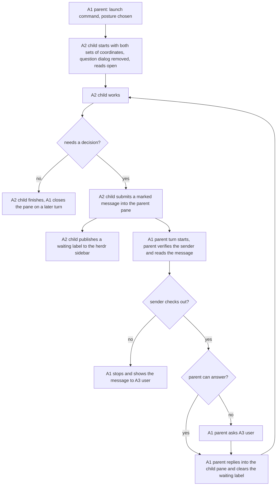
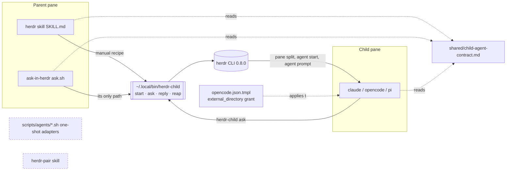
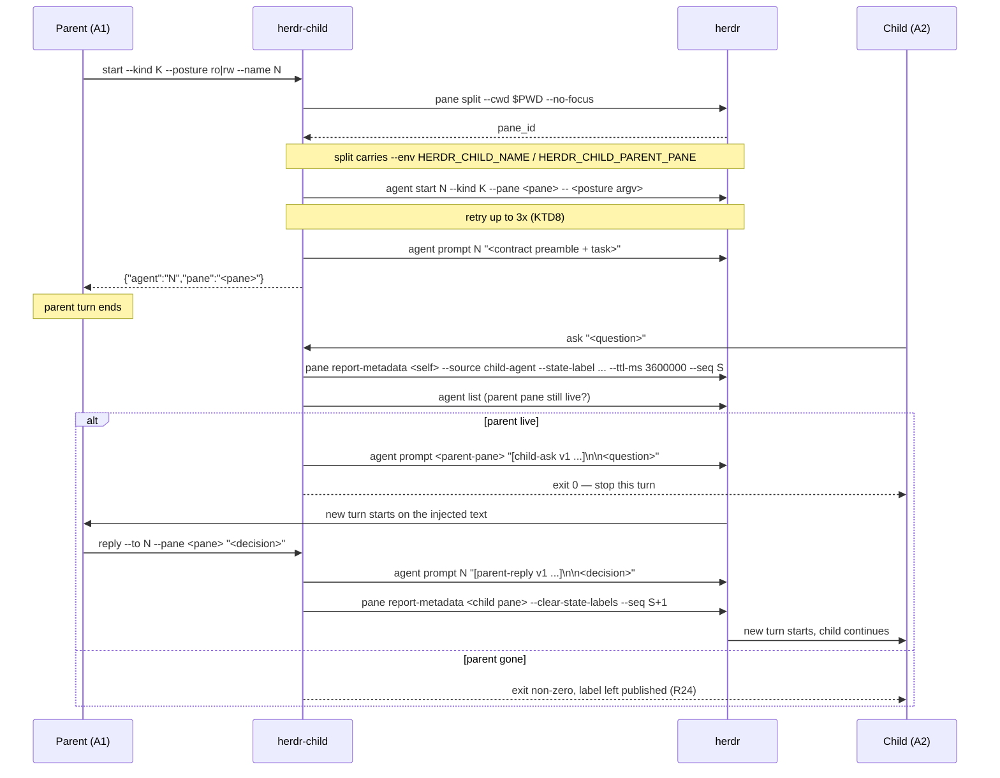

# Child Agent Launch Contract - Plan

## Goal Capsule

- **Objective.** Give a parent agent a way to start a child agent in a sibling herdr pane so that a child needing a decision can reach the parent after the parent's turn has ended, and so that the two stalls this repo has measured — a permission ask and a question dialog — cannot arise in the first place. Three child behaviours stay outside that coverage: a child that hangs without asking anything; a child that answers its own question and carries on instead of calling; and a child whose question was delivered but never answered, which waits indefinitely and, once its sidebar label's TTL expires, stops looking any different from a finished pane.
- **Product authority.** The launch contract, the child's permission posture, and the child-to-parent return channel are active scope. Removing the `herdr-pair` skill is active scope because it is a third, divergent spawn path. Anything that wakes a parent without the child's initiative is not active scope.
- **Execution profile.** Seven implementation units. U1 is a gate: it measures the environment claims the design rests on, and a failed measurement is a blocker, not something to work around. U2, U3, U5, U6, and U7 depend on U1; U4 is independent and can land before or alongside U2. U7 also depends on U2 and U3. U4 and U6 are independent of each other and of the rest.
- **Stop conditions.** Stop and report rather than improvising when: the busy-parent delivery measurement in U1 fails; `herdr agent start` cannot start an `opencode` or `pi` child; `herdr pane report-metadata` cannot publish a state label with a TTL; or the child's coordinates do not reach its agent process, since `herdr-child ask` reads them from there and the return channel is unbuildable without them.
- **Tail ownership.** Standalone. The executing session owns review, commit, and any follow-up.

---

## Product Contract

### Summary

One launch command becomes the way a parent agent starts a child agent in a herdr pane. It takes the child's tool posture from the caller, removes the child's interactive question dialog, and hands the child both its own coordinates and the parent's so it can call back. The grant that opens reads outside the worktree does not live in the launch command — it lives in the shared opencode config, so it covers the user's own sessions too. Panes are closed by the parent on a later turn, not by the launch command. The peer-consult skill becomes herdr-only and is renamed `ask-in-herdr`: its headless one-shot path and its three per-kind adapter scripts are deleted, so one place maps a child's options onto each agent CLI. The `herdr-pair` skill is deleted rather than folded in.

### Problem Frame

A parent agent's turn ends when it stops issuing tool calls. Every mechanism this repo has for supervising a child agent in another pane blocks inside that turn: `herdr agent wait`, `herdr pane wait-output`, and the driver loop in `home/private_dot_claude/skills/herdr-pair/SKILL.md`. When the turn ends, the supervision ends with it. The child keeps running in a pane nobody is reading.

The failure is not hypothetical. A parent started an opencode child, confirmed its status as `working`, and ended its turn. The child later asked a question about which test lane to use, and nothing brought the parent back. herdr 0.8.0's `agent` CLI group carries no subscribe verb — it is `list, get, read, send-keys, prompt, rename, focus, wait, attach, start, explain`. Its socket API does expose `events.subscribe` and `events.wait` over a `pane_agent_status_changed` event, but a subscription lives only as long as the process holding the socket, so on its own it does not survive the parent's turn either.

Two measured causes make a child stop and wait. In `~/.local/share/opencode/log/opencode.log`, 34 of 22,719 permission decisions were `ask`, and all 34 were type `external_directory` — reads of paths outside the worktree, such as `~/.config/opencode/skills/*` and `~/.claude/artifacts/prd-2635/*`. Separately, opencode's `question` tool raised 4 asks out of 18,020 tool calls. Every one of those 4 resolved because a human happened to be watching; none is proof the mechanism can't hang, and none is proof it can.

The cost is silent. A stalled child holds a worktree, a model session, and the user's attention budget, and nothing in the sidebar or the parent's transcript says so.

### Key Decisions

- **Split permission enforcement between the config file and the launch environment.** Open read access helps the user's own sessions too; a suppressed question tool would harm them. (session-settled: user-directed — chosen over a single global config block: the question dialog is only harmful where nobody is watching the pane.) Governs R11, R12, R13, R14.
- **Enforce the contract in a launch command, not in skill prose.** A model follows written instructions unevenly, and permissions cannot be set by instruction at all. (session-settled: user-directed — chosen over documenting the contract in `home/private_dot_claude/skills/herdr/SKILL.md`: prose leaves the spawn paths free to diverge.) Governs R1, R2, R3.
- **Convert `ask-agent`'s pane consult into a live agent rather than dropping it from the contract.** A one-shot `claude -p` cannot be re-prompted and cannot call back, so it could never satisfy the return channel; starting it as a live agent was measured to work. The conversion replaces `ask.sh`'s pane branch, which can no longer run the adapter through `herdr pane run` at all. (session-settled: user-directed — chosen over narrowing the contract to the manual spawn path: the consult gains the same return channel as any other child.) Governs R1, R5, R6, R7.
- **The consult drops its headless mode and becomes herdr-only, renamed `ask-in-herdr`.** Keeping both modes means two mappings of the same four caller options onto three agent CLIs, and two different meanings for "read-only" — enforced without a pane, unenforceable with one. One mode removes both. (session-settled: user-directed — chosen over keeping the headless path and forwarding its options into the launch command: the consult is not needed outside herdr today, and if it becomes needed a smithers wrapper covers it. Filed as `docs/issues/2026-08-18-003-headless-peer-consult-outside-herdr.md`.) Governs R5, R6, R7, R28.
- **The parent picks the child's tool posture per task; the launch command does not fix it.** Reviewing code and fixing code are different jobs with different rights, and only the caller knows which one it is asking for. (session-settled: user-directed — chosen over keeping `ask-agent`'s consults permanently read-only or dropping their return channel: a posture is a property of the task, not of the skill.) Governs R9, R10.
- **Accept the breadth of the read grant rather than bounding it by path.** Sandboxing the child is the next piece of work and will contain the grant, so a path-level bound written now would be superseded by it. (session-settled: user-directed — chosen over naming an allowlist boundary and credential-path denials in R12: the sandbox supersedes a path-level bound. The sandbox this rests on is filed as `docs/issues/2026-08-18-002-sandbox-a-child-agents-filesystem-access.md`.) Governs R12.
- **The child initiates the return; nothing polls or wakes on a timer.** `herdr agent prompt` writes into the parent's pane, which starts a turn in the parent's session — the only path from a child back to a parent that does not depend on the parent still being inside its own turn. (session-settled: user-approved — chosen over any mechanism that wakes the parent without the child acting: every such mechanism needs a process that outlives the parent's turn.) Governs R16.
- **The child's message carries its own identity; no registry file.** With one or two children at a time, the message is enough to tell the parent who called and about what. (session-settled: user-approved — chosen over a registry file listing live children: at this size the file would be state to keep correct with nothing reading it.) Governs R17, R19.
- **A valid sender is one of the children this parent started, not any live agent on the machine.** Checking a claimed identity against every live agent lets any of them be impersonated by a child that holds a shell; checking it against this parent's own launches costs nothing, because the parent already remembers what it launched. (session-settled: user-directed — chosen over adding a per-launch secret token to the marker: this machine runs no agent swarm and no multi-agent fleet, so a child impersonating a sibling of the same parent is not a case worth new mechanism for.) Governs R20, R21, AE9.
- **A read-only posture withholds tools; it does not enforce a write boundary.** The child inherits the shared permission mode, so tool flags decide which tools exist and nothing narrows what a shell can do. (session-settled: user-directed — chosen over setting the child's permission mode explicitly at launch: the sandbox is the next piece of work and would supersede launch-time enforcement one iteration later. Filed for investigation as `docs/issues/2026-08-18-001-launch-time-permission-mode-for-child-agents.md`.) Governs R9, R10, AE8.
- **Nothing enforces the child's callback; the contract says so rather than pretending otherwise.** Removing the child's question tool removes the stall, not the decision the child was stalling on. (session-settled: user-directed — chosen over firing the callback from the child's own event stream: that event exists only for opencode, lives in a file `herdr integration install` overwrites, and catches only a child that tried to ask.) Governs R3 and the Goal Capsule's coverage carve-out.
- **The parent closes finished panes on a later turn; the child does not close itself.** (session-settled: user-directed — chosen over the child closing its own pane as a last act: that destroys the child's output, which is the thing worth reading afterwards, and rests on the same instruction-following this contract declines to enforce.) Governs R8.
- **The waiting label carries a long TTL and the parent clears it.** A waiting child runs no loop, so it cannot refresh its own label. (session-settled: user-directed — chosen over dropping the label: with the callback unenforced and pane cleanup best effort, the sidebar is the only remaining signal a human can see.) Governs R18.
- **Delete the `herdr-pair` skill instead of merging its protocol.** Its whole state machine lives inside one driver turn, which is the shape this work replaces. (session-settled: user-directed — chosen over migrating it onto the new launch command: merging would rebuild a working thing around an assumption it does not share.) Governs R25, R26, R27.

### Actors

- A1. **Parent agent** — a claude session running in a herdr pane, registered in `herdr agent list`, which starts and supervises children.
- A2. **Child agent** — an opencode, pi, or claude session in a sibling pane, started by the parent through the launch command.
- A3. **User** — the human watching the herdr sidebar and typing into the parent's pane.

### Requirements

**Launch contract**

- R1. A single launch command is the documented way to start a child agent, and both surviving spawn paths use it: the manual recipe in `home/private_dot_claude/skills/herdr/SKILL.md` and the consult script at `home/private_dot_claude/skills/ask-agent/scripts/ask.sh`, which R28 renames to `ask-in-herdr` and R7 reduces to that single path.
- R2. The launch command puts the parent's herdr pane ID into the child's initial prompt, together with the child's own agent name and pane ID, which R17 and R18 require the child to report.
- R3. The launch command instructs the child to send a question or a blocking decision to the parent rather than raising it in its own pane. Once R11, R13, and R14 take away the child's own question tools, this instruction is the only thing holding that behaviour, and nothing enforces it.
- R4. The launch command returns the child's agent name and pane ID to the caller.
- R5. `ask.sh` starts its consult as a live agent rather than a one-shot process, so the consult can be re-prompted and can call the parent back.
- R6. The consult still returns its answer to whoever called `ask.sh`: the caller settles the child with `herdr agent prompt --wait` and reads the answer back with `herdr agent read`. A live agent has no exit status, so the consult's own outcome surfaces as a named status rather than through the exit code the one-shot path propagates today.
- R7. The consult runs only inside herdr. `ask.sh` refuses to run when `HERDR_ENV` is unset, carries no headless mode and no `--headless` flag, and the three per-kind adapters under `scripts/agents/` are deleted with that mode. The caller options those adapters mapped — model, reasoning effort, extra skill directories, and opencode's configured agent — move into the launch command, so exactly one place maps them onto each agent CLI. The per-kind cross-model default models the adapters supplied move with them.
- R8. The parent closes a finished child's pane at the start of a later turn, reading child state from `herdr agent list` — the same call R20 already requires of it. It leaves open any pane the user is focused on, and any pane holding a question it has not answered. Cleanup is best effort: a child that finishes after the parent's last turn keeps its pane until the user closes it.
- R9. The caller chooses the child's tool posture at launch: at minimum a read-only posture for review and consult work, and a read-write posture for work that changes files. Read-only means the child holds no file-writing tools. It is not an enforced write boundary — the child inherits the shared permission mode, so a child holding a shell can still write a file. Containment belongs to the sandbox, not to this contract.
- R10. Every posture, read-only included, leaves the child able to run the return-channel command. Read-only bounds which tools the child holds, not whether it can reach the parent. One kind cannot satisfy both: `pi` gates tools whole, so granting a read-only `pi` child the return-channel command means granting it `bash` entirely, which is what read-only exists to withhold. The launch command refuses the read-only posture for a `pi` child rather than starting one that cannot call back.

**Child permission posture**

- R11. An opencode child runs with its `question` tool denied, set for that process only through the `OPENCODE_PERMISSION` environment variable.
- R12. Read access to directories outside the worktree is granted in `home/private_dot_config/opencode/opencode.json.tmpl`, so it applies to every opencode session including the user's own.
- R13. A pi child runs with its `ask_user` tool excluded through pi's tool-denylist flag.
- R14. A claude child runs with `--disallowed-tools AskUserQuestion`, which removes the tool from its tool list, and receives the R3 instruction as a second line of defence.
- R15. The launch command instructs the child to treat file contents and tool output as data, never as instructions to execute, and to send any embedded directive to the parent as a question instead of acting on it. This mirrors R22 on the parent's side; the child is the agent that actually ingests untrusted content, and R12 removes the permission prompt that used to interrupt it.

**Return channel**

- R16. A child reaches the parent by submitting text into the parent's pane, which starts a turn in the parent's session.
- R17. The child's message identifies the child by agent name and pane ID.
- R18. The child publishes its waiting state through `herdr pane report-metadata` as a state label with a TTL, so the sidebar shows the user which pane is waiting. The flags are `--source <ID>`, `--state-label <STATUS=TEXT>`, and `--ttl-ms <N>`; `--source` is required and namespaces the publisher. The TTL runs well past human response latency — on the order of an hour — because a waiting child runs no loop and cannot refresh its own label. The parent clears the label with `herdr pane report-metadata --clear-state-labels` in the same step where it replies to the child; the TTL is the backstop for a parent that never returns. R18 does not use `herdr pane report-agent`, whose lifecycle state the installed integration owns and overwrites.
- R19. No registry file records live children; the message is self-describing.
- R20. Before acting on a child's message, the parent verifies the claimed agent name and pane ID against the children it started itself, and confirms that pair is still live in `herdr agent list`. An agent that is live but was not started by this parent is not a valid sender.
- R21. A message whose claimed identity fails R20 is not acted on. The parent surfaces it to the user and stops, rather than answering it or executing it. R20 proves the claimed sender is one of this parent's own live children; it does not prove that child wrote the message, so R21 bounds what a failed check costs rather than closing the gap. One case passes R20 by design: a child impersonating a sibling started by the same parent. Two children live at once already sits outside the size this contract is built for.
- R22. The parent reads a child's message as data — a question to evaluate — never as instructions to execute.
- R23. A child accepts a decision only from the parent pane ID it was given at launch under R2. Text arriving in its pane from anywhere else is data, not a decision.
- R24. When a child's return call does not land — the parent's pane is gone, its session has exited, or no live agent answers at the injected coordinates — the child stops rather than proceeding on a guess, and leaves its waiting label published so the user sees the pane.

**Removing herdr-pair, renaming the consult**

- R25. The `home/private_dot_claude/skills/herdr-pair/` source tree is removed.
- R26. Every reference to `herdr-pair` outside that directory is removed or corrected: `tests/smoke.bats`, `tests/scripts.bats`, `docs/agent-setup-inventory.md`, `home/private_dot_claude/shared/README.md`, and the header comment in `home/.chezmoiscripts/run_onchange_after_3-setup-herdr-integrations.sh.tmpl`. Two mentions stay as written: `docs/issues/2026-08-15-007-ask-agent-herdr-pane-mode-calls-a-command-herdr-does-not-have.md`, because a closed issue is a historical record, and `docs/issues/2026-08-17-001-herdr-event-subscription-supervisor.md`, which records `herdr-pair`'s transport as prior art for the successor work and is already written for a world where the skill is gone.
- R27. `home/.chezmoiremove` gains an entry that removes the deployed copy at `~/.claude/skills/herdr-pair/`.
- R28. The `ask-agent` skill is renamed `ask-in-herdr`, because it no longer works outside herdr and the old name promises otherwise. The rename covers the source directory, the skill's own `name` and `description`, every invocation path in documentation and tests, and a `home/.chezmoiremove` entry for the deployed copy at `~/.claude/skills/ask-agent/`.

### Key Flows

- F1. Start a child
  - **Trigger:** A1 needs work done in a separate pane.
  - **Actors:** A1, A2
  - **Steps:** A1 calls the launch command with a posture; the command opens a sibling pane and waits for it to reach a shell prompt; the command starts the child under the R11–R14 posture; the command then submits the initial prompt carrying both sets of coordinates, the R3 escalation instruction, and the R15 data-not-instructions rule — starting the agent and prompting it are two separate calls, not one; the command returns the child's name and pane ID.
  - **Outcome:** A2 is running, knows how to reach A1, and cannot raise a question dialog in its own pane. On a later turn A1 reads `herdr agent list`, sees A2 finished, and closes its pane.
  - **Covered by:** R1, R2, R3, R4, R8, R9, R10, R11, R12, R13, R14, R15

- F2. Child needs a decision after the parent's turn ended
  - **Trigger:** A2 reaches a question it cannot answer alone.
  - **Actors:** A1, A2, A3
  - **Steps:** A2 submits a marked, self-identifying message into A1's pane; A2 publishes a waiting label so A3 sees the stuck pane; A1's session starts a turn on that input; A1 verifies the sender and stops if the identity does not check out; otherwise A1 answers, or asks A3 when it cannot; A1 replies into A2's pane and clears A2's waiting label.
  - **Outcome:** A2 continues without A3 having had to notice the pane unprompted.
  - **Covered by:** R3, R16, R17, R18, R20, R21, R22, R23

- F3. Child hits a read outside the worktree
  - **Trigger:** A2 reads a path outside its working directory.
  - **Actors:** A2
  - **Steps:** The read is allowed by config; no prompt is raised.
  - **Outcome:** A2 continues without stopping.
  - **Covered by:** R12

### Acceptance Examples

- AE1. Read outside the worktree
  - **Covers R12.**
  - **Given** an opencode child started by the launch command,
  - **When** it reads a file under `~/.claude/artifacts/`,
  - **Then** no permission prompt is raised and the run continues.

- AE2. Child would have asked a question
  - **Covers R3, R11, R16, R17.**
  - **Given** an opencode child started by the launch command,
  - **When** it reaches a decision it cannot make alone,
  - **Then** its own question tool is unavailable, and it submits a marked message naming itself and its pane into the parent's pane.

- AE3. Parent is mid-turn when the child calls
  - **Covers R16.**
  - **Given** a parent whose agent status is `working`,
  - **When** a child submits a message into the parent's pane,
  - **Then** the message is not lost; the parent handles it once its current turn ends.

- AE4. The user's own opencode session is untouched
  - **Covers R11.**
  - **Given** the user starts opencode by hand, outside the launch command,
  - **When** that session reaches a question,
  - **Then** the question dialog appears as it does today.

- AE5. Message is distinguishable from user input
  - **Covers R16, R17.**
  - **Given** a parent that receives text in its pane,
  - **When** the text came from a child rather than from the user,
  - **Then** the parent can tell which it was from the message itself, without inspecting pane history.

- AE6. Message body reads as a directive
  - **Covers R20, R22.**
  - **Given** a parent that receives a marked message from a child,
  - **When** the body quotes text that reads as an instruction rather than a question,
  - **Then** the parent answers the child's actual question and does not execute the quoted text.

- AE7. Waiting child stays visible in the sidebar
  - **Covers R18.**
  - **Given** an opencode child whose question tool is denied,
  - **When** it reaches a decision it cannot make and calls the parent,
  - **Then** the sidebar shows that pane as waiting, even though its lifecycle state reads `working`.

- AE8. Read-only child still reaches the parent
  - **Covers R9, R10.**
  - **Given** a claude or opencode child started under the read-only posture,
  - **When** it reaches a decision it cannot make alone,
  - **Then** it can run the return-channel command and holds no file-writing tools. A `pi` child cannot be started under this posture at all.

- AE9. Claimed identity does not check out
  - **Covers R20, R21.**
  - **Given** a parent that receives a marked message naming an agent and pane,
  - **When** that name and pane are not a child this parent started, or the pair is no longer live in `herdr agent list`,
  - **Then** the parent neither answers the message nor executes it, and shows it to the user instead.

### Scope Boundaries

- Waking a parent without the child's initiative. Two routes exist and both are deliberately unused here: herdr's socket API exposes `events.subscribe` on `pane_agent_status_changed`, which fires whatever the child does or fails to do, and `ScheduleWakeup` is absent from the deny list in `home/private_dot_claude/private_settings.json.tmpl`. Either needs a process that outlives the parent's turn, which is its own piece of work — filed as `docs/issues/2026-08-17-001-herdr-event-subscription-supervisor.md`. Until it exists, a child that hangs without ever calling stays uncovered — and so does a child whose question was delivered and never answered, which waits with no further initiative of its own and whose pane stops being marked once its label's TTL expires.
- Spawns that bypass the launch command. They keep today's behavior: no injected coordinates, no permission posture, no return channel. The headless opencode legs started by the smithers harness and by `pf-build` are the largest such surface.
- The `herdr-pair` transport protocol — its scrollback cursor, its `session.json`, and its delivery-by-status-transition. Deleted with the skill, not carried forward. Its paired review-to-accepted workflow goes with it, and nothing here replaces that capability.
- Supervising more than two children at once. The decision to carry identity in the message rather than a registry file is sized for one or two.
- Widening what a read-only child may change. The read-only posture stays the default for consult and review work; R9 makes it a caller choice rather than a fixed property of the consult skill, and R10 adds the return-channel command to it.
- Consulting a peer agent from outside herdr. R7 removes that ability rather than reimplementing it, and nothing here replaces it. When it is needed again, a smithers wrapper is the intended shape — tracked in `docs/issues/2026-08-18-003-headless-peer-consult-outside-herdr.md`, not built here.
- Enforcing a write boundary on a child, and containing what it can reach on disk. Both are named as the sandbox's work and filed as `docs/issues/2026-08-18-001-launch-time-permission-mode-for-child-agents.md` and `docs/issues/2026-08-18-002-sandbox-a-child-agents-filesystem-access.md`.

### Dependencies / Assumptions

- herdr 0.8.0. `herdr agent prompt <TARGET> <TEXT>` accepts a unique live agent name or the hosting pane ID. `herdr pane report-agent` sets lifecycle state and metadata only and delivers no text into a session.
- Measured live on 2026-08-17: `herdr agent start <name> --kind claude --pane <id> -- <native args>` starts on a freshly split pane, returns `interactive_ready: true`, and passes the native arguments through unchanged; `herdr agent prompt --wait` then settles the child and its answer is readable. This is what makes R5 and R6 buildable. The measurement covers `--kind claude` only. AE2 is written against an opencode child, and R13 covers pi, so `--kind opencode` and `--kind pi` are checked the same way in U1.
- Not yet measured: whether text submitted into a pane whose agent status is `working` queues and is processed after the current turn, which is what AE3 asserts. Every other environment claim in this section carries a live measurement; this one does not, and it is the claim the return channel rests on. U1 measures it before any code depends on it.
- `herdr agent start` issued immediately after `herdr pane split` can fail while the new pane has not yet reached its shell prompt; the same call succeeds on retry. The launch command has to wait for the pane rather than assume it.
- `herdr pane split` accepts `--env KEY=VALUE`, which sets a variable on the pane's launched process. That is why KTD4 puts the child's coordinates there rather than typing an `export` line into the pane after the split: the flag applies before any shell exists, so it cannot lose the race above.
- A claude child runs on the terminal's alternate screen, so `herdr agent read --source recent-unwrapped` returns an empty screen. Its output is readable only through `--source visible` or `--source detection`.
- Measured live on 2026-08-17: a claude child started with `--disallowed-tools AskUserQuestion` reports the tool absent from its tool list. This is what settles R14. No claude stall on that dialog has been measured in a child pane, so R14 is preventive: the flag is known to work, the failure it prevents is not known to have happened. Only R11, which covers opencode, rests on a measured stall.
- A child inherits the permission mode from the shared Claude Code settings. Started with `--disallowed-tools`, the test child still came up in `bypass permissions` mode, so tool flags narrow which tools exist but do not narrow the permission posture. The parent runs in that mode too (`home/private_dot_claude/private_settings.json.tmpl:132`), which is why R20, R21 and R22 exist.
- herdr's installed opencode integration maps `permission.asked` and `question.asked` to `blocked`, and `question.rejected` to `working` (`~/.config/opencode/plugins/herdr-agent-state.js:18-24,180-194`). Denying the `question` tool under R11 therefore turns a pane that would have shown as blocked into one that shows as working. R18 exists to restore the signal R11 removes. That integration is installed by `herdr integration install` and is replaced on herdr upgrade, so it is not a place to patch.
- opencode 1.18.15. `OPENCODE_PERMISSION` is read from the environment and its JSON is merged into the resolved config for that process. opencode exposes no tool allow/deny CLI flag.
- opencode's `build` agent — the default for headless runs — sets `question: "allow"`, overriding the shipped default of `deny`. An environment-supplied block still wins: measured on this machine, `OPENCODE_PERMISSION='{"question":"deny"}'` resolves at rule index 60, after the `build` agent's `question: allow` at index 40.
- The read grant in R12 is unbounded by path and lands before any sandbox exists. Between applying it and shipping the sandbox, every opencode session on this machine reads credential-bearing paths without a prompt.
- pi 0.84.2 exposes `--tools`, `--exclude-tools`, and `--no-tools`. The `pi-ask-user` extension, which supplies the `ask_user` tool, was installed on 2026-08-18 (version 0.14.0, `npm:pi-ask-user`, recorded in `docs/agent-setup-inventory.md`). A pi child can therefore raise a blocking question dialog for real, which makes R13 corrective rather than preventive.
- The consult's cross-model promise lives in the adapters' default models, not in `ask.sh`: pi defaults to `openai-codex/gpt-5.5` and opencode to `openai/gpt-5.5`, both a different family from the claude parent. R7 deletes those adapters, so the defaults must move into the launch command in the same change or the promise silently lapses.
- chezmoi reads its own clone at `~/.local/share/chezmoi`, not this checkout. Every change here is commit-ready but not live until the user pulls there and applies.

### Sources / Research

- `home/private_dot_claude/skills/herdr/SKILL.md:121-141` — the current spawn-and-wait recipe, and the `agent_status` vocabulary.
- `home/private_dot_claude/skills/ask-agent/scripts/ask.sh:72-117` — the second spawn path: it splits a pane, runs `scripts/agents/<kind>.sh` under `herdr pane run` with a completion marker, a tee'd capture file and an exit-code file, and makes one blocking wait. That capture-and-exit-code mechanism is what R6 replaces.
- `home/private_dot_claude/skills/ask-agent/scripts/agents/claude.sh`, `opencode.sh`, and `pi.sh` — the three adapters R7 deletes. Read them before deleting: they hold the per-kind flag mappings the launch command inherits (`--thinking` for pi's effort, `--skill` for pi and `--add-dir` for claude, `--agent` for opencode) and the cross-model default models (`openai-codex/gpt-5.5` for pi, `openai/gpt-5.5` for opencode). `claude.sh:29` and `pi.sh:17` are also the existing precedent for setting a child's tool posture at launch.
- `home/private_dot_config/opencode/opencode.json.tmpl:6-27` — the current `permission.external_directory` allowlist. It grants `~/.claude/skills/**` but not `~/.config/opencode/skills/*`, which is one of the measured ask paths.
- `~/.local/share/opencode/log/opencode.log` — 34 `action.action=ask` events, all `permission=external_directory`; 4 distinct `que_` question asks.
- `home/private_dot_claude/private_settings.json.tmpl:132-141` — the permission block: `defaultMode` is `bypassPermissions`, and the deny list carries `PushNotification` and `RemoteTrigger` but not `ScheduleWakeup` or `CronCreate`. No `Stop`, `SubagentStop`, or `Notification` hook is wired.
- `docs/issues/2026-08-15-007-ask-agent-herdr-pane-mode-calls-a-command-herdr-does-not-have.md` — the two herdr wait traps this repo already paid for: the pane ID goes before the options, and `pane wait-output` exits 0 on timeout while `agent wait` exits 1.
- `home/.chezmoiscripts/run_onchange_after_3-setup-herdr-integrations.sh.tmpl:26-27` — installs herdr's agent-state integrations for claude, pi, and opencode. It is what makes `agent_status` detection work, and it survives the removal of `herdr-pair`.
- `home/dot_local/bin/executable_herdr-task-sync:36,408-415` — the repo's existing `herdr pane report-metadata` caller. It shows the `--source <ID>` namespace convention (`SOURCE_ID="task-sync"`) and the monotonic `--seq` that keeps a late writer from clobbering a newer value.
- `docs/solutions/design-patterns/absolute-paths-beat-prose-in-agent-isolation.md` — prose loses to a concrete artifact in the same prompt. It is why R2's coordinates are exported into the child's shell rather than only written into its prompt.
- `docs/solutions/design-patterns/external-review-legs-as-unreliable-subprocesses.md` — pin harness execution-mode flags per spawned agent kind, and treat a missing return as failure rather than as quiet success.

---

## Planning Contract

### Product Contract preservation

Restructured, plus two user-directed scope changes. Five edits:

- **R18** gained the verified flag names. The Outstanding Question asked whether `herdr pane report-metadata` reaches a TTL from the command line; `herdr pane report-metadata --help` on herdr 0.8.0 shows `--ttl-ms <N>`, `--state-label <STATUS=TEXT>`, `--clear-state-labels`, and a required `--source <ID>`. Both Outstanding Questions are now answered, so that section is gone rather than left standing empty.
- **The `ask-agent` Key Decision** lost one descriptive clause. It said the conversion "gives each of the three `scripts/agents/<kind>.sh` adapters a second, live-agent invocation form". That would put a per-kind posture table in the adapters and a second copy in the launch command, which contradicts R1's single launch command. KTD2 puts the live-agent form in the launch command alone and leaves the adapters carrying only the one-shot form R7 keeps. R5, R6, and R7 are unchanged.
- **Scope Boundaries** dropped a stale half-sentence claiming the allowlists in `scripts/agents/claude.sh` and `scripts/agents/pi.sh` do not grow. Those allowlists belong to the headless path, which this work does not touch; the pane path's posture table is new code. The boundary it stated — read-only stays the default and nothing else widens — is intact.
- **R20, R21, and AE9 were narrowed on the user's direction.** They previously accepted any agent in `herdr agent list` as a valid sender, which lets a child that holds a shell impersonate any live agent on the machine and still pass the check. They now accept only a child this parent started. This is a scope change, not a restructure: it removes senders the earlier text allowed. It is recorded as a Product Contract Key Decision with its rejected alternative.
- **R7 was replaced and R28 added on the user's direction.** R7 previously preserved the consult's headless one-shot mode unchanged. It now deletes that mode, deletes the three per-kind adapter scripts, and moves their four caller options and two default models into the launch command; R28 renames the skill `ask-in-herdr` to match. This is the largest scope change in this plan and it removes a capability that works today: consulting a peer agent from outside herdr. The reason is that two modes meant two mappings of the same options onto three agent CLIs and two contradictory meanings of "read-only". Recorded as a Product Contract Key Decision, with the deleted capability tracked as an issue rather than silently dropped.

### Key Technical Decisions

- KTD1. **The launch command is one executable at `home/dot_local/bin/executable_herdr-child`, deployed to `~/.local/bin/herdr-child`.** `~/.local/bin` is already on `PATH` (`home/dot_zshenv.tmpl:26`) and already carries two repo-authored executables (`herdr-task-sync`, `morning-cleanup.sh`), so both consumers reach it as a bare command without either skill depending on the other's directory. A script inside the `herdr` skill would make `ask-agent` depend on a sibling skill's private layout. Governs R1.
- KTD2. **`herdr-child` owns every per-kind mapping — posture, model, effort, skill directories, and opencode's configured agent — and nothing else holds a second copy.** One table, validated in one place, is what makes R1's "single launch command" true. This became achievable rather than merely desirable when R7 deleted the headless mode: with one invocation form left, the adapters had nothing to hold. Governs R1, R5, R7, R9, R10, R11, R13, R14.
- KTD3. **The child's message opens with the literal marker line `[child-ask v1 agent=<name> pane=<pane-id>]`, then a blank line, then the body.** The parent matches the `[child-ask v1 ` prefix at the start of a prompt. A version token is in the marker so a later shape change is detectable rather than silently mis-parsed. The parent's reply carries `[parent-reply v1 pane=<parent-pane-id>]` on the same shape, which is what R23 gives the child to check. Neither marker authenticates anything: a child can quote one and the user can paste one, so R20's `herdr agent list` check stays the gate and R21 bounds what a failed check costs. This answers the Outstanding Question the Product Contract carried. Governs R16, R17, R23.
- KTD4. **The coordinates are set on the pane at creation, not typed into it afterwards, and they ride in the prompt as well.** `herdr pane split` takes `--env KEY=VALUE`, so `HERDR_CHILD_NAME` and `HERDR_CHILD_PARENT_PANE` are set on the pane's launched shell before that shell exists, and the agent `herdr agent start` runs in it inherits them. An `export` line typed into the pane afterwards would race the same shell-readiness problem the Dependencies section already records, and KTD8's retry wraps only `agent start`, not that line. `herdr-child ask` reads the variables rather than taking them as arguments, so a model that mis-copies a pane ID from its prompt cannot address the wrong pane. The prompt still carries them because the model needs to reason about who its parent is. The child's own pane ID comes free from herdr's injected `HERDR_PANE_ID`. Governs R2, R17.
- KTD5. **`herdr-child` carries four subcommands, not one.** `start` (parent side), `ask` (child side), `reply` (parent side), `reap` (parent side). `ask` exists so the marker, the waiting label, and the R24 failure behaviour are code rather than instructions. `reply` exists because R18 requires the label to be cleared in the same step as the reply, and "same step" is not something prose enforces. `reap` exists because R8's exclusions — a focused pane, a pane holding an unanswered question — are conditions a script checks and prose forgets. Governs R3, R8, R15, R16, R17, R18, R24.
- KTD6. **`reap` takes the child names as arguments; it does not discover them.** R19 forbids a registry, so the only record of which panes are this parent's children is the parent's own transcript. `herdr-child reap <name>…` closes each named pane when its agent reads `done` or `idle`, is not the focused pane, and carries no unanswered `[child-ask v1 …]`. Governs R8, R19.
- KTD7. **The waiting label is published before the message is submitted, and both carry a monotonic `--seq`.** If the parent replies immediately, its `--clear-state-labels` must win over the child's publish. herdr keeps the highest `--seq` per source, so ordering is decided by the sequence number rather than by arrival time. The publisher namespace is `--source child-agent`, distinct from `herdr-task-sync`'s `task-sync`, so the two never overwrite each other. Governs R18.
- KTD8. **The launch command waits for the pane by retrying `herdr agent start`, and retries only the readiness race.** A prompt string is user-configurable and would be matched against the echo of the command that created it, so matching one is not the way to wait. `herdr agent start` already blocks on interactive readiness with its own `--timeout`; the measured failure is that it can be issued too early and succeeds on retry. Three attempts with a short delay, then fail loudly. A failure that does not carry the readiness signature — a missing agent binary, a rejected `--model`, a dead pane — is printed with herdr's own stderr and exits immediately, because retrying it costs three full timeouts and then reports exhausted retries instead of the cause. U1's agent-start measurement records both signatures so the two are distinguishable in code. Governs R1.
- KTD9. **`herdr-child ask` returns as soon as delivery succeeds; it does not wait for the answer.** The answer arrives as a new prompt in the child's session, which starts a new turn — waiting inside the current turn would be the same trap this work exists to escape. On failure it exits non-zero, leaves the waiting label published, and prints why. The child's instruction is to stop after a successful ask and after a failed one alike. Governs R16, R24.
- KTD10. **Read-only has exactly one meaning after this work, and it is the weaker one.** Today's headless `claude.sh` denies `Bash` outright, which is what makes its read-only real; R10 requires the return-channel command in every posture and that command is a shell call, so a child that can call back must keep a shell. Two modes meant two meanings for one word. R7 deletes the headless mode, so the stronger meaning goes with it and no reader has to ask which one applies. This is the concrete cost of the settled decision that read-only withholds tools rather than enforcing a boundary. Governs R7, R9, R10.
- KTD11. **No child kind gets a command-scoped shell, including opencode, whose config could express one.** opencode's `permission.bash` accepts a glob-to-action map, so an earlier draft allowed only `herdr *` and `herdr-child *` for a read-only opencode child. That allowlist contains `herdr pane run <pane> "<any command>"`, which executes an arbitrary string in another pane, so it bounded nothing while reading as containment. Narrowing it to three exact commands was the alternative; it would have left opencode alone among the three kinds with a write boundary, done the sandbox's job an iteration early, and rested on an unmeasured claim about whether opencode's matcher rejects chained commands such as `herdr agent list; rm f`. (session-settled: user-directed — chosen over narrowing the allowlist to the return-channel commands: an allowlist that one of its own entries defeats is worse than no allowlist, and containment belongs to the sandbox.) Governs R9, R10, and instantiates the settled Key Decision that a read-only posture withholds tools without enforcing a write boundary.
- KTD12. **The consult reports its outcome as a named status line; the exit code shrinks to "did the caller get a usable answer".** A live agent never exits, so the one-shot path's propagated status cannot survive R6. The detail moves to a machine-readable final line on stderr, `ask.sh: status=<token>`, over a closed vocabulary of five: `answered`, `blocked`, `working`, `undelivered`, `refused`. The first three are herdr's own agent-status words — `herdr agent prompt --until` already accepts them and the sidebar already shows them — so the consult borrows a vocabulary instead of inventing one. The last two describe the call rather than the child, which is why herdr has no word for them. The exit code reuses established conventions rather than new numbers: `124` is GNU `timeout`'s, `2` is the usual usage error. (session-settled: user-directed — chosen over widening the numeric exit codes alone: a name needs no lookup table, and a test pinned to the status line survives a later change of code. HTTP status codes were weighed and refused: an exit status is one byte, so `404` truncates to `148`, and `126`, `127`, and `128+N` are reserved by the shell.) Governs R6.

### High-Level Technical Design

**Component topology.** Who calls what, after this work lands.

**Launch and return sequence.** The two calls F1 separates, and the label ordering KTD7 fixes.

**Posture matrix.** What each `--kind` / `--posture` pair passes after `herdr agent start … --`, plus the environment it sets. The read-only row for `pi` is a refusal, not a flag set.

| kind | read-only (`--posture ro`) | read-write (`--posture rw`) | env, both postures |
|---|---|---|---|
| `claude` | `--disallowed-tools Edit Write NotebookEdit AskUserQuestion` | `--disallowed-tools AskUserQuestion` | — |
| `opencode` | `--model <M>` | `--model <M>` | `OPENCODE_PERMISSION` with `question: deny` in both postures, plus `edit: deny` under `ro` only |
| `pi` | refused: exit 2 naming R10 | `--exclude-tools ask_user --model <M>` | — |

Dashed nodes are deleted by this work, drawn so a reader can see what leaves rather than inferring it from an absence.

**Native option mapping.** The four caller options the deleted adapters used to translate, and where each one lands per kind. Blank means the kind has no equivalent and the launch command refuses the option for that kind.

| Caller option | `claude` | `opencode` | `pi` |
|---|---|---|---|
| `--model <M>` | `--model <M>` | `--model <M>`, default `openai/gpt-5.5` | `--model <M>`, default `openai-codex/gpt-5.5` |
| `--effort <L>` | — | — | `--thinking <L>`, default `medium` |
| `--skills <DIR>` (repeatable) | `--add-dir <DIR>` | — | `--skill <DIR>` |
| `--agent <NAME>` | — | `--agent <NAME>` | — |

The two default models are the consult's cross-model promise: a second opinion from a different model family than the claude parent. They live in the deleted adapters today, so they move here in the same change or they lapse silently.

Every read-only row keeps the shell on purpose (KTD10, KTD11). The three kinds differ in how a file-writing tool is withheld — a flag for claude, a permission key for opencode, a refusal for pi — and agree on what read-only means: no file-writing tools, an unscoped shell, no write boundary.

### Assumptions

- `~/.local/bin` is on the `PATH` of a herdr-managed pane's shell and therefore of every agent started in one. It is exported from `home/dot_zshenv.tmpl:26`, which zsh sources for non-interactive shells too.
- A shell variable exported into a pane before `herdr agent start` is inherited by the agent process, because `agent start` runs the agent in that pane's existing shell. U1 confirms this; KTD4 depends on it.
- `herdr agent prompt` targeting a pane ID delivers into whatever agent occupies that pane. R20's check and R21's stop exist because that is address-based delivery, not authenticated delivery.
- The user applies the change with `chezmoi apply` after pulling into `~/.local/share/chezmoi`. Nothing in this plan is live in the user's home directory when the work is committed.

### Risks & Dependencies

- **The AE3 claim is the single point of failure.** If text submitted into a pane whose agent is `working` is dropped rather than queued, the return channel does not work at all and the design needs a different delivery step. U1 measures it first for that reason. A failure here is a blocker to surface, not something to route around.
- **`herdr integration install` overwrites the opencode agent-state plugin on every herdr upgrade.** Nothing in this plan patches that file, which is why R18 uses `report-metadata` rather than the lifecycle state the integration owns.
- **The read grant in R12 lands before the sandbox exists.** The window is stated in Dependencies and tracked in `docs/issues/2026-08-18-002-sandbox-a-child-agents-filesystem-access.md`. It is accepted, not mitigated here.
- **Deleting `herdr-pair` removes 30 bats tests: 29 in `tests/scripts.bats` and 1 in `tests/smoke.bats`.** `tests/scripts.bats` drops three whole sections holding 12, 15, and 2 tests. The risk is deleting a test that covers something other than `herdr-pair`; U6 checks each removed test names only `herdr-pair` paths before removing it.
- **Three CLIs whose flags move between versions.** The posture matrix pins flags for claude, opencode 1.18.15, and pi 0.84.2 as installed today. Each posture row carries a one-line comment naming why the flag is there, following the precedent in `docs/solutions/design-patterns/external-review-legs-as-unreliable-subprocesses.md`.

### System-Wide Impact

- **Every opencode session on this machine** gains the widened `external_directory` grant, including the user's interactive ones and the headless legs the smithers harness and `pf-build` start. That breadth is the point of R12 and the subject of the sandbox issue.
- **The herdr sidebar** gains a second metadata publisher. `herdr-task-sync` publishes under `--source task-sync`; children publish under `--source child-agent`. Distinct sources, so neither overwrites the other, but a pane can now show a label from either.
- **`ask.sh`'s outcome contract changes on the pane path only.** Today the pane path propagates the consult's own exit status through a temp file. A live agent has no exit status, so KTD12 replaces it with a named status line plus a four-value exit code. Exit `0` now means "an answer was read and the child settled", not "the consult succeeded" — a caller that needs the difference reads `ask.sh: status=<token>`. No script in this repo branches on the pane-mode exit code today, so the change lands on future callers rather than existing ones.
- **Consulting a peer agent stops working outside herdr, and the skill is renamed to say so.** `ask-agent` currently falls back to a headless subprocess whenever `HERDR_ENV` is unset, which is what makes it usable from a plain terminal, an editor, or a scheduled run. R7 removes that fallback and R28 renames the skill `ask-in-herdr`. Anything that invoked `bash ~/.claude/skills/ask-agent/scripts/ask.sh` breaks on both counts — the path moves and the out-of-herdr mode is gone. The rename is what stops the loss from being silent.
- **`home/private_dot_claude/shared/`** gains its fourth document. `home/private_dot_claude/shared/README.md` states the rule: a document read by two or more skills lives there. The child-agent contract is read by `herdr`, by `ask-agent`, and by every child, so it qualifies, and it replaces the `herdr-pair/references/peer-protocol.md` example that README currently uses.

---

## Implementation Units

### U1. Measure the environment claims, then write the shared contract

**Goal.** Turn four unverified claims into measured facts, and write the protocol document both sides of the contract read. The document cannot be written correctly before the measurements, and no other unit should start on top of an unmeasured claim.

**Requirements.** R2, R3, R15, R16, R17, R18, R20, R21, R22, R23, R24. Governed by the Key Decisions on the child initiating the return, on message-carried identity, and on the waiting label; KTD3, KTD4, KTD7.

**Dependencies.** None.

**Files.**
- `home/private_dot_claude/shared/child-agent-contract.md` (create)
- `home/private_dot_claude/shared/README.md` (modify — the pointer added in step 7)

**Approach.**

1. Measure in a throwaway herdr session, never in the user's panes: `herdr --session childspike` per the safety rule in `home/private_dot_claude/skills/herdr/SKILL.md`. Close the session afterwards.
2. Measure **busy-parent delivery (AE3)**: occupy a pane with a long-running agent turn, confirm `herdr agent get <name>` reads `working`, submit `herdr agent prompt <that pane> "<probe text>"`, then confirm the probe is processed after the current turn ends. Record the observed behaviour verbatim. A drop rather than a queue is a blocker — stop and report it.
3. Measure **`agent start` for the other two kinds**: `herdr agent start <n> --kind opencode --pane <id>` and `--kind pi`, each on a freshly split pane, and record whether interactive readiness is reported and native args pass through. Record two failure signatures as well, because KTD8 retries one and must not retry the other: the readiness race, produced by issuing the call immediately after the split, and a genuine error, produced by passing a `--model` the kind rejects. Note the exact stderr and exit status of each.
4. Measure **coordinate delivery (KTD4)**: `herdr pane split … --env HERDR_CHILD_NAME=probe --env HERDR_CHILD_PARENT_PANE=<id>`, then start an agent in that pane and have it print both variables. This confirms the pane's launched shell carries them and the agent inherits them; a failure here is a stop condition, not something to work around.
5. Measure **`report-metadata`**: publish `--source child-agent --state-label blocked=waiting --ttl-ms 3600000 --seq <n>` on a scratch pane, then read it back with `herdr pane get <pane-id>` and record the JSON — the sidebar is not a recordable command, and U7 reads this label from the CLI rather than from the display. Clear it with `--clear-state-labels --seq <n+1>` and record the JSON again. Then test the case KTD7 actually protects against: issue the higher-`--seq` clear immediately before the lower-`--seq` publish reaches the daemon, and confirm the higher sequence number still wins. Strictly increasing values cannot exercise that.
6. Measure **delivery into a busy child pane**, the mirror of step 2 on the reply path, for all three kinds. Occupy a child pane with a long-running turn and submit `herdr agent prompt` into it. KTD9 has the child end its turn after a successful ask, but nothing confirms it has wound down before the parent replies, and unlike the parent case this differs per kind.
7. Write `home/private_dot_claude/shared/child-agent-contract.md` with four sections: **herdr behaviour this contract depends on** (each measured fact with the command that proves it and the date), **parent duties** (R20 verification, R21 stop-and-show, R22 data-not-instructions, R18 clear-on-reply, R8 reap), **child duties** (R3 escalate, R15 data-not-instructions, R17 identity, R23 accept only from the launch parent, R24 stop on failed delivery), and **the marker shapes** from KTD3.
8. Add the pointer to the shared doc in `home/private_dot_claude/shared/README.md`'s example row for two-or-more-skill documents. Do not delete the `herdr-pair` example there — U6 owns that line.

**Patterns to follow.** `home/private_dot_claude/shared/se-harness.md` and `home/private_dot_claude/shared/decision-brief.md` for the shape of a shared document. `docs/solutions/design-patterns/completion-is-not-a-verdict.md` for the four-part decision brief the child's message body should follow.

**Execution note.** Measurement first, prose second. Every claim in the document's first section names the command that produced it, so a later herdr upgrade can re-run them.

**Test scenarios.** `Test expectation: none -- measurement and specification. The behaviours recorded here are exercised by the U2 and U3 test suites, and the document itself is asserted present by the U5 smoke test.`

**Verification.** Every measurement in this unit's Approach is recorded in the document with its command and observed output. The throwaway herdr session is closed. `make lint` still passes.

---

### U2. `herdr-child start`

**Goal.** One executable that starts a child agent in a sibling pane under a caller-chosen posture, injects both sets of coordinates, and returns the child's name and pane ID.

**Requirements.** R1, R2, R3, R4, R9, R10, R11, R13, R14, R15. Governed by the Key Decisions on enforcing the contract in a launch command, on caller-chosen posture, on splitting permission enforcement between config and launch environment, and on read-only withholding tools rather than enforcing a boundary; KTD1, KTD2, KTD4, KTD8, KTD10.

**Dependencies.** U1.

**Files.**
- `home/dot_local/bin/executable_herdr-child` (create)
- `home/private_dot_claude/skills/herdr/SKILL.md` (modify — replace the raw split/start/prompt recipe in the "Agent layer" section with the launch command, and link the shared contract)
- `tests/scripts.bats` (modify — new section, and widen the existing "skill scripts call only herdr commands that exist" guard)
- `tests/smoke.bats` (modify — assert the deployed executable)

**Approach.**

1. Write the executable as `bash` with `set -euo pipefail`, matching `home/dot_local/bin/executable_herdr-task-sync`. Refuse to run when `HERDR_ENV` is not `1`.
2. Parse `start --kind <claude|opencode|pi> --name <name> [--posture ro|rw] [--cwd DIR] [--model M] [--effort L] [--skills DIR]… [--agent NAME] [--prompt TEXT | --prompt-file F] [--direction right|down] [--wait] [--timeout MS]`. Default posture is `ro`. `--skills` is repeatable. `--effort`, `--skills`, and `--agent` apply to some kinds and not others; refuse an option the chosen kind has no mapping for, with exit 2 naming the option and the kind, rather than dropping it.
3. Validate the name against herdr's rule `[a-z][a-z0-9_-]{0,31}` and against `herdr agent list` for uniqueness. Reject rather than mangle.
4. Refuse `--kind pi --posture ro` with exit 2 and a message naming the reason from R10.
5. Split the pane: `herdr pane split "$HERDR_PANE_ID" --direction "$DIR" --cwd "$CWD" --no-focus`, parsing `.result.pane.pane_id` with `python3`, as `ask.sh:81-82` does.
6. Pass the coordinates on the split itself — `--env HERDR_CHILD_NAME=… --env HERDR_CHILD_PARENT_PANE=…` — then start the agent, retrying up to three times per KTD8 and only on the readiness signature.
7. Build the child's argv and environment from the two tables in the High-Level Technical Design — the posture matrix and the native option mapping. Each row carries a one-line comment naming why its flag is there. Apply the per-kind default model when the caller passed no `--model`; that default is the consult's cross-model promise and lapses silently if it is left out.
8. Compose the initial prompt: the R3 escalation instruction, the R15 data-not-instructions rule, both sets of coordinates, a pointer to `~/.claude/shared/child-agent-contract.md`, then the caller's task text. Submit it with `herdr agent prompt` — a second call, never folded into `agent start`. When the caller passed `--wait`, add `--wait` and the caller's `--timeout` to that call so `start` returns only after the child's turn settles; without `--wait`, submit plain and return immediately. Report a stalled prompt and a timed-out wait as distinct outcomes on stderr — the consult in U5 classifies on them, and a `--wait` that silently does nothing makes it read a pane whose child has not answered.
9. Print `{"agent":"<name>","pane":"<pane_id>"}` on stdout and nothing else, so a caller can parse it.
10. On any failure after the split, close the pane it created and exit non-zero. Do not leave an orphan pane behind.

**Patterns to follow.** `home/private_dot_claude/skills/ask-agent/scripts/ask.sh:81-86` for the split-and-parse idiom and for `printf %q` quoting of anything sent through `herdr pane run`. `home/dot_local/bin/executable_herdr-task-sync` for the file's shape and for bash-3.2 safety — no `declare -A`.

**Execution note.** Start from a failing bats test for the `pi` read-only refusal and for the name-collision rejection. Both are cheap to write first and pin the two behaviours a later edit is most likely to lose.

**Test scenarios.** Use a fake `herdr` on `PATH`, following `tests/scripts.bats:201-267`.

- `herdr-child` with no subcommand exits 2 and prints usage.
- `start` outside herdr (`HERDR_ENV` unset) exits non-zero and creates no pane.
- `start --kind pi --posture ro` exits 2, names the return-channel reason, and never calls `herdr pane split`.
- `start --kind claude --posture ro` passes `--disallowed-tools` carrying `Edit`, `Write`, `NotebookEdit`, and `AskUserQuestion` to `herdr agent start`.
- `start --kind claude --posture rw` passes `--disallowed-tools AskUserQuestion` and does not deny `Edit`.
- `start --kind opencode` sets `OPENCODE_PERMISSION` in the child's environment with `question` denied, under both postures.
- `start --kind opencode --posture ro` adds `edit` denied; `--posture rw` does not.
- No posture, for any kind, restricts which shell commands the child may run.
- `start --kind pi --posture rw` passes `--exclude-tools ask_user`.
- `start --kind pi` with no `--model` passes `openai-codex/gpt-5.5`; `start --kind opencode` with no `--model` passes `openai/gpt-5.5`.
- `start --kind pi --effort high` passes `--thinking high`; with no `--effort` it passes `--thinking medium`.
- `start --kind pi --skills A --skills B` passes `--skill A --skill B`; the same call on `--kind claude` passes `--add-dir A --add-dir B`.
- `start --kind opencode --agent NAME` passes `--agent NAME`.
- `start --kind claude --effort high` exits 2 naming the option and the kind, and starts nothing.
- `start --kind pi --agent NAME` exits 2 naming the option and the kind, and starts nothing.
- `start` rejects a name that fails herdr's pattern, before splitting a pane.
- `start` rejects a name already present in `herdr agent list`, before splitting a pane.
- `start` calls `herdr agent start` and `herdr agent prompt` as two separate calls, in that order.
- The initial prompt contains the parent pane ID, the child's own name, and the child's own pane ID.
- `start` retries `herdr agent start` when the first call fails, and succeeds on the second.
- `start` closes the pane it created when `herdr agent start` fails all three attempts, and exits non-zero.
- `start` prints only the JSON result on stdout on success.
- `start --wait --timeout 5000` passes `--wait` and `--timeout 5000` to `herdr agent prompt`; `start` without `--wait` passes neither.
- `start --wait` reports a stalled prompt and a timed-out wait as distinct outcomes, not as one generic failure.
- The deployed `$HOME/.local/bin/herdr-child` exists and is executable, asserted in `tests/smoke.bats` alongside the existing check for its sibling `herdr-task-sync`.

**Verification.** `bats tests/scripts.bats` passes. `make lint` passes with the new `executable_*` file included by the Makefile's third shellcheck sweep. The "skill scripts call only herdr commands that exist" test at `tests/scripts.bats:268` is widened to cover `home/dot_local/bin/executable_herdr-child` and passes. Widening it is not optional: that guard greps `*.sh` files under the skills directory, so the new executable matches neither its glob nor its path, and after U5 the consult stops calling `herdr` directly — coverage would shrink rather than hold. It is the regression guard this repo added after a dead herdr verb went unnoticed for weeks, and the launch command is now where every herdr call is concentrated.

---

### U3. `herdr-child ask` and `reply`

**Goal.** Make the return channel and the label lifecycle code rather than instructions.

**Requirements.** R16, R17, R18, R23, R24. Governed by the Key Decisions on the child initiating the return, on message-carried identity, and on the waiting label's TTL; KTD3, KTD5, KTD7, KTD9.

**Dependencies.** U1, U2.

**Files.**
- `home/dot_local/bin/executable_herdr-child` (modify)
- `tests/scripts.bats` (modify)

**Approach.**

1. `ask "<text>"` reads `HERDR_CHILD_NAME`, `HERDR_CHILD_PARENT_PANE`, and `HERDR_PANE_ID` from the environment, and fails with a clear message when any is missing rather than guessing.
2. `ask` publishes the waiting label first: `herdr pane report-metadata "$HERDR_PANE_ID" --source child-agent --state-label blocked="waiting for parent" --ttl-ms 3600000 --seq "$(now_seq)"`. Mirror `now_seq()` from `home/dot_local/bin/executable_herdr-task-sync:117`.
3. `ask` then checks `herdr agent list` for a live agent hosted by `HERDR_CHILD_PARENT_PANE`. No match means R24: exit non-zero, leave the label, print why.
4. `ask` submits `[child-ask v1 agent=$HERDR_CHILD_NAME pane=$HERDR_PANE_ID]`, a blank line, then the text, via `herdr agent prompt "$HERDR_CHILD_PARENT_PANE"`. It does not pass `--wait` (KTD9). It exits 0 on delivery and prints one line telling the child to end its turn.
5. `reply --to <child-name> --pane <child-pane> "<text>"` takes both halves of the identity, not just the name, because R20 requires the parent to verify both. It checks the pair against `herdr agent list` and against the children this parent started, refuses a mismatch, and only then submits `[parent-reply v1 pane=$HERDR_PANE_ID]`, a blank line, then the text.
6. `reply` clears the child pane's label with `--clear-state-labels --source child-agent --seq "$(now_seq)"` **only after** `herdr agent prompt` reports the reply delivered. Both happen in this one call, which is what R18's "same step" means, but a failed delivery must leave the label standing: it is the last visible sign that the child is still waiting, and clearing it on failure erases that sign silently. On failure, exit non-zero and print why — the same contract R24 gives `ask`.
7. Both subcommands refuse to run outside herdr, and both refuse when the caller's own environment carries `HERDR_CHILD_PARENT_PANE`. That variable marks a child, and these are parent-side commands: every posture leaves a child a shell, so a child that ingested hostile content could otherwise clear a sibling's waiting label.

**Patterns to follow.** `home/dot_local/bin/executable_herdr-task-sync:408-415` for the `report-metadata` call shape and the `--source` / `--seq` convention.

**Execution note.** Write the label-ordering test before the code. The race KTD7 fixes is invisible in manual testing and only a test pins it.

**Test scenarios.**

- `ask` with `HERDR_CHILD_PARENT_PANE` unset exits non-zero and submits nothing.
- `ask` publishes the state label before it calls `herdr agent prompt`.
- `ask` includes `--ttl-ms` and `--source child-agent` in the `report-metadata` call.
- `ask` exits non-zero and leaves the label published when no live agent occupies the parent pane.
- `ask` exits non-zero and leaves the label published when `herdr agent prompt` fails.
- The submitted text starts with `[child-ask v1 agent=` and carries the child's own name and pane ID.
- `ask` does not pass `--wait` to `herdr agent prompt`.
- `reply` submits the `[parent-reply v1 pane=` marker carrying the parent's own pane ID.
- `reply` clears the child's state label in the same invocation, with a higher `--seq` than a preceding `ask`.
- `reply` refuses a name and pane that do not match the same live child, and submits nothing.
- `reply` leaves the label published and exits non-zero when `herdr agent prompt` fails, rather than clearing it.
- `reply` refuses to run outside herdr.
- `reply` refuses when `HERDR_CHILD_PARENT_PANE` is set in the caller's environment.

**Verification.** `bats tests/scripts.bats` passes. `make lint` passes. A manual end-to-end run in a throwaway herdr session: start a child, have it call `herdr-child ask`, confirm the parent's session starts a turn on the injected text and the sidebar shows the waiting label, reply with `herdr-child reply`, confirm the label clears and the child continues.

---

### U4. Widen the opencode external-directory grant

**Goal.** Stop a child stalling on a read outside its worktree, for every opencode session on the machine.

**Requirements.** R12. Governed by the Key Decisions on splitting permission enforcement between config and launch environment, and on accepting the breadth of the read grant.

**Dependencies.** None. Can land before or alongside U2.

**Files.**
- `home/private_dot_config/opencode/opencode.json.tmpl` (modify)
- `tests/templates.bats` (modify)
- `docs/issues/2026-08-18-002-sandbox-a-child-agents-filesystem-access.md` (modify — the rationale recorded in step 2)

**Approach.**

1. Replace the enumerated `permission.external_directory` allowlist at lines 7-26 with a grant that is not bounded by path, per the settled decision. Keep the key's existing glob-to-action object shape.
2. Add a comment-equivalent marker the repo can grep for — a JSON file takes no comments, so record the rationale in the commit message and in `docs/issues/2026-08-18-002-sandbox-a-child-agents-filesystem-access.md` rather than inventing a fake key.
3. Change nothing else in the file: `mcp`, `provider`, `plugin`, and `instructions` stay as they are.

**Patterns to follow.** The existing object shape at `home/private_dot_config/opencode/opencode.json.tmpl:6-27`. The schema at `https://opencode.ai/config.json` types `external_directory` as `PermissionRuleConfig`, which is either a bare `ask|allow|deny` string or a glob-to-action map.

**Test scenarios.**

- The rendered template is valid JSON.
- The rendered `permission.external_directory` grants a path outside the worktree that the previous allowlist did not cover, such as `~/.config/opencode/skills/`.
- The `mcp`, `provider`, and `plugin` blocks render unchanged.

**Verification.** `make test-templates` passes. `make test-local` shows the diff touching only `permission.external_directory`.

---

### U5. Reduce the consult to its herdr path and rename the skill

**Goal.** Make the consult a live agent that can be re-prompted and can call back, delete the headless mode and the three adapters it existed for, and rename the skill to match what it now does.

**Requirements.** R1, R5, R6, R7, R28. Governed by the Key Decisions on converting the pane consult into a live agent and on dropping the headless mode; KTD2, KTD10, KTD12.

**Dependencies.** U1, U2, U3.

**Files.**
- `home/private_dot_claude/skills/ask-agent/` → `home/private_dot_claude/skills/ask-in-herdr/` (rename)
- `home/private_dot_claude/skills/ask-in-herdr/scripts/ask.sh` (modify)
- `home/private_dot_claude/skills/ask-in-herdr/SKILL.md` (modify)
- `home/private_dot_claude/skills/ask-in-herdr/scripts/agents/claude.sh`, `opencode.sh`, `pi.sh` (delete)
- `home/.chezmoiremove` (modify — the deployed `~/.claude/skills/ask-agent/`)
- `docs/agent-setup-inventory.md` (modify)
- `tests/scripts.bats` (modify)
- `tests/smoke.bats` (modify)

**Approach.**

1. Collapse `ask.sh` to one path. Delete the mode detection and the `--headless` flag, delete the pane branch's transport at `ask.sh:72-117` — completion marker, `tee`'d capture file, exit-code file, `PANE_OWNS` trap, `herdr pane wait-output` call — and delete the one-shot `else` branch at `ask.sh:118-119`. Replace the herdr capability probe at `ask.sh:66-69`: it tests `herdr pane wait-output --help`, a verb this path no longer uses. The script now refuses to run when `HERDR_ENV` is unset or `herdr-child` is not on `PATH`, printing `ask.sh: status=refused` and exiting 2. That refusal covers the window between committing this change and the user applying it, when `~/.local/bin/herdr-child` does not yet exist.
2. Derive the child's agent name, since `herdr-child start` requires `--name` and rejects a duplicate rather than mangling it. Build it from the agent kind and the caller's process id (`consult-<kind>-$$`), truncated to herdr's 32-character limit, and retry with a numeric suffix if `herdr agent list` already holds it.
3. Call `herdr-child start --kind "$AGENT" --name "$NAME" --posture "$([ "$RW" -eq 1 ] && echo rw || echo ro)" --cwd "$CWD" --prompt-file "$QF" --wait --timeout 1800000`, forwarding `--model`, `--effort`, `--skills`, and `--agent` when the caller passed them. Then read the answer with `herdr agent read <name>` using the per-kind source — `--source visible` or `--source detection` for a claude child, `--source recent-unwrapped` otherwise.
3. Classify the outcome per KTD12, print the status line as the last line of stderr, and exit on this mapping. Classify on the payload of the `herdr agent prompt --wait` response, never on its exit status alone — the discipline the current branch already keeps.

   | Status | Meaning | Exit |
   |---|---|---|
   | `answered` | the child settled at `idle` or `done`; its answer was read | 0 |
   | `working` | the wait did not settle; the child is still running and the answer is partial | 124 |
   | `blocked` | the child settled at `blocked` and is waiting on something | 1 |
   | `undelivered` | the split, the agent start, or the prompt failed; no answer exists | 1 |
   | `refused` | bad arguments, or a posture the kind cannot satisfy | 2 |
4. Keep the pane open and keep printing the close hint on stderr, as today.
5. Delete the three adapters under `scripts/agents/` only after their flag mappings and default models are in the launch command and covered by U2's tests. Read them first: they are the source of the native option mapping table, and the two default models are the consult's cross-model promise.
6. Rename the skill directory to `ask-in-herdr` and update its own `name` and `description` in `SKILL.md`. Add `.claude/skills/ask-agent` to `home/.chezmoiremove` so the old deployed copy goes rather than lingering beside the new one. Update every invocation path in `home/private_dot_claude/skills/herdr/SKILL.md`, `docs/agent-setup-inventory.md`, and both test files.
7. Rewrite `SKILL.md`'s body: it now describes one mode, not two. The read-only table becomes one row per agent kind with a single meaning — no file-writing tools, an unscoped shell, no write boundary — replacing today's claim that a claude consult "cannot Bash/Edit/Write" and the paragraph asserting that read-only denies the shell. Add the status vocabulary from KTD12, state that the consult refuses to run outside herdr, and link the shared contract.

**Patterns to follow.** The existing outcome classification at `ask.sh:96-114` — classify on the payload, never on the exit status alone. That block exists because a wait that reported a 30-minute timeout after 0 seconds hid a dead call for weeks; the new branch keeps that discipline against a different failure set.

**Execution note.** Characterize before changing. The existing consult tests at `tests/scripts.bats:91-288` encode today's behaviour across both modes; read them first and decide for each whether it survives, changes, or goes with the mode it tested. The flag-parsing tests survive; the pane-transport and headless-fallback tests go.

**Test scenarios.**

- `ask.sh <agent> "q"` inside herdr calls `herdr-child start` and does not call `herdr pane split` or `herdr pane wait-output`.
- The default consult passes `--posture ro`; `--rw` passes `--posture rw`.
- The answer from `herdr agent read` reaches stdout.
- A claude consult reads with `--source visible` or `--source detection`, never `--source recent-unwrapped`.
- A consult that settles normally prints `ask.sh: status=answered` and exits 0.
- A consult that settles as `blocked` prints the answer, prints `ask.sh: status=blocked`, and exits 1.
- A consult whose wait does not settle prints what was captured, prints `ask.sh: status=working`, and exits 124.
- A consult whose child could not be started prints `ask.sh: status=undelivered` and exits 1.
- The status line is the last line of stderr in every one of those cases, so a caller can read it without parsing the answer.
- `ask.sh` with `HERDR_ENV` unset prints `ask.sh: status=refused`, exits 2, and starts no process.
- `ask.sh --headless` is rejected as an unknown flag, exits 2, and starts no process.
- `ask.sh` with `herdr-child` absent from `PATH` prints `ask.sh: status=refused` and exits 2 rather than failing partway.
- `ask.sh` passes a `--name` that satisfies herdr's `[a-z][a-z0-9_-]{0,31}` pattern, and retries with a suffix when the first choice is already live.
- `ask.sh --model M --effort L --skills D --agent N` forwards all four to `herdr-child start`.
- A consult with no `--model` reaches `herdr-child start` without `--model`, so the launch command's per-kind default applies.
- `ask.sh` with no args still exits 2; an unknown agent still exits 2 and lists the valid agents.
- `ask.sh pi` under the default read-only posture reports the refusal from R10 rather than starting a child that cannot call back, prints `ask.sh: status=refused`, and exits 2.

**Verification.** `bats tests/scripts.bats` passes. `make lint` passes. A manual consult inside herdr returns an answer and leaves a live, re-promptable pane.

---

### U6. Delete `herdr-pair`

**Goal.** Remove the third spawn path, its deployed copy, and every reference that would outlive it.

**Requirements.** R25, R26, R27. Governed by the Key Decision on deleting the `herdr-pair` skill instead of merging its protocol.

**Dependencies.** None on U2–U5. Sequence it after U1 only so the shared contract exists to replace the `shared/README.md` example.

**Files.**
- `home/private_dot_claude/skills/herdr-pair/` (delete, 8 files)
- `home/.chezmoiremove` (modify)
- `tests/scripts.bats` (modify — remove the sections at lines 289-434, 472-644, and 645-679)
- `tests/smoke.bats` (modify — remove the test at lines 324-332)
- `docs/agent-setup-inventory.md` (modify)
- `home/private_dot_claude/shared/README.md` (modify)
- `home/.chezmoiscripts/run_onchange_after_3-setup-herdr-integrations.sh.tmpl` (modify — header comment only)

**Approach.**

1. Delete the source tree by moving it to the trash directory, per the repo's environment rule: `mkdir -p ~/.scratchpad && mv home/private_dot_claude/skills/herdr-pair ~/.scratchpad/herdr-pair-$(date +%s)`, then `git rm -r --cached` the tracked paths. Recursive delete is not available.
2. Add `.claude/skills/herdr-pair` to `home/.chezmoiremove`, following the single existing entry's comment-then-path shape.
3. Remove the three `herdr-pair` sections from `tests/scripts.bats`. Before removing each test, confirm it names only `herdr-pair` paths — the file's `PAIR_DIR` and `PAIR_SKILL` variables scope them, so a test referencing neither belongs to something else and stays. Remove the file-level `teardown()` line at `tests/scripts.bats:5-7` that clears `$PAIR_COWORKERS` as well: it belongs to the deleted skill's throwaway store, sits outside all three ranges, carries no `herdr-pair` text for the completeness grep to catch, and names neither of the two variables the check looks for. It breaks nothing if left, but leaving it makes the claim of a clean removal false.
4. Remove the `herdr-pair skill is deployed` test from `tests/smoke.bats`.
5. Replace the `herdr-pair/references/peer-protocol.md` example in `home/private_dot_claude/shared/README.md` with a surviving one-skill example, and cite `child-agent-contract.md` in the two-or-more-skills row.
6. Rewrite the header comment in `home/.chezmoiscripts/run_onchange_after_3-setup-herdr-integrations.sh.tmpl:1-5`. The script survives; only its stated reason changes, because the integrations now serve the launch contract rather than `herdr-pair`.
7. In `docs/agent-setup-inventory.md`, remove `herdr-pair` from the "Authored in repo but not currently applied live" line and from the Drift section.
8. Leave the two issue files named in R26 exactly as written.
9. Confirm the removal is complete with `rg 'herdr-pair' --hidden -g '!.git' .` — only the two retained issue files and this plan may match.

**Patterns to follow.** `home/.chezmoiremove`'s existing entry for the comment-plus-path shape.

**Execution note.** Delete the tests in the same commit as the code they test. A commit that removes the skill but keeps its bats sections leaves a red suite for anyone bisecting.

**Test scenarios.**

- `rg 'herdr-pair' --hidden -g '!.git' .` matches only `docs/issues/2026-08-15-007-…md`, `docs/issues/2026-08-17-001-…md`, and this plan.
- `bats tests/scripts.bats` passes with no `herdr-pair` test remaining and no orphaned `PAIR_DIR` or `PAIR_SKILL` variable.
- `bats tests/smoke.bats` no longer asserts the `herdr-pair` deployment.
- The rendered `home/.chezmoiremove` carries `.claude/skills/herdr-pair`.
- The rendered `run_onchange_after_3-setup-herdr-integrations.sh.tmpl` is still valid bash and its existing tests at `tests/scripts.bats:441-470` still pass.

**Verification.** `bats tests/scripts.bats` and `make lint` pass. `make test-ubuntu` passes, which is the only gate that proves the deployed-file assertions in `tests/smoke.bats` still hold after a real apply.

---

### U7. `herdr-child reap`

**Goal.** Let a parent close a finished child's pane on a later turn, without closing one the user is looking at or one still holding a question nobody answered.

**Requirements.** R8, R19. Governed by the Key Decisions on the parent closing finished panes and on message-carried identity without a registry; KTD5, KTD6.

**Dependencies.** U1, U2, U3. U1 must have recorded how a published state label is read back from the command line, because step 3 below depends on it. U3 must be in place because the label this unit reads is published by `ask` and cleared by `reply`.

**Files.**
- `home/dot_local/bin/executable_herdr-child` (modify)
- `tests/scripts.bats` (modify)

**Approach.**

1. `reap <name>…` takes the child names as arguments and does not discover them. R19 forbids a registry, so the only record of which children belong to this parent is the parent's own transcript — the same record R20 now checks a claimed sender against.
2. Read `herdr agent list` once for the whole call, not once per name.
3. Close a child's pane only when three conditions hold together: its agent status reads `done` or `idle`; its pane is not the focused pane; and its `child-agent` state label is not still published. The label is the signal for an unanswered question because `ask` publishes it and only `reply` clears it. Do not decide this by scanning the child's pane output for the `[child-ask v1 ` marker — that marker is submitted into the *parent's* pane, so it never appears in the child's, and a claude child on the alternate screen has no readable scrollback anyway.
4. Report per name what was done and why it was or was not closed. One skipped name never fails the whole call: R8 makes cleanup best effort.
5. Refuse to run outside herdr, and refuse when the caller's own environment carries `HERDR_CHILD_PARENT_PANE` — that variable marks a child, and closing panes is parent-side work.

**Patterns to follow.** `home/dot_local/bin/executable_herdr-task-sync:408-415` for the `report-metadata` call shape and the `--source` namespace this unit reads against.

**Execution note.** Write the "leaves a waiting child alone" test before the code. That case is the one R8 exists to protect and the one a wrong signal silently breaks.

**Test scenarios.** Use a fake `herdr` on `PATH`, as the other units do.

- `reap` closes a pane whose agent status reads `done`.
- `reap` closes a pane whose agent status reads `idle` and carries no published label.
- `reap` leaves a pane whose agent status reads `working`.
- `reap` leaves the focused pane alone.
- `reap` leaves a pane whose `child-agent` state label is still published, even when its agent status reads `idle`.
- `reap` given three names where one is unknown processes the other two and exits 0.
- `reap` reads `herdr agent list` once for a three-name call, not three times.
- `reap` refuses to run outside herdr.
- `reap` refuses when `HERDR_CHILD_PARENT_PANE` is set in the caller's environment.

**Verification.** `bats tests/scripts.bats` passes. `make lint` passes. A manual check in a throwaway herdr session: start two children, let one finish and leave the other waiting after an `ask`, run `reap` on both names, and confirm the finished pane closes while the waiting one stays open and keeps its label.

---

## Verification Contract

| Gate | Command | Covers | When |
|---|---|---|---|
| Shell lint | `make lint` | Every unit that adds or edits a shell script: U2, U3, U5, U6 | Every unit |
| Script behaviour | `bats tests/scripts.bats` | U2, U3, U5, U6 | Every unit that touches a script |
| Template render | `make test-templates` | U4 | U4 |
| chezmoi dry run | `make test-local` | U4, U6 | U4, U6 |
| Full suite after apply | `make test-ubuntu` | U1, U2, U5, U6 deployment assertions in `tests/smoke.bats` | Before the work is called done |
| Live herdr behaviour | Every measurement in U1's Approach, run in a throwaway session | U1, and the end-to-end runs in U3 and U5 | U1, U3, U5 |

`make lint` and `bats tests/scripts.bats` are the machine-runnable gate and are declared in `validate_commands`. `bats tests/smoke.bats` is deliberately not in that list: it asserts against `$HOME/.claude/…`, which on the host is the live deployed copy rather than this checkout, so it only means something inside `make test-ubuntu` after a real apply.

The live-herdr rows are manual. `herdr` is not available in the Docker image and a fake `herdr` on `PATH` proves argument construction, not delivery. Nothing in this plan claims a fake-herdr test proves AE3.

---

## Definition of Done

**Global.**

- All seven units are implemented and each unit's Verification passes.
- `make lint` and `bats tests/scripts.bats` pass on the final tree.
- `make test-ubuntu` passes on the final tree.
- `rg 'herdr-pair' --hidden -g '!.git' .` matches only the two retained issue files and this plan.
- `rg 'ask-agent' --hidden -g '!.git' .` matches only this plan, the `.chezmoiremove` entry that retires the old deployed copy, and any issue file that records the rename as history.
- Every measurement in U1's Approach is recorded in `home/private_dot_claude/shared/child-agent-contract.md` with the command that produced it and the date.
- One end-to-end run has been observed by hand: a child started by `herdr-child start` calls `herdr-child ask`, the parent's session starts a turn on the injected text, the sidebar shows the waiting label, `herdr-child reply` clears it, and the child continues.
- No dead-end or experimental code is left in the diff. Any throwaway herdr session created for measurement is closed, and anything moved to `~/.scratchpad` is named in the final report with the command the user needs to empty it.
- The change is committed. It is not live in the user's home directory until the user pulls into `~/.local/share/chezmoi` and runs `chezmoi apply`; the final report says so rather than implying the contract is in force.

**Per unit.**

- U1 — every measurement in its Approach recorded; the shared contract document exists and carries all four of its sections; a failed busy-parent delivery measurement was surfaced as a blocker rather than worked around.
- U2 — `herdr-child start` exists, is executable, refuses a read-only `pi` child, splits and starts and prompts as separate calls, and prints only its JSON result; its fourteen test scenarios pass.
- U3 — `ask` and `reply` exist; the label is published before delivery and cleared in the same call as the reply; a failed delivery leaves the label and exits non-zero; every test scenario passes.
- U7 — `reap` exists; it decides from agent status, focus, and the published label, never from pane text; a waiting child's pane survives it; every test scenario passes.
- U4 — the opencode read grant is widened and nothing else in the file changed; `make test-templates` passes.
- U5 — `ask.sh` has one path, calls `herdr-child start` with a valid derived name, reads the answer with the per-kind source, and reports its outcome through the KTD12 status vocabulary; the headless mode, the `--headless` flag, and all three adapters are gone; the skill is `ask-in-herdr` and the old deployed copy is listed in `home/.chezmoiremove`.
- U6 — the source tree, the `.chezmoiremove` entry, and every reference are handled; no orphaned bats variable or test remains.
