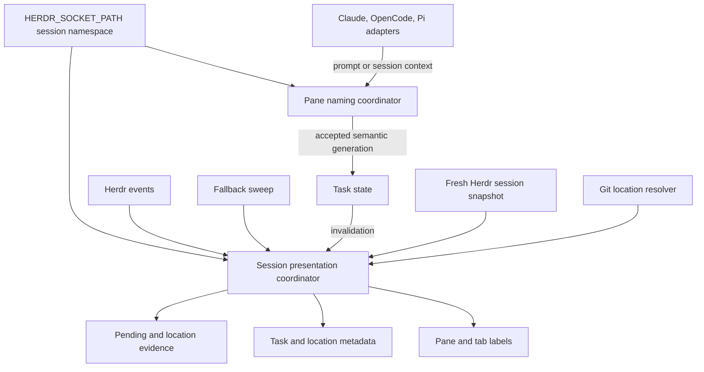
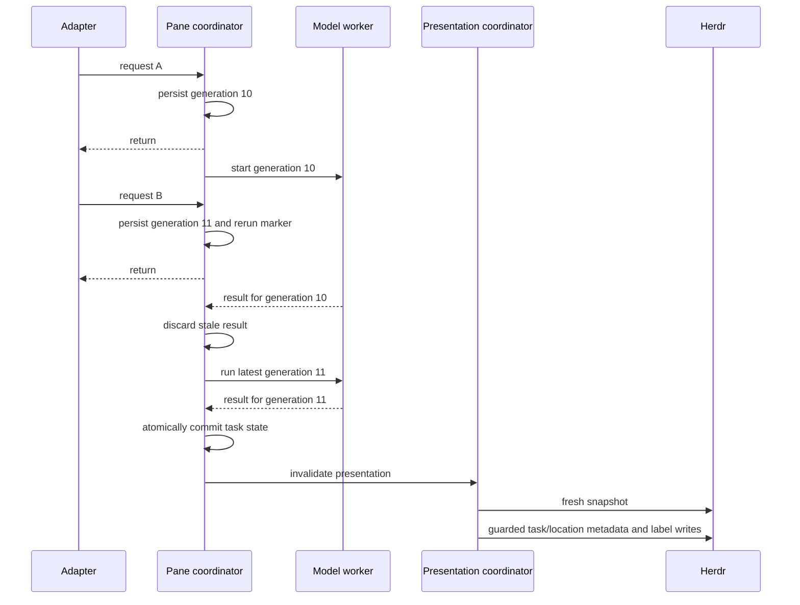
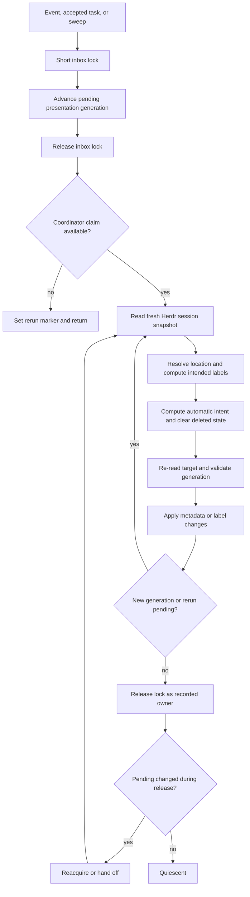

# Herdr Worktree-Aware Labels - Plan

## Goal Capsule

- **Objective:** make every Herdr agent and process pane identify its Git worktree while preserving semantic task names and non-blocking agent operation under concurrent prompts and lifecycle events.
- **Product authority:** the confirmed scope in this plan, followed by the existing task-sync contract in `docs/plans/2026-08-10-001-feat-herdr-task-sync-plan.md`, the follow-up in `docs/issues/2026-08-18-025-harden-herdr-task-sync-and-show-worktree.md` except for its superseded manual-label and reclaim scope, and the research verdict in `docs/ideation/2026-08-18-herdr-title-plugins-pov.html`.
- **Open blockers:** none.
- **Execution profile:** Standard cross-cutting Shell/Bats change across the shared naming engine, Herdr lifecycle plugin, managed presentation config, and deployment tests.
- **Stop conditions:** stop if Herdr 0.8 does not expose the fresh snapshot, target lookup, metadata clear, or event contracts used below; do not compensate by adding a second pane or tab label writer. Complete target-ID reuse after a cold restart is not a blocker because the engine stores no target-local label policy or applied-label ledger. Fresh location evidence replaces retained identity; a transient lookup can temporarily show retained identity as `stale` until fresh evidence arrives.
- **Tail ownership:** the implementer verifies source and Docker gates; the user syncs the separate chezmoi source clone, applies on the host, and participates in live Herdr UX verification because host `chezmoi apply` is forbidden to the agent.

---

## Product Contract

### Summary

Extend the existing `herdr-task-sync` single-writer design with worktree-aware metadata and presentation, generation-based latest-wins behavior, and event-driven reconciliation backed by the existing periodic sweep.
Keep task naming semantics stable, limit agent-adapter changes to a bounded synchronous enqueue before detached work begins, and exclude all icon and Nerd Font work.

### Problem Frame

The existing engine shows what Claude Code, OpenCode, and Pi sessions are doing, and it composes agent, process, and idle pane labels into each tab.
It does not show which Git worktree owns a pane, so parallel agents with similar tasks remain difficult to distinguish.

Each prompt also starts an independent detached worker.
Metadata reports carry a sequence, but state writes and pane or tab renames do not.
An older worker can therefore finish after a newer worker and replace newer task state or presentation.

The sweep daemon keeps process labels fresh, but presentation changes still wait for polling when Herdr emits a useful lifecycle event.
The implementation should treat pane and tab labels as fully automatic output and converge external label changes back to computed state.

### Requirements

**Location identity and presentation**

- R1. Every pane resolves location from fresh Herdr state, including agent, process, and idle panes; no Claude Code, OpenCode, or Pi adapter receives location logic.
- R2. Git panes publish separate `repo`, `worktree`, and `branch` metadata tokens; leaving Git clears confirmed-stale location tokens, while transient lookup failures preserve the last known values and publish a plain-text `stale` location status until fresh Git or confirmed non-Git evidence clears it.
- R3. The agents sidebar shows the budgeted session-unique worktree token from R5 as a separate quiet identity below the task-oriented pane label; retained unverified identity includes the plain-text `stale` status.
- R4. A homogeneous tab, where every pane has fresh confirmed Git identity and all panes share one canonical worktree, shows that worktree once. Any tab with retained stale identity, Git plus non-Git panes, or multiple worktrees is mixed and keeps each fresh or stale worktree identity adjacent only to its affected Git pane segment; an all-non-Git tab retains the existing composition.
- R5. Detached HEAD panes keep worktree identity and clear the branch token. Visible worktree identity has an 18-column budget: a unique basename is used only when it fits; collisions first expand to the shortest unique path suffix, then any over-budget basename or suffix uses a basename fragment plus collision-checked deterministic digest. Digest collisions extend the digest while shrinking the basename fragment, with a stable sorted-session ordinal as the final fallback when the full budget still collides.

**Single-writer automation**

- R6. `herdr-task-sync` remains the only component that writes pane and tab labels; lifecycle scripts only request reconciliation.
- R7. Pane and tab labels remain automatic across prompts, sweeps, session replacement, daemon restart, and cache aging; a fresh reconciliation replaces any divergent live label with current computed intent.
- R8. The implementation stores no manual label ownership, exposes no reclaim action, and sends no ownership notification.
- R9. Upgrade and restart recompute automatic labels rather than adopting unknown live labels or restoring target-local label policy or applied-label copies. Retained location evidence follows R2: fresh evidence replaces it, while a transient lookup can temporarily render it as `stale`.

**Ordering and reconciliation**

- R10. Prompt, transcript, and direct-set naming requests use one pane-scoped coordinator so only the latest successfully committed inbox generation for the active agent session can commit semantic task state and request presentation; requests that have not committed to the inbox are not ordered. One session coordinator owns all task/location metadata and pane/tab side effects.
- R11. Durable task, generation, sequence, retained location evidence, and pending-reconcile state is written by atomic replacement and scoped so separate Herdr sessions do not suppress each other.
- R12. Presentation side effects use one coordinator per Herdr session because several panes can concurrently target one tab.
- R13. Herdr events act only as invalidation signals; each pass computes from a fresh session snapshot and re-reads each target immediately before mutation. Because Herdr 0.8 rename has no compare-and-swap, a target change after the final read can briefly receive stale automatic intent; the next reconciliation repairs it.
- R14. Event bursts coalesce into one active pass plus a fresh rerun, and self-generated rename events converge to a no-op rather than forming a feedback loop. Within the verified envelope of eight panes and a 75 ms per-target Git budget, a relevant native event must converge within one second; a slow target becomes stale without blocking the remaining pass.
- R15. The five-second sweep remains the fallback for foreground command and working-directory changes that Herdr events do not reliably expose and must repair an unobserved transition within six seconds in live verification.

**Compatibility and safety**

- R16. Existing prompt-aware task semantics, process labels, idle placeholders, all-pane composition, model fallback, and runtime guards remain compatible; adapters may wait only for the bounded enqueue commit and never for model or presentation work.
- R17. Missing Herdr, Git, `jq`, model executables, malformed input, lock contention, transient state failures, or deleted targets never block or fail an agent session; presentation writes detected as stale before mutation are skipped, and the unavoidable post-read rename race converges on the next pass.
- R18. The implementation adds no icon glyph, icon formatter, Nerd Font behavior, parallel label plugin, or new runtime dependency; existing text separators and truncation marks remain compatible.
- R19. All managed files remain portable across macOS and Linux/CI, and the change has Bats coverage plus live Herdr verification.

### Key Flows

- F1. Prompt burst to latest task
  - **Trigger:** several prompts, transcript events, or direct session-name updates arrive for one reused pane.
  - **Actors:** user, agent adapter, pane-scoped naming coordinator, presentation coordinator, Herdr.
  - **Steps:** the entry path atomically commits its inbox generation before detaching; one model worker processes the latest committed request; stale completions have no side effects; the newest accepted task requests a fresh presentation pass.
  - **Outcome:** task state, metadata, pane label, and tab label converge on the latest active session and prompt context without delaying the agent.
  - **Covers:** R10, R11, R12, R16, R17.

- F2. Pane location change
  - **Trigger:** a pane starts in, moves within, or leaves a Git worktree.
  - **Actors:** Herdr lifecycle plugin, session presentation coordinator, Git, Herdr metadata and label APIs.
  - **Steps:** an event or fallback sweep invalidates presentation; the coordinator takes a fresh snapshot; location resolution returns Git, confirmed non-Git, or transient failure; confirmed evidence updates or clears identity, while transient failure preserves identity and updates only `location_status` plus rendered stale text.
  - **Outcome:** worktree presentation follows the pane's live location without erasing valid metadata on transient failures.
  - **Covers:** R1-R5, R11-R15, R17.

- F3. Automatic label correction
  - **Trigger:** a pane or tab label differs from the current computed presentation.
  - **Actors:** Herdr and the presentation coordinator.
  - **Steps:** the next event-driven or fallback reconciliation computes from fresh state, re-reads the target, and replaces the divergent label when the target and generation still match.
  - **Outcome:** pane and tab labels converge back to automatic presentation without ownership state, reclaim actions, or notifications.
  - **Covers:** R6-R9, R12-R14, R17.

- F4. Lifecycle convergence
  - **Trigger:** panes or tabs are created, moved, closed, renamed, or change agent state, or the server and daemon restart.
  - **Actors:** Herdr events, lifecycle plugin, fallback daemon, session presentation coordinator.
  - **Steps:** relevant events request a coalesced pass; current objects are reconciled; missing-object state is removed after fresh confirmation; the fallback sweep repairs changes that emitted no event.
  - **Outcome:** automatic labels and location metadata converge without loops, and restart or target deletion restores no target-local label policy; retained location evidence remains governed by R2.
  - **Covers:** R7, R11-R15, R17, R19.

### Acceptance Examples

- AE1. Covers F1. Given a slow older naming call and a fast newer call for the same pane, when they finish in reverse order, only the newer generation changes task state, metadata, pane label, and tab label.
- AE2. Covers F1. Given a pane reused by a new native agent session, when an old-session worker finishes late, it produces no side effect and cannot restore the old slug.
- AE3. Covers F2. Given a pane in a linked worktree, when reconciliation runs, `repo`, `worktree`, and `branch` describe that checkout and the sidebar shows the budgeted session-unique token from R5, including its digest or ordinal fallback when required.
- AE4. Covers F2. Given every pane in a tab has confirmed Git identity in the same canonical worktree, when the tab is composed, the worktree appears once before the pane segments.
- AE5. Covers F2. Given one tab contains panes from distinct worktrees or any Git pane beside a non-Git process pane, when the tab is composed, each Git pane keeps a distinct nearby worktree identity and the non-Git pane keeps its process label without a suffix.
- AE6. Covers F2. Given a prior Git pane moves to a confirmed non-Git directory, when reconciliation runs, all location tokens clear and the tab returns to the existing non-Git format.
- AE7. Covers F2. Given Git lookup fails transiently, when reconciliation runs, previous location metadata and labels remain instead of being cleared and display the plain-text `stale` status until fresh evidence arrives.
- AE8. Covers F3. Given a pane label diverges from computed intent while the tab label is current, when reconciliation runs, only the pane is corrected and no ownership state or notification is created.
- AE9. Covers F3. Given both pane and tab labels diverge from computed intent, when reconciliation runs, both return to current automatic presentation without a reclaim action.
- AE10. Covers F4. Given a burst of invalidation and self-generated rename events, when the coordinator finishes, one fresh rerun converges to a no-op without an unbounded loop.
- AE11. Covers F4. Given a foreground process or CWD transition emits no useful event, when the fallback interval elapses, the same reconciliation path updates the presentation.
- AE12. Covers R18. Given any supported task, process, worktree, or mixed-tab state, generated labels add no icon or Nerd Font glyph and preserve the existing text separators and truncation behavior.

### Scope Boundaries

**In scope**

- Hardening the current engine, state, event, and presentation contracts.
- Worktree-aware metadata and visible sidebar/tab identity for every pane.
- Automatic pane and tab correction after external label changes.
- Managed configuration, plugin lifecycle wiring, migration behavior, automated tests, and live host verification.

**Outside this plan**

- Nerd Font plugins, icon maps, decorative glyphs, or any future icon formatter.
- Replacing `herdr-task-sync` or installing another pane, tab, agent, workspace, or outer-window title writer.
- Renaming Git branches, worktrees, or Herdr workspaces from generated task slugs.
- Changing outer terminal window titles.
- Adding in-turn subtask status beyond Herdr's existing lifecycle state.
- Expanding Claude Code, OpenCode, or Pi lifecycle parity beyond their current adapter contracts.
- Preserving manual pane or tab labels, ownership ledgers, reclaim actions, or ownership notifications.

#### Deferred to Follow-Up Work

- Revisit first-class composable label segments or source/sequence-aware rename APIs if a later Herdr release exposes them.
- Revisit full cross-agent resume and compact lifecycle parity independently from location reconciliation.

### Dependencies and Constraints

- Herdr 0.8.0 provides pane and tab snapshots/lookups, metadata tokens and clears, plugin events, server status, and rename calls, but pane and tab rename have no compare-and-swap, writer source, or sequence.
- Pane and tab labels are automatic output. A manual or external rename can remain visible until the next event-driven or fallback reconciliation.
- Git and `jq` are already managed dependencies; no new runtime dependency is needed.
- Chezmoi reads its separate source clone rather than this checkout; repository edits are not live until the user syncs and applies them.
- Host `chezmoi apply` is forbidden to the implementing agent.
- Workers and sweep daemons running the pre-upgrade script cannot honor the new generation fence. Live rollout therefore stops the legacy daemon and adapters, drains in-flight naming workers, syncs and applies the managed files, restarts Herdr/plugin processes, and only then accepts new prompts. No runtime takeover protocol is required.

---

## Planning Contract

### Key Technical Decisions

- KTD1. **Keep one integrated label writer.** `herdr-task-sync` owns task state, location metadata, pane labels, and tab composition. The `seigi.pane-labels` plugin remains a thin lifecycle adapter, which prevents cross-plugin whole-label races.
- KTD2. **Use two concurrency boundaries and one side-effect owner.** A pane-scoped naming coordinator serializes model work and supersedes old native sessions. A Herdr-session-scoped presentation coordinator publishes all task/location metadata and pane/tab labels because multiple panes can target one tab.
- KTD3. **Separate short inbox mutation from the long worker claim.** Each naming request takes a short lock to atomically advance the active session, newest request, and monotonic generation before returning. One claimed worker loops until the observed inbox generation is stable; stale model completion can only request another read of the inbox and cannot commit or publish.
- KTD4. **Separate semantic, control, and reconciliation state by consistency boundary.** Session task context remains keyed by agent, pane, and session. One outer control record per Herdr socket and pane names the active agent/session and generation that every naming worker must revalidate. Session reconciliation state contains only pending generation, source high-water marks, retained location evidence, the canonical checkout root, and an accessible common-Git-directory repository anchor. Pane and tab labels are computed from fresh Herdr state and compared directly with live values; no intended/applied label copy or target-local policy is persisted. The repository anchor survives transient CWD failure and gives deletion checks an authoritative inventory address.
- KTD5. **Use short inbox locks, long worker claims, and portable atomic records.** Naming and presentation each use a short mutation lock to advance inbox generation without waiting for model or reconcile work, plus a separate long-lived worker/coordinator claim. Every consistency boundary writes a same-directory temporary record then atomically replaces the target; no correctness rule depends on a multi-file transaction. `mkdir` claims publish an owner tuple that distinguishes process incarnation and Herdr-session scope, recover half-created or stale claims, release only by the recorded owner, then recheck and reacquire pending work to prevent a lost wakeup.
- KTD6. **Treat events as invalidation, never truth.** Event handlers take only the short presentation-inbox lock to advance durable pending generation before work. The claimed coordinator uses one complete fresh Herdr session snapshot, then revalidates generation and each live target immediately before mutation. Pending state clears only after durable state and guarded side effects finish; restart converts interrupted in-flight state back to pending. Herdr's post-read rename race cannot be fenced and is repaired by the next event or sweep.
- KTD7. **Give task and location independent metadata ordering under the presentation coordinator.** Keep `task` under `task-sync`; publish `repo`, `worktree`, `branch`, and the optional `location_status=stale` token under a distinct location source. Each source retains a high-water mark beyond payload cleanup and allocates a value greater than both its persisted mark and current clock, so worker, daemon, or Herdr restart and clock rollback cannot lower ordering.
- KTD8. **Use evidence-based location resolution.** Resolve a usable live foreground CWD first and map unambiguous Git administrative paths to their checkout. An absent foreground-CWD field permits pane-CWD fallback; a present path that cannot be inspected is transient and preserves prior location without fallback while setting `location_status=stale`. Fresh Git evidence clears the status. A fresh usable non-Git CWD or accessible authoritative Git worktree inventory confirms departure/deletion and clears all location tokens; permission error, timeout, unavailable tool, incomplete snapshot, or parse failure preserves prior identity with stale status.
- KTD9. **Use canonical roots for grouping and budgeted session-unique display.** Group panes by canonical worktree root and derive one visible `worktree` token per root across the Herdr session. Use the basename only when it is unique and fits 18 columns. On collision, use the shortest unique slash-separated suffix when it fits. For any over-budget basename or suffix, use a leading basename fragment, `~`, and the shortest deterministic digest prefix that is unique in the current session. Start the digest at six lowercase hexadecimal characters, extend it after collision while shrinking the basename fragment, and fall back to a stable sorted-session ordinal if the full budget still collides. Derive `repo` from the common repository and publish symbolic `branch`; detached HEAD clears branch. Sidebar order is task, worktree, then optional `stale`. A homogeneous tab renders `{worktree} · {segment...}`; a mixed Git segment renders `{worktree} [stale] {segment}` beside each affected pane, while non-Git segments remain unchanged. At an 80-column terminal, a two-pane mixed tab preserves both complete 18-column identity tokens and at least eight columns of each task/process segment, truncating task/process text with the existing ellipsis first. Tabs with three or more panes use the same left-to-right grammar on a best-effort basis because their worst-case identity and separator budget cannot fit 80 columns.
- KTD10. **Keep labels fully automatic and stateless.** The coordinator computes labels on each pass and compares them directly with fresh live values for idempotence. A live value that differs from computed intent is corrected after a final target and generation check. The engine stores no intended/applied label copy, manual ownership, migration claim, reclaim request, or ownership notification state.
- KTD11. **Keep task semantics and model policy stable; make enqueue ordering explicit at adapters.** Location comes from Herdr pane state, not adapter payloads. Claude Code, OpenCode, and Pi adapters synchronously complete only the bounded inbox enqueue before returning, then detach model and presentation work. Process-label, idle-label, and model fallback behavior changes only where required by ordering and shared presentation.
- KTD12. **Exclude icons at every layer.** Formatter, managed config, lifecycle plugin, tests, and dependencies add no decorative icon mode or Nerd Font behavior; Herdr's existing `state_icon` lifecycle indicator remains unchanged.
- KTD13. **Use one-way cutover and operational rollback.** After the controlled rollout drains every legacy producer, the upgraded engine imports the newest complete legacy task record into the canonical per-socket state at most once and ignores later legacy writes. Repeated or interrupted import preserves the last complete canonical record. Rollback stops upgraded producers, restores the old managed files, restarts Herdr/plugins, and accepts task-context reset or refresh on the next prompt; no `--prepare-rollback`, reverse export, or re-upgrade merge exists. Age cleanup expires ephemeral task context separately from retained location evidence, generation, pending, and metadata high-water records.

### High-Level Technical Design

#### Component and data ownership

#### Prompt generation ordering

#### Reconciliation lifecycle

### Sequencing

1. Establish deterministic mutable Herdr mocks and failing characterization scenarios before changing concurrency or presentation.
2. Make naming state atomic and latest-wins before routing more event sources into the engine.
3. Centralize automatic presentation writes before adding worktree formatting.
4. Add location metadata before changing visible labels, so location truth and cleanup can be verified independently.
5. Add broad event invalidation only after reconciliation is idempotent and generation-aware.
6. Change managed sidebar presentation last, then run Docker and live host verification.

### Research-Backed Constraints

- `davidolrik/herdr-titles` supports the fresh-state rule: event payloads invalidate cached assumptions, while current Herdr state governs mutation.
- `qu8n/herdr-automatic-rename` supports lock-plus-rerun coalescing for full reconciliation.
- `ryanlewis/herdr-tab-renamer` supports a last-moment live label read before mutation.
- `wyattjoh/herdr-plugin-renamer` supports stable native-session claims and re-reading mutable Git state before mutation.
- `maedana/herdr-whereami` supports separate repository and branch metadata with stale clear, but its unlicensed source must not be copied; the worktree token is a local extension.
- `docs/solutions/design-patterns/external-review-legs-as-unreliable-subprocesses.md` requires timeout, validation, and evidence-based handling for asynchronous subprocess results.
- `docs/solutions/design-patterns/absolute-paths-beat-prose-in-agent-isolation.md` requires location identity to come from the active checkout rather than launcher context.
- `docs/solutions/design-patterns/completion-is-not-a-verdict.md` supports separating authoritative persisted state from presentation success.
- Every external repository is conceptual evidence only. The implementation must adapt ideas to Bash 3.2, per-socket local state, existing adapters, and the local single-writer contract rather than copying foreign state layouts or runtime assumptions.

### Alternatives Considered

- **Install or fork one external renamer:** rejected because no candidate preserves the local multi-agent, all-pane, prompt-aware contract, and a second writer creates unsynchronized whole-label races.
- **Create a separate location plugin:** rejected because it would either become a second label writer or require a cross-process composition protocol that Herdr 0.8 does not provide. Namespaced location metadata remains a separate source inside the integrated engine.
- **Use one machine-global lock:** rejected because named Herdr sessions can coexist and must not suppress each other's reconciliation.
- **Use only per-pane locks:** rejected because two pane updates can race on one shared tab label.
- **Replace polling with events:** rejected because foreground command and CWD transitions do not have a proven complete event stream. Events reduce latency; the sweep guarantees eventual repair.
- **Preserve divergent labels as manual state:** rejected because manual pane and tab labels are outside scope. Automatic correction avoids durable target ownership and restart ambiguity.
- **Add icon decoration:** rejected by user scope and because it would either add a parallel whole-label writer or complicate the single formatter without improving worktree truth.

### System-Wide Impact

- **Agent sessions:** all supported runtimes keep the same adapter and task semantics, but task completion now passes through generation validation.
- **Plain process panes:** they gain location metadata and worktree-aware tab composition while preserving process labels.
- **Shared tabs:** all pane-originated changes serialize through one session coordinator, removing cross-pane tab races.
- **External label changes:** any manual or third-party pane or tab rename remains temporary and is corrected by reconciliation.
- **State lifecycle:** cache state gains session scoping, atomic one-way migration, metadata sequences, retained location evidence, and deletion cleanup.
- **Operational behavior:** event-driven updates reduce average latency; the existing daemon and interval remain the recovery path.

### Risks and Mitigations

| Risk | Impact | Mitigation |
|---|---|---|
| Target changes after the final read | A stale automatic write can briefly reach the wrong live state | Re-read immediately before rename, validate pending generation, and rely on the next event or sweep for the unavoidable post-read race |
| Self-generated events loop | Excess plugin invocations and label churn | Fresh live comparison, skip-if-correct writes, coalesced rerun, and loop-bound tests |
| Prompt coalescing loses latest context | Stale or missing task slug | Persist newest request and generation before detach; retain newest prompt context when a model call fails |
| Git lookup failure clears valid state | Sidebar and tabs flicker or misidentify panes | Tri-state resolver; clear only confirmed non-Git; retain prior values on transient failure |
| Multiple Herdr sessions share state | One session suppresses another | Namespace coordinator and presentation state by stable socket/session identity |
| Bats concurrency tests become flaky | False failures or missed races | Wait for generation-specific durable state and exact side effects, never first log activity or arbitrary sleeps |
| Expanded event set overloads hooks | Slow interaction or repeated work | Event handlers only invalidate; one coordinator coalesces and computes from a single fresh snapshot |
| Crash exposes mixed state or strands pending work | Restart loses the newest request or reconcile generation | Use one atomic record per consistency boundary; keep pending durable until completion; recover interrupted in-flight state as pending |
| PID reuse or predecessor cleanup steals a lock | Reconciliation stops or two owners run | Use process-incarnation owner tuples, owner-only release, stale recovery, and successor-race tests |
| Age cleanup removes valid fencing | Late workers regain authority | Cleanup only under a complete session snapshot; expire ephemeral task payload separately and retain generation and metadata high-water fences |
| Deleted worktree is mistaken for transient failure | Stale worktree identity remains indefinitely or valid identity clears early | Clear only from a usable non-Git CWD or authoritative worktree inventory; preserve on missing/incomplete evidence |
| Pre-upgrade worker or sweep daemon survives rollout | A legacy process bypasses the new fence or remains a second label writer | Quiesce every adapter and lifecycle producer, stop the legacy daemon, drain naming workers, replace managed files, restart Herdr/plugins, then accept prompts |
| Operational rollback loses cached task context | Existing task slugs can reset until the next prompt | Treat task cache as disposable presentation context and document the reset in the rollback procedure |

---

## Implementation Units

### U1. Deterministic Herdr concurrency test harness

- **Goal:** make race, snapshot, metadata, target-replacement, and multi-session behavior deterministic before production logic changes.
- **Requirements:** supports verification of R1-R19 and acceptance examples AE1-AE12.
- **Dependencies:** none.
- **Files:** `tests/scripts.bats`.
- **Approach:** extend the existing Herdr mock with mutable pane/tab state, fresh pane and tab lookups, complete/incomplete session snapshots, rename side effects, per-call CWD and token fixtures, delayed model outcomes, distinct socket identities, crash boundaries, and generation-specific completion evidence. Prefix every new U1-U5 behavioral test title with `herdr-task-sync` so the focused Verification Contract filter is stable.
- **Execution note:** make the harness capabilities pass in U1, then add each behavior test as a failing test at the start of its owning unit; synchronization must wait on durable generation evidence or exact side effects rather than timing or first log activity.
- **Patterns to follow:** the existing `herdr-task-sync` stub helpers and the worker-drain fix documented in `docs/issues/2026-08-14-001-flaky-herdr-task-sync-session-reset-test.md`.
- **Test scenarios:**
  1. A mock pane or tab rename updates the next fresh lookup and session snapshot.
  2. Two model fixtures can finish in a controlled reverse order without arbitrary sleeps.
  3. Two socket paths, including paths whose legacy sanitized names would collide, expose independent snapshots, locks, calls, and completion markers.
  4. Metadata publication and clear operations mutate source-owned token fixtures according to sequence.
  5. A target can disappear, move, reuse an identifier, or change around the final read; the harness proves stale writes detected before mutation are skipped and an unavoidable post-read write converges on the next pass.
  6. A crash fixture can stop after each durable boundary and restart against the resulting complete or incomplete state.
  7. An eight-pane fixture supports independent 75 ms Git budgets, including one timed-out target that becomes stale while the remaining pass completes.
- **Verification:** harness self-tests and all existing task-sync tests remain green; named product characterization tests are introduced and made green only in their owning U2-U5 units.

### U2. Atomic state foundation and latest-wins task coordinator

- **Goal:** establish the shared state/lock/fencing primitives and ensure only the latest generation for the active native session can commit task context or request presentation.
- **Requirements:** R10, R11, R16-R19; F1; AE1, AE2.
- **Dependencies:** U1.
- **Files:** `home/dot_local/bin/executable_herdr-task-sync`, `home/private_dot_claude/hooks/executable_herdr-task-sync-hook.sh`, `home/dot_pi/agent/extensions/herdr-task-sync.ts`, `home/private_dot_config/opencode/plugins/herdr-task-sync.ts`, `tests/scripts.bats`.
- **Approach:** establish the final per-socket namespace, atomic-record, lock-owner, canonical checkout/common-Git-directory anchors, one-way cutover marker, and monotonic high-water contracts that U3-U5 reuse without changing schema. Split the short inbox mutation lock from the long worker claim; make every adapter complete the bounded inbox enqueue before its callback returns; persist active session, newest request, and generation before detaching model or presentation work; loop one worker until its observed generation is stable; commit semantic task state and one presentation invalidation only; import legacy three-field state once after controlled rollout; retain newest prompt context when the latest model attempt fails.
- **Patterns to follow:** existing fail-open guards and detached worker boundary in `home/dot_local/bin/executable_herdr-task-sync`; session-scoped claims from the pinned `wyattjoh/herdr-plugin-renamer` research; unreliable-subprocess guidance in `docs/solutions/design-patterns/external-review-legs-as-unreliable-subprocesses.md`.
- **Test scenarios:**
  1. Covers AE1. A slow generation completes after a newer generation and cannot change semantic task state or issue an accepted presentation invalidation; U3 proves the resulting metadata and labels.
  2. Covers AE2. An old native session completion cannot replace the reused pane's new session state.
  3. A third request arriving during the coalesced rerun remains pending, causes another inbox read, and becomes the only committed semantic result.
  4. Prompt, transcript, and direct-set requests share the same ordering contract.
  5. A failed latest model call retains the previous slug and newest prompt context for the next request.
  6. Concurrent readers never observe a truncated or mixed-generation state file.
  7. Legacy migration is idempotent across repeated starts, malformed/partial input, and crashes before or after canonical commit; a late old worker writing the legacy file cannot roll canonical state back.
  8. Restart after request acceptance or worker start treats interrupted in-flight state as pending and eventually processes the newest request.
  9. Clock rollback and restart cannot lower task generation or metadata high-water state.
  10. Reused pane/session identifiers cannot receive an old semantic task result because the worker revalidates the active agent, native session, and generation before commit; presentation still computes from fresh state.
  11. Missing tools, lock contention, state-write failure, and malformed input fail open after the bounded enqueue attempt without waiting for model or presentation work.
  12. Two inbox requests are ordered only by atomic commit generation; if an earlier adapter call is delayed and commits second, it intentionally becomes the later committed generation. The contract makes no unimplementable claim about pre-commit arrival chronology.
- **Verification:** reverse-completion, third-request, crash-restart, one-way migration, and identifier-reuse tests prove that stale naming work has zero semantic or invalidation authority.

### U3. Session presentation coordinator

- **Goal:** serialize all automatic pane and tab writes for one Herdr session and fence stale work across committed generations.
- **Requirements:** R6-R14, R16, R17; F1, F3, F4; AE1, AE8-AE10.
- **Dependencies:** U1, U2.
- **Files:** `home/dot_local/bin/executable_herdr-task-sync`, `tests/scripts.bats`.
- **Approach:** use canonical `HERDR_SOCKET_PATH` as routing context and namespace input across adapters, detached workers, events, and the daemon. Event and sweep producers without this injected socket fail closed for presentation and record diagnostics. A naming input may derive the default socket from `herdr status server` only when a fresh pane from that socket matches pane ID, agent, and native session ID; target presence alone is insufficient. A supplied or derived mismatch is fail-closed for presentation but fail-open for the invoking agent. Route accepted task updates, events, and sweeps through a short presentation-inbox mutation lock and a separate claimed coordinator; use one complete fresh session snapshot per pass; reuse U2's atomic records, owner tuple, high-water allocation, and release/recheck handoff; publish task metadata and all pane/tab labels here; compute labels from fresh state, compare them directly with live values, and correct divergence after the final target check. Controlled rollout, not runtime code, stops and drains legacy producers before the upgraded coordinator starts.
- **Patterns to follow:** the current atomic directory lock and stale-process recovery in `home/dot_local/bin/executable_herdr-task-sync`; late-read mutation from the pinned `ryanlewis/herdr-tab-renamer` research; lock-plus-rerun coalescing from the pinned `qu8n/herdr-automatic-rename` research.
- **Test scenarios:**
  1. Two concurrent panes in one tab produce one composition containing both latest pane states.
  2. Covers AE1. The accepted newest semantic generation is the only task metadata, pane label, and tab label published by presentation after reverse model completion.
  3. An event burst yields one active pass and one fresh rerun, then converges with no redundant rename.
  4. An invalidation arriving after the quiescence check but during lock release is observed by release/recheck/reacquire and cannot be lost.
  5. Covers AE8. A divergent pane label is corrected while an already-current tab remains unchanged; no ownership state or notification is created.
  6. Covers AE9. Divergent pane and tab labels both return to computed automatic intent in one reconciliation.
  7. A target changed or deleted before the final mutation check receives no write; a change after that read can receive stale automatic intent and is repaired by the next reconciliation.
  8. Incomplete snapshots, transient Herdr failure, and active writes do not trigger age or absence cleanup.
  9. Separate Herdr socket identities do not share locks, generations, high-water marks, retained location evidence, or pending reruns even when their legacy sanitized names collide.
  10. Lock recovery covers PID reuse, crash after directory creation, predecessor cleanup racing a successor, and owner-only release.
  11. Restart after state commit, metadata publication, rename, or pending-clear boundaries either resumes pending work or converges from fresh state.
  12. Covers AE10. Self-generated rename events converge to a skip-if-correct no-op without an unbounded loop.
  13. Event and sweep producers without an injected socket perform no presentation write. Naming fallback verifies pane ID, agent, and native session ID; default and named sessions with overlapping pane IDs cannot cross namespaces.
  14. Restart finds durable pending reconciliation, takes a fresh snapshot, and recomputes labels without restoring target-local label policy or applied-label copies; retained location evidence follows the Git/non-Git/transient rules.
- **Verification:** deterministic tests prove automatic correction, session isolation, coalescing, restart recovery, and eventual convergence within Herdr's documented post-read race.

### U4. Worktree location metadata and formatter

- **Goal:** derive trustworthy location for every pane and render concise homogeneous or mixed-worktree labels.
- **Requirements:** R1-R5, R11-R13, R16-R18; F2; AE3-AE7, AE12.
- **Dependencies:** U1, U3.
- **Files:** `home/dot_local/bin/executable_herdr-task-sync`, `tests/scripts.bats`.
- **Approach:** resolve location from fresh pane state with Git/non-Git/transient outcomes; retain the canonical checkout root and accessible common Git directory as internal repository anchors; publish `repo` as the common-repository basename, `worktree` as the budgeted session-unique token from KTD9, `branch` as the symbolic branch, and `location_status=stale` only while retained identity is unverified, all under a separate location source/high-water mark; clear only confirmed-stale location tokens; use the same visible worktree token and stale text in sidebar and tab presentation. Prefix a homogeneous all-fresh all-Git tab once. Treat any tab containing stale identity, non-Git beside Git, or multiple worktrees as mixed, and keep each identity/status adjacent to its affected pane segment. Leave all-non-Git composition unchanged.
- **Patterns to follow:** current all-pane composition and process leader selection in `home/dot_local/bin/executable_herdr-task-sync`; active-checkout guidance in `docs/solutions/design-patterns/absolute-paths-beat-prose-in-agent-isolation.md`; separate metadata and stale clear concept from the pinned `maedana/herdr-whereami` research without copying its unlicensed code.
- **Test scenarios:**
  1. Covers AE3. Main checkout, linked worktree, and a nested worktree directory publish the correct repo, worktree, and branch.
  2. An unambiguous `.git` administrative path resolves to its owning checkout; an absent foreground-CWD field falls back to pane CWD.
  3. A valid foreground CWD outside Git is treated as confirmed non-Git and does not inherit the pane's older repository location.
  4. Detached HEAD preserves worktree and repo while branch is absent.
  5. Covers AE6. A confirmed transition from Git to non-Git clears all location tokens.
  6. A retained accessible common-Git-directory anchor supplies an authoritative worktree inventory that confirms deletion and clears stale location state even when the pane CWD is no longer inspectable.
  7. Covers AE7. A present but missing or inaccessible path, permission denial, Git timeout, unavailable Git, malformed output, or incomplete evidence preserves prior metadata and labels without pane-CWD fallback and sets the plain-text stale status; fresh Git or confirmed non-Git evidence clears it.
  8. Location clear operations affect only the location source; detached HEAD clears only branch; task and location high-water marks cannot suppress each other across restart or clock rollback.
  9. Covers AE4. A homogeneous all-Git tab shows worktree identity once in front of all pane segments.
  10. Covers AE5. A multi-worktree tab and a one-Git-plus-one-non-Git tab both use mixed composition, keep identity beside Git panes, and leave non-Git process panes unsuffixed.
  11. Two canonical roots with the same basename anywhere in one Herdr session gain shortest unique visible suffixes in both sidebar and tab presentation without changing repository identity.
  12. A unique overlong basename and colliding roots whose first distinguishing path component exceeds the 18-column budget use collision-checked basename-fragment-plus-digest tokens; a forced digest collision extends the digest or uses the stable ordinal while preserving unique visible identity.
  13. At 80 columns, a two-pane mixed tab preserves both complete worktree tokens and at least eight columns of each task/process segment; task/process text receives ellipsis truncation before identity.
  14. A tab with two retained same-worktree identities where one is stale uses mixed composition and places `stale` only beside the affected pane segment.
  15. A divergent pane label is corrected to the computed pane segment without losing its nearby mixed-tab worktree identity.
  16. Covers AE12. Generated presentation adds no icon or Nerd Font glyph and preserves the existing middle-dot separator, ellipsis truncation, and task/process text behavior.
- **Verification:** location tests distinguish confirmed non-Git from transient failure, and formatter tests prove homogeneous, mixed, collision, detached, automatic-correction, and no-icon behavior.

### U5. Event invalidation and fallback sweep

- **Goal:** reduce update latency while retaining the periodic recovery path and one automatic label writer.
- **Requirements:** R6-R8, R12-R15, R17-R19; F3, F4; AE9-AE11.
- **Dependencies:** U3, U4.
- **Files:** `home/private_dot_config/herdr/plugins/herdr-pane-labels/herdr-plugin.toml`, `home/private_dot_config/herdr/plugins/herdr-pane-labels/ensure.sh`, `home/private_dot_config/herdr/plugins/herdr-pane-labels/sweep.sh`, `home/.chezmoiscripts/run_onchange_after_6-link-herdr-pane-labels.sh.tmpl`, `tests/scripts.bats`, `tests/smoke.bats`.
- **Approach:** raise the plugin compatibility floor to `min_herdr_version = "0.8.0"`; subscribe only to verified Herdr 0.8 invalidations `pane.created`, `pane.moved`, `pane.exited`, `pane.closed`, `pane.agent_detected`, `pane.agent_status_changed`, `tab.created`, `tab.closed`, `tab.moved`, and `tab.renamed`. Herdr 0.8 does not expose `pane.updated` as a plugin-hook event, so an unsupported external pane-label change relies on the five-second sweep. The exact allowlist excludes `pane.updated`, `workspace.focused`, `tab.focused`, `pane.focused`, and every unlisted focus, scroll, or terminal-output event. Every supported event requests the same U3 reconciliation path, while startup and `sweep.sh` retain the five-second idempotent fallback. No plugin action or notification surface is added.
- **Patterns to follow:** existing startup and event manifest entries in `home/private_dot_config/herdr/plugins/herdr-pane-labels/herdr-plugin.toml`; tolerant linking and reload behavior in `home/.chezmoiscripts/run_onchange_after_6-link-herdr-pane-labels.sh.tmpl`.
- **Test scenarios:**
  1. The manifest's pane event strings exactly match the included pane allowlist and request shared reconciliation.
  2. The manifest's tab event strings exactly match the included tab allowlist and request the same path.
  3. The manifest has no wildcard event and excludes unsupported `pane.updated`, `workspace.focused`, `tab.focused`, and `pane.focused`; no unlisted activity triggers full reconciliation, and an external pane rename with no supported event converges through the sweep.
  4. Covers AE10. Rename-generated events coalesce and converge without recursive writes.
  5. Covers AE11. With no event, the periodic daemon invokes the same coordinator and repairs a process, CWD, or divergent-label transition within the fallback interval.
  6. Smoke coverage confirms the plugin manifest requires Herdr 0.8.0, exposes only the approved event inputs, adds no reclaim action, and deploys through the existing relink trigger.
- **Verification:** plugin events remain thin inputs to one reconciler, and the daemon remains the idempotent fallback rather than a competing writer.

### U6. Managed sidebar and deployment verification

- **Goal:** expose worktree identity in the agents sidebar and prove managed deployment without changing lifecycle/task rows or the single-writer boundary.
- **Requirements:** R3, R16, R18, R19; AE12.
- **Dependencies:** U2-U5.
- **Files:** `home/private_dot_config/herdr/config.toml`, `tests/smoke.bats`.
- **Approach:** set managed `ui.sidebar_min_width = 22`, which reserves the complete 18-column identity plus Herdr row indentation and scrollbar. Add a dedicated `$worktree` row and a separate collapsible `$location_status` row beneath the existing task-oriented pane row while retaining `state_icon` and workspace context; require empty custom-token rows to collapse rather than reserve blanks for fresh Git or non-Git panes. Keeping stale status off the identity row prevents Herdr's flexible-token truncation from removing the distinguishing digest or ordinal. Add static deployment assertions for the single-writer/no-icon boundary and the absence of manual-ownership or reclaim surfaces.
- **Execution note:** treat source and Docker verification as the automated rollout gate; U7 owns properties that mocks and static managed-file checks cannot prove.
- **Patterns to follow:** current `[ui.sidebar.agents]` configuration and task-sync smoke block in `tests/smoke.bats`; issue resolution format in closed files under `docs/issues/`.
- **Test scenarios:**
  1. Deployed config sets `ui.sidebar_min_width = 22`, retains the lifecycle state/workspace row and pane label row with at least eight visible task columns under long text, then renders `$worktree` and optional `$location_status` on separate collapsible rows without leaving blank custom-token rows.
  2. Deployed plugin files expose exactly one pane/tab label writer and no pane/tab reclaim action.
  3. No managed task-sync, pane-label plugin, or sidebar config introduces an icon mode, Nerd Font dependency, or new icon glyph; existing middle-dot separators and ellipsis truncation remain allowed.
  4. Static adapter regression checks confirm Claude Code, OpenCode, and Pi continue to delegate naming without receiving location logic.
- **Verification:** managed-file smoke, full source regression, lint, template, local-diff, and Ubuntu/Docker gates pass before live rollout.

### U7. Live Herdr verification and follow-up closure

- **Goal:** prove native Herdr behavior that mocks cannot establish and close the tracked follow-up with shipped evidence.
- **Requirements:** R3, R6-R9, R13-R17, R19; F2-F4; AE3-AE5, AE8-AE11.
- **Dependencies:** U2-U6.
- **Files:** `docs/issues/2026-08-18-025-harden-herdr-task-sync-and-show-worktree.md`.
- **Approach:** after automated gates pass, stop the legacy daemon and adapters, drain pre-upgrade naming workers, then the user syncs the separate chezmoi source clone, applies it, and restarts Herdr/plugin processes before new prompts. Record before-and-after live pane labels, tab labels, location tokens, automatic correction, and restart outcomes for a small matrix of native transitions. Capture the 80-column sidebar and tab states needed to prove clipping and row collapse. Limit live proof to automatic correction timing, restart convergence, sidebar/tab readability, event latency, and fallback latency; deterministic Git, format, ordering, and failure semantics remain owned by U2-U5 tests. After an implementation commit exists and all live gates pass, mark the issue done and add its self-contained resolution.
- **Execution note:** the implementing agent must not run host `chezmoi apply`; pause for the user's apply and observations rather than treating static source as live state.
- **Patterns to follow:** the verification-only unit in `docs/plans/2026-08-10-001-feat-herdr-task-sync-plan.md`; issue resolution format in closed files under `docs/issues/`.
- **Test scenarios:**
  1. At an 80-column terminal and managed 22-column minimum sidebar width, a linked-worktree agent shows at least eight columns of its semantic task and the complete session-unique worktree token; a stale collision case preserves the full digest with `stale` on its separate row, and a non-Git pane has no blank custom-token row.
  2. At 80 columns, a two-pane homogeneous or mixed tab preserves every complete worktree token and at least eight columns of each task/process segment; longer task text truncates first with the existing ellipsis.
  3. A native pane or tab rename is replaced by current automatic intent on the next supported event or fallback sweep and creates no ownership or notification state.
  4. With eight panes and a 75 ms Git budget per target, a relevant event reaches its visible converged state within one second without waiting for the sweep; one timed-out target becomes stale while the others converge, and an unobserved foreground transition repairs within six seconds.
  5. Two named Herdr sessions with overlapping pane/tab identifiers reconcile independently.
  6. A cold restart that reuses a complete pane or tab identifier restores no target-local label policy or applied-label record; fresh location evidence replaces retained identity, while a transient lookup can temporarily show retained identity as `stale`.
  7. Operational rollback stops upgraded producers, restores old managed files, restarts Herdr/plugins, and accepts task-context refresh on the next prompt without a reverse state migration.
- **Verification:** fixed-width captures and recorded live evidence confirm readability, automatic correction, restart convergence, event latency, fallback repair, and session isolation; the follow-up issue contains the implementation commit and resolution.

---

## Verification Contract

| Gate | Command or activity | Proves |
|---|---|---|
| Shell syntax | `bash -n home/dot_local/bin/executable_herdr-task-sync` and plugin shell entrypoints | Modified and new Shell files parse on the host shell |
| Focused behavior | `bats tests/scripts.bats --filter herdr-task-sync` | U1-U5 ordering, target revalidation, location, formatter, event, and automatic-correction scenarios |
| Full script regression | `bats tests/scripts.bats` | Existing task naming, adapters, process composition, and daemon behavior remain compatible |
| Managed-file smoke | `bats tests/smoke.bats` | U5-U6 plugin, event, config, no-icon, and deployment contracts |
| Shell lint | `make lint` | Shell changes satisfy repository lint rules |
| Template regression | `make test-templates` | Existing Claude and chezmoi templates remain valid without adapter changes |
| Host dry run | `make test-local` | Chezmoi diff contains only intended managed targets; no host apply occurs |
| Cross-platform apply | `make test-ubuntu` | Linux/CI apply and complete test suite tolerate Herdr and agent absence |
| Live Herdr flow | User-assisted verification after source sync and host apply | U7 worktree UX, automatic correction, restart convergence, event latency, fallback repair, and session isolation in Herdr 0.8 |

The live flow is required for final completion because static mocks cannot prove terminal-width readability or native event timing.
The agent never runs host `chezmoi apply` or assumes edits in this checkout are live.

---

## Definition of Done

- U1-U7 satisfy their verification outcomes and all automated Verification Contract gates pass.
- Every R1-R19 requirement is covered by an implementation unit and an automated or explicitly live-only verification scenario.
- Reverse-completion, pane reuse, cross-pane tab races, atomic state, event coalescing, session isolation, and self-event convergence are deterministic in Bats.
- Main checkout, linked worktree, nested directory, detached HEAD, same-basename roots, mixed Git/non-Git tabs, confirmed non-Git transition, and transient lookup failure behave as specified.
- Divergent pane and tab labels return to automatic intent; no manual-ownership ledger, reclaim action, or ownership notification exists.
- Existing Claude Code, OpenCode, Pi, semantic task, process label, idle label, and fail-open behavior remain green.
- Generated and managed presentation contains no decorative icon mode, Nerd Font integration, or parallel label writer.
- Chezmoi source, smoke, template, lint, local diff, and Ubuntu/Docker validation pass without host apply by the agent.
- The user confirms live readability, automatic correction, and restart convergence after syncing and applying the separate chezmoi source clone.
- `docs/issues/2026-08-18-025-harden-herdr-task-sync-and-show-worktree.md` is closed with a self-contained resolution after the implementation commit exists.
- Dead-end experiments, obsolete state paths, duplicate writers, stale migration code, and temporary diagnostics are absent from the final diff.
