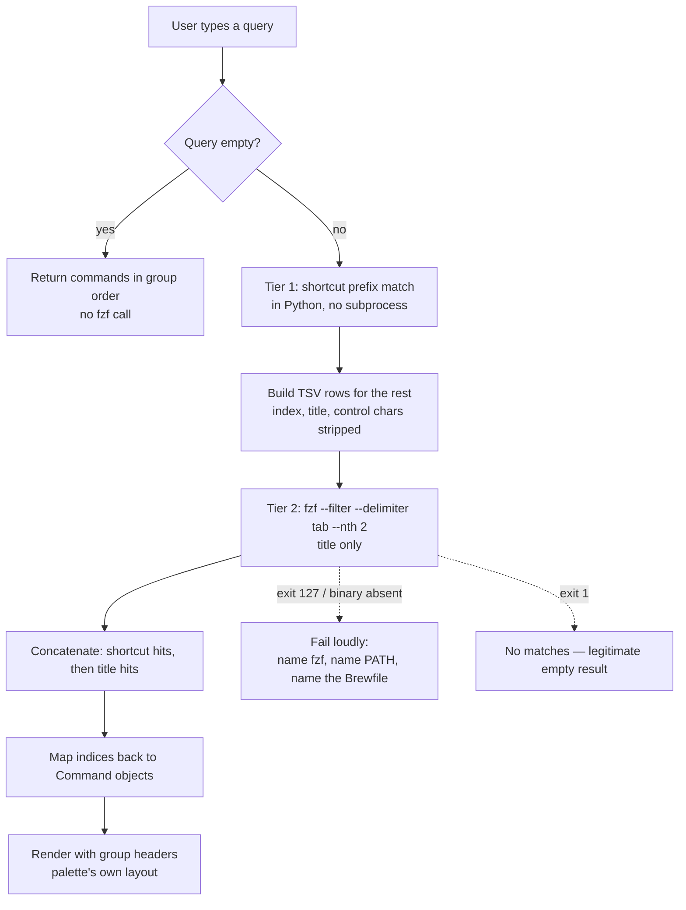

# fix: Six verified defects in the herdr command palette

## Summary

The herdr command palette works, but its fuzzy matcher puts the right command out of first place on 4 of 6 queries a user would naturally type, its main list silently truncates at 24 commands, and three focus workarounds are timing bets rather than synchronization. This plan fixes six defects that were each reproduced on this machine, and builds the test seam that proves the fixes.

Scope is the plugin directory plus its tests. No architectural rewrite: the curses UI, the nine command types, and the TOML config model all stay. One field is added — a per-command `shortcuts` list, matched by literal prefix above the fuzzy tier — because it replaces the description-matching pass the first draft used and is what makes a daily command reachable by a keystroke that never shifts meaning.

Five of the six defects are fixed and proven by an executor without leaving the checkout. The sixth (the focus timing bets) needs a live trial on the user's machine, so it runs last and has its own completion gate.

---

## Problem Frame

The command palette is a herdr 0.8.0 plugin. Its source of truth is `home/private_dot_config/herdr/plugins/command-palette/`; the live copy at `~/.config/herdr/plugins/command-palette/` is deployed by chezmoi from a separate clone and is never edited directly.

Three files carry the behavior: `palette.py` (1577 lines, single-file stdlib `curses` TUI), `open.py` (222 lines, the keybinding action that opens the palette pane), `smart_close.py` (93 lines). Commands are declared in `home/private_dot_config/herdr/command-palette/commands.toml` — ten of them today.

Six defects were verified first-hand, each with reproduction evidence. They fall into two groups: **user-visible now** (the matcher), and **latent ceilings or traps** that bite as the command set grows. The palette is about to grow — fourteen feature issues (`docs/issues/2026-08-18-004` through `-017`) are already filed against it — so the latent ones are worth fixing before they are load-bearing.

---

## Requirements

| ID | Requirement |
|---|---|
| R1 | Typing a query ranks the intended command first for the six measured queries, per the table below. |
| R2 | A query that matches no command title and no command shortcut returns empty, and every direct title hit ranks above every incidental match. |
| R3 | The main command list reaches every command by keyboard at any command count, with group headers accounted for in the layout. |
| R4 | The palette never types a shell command into a pane an agent owns. |
| R5 | Focus after a command that creates a tab or switches workspace is deterministic, not a timing bet. |
| R6 | Finding an already-open palette cannot be fooled by an unrelated pane that merely mentions `palette.py`. |
| R7 | `--validate` rejects a command that interpolates a form value into a shell string without quoting. |
| R8 | Every fix above is covered by a test that runs against the source tree in a bare checkout, without `chezmoi apply`. |
| R9 | A missing or too-old `fzf` produces a loud, named failure that stays on screen until dismissed — never a silent fallback to a worse matcher, and never a pane that flashes and vanishes. |
| R10 | A command may declare a `shortcuts` list; a query that prefixes any of its shortcuts puts that command first, whatever else is in the list. |

**R10's acceptance table.** `shortcuts` is a per-command list of literal strings in `commands.toml`. It exists so a command used every day has a keystroke that never changes meaning when an unrelated command is added, and so a query typed in the wrong keyboard layout still finds its command. Both needs are served by the same list:

| Command | `shortcuts` |
|---|---|
| Lazygit in popup | `["lg", "дп", "дфян"]` |
| Switch workspace | `["ws", "цы"]` |
| Open in Zed | `["zed", "яув"]` |
| Edit command palette config | `["edit", "увше"]` |

`дп` is `lg` and `дфян` is `lazy` typed on the ЙЦУКЕН layout — the letters sit under the same physical keys. The list is literal text, so nothing in the palette needs to know that. The Cyrillic entries are transcribed from the ЙЦУКЕН key map (`l`→`д`, `a`→`ф`, `z`→`я`, `y`→`н`, `g`→`п`, `w`→`ц`, `s`→`ы`, `e`→`у`, `d`→`в`, `i`→`ш`, `t`→`е`) and must be checked against it, not typed from memory.

These four rows are exactly the commands the R1 table names, so every R1 row except `main` and `lazy` becomes a deterministic shortcut hit rather than a ranking bet.

**R1's acceptance table.** "The intended command" was undefined in the first draft, which made the plan's central gate unbuildable — three commands contain "main" and two contain "Lazygit". These are the measured expectations under title-only matching:

| Query | Expected first result |
|---|---|
| `lg` | Lazygit in popup |
| `ws` | Switch workspace |
| `edit` | Edit command palette config |
| `zed` | Open in Zed |
| `main` | Merge main branch |
| `lazy` | Lazygit in popup |

`lg` and `main` are the two rows where a competent reader could expect a different answer, so U3's test asserts this table literally rather than the phrase "the expected command".

---

## Key Technical Decisions

### KTD1. `fzf --filter` is the scorer; the palette keeps the UI

**(session-settled: user-directed — chosen over porting fzf's scoring constants into Python: a fallback would mask a broken deployment of this very repo and create a second, untested code path.)** Governs R1, R2, R9.

fzf 0.74.3 is already installed and already declared in `home/private_dot_config/brewfiles/Brewfile:34`, so this adds no new dependency to the repo — it promotes an existing one from optional to required.

The boundary matters: fzf scores, the palette renders. fzf has no grouping primitive, and the palette already draws group section headers (`normalize_group_order`, `grouped_rows`). Handing fzf the UI would be a regression.

### KTD2. Two tiers: literal shortcuts in Python, then fuzzy titles in fzf

**(session-settled: user-directed — a `shortcuts` list plus the title is the whole search surface; matching descriptions was rejected outright.)** Governs R1, R2, R10.

Measured on the real ten commands. `--nth=2` (title only) fixes all six queries in the R1 table. Adding the group column (`--nth=2,3`) **regresses** `edit` — the "Editor" group contributes the letters, so "Open in Zed" displaces "Edit command palette config". Adding the description column has the same failure shape and buys nothing that a shortcut does not buy more predictably, so **neither group nor description is ever searched.**

The two tiers are therefore:

1. **Shortcut tier, in Python, before fzf.** Case-fold the query and every shortcut, then keep commands where the query is a **prefix** of a shortcut. Prefix, not fuzzy: a shortcut's whole value is that `lg` means one command forever, and a fuzzy matcher makes that depend on what else is in the list. Order inside the tier: exact shortcut match first, then prefix match, then the palette's existing group order. Prefix also means a half-typed `дфя` still finds `дфян`.
2. **Title tier, in fzf.** `--filter --delimiter '\t' --nth 2` over every command the shortcut tier did not already return.

Concatenate: shortcut tier, then title tier. A command appears once.

The earlier draft ran a second fzf pass over group and description. It was dropped: it re-admitted exactly the commands the title pass correctly excluded — verified, `zed` returned `Open in Zed` alone from the title pass and `Open in Zed, Lazygit in popup` once description was added, breaking U3's own acceptance scenario. It also doubled the subprocess count per keystroke. The shortcut tier replaces it and costs no subprocess at all.

### KTD3. Identity travels as a hidden index column

Rows are `<index>\t<title>` — two columns, because KTD2 removed group and description from the search surface entirely. `--accept-nth={1}` returns the index, which maps back to the `Command` object. Display and matching stay independent of what is returned.

**Every fzf call must pass `--delimiter '\t'` explicitly.** fzf's default delimiter is AWK-style whitespace, so without it `--nth=2` selects the second whitespace-separated span rather than the title column — a different result set, silently. Verified: `--nth=2` on the real commands returns three matches for `lg` with the delimiter set and two without it. The two-column row does not make this optional: a title with a space would still split.

Any title containing a tab, newline, or carriage return would shift the column — verified: a tab inside a field corrupts the parse. Sanitize on the way in.

### KTD4. Exit code 1 from fzf means "no matches", not "failure"

Three cases, and they are easy to conflate:

- **Empty user query** — the palette does not call fzf at all; it returns commands in group order. (Passing an empty query to fzf would also return every row at exit 0, but the palette never takes that path.)
- **Zero candidate rows piped in** — exit 1, empty output.
- **A query that matches nothing** — exit 1, empty output. This is a legitimate result, not a failure.

The palette must distinguish exit 1 from a missing or broken binary. Conflating them would turn "you typed a typo" into a crash, or worse, hide a broken deployment.

### KTD5. The palette pane is a popup, and that likely removes the focus races

herdr 0.8.0's own API schema declares `PluginPanePlacement` as `["overlay", "popup", "split", "tab", "zoomed"]`, with `width`/`height` as first-class `PopupSize` parameters on `PluginPaneOpenParams`. `open.py:186-192` passes `--placement popup`, legitimately overriding the manifest's `overlay`.

This matters because the documented hazard — herdr killing the pane's whole process group on close, which `nohup` does not escape — is described for **overlay** panes. A plugin that uses popup panes and focuses directly needs no workaround at all. So U7 starts by testing whether the sleeps are load-bearing before replacing them.

Correction to an earlier read: `popup` and the size flags are absent from `herdr plugin pane open --help` on 0.8.0. That is a help-text gap, not a deprecation. The schema is authoritative.

### KTD6. New tests run against the source tree, in their own file

The existing palette tests (`tests/smoke.bats:76-197`) import and execute `palette.py` from the **applied** copy under `$HOME`. On the host that copy is stale until `chezmoi apply`, which this repo forbids running — so those tests cannot verify an uncommitted edit.

`tests/scripts.bats` already uses the better convention: run out of `$SOURCE_ROOT`, which resolves to this checkout's `home/`. New tests follow it.

They go in a **new** `tests/palette.bats` rather than into `smoke.bats`. Cost: the bats runner list is hardcoded in four places (`.github/workflows/test-dotfiles.yml:60` and `:92`, plus both command blocks in `docker/docker-compose.yml`), so a new file must be added to all four. Benefit: the file runs standalone in a bare checkout with no chezmoi apply, which is what makes it usable as this plan's verification gate. The four-line edit is worth a gate that actually runs.

### KTD7. Only the new subprocess gets a timeout

`docs/solutions/design-patterns/external-review-legs-as-unreliable-subprocesses.md` establishes the repo's rule: absence of a well-formed result is failure, never a clean pass. `palette.py` has roughly ten `subprocess.run` call sites and none sets a timeout.

Retrofitting all ten is out of scope here — it is not one of the six defects. The fzf call is new code, so it carries a timeout from the start.

**The timeout is 2 seconds.** Measured on this machine with fzf 0.74.3, 20 runs per size: median 3.1 ms at 10 rows, 3.0 ms at 100, 3.2 ms at 1000. Latency does not track list size — it is process-spawn cost, not search cost. The single outlier was 26.7 ms on the first cold run. A 2-second ceiling is roughly 600× the median, so it cannot be reached by a slow machine; it is reached only by a hung binary, a stalled filesystem, or a box under total load.

**An expiry returns an empty result and a status line, and the palette stays alive.** `subprocess.TimeoutExpired` is caught at the call site — it is explicitly **not** covered by U3's "anything else is a failure that surfaces" rule, which governs exit codes. The user keeps their typed query and the open pane; the next keystroke retries.

This is deliberately different from the missing-binary path in KTD9, and the distinction is the point. A missing `fzf` means the dependency is not there and nothing can work, so the palette stops and says so. An expired call means the dependency exists and did not answer in time, and may answer on the next keystroke — tearing down an open palette and a half-typed query over one unanswered call costs the user more than an empty list does.

A hung `fzf` therefore costs 2 seconds per keystroke rather than crashing. That is accepted: it is a visibly broken state the user will act on, and it does not destroy their input on the way.

### KTD8. `shortcuts` is a validated optional field, not a free-form blob

`Command` (`palette.py:39-51`) gains `shortcuts: tuple[str, ...] = ()`, populated in `command_from_raw` (`palette.py:271`) from the raw TOML key.

`validate_command_raw` (`palette.py:250-271`) rejects a malformed value, because a silently ignored shortcut is worse than a loud one: the user's muscle memory stops working with no message. Rejected: a `shortcuts` that is not a list, an entry that is not a string, an empty or whitespace-only entry, and an entry containing whitespace (a shortcut is one token by construction — the query field is not split, so a shortcut with a space could never be matched by prefix in the way the user expects).

Duplicate shortcuts across commands are **not** rejected here. Resolving global-vs-project shortcut collisions is a real question with no obvious answer and is filed separately (`docs/issues/2026-08-18-005-palette-alias-tier.md`); until it is decided, group order breaks the tie deterministically.

The hand-rolled TOML fallback parser (`palette.py:111-198`) must parse a string array, since Ubuntu CI runs it. Confirm before implementing that `parse_toml_value` already handles `["a", "b"]`; if it does not, extending it is part of U3, not a follow-up.

### KTD9. The missing-`fzf` failure renders in the pane and waits for a keypress

**(session-settled: user-approved — chosen over stderr plus `herdr notification show`.)** Governs R9.

The palette runs inside a popup pane opened by a keybinding. A process that writes to stderr and exits leaves a pane that flashes and disappears, so the message R9 requires is never read — the failure is loud in a log nobody opens and silent where the user is actually looking.

So the preflight failure draws its message in the pane and blocks until a key is pressed. The message names three things, because together they make the failure fixable: that `fzf` is required, that it is declared in `home/private_dot_config/brewfiles/Brewfile`, and that a `/usr/bin:/bin` `PATH` hides an `fzf` installed in `/opt/homebrew/bin`.

`herdr notification show` exists in 0.8.0 and was considered as the alternative. It was rejected on message length: a notification cannot carry those three facts, and it pulls attention away from the pane where the full text already is.

**The keypress wait is conditional on an interactive stdin.** Under `bats` stdin is not a TTY, so an unconditional wait would either hang the suite or return instantly at EOF depending on how the test is invoked — a flaky gate on the very path that proves R9. When stdin is not a TTY the palette prints the same text to stderr and exits non-zero with no wait. The test asserts the text and the exit code; the wait is exercised by hand.

---

## High-Level Technical Design

The scoring path after U3, showing where the hard-dependency check sits and how the two matching tiers combine. Only the second tier spends a subprocess:

The preflight check runs once at startup rather than per keystroke, so a missing binary is reported before the user types anything.

---

## Scope Boundaries

### In scope

The six defects, the test seam that proves them, making `fzf` a real dependency of the test environments, and the `shortcuts` field that replaces the rejected description-matching tier.

### Deferred to Follow-Up Work

- **Delete `is_up_key` and `is_down_key`** (`palette.py:1236-1245`) — defined, never called. A two-function deletion serving no requirement in this plan.
- **Timeouts on the other ~10 `subprocess.run` call sites** in `palette.py`. Real hardening, per the repo's own subprocess learning, but not one of the six defects.
- **`smart_close.py` has a lost executable bit.** It is mode `100755` in git, but chezmoi encodes the exec bit in the filename prefix (`executable_`), so the applied copy is `-rw-r--r--`. Currently harmless: the manifest invokes it as `["python3", "smart_close.py"]`, so the bit is never used. Fixing it means renaming the source file and updating the run-onchange hash trigger.
- **No Python linter, formatter, or type checker exists** in this repo. `make lint` is shellcheck and explicitly excludes `*.py` (`Makefile:47`). Adding one is a separate decision.
- **A `docs/solutions/` entry on shell quoting.** The scout found no learning covering quoting or interpolation despite `palette.py` building `bash -lc` strings; U8's fix is the natural moment to write one, but that is `ce-compound`'s job.

### Out of scope

**Matching a command by its description or its group.** Rejected outright, not deferred: both regress the measured queries, and the `shortcuts` list covers the need they were meant to cover with a predictable rule instead of a scoring accident.

**Collision rules for a shortcut claimed by two commands.** A project-local `.herdr/command-palette/` config can claim a shortcut a global command already uses. Group order breaks the tie deterministically for now; the real rule is filed in `docs/issues/2026-08-18-005-palette-alias-tier.md`.

**Deriving the Cyrillic shortcuts automatically** by mapping the query through the ЙЦУКЕН↔QWERTY key table before matching. That would make every command findable in the wrong layout with no per-command entries, so it likely supersedes half of R10's table — filed as its own issue rather than folded in here, because it changes what `commands.toml` should contain.

The fourteen feature issues already filed (`docs/issues/2026-08-18-004` … `-017`), and the three architectural changes: unix-socket transport, collapsing the two rendering stacks into one curses session with modes, and an events-driven warm index. **No defect fix in this plan requires any of them** — U5's agent check needs one field that `herdr pane list` already returns over the CLI.

---

## Assumptions

- The user runs `chezmoi apply` themselves after this lands; nothing here is live until they do.
- Ubuntu CI's Python is 3.10, so `tomllib` is absent and CI already exercises the hand-rolled fallback parser at `palette.py:111-198`. That parser is live insurance for a degraded `PATH`, not dead code, and stays.
- Adding `fzf` to the Ubuntu test image is acceptable. Without it, U3's hard dependency breaks `test-ubuntu`.

---

## Implementation Units

**Delivery order: U1 → U2 → U3 → U4 → U5 → U6 → U8, then U7 last.** U7 is the only unit that cannot be completed by an executor working in this checkout, so it does not sit mid-sequence. Everything else reaches a green `bats tests/palette.bats` and a commit without leaving the repository.

**U7 is human-gated.** Its first action is an experiment against a live herdr, which needs `chezmoi apply` — forbidden on the host, so the user runs it. The executor stops after U8, commits, and hands over. It then resumes with the observed focus behavior in hand.

### U1. Add a source-tree test file for the palette

**Goal:** A bats file that exercises the palette out of the checkout, so every later unit has somewhere to prove itself before `chezmoi apply`.

**Requirements:** R8

**Dependencies:** none

**Files:**
- `tests/palette.bats` (new)
- `.github/workflows/test-dotfiles.yml` (add `tests/palette.bats` to the runner lists at `:60` and `:92`)
- `docker/docker-compose.yml` (add it to both the `test-full` and `test-quick` command blocks)

**Approach:**

1. Follow the `tests/scripts.bats` convention: resolve the plugin from `$SOURCE_ROOT/private_dot_config/herdr/plugins/command-palette`, not `$HOME`.
2. `load 'helpers/common'` for the bats-assert/bats-file helpers and `SOURCE_ROOT`.
3. `setup()` skips when `python3` is absent.
4. Seed it with one characterization test per defect area, capturing **current** behavior where the fix has not landed yet, so later units show a real diff.

Leave the existing `tests/smoke.bats:76-197` tests alone. They assert the applied copy, which is a legitimate chezmoi smoke check — a different job from behavior testing.

**Patterns to follow:** `tests/scripts.bats:95` and `:777` for `$SOURCE_ROOT`-based invocation; `tests/scripts.bats:169-197` (`ask_stub_herdr`) for a command-logging fake binary; `tests/smoke.bats:104-126` for monkeypatching `subprocess.run` on an imported module.

**Test scenarios:**
- `palette.py --validate` on a known-good fixture exits 0 and names the command count.
- `palette.py --validate` on a fixture with an unsupported `type` exits non-zero and the output contains `unsupported type`.
- Importing `palette.py` from `$SOURCE_ROOT` succeeds and `load_commands()` returns a non-empty list against a fixture config.
- The file runs green via `bats tests/palette.bats` from the repo root with no `chezmoi apply`.

**Verification:** `bats tests/palette.bats` passes in a bare checkout.

---

### U2. Make fzf available to the test environments

**Goal:** CI and Docker have `fzf`, so U3's hard dependency does not turn `test-ubuntu` red.

**Requirements:** R9

**Dependencies:** U1

**Files:**
- `docker/Dockerfile.ubuntu`
- `.github/workflows/test-dotfiles.yml`
- `tests/smoke.bats` (the `fzf is available (if installed)` test at `:487-491`)

**Approach:**

1. Install `fzf` in the Ubuntu image and in both CI jobs alongside the existing `bats` install.

   **Pin a version floor of fzf ≥ 0.56** — the release that introduced `--accept-nth`, which KTD3's whole identity scheme depends on. This is not optional detail: the GitHub Ubuntu job installs its tooling with `apt-get` (`.github/workflows/test-dotfiles.yml:37`), and the Ubuntu-packaged fzf predates that flag. Installing it from apt there would fail `test-ubuntu` with an unknown-flag error that reads like a palette bug — the exact outcome U2 exists to prevent. Install from the upstream release tarball on the CI Ubuntu job. The Docker image already installs `bats-core` through Homebrew (`docker/Dockerfile.ubuntu:51`), so `brew install fzf` is the consistent choice there.
2. Promote the conditional smoke test: drop `command_exists fzf || skip` so a missing fzf fails rather than skips, and assert the **version floor**, not just presence. It is a hard dependency now, and a skipping test would hide exactly the deployment breakage KTD1 exists to surface.
3. Leave `Brewfile:34` as is — the declaration is already correct.

**Execution note:** Land and verify this before U3. If CI cannot get fzf, that changes U3's design and is better known now than after the scorer is rewritten.

**Test scenarios:**
- `command -v fzf` succeeds inside `make shell-ubuntu`.
- The promoted smoke test fails (not skips) when `fzf` is removed from `PATH`.
- `make test-ubuntu` is green.

**Verification:** `make test-ubuntu` passes with the promoted test.

---

### U3. Replace the fuzzy scorer with a shortcut tier plus fzf (DEFECT 1)

**Goal:** The intended command ranks first, a declared shortcut wins outright, and a non-match returns nothing.

**Requirements:** R1, R2, R9, R10

**Dependencies:** U1, U2

**Files:**
- `home/private_dot_config/herdr/plugins/command-palette/palette.py`
- `home/private_dot_config/herdr/command-palette/commands.toml`
- `tests/palette.bats`

**Approach:**

1. **Preflight, once at startup.** Resolve `fzf` and fail loudly if absent, per KTD9. The message names three things — that `fzf` is required, that it is declared in `home/private_dot_config/brewfiles/Brewfile`, and that a degraded `PATH` can hide an installed binary. That last one is not hypothetical: `fzf` lives in `/opt/homebrew/bin` and is absent from a `/usr/bin:/bin` PATH, the same fragility that decides which Python the plugin gets.

   Check `shutil.which("fzf")` directly. If it returns `None`, use one of two rendering paths, chosen by whether stdin is a TTY. **Interactive:** draw the message in the pane and block until a key is pressed, then exit non-zero — the pane is a popup, so anything that exits immediately is unreadable. **Non-interactive:** print the same text to stderr and exit non-zero with no wait. Keep the message text in one place so the two paths cannot drift apart; the test pins that text.
2. **Add the `shortcuts` field** to `Command`, `command_from_raw`, and `validate_command_raw` per KTD8, and populate it in `commands.toml` from R10's table. Check the hand-rolled TOML parser handles a string array before assuming it does.
3. **Replace `fuzzy_score` and `ranked`** with the two tiers from KTD2: the Python shortcut-prefix pass, then a single fzf pass over the remainder. Build TSV rows per KTD3, stripping tab/newline/carriage-return from the title. Map returned indices back to `Command` objects.
4. **Handle exit codes per KTD4:** 0 with output is matches, 1 is no matches, anything else is a failure that surfaces rather than degrading. A timeout is not an exit code and is handled separately, per KTD7.
5. **Keep the empty-query path free of fzf** — return commands in group order directly.
6. **Pass `timeout=2` on the fzf call and catch `subprocess.TimeoutExpired` at that call site** (KTD7). Return an empty result and set a status line; do not let the exception escape into the curses loop.
7. `Command.search_text` (`palette.py:49-51`) concatenates origin, group, title, description and kind into one blob. Nothing searches that blob after this unit — delete it rather than leaving a live field no code path reads.

Grouping, rendering, and the `select`/`form` sub-pickers are untouched. `visible_choices` (`palette.py:1001-1008`) also calls `fuzzy_score` — route it through the same scorer so the two lists rank consistently.

**Patterns to follow:** None for the `fzf` preflight; the required check and failure behavior are specified above.

**Test scenarios:**
- Each of `lg`, `ws`, `edit`, `zed`, `main`, `lazy` against the real `commands.toml` ranks the expected command first, per R1's table. These are the six measured queries; `lg`, `ws`, `edit` and `main` currently fail.
- `zed` returns exactly one command, not ten.
- Each Cyrillic shortcut from R10's table — `дп`, `дфян`, `цы`, `яув`, `увше` — ranks its command first. `дп` also returns *only* that command, since no title contains Cyrillic.
- A half-typed shortcut `дфя` still ranks Lazygit in popup first, proving prefix and not exact matching.
- Adding a decoy command titled `LG something` to a fixture config does not displace the `lg` shortcut hit — this is the property the shortcut tier exists for, and a fuzzy shortcut match would fail it.
- Shortcut matching is case-insensitive: `LG` behaves as `lg`.
- `--validate` rejects `shortcuts = "lg"` (not a list), `shortcuts = ["lg", 7]` (not a string), `shortcuts = [""]` (empty), and `shortcuts = ["l g"]` (contains whitespace), each with the offending command named.
- A command with no `shortcuts` key loads and matches by title exactly as before.
- A query matching nothing returns an empty list, and the palette shows "No matching commands" rather than erroring.
- An empty query returns every command in group order, unchanged from today.
- A command whose title contains a literal tab does not corrupt the mapping — the returned command is still the right one.
- With no `fzf` on `PATH`, the palette exits non-zero and the output names `fzf`, the Brewfile, and `PATH`. Pin all three with `assert_output --partial`, per `docs/solutions/design-patterns/completion-is-not-a-verdict.md` guidance 6.
- That test **terminates on its own.** stdin under bats is not a TTY, so the keypress wait must not fire; a test that needs a timeout to finish means the TTY check is wrong. Assert this deliberately rather than discovering it as a hang.
- Manual, once: with `fzf` renamed out of `PATH`, press the palette keybinding and confirm the popup stays open with the message readable until a key is pressed. This is the R9 scenario proper and cannot be automated from a bats run.
- With a stub `fzf` on `PATH` that sleeps past the timeout, the search returns an empty result, the palette does not exit, and no traceback reaches the output. Keep the stub's sleep just over 2 seconds so the test costs ~2 seconds, not more.
- `visible_choices` ranks a `select` command's options through the same scorer.

**Verification:** All six R1 queries and all five R10 shortcuts rank correctly; the decoy test proves the shortcut tier is not fuzzy; the missing-fzf test asserts both the exit code and the message text.

---

### U4. Scroll the main command list (DEFECT 2)

**Goal:** Every command is reachable by keyboard regardless of how many exist.

**Requirements:** R3

**Dependencies:** U1

**Files:**
- `home/private_dot_config/herdr/plugins/command-palette/palette.py`
- `tests/palette.bats`

**Approach:**

`curses_scroll_window` (`palette.py:690-699`) already exists and is used by the workspace picker (`:894`) and the choice picker (`:1070`). The main list at `render_curses_palette` (`:702-789`) does not call it — it hard-truncates via `result_limit_for_rows` (`:386`) instead.

1. Call `curses_scroll_window` from the main list, as the other two pickers do.
2. Count the limit in **display rows**, not commands. `grouped_rows` inserts a header per group, and today those headers are not counted — which is why content lands on the footer line.
3. Keep the selected row inside the visible window when scrolling.

Measured today at the real popup height of 34 rows: 40 commands in 8 groups truncate to 24 commands, produce 29 display rows, and put the last row on `y=31` — exactly where the description line draws.

**Test scenarios:**
- With 40 commands across 8 groups at 34 rows, every command is reachable by repeated "down" from the top.
- The last rendered row never overlaps the description line or the footer.
- The selected index stays within the visible window after scrolling past the bottom.
- With 10 commands (today's real count) the rendering is unchanged — no regression to the current view.
- A single group with no headers still scrolls correctly.

**Verification:** The reachability scenario passes at 40 commands; the 10-command rendering is byte-identical to before.

---

### U5. Refuse `pane_run` into a pane an agent owns (DEFECT 4)

**Goal:** The palette never submits a shell line as a prompt to someone's agent.

**Requirements:** R4

**Dependencies:** U1

**Files:**
- `home/private_dot_config/herdr/plugins/command-palette/palette.py`
- `tests/palette.bats`

**Approach:**

`herdr pane run <pane> <cmd>` types the line into the pane. When an agent owns that pane, herdr submits it as a prompt. Our `Edit command palette config` command is `type = "pane_run"` and has no guard.

1. Before running, read the target pane's `agent` field. `herdr pane list` already returns it — verified live, panes carry `agent` and `agent_status` alongside `label`.
2. When `agent` is non-empty, refuse: do not run, and raise `herdr notification show` explaining why, naming the pane and the agent.
3. Keep the check to `pane_run` only. `tab_run` creates a fresh pane and is unaffected.

This needs no socket client — one CLI call returns the field.

**Patterns to follow:** `speardragon/herdr-command-center` `src/executor.mjs:72-91` refuses and notifies rather than failing silently.

**Test scenarios:**
- With a stub `herdr` reporting the target pane as `agent=claude`, `pane_run` does not issue `pane run`, and a `notification show` is issued.
- With a stub reporting `agent` empty or absent, `pane_run` issues `pane run` exactly as today.
- The refusal message names the pane id and the agent.
- A `tab_run` command is unaffected by the guard.
- When the pane lookup itself fails, the palette reports that rather than assuming the pane is free — absence of a well-formed answer is not a clean pass, per `docs/solutions/design-patterns/external-review-legs-as-unreliable-subprocesses.md`.

**Verification:** Both stub cases behave as specified, asserted against the stub's command log.

---

### U6. Find an open palette by label, not by grepping argv (DEFECT 5)

**Goal:** The re-entry guard cannot be fooled by an unrelated pane.

**Requirements:** R6

**Dependencies:** U1

**Files:**
- `home/private_dot_config/herdr/plugins/command-palette/open.py`
- `home/private_dot_config/herdr/plugins/command-palette/herdr-plugin.toml` (only if the pane needs an explicit label)
- `tests/palette.bats`

**Approach:**

`process_is_palette` (`open.py:84-90`) substring-matches `palette.py` against a pane's combined argv, cmdline and cwd — unanchored and unbounded. An editor with the file open, a grep over it, or an agent discussing it all match. `workspace_palette_pane` (`:123-136`) then calls `herdr pane process-info` once per pane to feed it.

1. Replace both with a single `herdr pane list --workspace <ws>` filtered on the pane `label`. Panes carry `label` — verified live.
2. Confirm the palette's popup pane actually receives a distinguishable label from the manifest's `title`. If not, set one explicitly rather than inferring.
3. On the reveal path, `herdr pane zoom <id> --on` focuses and maximizes atomically — verified present in 0.8.0 — so no separate focus call is needed.

Do not delete the guard outright. A sibling plugin relies on herdr's popup panes being session-modal to prevent stacking, but that is its claim about `min_herdr_version = "0.7.4"`, not something verified here. Keeping a cheap correct guard is better than betting on modality.

**Test scenarios:**
- A stub `herdr` returning a pane labelled as the palette causes `open.py` to focus it instead of opening a second one.
- A stub returning a pane whose *command line mentions* `palette.py` but whose label is different does **not** match — this is the defect, and it must fail before the fix.
- With no palette pane present, `open.py` opens one.
- The fix issues one `pane list` call and zero `pane process-info` calls.

**Verification:** The false-positive scenario fails against current code and passes after.

---

### U7. Remove the sleep-based focus races (DEFECT 3)

**Goal:** Focus is sequenced, not timed.

**Requirements:** R5

**Dependencies:** U1, U6, U8 — U7 runs **last**, after every other unit is committed.

**Who runs what.** This unit has a human step in the middle and cannot be executed end to end from the checkout. The split is fixed:

| Step | Who | Where |
|---|---|---|
| 1. Remove the `tab_run` sleep (`palette.py:1450-1462`) and commit | executor | this checkout |
| 2. `chezmoi apply`, then run `Lazygit in new tab` and `Switch workspace`, and report where focus landed | **user** | live machine |
| 3. Remove the remaining sleeps, or replace all three with an explicit sequence, per what step 2 showed | executor | this checkout |
| 4. `chezmoi apply` and re-run both commands to confirm | **user** | live machine |

The executor stops at step 1 and asks. It does not guess the outcome of step 2, and it does not proceed to step 3 without it.

**Files:**
- `home/private_dot_config/herdr/plugins/command-palette/palette.py`
- `home/private_dot_config/herdr/command-palette/commands.toml`
- `tests/palette.bats`

**Approach:**

Three sleeps with three different constants: `palette.py:966-976` (0.2 s, workspace picker), `palette.py:1450-1462` (0.2 s, `tab_run`), `commands.toml:15` (0.4 s, the lazygit popup).

**Start by testing whether they are load-bearing at all.** Per KTD5, the palette pane is a popup, and the documented process-group hazard is described for overlay panes. Step 1 removes one sleep; step 2 is the user's live trial. If focus lands correctly, the rest are removable too and this unit is nearly free.

The `tab_run` sleep is the one to remove first because it is the easiest to judge by eye: either the new tab has focus or it does not. The workspace-picker sleep fires during a workspace switch, where a wrong outcome is harder to attribute.

If the race is real, apply one fix consistently to all three:
- **(a)** Focus synchronously, then close the pane explicitly via `herdr pane close $HERDR_PANE_ID`.
- **(b)** Focus after the TUI is torn down and immediately before process exit.

Prefer (b) for `palette.py` — it needs no new herdr call and matches the existing `curses.wrapper` teardown, which already ends before `run_command` executes. Use (a) for the `commands.toml` lazygit entry, which is a shell command with no TUI to tear down.

Do not plan around `herdr wait`: it does not exist as a command in herdr 0.8.0. `herdr agent wait --until <status>` exists but waits on agent status, not focus readiness.

**Execution note:** Record what the live trial showed in the step-3 commit message — whether popup panes race is the fact this unit buys, and it is worth more than the diff.

**Test scenarios:**
- `tab_run` issues `tab create --no-focus`, then `pane run`, then `tab focus`, in that order, with no detached `bash -lc` and no `sleep` in the issued commands.
- The workspace picker issues `workspace focus` directly.
- No `sleep` remains in `palette.py` or in `commands.toml`.
- Manual: run `Lazygit in new tab` and confirm focus lands on the new tab. Manual: run `Switch workspace` and confirm the chosen workspace focuses. These need a live herdr and cannot be automated here.

**Verification:** Automated scenarios assert the issued command sequence against the stub log; the two manual checks confirm real focus behavior.

---

### U8. Reject unquoted `{value}` in shell commands (DEFECT 6)

**Goal:** A form value containing a space or a quote cannot silently break the command it feeds.

**Requirements:** R7

**Dependencies:** U1

**Files:**
- `home/private_dot_config/herdr/plugins/command-palette/palette.py`
- `home/private_dot_config/herdr/plugins/command-palette/README.md`
- `tests/palette.bats`

**Approach:**

Reproduced: a form value of `a; touch /tmp/PWNED #` expands into `echo a; touch /tmp/PWNED #` when the author writes `{value}`; `{value_q}` quotes it correctly. `validate_command_raw` (`:250-271`) accepts the bare form.

1. In the validator, reject a bare `{value}` interpolated into a shell-bearing command type (`shell`, `overlay_shell`, `pane_run`, `tab_run`) with a message naming `{value_q}` as the fix. `{value_url}` stays valid — it is already escaped for its context.

   **A `herdr` argv array is not automatically safe.** The first draft excluded argv entries on the grounds that Python does not shell-parse them, which is true but not the whole picture: `herdr pane run <pane> <command>` hands its argument to a shell on the far side. So a bare `{value}` inside a `herdr` argv array that invokes a shell-bearing subcommand reaches a shell just as surely as a `shell` type does. Treat `pane run` — and any other subcommand that forwards a command string — as a shell-bearing context for this check.
2. Fix the one real occurrence if `commands.toml` has any. The Google-search example in `README.md:119` already uses `{value_url}` correctly; check the rest of the README's examples and correct any that model the unsafe form.
The dead-code removal that was bundled here in the first draft (`is_up_key` / `is_down_key`, `palette.py:1236-1245`) has moved to Deferred: it serves none of R1-R9 and does not belong inside a defect fix.

The stronger fix — passing values only as environment variables so interpolation is structurally impossible — is a schema change affecting every existing `select` and `form` command. It is the right long-term shape and belongs in its own issue, not here.

**Test scenarios:**
- `--validate` on a `form` command with `command = "echo {value}"` exits non-zero and the message names `{value_q}`.
- `--validate` on the same command with `{value_q}` exits 0.
- `--validate` on a `form` command with `{value_url}` exits 0.
- A bare `{value}` in a non-shell type (`herdr` argv array) is still accepted — argv entries are not shell-parsed.
- The real `commands.toml` still validates clean.
- `grep` finds no reference to `is_up_key` or `is_down_key` after removal.

**Verification:** `python3 palette.py --validate` on the real config exits 0; both unsafe fixtures are rejected with the named message.

---

## Verification Contract

| Gate | Command | Covers |
|---|---|---|
| Syntax | `python3 -m py_compile` on the three plugin files | U3, U4, U5, U6, U7, U8 |
| Behavior | `bats tests/palette.bats` | U1, U3, U4, U5, U6, U7, U8 |
| Shell lint | `make lint` | U2 |
| Full suite | `make test-ubuntu` | U2, and regression across the repo |
| Chezmoi dry-run | `make test-local` | every file edit under `home/` |
| Manual — **user only**, after `chezmoi apply` | Open the palette; run `Lazygit in new tab` and `Switch workspace`; report where focus landed | U7 |
| Manual — **user only**, once | Rename `fzf` out of `PATH`, press the palette keybinding, confirm the popup stays readable until a key is pressed | U3 (R9) |

**Never run `chezmoi apply` on the host.** Use `make test-local` for a diff or `make test-ubuntu` for a real apply inside Docker.

**The frontmatter `validate_commands` list is a fast subset, not the whole contract.** It carries the three gates a bare checkout can run unattended in seconds. `make test-ubuntu` needs Docker and `make test-local` needs a configured chezmoi, so both stay in this table and out of the machine-readable list. An executor that runs only `validate_commands` has not satisfied the Verification Contract.

---

## Risks

- **U7's experiment may be inconclusive** if focus behavior varies with workspace state. If two runs disagree, keep the sleeps and say so rather than removing them on a hunch — a flaky focus bug is worse than a 0.2 s delay.
- **U3 changes ranking for every query, not just the six measured.** The six are the acceptance bar, not the whole surface. Expect to use the palette for a day before trusting it.
- **The new bats file must be added to four runner lists.** Miss one and the tests pass locally while CI never runs them — the failure mode is silent.
- **Ubuntu CI Python is 3.10**, so `tomllib` is absent and the fallback TOML parser runs there. A test that assumes real TOML semantics will silently exercise the other parser. Pin both paths where it matters.

---

## Definition of Done

The plan has **two** completion points, because U7 needs a live machine the executor cannot reach.

**Gate A — the executor's work is done** (U1–U6, U8):

- Five of the six defects have a test in `tests/palette.bats` that fails against current code and passes after the fix.
- The six measured queries rank the intended command first, and every shortcut in R10's table ranks its command first — including with a decoy title added, which is the property that separates a shortcut from a fuzzy hit.
- A missing `fzf` produces a named, non-zero failure naming `fzf`, the Brewfile and `PATH`, pinned by a test that terminates without a timeout.
- `make test-ubuntu` is green, with `tests/palette.bats` in all four runner lists.
- `make test-local` shows only the intended diff.
- Committed directly to `main`.

Gate A is where the executor stops and hands over. R5 is **not** met at gate A, and the plan must say so rather than reading as finished.

**Gate B — U7, after the user's live trial:**

- No `sleep` remains in `palette.py` or `commands.toml`, and each removal is justified by a named ordering guarantee — not by one manual trial that happened to look right. A sleep that stays means R5 is unmet; record it as an open question rather than as a completed unit.
- `Lazygit in new tab` and `Switch workspace` both land focus correctly on a live machine, confirmed by the user after `chezmoi apply`.
- The commit message records whether popup panes race, which is the durable finding of this unit.

---

## Open Questions

Four items are **blocking** — the plan cannot be executed as written until they are decided. They came out of the document review on 2026-08-18 and each one can make a unit fail its own acceptance test.

- **RESOLVED — Tier 2 broke the `zed` acceptance bar.** The description/group pass re-admitted exactly the commands the title pass correctly excluded (`zed` returned `Open in Zed` alone, then `Open in Zed, Lazygit in popup`). Resolved by dropping description and group from the search surface entirely and replacing that pass with a literal `shortcuts` prefix tier (R10, KTD2, KTD8). Description matching is not deferred — it is rejected.
- **RESOLVED — U7's experiment cannot be run by an executor.** `chezmoi apply` is forbidden on the host, so the live focus trial is the user's step. Resolved by moving U7 to the end of the delivery order and splitting it into four steps with a named owner each (see U7). The executor stops after step 1 and waits; it never guesses the trial's outcome.
- **RESOLVED — What the user sees when `fzf` is missing.** A popup pane that writes to stderr and exits flashes and vanishes, so R9's message was never readable. Resolved by KTD9: the failure renders in the pane and waits for a keypress when stdin is a TTY, and falls back to stderr with no wait when it is not — which is what keeps the bats gate from hanging. `herdr notification show` was considered and rejected on message length.
- **RESOLVED — Timeout value and expiry behavior for the per-keystroke fzf call.** Set to 2 seconds against a measured median of ~3 ms (20 runs at 10/100/1000 rows, flat across sizes — it is spawn cost, not search cost), so the ceiling is unreachable by a slow machine. An expiry returns an empty result plus a status line and leaves the palette running; it is explicitly excluded from KTD4's exit-code rule. See KTD7.

Non-blocking, recorded for the implementer:

- **Should the acceptance bar stay at six queries?** (deferred) The same six queries that produced the tiering design are also its acceptance test, on the same ten commands — no held-out set exists, so a fit to six data points is indistinguishable from a real improvement.
- **Should U1–U3 ship separately from U4–U8?** (deferred) The ranking change is the only user-visible one and the plan says it needs a day of dogfooding; bundling it with five invisible fixes makes a bad feeling hard to attribute.
- **Should the four hardcoded bats runner lists become one `bats tests/` invocation?** (deferred) It would remove the silent-failure mode KTD6 currently documents as a risk.
- **Which `Choice` field does the `select` sub-picker match on?** (deferred) `Choice` has `label`/`description`/`value`, no group and no shortcuts, so KTD2's two tiers do not transfer directly. Matching `label` alone is the obvious reading of "titles only" and is what U3 assumes.
- **Does the palette's popup pane carry a distinguishable `label` today?** (deferred — U6 checks and sets one if not; if it does not and the manifest cannot set one, U6 has no fallback and R6 goes unmet.)
- **Should the environment-variable-only value protocol replace `{value}` entirely?** (deferred — a schema change touching every `select` and `form` command; belongs in its own issue.)

---

## Sources

- Defect reproductions, live API probes, and comparative research: this session's investigation of 16 herdr plugins, published at the command-palette review artifact.
- `docs/solutions/design-patterns/external-review-legs-as-unreliable-subprocesses.md` — default-dead subprocess handling, fail closed on missing results.
- `docs/solutions/design-patterns/completion-is-not-a-verdict.md` — guidance 6: pin user-facing wording with a test.
- Related issues: `docs/issues/2026-08-18-004` … `-017` (feature work deliberately excluded from this plan).
