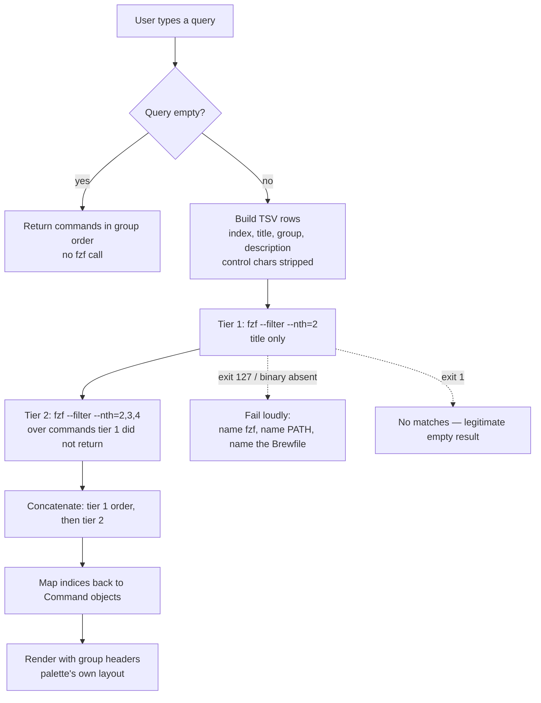

# fix: Six verified defects in the herdr command palette

## Summary

The herdr command palette works, but its fuzzy matcher puts the right command out of first place on 4 of 6 queries a user would naturally type, its main list silently truncates at 24 commands, and three focus workarounds are timing bets rather than synchronization. This plan fixes six defects that were each reproduced on this machine, and builds the test seam that proves the fixes.

Scope is the plugin directory plus its tests. No architectural rewrite: the curses UI, the nine command types, and the TOML config model all stay.

---

## Problem Frame

The command palette is a herdr 0.8.0 plugin. Its source of truth is `home/private_dot_config/herdr/plugins/command-palette/`; the live copy at `~/.config/herdr/plugins/command-palette/` is deployed by chezmoi from a separate clone and is never edited directly.

Three files carry the behavior: `palette.py` (1577 lines, single-file stdlib `curses` TUI), `open.py` (222 lines, the keybinding action that opens the palette pane), `smart_close.py` (93 lines). Commands are declared in `home/private_dot_config/herdr/command-palette/commands.toml` — ten of them today.

Six defects were verified first-hand, each with reproduction evidence. They fall into two groups: **user-visible now** (the matcher), and **latent ceilings or traps** that bite as the command set grows. The palette is about to grow — fourteen feature issues (`docs/issues/2026-08-18-004` through `-017`) are already filed against it — so the latent ones are worth fixing before they are load-bearing.

---

## Requirements

| ID | Requirement |
|---|---|
| R1 | Typing a query ranks the intended command first for the six measured queries (`lg`, `ws`, `edit`, `zed`, `main`, `lazy`). |
| R2 | A query that matches nothing shows no results, rather than every command that happens to be a subsequence. |
| R3 | The main command list reaches every command by keyboard at any command count, with group headers accounted for in the layout. |
| R4 | The palette never types a shell command into a pane an agent owns. |
| R5 | Focus after a command that creates a tab or switches workspace is deterministic, not a timing bet. |
| R6 | Finding an already-open palette cannot be fooled by an unrelated pane that merely mentions `palette.py`. |
| R7 | `--validate` rejects a command that interpolates a form value into a shell string without quoting. |
| R8 | Every fix above is covered by a test that runs against the source tree in a bare checkout, without `chezmoi apply`. |
| R9 | A missing `fzf` produces a loud, named failure — never a silent fallback to a worse matcher. |

---

## Key Technical Decisions

### KTD1. `fzf --filter` is the scorer; the palette keeps the UI

**(session-settled: user-directed — chosen over porting fzf's scoring constants into Python: a fallback would mask a broken deployment of this very repo and create a second, untested code path.)** Governs R1, R2, R9.

fzf 0.74.3 is already installed and already declared in `home/private_dot_config/brewfiles/Brewfile:34`, so this adds no new dependency to the repo — it promotes an existing one from optional to required.

The boundary matters: fzf scores, the palette renders. fzf has no grouping primitive, and the palette already draws group section headers (`normalize_group_order`, `grouped_rows`). Handing fzf the UI would be a regression.

### KTD2. Field weighting is tiered fzf passes, not one `--nth` list

Measured on the real ten commands. `--nth=2` (title only) fixes all six queries. Adding the group column (`--nth=2,3`) **regresses** `edit` — the "Editor" group contributes the letters, so "Open in Zed" displaces "Edit command palette config".

So: match the title first, then run a second pass over the wider fields for commands the first pass did not already return, and concatenate. This is why the fix is not a one-line flag change.

### KTD3. Identity travels as a hidden index column

Rows are `<index>\t<title>\t<group>\t<description>`. `--accept-nth={1}` returns the index, which maps back to the `Command` object. Display and matching stay independent of what is returned.

Any field containing a tab, newline, or carriage return would shift every column after it — verified: a tab inside a field corrupts the parse. Sanitize on the way in.

### KTD4. Exit code 1 from fzf means "no matches", not "failure"

Verified: an empty query returns every row in input order with exit 0 — so the resting list keeps the palette's own group ordering. No match, and empty input, both return exit 1 with empty output.

The palette must distinguish exit 1 (a legitimate empty result) from a missing or broken binary. Conflating them would turn "you typed a typo" into a crash, or worse, hide a broken deployment.

### KTD5. The palette pane is a popup, and that likely removes the focus races

herdr 0.8.0's own API schema declares `PluginPanePlacement` as `["overlay", "popup", "split", "tab", "zoomed"]`, with `width`/`height` as first-class `PopupSize` parameters on `PluginPaneOpenParams`. `open.py:186-192` passes `--placement popup`, legitimately overriding the manifest's `overlay`.

This matters because the documented hazard — herdr killing the pane's whole process group on close, which `nohup` does not escape — is described for **overlay** panes. A plugin that uses popup panes and focuses directly needs no workaround at all. So U7 starts by testing whether the sleeps are load-bearing before replacing them.

Correction to an earlier read: `popup` and the size flags are absent from `herdr plugin pane open --help` on 0.8.0. That is a help-text gap, not a deprecation. The schema is authoritative.

### KTD6. New tests run against the source tree, in their own file

The existing palette tests (`tests/smoke.bats:76-197`) import and execute `palette.py` from the **applied** copy under `$HOME`. On the host that copy is stale until `chezmoi apply`, which this repo forbids running — so those tests cannot verify an uncommitted edit.

`tests/scripts.bats` already uses the better convention: run out of `$SOURCE_ROOT`, which resolves to this checkout's `home/`. New tests follow it.

They go in a **new** `tests/palette.bats` rather than into `smoke.bats`. Cost: the bats runner list is hardcoded in four places (`.github/workflows/test-dotfiles.yml:60` and `:92`, plus both command blocks in `docker/docker-compose.yml`), so a new file must be added to all four. Benefit: the file runs standalone in a bare checkout with no chezmoi apply, which is what makes it usable as this plan's verification gate. The four-line edit is worth a gate that actually runs.

### KTD7. Only the new subprocess gets a timeout

`docs/solutions/design-patterns/external-review-legs-as-unreliable-subprocesses.md` establishes the repo's rule: absence of a well-formed result is failure, never a clean pass. `palette.py` has roughly ten `subprocess.run` call sites and none sets a timeout.

Retrofitting all ten is out of scope here — it is not one of the six defects. The fzf call is new code, so it carries a timeout from the start.

---

## High-Level Technical Design

The scoring path after U3, showing where the hard-dependency check sits and how the two matching tiers combine:

The preflight check runs once at startup rather than per keystroke, so a missing binary is reported before the user types anything.

---

## Scope Boundaries

### In scope

The six defects, the test seam that proves them, and making `fzf` a real dependency of the test environments.

### Deferred to Follow-Up Work

- **Timeouts on the other ~10 `subprocess.run` call sites** in `palette.py`. Real hardening, per the repo's own subprocess learning, but not one of the six defects.
- **`smart_close.py` has a lost executable bit.** It is mode `100755` in git, but chezmoi encodes the exec bit in the filename prefix (`executable_`), so the applied copy is `-rw-r--r--`. Currently harmless: the manifest invokes it as `["python3", "smart_close.py"]`, so the bit is never used. Fixing it means renaming the source file and updating the run-onchange hash trigger.
- **No Python linter, formatter, or type checker exists** in this repo. `make lint` is shellcheck and explicitly excludes `*.py` (`Makefile:47`). Adding one is a separate decision.
- **A `docs/solutions/` entry on shell quoting.** The scout found no learning covering quoting or interpolation despite `palette.py` building `bash -lc` strings; U8's fix is the natural moment to write one, but that is `ce-compound`'s job.

### Out of scope

The fourteen feature issues already filed (`docs/issues/2026-08-18-004` … `-017`), and the three architectural changes: unix-socket transport, collapsing the two rendering stacks into one curses session with modes, and an events-driven warm index. **No defect fix in this plan requires any of them** — U5's agent check needs one field that `herdr pane list` already returns over the CLI.

---

## Assumptions

- The user runs `chezmoi apply` themselves after this lands; nothing here is live until they do.
- Ubuntu CI's Python is 3.10, so `tomllib` is absent and CI already exercises the hand-rolled fallback parser at `palette.py:111-198`. That parser is live insurance for a degraded `PATH`, not dead code, and stays.
- Adding `fzf` to the Ubuntu test image is acceptable. Without it, U3's hard dependency breaks `test-ubuntu`.

---

## Implementation Units

### U1. Add a source-tree test file for the palette

**Goal:** A bats file that exercises the palette out of the checkout, so every later unit has somewhere to prove itself before `chezmoi apply`.

**Requirements:** R8

**Dependencies:** none

**Files:**
- `tests/palette.bats` (new)
- `.github/workflows/test-dotfiles.yml` (add `tests/palette.bats` to the runner lists at `:60` and `:92`)
- `docker/docker-compose.yml` (add it to both the `test-full` and `test-quick` command blocks)

**Approach:**

1. Follow the `tests/scripts.bats` convention: resolve the plugin from `$SOURCE_ROOT/private_dot_config/herdr/plugins/command-palette`, not `$HOME`.
2. `load 'helpers/common'` for the bats-assert/bats-file helpers and `SOURCE_ROOT`.
3. `setup()` skips when `python3` is absent.
4. Seed it with one characterization test per defect area, capturing **current** behavior where the fix has not landed yet, so later units show a real diff.

Leave the existing `tests/smoke.bats:76-197` tests alone. They assert the applied copy, which is a legitimate chezmoi smoke check — a different job from behavior testing.

**Patterns to follow:** `tests/scripts.bats:95` and `:777` for `$SOURCE_ROOT`-based invocation; `tests/scripts.bats:169-197` (`ask_stub_herdr`) for a command-logging fake binary; `tests/smoke.bats:104-126` for monkeypatching `subprocess.run` on an imported module.

**Test scenarios:**
- `palette.py --validate` on a known-good fixture exits 0 and names the command count.
- `palette.py --validate` on a fixture with an unsupported `type` exits non-zero and the output contains `unsupported type`.
- Importing `palette.py` from `$SOURCE_ROOT` succeeds and `load_commands()` returns a non-empty list against a fixture config.
- The file runs green via `bats tests/palette.bats` from the repo root with no `chezmoi apply`.

**Verification:** `bats tests/palette.bats` passes in a bare checkout.

---

### U2. Make fzf available to the test environments

**Goal:** CI and Docker have `fzf`, so U3's hard dependency does not turn `test-ubuntu` red.

**Requirements:** R9

**Dependencies:** U1

**Files:**
- `docker/Dockerfile.ubuntu`
- `.github/workflows/test-dotfiles.yml`
- `tests/smoke.bats` (the `fzf is available (if installed)` test at `:487-491`)

**Approach:**

1. Install `fzf` in the Ubuntu image and in both CI jobs alongside the existing `bats` install.
2. Promote the conditional smoke test: drop `command_exists fzf || skip` so a missing fzf fails rather than skips. It is a hard dependency now, and a skipping test would hide exactly the deployment breakage KTD1 exists to surface.
3. Leave `Brewfile:34` as is — the declaration is already correct.

**Execution note:** Land and verify this before U3. If CI cannot get fzf, that changes U3's design and is better known now than after the scorer is rewritten.

**Test scenarios:**
- `command -v fzf` succeeds inside `make shell-ubuntu`.
- The promoted smoke test fails (not skips) when `fzf` is removed from `PATH`.
- `make test-ubuntu` is green.

**Verification:** `make test-ubuntu` passes with the promoted test.

---

### U3. Replace the fuzzy scorer with fzf (DEFECT 1)

**Goal:** The intended command ranks first, and a non-match returns nothing.

**Requirements:** R1, R2, R9

**Dependencies:** U1, U2

**Files:**
- `home/private_dot_config/herdr/plugins/command-palette/palette.py`
- `tests/palette.bats`

**Approach:**

1. **Preflight, once at startup.** Resolve `fzf` and fail loudly if absent. Follow the repo's established hard-dependency idiom (`home/private_dot_claude/skills/herdr-pair/scripts/spawn-partner.sh:37`): message to stderr naming the script and the missing binary, non-zero exit. The message must name three things — that `fzf` is required, that it is declared in `home/private_dot_config/brewfiles/Brewfile`, and that a degraded `PATH` can hide an installed binary. That last one is not hypothetical: `fzf` lives in `/opt/homebrew/bin` and is absent from a `/usr/bin:/bin` PATH, the same fragility that decides which Python the plugin gets.
2. **Replace `fuzzy_score` and `ranked`.** Build TSV rows per KTD3, stripping tab/newline/carriage-return from every field. Run the two tiers from KTD2. Map returned indices back to `Command` objects.
3. **Handle exit codes per KTD4:** 0 with output is matches, 1 is no matches, anything else is a failure that surfaces rather than degrading.
4. **Keep the empty-query path free of fzf** — return commands in group order directly.
5. Pass a timeout on the fzf call (KTD7).
6. `Command.search_text` (`palette.py:49-51`) is superseded by the tiered fields. Remove it, or reduce it to the tier-2 haystack — do not leave both a live blob and a tiered path.

Grouping, rendering, and the `select`/`form` sub-pickers are untouched. `visible_choices` (`palette.py:1001-1008`) also calls `fuzzy_score` — route it through the same scorer so the two lists rank consistently.

**Patterns to follow:** `spawn-partner.sh:37` for the loud-failure shape; `ask.sh:61-69` for probing a capability rather than mere presence.

**Test scenarios:**
- Each of `lg`, `ws`, `edit`, `zed`, `main`, `lazy` against the real `commands.toml` ranks the expected command first. These are the six measured queries; `lg`, `ws`, `edit` and `main` currently fail.
- `zed` returns exactly one command, not ten.
- A query matching nothing returns an empty list, and the palette shows "No matching commands" rather than erroring.
- An empty query returns every command in group order, unchanged from today.
- A command whose title contains a literal tab does not corrupt the mapping — the returned command is still the right one.
- With a stub `fzf` on `PATH` that exits 127, the palette exits non-zero and the output names `fzf` and the Brewfile. Pin the wording with `assert_output --partial`, per `docs/solutions/design-patterns/completion-is-not-a-verdict.md` guidance 6.
- `visible_choices` ranks a `select` command's options through the same scorer.

**Verification:** All six queries rank correctly; the missing-fzf test asserts both the exit code and the message text.

---

### U4. Scroll the main command list (DEFECT 2)

**Goal:** Every command is reachable by keyboard regardless of how many exist.

**Requirements:** R3

**Dependencies:** U1

**Files:**
- `home/private_dot_config/herdr/plugins/command-palette/palette.py`
- `tests/palette.bats`

**Approach:**

`curses_scroll_window` (`palette.py:690-699`) already exists and is used by the workspace picker (`:894`) and the choice picker (`:1070`). The main list at `render_curses_palette` (`:702-789`) does not call it — it hard-truncates via `result_limit_for_rows` (`:386`) instead.

1. Call `curses_scroll_window` from the main list, as the other two pickers do.
2. Count the limit in **display rows**, not commands. `grouped_rows` inserts a header per group, and today those headers are not counted — which is why content lands on the footer line.
3. Keep the selected row inside the visible window when scrolling.

Measured today at the real popup height of 34 rows: 40 commands in 8 groups truncate to 24 commands, produce 29 display rows, and put the last row on `y=31` — exactly where the description line draws.

**Test scenarios:**
- With 40 commands across 8 groups at 34 rows, every command is reachable by repeated "down" from the top.
- The last rendered row never overlaps the description line or the footer.
- The selected index stays within the visible window after scrolling past the bottom.
- With 10 commands (today's real count) the rendering is unchanged — no regression to the current view.
- A single group with no headers still scrolls correctly.

**Verification:** The reachability scenario passes at 40 commands; the 10-command rendering is byte-identical to before.

---

### U5. Refuse `pane_run` into a pane an agent owns (DEFECT 4)

**Goal:** The palette never submits a shell line as a prompt to someone's agent.

**Requirements:** R4

**Dependencies:** U1

**Files:**
- `home/private_dot_config/herdr/plugins/command-palette/palette.py`
- `tests/palette.bats`

**Approach:**

`herdr pane run <pane> <cmd>` types the line into the pane. When an agent owns that pane, herdr submits it as a prompt. Our `Edit command palette config` command is `type = "pane_run"` and has no guard.

1. Before running, read the target pane's `agent` field. `herdr pane list` already returns it — verified live, panes carry `agent` and `agent_status` alongside `label`.
2. When `agent` is non-empty, refuse: do not run, and raise `herdr notification show` explaining why, naming the pane and the agent.
3. Keep the check to `pane_run` only. `tab_run` creates a fresh pane and is unaffected.

This needs no socket client — one CLI call returns the field.

**Patterns to follow:** `speardragon/herdr-command-center` `src/executor.mjs:72-91` refuses and notifies rather than failing silently.

**Test scenarios:**
- With a stub `herdr` reporting the target pane as `agent=claude`, `pane_run` does not issue `pane run`, and a `notification show` is issued.
- With a stub reporting `agent` empty or absent, `pane_run` issues `pane run` exactly as today.
- The refusal message names the pane id and the agent.
- A `tab_run` command is unaffected by the guard.
- When the pane lookup itself fails, the palette reports that rather than assuming the pane is free — absence of a well-formed answer is not a clean pass, per `docs/solutions/design-patterns/external-review-legs-as-unreliable-subprocesses.md`.

**Verification:** Both stub cases behave as specified, asserted against the stub's command log.

---

### U6. Find an open palette by label, not by grepping argv (DEFECT 5)

**Goal:** The re-entry guard cannot be fooled by an unrelated pane.

**Requirements:** R6

**Dependencies:** U1

**Files:**
- `home/private_dot_config/herdr/plugins/command-palette/open.py`
- `home/private_dot_config/herdr/plugins/command-palette/herdr-plugin.toml` (only if the pane needs an explicit label)
- `tests/palette.bats`

**Approach:**

`process_is_palette` (`open.py:84-90`) substring-matches `palette.py` against a pane's combined argv, cmdline and cwd — unanchored and unbounded. An editor with the file open, a grep over it, or an agent discussing it all match. `workspace_palette_pane` (`:123-136`) then calls `herdr pane process-info` once per pane to feed it.

1. Replace both with a single `herdr pane list --workspace <ws>` filtered on the pane `label`. Panes carry `label` — verified live.
2. Confirm the palette's popup pane actually receives a distinguishable label from the manifest's `title`. If not, set one explicitly rather than inferring.
3. On the reveal path, `herdr pane zoom <id> --on` focuses and maximizes atomically — verified present in 0.8.0 — so no separate focus call is needed.

Do not delete the guard outright. A sibling plugin relies on herdr's popup panes being session-modal to prevent stacking, but that is its claim about `min_herdr_version = "0.7.4"`, not something verified here. Keeping a cheap correct guard is better than betting on modality.

**Test scenarios:**
- A stub `herdr` returning a pane labelled as the palette causes `open.py` to focus it instead of opening a second one.
- A stub returning a pane whose *command line mentions* `palette.py` but whose label is different does **not** match — this is the defect, and it must fail before the fix.
- With no palette pane present, `open.py` opens one.
- The fix issues one `pane list` call and zero `pane process-info` calls.

**Verification:** The false-positive scenario fails against current code and passes after.

---

### U7. Remove the sleep-based focus races (DEFECT 3)

**Goal:** Focus is sequenced, not timed.

**Requirements:** R5

**Dependencies:** U1, U6

**Files:**
- `home/private_dot_config/herdr/plugins/command-palette/palette.py`
- `home/private_dot_config/herdr/command-palette/commands.toml`
- `tests/palette.bats`

**Approach:**

Three sleeps with three different constants: `palette.py:966-976` (0.2 s, workspace picker), `palette.py:1450-1462` (0.2 s, `tab_run`), `commands.toml:15` (0.4 s, the lazygit popup).

**Start by testing whether they are load-bearing at all.** Per KTD5, the palette pane is a popup, and the documented process-group hazard is described for overlay panes. Remove one sleep, apply, and try the command. If focus lands correctly, the rest are removable too and this unit is nearly free.

If the race is real, apply one fix consistently to all three:
- **(a)** Focus synchronously, then close the pane explicitly via `herdr pane close $HERDR_PANE_ID`.
- **(b)** Focus after the TUI is torn down and immediately before process exit.

Prefer (b) for `palette.py` — it needs no new herdr call and matches the existing `curses.wrapper` teardown, which already ends before `run_command` executes. Use (a) for the `commands.toml` lazygit entry, which is a shell command with no TUI to tear down.

Do not plan around `herdr wait`: it does not exist as a command in herdr 0.8.0. `herdr agent wait --until <status>` exists but waits on agent status, not focus readiness.

**Execution note:** This unit's first action is an experiment, not an edit. Record what the experiment showed in the commit message — a future reader needs to know whether popups race.

**Test scenarios:**
- `tab_run` issues `tab create --no-focus`, then `pane run`, then `tab focus`, in that order, with no detached `bash -lc` and no `sleep` in the issued commands.
- The workspace picker issues `workspace focus` directly.
- No `sleep` remains in `palette.py` or in `commands.toml`.
- Manual: run `Lazygit in new tab` and confirm focus lands on the new tab. Manual: run `Switch workspace` and confirm the chosen workspace focuses. These need a live herdr and cannot be automated here.

**Verification:** Automated scenarios assert the issued command sequence against the stub log; the two manual checks confirm real focus behavior.

---

### U8. Reject unquoted `{value}` in shell commands, and drop dead code (DEFECT 6)

**Goal:** A form value containing a space or a quote cannot silently break the command it feeds.

**Requirements:** R7

**Dependencies:** U1

**Files:**
- `home/private_dot_config/herdr/plugins/command-palette/palette.py`
- `home/private_dot_config/herdr/plugins/command-palette/README.md`
- `tests/palette.bats`

**Approach:**

Reproduced: a form value of `a; touch /tmp/PWNED #` expands into `echo a; touch /tmp/PWNED #` when the author writes `{value}`; `{value_q}` quotes it correctly. `validate_command_raw` (`:250-271`) accepts the bare form.

1. In the validator, reject a bare `{value}` interpolated into a shell-bearing command type (`shell`, `overlay_shell`, `pane_run`, `tab_run`) with a message naming `{value_q}` as the fix. `{value_url}` stays valid — it is already escaped for its context.
2. Fix the one real occurrence if `commands.toml` has any. The Google-search example in `README.md:119` already uses `{value_url}` correctly; check the rest of the README's examples and correct any that model the unsafe form.
3. Delete `is_up_key` and `is_down_key` (`palette.py:1236-1245`) — defined, never called.

The stronger fix — passing values only as environment variables so interpolation is structurally impossible — is a schema change affecting every existing `select` and `form` command. It is the right long-term shape and belongs in its own issue, not here.

**Test scenarios:**
- `--validate` on a `form` command with `command = "echo {value}"` exits non-zero and the message names `{value_q}`.
- `--validate` on the same command with `{value_q}` exits 0.
- `--validate` on a `form` command with `{value_url}` exits 0.
- A bare `{value}` in a non-shell type (`herdr` argv array) is still accepted — argv entries are not shell-parsed.
- The real `commands.toml` still validates clean.
- `grep` finds no reference to `is_up_key` or `is_down_key` after removal.

**Verification:** `python3 palette.py --validate` on the real config exits 0; both unsafe fixtures are rejected with the named message.

---

## Verification Contract

| Gate | Command | Covers |
|---|---|---|
| Syntax | `python3 -m py_compile` on the three plugin files | U3, U4, U5, U6, U7, U8 |
| Behavior | `bats tests/palette.bats` | U1, U3, U4, U5, U6, U7, U8 |
| Shell lint | `make lint` | U2 |
| Full suite | `make test-ubuntu` | U2, and regression across the repo |
| Chezmoi dry-run | `make test-local` | every file edit under `home/` |
| Manual | Open the palette; run `Lazygit in new tab` and `Switch workspace` | U7 |

**Never run `chezmoi apply` on the host.** Use `make test-local` for a diff or `make test-ubuntu` for a real apply inside Docker.

---

## Risks

- **U7's experiment may be inconclusive** if focus behavior varies with workspace state. If two runs disagree, keep the sleeps and say so rather than removing them on a hunch — a flaky focus bug is worse than a 0.2 s delay.
- **U3 changes ranking for every query, not just the six measured.** The six are the acceptance bar, not the whole surface. Expect to use the palette for a day before trusting it.
- **The new bats file must be added to four runner lists.** Miss one and the tests pass locally while CI never runs them — the failure mode is silent.
- **Ubuntu CI Python is 3.10**, so `tomllib` is absent and the fallback TOML parser runs there. A test that assumes real TOML semantics will silently exercise the other parser. Pin both paths where it matters.

---

## Definition of Done

- All six defects have a test in `tests/palette.bats` that fails against current code and passes after the fix.
- The six measured queries rank the intended command first.
- No `sleep` remains in `palette.py` or `commands.toml`, or the plan records why one had to stay.
- A missing `fzf` produces a named, non-zero failure, and that message is pinned by a test.
- `make test-ubuntu` is green, with `tests/palette.bats` in all four runner lists.
- `make test-local` shows only the intended diff.
- Committed directly to `main`.

---

## Open Questions

- **Are the three sleeps load-bearing on a popup pane?** (deferred — U7's first action answers it by experiment; the unit is written to handle both outcomes.)
- **Does the palette's popup pane carry a distinguishable `label` today?** (deferred — U6 checks and sets one if not.)
- **Should the environment-variable-only value protocol replace `{value}` entirely?** (deferred — a schema change touching every `select` and `form` command; belongs in its own issue.)

---

## Sources

- Defect reproductions, live API probes, and comparative research: this session's investigation of 16 herdr plugins, published at the command-palette review artifact.
- `docs/solutions/design-patterns/external-review-legs-as-unreliable-subprocesses.md` — default-dead subprocess handling, fail closed on missing results.
- `docs/solutions/design-patterns/completion-is-not-a-verdict.md` — guidance 6: pin user-facing wording with a test.
- Related issues: `docs/issues/2026-08-18-004` … `-017` (feature work deliberately excluded from this plan).
