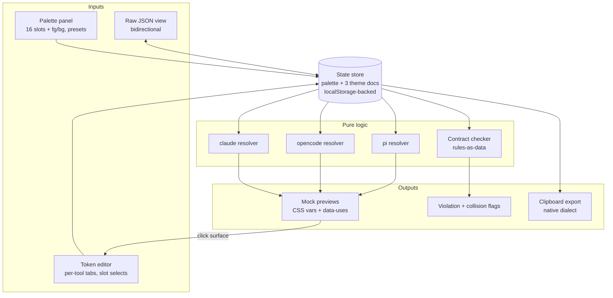

# Terminal Theme Playground - Plan

**Target repo:** a new repository `terminal-theme-playground` (GitHub, Seigiard account). All file paths below are relative to that new repo unless prefixed with `my-mac-setup/`. This plan document lives in `my-mac-setup` for traceability; the deliverable does not.

---

## Goal Capsule

- **Objective:** a designer of slot-referencing TUI themes can see, in a browser, how Claude Code, opencode, and pi render under any 16-color terminal palette, change token→slot assignments with live feedback, and copy back a theme file in each tool's exact native dialect — replacing the current guess → commit → apply → look loop.
- **Means:** a static no-build web page in a separate repo, deployed on GitHub Pages, with three re-implemented theme resolvers driving mock TUI previews (KTD1, KTD2).
- **Authority:** this plan's Product Contract governs behavior; the origin brainstorm (`my-mac-setup/docs/brainstorms/2026-08-20-terminal-theme-playground.md`) is background, not an override. Repo conventions of the new repo are set by this plan.
- **Stop conditions:** stop and surface if opencode's `system` theme generation cannot be reproduced from its source — that invalidates KTD5 rather than being an implementation detail. (The parallel risk for Claude Code was checked during planning and cleared; see KTD4.)
- **Execution profile:** greenfield; no existing users; no migration concerns. Verification is unit tests for pure logic plus a manual fidelity checklist against the real tools.

---

## Product Contract

### Summary

Build a static browser playground in a new repo: a palette panel (16 ANSI slots + default fg/bg, presets vendored from my-mac-setup) on one side, per-tool tabs (Claude Code, opencode, pi) on the other. Each tab edits that tool's native theme JSON token by token via palette-slot selects, renders a mock of the tool's interface live through a re-implemented resolver, and exports the theme via copy-to-clipboard. Contract violations (baked hex) are flagged with the same rules my-mac-setup's bats tests enforce.

### Problem Frame

my-mac-setup holds TUI themes under a palette-only contract: themes reference terminal ANSI slots, never baked hex, so every tool follows the terminal scheme automatically. The contract is enforced only syntactically (bats tests); nothing shows what a theme *looks like* under a given palette, and picking a slot for a token is blind guessing. The pi theme drifted into hex exactly this way (issue `my-mac-setup/docs/issues/2026-08-20-003-pi-terminal-theme-hex-vars-red-test.md`), and the specific trap — Alabaster's slot 7 equals its background — was invisible until a test went red. The playground is the "eyes" half of the contract; the bats tests remain the enforcement half.

### Key Decisions

- KD1. **Separate repo with static deploy** (session-settled: user-directed — chosen over hosting the page inside my-mac-setup: the playground is a standalone public tool, not a dotfile). Governs R19, R20.
- KD2. **Per-tool native-JSON editing with a live emulated interface** (session-settled: user-directed — chosen over a canonical role-map + generator (brainstorm Option B): the intended interaction is per-tool — open a tool's tab, edit its own theme file, watch that tool's mock re-render). Governs R6, R7, R10.
- KD3. **v1 tool set is Claude Code, opencode, pi; herdr postponed** (session-settled: user-directed — chosen over including herdr: its theme colors are UI chrome, and the repo-side migration to herdr's `terminal` theme is a my-mac-setup decision, not a playground one). Governs R6.
- KD4. **Export is copy-to-clipboard per tool only** (session-settled: user-directed — chosen over chezmoi integration, file writing, or bundle download: the user applies the JSON manually). Governs R18.

### Requirements

**Palette panel**

- R1. The palette panel edits 16 ANSI slots plus default foreground and background, each as a color swatch with a hex input.
- R2. Preset dropdown offers Alabaster and Flexoki Light, vendored from my-mac-setup's kitty confs; selecting a preset replaces all 18 colors.
- R3. Any palette change re-renders all three tool previews live.
- R4. Collision indicators: a slot whose color equals the background (or another slot) is visibly flagged in the palette panel, and any token currently resolving to the background color is flagged in the token editor. (On Alabaster, slots 7 and 15 both equal the background — the trap behind the original pi bug.)

**Token editors**

- R5. State persists in `localStorage` (palette, per-tool edits, active tab); an explicit reset control returns everything to vendored seeds after a confirmation step (reset destroys all edits).
- R6. One tab per tool — Claude Code, opencode, pi — each seeded with vendored theme data (see KTD3–KTD5 for sources).
- R7. Each token row shows the token name, a human hint of what it colors, and a select of palette slots 0–15 plus "terminal default"; a hex escape hatch exists and visibly marks the token as breaking the contract.
- R8. Contract-violation rules match my-mac-setup's bats assertions exactly: for pi, every `vars` value must be an integer 0–15, no `colors` value may start with `#`, and `colors.text` / `colors.userMessageBg` must stay `""` (terminal default); for Claude Code, every `overrides` value must start with `ansi:` and `base` must be an ANSI base (`light-ansi` or `dark-ansi` — the bats test pins `light-ansi` for the vendored seed; a non-ANSI base bakes hex). The bats name pin (pi `.name == "terminal"`) is seed metadata preserved by export, not a live-checked rule. Violations are flagged live, per token and per tab.
- R9. Value fidelity: values legal in a dialect but outside the select's set — `ansi256(n)`, `rgb()`, integers 16–255, `none`/`transparent`, opencode `{dark, light}` variants — load and display without corruption. Editing such a token through the select replaces its value; loading alone never rewrites it. Replacing an opencode `{dark, light}` value via the select shows an inline warning that both variants are being collapsed to one value.
- R10. A raw-JSON view per tab mirrors state bidirectionally. A paste that is syntactically invalid or fails the dialect's schema is rejected whole with a visible error; the previous state stays intact.
- R11. pi's var indirection is edited at the var level: changing a var-backed token moves the shared var, the UI lists every token that co-moves (11 tokens share `mutedText` in the current seed), and an explicit "detach to literal" action forks a token off its var. Export preserves the file's `vars`/`colors` structure.
- R12. The Claude Code tab shows the full token set with base values (vendored `light-ansi` base) and overrides visually distinguished; export emits the minimal `{name, base, overrides}` diff, not a flattened token dump.
- R13. The opencode tab seeds from a vendored slot-referencing starter theme derived from opencode's own `system`-theme generation; v1 edits emit plain single values (no `{dark, light}` split — slot references are mode-agnostic by design).

**Previews**

- R14. Each tool's mock preview renders by resolving the tab's theme against the current palette with a re-implemented resolver of that tool's real dialect: Claude Code (`ansi:<name>`, `ansi256(n)`, hex, `rgb()`, base+overrides), opencode (bare ints with 0–15 palette / 16–231 cube / 232–255 ramp, `none`/`transparent`, `defs` refs), pi (ints, `""` = terminal default, var refs).
- R15. Clicking a preview surface highlights the token(s) that color it and scrolls the editor to them (claude-theme-builder's `data-uses` technique).
- R16. Mock fidelity covers the surfaces where color choices bite: user/assistant message, tool-call box (pending/success/error), diff hunk, markdown block, syntax-highlighted code, borders/muted/dim hierarchy. Pixel-perfect chrome is out of scope.
- R17. Previews paint on the palette's own background/foreground; the page chrome around them stays neutral and palette-independent.

**Export and deploy**

- R18. Per-tool export copies the theme JSON to the clipboard in the exact native dialect; when contract-breaking values are present the export warns first; a successful copy shows a visible "Copied" confirmation; on clipboard failure a selectable text fallback appears.
- R19. The page is fully static and self-contained: no runtime requests to external hosts, works offline once loaded.
- R20. Deployed to GitHub Pages by a workflow on push to the default branch.

### Scope Boundaries

**Deferred to follow-up work**

- herdr pane (KD3) — and the separate my-mac-setup decision to migrate herdr from `rose-pine-dawn` to its built-in `terminal` theme stays filed in my-mac-setup's `docs/issues/`.
- Option B (canonical role map + generator) — the resolvers and mocks built here carry over if drift ever justifies it.
- base16-YAML palette import, URL-shareable state, mobile/small-viewport layout.
- Any live sync with my-mac-setup — vendored data drifts by design and is refreshed manually (KTD3).

**Outside this product's identity**

- Writing files or applying themes to a machine (KD4); managing terminal emulator configs; being a general color-scheme gallery (base16/Tinted Gallery already exist for hex-baking workflows).

### Sources

- Origin brainstorm: `my-mac-setup/docs/brainstorms/2026-08-20-terminal-theme-playground.md` — dialect grammar table verified against official docs mid-2026; prior-art analysis.
- `RandolfTjandra/claude-theme-builder` (MIT) — 57-token Claude Code schema reverse-engineered from the binary; CSS-custom-property mock; `data-uses` mapping. Port target for KTD4 and R15.
- `kkugot/opencode-theme-studio` (MIT) — re-implementation of opencode's resolver (`src/domain/opencode/resolveTheme.ts`) and preview-to-token map (`PreviewSurface.tsx`). Port target for the opencode resolver and mock.
- pi theme docs (`pi.dev/docs/latest/themes`) — full 51-token table with per-token purpose; `theme-schema.json` (pinned v0.84.2 in the seed's `$schema`).
- Vendoring sources in my-mac-setup @ `39ea84c`: `home/private_dot_claude/themes/light-ansi-daltonized.json`, `home/dot_pi/agent/themes/terminal.json`, `home/private_dot_config/kitty/Alabaster.conf`, `home/private_dot_config/kitty/flexoki-light.conf` (both conf files carry active `color0`–`color15` + fg/bg lines; Flexoki is inactive on the machine only because its `include` line in `kitty.conf` is commented out — the data itself is directly parseable).
- Contract rules: `my-mac-setup/tests/scripts.bats` ("Pi terminal theme uses only terminal palette colors", "Claude Code daltonized theme extends light ANSI with terminal colors").

---

## Planning Contract

### Key Technical Decisions

- KTD1. **Hosting: GitHub Pages** (session-settled: user-approved — chosen over Cloudflare Pages: the repo lives on GitHub anyway, deploy is one workflow, no extra account; CF's branch previews are not needed for a single-page tool). Governs R20.
- KTD2. **No-build multi-file layout: plain ES modules** (session-settled: user-approved — chosen over a literal single `index.html`: three tools of resolvers, mocks, and vendored data would exceed ~3–4k lines in one file; ES modules stay static, need no bundler, and deploy identically). No framework, no TypeScript, no package dependencies at runtime.
- KTD3. **Seed data is vendored, one-time, with source-commit notes** (session-settled: user-approved — chosen over runtime fetch from raw.githubusercontent: fetch breaks offline/self-containment and couples the page to another repo's layout). Every vendored file carries a header noting its source path and commit (`my-mac-setup@39ea84c`, tool version for token lists). Drift is an accepted, documented risk; refresh is manual.
- KTD4. **Claude Code base values come from claude-theme-builder's reverse-engineered map**, vendored as data together with the token list and a written-down `ansi:<name>` → slot 0–15 table (the mapping is stated once in data, never assumed per-surface). Verified during planning: `CTB.RAW_BASES` in claude-theme-builder's `index.html` carries complete `light-ansi` and `dark-ansi` bases whose values are `ansi:<name>` references (slot identity preserved, not normalized hex), with a self-check asserting all keys are covered. The seed overrides file (14 tokens) layers on top.
- KTD5. **opencode seed derives from opencode's `system`-theme generation** (`packages/tui/src/theme` in the opencode source): the vendored starter theme assigns each opencode token the same ANSI slot the real `system` theme computes from the terminal palette. This gives the tab a real slot-referencing starting point despite my-mac-setup shipping zero opencode theme tokens.
- KTD6. **Resolvers are pure functions**: `(themeDoc, palette) → {token: cssColor}`. No DOM access, no globals. This makes them unit-testable with `node --test` (zero dev dependencies) and portable if Option B ever happens.
- KTD7. **Previews are DOM mocks skinned by CSS custom properties**: each resolver output is applied as `--<tool>-<token>` variables on the preview root; mock markup declares its tokens via `data-uses` attributes (claude-theme-builder's proven pattern). Re-render on change is a variable update, not a DOM rebuild.
- KTD8. **Contract rules are encoded as data, per tool** (predicate list mirroring the bats assertions in R8), evaluated by one checker used by both the token-row flags and the export warning — one owner, no rule drift between UI surfaces.

### Risks & Dependencies

- **Mock drift** (inherited from the origin brainstorm): token lists move with tool versions — pi's schema is versioned via `$schema`; Claude's list is reverse-engineered; opencode's TS type omits `number` from `ColorValue` although the runtime accepts it. Mitigation: KTD3's version-noted vendoring; my-mac-setup's bats tests stay the contract's enforcement — the playground is only eyes.
- **opencode `system`-theme derivation** (KTD5) is the one unverified vendor source; the Goal Capsule carries it as the sole stop condition. Fallback if the source proves hard to read: seed from an empty `{defs, theme}` doc plus opencode's documented defaults, and note reduced seed fidelity in the README.
- **License compatibility is clear**: both ported repos are MIT; the new repo ships MIT with attribution in the vendored data headers.
- **Vendored palette drift**: if my-mac-setup moves ghostty off a kitty-mirrored theme, the Flexoki preset here silently stops matching the live machine. Accepted per KTD3; the README refresh procedure names the source files to re-check.

### High-Level Technical Design

Directional guidance, not implementation specification.



Data flow: every input mutates the single store; the store notifies resolvers and the checker; resolver output lands as CSS custom properties on the preview roots; the checker output lands as flags in the editor and gates the export warning.

### Output Structure

Proposed layout of the new repo (scope declaration, adjustable during implementation):

```
index.html
css/app.css
js/app.js                      # wiring: store <-> panels <-> previews
js/store.js                    # state + localStorage + reset
js/resolvers/claude.js
js/resolvers/opencode.js
js/resolvers/pi.js
js/contract.js                 # rules-as-data checker (KTD8)
js/ui/palette-panel.js
js/ui/token-editor.js
js/ui/previews/                # one mock per tool, data-uses markup
data/palettes/alabaster.json
data/palettes/flexoki-light.json
data/tokens/claude.js          # 57-token list, light-ansi base, ansi-name->slot map, surface hints
data/tokens/opencode.js        # token list + system-theme slot map
data/tokens/pi.js              # 51-token list + purpose hints
data/seeds/claude.json         # vendored light-ansi-daltonized overrides
data/seeds/pi.json             # vendored terminal.json
data/seeds/opencode.json       # derived system starter (KTD5)
tests/resolvers.test.js
tests/contract.test.js
tests/store.test.js
package.json                   # {"type": "module"} only — lets node --test load ES modules; no dependencies
.github/workflows/deploy.yml
LICENSE                        # MIT, matching the two ported repos
README.md
```

---

## Implementation Units

### U1. Repo scaffold and vendored data

- **Goal:** the new repo exists with all seed data, token maps, license, and CI skeleton — everything later units consume.
- **Requirements:** R2, R6; KTD3, KTD4, KTD5.
- **Dependencies:** none.
- **Files:** `data/palettes/*.json`, `data/tokens/*.js`, `data/seeds/*.json`, `LICENSE`, `README.md`, `.github/workflows/deploy.yml` (workflow lands here, activates in U6).
- **Approach:**
  1. Extract both kitty palettes into JSON — a one-time vendoring step; both conf files carry active color lines (see Sources for the Flexoki include note).
  2. Vendor the pi and Claude seed files verbatim; derive the opencode starter from opencode's `system` generation per KTD5.
  3. Build the three token-map data files: token list, per-token surface hint, Claude's `ansi:<name>`→slot table and `light-ansi` base values (from claude-theme-builder per KTD4), pi's purpose column from the official docs table.
  4. Every vendored file gets a source header: path, commit/version, date.
- **Execution note:** verify the KTD5 source first — it is the plan's one remaining stop condition; everything else in the unit is mechanical (KTD4's source was already verified during planning).
- **Test scenarios:**
  - Vendored Alabaster JSON: slot 7 == slot 15 == background `#f7f7f7` (the collision R4 must later detect is really in the data).
  - Vendored Flexoki JSON carries all 16 colors plus fg/bg from the conf lines.
  - pi seed matches `my-mac-setup` verbatim: all `vars` integers 0–15, `colors.text == ""`.
  - Claude token map: every one of the 16 `ansi:` names maps to a distinct slot 0–15.
- **Verification:** `node --test` passes on data-shape tests; repo pushed to GitHub.

### U2. Resolvers and contract checker

- **Goal:** three pure resolvers and the rules-as-data contract checker, fully unit-tested — the correctness core of the whole tool.
- **Requirements:** R8, R14; KTD6, KTD8.
- **Dependencies:** U1.
- **Files:** `js/resolvers/claude.js`, `js/resolvers/opencode.js`, `js/resolvers/pi.js`, `js/contract.js`, `tests/resolvers.test.js`, `tests/contract.test.js`.
- **Approach:** each resolver takes `(themeDoc, palette)` and returns a flat token→CSS-color map; the checker takes a themeDoc and returns per-token violations. Port opencode resolution semantics from opencode-theme-studio's `resolveTheme.ts`; pi and Claude from their documented grammars.
- **Execution note:** test-first — the dialect grammars are fully known up front, so failing tests per grammar rule are the natural starting point.
- **Test scenarios:**
  - **pi:** var reference resolves through `vars` to a palette color; `""` resolves to terminal default (fg for text tokens); bare int 0–15 → palette slot; int 16–231 → color cube; int 232–255 → grayscale ramp; the real vendored seed resolves with zero unresolved tokens.
  - **Claude:** `ansi:cyan` and `ansi:cyanBright` hit the mapped slots; `ansi256(196)` → cube; hex and `rgb()` pass through; base+override layering — an overridden token wins, a non-overridden token shows the base value; the real vendored seed resolves all ~57 tokens.
  - **opencode:** bare int 0–15 → palette slot; `none`/`transparent` → transparent; `defs` reference resolves; `{dark, light}` variant object survives load and resolves by the declared mode without corruption (R9).
  - **Checker:** pi doc with a hex string in `vars` → violation; pi doc with `#`-value in `colors` → violation; pi doc with non-empty `colors.text` or `colors.userMessageBg` → violation; Claude override not starting with `ansi:` → violation; Claude doc with a non-ANSI `base` (e.g. `light`) → violation; all three vendored seeds → zero violations.
  - **Edge:** unknown token name in a doc → surfaced as a warning, not a crash; palette missing a slot → explicit error.
- **Verification:** `node --test tests/` green; the three vendored seeds resolve cleanly.

### U3. App shell, state store, and palette panel

- **Goal:** the page skeleton with working palette editing, presets, collision flags, and persistent state.
- **Requirements:** R1, R2, R3 (wiring lands in U5), R4 (palette-panel half: slot==bg and slot==slot flags; the token-editor half lands in U4), R5, R17.
- **Dependencies:** U1.
- **Files:** `index.html`, `css/app.css`, `js/app.js`, `js/store.js`, `js/ui/palette-panel.js`, `tests/store.test.js`.
- **Approach:** single store object with subscribe/notify; `localStorage` serialization with a schema-version key; palette panel renders 18 swatches with hex inputs and the preset dropdown; collision computation (slot==bg, slot==slot) lives beside the store so both panel and editor consume it.
- **Test scenarios:**
  - Store round-trips through `localStorage` and restores after reload; corrupted stored JSON falls back to seeds instead of crashing.
  - Reset control returns palette and all three theme docs to vendored seeds.
  - Collision detection: on Alabaster, slots 7 and 15 flag as background-identical; editing slot 7 away clears the flag.
  - Preset switch replaces all 18 colors and marks state dirty.
- **Verification:** `node --test` green for store logic; manual: page loads locally (`python3 -m http.server`), palette edits and preset switching visibly work, flags appear on Alabaster.

### U4. Token editor with raw-JSON view

- **Goal:** the per-tool editing surface — token rows with slot selects, pi var coupling, contract flags, bidirectional JSON.
- **Requirements:** R4 (token-editor half: flag tokens resolving to the background color, consuming U3's collision computation), R6, R7, R8 (display side), R9, R10, R11, R12, R13.
- **Dependencies:** U2, U3.
- **Files:** `js/ui/token-editor.js`, extensions to `js/store.js`.
- **Approach:**
  1. Rows render from the token-map data (name + surface hint) joined with the current theme doc.
  2. pi rows group by owning var; editing a var-backed row edits the var and highlights co-moving rows; a detach action converts the row to a literal (R11).
  3. Claude rows distinguish base-inherited from overridden values; clearing an override reverts to base (R12).
  4. Out-of-select values (R9) render as a labeled read-only chip until the user actively replaces them.
  5. Raw-JSON textarea per tab: parse+validate on apply; reject whole on error with message (R10).
- **Test scenarios:**
  - Editing `mutedText`-backed pi token updates all 11 sibling tokens in the store; detaching one leaves the other 10 coupled.
  - Setting a Claude token via select writes `ansi:<name>`; the contract flag stays green; choosing hex flags the row and the tab.
  - Pasting invalid JSON leaves prior state intact and shows the error; pasting valid JSON with an `ansi256(200)` value preserves it untouched (R9).
  - opencode row edit writes a bare int; a loaded `{dark, light}` value displays as a chip and is only replaced on explicit edit, with the inline collapse warning shown (R9).
  - On Alabaster, a token assigned to slot 7 (background-identical) shows the collision flag on its row; moving it to slot 8 clears the flag (R4, token-editor half).
- **Verification:** `node --test` green for store-level edit semantics; manual: all three tabs editable, flags and coupling visible.

### U5. Mock previews with click-to-token

- **Goal:** three mock TUI layouts rendered through the resolvers, re-skinning live, with surface-to-token navigation.
- **Requirements:** R3, R14 (wiring), R15, R16, R17.
- **Dependencies:** U2, U3 (U4 for scroll-to-token targets).
- **Files:** `js/ui/previews/` (one module per tool), preview markup in `index.html` or template strings, CSS in `css/app.css`.
- **Approach:** port mock structure from claude-theme-builder (Claude) and opencode-theme-studio's `PreviewSurface` (opencode); build pi's from the docs' token-purpose table. Each surface carries `data-uses="token,token"`; resolver output is applied as CSS custom properties on the preview root (KTD7). Preview background/foreground come from the palette (R17).
- **Execution note:** fidelity is judged against the real tools — run each real tool side by side once per mock and adjust; encode findings as comments in the mock markup.
- **Test scenarios:**
  - Test expectation: unit tests none for markup — covered by U2's resolver tests plus a manual fidelity checklist (each R16 surface present per tool; palette preset switch visibly re-skins all three previews; clicking a diff hunk highlights the diff tokens).
- **Verification:** manual checklist above, plus: Alabaster→Flexoki switch changes all three previews without reload; slot-7 text on Alabaster visibly disappears (the trap is demonstrable).

### U6. Export, README, and live deploy

- **Goal:** the tool ships: clipboard export with contract gating, documentation, live GitHub Pages URL.
- **Requirements:** R18, R19, R20.
- **Dependencies:** U4, U5.
- **Files:** export wiring in `js/app.js`, `README.md`, `.github/workflows/deploy.yml` (activation).
- **Approach:** export serializes the tab's theme doc in native shape (pi keeps `vars`/`colors`; Claude keeps minimal `{name, base, overrides}`; opencode emits `{defs, theme}` plus a README note about the `tui.json` selection line). Contract violations trigger a confirm-style warning before copy. Clipboard failure falls back to a selectable textarea. README documents: purpose, vendored-data provenance and refresh procedure, the contract rules, deploy.
- **Test scenarios:**
  - Export of the untouched pi seed byte-matches the vendored file (structure preservation, R11).
  - Export of a Claude doc with one changed token emits only that override delta plus the original 13.
  - A doc with a hex token produces the warning path; a clean doc copies silently.
  - Serialization unit tests run under `node --test`; clipboard UI path is manual.
- **Verification:** `node --test tests/` green; Pages workflow green; the published URL loads with no console errors and no external network requests (DevTools network check, R19).

---

## Verification Contract

| Gate | Command / check | Applies to |
|---|---|---|
| Unit tests | `node --test tests/` (zero dependencies) | U1–U4, U6 |
| Local smoke | `python3 -m http.server` → page loads, no console errors | U3–U6 |
| Fidelity checklist | manual side-by-side with real Claude Code / opencode / pi | U5 |
| Contract parity | the three vendored seeds pass the checker; a hex-injected copy fails it | U2 |
| Deploy | GitHub Pages workflow green; published URL loads offline-capable, zero external requests | U6 |

No CI beyond `node --test` + the deploy workflow is planned; adding lint is a follow-up if the repo grows.

---

## Definition of Done

- All requirements R1–R20 demonstrably work on the published GitHub Pages URL.
- `node --test tests/` passes in CI on the default branch.
- The manual fidelity checklist for the three mocks is written down in the README and has been run once against the real tools.
- Every vendored data file carries its source header (path + commit/version + date).
- README documents purpose, provenance, refresh procedure, and the contract rules.
- No dead-end or experimental code remains in the tree; the repo has exactly the structure the work needs.
- my-mac-setup follow-ups discovered during the work (e.g., opencode custom-theme adoption, herdr `terminal` migration) are filed as issues in `my-mac-setup/docs/issues/`, not fixed inline.
