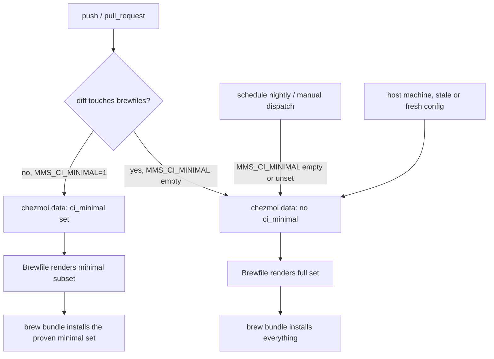

# CI-Minimal Brew Install with Nightly Full Run - Plan

## Goal Capsule

- **Objective:** push/PR CI runs stop installing packages the test suite never uses, cutting the `brew bundle` portion of the `chezmoi apply` step by at least 80% on both jobs, while full-Brewfile installability stays verified on a nightly schedule and on every push or PR that edits a Brewfile. The observed whole-step times were 6 min 42 s (macOS) and 3 min 36 s (Ubuntu); the brew-only share of each is unmeasured, so the target is stated as a reduction of that share rather than as a whole-step wall clock.
- **Means:** a chezmoi template guard in the Brewfiles driven by one environment variable (KTD1), a diff-aware override that restores the full render when a Brewfile changes (KTD5), plus a `schedule` trigger in the existing workflow (KTD3).
- **Authority:** this plan; measured step timings from CI run 32393379268 justify the targets. Those timings are whole-step, single-sample numbers — U0 converts them into a brew-only baseline before any target is treated as a gate.
- **Stop conditions:**
  - If the minimal-render suite run (U2 verification) fails because a test needs a package this plan proposed to guard, keep that package in the minimal set rather than skipping the test.
  - If the proven minimal set no longer clears the Objective's brew-portion targets after fold-backs, stop and report rather than ship the guard — the machinery costs more than the remaining saving.
  - If the `Brewfile.tmpl` rename breaks the `run_onchange` hash trigger in a way the U3 scenario "hash-trigger include paths resolve after the rename" cannot fix, stop and file an issue in `docs/issues/`.

---

## Product Contract

### Summary

Guard the heavy, test-unused entries of both Brewfiles behind a chezmoi template conditional. Push/PR CI sets one environment variable and gets a minimal install — unless the diff touches a Brewfile, in which case the variable stays empty and the full set installs, so the commit that edits a Brewfile is the commit that proves it. A nightly scheduled run installs everything as the backstop for upstream decay. Host machines are unaffected — the default render is the full Brewfile.

### Problem Frame

CI installs the complete Brewfile on every push and PR. Measured on run 32393379268: the macOS `chezmoi apply` step took 6 min 42 s with 64 installs, including GUI casks (Spotify 33 s, TickTick 34 s, two Nerd Fonts, `claude-code`, `ghostty`, and more); the Ubuntu apply took 3 min 36 s with 41 installs (the 37 declared Brewfile formulae plus dependencies), including `ffmpeg` (25 s), `poppler` (37 s), and `grc` (21 s). The post-apply tests never launch these applications — they exercise config files, stub binaries, and a small set of real CLI tools. That install time is the largest single component of the wait between pushing and knowing whether a change is good. Feedback latency is the whole payoff — this repository is public, so GitHub does not meter its standard runners and the saving is worth no money at all. Any framing of this work as a cost reduction is wrong.

On a commit that does not touch a Brewfile, the install buys almost no verification: the same package set installed successfully on the previous commit. On a commit that *does* touch a Brewfile it buys the only proof that exists, and this repo's real Brewfile breakages have all been change-triggered rather than time-decayed — commit 8700137 fixed a `brew bundle` abort after the `rgrc` tap was renamed, and f259b22 fixed a "Refusing to load formula from untrusted tap" error, both in `Brewfile.macos`, both in entries this plan guards. Over the last 180 days, 17 of 420 commits touched `home/private_dot_config/brewfiles/` — about 4%, so the diff-aware exception costs the full install on roughly one commit in 25 and keeps the minimal install on the rest. So the cadence that pays is diff-aware, not purely nightly: full render whenever a Brewfile changes, minimal on everything else, nightly as the backstop for decay that no diff announces (an upstream formula or cask that stops installing on its own).

### Requirements

- R1. On `push` and `pull_request` events other than those R6 covers, each CI job (`test-ubuntu`, `test-macos`) installs only the brew packages that job's tests actually resolve from the brew prefix. The two jobs provision tools differently before the apply, so "what the tests require" resolves to a different set per job and a tool the job already provides outside brew does not force an entry.
- R2. The full Brewfiles (cross-platform and macOS) are installed and the full test suite runs on a nightly schedule, so a formula or cask that stops installing is detected within a day.
- R3. On a host machine (no CI variable set), `chezmoi apply` renders and installs the full Brewfiles exactly as today.
- R4. Template rendering of both modes (minimal and full) is covered by `tests/templates.bats`, so a broken guard fails the fast pre-apply gate rather than the apply step.
- R5. The Docker test path (`make test-ubuntu`, `make test-docker`) keeps installing the full cross-platform Brewfile; this plan does not change its behavior.
- R6. A `push` or `pull_request` event whose diff touches `home/private_dot_config/brewfiles/**` installs the full Brewfiles, so a Brewfile edit keeps its pre-merge installability check instead of waiting for the nightly run.
- R7. A minimal-render run reports the same number of skipped tests as a full-render run. An undersized minimal set must fail the suite, not silently reduce what it covers.

### Scope Boundaries

- **Deferred to Follow-Up Work:** notification channel for nightly failures. The nightly run surfaces failures only through the GitHub Actions UI and GitHub's default failure emails; a dedicated alert (e.g., an issue auto-filed on failure), together with a named owner and a response path for a failed nightly, is a separate piece of work if the default proves too quiet.
- Not in scope: reducing what the Docker image installs (owned by the Docker-baked-Brewfile plan, `docs/plans/2026-08-20-2217-perf-docker-baked-brewfile-plan.md`), bats parallelization, workflow concurrency and caching (each has its own plan of the same date).
- **Landing order — this plan is second of four, and nothing blocks it.** Order settled 2026-08-21 in `docs/issues/2026-08-21-002-perf-plan-landing-order-undecided.md`: the CI-workflow-hygiene plan's `concurrency` block first (no dependencies), then this plan, then the Docker-baked-Brewfile plan, then the CI-workflow-hygiene plan's Homebrew download cache. The parallel-bats plan is order-free.

  Implement this plan as written. The Docker bake does not exist yet, so renaming the Brewfile to `Brewfile.tmpl` breaks no build, and Docker keeps installing the full cross-platform Brewfile per run (R5). **What this plan hands the next one:** `brew bundle` parses a Ruby DSL and raises on Go-template syntax, so after this rename the Docker-baked plan cannot `COPY` the source Brewfile into `brew bundle`. That plan owns the fix — a `chezmoi execute-template` render step and two extra `.dockerignore` allowlist entries — and its Scope Boundaries records it. Do not add Dockerfile work to this plan.

  This plan must land before the CI-workflow-hygiene plan's download cache, per that plan's KTD5: cutting push/PR installs to a handful of packages removes most of the download volume the cache exists to hold.
- Also editing `docker/docker-compose.yml`: the Docker-baked plan (build keys, `test-quick` environment) and the parallel-bats plan (`command` blocks). The edits are field-disjoint from this plan's `MMS_CI_MINIMAL` entry, but re-diff the file if another of the four lands first.

---

## Planning Contract

### Key Technical Decisions

- KTD1. **Template guard inside the existing Brewfiles, not a separate CI Brewfile.** Both Brewfiles become chezmoi templates; entries the tests do not need are wrapped in a conditional on a template variable. (session-settled: user-approved — chosen over a separate `Brewfile.ci`: one source of truth, no subset file to drift out of sync.)
- KTD2. **One variable, plumbed through chezmoi data, read with a missing-key-tolerant lookup.** `home/.chezmoi.yaml.tmpl` gains `ci_minimal`, read from the environment variable `MMS_CI_MINIMAL`. Semantics: any non-empty value selects the minimal render; empty or unset selects the full render. Brewfile templates read the flag as `{{ if not (get . "ci_minimal") }}` (or an equivalent `hasKey` guard), never as a bare `.ci_minimal` reference — `.chezmoi.yaml.tmpl` is evaluated only at `chezmoi init`, so a host config generated before this change has no `ci_minimal` key, and chezmoi's default `missingkey=error` would fail the render. With the tolerant lookup, stale host configs render the full set without re-running `chezmoi init`; CI and Docker re-init fresh every run, so minimal mode still engages there.
- KTD3. **Nightly full run lives in the same workflow file via a `schedule` trigger, not a second workflow.** The jobs are identical except for the one environment variable; a GitHub Actions expression enumerates `push`/`pull_request` positively — those events get `MMS_CI_MINIMAL=1`, every other event (`schedule`, `workflow_dispatch`) gets the empty string, which selects the full render per KTD2. `workflow_dispatch` is added alongside `schedule` so the full-set path is verifiable on demand. Chosen over a separate workflow file: no duplicated job definitions to keep in sync.
- KTD4. **The minimal set is derived from what the tests execute, then proven by running the full suite against it.** (session-settled: user-approved — chosen over hand-picking by intuition: a grep-derived candidate list plus a full-suite verification run catches hidden dependencies.) Starting candidate, from auditing test invocations: `zsh`, `git`, `jq`, `fzf`, `bats-core`, `oven-sh/bun/bun`; everything else guarded. `shellcheck` is **not** a candidate — the real binary comes from apt in the lint job (`.github/workflows/test-dotfiles.yml`, "Install shellcheck"), and `tests/scripts.bats` stubs it for the lint-propagation test while asserting only that the Brewfile *declares* it. The heavy `herdr` and `opencode` reference counts are stub binaries created by the tests themselves — U1 must confirm this before guarding those formulae.

  Invocation counts are evidence only if they are reproducible, so record the command with the numbers. Counting with `grep -o -w '<tool>' tests/*.bats | wc -l` against the current tree gives roughly `jq` 372, `bun` 28, `fzf` 20, `python3` 48 (system Python, not brew), `herdr` 502, `opencode` 62. Earlier drafts of this plan carried 346 / 26 / 19 / 31 / 448 / 49 from an unrecorded counting method; U1 re-runs the command above rather than carrying either set forward.

- KTD5. **A Brewfile-touching diff forces the full render on push and PR.** The workflow computes the diff against the event's base and leaves `MMS_CI_MINIMAL` empty when any path under `home/private_dot_config/brewfiles/` changed, so the commit that edits a Brewfile is the commit that proves it installs. (review-added, 2026-08-21: chosen over nightly-only proof, which would let a broken formula merge to `main` and break every host apply for up to a day. Strike this decision and R6 together if the speed of a Brewfile-editing PR matters more than its pre-merge proof.)
- KTD6. **The minimal set is proven by skip-count parity, not by a passing suite.** This suite's idiom for a missing tool is `command -v <tool> || skip`, not failure, and bats exits 0 on a skipped test. `tests/*.bats` holds 127 skip sites, 88 of them gated on `jq` alone — so "the suite passed on the minimal render" cannot distinguish a correct minimal set from one that silently stopped exercising 88 tests. The proof is that the minimal render produces the same skipped-test count as the full render. (review-added, 2026-08-21: chosen over asserting a required-binary manifest, which duplicates the candidate list in a second place that drifts.)

### Assumptions

- The macOS smoke tests assert config files and CLI availability, not the presence of cask applications. U1 verifies this by grepping `tests/` for cask names; if an assertion on a cask app exists, that test moves behind a nightly-only condition or the cask joins the minimal set.
- GitHub's default notification behavior (email on scheduled-run failure to the repo owner) is an acceptable initial alert channel for R2. Note what this does not cover: a scheduled workflow that never runs produces no failure and therefore no email. GitHub disables `schedule` triggers after 60 days of repository inactivity, so R2's guarantee is silent when it lapses. The repo currently sees ~365 commits per 90 days, so the lapse is unlikely — but nothing in this plan detects it, and `workflow_dispatch` (U4) is the manual recovery.
- A host that once ran `chezmoi init` with `MMS_CI_MINIMAL` set keeps rendering the minimal Brewfile until it re-inits, because KTD2 binds the flag at init time, not at apply time. R3's "no CI variable set" describes apply-time state; the state that actually governs is what was set during the last `chezmoi init`. U3 covers this case with a test, and U2 records the re-init as the recovery.

### High-Level Technical Design

Event-to-render flow:

---

## Implementation Units

### U0. Measure the brew-only share of the apply step

- **Goal:** a number the Objective's target can be checked against. The whole-step apply timings include work the Brewfile guard cannot remove, so without this the speed gate is unfalsifiable — an implementer landing at 70 s has no way to tell success from failure.
- **Requirements:** groundwork for R1's speed target.
- **Dependencies:** none. Runs before U4's verification is meaningful; does not block U1-U3.
- **Files:** none — this unit produces a recorded measurement, written back into this plan's Objective.
- **Approach:**
  1. From a current full-install run, record the wall time of the `brew bundle` invocations inside the `chezmoi apply` step separately from the rest of that step.
  2. Name the non-brew remainder explicitly so it is never mistaken for guard-addressable time: Homebrew bootstrap when absent, the Oh My Zsh clone plus four plugin clones, `mise use --global node@lts`, the fff-mcp download, the smithers `bun install`, and `run_onchange_after_2` through `_7`.
  3. Write both numbers into the Objective in place of "unmeasured", and restate the target as the brew-only reduction.
- **Test scenarios:** `Test expectation: none — a measurement, not code.`
- **Verification:** the Objective states a brew-only baseline and a brew-only target, both traceable to a named run id.

### U1. Derive the minimal package candidate list (audit only)

- **Goal:** a grep-derived candidate list of brew entries the test suite needs. The proof that the list suffices runs after U2 builds the minimal-render mechanism (see U2's verification) — at U1 time no mechanism to install "only the candidate list" exists, because the Docker apply unconditionally brew-bundles the full Brewfile.
- **Requirements:** R1, R4 groundwork.
- **Dependencies:** none.
- **Files:** `tests/` (read-only audit), scratch notes only.
- **Approach:**
  1. Grep `tests/*.bats` and `tests/helpers/` for real binary invocations (direct calls and `run <tool>`), separating them from stub binaries the tests create in temp dirs (`herdr`, `opencode`, and most agent tools are stubs — confirm each).
  2. Grep `tests/` for cask application names and macOS-only formulae (`elio`, `terminal-notifier`, `rgrc`, `linear`) to confirm nothing asserts their presence.
  3. Grep the rendered configs the suite deploys (e.g., the zshrc) for tools invoked indirectly (`starship`, `zoxide` init lines) — the audit alone misses these; the U2 minimal-render suite run is the backstop.
  4. Subtract every tool the run already provides before `chezmoi apply` executes, because a brew copy of it buys nothing. Read the three environments and record the subtraction rather than assuming it: `.github/workflows/test-dotfiles.yml` apt-installs `zsh` and `bats` and installs `fzf` from the upstream tarball and `bun` via `oven-sh/setup-bun` on the Ubuntu job, and runs standalone `brew install bats-core|fzf` steps on the macOS job; `docker/Dockerfile.ubuntu` apt-installs `git` and `zsh` and brew-installs `bats-core`, `fzf`, and `oven-sh/bun/bun`. The Ubuntu job additionally never puts Linuxbrew's prefix on `PATH`, so a Linuxbrew copy of a tool is unreachable there even when installed.
  5. Produce the candidate list, starting from the KTD4 candidate: `zsh`, `git`, `jq`, `fzf`, `bats-core`, `oven-sh/bun/bun`, minus whatever step 4 subtracted per environment.
- **Test scenarios:** none as new test files — this unit's output is the candidate list consumed by U2.
- **Verification:** every real invocation in the audit is classified as stub-provided, run-provided, or brew-provided; every brew-provided one appears in the candidate list; and the subtraction from step 4 is recorded per environment so U2's proof covers the reduced set rather than the pre-subtraction one.

### U2. Template-guard the Brewfiles and plumb the variable

- **Goal:** both Brewfiles render minimal or full based on one chezmoi data variable; hash triggers keep working; the minimal render is proven sufficient by a full-suite Docker run compared on skip count.
- **Requirements:** R1, R3, R5, R7.
- **Dependencies:** U1 (the candidate list).
- **Files:** `home/private_dot_config/brewfiles/Brewfile` → `Brewfile.tmpl`, `home/private_dot_config/brewfiles/Brewfile.macos` → `Brewfile.macos.tmpl`, `home/.chezmoi.yaml.tmpl`, `home/.chezmoiscripts/run_onchange_after_1-install-packages.sh.tmpl`, `docker/docker-compose.yml`, `tests/scripts.bats`, `home/private_dot_config/herdr/plugins/command-palette/palette.py`, `tests/palette.bats`, `home/private_dot_config/herdr/plugins/command-palette/README.md`, `CLAUDE.md`.
- **Approach:**
  1. Add `ci_minimal` to `home/.chezmoi.yaml.tmpl`, read from `MMS_CI_MINIMAL` per KTD2 (non-empty → minimal; empty or unset → full).
  2. Rename both Brewfiles to `.tmpl` and wrap every non-minimal entry (per U1's list) in the KTD2 tolerant-lookup conditional. In `Brewfile.macos.tmpl` the guard covers effectively the whole file; keep per-section guards only if U1 found a needed entry.
  3. Update the two `include` paths inside the hash-trigger comment block of `run_onchange_after_1-install-packages.sh.tmpl` to the new `.tmpl` filenames — this is the gotcha: a stale include path either breaks the apply or silently stops re-running on Brewfile changes.
  4. Track the rename in all six places that hardcode the old **repo** path. Two of them are prose that no test enforces, so a rename that misses them sends the next reader to a file that no longer exists:
     - `tests/scripts.bats:21` — the `shellcheck is managed by the cross-platform Brewfile` assertion reads `$SOURCE_ROOT/private_dot_config/brewfiles/Brewfile`, which ceases to exist.
     - `home/private_dot_config/herdr/plugins/command-palette/palette.py:468` — the repo-path line in the missing-fzf error message.
     - `tests/palette.bats:939` — the matching `assert_output --partial` for that line.
     - `home/private_dot_config/herdr/plugins/command-palette/README.md:119` — same repo path in prose.
     - `CLAUDE.md:73` and `CLAUDE.md:74` — the "where new things go" table, this repo's authority on adding a tool.

     Leave the **deployed** paths alone. `~/.config/brewfiles/Brewfile` is the target path and chezmoi strips the `.tmpl` suffix on apply, so `palette.py:469`, `palette.py:472`, `tests/palette.bats:940`, and `SYNC-TODO.md:76-77` stay correct and must not be rewritten.
  5. Keep the `shellcheck` assertion in `tests/scripts.bats:21` working. It matches the anchored pattern `^brew "shellcheck"`, so the entry must stay column-zero inside the template guard — Go template `{{ if }}` blocks do not indent their body, but a hand-indented entry silently breaks this assertion while everything else still passes.
  6. Pass `MMS_CI_MINIMAL` through in `docker/docker-compose.yml`. Those `environment:` blocks use list syntax, so the entry is `- MMS_CI_MINIMAL=${MMS_CI_MINIMAL:-}` — compose interpolation from the host, defaulting to empty so R5's full-install default is preserved. Add it to the `test-full` and `ubuntu` services; `test-quick` needs it only if it is ever used for install verification. The existing entries are literal `- KEY=value` pairs (e.g. `- CHEZMOI_NAME=Test User`), so this is the one line in the file that reads from the host environment. The minimal render is then exercised as `MMS_CI_MINIMAL=1 docker compose -f docker/docker-compose.yml run --rm test-full`.
- **Patterns to follow:** OS-conditional templating in `home/.chezmoi.yaml.tmpl` (`.is_darwin`/`.is_linux`); the existing left/right delimiter override in the run script.
- **Test scenarios:** covered by U3 (template tests own rendering coverage).
- **Verification:** `make test-local` shows no diff on the host (R3); `chezmoi managed` still lists both deployed Brewfile paths; `make test-ubuntu` with `MMS_CI_MINIMAL` unset still installs the full cross-platform Brewfile (R5). For R1 safety, run the full post-apply suite in Docker twice — once with `MMS_CI_MINIMAL=1` and once unset — and compare bats' skipped-test counts. **Equal skip counts is the pass condition; a passing run is not** (KTD6). Any package whose absence raises the skip count folds back into the minimal set per the stop condition.

### U3. Template tests for both render modes

- **Goal:** a broken guard fails the fast `tests/templates.bats` gate, before any package installs.
- **Requirements:** R4.
- **Dependencies:** U2.
- **Files:** `tests/templates.bats`, `tests/helpers/common.bash` (required, not optional — see below).
- **Approach:** add template-rendering tests for both modes. The variable binds at `chezmoi init` time (KTD2), not at render time — each mode therefore needs its own `chezmoi_test_init()` run with the env var set or unset, rendering via `--config $CHEZMOI_TEST_CONFIG`; re-init back to the default mode after the minimal-mode tests so later tests are not left in minimal state.

  Two properties of the existing helpers make this unit larger than it looks, and both are load-bearing:
  - `chezmoi_test_init()` passes no `--source`, so chezmoi falls back to its default source directory `~/.local/share/chezmoi`. Neither CI job populates that path — both run `chezmoi init --source=./home`, and `tests/templates.bats` is the pre-apply gate that runs before anything else exists. Call it as `chezmoi_test_init --source "$SOURCE_ROOT"` so it resolves the same way every other read in the suite does. Note that `chezmoi_test_init()` has **zero call sites in `tests/` today** — it is defined and never used, so U3 is its first exercise and nothing proves it works in this repo yet.
  - Neither existing render helper can target the test config: `render_template()` runs `chezmoi execute-template` with no `--config`, and `render_with_source()` passes only `--source`. A config-aware render helper in `tests/helpers/common.bash` is therefore required, and every bats file loads that file.

  One open item to settle during implementation: in Docker, `resolve_source_root()` prefers the read-only mount at `/home/testuser/dotfiles`, while the compose services init against the writable copy at `/home/testuser/.local/share/chezmoi`. If `chezmoi init` writes to its source tree, `--source "$SOURCE_ROOT"` fails in Docker and the writable path is the right target instead. Check this on the first Docker run of the new tests.
- **Test scenarios:**
  - With `MMS_CI_MINIMAL=1`, the rendered Brewfile contains `fzf` and `jq` and does not contain `ffmpeg` or `poppler`.
  - With `MMS_CI_MINIMAL=1`, the rendered `Brewfile.macos` contains no `cask` line.
  - With the variable unset, and separately set to the empty string (the state actual schedule runs produce), both rendered files match the full entry set (spot-check `ffmpeg`, `cask "spotify"`).
  - With the variable set to `0`, rendering selects the minimal render — `0` is non-empty, and KTD2 pins non-empty → minimal; assert that.
  - Rendering against a config that lacks the `ci_minimal` key entirely (a pre-change host config) produces the full set without error.
  - Hash-trigger include paths resolve after the rename: the two `include` lines in `run_onchange_after_1-install-packages.sh.tmpl` name `Brewfile.tmpl` and `Brewfile.macos.tmpl`, and the script renders without error. This is the scenario the Goal Capsule's third stop condition points at — U2 step 3 calls the stale include path "the gotcha", and `include` errors on a missing path, so without this test the failure surfaces during apply rather than at the fast gate.
  - A config initialized *with* `MMS_CI_MINIMAL=1` keeps rendering minimal on a later apply that does not set the variable. This pins the init-time binding as intended behavior rather than a surprise, and is the case a contributor hits after reproducing the CI path locally; the recovery is re-running `chezmoi init` without the variable.
- **Verification:** `bats tests/templates.bats` passes locally and in the Docker template run (`make test-templates`).

### U4. Wire the workflow: minimal on push/PR, full on schedule

- **Goal:** CI events select the render mode; a Brewfile-touching diff forces the full set; a nightly run proves the full set on a schedule.
- **Requirements:** R1, R2, R6.
- **Dependencies:** U2, U3.
- **Files:** `.github/workflows/test-dotfiles.yml`.
- **Approach:**
  1. Add `schedule` (one nightly cron) and `workflow_dispatch` to the workflow triggers — the current triggers are `push` and `pull_request` only, so without `workflow_dispatch` the full-set path could not be verified on demand.
  2. Set `MMS_CI_MINIMAL` at workflow `env` level with an expression that enumerates `push`/`pull_request` positively (those get `1`; every other event gets the empty string), per KTD3.
  3. Implement R6's diff-aware override in both jobs: after checkout, a step compares the event's changed paths and clears `MMS_CI_MINIMAL` when any path under `home/private_dot_config/brewfiles/` changed, writing the result to `$GITHUB_ENV` so the later apply step reads it. A step-level `$GITHUB_ENV` write overrides the workflow-level `env` default from step 2. Two mechanics matter: the checkout needs enough history for the diff (`fetch-depth: 0`, or a targeted fetch of the base commit), and the base ref differs by event — `github.event.pull_request.base.sha` on a PR, `github.event.before` on a push. No third-party action is needed; `git diff --name-only <base>...HEAD` is sufficient.
  4. Leave the remaining job steps untouched — the variable does the rest of the switching.
  5. After the change ships and two weeks of runs exist, revisit `timeout-minutes` (currently 15/25) downward; do not lower it in the same change. File this as an issue in `docs/issues/` at implementation time rather than leaving it as a plan note, so it survives the plan being closed.
- **Patterns to follow:** existing workflow `env` block (`CHEZMOI_NAME`, `HOMEBREW_*`).
- **Test scenarios:** `Test expectation: none — CI workflow YAML; verification is observing live runs.`
- **Verification:** the workflow triggers today are `push: branches: [main]` and `pull_request: branches: [main]`, so **the PR run is the only pre-merge gate** — verify there, not on a push run, which happens after merge. On a PR that touches no Brewfile, the apply step installs only the minimal set and the brew portion clears U0's target. On a PR that edits a Brewfile, the apply step installs the full set (R6). A `workflow_dispatch` run, or the first nightly scheduled run, installs the full set and passes. Compare via `gh run view <id> --json jobs`.

---

## Verification Contract

| Gate | Command | Proves |
|---|---|---|
| Template render, both modes | `bats tests/templates.bats` | R3, R4 |
| Skip-count parity on the minimal set | `MMS_CI_MINIMAL=1 docker compose -f docker/docker-compose.yml run --rm test-full`, then the same unset; compare bats skip counts | R1 safety, R7 |
| Docker default unaffected | `make test-ubuntu` with `MMS_CI_MINIMAL` unset | R5 |
| macOS minimal set | the `test-macos` job on the pull-request run, with the minimal render selected | R1 safety on macOS |
| Brewfile-touching diff forces full render | a pull request that edits a Brewfile; confirm the apply step installs the full set | R6 |
| Host no-op | `make test-local` | R3 |
| Lint | `make lint` | run-script edits are clean |
| Brew-only timings | `gh run view <run-id> --json jobs`, brew portion isolated per U0 | R1 speedup, R2 nightly |

Nothing in this table proves the minimal `Brewfile.macos` render before merge except the `test-macos` row, and that matters more than its position suggests: the guard blanks effectively the whole macOS file, the Docker path is Linux, and `Brewfile.macos` is brew-bundled only under `eq .chezmoi.os "darwin"`. Without that row, a macOS-only breakage lands on `main` first.

## Definition of Done

- Push/PR CI apply step installs only the U2-proven minimal set on both jobs; nightly scheduled run installs everything and passes.
- A push or PR whose diff touches a Brewfile installs the full set instead (R6), verified on a real PR.
- The minimal set is proven by equal skip counts against the full render, not by a green suite (R7, KTD6).
- The Objective states a brew-only baseline and target from U0, not a whole-step wall clock.
- Host `chezmoi apply` behavior unchanged (`make test-local` clean before/after); `make test-ubuntu` with the variable unset still installs the full cross-platform Brewfile (R5).
- `tests/templates.bats` covers both render modes, the renamed hash-trigger include paths, and the persisted-minimal-config case.
- All six repo-path references to the old Brewfile names are updated, and the four deployed-path references are left unchanged.
- No leftover experimental guard variants or commented-out Brewfile entries in the diff.

---

## Deferred / Open Questions

### From 2026-08-21 review

Raised by the review, deliberately not resolved in this plan. Each is recorded so it is not rediscovered mid-implementation.

- **Nobody owns a nightly failure.** R2 promises detection within a day; the Scope Boundaries defer the alert channel to follow-up work. Detection and response are different things — a failing scheduled run proves a break exists, not that a maintainer saw it. Decide the owner and response path when the alert channel is built.
- **The hash trigger stops varying by render mode after the rename.** `include` reads raw, unrendered template source, so the `sha256sum` in `run_onchange_after_1-install-packages.sh.tmpl` is identical whether the guard is on or off. Harmless in all three environments that exist today — CI runners and Docker containers re-init from scratch every run, and hosts never set the variable. It would bite a persistent runner toggled between modes.
- **`shellcheck` is declared in the Brewfile but the real binary comes from apt.** This plan drops it from the minimal set on that basis. Whether the Brewfile should still declare a tool no test resolves from brew is a separate question about the Brewfile's purpose, not about CI speed.
- **The speed baseline is a single run.** CI run 32393379268 is n=1, and the workflow's own comments note that brew install times vary. U0 measures the brew-only share but does not add a second sample; runner-to-runner variance stays unquantified.
- ~~Landing order against the three sibling plans.~~ **Settled 2026-08-21** — this plan lands second, ahead of the Docker-baked-Brewfile plan, which then owns the render step. See Scope Boundaries and `docs/issues/2026-08-21-002-perf-plan-landing-order-undecided.md` (closed).
- **Stub-vs-real classification in U1 is manual.** Nothing automates or double-checks which tool invocations in the suite are stub binaries the tests create. The skip-count parity gate (R7) is the backstop, not a substitute for the judgment.

### Review provenance

Reviewed 2026-08-21 by ten independent reads: five local persona reviewers (coherence, feasibility, product-lens, scope-guardian, adversarial), plus two external agents running the same review workflow on separate model families, plus a three-job cross-model pass that did not run. The cross-model pass failed on expired CLI credentials, not on the document. KTD5 and KTD6 are review-added decisions, marked as such at their entries.
