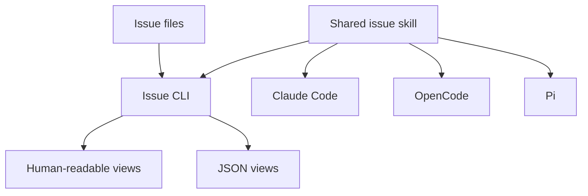
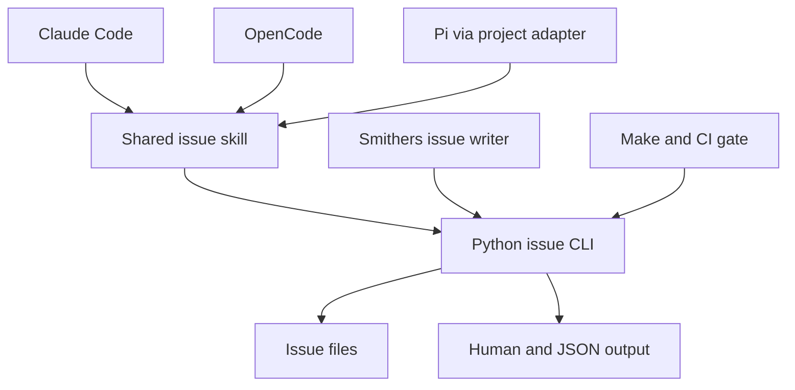
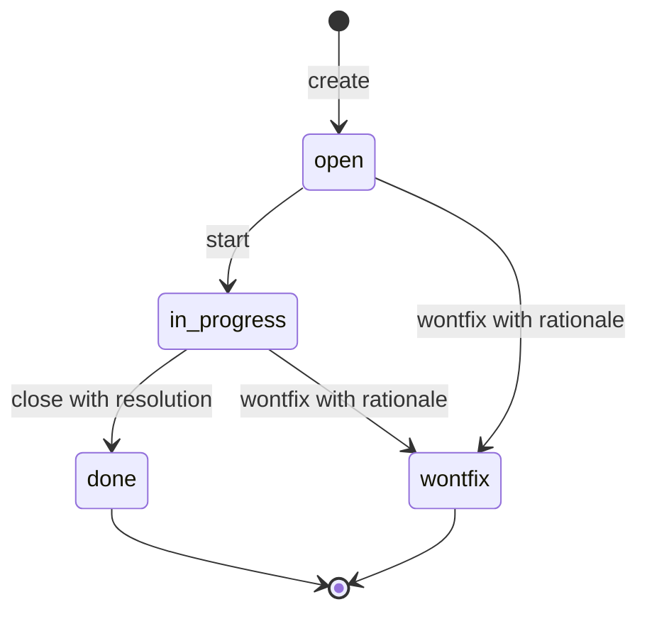
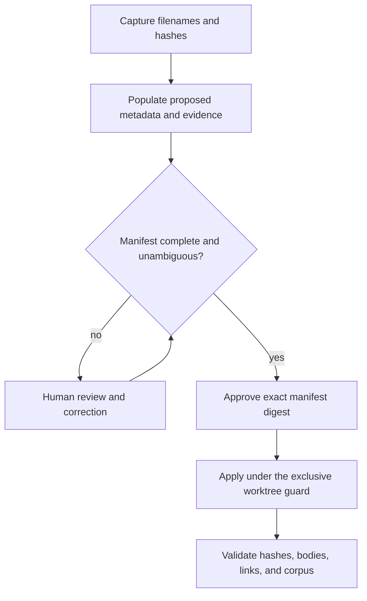
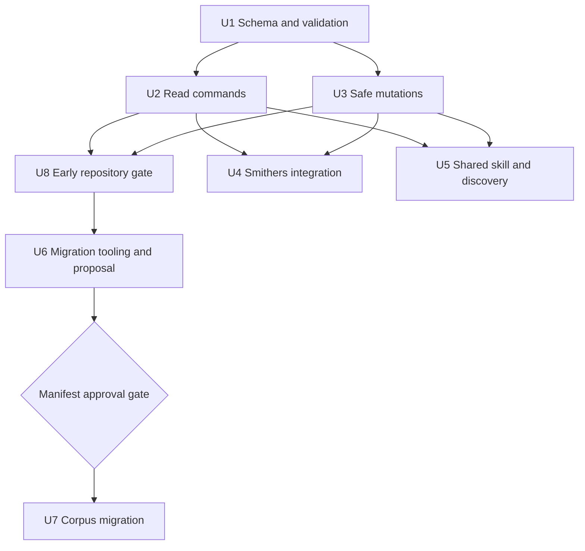

# Repository Issue Management - Plan

## Goal Capsule

- **Objective:** Make `docs/issues/` a reliable, searchable issue tracker that Claude Code, OpenCode, Pi, and humans use through one repository-local contract.
- **Product authority:** This plan defines the issue schema, lifecycle behavior, query behavior, migration expectations, and cross-client experience. Compound Engineering plan files remain governed by their own contract.
- **Open blockers:** None. Implementation details are resolved in the Planning Contract; U6 produces the initial corpus classification for explicit review and approval.
- **Execution profile:** Build the deterministic CLI and its tests before integrating writers, clients, migration, and repository gates.
- **Stop condition:** The first execution run ends after U6 commits the classification manifest. U7 starts only in a second run after the user approves the manifest path, commit, and SHA-256; any stale hash or unresolved classification stops preflight without writes.

---

## Product Contract

### Summary

Implement one Python CLI as the mechanism for all repository issue reads and writes, then expose it through one shared skill discovered by Claude Code, OpenCode, and Pi from the repository root. The migration uses a reviewed, hash-bound manifest and preserves valid Markdown bodies byte-for-byte while adding the approved metadata.

### Problem Frame

`CLAUDE.md` defines the current issue format and tells contributors to query open issues with `rg`, but each agent must still reconstruct creation, filtering, lifecycle, and formatting behavior from prose. Claude Code, OpenCode, and Pi have no shared repository-local issue workflow.

`docs/issues/_open-issues.md` compensates with a hand-maintained grouped snapshot. The repository has already recorded that this snapshot repeatedly drifts from the issue files in `docs/issues/2026-08-21-013-open-issues-index-is-not-a-full-snapshot.md`. Its useful classification and priority information belongs in each issue so deterministic tooling can derive the full view.

### Key Decisions

- **Repository-local ownership:** Keep Markdown files in `docs/issues/` as the source of truth instead of adopting an external tracker or service.
- **One contract across clients:** Claude Code, OpenCode, and Pi load the same skill rather than maintaining client-specific instructions.
- **Skill plus CLI:** The skill explains intent and workflow. The CLI performs deterministic parsing, validation, queries, and lifecycle mutations.
- **Subsystem category:** `category` identifies one controlled subsystem. Cross-cutting concerns belong in `tags`.
- **Separate priority:** `priority` uses `critical`, `high`, `medium`, or `low`. Its impact scale is adapted from the severity scale in `docs/issues/_open-issues.md`.
- **Filename-derived identity:** The complete filename without `.md` is the canonical issue ID. The leading `YYYY-MM-DD-NNN` portion is a compact display ID and may be ambiguous in the legacy corpus.

The source-of-truth relationship is:

### Actors

- A1. **Repository maintainer:** Reviews priorities and categories, searches the backlog, and changes issue state.
- A2. **Coding agent:** Files discovered problems, selects work, reads issue context, and records resolutions.
- A3. **Issue CLI:** Enforces the schema and state transitions and returns deterministic human-readable or machine-readable results.

### Requirements

**Issue contract**

- R1. Every issue has `title`, `short_description`, `type`, `category`, `tags`, `date`, `status`, and `priority` in YAML frontmatter.
- R2. `type` remains one of `bug`, `follow-up`, `idea`, or `chore`; `status` remains one of `open`, `in-progress`, `done`, or `wontfix`.
- R3. `priority` is one of `critical`, `high`, `medium`, or `low`. For an active issue, critical means an immediate break in the working loop or security; high means costly recurring impact; medium means material risk or friction; low means an idea or improvement with no current breakage. A terminal issue retains its last active priority; migration reconstructs that value from the issue history.
- R4. `category` is exactly one controlled subsystem. The initial set is `testing-ci`, `se-pipeline`, `herdr`, `command-palette`, `agent-platform`, `dotfiles`, and `repository-maintenance`. Classification follows the most specific subsystem that owns the likely fix: `command-palette` takes precedence over `herdr`, and `testing-ci` applies only when the test or CI mechanism itself owns the defect.
- R5. `tags` is always present and contains zero or more free-form kebab-case values for concerns that cross subsystem boundaries. An issue with no tags stores an empty list.
- R6. `short_description` is one scalar accepted by the repository's bounded frontmatter grammar and contains a plain-text sentence that can stand alone in a compact list. It contains no Markdown block structure.
- R7. Optional `parent-plan` and `closed` fields retain their current meanings. A closed issue records its closing date and a `## Resolution` section.
- R8. The canonical issue ID is the complete filename without `.md`. Creation assigns the next available per-day sequence and never creates another compact ID collision. A unique compact ID may address an existing issue; an ambiguous compact ID fails and reports the matching canonical IDs.
- R9. Issue bodies remain self-contained. Active issues require `## Why this exists`, `## Scope`, and `## Open decisions`; terminal issues require `## Why this exists` and a heading that starts with `## Resolution`. Legacy terminal issues may retain additional or differently named sections.

**CLI behavior**

- R10. The CLI supports listing, showing, creating, starting, editing metadata, closing, and marking an issue `wontfix`.
- R11. The default list contains `open` and `in-progress` issues, groups them by `category`, and orders them by priority before canonical issue ID.
- R12. Each compact list row contains the issue ID, title, short description, status, and priority.
- R13. Lists can filter by status, category, priority, type, and tag. Multiple filters combine predictably rather than requiring custom `rg` pipelines.
- R14. Every read operation offers stable JSON output for agents and a readable terminal view for humans.
- R15. A validation operation checks filenames, canonical ID uniqueness, required fields, allowed values, lifecycle consistency, and status-appropriate body sections across the complete corpus.
- R16. A failed validation or invalid mutation returns a non-zero exit status and leaves the issue file unchanged.
- R17. Starting an issue changes `open` to `in-progress`. Closing an issue changes it to `done`, records the date, and requires a resolution. Marking an issue `wontfix` also records the date and rationale.
- R18. Direct text search remains available through `rg`; the CLI is the supported interface when a query combines fields or changes issue state.

**Shared agent workflow**

- R19. Claude Code, OpenCode, and Pi discover one canonical repository-local skill when launched from the repository root. The canonical skill lives under the project `.claude/skills/` directory; Claude Code uses native discovery, an OpenCode-native project symlink points to the canonical directory, and project configuration points Pi at that directory rather than copying the skill.
- R20. The skill describes when to create an issue, the complete schema, category and priority meanings, supported CLI operations, and the rule that known unresolved problems do not remain only in chat.
- R21. The skill directs agents to validate an issue mutation before treating it as complete and to use the CLI instead of hand-editing lifecycle metadata.
- R22. Each client's repository instruction surface carries the same concise policy statement and delegates operational details to the shared skill rather than duplicating the full contract. Claude Code reads the root `CLAUDE.md`; a root `AGENTS.md` linked to that source serves OpenCode and Pi.

**Migration**

- R23. Every existing issue, including `done` and `wontfix` issues, receives a short description, category, priority, and tags based on its full contents and current grouped index where applicable. A terminal issue's reconstructed priority represents its impact while active, not current urgency.
- R24. Metadata migration preserves filenames, complete body bytes, existing metadata, issue-to-issue links, plan links, and resolution history. If an unchanged legacy body cannot satisfy the final status-specific contract, migration stops for review instead of normalizing it.
- R25. Every migrated issue belongs to exactly one category and receives an evidence-based priority. Ambiguous classifications are surfaced for review rather than guessed silently.
- R26. The manually maintained full snapshot in `docs/issues/_open-issues.md` stops being an authoritative index after the CLI can derive the same inventory. Any retained prose must be explicitly curated context, not a duplicate enumeration.
- R27. Corpus validation runs in a repository test or continuous-integration gate, so a new malformed or unclassified issue cannot merge silently.
- R28. Interactive Pi sessions use the user's saved project trust decision. Headless Pi invocations owned by this repository pass `--approve` so the committed project skill loads without changing the global trust default.

### Key Flows

- F1. **File a discovered problem**
  - **Actors:** A2, A3.
  - **Steps:** The agent selects type, category, tags, and priority; supplies a title and short description; the CLI assigns an ID and creates the valid issue body.
  - **Outcome:** The problem exists as a validated, self-contained issue that all three clients can find.
  - **Covered by:** R1-R9, R10, R15-R16, R20-R21.
- F2. **Select work from the backlog**
  - **Actors:** A1 or A2, A3.
  - **Steps:** The actor lists active issues, optionally filters the result, then opens the full issue selected from the grouped output.
  - **Outcome:** Selection uses complete repository state without consulting a manually maintained index.
  - **Covered by:** R11-R15, R18, R26-R27.
- F3. **Complete or reject work**
  - **Actors:** A1 or A2, A3.
  - **Steps:** The actor starts the issue, performs the work, then closes it with a resolution or marks it `wontfix` with a rationale.
  - **Outcome:** Frontmatter and body record a valid final state without discarding the issue history.
  - **Covered by:** R7, R10, R16-R17, R21.
- F4. **Migrate the existing corpus**
  - **Actors:** A1, A2, A3.
  - **Steps:** Analyze every issue, propose metadata, review ambiguous assignments, apply the migration, and validate the complete corpus.
  - **Outcome:** Existing issues become queryable through the new contract without broken links or lost prose.
  - **Covered by:** R23-R27.

### Acceptance Examples

- AE1. **Default grouped list**
  - **Covers R11-R14.**
  - **Given:** open and closed issues exist in several categories and priorities.
  - **When:** a user requests the default list.
  - **Then:** only `open` and `in-progress` issues appear, grouped by category and ordered from `critical` to `low`, with stable JSON available for the same result.
- AE2. **Compound filter**
  - **Covers R13-R14, R18.**
  - **Given:** issues have category, priority, type, status, and tags.
  - **When:** an agent asks for open high-priority `se-pipeline` bugs tagged `testing`.
  - **Then:** the CLI returns only issues satisfying every filter without requiring the agent to parse adjacent YAML lines.
- AE3. **Safe close**
  - **Covers R7, R16-R17.**
  - **Given:** an issue is `in-progress`.
  - **When:** an agent attempts to close it without a resolution.
  - **Then:** the command fails, leaves the file unchanged, and identifies the missing information.
- AE4. **Cross-client discovery**
  - **Covers R19-R22, R28.**
  - **Given:** the repository root is opened independently in Claude Code and OpenCode, in an interactive trusted Pi session, and through a repository-owned headless Pi invocation with `--approve`.
  - **When:** each client receives a request to file or list repository issues.
  - **Then:** each client discovers the same skill and uses the same CLI contract.
- AE5. **Lossless migration**
  - **Covers R23-R27.**
  - **Given:** the pre-migration issue corpus contains links, code blocks, optional fields, and resolution sections.
  - **When:** migration adds the new metadata and validation runs.
  - **Then:** all issue files validate, all prior bodies and paths remain intact, and the derived active count matches the source files.

### Success Criteria

- All issue files pass one corpus-wide validation command after migration.
- Claude Code, OpenCode, and Pi load one shared skill and produce equivalent lifecycle operations.
- Repository-owned headless Pi invocations load the project skill without setting `defaultProjectTrust` to `always`.
- The CLI can reproduce the complete active inventory without a hand-maintained list.
- Repeated read operations over an unchanged corpus produce byte-equivalent JSON.
- Lifecycle mutation tests prove that invalid input never partially rewrites an issue.
- A repository gate rejects an invalid issue file without depending on any hand-maintained index.

### Scope Boundaries

- No external issue tracker, hosted service, web board, or background daemon.
- No lifecycle fields or issue schema are added to Compound Engineering files under `docs/plans/`.
- No automatic model-driven reprioritization runs after migration. Priority changes remain explicit issue edits with reviewable diffs.
- No attempt to replace full-text `rg` searches. The CLI owns structured queries and mutations; `rg` remains useful for prose.
- No migration may rename existing issue files merely to normalize their identifiers.
- No global Pi trust-policy change. Repositories outside this checkout retain the user's existing trust behavior.
- No guarantee that Pi discovers the shared skill when Pi starts below the repository root; the committed `.pi/settings.json` is intentionally root-scoped.
- No body normalization for an existing issue that already satisfies its status-specific heading contract.

### Dependencies / Assumptions

- The repository remains the source of truth, so Git provides history and collaboration for issue changes.
- The initial category set covers the current corpus. Planning must measure that claim and revise the set before migration if an existing subsystem does not fit.
- The severity descriptions in `docs/issues/_open-issues.md` provide the starting impact scale for priority. The curated cross-category ranking remains evidence, not a second machine-readable ordering contract.
- Claude Code discovers the canonical project skill directly. The repository's managed shell disables OpenCode's Claude-compatible skill scan, so OpenCode requires a project-native symlink to the canonical skill; Pi requires committed project configuration that adds the same `.claude/skills/` directory to its skill discovery paths.
- Pi project resources require trust. Interactive use relies on the machine-local saved decision; repository-owned headless invocations opt in for one run with `--approve`.

### Sources / Research

- `CLAUDE.md:107-116` defines the current issue lifecycle, filename convention, frontmatter, and body sections.
- `docs/issues/_open-issues.md` defines the existing four-level priority scale and records the current hand-maintained grouping.
- `docs/issues/2026-08-21-013-open-issues-index-is-not-a-full-snapshot.md` documents repeated drift between the issue corpus and its manual index.
- `docs/agent-setup-inventory.md` establishes Claude Code, OpenCode, and Pi as the supported agent clients for this repository.
- The current 99-file corpus contains two duplicated compact IDs: `2026-08-19-001` and `2026-08-20-011`. Canonical full-filename IDs preserve both files without renaming history.
- OpenCode normally discovers `.claude/skills/`, but `home/dot_zshenv.tmpl` deliberately sets `OPENCODE_DISABLE_EXTERNAL_SKILLS=1` and `OPENCODE_DISABLE_CLAUDE_CODE_SKILLS=1`; its native `.opencode/skills/` path remains available for a symlink adapter. Pi supports additional project skill paths through the `skills` array in `.pi/settings.json`.
- Pi documents `--approve` as the per-run project-trust override for non-interactive modes; this plan does not change the global `defaultProjectTrust` setting.
- Python 3.9 is already required by `README.md`, `tests/helpers/common.bash`, and `docker/Dockerfile.ubuntu`; the standard library is available on both CI platforms without another package manager.
- `home/private_dot_claude/dot_smithers/workflows/lib/issue-writer.ts` is an existing independent issue writer that must move behind the shared CLI contract.
- `docs/solutions/design-patterns/protected-slot-signal-extraction.md`, `docs/solutions/design-patterns/gate-bias-follows-blast-radius.md`, and `docs/solutions/design-patterns/skip-set-parity-proves-reduced-dependencies.md` establish protected parsing boundaries, fail-closed mutation gates, and exact-set migration proof.
- `docs/issues/2026-08-19-001-make-test-ubuntu-fails-two-tests-on-main.md` and `docs/issues/2026-08-21-011-pi-brew-test-unresolvable-path-in-docker.md` document the current Ubuntu baseline failures; this plan must not absorb those unrelated fixes or claim they are green.
- Official client documentation: [Claude Code skills](https://code.claude.com/docs/en/skills), [OpenCode skills](https://opencode.ai/docs/skills), [Pi skills](https://github.com/earendil-works/pi/blob/main/packages/coding-agent/docs/skills.md), [Pi settings](https://github.com/earendil-works/pi/blob/main/packages/coding-agent/docs/settings.md), and the [Agent Skills specification](https://agentskills.io/specification).
- Parsing and storage guidance: [YAML 1.2.2](https://yaml.org/spec/1.2.2/), [Python 3.9 `os.replace`](https://docs.python.org/3.9/library/os.html#os.replace), [Python 3.9 `fcntl.lockf`](https://docs.python.org/3.9/library/fcntl.html#fcntl.lockf), and [POSIX `open`](https://pubs.opengroup.org/onlinepubs/9699919799/functions/open.html).

---

## Planning Contract

### Product Contract Preservation

Product Contract changed: R6 now names the bounded frontmatter grammar selected during planning; R19 and AE4 reflect the user-confirmed repository-root discovery boundary; R24 makes the user-confirmed body-byte preservation rule unconditional for metadata migration. Scope Boundaries, Dependencies / Assumptions, and Sources now reflect current official OpenCode and Pi behavior. All lifecycle and query behavior remains unchanged.

### Key Technical Decisions

- KTD1. **Python 3.9, standard library only.** Add one executable at `scripts/issues`. Python is already a macOS, Linux, Docker, and CI dependency, while adding a YAML package would create installation and version-management work for a small fixed schema.
- KTD2. **Bounded frontmatter grammar.** Parse only an exact leading `---` block with one known key per line. Accept safe plain scalars, JSON-compatible double-quoted strings, and a JSON-compatible string array for `tags`; reject duplicate or unknown keys, block scalars, nested mappings, aliases, tags, comments, malformed UTF-8 frontmatter, unsupported syntax, C0/C1 controls, DEL, line separators, and bidirectional formatting controls. Preserve the body as an opaque byte slice.
- KTD3. **Filename-selected corpus.** Treat only `docs/issues/YYYY-MM-DD-NNN-*.md` as issue records. Exclude underscore-prefixed documents such as `_open-issues.md`; resolve a complete filename stem first and accept a compact ID only when it has one match.
- KTD4. **Stable command and output contract.** Use subcommands `list`, `show`, `create`, `start`, `edit`, `close`, `wontfix`, `validate`, and `migrate`. `--version` prints the single line `repository-issues-contract 1`; Smithers delegates only on an exact supported contract integer and selects its legacy path for every mismatch or non-zero probe. Different filter fields combine with AND; repeated enum values within one field combine with OR; repeated tags require all named tags. JSON uses fixed schemas, sorted keys and arrays, UTF-8, and one final newline; stdout carries successful output and stderr carries diagnostics with stable symbolic error codes. New and closing dates use Coordinated Universal Time; only tests and migration may inject a clock.
- KTD5. **Lifecycle commands own protected fields.** Generic metadata editing may change `title`, `short_description`, `type`, `category`, `tags`, `priority`, and `parent-plan`, but not the filename, `date`, `status`, or `closed`. `start` permits only `open` to `in-progress`; `close` permits only `in-progress` to `done`; `wontfix` permits either active state to `wontfix`; repeated or reverse terminal transitions fail unchanged. Editing a title never renames the canonical ID.
- KTD6. **One worktree-wide guard.** Resolve the current Git worktree, reject path traversal and escaping symlinks, and use one stable lock in the worktree-private Git directory. Reads take a shared lock; every normal mutation and the complete migration take an exclusive lock. Under the lock, re-read the preimage, validate the candidate, write and sync a same-directory temporary file, preserve mode bits, replace atomically, and sync the parent directory before reporting success. Creation allocates and exclusively creates the daily sequence under the same guard. The guarantee coordinates CLI participants; an editor that ignores the advisory lock remains an environmental race and must not be described as fully prevented.
- KTD7. **Reviewed migration manifest.** `migrate scaffold` creates a deterministic JSON manifest bound to the source commit, every canonical path, complete before and expected after hashes, exact proposed metadata, evidence, ambiguity state, and approved auxiliary cleanup outputs. `migrate check` rejects missing, stale, duplicate, unresolved, or byte-inconsistent entries. `migrate apply` requires the user-approved raw manifest SHA-256, takes the exclusive worktree guard, preflights the complete corpus before its first write, verifies every generated after-image against the approved hash, preserves body bytes, and accepts only approved before-or-after states during a process-interruption resume.
- KTD8. **One shared agent contract.** Store the portable skill at `.claude/skills/repository-issues/SKILL.md` with Agent Skills-compatible metadata. Claude Code discovers it directly; `.opencode/skills/repository-issues` is a relative symlink to the canonical directory because this repository disables OpenCode's Claude-compatible scan; `.pi/settings.json` points to `../.claude/skills`. A relative root `AGENTS.md` symlink delegates OpenCode and Pi policy to `CLAUDE.md`; no `opencode.json` is added.
- KTD9. **Smithers delegates only to a compatible target.** Keep secret redaction in the Smithers issue writer. When the target checkout exposes a compatible `scripts/issues --version` contract, use deterministic `se-pipeline` metadata defaults and invoke its CLI through a structured subprocess boundary; keep `run-id` in the body. Preserve the shipped legacy writer for targets without this repository contract, and never redirect a target issue into this checkout. Publication failure is recorded, while cleanup remains unconditional.
- KTD10. **Validation lands before migration.** Add a checkout-local `make test-issues` gate before any corpus write. Its first form runs isolated Python coverage and legacy-corpus compatibility checks; after approved migration, the same target switches to strict real-corpus validation. Invoke it early in both platform CI jobs and before Docker-backed Make targets so parser or storage regressions fail before Homebrew, chezmoi, image builds, or bulk migration.

### Operation Contract

| Operation | Success behavior | Refusal or no-op behavior |
|---|---|---|
| `--version` | Prints exactly `repository-issues-contract 1` with one final newline. | Any unsupported invocation exits non-zero; Smithers treats a non-zero probe or a contract-integer mismatch as incompatible. |
| `list` | Explicit status filters replace the default active set; zero matches succeed with an empty result. | Any invalid filter fails before reading results; pre-migration legacy records are not partially synthesized. |
| `show` | Returns one canonical record and its canonical path. | Missing or ambiguous identifiers fail; ambiguity returns sorted canonical candidates. |
| `create` | Uses the CLI clock, allocates one canonical ID, and returns its ID and path. | Invalid metadata, body, or an exhausted collision retry creates no file. |
| `start` | Returns canonical ID, path, old status, and new status for `open` to `in-progress`. | Every other source state fails without rewriting bytes. |
| `edit` | Replaces complete editable field values; an explicit clear removes `parent-plan`; a zero-change edit succeeds without replacement. | Protected fields and invalid final documents fail unchanged. |
| `close` | Appends one resolution section and records the CLI date for `in-progress` to `done`. | Missing resolution, wrong state, or a pre-existing resolution heading on an active issue fails unchanged. |
| `wontfix` | Appends one resolution section with rationale and records the CLI date from either active state. | Missing rationale, terminal state, or a pre-existing resolution heading on an active issue fails unchanged. |
| `validate` | Strict mode checks the final corpus; `--compatibility` reports only legacy metadata gaps without inference during migration preparation. | Any other corpus violation fails with stable diagnostics. |
| `migrate` | Scaffold, check, dry-run, apply, status, and finalize all bind to one approved manifest digest. | Unknown hashes, incomplete approval, or changed transformation code stop before the next phase writes. |

### High-Level Technical Design

The component boundary keeps judgment in the skill and deterministic mechanism in one CLI:

Lifecycle mutation uses explicit state edges; every other edge is rejected without changing bytes:

The one-time migration separates classification judgment from deterministic application:

### Implementation Constraints

- Keep issue bodies opaque during parsing. Only `close`, `wontfix`, or an explicitly approved structural migration may append body content.
- Preserve existing frontmatter order and scalar spelling where a mutation does not target that field; serialize new or changed free text as JSON-compatible quoted YAML when plain text would be ambiguous.
- Root discovery must be worktree-local. The CLI must not redirect writes to the main checkout when invoked from a linked worktree.
- Migration is restartable after process interruption rather than transactionally atomic across all files. Before the first replacement, it preflights every target under the exclusive lock; after writing starts, completed entries remain approved after-images and untouched entries remain approved before-images.
- Migration conflict recovery is roll-forward only. A third state requires a new complete manifest and explicit approval; Git history remains the rollback source.
- Host power-loss durability is not guaranteed beyond synced file and directory operations; the restart contract covers ordinary process interruption and observed before-or-after states.
- The skill owns category and priority judgment. The CLI validates supplied values and never infers, reprioritizes, or repairs them silently.
- The Smithers integration must preserve publication-time secret redaction before issue content crosses into the durable repository.
- Normal `list`, `show`, and lifecycle commands do not synthesize legacy metadata during the pre-migration phase; compatibility parsing is limited to migration preparation and the early gate.

### Sequencing

### System-Wide Impact

- **Maintainers:** Structured queries replace manual index reconstruction; metadata review becomes part of normal diffs.
- **Coding agents:** All three clients receive the same lifecycle policy and machine-readable interface when launched from the repository root.
- **Smithers workflows:** Automated review issues remain redacted but become schema-valid and concurrency-safe.
- **Other Smithers target repositories:** Targets without the compatible CLI retain the shipped legacy publication path and cannot accidentally write into this checkout.
- **Continuous integration:** Both platform jobs gain a fast pre-setup gate over repository data.
- **Git worktrees:** Each worktree reads and mutates its own issue corpus and uses private lock state.

### Risk Analysis and Mitigation

- **Bounded grammar rejects broader YAML:** Document the accepted subset in the skill and validation errors; keep tests for every supported scalar shape and reject all unimplemented YAML constructs.
- **Advisory locks do not control editors:** Compare the locked preimage immediately before replacement and report a conflict instead of overwriting an external change.
- **Bulk classification can hide judgment errors:** Require evidence per migration entry, explicit ambiguity states, an approved manifest digest, and category-oriented review before application.
- **A crash can split migration progress:** Accept both approved before and after hashes, make a rerun idempotent, and stop on any third state.
- **Client discovery can drift across releases:** Use the portable Agent Skills metadata subset and keep direct client smoke checks separate from static configuration tests.
- **Global skills can shadow project skills:** Resolve and compare the loaded source path and content hash; report same-name overrides or disabled compatibility loading as environment conflicts.
- **Smithers could bypass redaction during delegation:** Redact the complete body before invoking the CLI and retain regression tests with credential-shaped text.

---

## Implementation Units

### U1. Issue schema, parser, and validation model

- **Goal:** Establish one byte-preserving read model and corpus validator before any command can mutate files.
- **Requirements:** R1-R9, R15-R16; supports F1, F2, F4 and AE3, AE5.
- **Dependencies:** None.
- **Files:** Create `scripts/issues` and `tests/test_issues.py`.
- **Approach:** Implement worktree discovery, canonical corpus selection, bounded frontmatter parsing, typed field validation, status-specific body checks, canonical and compact ID resolution, and deterministic validation diagnostics. Keep body bytes separate from decoded frontmatter and expose one internal document model to every later command.
- **Patterns to follow:** Use the protected-slot principle from `docs/solutions/design-patterns/protected-slot-signal-extraction.md` and fail-closed gate behavior from `docs/solutions/design-patterns/gate-bias-follows-blast-radius.md`.
- **Test scenarios:**
  - Parse every supported plain, double-quoted, Unicode, and empty-tag value and preserve the untouched body bytes exactly.
  - Reject missing or duplicate fields, unknown keys, unsupported YAML constructs, unsafe tags, malformed delimiters, invalid UTF-8 frontmatter, and filename/date disagreement.
  - Ignore YAML-looking prose, code fences, blockquotes, and additional `---` lines after the protected frontmatter boundary.
  - Select all canonical issue files while excluding `_open-issues.md`; report both ambiguous compact IDs as sorted canonical matches.
  - Enforce active and terminal heading contracts by accepting both plain `## Resolution` and legacy or new headings that start with `## Resolution` and add a date suffix.
  - Validate the real pre-migration corpus in a migration-only compatibility mode that reports the four not-yet-added metadata fields without synthesizing values or rewriting files.
- **Verification:** Isolated fixtures produce stable diagnostics, all 99 canonical records are discovered, and every read leaves fixture bytes unchanged.

### U2. Read commands and deterministic output

- **Goal:** Provide complete human and agent query surfaces without custom `rg` pipelines.
- **Requirements:** R10-R15, R18; implements F2 and AE1-AE2.
- **Dependencies:** U1.
- **Files:** Modify `scripts/issues` and `tests/test_issues.py`.
- **Approach:** Add `--version`, `list`, `show`, and `validate` with the fixed compatibility token, filter algebra, category grouping, priority ordering, canonical JSON envelope, and symbolic errors. Human and JSON modes must derive from the same sorted result model.
- **Test scenarios:**
  - Covers AE1. A default list includes only open and in-progress issues, groups by controlled category, and orders priority before canonical ID.
  - Covers AE2. Different fields combine with AND; repeated statuses or priorities combine with OR; repeated tags require every tag.
  - An explicit status filter replaces the default active set, and a valid query with no matches succeeds with an empty result.
  - `--version` emits exactly the supported single-line contract token; malformed arguments and unsupported contract probes exit non-zero.
  - `show` accepts a canonical ID and a unique compact ID, while an ambiguous compact ID fails with all sorted candidates.
  - Repeated JSON reads under different argument orders, locales, time zones, and Python hash seeds produce byte-equivalent output.
  - Human output contains the required compact fields; JSON output contains no timestamps, temporary paths, or unordered data.
  - Metadata or filenames containing escaped terminal controls, newlines, carriage returns, tabs, or bidirectional controls are rejected before human output or diagnostics render them.
- **Verification:** The same query yields equivalent records in human and JSON form, and unchanged input yields byte-identical JSON.

### U3. Guarded storage and lifecycle mutations

- **Goal:** Implement creation and lifecycle changes through one concurrency-safe storage boundary.
- **Requirements:** R8, R10, R16-R17; implements F1, F3 and AE3.
- **Dependencies:** U1.
- **Files:** Modify `scripts/issues` and `tests/test_issues.py`.
- **Execution note:** Implement mutation behavior test-first, with byte-identity assertions on every rejection path.
- **Approach:** Add `create`, `start`, `edit`, `close`, and `wontfix` over the shared lock, preimage, validation, and atomic-replacement layer. Creation supports the standard body template and validated body input for trusted repository integrations; lifecycle commands append exactly one terminal resolution section and closing date.
- **Test scenarios:**
  - Create a valid issue with the next daily sequence and retry safely when parallel creators contend for the same date.
  - Create, close, and wontfix use a fixed injected Coordinated Universal Time clock in tests; normal commands reject caller-supplied lifecycle dates.
  - Exercise every allowed state edge and reject open-to-done, terminal-to-active, repeated terminal, and metadata-based status changes.
  - Covers AE3. Closing without a resolution fails non-zero and leaves the complete file byte-identical.
  - Reject edits to the canonical filename, creation date, status, or closed date; allow title edits without renaming the file.
  - Two writers with the same preimage cannot lose an update: one succeeds and the stale writer reports a conflict.
  - Reject traversal IDs, escaping symlinks, non-regular files, and a replaced target; preserve mode bits after successful replacement.
  - Invoke each mutation from the repository root, a nested directory, and a linked worktree and change only the active worktree.
- **Verification:** Successful writes are complete valid documents; failed or conflicting writes never alter the target or expose a partial issue file.

### U4. Smithers issue-writer delegation

- **Goal:** Route automated review findings through the target CLI when the target declares compatibility, while preserving the shipped legacy writer for unsupported repositories.
- **Requirements:** R1-R10, R16, R20-R21; supports F1.
- **Dependencies:** U2, U3.
- **Files:** Modify `home/private_dot_claude/dot_smithers/workflows/lib/issue-writer.ts`, `home/private_dot_claude/dot_smithers/workflows/lib/issue-writer.test.ts`, and `home/private_dot_claude/dot_smithers/workflows/se-flow.tsx`.
- **Approach:** Preserve disposition logic and secret redaction. For a compatible target CLI, map failures to category `se-pipeline` and priority `high`, map actionable optimizations to category `se-pipeline` and priority `medium`, add a stable Smithers review tag, derive the short description from the reviewed cause, and delegate persistence. Preserve the current direct writer for unsupported target repositories. Record compatible-target publication failures without bypassing the CLI, and keep worktree and lock cleanup unconditional.
- **Patterns to follow:** Retain the existing publication-time secret scan and the caller contract in `home/private_dot_claude/dot_smithers/workflows/se-flow.tsx`.
- **Test scenarios:**
  - A failure and an actionable optimization use the documented deterministic metadata and create schema-valid issues through a compatible target CLI; clean success creates none.
  - Credential-shaped content is redacted before subprocess input and does not appear in the resulting issue.
  - The generated body contains the required active sections, run provenance, evidence, log excerpts, and proposed fix.
  - A compatible-target CLI failure records a publication error, creates no direct-write fallback file, and still performs mandatory workflow cleanup.
  - A target without the compatible CLI version retains the shipped legacy writer behavior and never writes into this checkout.
  - Concurrent Smithers and human creation allocate distinct canonical IDs.
- **Verification:** Compatible targets have no independent Smithers frontmatter or persistence path; unsupported targets retain the intentional legacy writer, and the focused Bun suite proves both routing branches and redaction.

### U5. Shared skill and client discovery

- **Goal:** Give Claude Code, OpenCode, and Pi one portable issue workflow without copying operational rules.
- **Requirements:** R19-R22, R28; implements F1-F3 and AE4.
- **Dependencies:** U2, U3.
- **Files:** Create `.claude/skills/repository-issues/SKILL.md`, the relative `.opencode/skills/repository-issues` symlink, `.pi/settings.json`, and the relative `AGENTS.md` symlink; modify `CLAUDE.md`, `.gitignore`, and `tests/test_issues.py`.
- **Approach:** Document routing triggers, category and priority judgment, CLI operations, validation, migration approval, and the rule that unresolved problems become issues. Keep root policy concise, point OpenCode and Pi at the canonical skill through their native project surfaces, and ignore only known client-local runtime state.
- **Test scenarios:**
  - The skill metadata passes the strict shared name and description rules and its directory name matches `name`.
  - Claude Code discovers the canonical skill directly; OpenCode discovers the relative project symlink with the repository's own `OPENCODE_DISABLE_EXTERNAL_SKILLS` and `OPENCODE_DISABLE_CLAUDE_CODE_SKILLS` exports active and without `opencode.json`.
  - Covers AE4. Trusted interactive Pi and headless Pi with `--approve` discover the same skill; headless Pi without approval does not load project resources.
  - The root `AGENTS.md` symlink resolves to `CLAUDE.md` in a normal checkout and linked worktree.
  - No project or user setting changes `defaultProjectTrust`; the unrelated Pi naming call that disables skills remains unchanged.
  - Each client receives the same operation names and policy, while direct client smoke checks distinguish discovery from model auto-selection.
- **Verification:** Static configuration tests pass and a manual root-launch matrix resolves the exact canonical skill path and content hash across all three clients. Same-name global overrides or explicitly disabled compatibility loading are reported as unsupported environment conflicts rather than mistaken for success.

### U6. Migration manifest and review gate

- **Goal:** Produce a complete, reviewable classification proposal without changing the issue corpus.
- **Requirements:** R23-R25; implements F4 and prepares AE5.
- **Dependencies:** U1, U3, U8.
- **Files:** Modify `scripts/issues` and `tests/test_issues.py`; create `docs/migrations/2026-08-21-issue-metadata.json`.
- **Approach:** Add deterministic migration scaffold, check, dry-run, status, apply, and finalize behavior. Populate every issue entry with the canonical path, source-commit identity, before hash, exact proposed metadata, expected after hash, concise evidence, and ambiguity state; bind the manifest to the CLI transformation version and include approved before/after states for `_open-issues.md` plus the post-migration index-drift closure. Derive active priority evidence from `_open-issues.md` and classify terminal issues from their full history.
- **Test scenarios:**
  - Scaffold output contains exactly the canonical corpus set in sorted order with unique paths and correct preimage hashes.
  - `migrate check` rejects missing or extra IDs, duplicate JSON keys, unknown fields, invalid metadata, unresolved ambiguity, stale source hashes, changed source commit, and changed transformation version.
  - A changed issue after scaffold generation fails the check without modifying any file.
  - Dry-run constructs schema-valid after-images, proves metadata-migration body-byte equality, and matches every expected after hash already contained in the manifest.
  - Representative open, done, wontfix, quoted-title, and ambiguous-compact-ID records produce reviewable entries without filename changes.
- **Verification:** The complete manifest and its generated after-images validate, and the exact path, source commit, transformation version, and manifest SHA-256 are presented for explicit user approval. Execution stops after U6; U7 starts in a separate run from that committed state with the approved digest as operator input.

### U7. Approved corpus migration and index retirement

- **Goal:** Apply the approved metadata to every issue, prove losslessness, and remove the drifting manual inventory.
- **Requirements:** R23-R26; completes F4 and AE5.
- **Dependencies:** U6 and explicit approval of the manifest SHA-256. U4 and U5 may proceed independently but must complete before the Definition of Done.
- **Files:** Modify all canonical `docs/issues/YYYY-MM-DD-NNN-*.md` records, `docs/issues/_open-issues.md`, `docs/issues/2026-08-21-013-open-issues-index-is-not-a-full-snapshot.md`, `Makefile`, and `tests/test_issues.py`. Treat `docs/migrations/2026-08-21-issue-metadata.json` and migration-producing CLI behavior as immutable after approval; any defect returns work to U6 for a new manifest and approval.
- **Execution note:** Pilot the approved transformation on representative statuses and scalar shapes before applying the remaining category-oriented batches.
- **Approach:** Under the exclusive worktree guard, verify the source commit relationship, manifest digest, complete target set, and every before-or-after state before the first replacement. Apply metadata in restartable category batches, prove a no-op second apply before later lifecycle work, then finalize auxiliary states in order: corpus proof, index retirement, and index-drift issue closure. `migrate status` recognizes each durable phase predicate and resumes only approved next states. Switch `make test-issues` from compatibility to strict corpus validation after the metadata phase.
- **Test scenarios:**
  - Covers AE5. Pre- and post-metadata-migration canonical filename sets are identical, all previous Markdown links resolve, and every metadata-migration body is byte-identical.
  - Pilot files show only the approved metadata additions and preserve quoted title spelling and existing resolution headings.
  - Before auxiliary finalization, a second metadata application reports every entry already current and produces no diff.
  - A simulated interruption after a partial batch resumes from before-or-after hashes without rewriting completed files.
  - One file matching neither approved hash during the corpus preflight causes zero writes; after a valid preflight, process interruption leaves only approved before or after images.
  - Restart at each durable phase boundary converges through corpus proof, index retirement, and issue closure without repeating completed work.
  - The derived active ID set and count match the pre-migration source files before the manual tables are removed.
- **Verification:** All issue records validate under the final schema, no canonical path or link changes, metadata migration changes no body hashes, the separately approved closure reaches its expected final hash, and `_open-issues.md` reaches its approved curated state.

### U8. Early repository and continuous-integration gate

- **Goal:** Put parser, storage, and migration compatibility checks in CI before any bulk corpus write.
- **Requirements:** R15-R16, R27. U5 adds client configuration assertions to the established gate, and U7 changes corpus validation from compatibility to strict mode.
- **Dependencies:** U2, U3.
- **Files:** Modify `Makefile`, `.github/workflows/test-dotfiles.yml`, and `tests/test_issues.py`.
- **Approach:** Add `make test-issues` for Python unit coverage plus an explicit legacy-corpus compatibility check. Run it before Docker-backed Make targets and immediately after checkout in Ubuntu and macOS CI. U7 switches the same target to strict real-corpus validation after migration; the existing post-apply suites remain unchanged because they assert deployed home state rather than this checkout's issue corpus.
- **Test scenarios:**
  - A malformed issue fixture makes `make test-issues` fail without starting Docker or chezmoi.
  - The pre-migration corpus passes only the explicit compatibility check, while the migrated corpus passes strict validation on macOS and Ubuntu.
  - Injected invalid category, priority, lifecycle state, filename, or heading causes the same non-zero validation result on both platforms.
  - CI invokes the issue gate before package installation and before applying dotfiles.
  - Existing template, Smithers, and shell suites remain green; the full Ubuntu result is recorded with its two known baseline issues still owned by their existing issue files.
- **Verification:** Before U6, local checkout validation and both CI platform jobs reject parser and storage regressions. After U7, the same gate also rejects any missing final metadata or lifecycle inconsistency.

---

## Verification Contract

| Gate | Command or check | Proves | Applies to |
|---|---|---|---|
| Python syntax | `python3 -m py_compile scripts/issues` | The CLI imports under the repository's Python floor. | U1-U3, U6-U7 |
| Isolated CLI suite | `python3 -m unittest tests/test_issues.py` | Parsing, queries, lifecycle, storage safety, migration, and static client configuration. | U1-U3, U5-U8 |
| Pre-migration corpus | `python3 scripts/issues validate --compatibility` | The legacy corpus parses and reports only the four expected missing metadata fields. | U1, U8 before U7 |
| Real corpus | `python3 scripts/issues validate` | Every migrated issue satisfies the final schema and body contract. | U7, U8 after U7 |
| Repository issue gate | `make test-issues` | The supported fast gate composes isolated tests with compatibility validation before U7 and strict corpus validation after U7. | U8 |
| Smithers integration | `bun test home/private_dot_claude/dot_smithers/workflows/lib/issue-writer.test.ts` | Automated issues retain redaction and delegate to the CLI. | U4 |
| Template regression | `make test-templates` | New project-level agent files do not disturb chezmoi template behavior. | U5, U8 |
| Shell quality | `make lint` | Existing shell integrations remain ShellCheck-clean. | U4, U8 |
| Informational Linux apply | `make test-ubuntu` | Records the complete disposable Ubuntu result while the two cited main-branch failures remain unresolved; it is not a blocking gate for this plan. | U4-U8 |
| Migration proof | Verify the approved manifest digest and transformation version, canonical filename sets, per-record before/after and body hashes, auxiliary phase states, active-set parity, and resolved repository links | The bulk change is complete, lossless, restartable, and bound to reviewed bytes. | U6-U7 |
| Client smoke matrix | Launch Claude Code, OpenCode, trusted Pi, unapproved headless Pi, and approved headless Pi from the repository root; compare resolved skill path and content hash | Discovery and trust match AE4 without relying on model auto-selection. | U5 |

The migration approval gate is intentionally not automated: U6 must surface the exact manifest path, committed source state, and SHA-256, and U7 may start only after the user approves all three. All other blocking gates are repeatable repository checks; the Linux apply row remains informational until its cited baseline issues close.

---

## Definition of Done

- The plan's Product Contract remains authoritative, and every R-ID, F-ID, and AE-ID is implemented or verified by at least one U-ID.
- `scripts/issues` is the only supported mechanism for structured queries and lifecycle writes; direct `rg` remains available for prose search, and the Smithers writer retains redaction but delegates persistence.
- Every canonical issue contains the required metadata, passes validation, preserves its filename, and remains reachable through existing links. Metadata migration preserves every body byte; the later index-drift closure is the only separately approved lifecycle body change.
- Default and filtered lists are complete, deterministically ordered, and byte-stable in JSON mode.
- Every rejected single-record mutation leaves its target byte-identical. Migration preflight failures produce zero writes; a process interruption after valid preflight leaves only approved before or after images and resumes without overwriting a third state.
- The approved migration manifest accounts for the exact corpus and auxiliary cleanup states, contains expected after hashes, records no unresolved classification, and remains immutable after approval.
- The metadata application proves a zero-write second run before auxiliary finalization; each later durable phase resumes from its approved before or after state.
- `_open-issues.md` contains no duplicate full inventory, and its former active set matches the CLI-derived set before retirement.
- Claude Code, OpenCode, and Pi resolve the same portable skill path and content from repository-root launches; Pi requires saved trust interactively or `--approve` per headless run without a global trust change.
- `make test-issues` runs before expensive CI setup on macOS and Ubuntu, and all blocking gates pass. The non-blocking `make test-ubuntu` result is recorded against its documented main-branch baseline.
- The final diff contains no abandoned parser, unintended duplicate writer, migration experiment, generated temporary file, or unrelated client configuration. The Smithers legacy writer remains only as the explicit compatibility path for unsupported targets.
