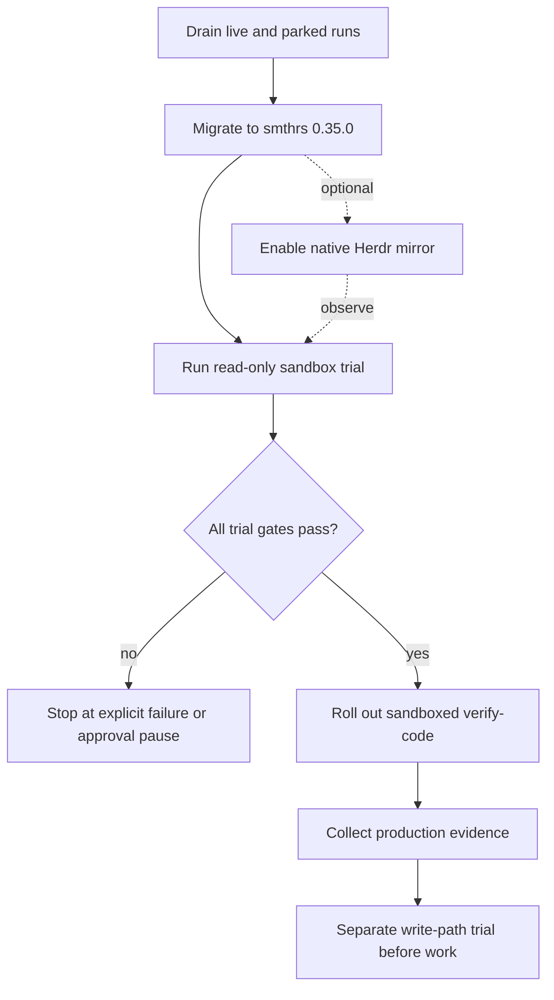
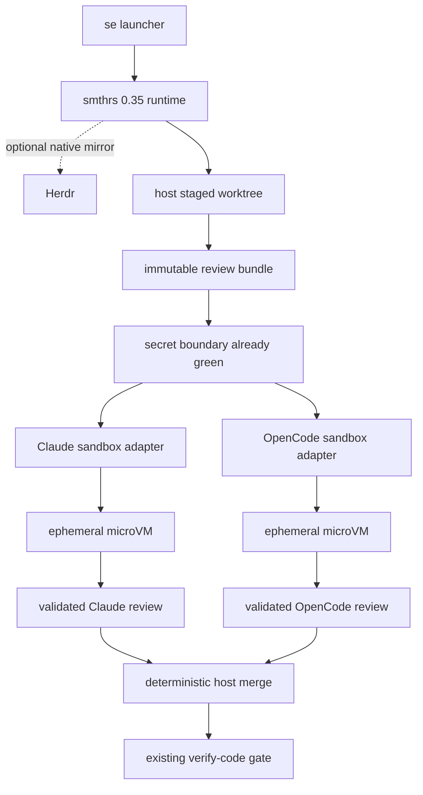

# Smithers 0.35, Herdr, and Microsandbox - Plan

## Goal Capsule

- **Objective:** Upgrade the managed Smithers runtime to stable `smthrs@0.35.0`, add optional native Herdr visibility and control, and prove Microsandbox isolation before moving `verify-code` into production isolation.
- **Product authority:** Andrew is the operator and acceptance authority.
- **Execution profile:** All implementation happens in a separate development worktree. Production agents receive only their assigned staged worktree.
- **Stop conditions:** Do not deploy across live or parked Smithers runs. Do not promote sandboxed `verify-code` until the real macOS trial proves isolation, structured output, resume, cleanup, and no host fallback.
- **Tail ownership:** Andrew performs the zero-in-flight deployment and accepts the real macOS trial evidence. CI proves portable construction and regression behavior but cannot prove the microVM boundary.

---

## Product Contract

### Summary

The managed Smithers runtime will move from `smithers-orchestrator@0.32.0` to stable `smthrs@0.35.0`, expose optional native run visibility and control through Herdr, and add fail-closed Microsandbox execution. The first production rollout isolates only the read-only `verify-code` stage; mutating stages remain on the host until a later write-path trial passes.

### Problem Frame

Smithers agents currently run as host processes with broad filesystem access. The existing pipeline is durable and owns approvals, replay, structured results, worktrees, secret gates, and guarded commits, but it does not provide an operating-system isolation boundary.

The legacy `smithers-orchestrator` package is frozen at 0.32.0. Smithers 0.35 is published under `smthrs` and adds the upstream Herdr and sandbox capabilities needed to close this gap. The migration changes a large shared runtime surface, and edits to workflow code invalidate resume for live or parked runs.

### Key Decisions

- **Use the stable release only.** Pin `smthrs@0.35.0`; do not consume unreleased commits from upstream `main`.
- **Start with `verify-code`.** The first production sandbox stage reads an existing diff and returns findings. `work`, `verify-doc`, and `simplify` stay on the host during this rollout because mutating workflow paths have a larger failure surface.
- **Keep Smithers authoritative.** Herdr optionally mirrors Smithers state and controls the existing run. It must not create a second status registry or become a run dependency.
- **Defer takeover.** Smithers 0.35 hijack is run-wide, cancels active siblings, and can fall back to a host terminal. Sandboxed nodes must reject hijack until upstream provides node-scoped sandbox takeover.
- **Preserve host ownership of git state.** The pipeline creates the staged worktree on the host and gives each microVM only a read-only view of its source. Existing pipeline guards remain responsible for commits.
- **Use one microVM per review leg.** Claude and OpenCode run in separate ephemeral microVMs against independent read-only views of the same host-owned staged worktree.
- **Fail closed.** If Microsandbox or the required isolation policy is unavailable, production `verify-code` must not fall back to an unsandboxed host process.

### Actors

- A1. **Operator:** Launches and monitors runs, intervenes through Herdr, and decides whether trial evidence permits production rollout.
- A2. **Smithers:** Owns run state, node status, approvals, replay, resume, and terminal outcomes.
- A3. **Herdr:** Optionally mirrors Smithers events and gives the operator live output, approvals, denials, and steering.
- A4. **Microsandbox:** Runs the assigned review agent inside a bounded microVM.
- A5. **Review agent:** Reads only its assigned staged worktree and returns structured findings without modifying the repository.

### Requirements

**Runtime migration**

- R1. Replace the managed `smithers-orchestrator@0.32.0` runtime with an exact `smthrs@0.35.0` pin and migrate all package-facing workflow surfaces together.
- R2. Preserve existing run identifiers, deterministic task identities, approval gates, replay and resume behavior, structured Zod envelopes, secret baselines, and pipeline-owned guarded commits.
- R3. The migration must start only when no Smithers run is live or parked because workflow graph changes invalidate resume.
- R4. Clean installation must resolve the renamed package and its trusted native dependencies on macOS while keeping Linux and Docker checks usable.

**Herdr control**

- R5. When compatible Herdr is available, native integration must show live agent output, authoritative Smithers status, and terminal outcomes for each mirrored node.
- R6. The operator must be able to approve, deny, and steer eligible nodes through native Herdr controls while Smithers remains the only run-state authority.
- R7. Sandboxed nodes must reject Smithers 0.35 hijack and must never open a host-terminal fallback.
- R8. Herdr absence or protocol mismatch may disable the optional mirror, but it must not change Smithers execution semantics or create a second control plane.

**Microsandbox trial**

- R9. Each trial agent receives its own ephemeral microVM with a read-only view of the assigned host-owned staged worktree, required runtime, explicit setup files, and minimum network and credential bindings.
- R10. A trial agent must not read the host home directory, 1Password state, SSH material, project parent directories, or another worktree.
- R11. The trial must return a validated structured review result and durable Smithers status; compatible Herdr must additionally mirror live output and status when available.
- R12. Resume must skip completed review legs and rerun an interrupted leg in a fresh microVM with the same immutable input and no broader access.
- R13. Success, failure, timeout, and cancellation must remove each microVM while retaining only the documented Smithers state, logs, and host worktree needed for recovery.

**Production rollout**

- R14. The first production rollout moves only `verify-code` into Microsandbox after the read-only trial satisfies every acceptance gate.
- R15. Production `verify-code` must fail closed when Microsandbox or the required isolation policy is unavailable.
- R16. `work`, `verify-doc`, and `simplify` remain host processes in this scope.
- R17. Moving `work` into Microsandbox requires a later write trial that returns a complete diff and proves the existing host guard can commit it.

### Key Flows

- F1. **Read-only trial**
  - **Trigger:** The runtime migration and Microsandbox preflight pass on macOS; Herdr compatibility is recorded when Herdr is available.
  - **Actors:** A1, A2, A3, A4, A5.
  - **Steps:** Smithers creates one host-owned staged worktree, launches each bounded review agent in its own ephemeral microVM, optionally mirrors events into Herdr, interrupts one leg, resumes it in a fresh microVM, and cleans up every sandbox.
  - **Outcome:** The operator receives evidence for isolation, structured output, observability, resume, and cleanup.
  - **Covers:** R5-R13.
- F2. **Production `verify-code`**
  - **Trigger:** Every read-only trial gate passes.
  - **Actors:** A1, A2, A3, A4, A5.
  - **Steps:** The pipeline gives each reviewer an independent read-only view of the assigned staged worktree, runs both legs in parallel, receives findings, and removes each microVM after its leg settles.
  - **Outcome:** Review runs in isolation while Smithers remains authoritative and the pipeline's git ownership does not change.
  - **Covers:** R14-R16.
- F3. **Unavailable isolation**
  - **Trigger:** Microsandbox or a required filesystem, network, credential, or cleanup control is unavailable.
  - **Actors:** A1, A2, A3.
  - **Steps:** The stage refuses host execution and surfaces an explicit failure or approval pause with diagnostics.
  - **Outcome:** The run never weakens its isolation contract silently.
  - **Covers:** R8, R15.

### Acceptance Examples

- AE1. **Covers R5-R8.** Given compatible Herdr is available, when sandboxed review agents run, then Herdr shows live output and Smithers status, permits approve, deny, and steer, and refuses hijack without creating a host shell.
- AE2. **Covers R9-R10.** Given markers exist in the host home directory and another worktree, when the trial agent probes them, then access fails while the assigned staged worktree remains readable.
- AE3. **Covers R11.** Given two review agents receive bounded parts of a fixture repository, when they finish, then each returns a validated report and Smithers records its terminal status; compatible Herdr mirrors that state when available.
- AE4. **Covers R12.** Given one review leg completed and another was interrupted, when Smithers resumes the run, then the completed leg is not repeated and the interrupted leg starts in a fresh sandbox with the same policy.
- AE5. **Covers R13.** Given a sandboxed stage succeeds, fails, or is cancelled, when cleanup completes, then no microVM remains and the documented recovery artifacts are available.
- AE6. **Covers R14-R16.** Given every read-only trial gate passes, when production rollout begins, then only `verify-code` runs in Microsandbox and mutating stages retain their current host behavior.
- AE7. **Covers R15.** Given Microsandbox or a required isolation control is unavailable, when production `verify-code` starts, then it refuses unsandboxed execution and reports the blocking condition.
- AE8. **Covers R17.** Given no write trial has proved diff return and guarded commit, when `work` is considered for sandbox rollout, then the rollout remains blocked.

### Success Criteria

- The macOS trial passes filesystem isolation, validated output, interrupt and resume, cleanup and recovery, and no-host-fallback gates; compatible Herdr additionally proves native visibility and control.
- Production `verify-code` completes representative runs in independent Microsandbox microVMs without host fallback or a second status registry.
- Existing workflow behavior remains stable across the package rename, including approvals, replay, structured results, secret gates, and guarded commits.
- Linux and Docker verification exercise installation and workflow construction without requiring a live Microsandbox runtime.

### Scope Boundaries

- Sandbox rollout for `work`, `verify-doc`, and `simplify` is deferred.
- The fixture write trial and production write-path rollout are deferred until read-only `verify-code` has production evidence.
- Unreleased Smithers commits after v0.35.0 are excluded.
- Automatic fallback to host execution is excluded.
- Node-scoped sandbox takeover is deferred until upstream supports it; Smithers 0.35 run-wide hijack and host-terminal fallback are excluded.
- Project-specific setup and validation commands remain owned by each target repository.

### Dependencies / Assumptions

- Smithers v0.35.0 is the latest published stable release as of 2026-08-21.
- Herdr is optional for execution. Native mirroring requires Herdr 0.8.0 and protocol 19 when present.
- Real microVM isolation, setup duration, resource usage, and credential binding remain unverified until the macOS trial runs.
- Linux and Docker may use a stub sandbox provider, but they cannot prove the macOS isolation boundary.

### Sources / Research

- `docs/issues/2026-08-18-018-run-smithers-pipeline-agents-in-microsandbox.md` - existing migration and isolation follow-up.
- `docs/ideation/2026-08-18-agent-isolation-pov.html` - prior recommendation for a bounded Smithers, Herdr, and Microsandbox trial.
- `docs/se-pipeline.md` - current runtime, operational constraints, and zero-in-flight migration procedure.
- `docs/plans/2026-08-13-001-feat-dynamic-flow-composition-plan.md` - current package pin and resume compatibility constraints.
- Smithers v0.35.0 release notes: `https://github.com/smithersai/smithers/releases/tag/v0.35.0`.

---

## Planning Contract

**Product Contract preservation:** changed Key Decisions, A3, R5-R9, R12-R15, F1-F3, AE1, AE4, AE7, Success Criteria, Scope Boundaries, and Dependencies after source verification showed that Smithers 0.35 takeover is run-wide and Herdr mirroring is intentionally optional. The user approved deferring takeover, keeping Herdr optional, and assigning one microVM to each review leg.

### Key Technical Decisions

- KTD1. **Migrate the runtime as one compatibility batch.** Replace the package, scoped imports, JSX source, native dependency trust, lockfile, tests, and runbook references together. `smithers-orchestrator` and `smthrs` expose the same `smithers` executable, so the old package must leave the dependency graph before the new binary is trusted.
- KTD2. **Treat the Smithers store migration as one-way.** Back up the 0.32 database before the first 0.35 open. Automatic migrations may update the store through schema migration 0044; rollback uses the backup rather than opening a migrated store with the old CLI.
- KTD3. **Preserve workflow identity and persisted contracts.** Keep existing task and subflow IDs, approval semantics, output table names, and required fields. New sandbox evidence uses optional fields or separate outputs so historical rows remain readable during resume.
- KTD4. **Use native Herdr mirroring without making it authoritative.** Launch with the upstream mirror when compatible Herdr is available and expose its native attach, approval, denial, and steering paths. Do not build a local mirror, watchdog, or second status registry. Refuse `hijack` for sandboxed nodes.
- KTD5. **Keep the staged worktree and Git authority on the host.** Do not adopt Smithers `<Worktree>` in this migration. The sandbox receives source files and host-generated diff metadata but not the linked worktree's common Git directory, hooks, credentials, or refs.
- KTD6. **Use a local provider adapter around beta upstream APIs.** Pin `microsandbox@0.6.6`, configure `smthrs/microsandbox` through one narrow module, and keep provider creation lazy so Linux and Docker can construct workflows without virtualization. Missing provider capabilities fail before any review CLI starts.
- KTD7. **Use one ephemeral microVM per review leg and attempt.** Claude and OpenCode retain parallel, independent failure domains. An approved extra attempt creates two fresh microVMs; resume skips a completed leg and recreates only interrupted work.
- KTD8. **Pass an immutable review bundle instead of functional Git.** The host prepares the current tree, base-to-head diff, revision metadata, and staged review skill. Each guest receives read-only inputs at guest-local paths plus bounded writable homes and temp directories; the host verifies the worktree is unchanged after review.
- KTD9. **Constrain egress and credentials per leg.** Public networking is not an allowlist. Each engine gets only required provider destinations and a short-lived operation-scoped credential through an explicit broker or substitution boundary. Raw long-lived credentials, host agent homes, SSH, 1Password, Keychain, cloud state, and host sockets never enter the guest.
- KTD10. **Make cleanup observable and recoverable.** Provider cleanup uses ephemeral destroy semantics, but cleanup errors cannot be trusted to fail the workflow. Persist sandbox identity before launch, reconcile orphans at startup, and distinguish leaked microVMs from intentionally retained failed-run worktrees and Herdr workspaces.
- KTD11. **Promote through a trial gate, not a feature flag default.** The throwaway macOS trial uses the production provider adapter and review shape. Production `verify-code` switches to sandbox-only execution only after Andrew records all mandatory gates as passing; there is no automatic host fallback.

### High-Level Technical Design

The host remains responsible for staging, secret scanning, deterministic merge, gate evaluation, approvals, reporting, and worktree cleanup. The guest runner owns only one external review leg against immutable inputs. Smithers remains the durable source of truth across both sides of the boundary.

### Implementation Constraints

- Work in a separate development worktree. The zero-in-flight rule gates deployment to the managed runtime, not ordinary development in the isolated checkout.
- Keep the secret boundary before every sandboxed external leg. A read-only reviewer still exports repository content.
- Do not pass host absolute paths in guest prompts. Rewrite all review and skill paths to guest-local paths.
- Keep the source mount read-only. Give each agent a distinct bounded `HOME`, `TMPDIR`, cache, session, and result path inside the guest.
- Reject root symlinks, escaping symlinks, hard-link aliases, nested filesystems, sockets, devices, and concurrent host mutation before mounting a macOS worktree.
- Record the source revision and manifest before launch and verify `HEAD`, tree hash, index, refs, modes, and worktree status after cleanup.
- Use explicit retries and timeouts. Do not combine `Task.repair` with `continueOnFail`, and do not convert one failed review leg into a clean zero-finding result.
- Never run `chezmoi apply` on the host during implementation or verification.

### Sequencing

1. Build and test the migration in a separate development worktree; preserve the production runtime and database.
2. Complete the package rename and prove all existing workflows construct, type-check, and pass their current tests under 0.35.
3. Prove the copied 0.32 store migration and rollback boundary before opening the production database.
4. Enable optional native Herdr mirroring and document its action matrix, including forbidden hijack.
5. Build and unit-test the provider adapter, immutable review bundle, guest runner, policy checks, and orphan reconciliation without changing production `verify-code`.
6. Run the real two-agent macOS trial and record every mandatory gate.
7. Route only fixed-pipeline `verify-code` through one microVM per review leg, preserving node IDs, merge behavior, gates, extra attempts, reports, and rescans.
8. Drain all live and parked runs, back up the production store, deploy the managed runtime, and run production evidence.

### System-Wide Impact

- **Durable state:** First production use migrates the Smithers database; old and new CLIs must never share the migrated store.
- **Security boundary:** The secret boundary remains necessary, while Microsandbox adds filesystem, process, network, environment, and credential controls around each external leg.
- **Observability:** Herdr mirrors Smithers when available. Herdr loss cannot change run truth or produce duplicate state.
- **Recovery:** A failed run may retain its host worktree while all review microVMs are removed. Operators need separate commands for sandbox orphan cleanup and Herdr workspace cleanup.
- **Compatibility:** Standalone `se-code-review`, `se-flow` code-review blocks, `verify-doc`, `work`, `simplify`, and terminal review remain host processes in this rollout.

### Risks and Mitigations

- **Beta sandbox runtime:** Pin Microsandbox 0.6.6 and gate promotion on real macOS evidence rather than construction tests.
- **Weaker macOS path containment:** Reject risky inode and mount shapes before launch. If the trial cannot prove an acceptable boundary, stop and evaluate an exported read-only image or a Linux sandbox host instead of weakening the gate.
- **Credential persistence:** Prefer operation-scoped credentials through a broker. Sentinel-test guest disk, process arguments, logs, errors, snapshots, Smithers state, and Microsandbox state.
- **Guest runner gap:** Smithers does not install a runner that executes this child workflow. Build the runner as an explicit, versioned input and prove it with a real two-leg trial.
- **Cleanup suppression:** Reconcile by durable sandbox identity because upstream cleanup warnings may preserve the original workflow result.
- **Unreleased upstream fixes:** Stay on 0.35.0. Encode known limitations in tests and documentation rather than pinning upstream `main`.

### Sources and Research

- `docs/solutions/architecture-patterns/resume-safe-dynamic-composition-durable-workflow.md` - zero-in-flight and workflow identity constraints.
- `docs/solutions/architecture-patterns/pre-external-secret-boundary-for-coding-agent-pipelines.md` - mandatory scanning before external review.
- `docs/solutions/design-patterns/absolute-paths-beat-prose-in-agent-isolation.md` - guest-local path and frozen-input requirements.
- `docs/solutions/design-patterns/external-review-legs-as-unreliable-subprocesses.md` - failed-leg and timeout semantics.
- `home/private_dot_claude/dot_smithers/workflows/lib/staging.ts` - host-owned worktree, frozen plan, guarded commit, and recovery patterns.
- `home/private_dot_claude/dot_smithers/workflows/se-pipeline.tsx` - current `verify-code` node identities, merge, gate, extra-attempt, reporting, and rescan behavior.
- Smithers 0.35 Herdr integration: `https://github.com/smithersai/smithers/blob/v0.35.0/docs/integrations/herdr.mdx`.
- Smithers 0.35 Microsandbox provider: `https://github.com/smithersai/smithers/blob/v0.35.0/docs/integrations/microsandbox-sandbox-provider.mdx`.
- Microsandbox security model: `https://docs.microsandbox.dev/security/isolation`.

---

## Implementation Units

### U1. Smithers 0.35 compatibility migration

- **Goal:** Replace the frozen legacy package with exact `smthrs@0.35.0` while preserving every existing workflow contract.
- **Requirements:** R1-R4.
- **Files:** `home/private_dot_claude/dot_smithers/package.json`, `home/private_dot_claude/dot_smithers/bun.lock`, `home/private_dot_claude/dot_smithers/tsconfig.json`, `home/private_dot_claude/dot_smithers/workflows/*.tsx`, `home/private_dot_claude/dot_smithers/workflows/lib/**/*.ts`, `home/private_dot_claude/dot_smithers/workflows/workflow-construction.test.ts`, `tests/smoke.bats`.
- **Approach:** Replace root, scoped, scorer, type, and JSX imports as one batch. Trust the renamed JJ native package, add exact Microsandbox dependencies without constructing the provider on import, and preserve the `smithers` executable path.
- **Test scenarios:** Frozen install resolves only `smthrs@0.35.0`; no legacy import remains; all five existing workflows construct; unknown agent options fail visibly; every existing Bun test and TypeScript check passes.
- **Verification:** `cd home/private_dot_claude/dot_smithers && bun test`; `cd home/private_dot_claude/dot_smithers && bunx tsc --noEmit`; search tracked Smithers sources for zero `smithers-orchestrator` references except historical documentation.
- **Dependencies:** None.

### U2. Store migration and rollback proof

- **Goal:** Prove that a copied 0.32 store survives automatic 0.35 migration and that rollback uses an untouched backup.
- **Requirements:** R2-R3.
- **Files:** `home/private_dot_claude/dot_smithers/workflows/lib/run-usage.test.ts`, `home/private_dot_claude/dot_smithers/workflows/workflow-construction.test.ts`, `tests/scripts.bats`, `docs/se-pipeline.md`.
- **Approach:** Create disposable 0.32 fixtures or copied stores, open only copies with 0.35, verify historical inspection and eligible resume, and record the production backup and rollback contract. Keep production data outside automated tests.
- **Test scenarios:** Fresh 0.35 store opens twice idempotently; copied 0.32 store reaches current migrations and preserves historical run inspection; old CLI never opens the migrated production store; deployment refuses while a run is live or parked.
- **Verification:** Focused Bun database tests and Bats CLI fixture tests; manual copied-store migration before deployment.
- **Dependencies:** U1.

### U3. Optional native Herdr integration

- **Goal:** Add native Smithers-to-Herdr visibility and supported controls without making Herdr a run dependency.
- **Requirements:** R5-R8.
- **Files:** `home/private_dot_claude/dot_smithers/bin/executable_se`, `tests/smoke.bats`, `tests/scripts.bats`, `home/private_dot_config/herdr/config.toml`, `docs/se-pipeline.md`.
- **Approach:** Launch eligible runs with the upstream mirror when protocol 19 is available, expose or document native status, attach, approve, deny, steer, and clean behavior, and keep `se abort` as the run-cancel authority. Reconcile custom Herdr rows and notifications only where native mirroring would duplicate them. Reject or hide hijack for sandboxed nodes.
- **Test scenarios:** Compatible Herdr adopts one deterministic workspace; repeated attach creates no duplicate tabs; absent or mismatched Herdr leaves Smithers output unchanged; pane close does not cancel; approve, deny, and steer target the intended node; hijack is unavailable for sandboxed nodes.
- **Verification:** Bats command-mapping tests plus a manual Herdr 0.8.0/protocol 19 fixture run.
- **Dependencies:** U1.

### U4. Microsandbox policy and lifecycle adapter

- **Goal:** Encapsulate provider configuration, host preflight, per-leg policy, durable sandbox identity, and orphan cleanup behind one fail-closed boundary.
- **Requirements:** R9-R10, R12-R13, R15.
- **Files:** `home/private_dot_claude/dot_smithers/workflows/lib/sandbox.ts`, `home/private_dot_claude/dot_smithers/workflows/lib/sandbox.test.ts`, `home/private_dot_claude/dot_smithers/workflows/lib/agents.ts`, `home/private_dot_claude/dot_smithers/workflows/lib/agents.test.ts`, `home/.chezmoiignore`.
- **Approach:** Create the provider lazily, require `msb doctor` and policy capabilities on macOS, assign unique attempt and leg identities, configure ephemeral destroy semantics, scrub the environment, restrict mounts and egress, persist identity before launch, and reconcile expired or terminal orphans without touching host worktrees.
- **Test scenarios:** Missing runtime, failed doctor, unsupported mount control, invalid egress, or missing credential broker fails before a host reviewer starts; Linux construction uses a fake provider; cleanup handles success, failure, timeout, cancellation, and forced cleanup errors; startup reconciliation removes only attributable orphans.
- **Verification:** `cd home/private_dot_claude/dot_smithers && bun test workflows/lib/sandbox.test.ts workflows/lib/agents.test.ts`; Linux workflow construction without Microsandbox.
- **Dependencies:** U1, U2.

### U5. Immutable review bundle and guest runner

- **Goal:** Run one review leg in an isolated guest without exposing host Git metadata or host paths.
- **Requirements:** R9-R12.
- **Files:** `home/private_dot_claude/dot_smithers/workflows/lib/review-bundle.ts`, `home/private_dot_claude/dot_smithers/workflows/lib/review-bundle.test.ts`, `home/private_dot_claude/dot_smithers/workflows/sandbox-review-leg.tsx`, `home/private_dot_claude/dot_smithers/workflows/sandbox-runner.ts`, `home/private_dot_claude/dot_smithers/workflows/workflow-construction.test.ts`.
- **Approach:** Generate a host-side manifest, tree snapshot, diff, revision metadata, and staged review skill; map them to guest-local read-only paths; give the reviewer bounded writable state; execute the selected review engine; validate the existing `reviewLeg` schema; verify host Git integrity after cleanup.
- **Test scenarios:** Guest prompts contain no host path; Git common data is absent; workspace writes, symlink escapes, hard-link aliases, nested mounts, devices, sockets, and absolute-path reads fail; both engines preserve structured output; invalid output is a failed leg; host tree, refs, index, modes, and status remain unchanged.
- **Verification:** Focused bundle and guest-runner Bun tests plus workflow construction.
- **Dependencies:** U4.

### U6. Real macOS two-agent trial

- **Goal:** Prove the production adapter with independent Claude and OpenCode microVMs before changing the fixed pipeline.
- **Requirements:** R9-R15.
- **Files:** `home/private_dot_claude/dot_smithers/workflows/sandbox-trial.tsx`, `home/private_dot_claude/dot_smithers/workflows/workflow-construction.test.ts`, `home/private_dot_claude/dot_smithers/bin/executable_se`, `tests/scripts.bats`, `docs/se-pipeline.md`.
- **Approach:** Add a throwaway trial command that launches both engines in parallel through the same adapter and records per-gate evidence. Keep the production `verify-code` path unchanged until every mandatory gate passes.
- **Test scenarios:** Each reviewer has a distinct microVM and credential; both read the same immutable source revision; home, sibling worktree, secret stores, private network, metadata, host sockets, and unlisted destinations are unreachable; structured reports return; one interrupted leg resumes in a fresh microVM without repeating the completed leg; all orphans are reconciled.
- **Verification:** Real macOS trial with `msb doctor`; inspect Smithers rows, Microsandbox state, host worktree hashes, logs, and optional Herdr panes. Record setup time and peak resource use.
- **Dependencies:** U3, U4, U5.

### U7. Production `verify-code` sandbox rollout

- **Goal:** Route only the fixed pipeline's two `verify-code` legs through independent microVMs while preserving all existing gates and reports.
- **Requirements:** R14-R17.
- **Files:** `home/private_dot_claude/dot_smithers/workflows/se-pipeline.tsx`, `home/private_dot_claude/dot_smithers/workflows/lib/agents.ts`, `home/private_dot_claude/dot_smithers/workflows/lib/review-merge.ts`, `home/private_dot_claude/dot_smithers/workflows/lib/review-merge.test.ts`, `home/private_dot_claude/dot_smithers/workflows/workflow-construction.test.ts`.
- **Approach:** Replace only the Claude and OpenCode task bodies inside each `verify-code` attempt. Preserve stable node IDs, independent guards, deterministic merge, `stageBlock`, approval and waiver semantics, extra-attempt IDs, proof bindings, per-leg reports, post-approval rescan, and failed-run worktree retention.
- **Test scenarios:** Both legs succeed and merge identically; either leg fails without becoming zero findings; both fail and degrade the gate; approved retry creates new microVMs; resume skips settled legs; missing isolation never invokes host agents; standalone review and all mutating stages remain host processes.
- **Verification:** Focused Bun tests, workflow construction, smoke fixture, and one representative full production run after deployment.
- **Dependencies:** U6 and recorded passing trial gates.

### U8. Managed deployment, CI, and operations

- **Goal:** Deliver the renamed runtime and recovery contract through chezmoi without weakening Linux CI or host safety.
- **Requirements:** R1-R4, R13-R17.
- **Files:** `home/.chezmoiscripts/run_onchange_after_4-install-smithers-deps.sh.tmpl`, `home/.chezmoiignore`, `.github/workflows/test-dotfiles.yml`, `tests/templates.bats`, `tests/smoke.bats`, `tests/scripts.bats`, `docs/se-pipeline.md`, `docs/issues/2026-08-18-018-run-smithers-pipeline-agents-in-microsandbox.md`.
- **Approach:** Keep hash-triggered dependency installation, verify the renamed binary in source and deployed runtimes, construct workflows on Linux without virtualization, document database backup and orphan recovery, and update the existing issue to point at the read-only-first rollout. Drain runs only at deployment, then install and validate the managed runtime.
- **Test scenarios:** Clean macOS install resolves exact pins; Ubuntu applies and constructs all workflows without live Microsandbox; runtime state remains unmanaged; deployment refuses in-flight runs; rollback restores the 0.32 store backup; failure cleanup retains recovery worktrees but no microVM.
- **Verification:** `bats tests/templates.bats tests/smoke.bats tests/scripts.bats`; `make lint`; `make test-ubuntu`; manual `make test-local` review without host apply.
- **Dependencies:** U1-U7.

---

## Verification Contract

| Command or check | Covers | Expected result |
|---|---|---|
| `cd home/private_dot_claude/dot_smithers && bun test` | U1-U7 | All workflow, adapter, bundle, merge, lifecycle, and fixture tests pass. |
| `cd home/private_dot_claude/dot_smithers && bunx tsc --noEmit` | U1-U7 | The complete migrated TypeScript and TSX graph type-checks. |
| `bats tests/templates.bats tests/smoke.bats tests/scripts.bats` | U1-U4, U6, U8 | Templates, launcher mappings, package deployment, and source-level runtime contracts pass. |
| `make lint` | U1-U8 | ShellCheck passes for changed shell surfaces. |
| `make test-ubuntu` | U1, U4, U8 | Disposable Ubuntu apply and full suite pass without requiring virtualization. Run outside the pipeline work gate because it is the full Docker proof. |
| Real macOS Microsandbox trial | U4-U7 | Every mandatory isolation, output, resume, cleanup, credential, network, and no-host-fallback sentinel passes. |
| Representative production `verify-code` run | U7-U8 | Two independent microVM legs merge through the existing gate and leave no sandbox resources. |
| Deployment audit | U2, U8 | No live or parked run exists; the 0.32 store backup is readable; runtime reports Smithers 0.35.0; old CLI never opens the migrated store. |

The four commands in `validate_commands` are the fast, non-mutating work-gate subset. The Docker proof and real macOS trials remain explicit manual or CI gates because they are environment-dependent and too broad for every pipeline attempt.

---

## Definition of Done

- The Product Contract requirements R1-R17 are traceable to passing automated or manual evidence.
- U1-U8 meet their stated verification and dependency contracts.
- The managed package and lockfile pin `smthrs@0.35.0` and `microsandbox@0.6.6`; no active source imports the legacy package.
- A copied 0.32 store migrates successfully, and the production rollback procedure uses an untouched backup.
- Native Herdr mirroring works when compatible Herdr is present and does not affect run truth when absent.
- Sandboxed nodes reject hijack and cannot fall back to a host reviewer or host shell.
- The real macOS trial proves independent per-leg microVMs, read-only inputs, bounded egress and credentials, structured output, fresh-sandbox resume, cleanup, and orphan reconciliation.
- Production `verify-code` preserves stable node IDs, deterministic merge, gates, approvals, reports, rescans, and failed-run worktree recovery.
- `work`, `verify-doc`, `simplify`, standalone review, and generic flow review remain outside the production sandbox rollout.
- Documentation describes deployment, backup, rollback, Herdr actions, sandbox cleanup, and recovery without contradicting the new rollout order.
- All abandoned experiments, temporary feature flags, unused adapters, and dead compatibility code are removed before completion.
