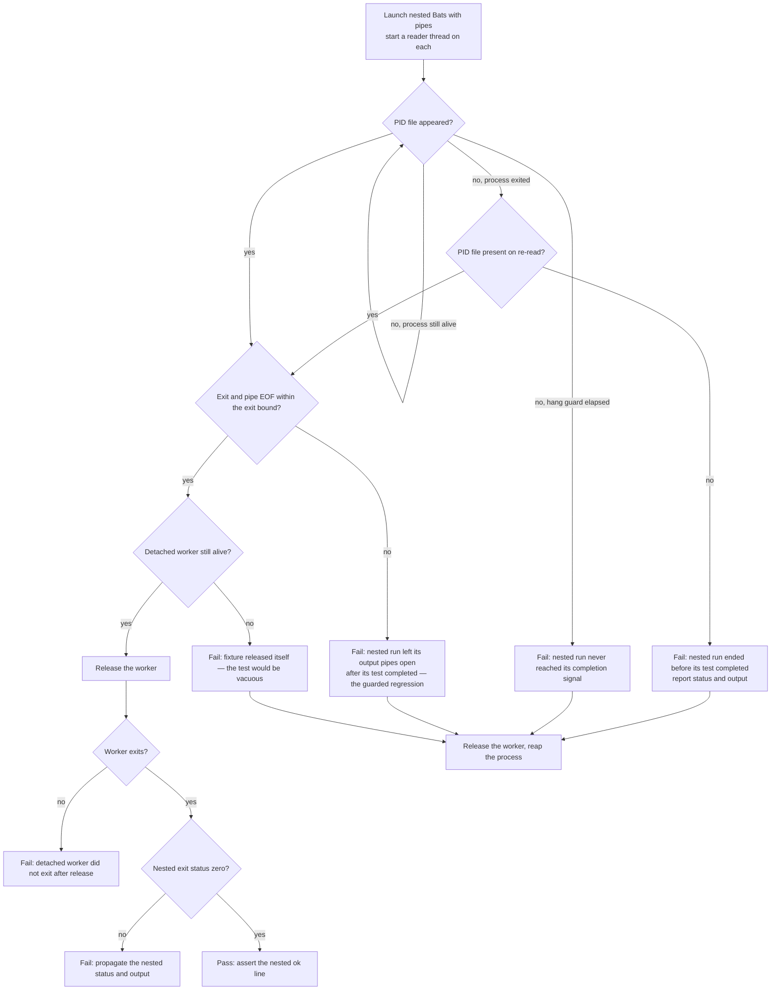

# fix: Split the inner-Bats wall-clock budget into a hang guard and a causal exit assertion

## Summary

`tests/scripts.bats` contains one test that spawns a nested Bats invocation and caps the whole
nested run with a single 90-second wall-clock budget. On the 3-core `macos-latest` CI runner that
nested run already costs about 59 seconds in a green run, so the margin is roughly 1.5x. A CI run
that is 1.36x slower than green — ordinary variance — lands past the budget and the job goes red
with no regression behind it.

This plan replaces the one budget with two separately named bounds: a generous hang guard covering
the nested run up to its own completion signal, and a short bound on the property the test actually
exists to prove. It also closes a latent vacuity in the same test, where the blocked fixture can
release itself and let the test pass without proving anything.

Scope is the test harness in `tests/scripts.bats` plus the issue records the repo convention
requires. `home/dot_local/bin/executable_herdr-task-sync` does not change.

---

## Problem Frame

The test `herdr-task-sync bounded Bats invocation exits after detached work`
(`tests/scripts.bats:1873`) is a regression guard for `close_inherited_descriptors`
(`home/dot_local/bin/executable_herdr-task-sync:327`). That function closes descriptors above
stderr in a detached descendant, so a detached worker cannot keep the parent's output pipes alive
after the test process that spawned it has finished.

The test proves this by running a nested Bats invocation whose single test leaves a deliberately
blocked detached worker behind, then requiring that nested invocation to complete. Today it
expresses "complete" as one fixed number.

**The failure.** CI run 32454626507, job `test-macos`:
`not ok 130 herdr-task-sync bounded Bats invocation exits after detached work`, failing at
`assert_success` (`tests/scripts.bats:1927`) with status 124 and output
`inner Bats invocation exceeded 90 seconds`. The `test-ubuntu` and `lint` jobs passed.

**Why it fired.**

1. The nested run is `bats tests/scripts.bats --filter '^herdr-task-sync descriptor child probe$'`
   (`tests/scripts.bats:1889-1894`), capped by `HTS_INNER_BATS_TIMEOUT`, default 90 seconds
   (`tests/scripts.bats:1899`).
2. Most of that nested run is work unrelated to the property under test: Bats parses and gathers
   all 196 tests of the 5105-line file before running the one test that survives `--filter`.
   Measured on a 10-core macOS host, `bats --count tests/scripts.bats` costs 1.9 s of CPU out of a
   3.9 s nested run and a 6.9 s outer test.
3. On the 3-core runner the same nested run costs about ten times more. In the last green macOS run
   (32453886866) test 130 printed 64.0 s after test 129; in the red run that gap was 95.0 s while
   the nested run is known to have hit its 90 s cap, so gap ≈ duration + 5 s. The green nested run
   was therefore ≈59 s against a 90 s budget.
4. The red run was ~1.36x slower overall than that green run (suite wall time 371 s vs 272 s). A
   1.36x-slower run against a 1.5x margin exceeds 90 s, `subprocess.run(..., timeout=90)` raises
   `TimeoutExpired`, the handler exits 124, and `assert_success` fails.

**It is slowness, not the guarded deadlock — and one observation separates them.** Status 124 alone
cannot tell the two causes apart: `subprocess.run` reads to EOF, and KTD3 below establishes that a
missing EOF is exactly the guarded regression's signature, so both causes produce the same exit code.
The discriminator is whether the nested run reached its own completion signal before the expiry. It
did not. The red run's captured output was exactly two lines — the driver's own message and the TAP
plan line `1..1` — with no `ok 1 herdr-task-sync descriptor child probe`. The nested test body had not
finished, so the expiry landed *before* completion and the leaked-pipe branch did not fire.

Two weaker observations agree with that reading: the cost scales smoothly with CPU pressure rather
than hanging (the outer test ran 6.9 s idle and 16.0 s under 24 busy loops on 10 cores, passing both
times), and the same test took 16 s in the Ubuntu job of the red run. Neither is decisive on its own,
because neither runs the 3-core macOS profile under `bats --jobs 8 --no-parallelize-across-files`
(`.github/workflows/test-dotfiles.yml:311`) where this reproduces. The absent `ok 1` line is the
evidence that carries the verdict.

**If that line is ever present in a future occurrence, this premise is wrong** and the leaked-pipe
branch fired — in which case the split below makes CI go red sooner rather than less often, and the
design needs rework before U1.

**This is the fifth instance of a pattern this repo has already named.** The comment at
`tests/scripts.bats:1895-1898` records that the previous value, 12 s, "was calibrated on an idle
machine and timed out under parallel load" — 90 s is the second calibration of the same number, made
before `--jobs 8` shipped in CI (commit `543ca9e`).
`docs/issues/2026-08-21-015-capture-the-idle-machine-wall-clock-pattern.md` (status: open) lists four
prior instances and states the two rules this one breaks: a hang guard and a performance assertion
must not share a number, and assert the property causally rather than temporally. The same rule pair
is recorded from a different domain in
`docs/solutions/design-patterns/external-review-legs-as-unreliable-subprocesses.md` ("Give legs
liveness detection AND generous wall-clock — they are different budgets"), including the calibration
rule that thresholds come from healthy runs rather than the one pathological sample.

---

## Requirements

- **R1.** The test must stop failing on ordinary run-to-run slowness of the macOS CI job. No
  remaining bound may sit within a small multiple of the nested run's observed healthy cost.
- **R2.** The test must still fail if `close_inherited_descriptors` regresses. The fix must not make
  the guard vacuous, weaker, or conditional.
- **R3.** A failure must name which bound fired, so a reader can tell a genuine regression from a
  slow run without reconstructing the mechanism.
- **R4.** No blocked fixture worker may be left running after any path through the test, including
  every failure path.
- **R5.** The test must fail loudly rather than pass, if the fixture releases itself before the
  property is observed (non-vacuity).
- **R6.** Findings not fixed here are recorded as issue files under `docs/issues/`, per the
  convention in `CLAUDE.md`.

### Success Criteria

- The test passes idle, and passes under CPU saturation with a wide margin on every remaining bound.
- With `close_inherited_descriptors` temporarily neutered, the test fails, and its message names the
  exit bound rather than a generic timeout.
- `bats tests/scripts.bats` is green, and the parallel post-apply suite is green.

---

## Key Technical Decisions

### KTD1. Two named bounds replace the single whole-run budget

*(session-settled: user-approved — chosen over raising 90 s to a larger number such as 300 s: 90 s
is already the second calibration of the same idle-machine number, and the repo's own rule is that a
hang guard and a performance assertion must not share a number.)*

- **Phase A, progress.** Wait for the nested run to reach its own completion signal. The bound here
  is a hang guard: generous, out of load's reach, and it never fires in either the healthy or the
  regression case. It is bounded on both ends — far above the nested run's observed cost, and far
  enough below the macOS job's `timeout-minutes: 25` (`.github/workflows/test-dotfiles.yml:203`)
  that a genuine hang prints the guard's own message instead of the job being killed with none.
- **Phase B, the property.** Once that signal has arrived, require the nested invocation to finish
  within a short, separately named bound. This is the only window the guarded regression breaks.

Phase B is tight because it covers only Bats teardown and exit, not the file parse that dominates
the nested run. That is what removes the load sensitivity: the expensive, load-elastic work now sits
under the guard, and only the cheap, load-insensitive work sits under the assertion.

**Phase B is sized from measurement, not intuition.** It is the only bound that can fire on a healthy
run, so R1's margin rule applies to it and to nothing else. The driver prints Phase B's elapsed time
on every run, including passing ones, and the bound is set as a large multiple of the value observed
under contention. Sizing it by feel on a fast local host would reproduce the exact defect this plan
diagnoses, at a smaller number.

**Why the remedy is a split and not a causal assertion.** `docs/issues/2026-08-21-015` prefers
replacing a wall-clock bound with a causal one, as the R8 test did. That remedy is unavailable here:
a held pipe and a released pipe are distinguishable only by elapsed time, and there is no marker a
test could block on. So the split into a guard and an assertion is the available fallback, applied
deliberately rather than as an unnoticed exception to the rule this plan invokes.

### KTD2. The completion signal is the PID file the probe already writes

The nested test `herdr-task-sync descriptor child probe` (`tests/scripts.bats:1851`) writes
`HTS_DESCRIPTOR_PID_FILE` as its final statement (`tests/scripts.bats:1868-1870`). Its appearance
proves the nested test body finished — in the healthy case and in the regression case alike, since
the regression manifests after the body, at exit. No new signal is needed.

### KTD3. Phase B waits for output-pipe EOF, not merely for process exit

This is the decision most likely to be got wrong, and getting it wrong silently guts the test.

The regression is a detached worker holding the parent's **pipes** open. Today's
`subprocess.run(..., capture_output=True)` detects it because `run()` reads to EOF, and EOF arrives
only when every writer has closed — including the leaked descriptor. So the property is "the
nested invocation's output pipes reach EOF", which is strictly stronger than "the process exited".

Three consequences bind the implementation:

- Phase B must wait for process exit **and** EOF, never for process exit alone.
- The nested invocation must keep receiving **pipes**. Redirecting its output to temp files instead
  would remove the blocking behavior entirely — a worker holding a file descriptor blocks nothing —
  and the test would pass unconditionally.
- Both pipes must be drained from the moment the nested process launches, by a reader thread each,
  rather than left unread until Phase B. Today `subprocess.run` drains concurrently; a design that
  polls the filesystem through Phase A with both pipes unread can deadlock a chatty nested run
  against a full pipe buffer. That is reachable on the failing-nested-test path, where Bats echoes
  the failed test's captured output as TAP comments — the failure would then surface as a Phase A
  hang-guard expiry minutes later instead of an immediate report of the nested failure. Phase B
  becomes a bounded join on those readers plus the process exit, which is the same exit-and-EOF
  property, drained safely.

### KTD4. Non-vacuity is asserted, not assumed

*(session-settled: user-approved — chosen over releasing the blocked worker as soon as the nested
body signals completion: releasing early would let the worker exit before the nested invocation
does, destroying the very condition the test exists to prove.)*

`HTS_DESCRIPTOR_RELEASE_FILE` stays untouched until the nested invocation has finished, on every
path where the nested run got that far.

The blocked `herdr` stub gives up on its own after 3000 poll iterations of `sleep 0.01`
(`tests/scripts.bats:998-1008`), roughly 30 s plus loop overhead. If that ceiling were ever reached
before the release, the worker would exit by itself, the liveness check in the driver would find it
already gone, and the test would pass having proved nothing. Two changes close that hole: the stub's
ceiling covers the whole window it must outlast (below), and the driver asserts the worker is still
alive immediately before releasing it.

**The window the ceiling must outlast is not Phase B.** The stub starts blocking inside the nested
test body — it writes `herdr-blocked` at `tests/scripts.bats:1002`, and the probe waits for that file
at `:1867` before writing the PID file at `:1868-1870`. So the countdown begins *before* the
completion signal, and the window runs from there through the tail of Phase A, all of Phase B, and
the liveness check. Sizing the ceiling as "just above Phase B" would let a healthy-but-slow run trip
it, which is the same load-sensitive false red this plan exists to remove. The ceiling gets a stated
multiple of that whole window, not a direction.

**The liveness check reads the right process.** The PID the probe records is the presentation
claim's owner (`run_presentation_coordinator`, `home/dot_local/bin/executable_herdr-task-sync:1720-1723`),
and that coordinator is the process that shells out to the blocked `herdr` stub — the stub is its
child. So while the stub blocks, the owner is alive and the check is meaningful. The one window where
it could pass on a vacuous run is between the stub giving up and the owner exiting, which is exactly
what the ceiling above prevents from being reached at all.

### KTD5. The new bounds live in the harness constants block, with the file's existing convention

`tests/scripts.bats:1405-1437` already holds named `HTS_*_SECONDS` knobs, each with a comment
stating its value, whether it is a hang guard or a budget, and how it was calibrated.
`HTS_INNER_BATS_TIMEOUT` is the odd one out — it is read from the environment inside the Python
heredoc with an inline default. Both new bounds are declared in that block, overridable from the
environment like their neighbours.

---

## High-Level Technical Design

Directional guidance for the driver's control flow, not implementation specification.

Every failure path that could still leave a blocked worker or an unreaped process — E1 through E4 —
passes through the same cleanup: touch the release file, then reap the nested process. E5 and E6 are
reached only after the release and the reap have already happened, so they need no cleanup of their
own.

Two branches exist to avoid misdiagnosis. The re-read after an observed exit is there because the
guarded regression also exits — only its pipes stay open — so "process exited" and "PID file present"
are both true in the regression case, separated by however long teardown takes; without the re-read,
the regression would be reported as an early exit. And the status check sits *after* the release
rather than before it, so a nested run that fails after writing its completion signal is reported
with its own status instead of leaving a blocked worker behind.

---

## Implementation Units

### U1. Declare the two bounds and rewrite the driver around them

**Goal.** Replace the single whole-run budget in the outer test with the Phase A hang guard and the
Phase B exit assertion, each separately named and separately reported.

**Requirements.** R1, R2, R3, R4.

**Dependencies.** None.

**Files.**
- `tests/scripts.bats` — the constants block at `1405-1437`, and the test at `1873-1929`.

**Approach.**

1. In the constants block, declare two knobs beside the existing ones, each with a comment in the
   established style — value, whether it is a hang guard or an assertion, and what calibrated it:
   - a hang-guard bound for Phase A, bounded on both ends. Above: a large multiple of the nested
     run's ≈59 s cost on the 3-core CI runner, not a small one. Below: small enough that the guard
     fires well inside the macOS job's `timeout-minutes: 25`
     (`.github/workflows/test-dotfiles.yml:203`), so a real hang prints the guard's message rather
     than the job being killed with none. 600 s satisfies both. State both ends in the comment.
   - a short bound for Phase B, covering only Bats teardown and exit, sized as a large multiple of
     the Phase B duration step 8 prints under contention. It must stay below the blocked stub's
     ceiling from U2 by the margin KTD4 states — record that coupling in both comments, expressed
     in the same unit on both sides (see U2 step 2).
   - Retire `HTS_INNER_BATS_TIMEOUT`; nothing else reads it (`grep` before deleting).
2. Rewrite the Python driver in the test to launch the nested invocation without a whole-run
   timeout, keeping `stdout` and `stderr` as **pipes**, and start a reader thread on each at launch
   so no phase ever leaves a pipe unread (KTD3).
3. Phase A: poll for the PID file. Exit the loop three ways — the file appears; the hang guard
   elapses; or the nested process is observed to have exited, in which case **re-read the PID file
   once** and take the Phase B branch if it is now present, reporting the early-exit failure with
   the nested status and output only when it is still absent.
4. Phase B: once the PID file exists, wait for process exit plus reader-thread EOF within the exit
   bound. A timeout here is the guarded regression; say so in the message.
5. Every failure path in Phase A and Phase B touches `HTS_DESCRIPTOR_RELEASE_FILE` and reaps the
   nested process before raising, so no blocked worker and no zombie survives.
6. Keep the existing post-release check that the detached worker exits. Then, **after** the release
   and that check, propagate a non-zero nested exit status with its captured output as the driver's
   own failure — today that check sits before the release, which would strand a blocked worker.
7. Keep the outer assertions `assert_success` and
   `assert_output --partial "ok 1 herdr-task-sync descriptor child probe"`.
8. Print Phase B's elapsed time on every run, passing runs included, so the next recalibration reads
   a number out of CI instead of reconstructing one from print-order gaps.
9. Replace the block comment at `1895-1898` with one that explains the two bounds, why they are two,
   and why the causal remedy `docs/issues/2026-08-21-015` prefers is unavailable here (KTD1) —
   rather than the history of a single recalibrated number.

**Execution note.** Read the PID file defensively. The probe writes it with `>` from a command
substitution, so the shell creates the file empty before any content lands, and a failed write leaves
it empty permanently — poll until the contents parse as an integer, and keep that poll inside the
Phase A loop so it retains the hang-guard and process-exit escapes rather than becoming a second
unbounded wait after them.

**Patterns to follow.**
- The constants block at `tests/scripts.bats:1405-1437` for knob naming, environment override shape,
  and comment content.
- The R8 test's comment at `tests/scripts.bats:4258-4262` for the house framing: "The property is
  causal, not temporal, so assert it causally."

**Test scenarios.** This unit's subject *is* a test; the scenarios below are the states its driver
must handle, exercised through the rehearsals in U3.

- Healthy run: the PID file appears, exit and EOF arrive inside the exit bound, the worker is alive
  at release and exits after it, and the outer assertions pass.
- Guarded regression (rehearsed in U3): the PID file appears, exit and EOF do not both arrive inside
  the exit bound, and the failure message names the exit bound and the leaked-pipe condition — not a
  generic timeout, and not the early-exit message.
- Nested test fails before writing the PID file: the driver reports the nested run's exit status and
  captured output, and does not wait out the Phase A hang guard.
- Nested test fails after writing the PID file: the driver releases the worker, confirms it exits,
  then reports the nested status — no blocked worker survives.
- Any failure path: the release file exists afterwards, and no nested Bats process survives.
- Under CPU saturation the healthy run still passes, with both bounds far from firing.

**Verification.** `bats tests/scripts.bats --filter '^herdr-task-sync bounded Bats invocation exits after detached work$'`
passes idle and under CPU saturation. Both printed durations are recorded: the nested run's total
sits far below the Phase A guard, and Phase B's measured value under contention is the number the
Phase B bound is sized against.

---

### U2. Close the fixture's self-release hole

**Goal.** Make it impossible for the test to pass because the blocked fixture gave up rather than
because the property held.

**Requirements.** R2, R5.

**Dependencies.** U1 (the Phase B bound this ceiling must exceed).

**Files.**
- `tests/scripts.bats` — the harness constants block at `1405-1437` (the new derived, exported
  ceiling) and the blocking branch of the `herdr` stub at `996-1010`.

**Approach.**

1. Replace the literal `3000` poll ceiling in the stub's blocking loop with a value derived from a
   named seconds constant, in the same way `HTS_WAIT_POLLS`, `HTS_WAIT_SLOW_POLLS`, and
   `HTS_WAIT_MATCH_POLLS` derive from `HTS_WAIT_CEILING_SECONDS` (`tests/scripts.bats:1431-1433`).
   Give it its own constant rather than reusing `HTS_WAIT_CEILING_SECONDS`, whose 60 s is unrelated
   to this window and would couple two things that should move independently. The stub is written
   from a quoted heredoc and runs as its own process, so the value must be exported to reach it —
   follow the `export HTS_WAIT_POLLS` precedent at `1437`.
2. Size the ceiling against the whole window KTD4 names — from the stub blocking, through the tail of
   Phase A, through Phase B, to the liveness check — at a stated multiple of it, not merely "greater
   than Phase B". Declare the constant in seconds on both sides of the coupling so the two comments
   compare like with like; a poll count at an assumed 0.01 s per iteration stretches under contention
   and would state a figure the stub does not actually enforce.
3. In the driver, immediately before touching the release file, assert the recorded worker PID is
   still alive. If it is gone, fail with a message saying the fixture released itself and the run
   proved nothing — do not pass.

**Patterns to follow.** `tests/scripts.bats:1431-1437` for deriving poll counts from a named ceiling
and exporting the one the stub reads.

**Test scenarios.**

- Healthy run: the worker is alive at the liveness check, and the run proceeds to release it.
- Simulated self-release (rehearsed in U3 by pinning the stub's ceiling low): the driver fails at
  the liveness check with the vacuity message, rather than passing.
- The other two tests that use the same blocking stub (`tests/scripts.bats:2677`, `:2702`) still
  pass, since the ceiling only grew.

**Verification.** `bats tests/scripts.bats` is green, and the vacuity rehearsal fails loudly with
the expected message.

---

### U3. Prove the guard still catches the regression, then record the follow-ups

**Goal.** Show the rewritten test still fails for the reason it exists, and leave the repo's issue
record consistent with what was found.

**Requirements.** R2, R3, R6.

**Dependencies.** U1, U2.

**Files.**
- `home/dot_local/bin/executable_herdr-task-sync` — temporarily edited by the rehearsal in step 1
  and reverted; nothing from this unit is committed to it.
- `docs/issues/2026-08-21-020-inner-bats-budget-flaked-the-macos-job.md` — new.
- `docs/issues/2026-08-21-021-nested-bats-run-parses-the-whole-suite.md` — new.
- `docs/issues/2026-08-21-015-capture-the-idle-machine-wall-clock-pattern.md` — append.
- `docs/issues/_open-issues.md` — add rows for the new issues.

**Approach.**

1. **Regression rehearsal (not committed).** Temporarily neuter `close_inherited_descriptors` — make
   its body a no-op — in `home/dot_local/bin/executable_herdr-task-sync`, the checkout copy the
   harness actually executes (`HTS_ENGINE`, `tests/scripts.bats:878`, resolved through `SOURCE_ROOT`
   in `tests/helpers/common.bash:43-57`). Do **not** edit the deployed `~/.local/bin` copy: the
   harness never runs it, so the test would stay green and read as a vacuous guard, and the edit
   would sit outside git where the `git status` check below cannot see it. Confirm the test fails,
   that it fails at the Phase B bound, and that the message names the leaked-pipe condition rather
   than the early-exit condition. Restore the file and confirm green again. Record the observed
   failure message in the flake issue. Check `git status` before committing.
2. **Vacuity rehearsal (not committed).** Run the test with the stub ceiling pinned aggressively low
   — far below the Phase B bound, not marginally — and confirm the liveness check from U2 fails
   loudly. A marginal pin can leave the worker still alive at the check, and the rehearsal would go
   green while proving nothing.
3. **File the flake issue** (`020`) with the frontmatter and body sections `CLAUDE.md` requires
   (`title`, `type: bug`, `date`, `status: open`; `## Why this exists`, `## Scope`,
   `## Open decisions`). Keep it self-contained: the causal chain with the CI run IDs, the absent
   `ok 1` line that rules out the leaked-pipe branch, the two measured gaps, the two-bound fix, and
   both rehearsal results. **File it open, not closed.** Every piece of local evidence runs on a host
   that cannot produce the 3-core profile, and a flake that has fired twice in CI is not shown fixed
   by a passing local run. Give it a named confirmation criterion — three consecutive green
   `test-macos` runs of the post-apply suite — and a reopen trigger for any Phase B firing in CI,
   then flip it to `done` with a `## Resolution` once the criterion is met. This mirrors how
   `docs/issues/2026-08-20-010-two-herdr-task-sync-tests-flake-under-full-suite-load.md` recorded a
   reopen trigger and closed against confirming repetitions. Note in `020` that `010` named this same
   test as a co-failure under `--jobs 12` but attributed it to the engine watchdog it fixed — that
   fix did not touch this budget — and that its closing note asked for exactly this: a fresh issue
   for a new load-sensitive flake in this file.
4. **File the follow-up issue** (`021`, `type: follow-up`, `status: open`): the nested run parses all
   196 tests of the 5105-line file to run one, which is what makes it expensive enough to have
   needed a large bound at all. Cutting it at the source means moving the `hts_*` harness into a
   helper file so the nested run can target a small dedicated file. Record the measurement (1.9 s of
   the 3.9 s idle nested run) so the issue carries its own evidence. Note why it lands after this
   plan rather than before it: a hang guard and an exit assertion have to be separate numbers at any
   nested-run cost, so `021` shrinks the Phase A sizing problem but does not remove the need for the
   split.
5. **Append instance five** to `docs/issues/2026-08-21-015-...`: add the row to its table and one
   line noting that this instance was fixed by splitting the number rather than raising it, which is
   the remedy that issue already recommends.
6. Add rows for both new issues to `docs/issues/_open-issues.md`, following the addendum style
   already used there. That file documents itself as a partial derived index, so this is an append,
   not a regeneration.

**Test scenarios.** `Test expectation: none — this unit is a verification rehearsal plus
documentation.` The rehearsals are the evidence; they produce no committed test.

**Verification.** Both rehearsals produced the expected failures and were reverted. `git status`
shows no stray edits to `home/`. The full file passes: `bats tests/scripts.bats`. The parallel suite
passes: `make test-suite`.

---

## Verification Contract

Run in this order:

1. `bats tests/scripts.bats --filter '^herdr-task-sync bounded Bats invocation exits after detached work$'`
   — the changed test, idle.
2. The same command under CPU saturation, capturing **both** printed durations. The Phase B value
   under contention is the number the Phase B bound is sized against — a large multiple of it, per
   KTD1. Record both in the flake issue so the next recalibration starts from data.
3. The two rehearsals in U3 — the neutered `close_inherited_descriptors` and the aggressively pinned
   stub ceiling — each expected to fail, each reverted afterwards.
4. `bats tests/scripts.bats` — the whole file, for the two other users of the blocking stub.
5. `make test-suite` — the parallel post-apply suite, host-safe files.

CI is the last gate: the macOS job is the one this fix targets, and it is the only place the 3-core
profile exists. One green run is necessary but not sufficient — the flake's own confirmation
criterion is three consecutive green `test-macos` runs, which is why the flake issue ships open
(U3 step 3).

---

## Scope Boundaries

**In scope.** The outer test and its Python driver, the blocking branch of the `herdr` stub, the
harness constants block, and the issue records.

**Out of scope.**

- `home/dot_local/bin/executable_herdr-task-sync`. The production script is correct; only the test's
  bound was wrong. It is touched during the U3 rehearsal and restored.
- The CI workflow. `--jobs 8` is not the defect; a bound with a 1.5x margin is.
- Other load-sensitive bounds in `tests/scripts.bats`. The instances found so far are enumerated in
  `docs/issues/2026-08-21-015`, which this plan appends instance five to.

### Deferred to Follow-Up Work

- Cutting the nested run's cost at its source by extracting the `hts_*` harness into a helper file,
  so the nested invocation can target a small dedicated file instead of re-parsing the whole suite.
  Filed as issue `021` in U3.
- Writing `docs/solutions/design-patterns/idle-machine-wall-clock-bounds-are-latent-flakes.md`.
  `docs/issues/2026-08-21-015` already owns that work; this plan adds an instance to it rather than
  writing the pattern document.

---

## Assumptions

- The nested run's ≈59 s cost on the CI runner is inferred from print-order gaps in two CI logs
  (green 64.0 s, red 95.0 s with a known 90 s cap), not from an instrumented measurement on the
  runner. Under `--jobs 8` output is emitted in plan order rather than completion order, so a gap
  between consecutive TAP lines is an upper bound on the test's duration, not the duration itself.
  That makes the margin arithmetic suggestive rather than demonstrative. It is load-bearing only for
  sizing the Phase A guard, which is deliberately oversized in either direction; the Phase B bound —
  the one that can actually fire — is sized from the measurement U1 step 8 prints, not from this
  inference. U3's follow-up issue (`021`) would retire the inference entirely by shrinking the
  nested run.
- The reader threads required by KTD3 make the pipe-buffer question moot, since no phase leaves a
  pipe unread. Were they ever removed, the relevant figure is macOS's 16 KB initial pipe buffer —
  not Linux's 64 KB default — because macOS is the only platform this fix targets.

---

## Risks

- **Making the guard vacuous.** The dominant risk, and the reason KTD3 and KTD4 exist. Mitigated by
  the two rehearsals in U3: a test that cannot be made to fail is not a guard.
- **Leaving the rehearsal edit committed.** U3 temporarily neuters production code, in the checkout
  copy. Mitigated by an explicit `git status` check before committing — which works only because the
  edit is in the tracked copy, the reason U3 step 1 names that path rather than the deployed one.
- **Inverting the stub-ceiling coupling later.** The Phase B bound must stay below the stub's ceiling
  by the margin KTD4 states. Mitigated by stating the coupling at both ends, in the same unit, with
  the window it covers named rather than implied.

---

## Definition of Done

- The single whole-run budget is gone; two named, separately-reported bounds replace it, declared in
  the harness constants block, each with both ends of its sizing stated in its comment.
- The driver prints both phase durations on every run, and the Phase B bound is a large multiple of
  the Phase B value measured under contention.
- The test passes idle and under CPU saturation, with both bounds far from firing.
- With `close_inherited_descriptors` neutered in the checkout copy, the test fails and names the exit
  bound and the leaked-pipe condition — verified, then reverted, with `git status` clean.
- With the stub ceiling pinned low, the test fails on the vacuity check — verified, then reverted.
- `bats tests/scripts.bats` and `make test-suite` are green.
- Issues `020` (the flake, open with its confirmation criterion and reopen trigger) and `021` (the
  follow-up, open) exist, `2026-08-21-015` carries instance five, and `_open-issues.md` has rows for
  both.
- **Not part of this plan's done, but its closing condition:** `020` flips to `done` after three
  consecutive green `test-macos` runs. Landing the PR does not close it.

---

## Post-implementation corrections

Three things this plan asserts turned out to be wrong. They are recorded here rather than edited in
place, because the reasoning that produced them is the useful part — each was caught by running the
thing, not by reading it.

**KTD4's stated mechanism was wrong; its decision was not.** The plan says the liveness check reads
"the right process" because the recorded PID is the presentation claim's owner, which is the blocked
stub's parent. That is true and irrelevant: the parent *outlives* the stub's give-up, so checking it
passes on exactly the vacuous run the check exists to catch. The vacuity rehearsal proved it by
passing when it should have failed. The shipped form has the stub record a durable give-up marker,
which is a fact rather than a race. KTD4's decision — assert non-vacuity rather than assume it —
stands unchanged; only the mechanism moved.

**KTD3 understates what a leaked descriptor does.** The plan frames the property as "pipes reach EOF"
on the theory that Bats itself exits normally and only the pipes stay open. Rehearsal shows the
opposite: Bats' own formatter reads its pipeline to EOF, so a descendant holding the write end stops
the top-level Bats process from finishing at all. A later attempt to split those into two separately
reported faults was reverted for this reason — it would have filed the real regression under "Bats is
stuck, which is not the descriptor bug". Both symptoms are checked; both report as one condition.

**U3's index step no longer applies.** `docs/issues/_open-issues.md` was a hand-maintained index when
this plan was written. `main` has since replaced it with guidance that explicitly says not to keep a
second snapshot there — issues are listed through `python3 scripts/issues list`, and a validator
(`make test-issues`) now enforces a richer frontmatter schema. The rebase dropped the index rows this
plan asked for, and issues `020` and `021` were written to the new schema instead.
