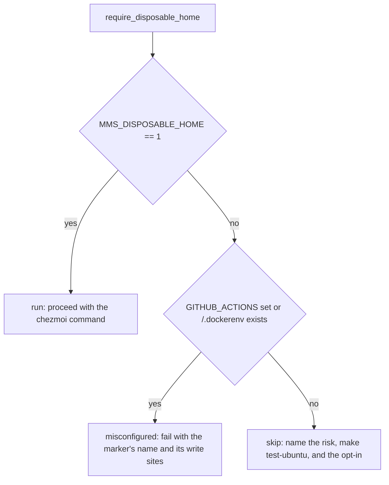

# Idempotency Suite Host-Home Guard - Plan

## Goal Capsule

- **Objective:** running any bats command that reaches `tests/idempotent.bats` on a developer workstation cannot overwrite that developer's live dotfiles or install packages, while the same four tests keep running for real in CI and in Docker.
- **Means:** an explicit repository-owned environment marker declares a `$HOME` disposable; the four tests refuse to run without it, and a separate assertion fails the suite when a disposable runner is missing the marker (KTD1, KTD2).
- **Authority:** this plan governs the how. `docs/issues/2026-08-21-004-idempotent-bats-applies-to-the-real-home-directory.md` governs the problem statement and its scope boundary. `CLAUDE.md` governs repository conventions and outranks this plan where they conflict.
- **Execution profile:** one bounded change to the test harness plus documentation and issue-lifecycle work. No production runtime code changes.
- **Stop conditions:** stop and report if the guard cannot be proven to leave the four tests unskipped under `make test-ubuntu`; stop if `python3 scripts/issues validate` fails after the closure.
- **Tail ownership:** the executing pipeline owns commits, the branch `fix/idempotent-real-home`, and the pull request. All work stays inside the existing worktree at `.worktrees/fix/idempotent-real-home` (KTD6).

---

## Product Contract

### Summary

Add a disposable-destination marker to the test harness. `tests/helpers/disposable-home.bash` holds a dependency-free predicate that answers one question: has this environment declared its `$HOME` disposable? `tests/idempotent.bats` calls a guard built on that predicate as the first statement of each of its four tests. On a workstation the four tests skip with a message naming the sanctioned command. In GitHub Actions and in Docker the marker is set, so the four tests run exactly as they do today. A separate unguarded test hard-fails when a platform fact says the environment is disposable but the repository marker is absent, so removing the marker from a runner turns the suite red instead of silently green.

### Problem Frame

`tests/idempotent.bats:18-37` runs four real chezmoi commands and passes only `--source`. `--source` selects where templates are read from. It does not select where they are written. `chezmoi dump-config` on this machine reports `destDir: /Users/andrew.b`, and `chezmoi apply --help` documents `-D, --destination path` with the same default. So `bats tests/idempotent.bats` typed at the repository root deploys the chezmoi source tree over the developer's live `~/.zshenv`, `~/.zshrc`, and every other managed path.

The blast radius is larger than dotfiles. `home/.chezmoiscripts/run_onchange_after_1-install-packages.sh.tmpl` installs Homebrew, runs `brew bundle`, clones Oh My Zsh and four plugins, and curl-pipes an installer. `home/.chezmoiscripts/darwin/run_once_after_macos-tunes.sh` calls `sudo defaults write` against the live machine. Those scripts address `$HOME` directly, not the chezmoi destination.

`CLAUDE.md` already forbids `chezmoi apply` on the host. The rule binds a human typing the command and is silently broken by the test suite. `Makefile` excludes the file from `make test-suite`, but that exclusion protects one entry point, and `bats tests/idempotent.bats` is the obvious thing to type.

The same four tests are correct in CI at `.github/workflows/test-dotfiles.yml:205` and `:325`, and in Docker at `docker/docker-compose.yml:62` and `:87`, where `$HOME` is disposable.

### Key Decisions

- Ship the fix and the issue closure in one pull request from the existing isolated worktree. (session-settled: user-directed — chosen over leaving the issue open without a shipped resolution: the user defined the closure as part of the deliverable.) Governs R9, R10.

### Requirements

**Host safety**

- R1. `tests/idempotent.bats` runs no `chezmoi apply`, `chezmoi diff`, or `chezmoi verify` command unless the environment has declared `$HOME` disposable through the repository's own marker.
- R2. The guard is the first statement in each of the four tests, so no chezmoi command executes on the skip path.
- R3. The guard reads only the repository marker. It reads neither `CI` nor `GITHUB_ACTIONS` nor `/.dockerenv`, so a developer who exports `CI` in their shell still gets a skip.
- R4. The skip message names three things: why the tests are inert, `make test-ubuntu` as the way to get the coverage, and the marker as the opt-in.

**Coverage preservation**

- R5. The four idempotency tests run unskipped in both CI jobs, in both Docker test services, and in the interactive Docker shell service.
- R6. The suite hard-fails when a platform fact reports a disposable environment and the repository marker is absent. The platform facts are `GITHUB_ACTIONS` (written by GitHub) and `/.dockerenv` (written by the container runtime), neither of which the repository can delete.
- R7. The marker's truth table is covered by tests that run on every host, so the file is never fully inert locally.
- R8. No file under `home/` exports the marker, so the repository cannot ship the opt-in onto a developer's machine.

**Documentation and issue lifecycle**

- R9. `Makefile`, its `test-suite` echo lines, `CLAUDE.md`, and the `tests/idempotent.bats` header describe the guard. No comment claims a mechanism that no longer holds.
- R10. Repository issue `2026-08-21-004` reaches `status: done` through `python3 scripts/issues start` then `python3 scripts/issues close --resolution`, and `python3 scripts/issues validate` passes afterwards.

### Scope Boundaries

**In scope:** `tests/idempotent.bats`, a new predicate helper, `tests/helpers/common.bash`, the four marker declaration sites, `Makefile`, `CLAUDE.md`, one architecture decision record, and the closure of issue `2026-08-21-004`.

**Out of scope:** the other four post-apply bats files, which read the deployed `$HOME` and mutate nothing.

**Deferred to Follow-Up Work:**

- Re-adding `tests/idempotent.bats` to `make test-suite`. The guard makes it safe, and doing so would converge the Makefile invocation with the other four sites. It stays deferred so the exclusion remains a second independent safety net until the guard has run in CI (KTD5).
- Consolidating the post-apply invocation. This change adds the marker as a sixth duplicated value across the sites enumerated in `docs/issues/2026-08-21-005-post-apply-suite-invocation-duplicated.md`. That issue owns the consolidation.
- A sandboxed local variant that applies into a temporary destination with scripts and externals excluded. It would unblock the cross-file parallelism deferred by `docs/plans/2026-08-20-2217-perf-parallel-bats-suite-plan.md`, and it is a separate piece of work with its own risk profile (KTD1).

### Sources

- `tests/idempotent.bats:5-12` — the file header stating that these tests mutate the shared `$HOME` other files read.
- `tests/helpers/common.bash:17-25` — `PATH_WITHOUT_OP`, which every chezmoi call in the suite must keep using, because templates call `onepasswordRead` and `op` blocks on authentication.
- `tests/templates.bats:617-647` — the repository's one existing safe real apply. It combines `--destination`, a generated throwaway `--config`, and a path-scoped target that excludes `.chezmoiscripts`. It is the precedent that shows how much scaffolding a safe apply needs.
- `tests/platform.bats:14` and `tests/scripts.bats:44-45` — the repository's skip idiom: predicate first, terse reason, and a comment naming the environmental cause.
- `tests/helpers/common.bash:74-81` — the one documented exception where this repository asserts instead of skipping, and the shape of the comment that records such an exception.
- `docs/solutions/design-patterns/gate-bias-follows-blast-radius.md` — a gate in front of a mutating stage skips when unsure, and a biased skip must be loud with a named reason.
- `docs/solutions/design-patterns/skip-set-parity-proves-reduced-dependencies.md` — bats exits 0 on skip, so a green suite is not proof of coverage; a new skip is a stated coverage reduction and CI must be shown to still run the tests.
- `docs/issues/2026-08-20-013-se-blocks-test-hard-fails-without-deps.md` — the repository's skip convention, and the rule that a local skip is acceptable only when CI asserts the precondition separately.
- `scripts/issues:461-477` — `close` requires `status: in-progress` and appends a `## Resolution` section.

---

## Assumptions

These were resolved to a recommended default because this run had no interactive user.

- A1. The marker is `MMS_DISPOSABLE_HOME` and only the exact value `1` enables the tests. This diverges from `MMS_CI_MINIMAL`, whose truthiness rule is "non-empty" (pinned at `tests/templates.bats:508`). A safety guard fails closed, so `MMS_DISPOSABLE_HOME=0` skips.
- A2. `make test-suite` keeps excluding `tests/idempotent.bats`.
- A3. The truth-table tests and the anti-rot test live in `tests/idempotent.bats`, co-located with the guard they protect.
- A4. The opt-in path keeps `--source="$CHEZMOI_SOURCE"`. On a workstation that resolves to the separate chezmoi clone, not this checkout, so the opt-in does not test the developer's branch. The skip message says so.
- A5. The residual risk of a self-hosted runner with a persistent `$HOME` is accepted and recorded in the decision record. No environment variable can distinguish that case, and this repository uses only GitHub-hosted runners today.
- A6. No `docs/solutions/` learning is written. The decision record plus the issue resolution carry the rationale, matching how comparable fixes landed in this repository.

---

## Planning Contract

### Key Technical Decisions

- KTD1. **Guard the environment; do not sandbox with `--destination`.** The four run scripts under `home/.chezmoiscripts/` hardcode `$HOME`, so a temporary destination does not contain their side effects. Worse, pairing `--destination` with a fresh `--config` resets the persistent-state bookkeeping in `~/.config/chezmoi/chezmoistate.boltdb` that currently keeps `run_onchange_after_*` inert, which would fire a Homebrew install and `sudo defaults write` against the real machine. This settles open decision 1 of issue `2026-08-21-004`. Governs R1.
- KTD2. **A positive repository-owned marker decides whether the tests run; platform facts only drive the anti-rot assertion.** Sniffing `CI` re-creates the original bug for any developer who exports it, and sniffing `/.dockerenv` re-creates it inside a long-lived dev container holding real work. `GITHUB_ACTIONS` and `/.dockerenv` are written by GitHub and by the container runtime, so the repository cannot delete them; that is what makes them non-circular ground truth for R6. Governs R3, R6.
- KTD3. **The predicate lives in a dependency-free file that `tests/helpers/common.bash` sources.** `common.bash` calls `load` and cannot be sourced outside bats, so a predicate defined there has an untestable truth table. A standalone `tests/helpers/disposable-home.bash` can be sourced from `bash -c` with a controlled environment. Governs R7.
- KTD4. **The guard is inline in each of the four tests, not in `setup_file` and not in `setup`.** A `skip` in `setup_file` skips every test in the file, including the anti-rot test and the truth-table tests, which is exactly the failure the skip-set-parity learning describes. A `skip` in `setup_file` also exits before the file-scope `BATS_NO_PARALLELIZE_WITHIN_FILE=true` assignment can be relied on, and it adds a bats-version dependency that inline placement does not. Governs R2, R7.
- KTD5. **`make test-suite` keeps its exclusion of `tests/idempotent.bats`.** The guard is now the primary protection; the exclusion becomes redundant defense. Two independent mechanisms in front of the most mutating thing in the suite matches the blast-radius bias in `docs/solutions/design-patterns/gate-bias-follows-blast-radius.md`. The Makefile comment is rewritten to say this, because the current comment states a reason that no longer holds. Governs R9.
- KTD6. **All work happens in the existing worktree at `.worktrees/fix/idempotent-real-home`.** (session-settled: user-directed — chosen over editing the primary checkout: the user required worktree isolation.)
- KTD7. **Hard failure, not a skip, is correct for the misconfigured case.** This repository's convention is to skip when a precondition is absent, with the one documented exception at `tests/helpers/common.bash:74-81`. A disposable runner missing the repository marker is not a missing developer tool; it is a repository misconfiguration that silently removes coverage. The exception is recorded in a comment at the guard, in the same shape as the existing one. Governs R6.
- KTD8. **`chezmoi verify` skips with the other three.** It is read-only and safe on a host, but running it there asserts against the chezmoi clone rather than the checkout, which is a weaker and different claim. Uniform treatment plus a one-line reason stops a future reader from re-enabling it. Governs R1.

### High-Level Technical Design

The predicate returns one of three verdicts. The marker decides whether the tests run. The platform facts decide whether a missing marker is a workstation (skip) or a misconfigured runner (fail).

Marker write sites, as a checklist:

| Site | Where | Value |
|---|---|---|
| `.github/workflows/test-dotfiles.yml` | top-level `env:` block | unconditional `"1"` |
| `docker/docker-compose.yml` | service `ubuntu` | `MMS_DISPOSABLE_HOME=1` |
| `docker/docker-compose.yml` | service `test-quick` | `MMS_DISPOSABLE_HOME=1` |
| `docker/docker-compose.yml` | service `test-full` | `MMS_DISPOSABLE_HOME=1` |

The workflow value must not copy the trigger-conditional expression used by `MMS_CI_MINIMAL` at `.github/workflows/test-dotfiles.yml:38`. A conditional marker would leave the nightly `schedule` and `workflow_dispatch` runs silently skipping.

### Sequencing

U1 defines the predicate and the guard. U2 declares the marker at all four runner sites, and must land before or with U3 so that the first CI run of U3's anti-rot test finds the marker present. U3 applies the guard and adds the tests. U4 repairs the prose that U3 makes stale. U5 records the rejected alternative. U6 closes the issue last, because its resolution text cites the verification results.

### Risks

- The anti-rot test is the whole of R6. If it is written to read the same variable the guard reads, it proves nothing. Its two limbs must be `GITHUB_ACTIONS` and `/.dockerenv`.
- A self-hosted GitHub runner with a persistent `$HOME` would inherit the workflow marker and be clobbered. No environment variable distinguishes it. Recorded in U5, accepted.
- `make lint` matches `*.sh` and `home/run_*`, so it does not shellcheck `tests/helpers/disposable-home.bash`. The truth-table tests in U3 are that file's coverage.

---

## Implementation Units

### U1. Disposable-destination predicate and guard

- **Goal:** one dependency-free predicate answering whether this environment declared `$HOME` disposable, plus the guard the tests call.
- **Requirements:** R1, R2, R3, R4, R7. Cites KTD2, KTD3, KTD7.
- **Dependencies:** none.
- **Files:** create `tests/helpers/disposable-home.bash`; modify `tests/helpers/common.bash`.
- **Approach:**
  1. In `tests/helpers/disposable-home.bash`, define `mms_disposable_home_verdict` taking no arguments and echoing `run`, `skip`, or `misconfigured`. It reads `MMS_DISPOSABLE_HOME` for the run verdict, and `GITHUB_ACTIONS` plus the existence of `/.dockerenv` to separate `misconfigured` from `skip`. The file defines functions only, uses no bats helper, and is safe to `source` from a plain `bash -c`.
  2. Comment at the predicate why the truth rule is exact-match `1` while `MMS_CI_MINIMAL` treats any non-empty value as true (A1), and why the platform facts are read here but never used to grant the run verdict (KTD2).
  3. In `tests/helpers/common.bash`, source the new file next to the existing helper loads, and define `require_disposable_home` beside `skip_if_no_chezmoi` at `tests/helpers/common.bash:134-138`. It calls `skip` with the R4 message on `skip`, and `fail` with the marker name and its four write sites on `misconfigured`.
  4. Carry the assert-over-skip exception comment on `require_disposable_home`, in the shape used at `tests/helpers/common.bash:74-81` (KTD7).
- **Patterns to follow:** `skip_if_no_chezmoi()` for helper naming and placement; `assert_python3_available()` for how a documented exception to the skip convention is written.
- **Test scenarios:** covered by U3, which owns the truth-table tests. `Test expectation: none in this unit -- the predicate has no observable behavior until U3 calls it.`
- **Verification:** `tests/helpers/disposable-home.bash` sources cleanly under `bash -c` with no bats environment present, and `bats tests/smoke.bats` still passes, proving `common.bash` was not broken by the new source line.

### U2. Declare the marker at every disposable runner

- **Goal:** every environment whose `$HOME` is disposable says so.
- **Requirements:** R5.
- **Dependencies:** U1 (for the variable name).
- **Files:** `.github/workflows/test-dotfiles.yml`, `docker/docker-compose.yml`.
- **Approach:**
  1. Add `MMS_DISPOSABLE_HOME: "1"` to the workflow's top-level `env:` block, unconditionally. Comment that it must not become trigger-conditional, naming the nightly `schedule` run as what a conditional value would silently disable.
  2. Add `MMS_DISPOSABLE_HOME=1` to the `environment:` list of all three compose services: `ubuntu`, `test-quick`, and `test-full`. Note in a comment that this differs from `MMS_CI_MINIMAL`, which is deliberately absent from `test-quick`.
- **Patterns to follow:** the existing `env:` entries in the workflow and the `environment:` lists in `docker/docker-compose.yml:12-19`, `:31-43`, `:73-77`.
- **Test scenarios:** `Test expectation: none -- configuration declaration with no behavior of its own; U3's anti-rot test is what fails when a site is missed.`
- **Verification:** `grep -c MMS_DISPOSABLE_HOME docker/docker-compose.yml` reports three, and the workflow carries exactly one unconditional declaration.

### U3. Guard the four tests and prove the guard

- **Goal:** the four chezmoi commands run only under the marker, and the guard's own behavior is tested.
- **Requirements:** R1, R2, R4, R6, R7, R8. Cites KTD4, KTD8.
- **Dependencies:** U1, U2.
- **Files:** `tests/idempotent.bats`.
- **Approach:**
  1. Call `require_disposable_home` as the first statement of each of the four tests at `tests/idempotent.bats:18-37`. Do not add a `setup()` or a `setup_file()` (KTD4).
  2. Leave `BATS_NO_PARALLELIZE_WITHIN_FILE=true` at file scope. It is requirement R3 of `docs/plans/2026-08-20-2217-perf-parallel-bats-suite-plan.md` and the tests still mutate the shared `$HOME` wherever the marker is set.
  3. Rewrite the file header at `tests/idempotent.bats:5-12` to state the guard, why `--no-parallelize-across-files` is still needed at the five invocation sites, and that the destination is `$HOME` rather than anything `--source` controls.
  4. Add the new tests below, all unguarded, so the file carries real assertions on every host.
- **Patterns to follow:** `tests/platform.bats:14` for the terse skip reason; `tests/scripts.bats:44-45` for a comment naming the environmental cause above a guard.
- **Test scenarios:**
  - Predicate truth table, `MMS_DISPOSABLE_HOME=1` with no platform fact available: verdict is `run`.
  - Predicate truth table, `MMS_DISPOSABLE_HOME` unset, `GITHUB_ACTIONS` unset, `/.dockerenv` absent: verdict is `skip`.
  - Predicate truth table, `MMS_DISPOSABLE_HOME=""`: verdict is not `run`.
  - Predicate truth table, `MMS_DISPOSABLE_HOME=0`: verdict is not `run`, proving the guard fails closed against the `MMS_CI_MINIMAL` truthiness rule.
  - Predicate truth table, `MMS_DISPOSABLE_HOME=true`: verdict is not `run`, proving exact-match `1`.
  - Predicate truth table, `CI=1` and `MMS_DISPOSABLE_HOME` unset, no other signal: verdict is not `run`. This is the developer-exports-`CI` case.
  - Predicate truth table, `GITHUB_ACTIONS=true` and `MMS_DISPOSABLE_HOME` unset: verdict is `misconfigured`.
  - Anti-rot, live environment: when `GITHUB_ACTIONS` is set or `/.dockerenv` exists, `MMS_DISPOSABLE_HOME` equals `1`; otherwise the test fails with a message naming the four write sites. This test is never skipped.
  - Premise check: when the marker is set, `chezmoi dump-config --format=json` reports a `destDir` equal to `$HOME`, so the marker's claim covers what chezmoi will actually write to.
  - Repository hygiene: no file under `home/` exports `MMS_DISPOSABLE_HOME`, so the opt-in cannot be deployed onto a developer's machine.
  - Skip message content: the message emitted on the skip path names `make test-ubuntu` and `MMS_DISPOSABLE_HOME`.
- **Verification:** on a macOS host with the marker unset, `bats tests/idempotent.bats` reports four skips and passes every other test in the file, and `chezmoi dump-config` shows no managed file changed. Under `make test-ubuntu` the same four tests report `ok`, not skipped.

### U4. Repair the prose the guard makes stale

- **Goal:** no comment or table row describes a mechanism that no longer holds.
- **Requirements:** R9. Cites KTD5.
- **Dependencies:** U3.
- **Files:** `Makefile`, `CLAUDE.md`.
- **Approach:**
  1. Rewrite the `test-suite` comment at `Makefile:45-62`. The exclusion stays, and the comment says it is now redundant defense behind the in-file guard, rather than the only thing keeping the target host-safe.
  2. Update the three `@echo` lines under `test-suite` to match. The existing second caveat about asserting against the already-applied `~/` stays; it is unrelated and still true.
  3. Update the `make test-suite` row in the `CLAUDE.md` command table and the test guidance block that names `tests/idempotent.bats`, so both describe the guard and the marker.
- **Patterns to follow:** the existing `Makefile:45-62` comment, which pairs a rationale comment with a runtime `@echo` because a caveat that lives only in a comment reaches nobody.
- **Test scenarios:** `Test expectation: none -- documentation only. Correctness is read, not executed.`
- **Verification:** `make test-suite` prints the new caveat text and still runs four files; `AGENTS.md` reflects the change automatically, since it is a symlink to `CLAUDE.md`.

### U5. Record the rejected sandbox alternative

- **Goal:** a future reader who proposes `--destination` finds the reason it was rejected before spending the work.
- **Requirements:** supports KTD1, KTD2, A5.
- **Dependencies:** U1.
- **Files:** create `docs/decisions/0002-guard-the-idempotency-suite-with-a-disposable-home-marker.md`.
- **Approach:** write a minimal architecture decision record with `Context`, `Considered options`, and `Decision` sections, as `CLAUDE.md` requires. Considered options are the environment marker, the `--destination` sandbox, and a Makefile-only boundary. The decision records that run scripts hardcode `$HOME`, that a fresh `--config` would re-fire them against the real machine, and that a self-hosted runner with a persistent `$HOME` is an accepted residual risk.
- **Patterns to follow:** `docs/decisions/0001-se-pipeline-architecture-redirection.md` for numbering, filename shape, and section structure.
- **Test scenarios:** `Test expectation: none -- a decision record has no executable behavior.`
- **Verification:** the record names all three options and states why each was rejected or chosen.

### U6. Close repository issue 2026-08-21-004

- **Goal:** the issue reaches `status: done` with a resolution that corrects the stale facts in its body.
- **Requirements:** R10. Cites the Product Contract Key Decision governing R9 and R10.
- **Dependencies:** U1, U2, U3, U4, U5, and the Verification Contract gates.
- **Files:** `docs/issues/2026-08-21-004-idempotent-bats-applies-to-the-real-home-directory.md` (rewritten by the CLI, never edited by hand).
- **Approach:**
  1. Run `python3 scripts/issues start 2026-08-21-004`. `close` rejects an issue in `status: open` with `INVALID_TRANSITION`, so this step is mandatory, not optional.
  2. Run `python3 scripts/issues close 2026-08-21-004 --resolution "<text>"`.
  3. The resolution text answers both open decisions in the issue, and corrects two stale facts in its body: the CI references are `.github/workflows/test-dotfiles.yml:205` and `:325`, not `:107` and `:156`; and the claim that every other chezmoi-stateful test uses `chezmoi_test_init()` is wrong, since that helper has no callers and the real pattern is `write_test_config()` with `--config` and `--destination`.
  4. Run `python3 scripts/issues validate`.
- **Patterns to follow:** `.claude/skills/repository-issues/SKILL.md` — use the CLI for every lifecycle change; never edit frontmatter or filenames by hand. `docs/issues/_open-issues.md` is curated prose and is not an index to regenerate.
- **Test scenarios:**
  - After the closure, `python3 scripts/issues show 2026-08-21-004 --json` reports `status: done`, a `closed` date matching `^\d{4}-\d{2}-\d{2}$`, and a body containing a `## Resolution` heading.
  - `python3 -m unittest tests/test_issues.py` passes, including `test_real_corpus_is_strictly_valid`.
- **Verification:** `make test-issues` exits zero.

---

## Verification Contract

| Gate | Command | What it proves | Units |
|---|---|---|---|
| Host safety | `bats tests/idempotent.bats` on the macOS host with `MMS_DISPOSABLE_HOME` unset | the four chezmoi tests skip; the truth-table, anti-rot, premise, and hygiene tests pass; no managed file changes | U1, U3 |
| Host cleanliness | `make test-local` before and after the host run | `chezmoi diff` output is unchanged, so the guarded run wrote nothing | U3 |
| Full apply path | `make test-ubuntu` | the five-file suite runs in Docker with the marker set, and the four idempotency tests report `ok` rather than skipped | U2, U3 |
| Marker completeness | `make test-docker` | the `test-full` service also carries the marker | U2 |
| Issue corpus | `make test-issues` | the closed issue validates strictly and the 32 issue tests pass | U6 |
| Shell lint | `make lint` | no shellcheck regression in the scripts lint already covers | U1 |

`make test-suite` is not a gate for this change. It excludes `tests/idempotent.bats` and applies nothing, so it cannot see the work.

---

## Definition of Done

**Global**

- Every gate in the Verification Contract has been run and passed, with `make test-ubuntu` explicitly showing the four idempotency tests unskipped.
- No file outside the Scope Boundaries list was modified.
- All work landed in the worktree at `.worktrees/fix/idempotent-real-home` on branch `fix/idempotent-real-home`.
- No abandoned or experimental code remains in the diff.
- The pull request description states the destination-versus-source cause, the marker mechanism, the coverage the guard preserves, and the accepted self-hosted-runner residual risk, without referring to this plan's unit IDs.

**Per unit**

| Unit | Done when |
|---|---|
| U1 | `tests/helpers/disposable-home.bash` sources under a bare `bash -c`, and `require_disposable_home` exists in `tests/helpers/common.bash` with its exception comment |
| U2 | the marker is declared once unconditionally in the workflow and once in each of the three compose services |
| U3 | the four tests carry the guard as their first statement, every scenario in U3's list has a passing test, and the file header is rewritten to describe the guard and why `--no-parallelize-across-files` is still needed at the five invocation sites |
| U4 | no comment or table row in `Makefile` or `CLAUDE.md` describes the pre-guard mechanism |
| U5 | `docs/decisions/0002-*.md` exists with `Context`, `Considered options`, and `Decision` |
| U6 | `python3 scripts/issues show 2026-08-21-004 --json` reports `status: done` and `make test-issues` exits zero |
