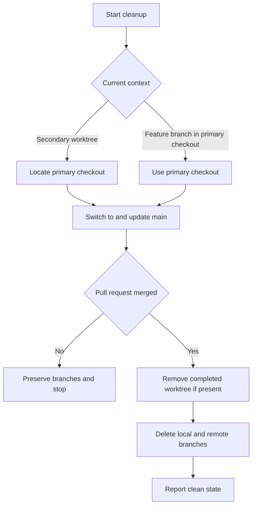
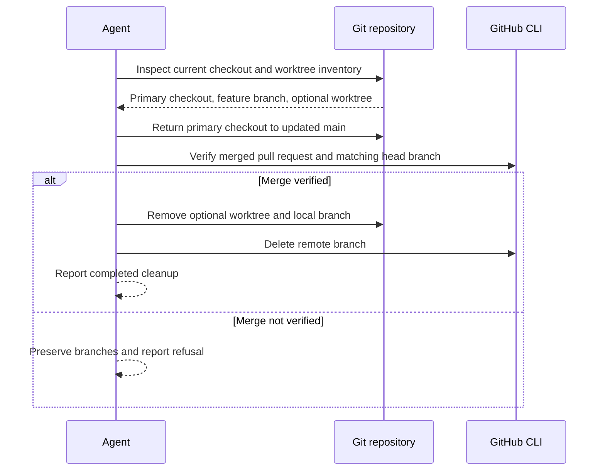

# Post-Merge Cleanup Skill - Plan

## Goal Capsule

- **Objective:** An agent can finish merged branch or worktree work by returning the repository to an updated `main` checkout and removing the completed work context.
- **Means:** Add an instruction-first `/se-cleanup` skill without a Bash helper in the first version (KTD1).
- **Product authority:** The Product Contract in this plan governs scope. It narrows the broader automation proposed in `docs/issues/2026-08-22-002-add-se-cleanup-post-merge-skill.md`.
- **Execution profile:** One small skill contract plus metadata and deployment checks.
- **Stop conditions:** Stop destructive cleanup when the pull request is not merged or its merged state cannot be verified.
- **Tail ownership:** The implementing agent verifies the skill contract and the deployed chezmoi output. The user applies the committed chezmoi change on the host later.

---

## Product Contract

### Summary

`/se-cleanup` guides an agent through post-merge cleanup from either a secondary worktree or a feature branch in the primary checkout.
The skill returns work to an updated `main`, removes the completed worktree when present, and deletes the local and remote feature branches after confirming the pull request was merged.

### Problem Frame

Post-merge cleanup currently depends on repeated manual Git and GitHub commands.
The useful outcome is a clean, current primary checkout without a completed worktree or stale feature branches.
The skill should give the agent a small decision tree instead of implementing an exhaustive cleanup system.

### Key Decisions

- **Use agent instructions as the primary mechanism.** (session-settled: user-directed — chosen over full Bash automation: the agent only needs a clear worktree-or-branch algorithm.) Governs R1, R2, R3, R9.
- **Delete both local and remote feature branches.** (session-settled: user-directed — chosen over local-only deletion: completed merged work should leave no stale branch.) Governs R6.
- **Protect the remote branch with a merged-PR gate.** (session-settled: user-directed — chosen over unconditional deletion: the remote branch must not be lost before merge.) Governs R5, R6, R7.

### Requirements

**Context selection**

- R1. The skill must determine whether the agent is working in a secondary worktree or on a feature branch in the primary checkout.
- R2. From a secondary worktree, the agent must locate the primary checkout and perform the remaining cleanup from there.
- R3. From a feature branch in the primary checkout, the agent must use that checkout for the remaining cleanup.

**Return to `main`**

- R4. The agent must switch the primary checkout to `main` and update it from its upstream before deleting completed work.

**Cleanup safety and outcome**

- R5. Before branch deletion, the agent must verify that the pull request associated with the feature branch is merged.
- R6. After R5 succeeds, the agent must remove the completed secondary worktree when one exists and delete both the local and remote feature branches.
- R7. If the merged-pull-request check fails, the agent must preserve both feature branches and report why cleanup stopped.
- R8. The skill must finish with a concise report of the updated checkout and removed worktree and branches.

**Automation boundary**

- R9. Bash automation is optional and must be limited to repeated steps that remain reliable across both entry contexts; the skill instructions retain the decision flow.

### Key Flow

- F1. Post-merge cleanup
  - **Trigger:** The agent invokes `/se-cleanup` after merge.
  - **Steps:** Resolve the entry context, move cleanup to the primary checkout, update `main`, verify the merge, and remove completed work.
  - **Outcome:** The primary checkout is current and the completed worktree and feature branches are absent.
  - **Covered by:** R1-R8.

### Acceptance Examples

- AE1. **Covers R1, R2, R4, R5, R6, R8.** Given the agent starts in a secondary worktree whose pull request is merged, when cleanup completes, the primary checkout is on updated `main` and the worktree plus both feature branches are removed.
- AE2. **Covers R1, R3, R4, R5, R6, R8.** Given the agent starts on a feature branch in the primary checkout whose pull request is merged, when cleanup completes, that checkout is on updated `main` and both feature branches are removed.
- AE3. **Covers R5, R7.** Given the associated pull request is not merged or cannot be confirmed as merged, when cleanup reaches the safety gate, both feature branches remain and the agent reports that cleanup stopped.

### Scope Boundaries

- The skill does not need to automate every Git or GitHub operation through Bash.
- The skill does not need an exhaustive recovery system for every malformed repository, upstream, or worktree state.
- The skill covers post-merge cleanup only. Merging the pull request is outside scope.

### Sources / Research

- `docs/issues/2026-08-22-002-add-se-cleanup-post-merge-skill.md` records the original cleanup problem and broader initial scope.
- `home/private_dot_claude/skills/pf-build/SKILL.md` demonstrates removing secondary worktrees through the main checkout.
- `home/private_dot_claude/skills/se-work/SKILL.md` and `home/private_dot_claude/skills/se-flow/SKILL.md` demonstrate skill instructions that delegate only suitable mechanics to code.

---

## Planning Contract

**Product Contract preservation:** Product Contract unchanged.

### Key Technical Decisions

- KTD1. **Ship an instruction-only first version.** (session-settled: user-approved — chosen over adding a Bash helper now: the command sequence is small and the agent must retain context-dependent judgment.) The skill contains the complete algorithm and invokes standard Git and GitHub CLI operations directly. Governs R1-R9.
- KTD2. **Resolve context from Git worktree metadata.** The skill uses Git's worktree inventory to distinguish the primary checkout from a linked worktree instead of inferring from directory names. Governs R1-R3.
- KTD3. **Use GitHub as the merge authority.** The skill verifies merged pull-request state and feature-head identity before any branch deletion. A missing or ambiguous result fails closed. Governs R5-R7.
- KTD4. **Test packaging, not prose implementation.** Generic metadata validation and deployment smoke coverage prove the skill is valid and installed. Tests do not pin command strings or Markdown wording. Governs R8-R9.

### High-Level Technical Design

The skill is the orchestrator. Git supplies checkout and worktree state. The GitHub CLI supplies pull-request merge state. No new workflow engine or helper process is introduced.

### Implementation Constraints

- Add managed Claude configuration only under `home/`. Do not edit the live `~/.claude` copy.
- Do not run `chezmoi apply` on the host. Use Docker verification to prove the managed file deploys.
- Keep the skill self-contained. Do not add a shared abstraction for one cleanup flow.
- Use non-forcing worktree and branch removal in the documented happy path. The scope does not authorize discarding dirty work.

### Sequencing

1. Define the instruction-first skill contract.
2. Add the skill to deployment smoke coverage.
3. Run template and Docker verification against the managed checkout.

---

## Implementation Units

### U1. Add the post-merge cleanup contract

- **Goal:** Add the `/se-cleanup` skill with an explicit worktree-or-branch flow and a fail-closed merge gate.
- **Requirements:** R1-R9, F1, AE1-AE3; KTD1-KTD3.
- **Dependencies:** None.
- **Files:**
  - Create `home/private_dot_claude/skills/se-cleanup/SKILL.md`.
- **Approach:**
  1. Add skill metadata that makes `/se-cleanup` discoverable for post-merge work.
  2. Instruct the agent to capture the feature branch before switching context.
  3. Define separate entry paths for a linked worktree and a feature branch in the primary checkout per KTD2.
  4. Return the primary checkout to its upstream `main` with fast-forward-only update semantics.
  5. Apply KTD3 before any local or remote branch deletion.
  6. Remove the linked worktree when present, delete the local branch, delete the remote branch, and report the observed result.
- **Patterns to follow:** Use the concise instruction style in `home/private_dot_claude/skills/eli5/SKILL.md`. Follow the primary-checkout worktree removal pattern in `home/private_dot_claude/skills/pf-build/SKILL.md`.
- **Test scenarios:**
  - Covers F1 / AE1. A skill-contract fixture with a linked-worktree entry path reaches primary-checkout update, merged-state verification, worktree removal, and both branch deletions in that order.
  - Covers F1 / AE2. A skill-contract fixture with a primary-checkout feature branch skips worktree removal but keeps update, merge verification, and both branch deletions.
  - Covers AE3. The contract places the merged-state refusal before every branch deletion instruction and preserves branches when verification fails.
  - An ambiguous GitHub result follows the same refusal path as an unmerged pull request.
  - The skill contains no invocation of a new Bash helper or workflow engine.
- **Verification:** Manual review confirms one readable decision tree, one safety gate, and no destructive path that bypasses it.

### U2. Prove chezmoi deploys the skill

- **Goal:** Ensure the new managed skill reaches the deployed Claude skill directory.
- **Requirements:** R8, R9; KTD4.
- **Dependencies:** U1.
- **Files:**
  - Modify `tests/smoke.bats`.
- **Approach:** Add the new skill path to the existing managed-skill deployment manifest instead of creating a separate existence test.
- **Patterns to follow:** Extend the `agent skills are deployed with their scripts and references` manifest in `tests/smoke.bats`.
- **Test scenarios:**
  - A disposable chezmoi apply installs `skills/se-cleanup/SKILL.md` under the test home.
  - The existing YAML-description validation accepts the new skill metadata.
- **Verification:** The post-apply smoke suite finds the skill in the disposable home and reports no missing managed skill files.

---

## Verification Contract

| Gate | Command | Proves | Units |
|---|---|---|---|
| Template safety | `make test-templates` | The chezmoi source remains renderable. | U1, U2 |
| Full disposable apply | `make test-ubuntu` | Chezmoi deploys the skill and the complete smoke suite passes without touching the host configuration. | U1, U2 |
| Static shell quality | `make lint` | Existing shell and Bats changes satisfy repository lint rules. | U1, U2 |

A host `make test-suite` run is not sufficient for this change because it reads the already-deployed home directory and does not apply edits from `home/`.

---

## Definition of Done

- `/se-cleanup` is discoverable from its skill metadata and implements the instruction-first flow in KTD1.
- Both entry contexts satisfy AE1 and AE2 without duplicating the destructive safety rule.
- Pull-request state that is unmerged, missing, or ambiguous satisfies AE3 and preserves both branches.
- Local and remote branch deletion occur only after the merged-state gate succeeds.
- Generic skill metadata validation and managed deployment smoke coverage pass.
- `make test-templates`, `make lint`, and `make test-ubuntu` pass.
- The Product Contract remains unchanged and all R/F/AE links remain valid.
- No Bash helper, general Git recovery framework, or abandoned experimental cleanup code remains in the diff.
