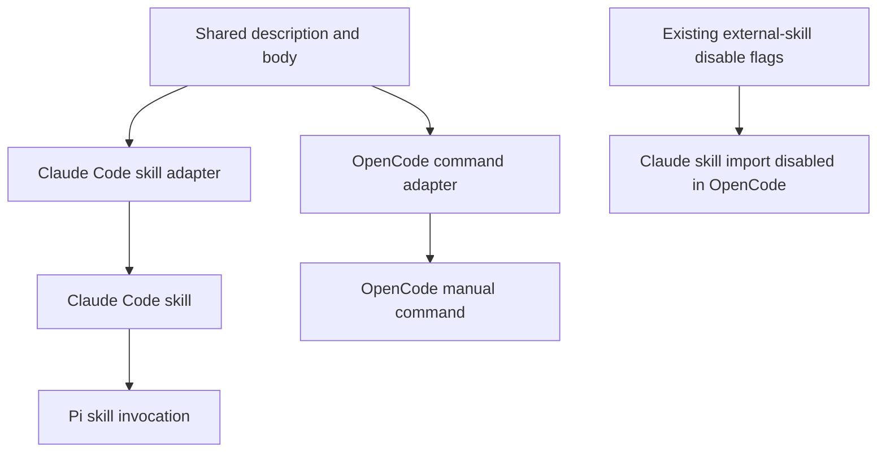

# Preserve Explicit-Only Skills Across Agent Clients - Plan

## Goal Capsule

- **Objective:** Give explicit-only workflows one reusable source while preserving manual-only invocation in Claude Code, OpenCode, and Pi.
- **Product authority:** This Product Contract governs scope; the source issue records its provenance.
- **Product Contract preservation:** Clarified without scope change; planning resolved the deferred template layout and test placement.
- **Execution profile:** Three ordered units: package the workflows, protect the invocation contract, then document the convention.
- **Stop conditions:** Stop if raw includes cannot preserve the current workflow bodies, OpenCode commands become model-discoverable, or the managed startup flags no longer control OpenCode skill discovery.
- **Tail ownership:** The implementation owner runs the disposable-home verification and leaves the requirements, adapters, tests, and documentation consistent.

---

## Product Contract

### Summary

Create a reusable chezmoi template mechanism for workflows that must run only after a user request.
Migrate `eli5` and `open-questions` so Claude Code and Pi receive skills while OpenCode receives manual commands rather than model-discoverable skills.

### Problem Frame

`eli5` and `open-questions` interrupt the current task, so automatic model invocation would violate their purpose.
Claude Code and Pi honor `disable-model-invocation: true`, but OpenCode does not interpret that metadata.
This repository already disables OpenCode's automatic import of Claude Code and other external skills, so OpenCode sees only skills deliberately exposed through its native skill paths.
Copying workflow instructions into OpenCode commands would preserve invocation behavior but create independent content that can drift.

### Key Decisions

- **Share each workflow's description and body through chezmoi templates.** (session-settled: user-approved — chosen over treating the complete Claude Code skill as canonical: client-specific metadata must not leak into the shared content.) Governs R1, R2.
- **Provide a reusable template library rather than a two-workflow patch.** (session-settled: user-directed — chosen over supporting only `eli5` and `open-questions`: future explicit-only workflows must follow the same packaging contract.) Governs R3.
- **Keep the mechanism template-based rather than manifest-generated.** (session-settled: user-approved — chosen over a registry and generator: visible adapters are easier to maintain and diagnose.) Governs R3, R4, R6.
- **Keep Pi's native skill invocation.** (session-settled: user-approved — chosen over separate Pi prompt templates: Pi already honors the shared Claude Code skill metadata.) Governs R5.
- **Document the convention in active agent guidance and the setup inventory.** (session-settled: user-approved — chosen over an Architecture Decision Record alone: future agents must encounter the rule during ordinary work.) Governs R9.
- **Use one focused contract test.** (session-settled: user-approved — chosen over per-client integration and rendered-content parity tests: the test should protect invocation boundaries without retesting client runtimes.) Governs R10.

### Requirements

**Canonical content and reuse**

- R1. Each explicit-only workflow must have one canonical description and one canonical instruction body shared by its Claude Code skill and OpenCode command; Pi consumes the Claude Code skill.
- R2. Client-facing files may add invocation metadata, but they must not maintain independent copies of the shared description or instruction body or alter literal Markdown and command syntax unintentionally.
- R3. The mechanism must support another explicit-only workflow through the same template convention without adding a manifest, custom generator, or new packaging architecture.

**Client behavior**

- R4. Claude Code must receive each workflow as a skill with `disable-model-invocation: true`.
- R5. Pi must continue reading shared Claude Code skills and invoking these workflows through `/skill:<name>`.
- R6. OpenCode must receive each workflow as a manually invoked command and must not receive a corresponding native skill adapter.
- R7. The existing OpenCode startup environment that disables automatic Claude Code and external skill discovery must remain part of the explicit-only packaging contract.

**Migration, guidance, and verification**

- R8. `eli5` and `open-questions` must migrate without changing their workflow instructions, Claude Code invocation, or Pi invocation; OpenCode gains the new manual commands.
- R9. `AGENTS.md` and `docs/agent-setup-inventory.md` must explain ownership, client packaging, and the update procedure for explicit-only workflows.
- R10. One focused Bats contract case must verify the OpenCode manual commands, reject corresponding OpenCode native skill adapters, preserve `disable-model-invocation: true` in the Claude Code skills, and retain the existing external-skill disable flags; existing tests continue to own general Claude Code deployment and Pi shared-skill configuration.

### Key Flows

- F1. Add or update an explicit-only workflow.
  - **Trigger:** A contributor changes an existing explicit-only workflow or adds another one.
  - **Steps:** The contributor changes the canonical description and body, adds or updates the client adapters, and keeps the workflow out of OpenCode's native skill paths.
  - **Outcome:** Every supported client receives the same workflow content with its required invocation semantics.
  - **Covers:** R1-R9.
- F2. Invoke an explicit-only workflow.
  - **Trigger:** The user explicitly selects the workflow in an agent client.
  - **Steps:** Claude Code or Pi loads the skill, while OpenCode expands the manual command.
  - **Outcome:** The workflow runs only after the user's request and receives the canonical instruction body.
  - **Covers:** R4-R7.

### Acceptance Examples

- AE1. **Covers R1, R2, R8.** Given `eli5` is packaged for Claude Code and OpenCode, when its canonical body changes, then both rendered client files receive that change without editing two instruction bodies or unintentionally expanding literal command syntax.
- AE2. **Covers R4-R7.** Given OpenCode inherits the managed startup environment, when each client discovers available workflows, then Claude Code and Pi retain explicit-only skill behavior while OpenCode exposes a manual command without exposing a native `eli5` or `open-questions` skill.
- AE3. **Covers R3, R9.** Given a future explicit-only workflow, when an agent follows the repository guidance, then the workflow uses the same shared-template and client-adapter convention without introducing a generator.
- AE4. **Covers R10.** Given the repository test suite, when an invocation guard, OpenCode command, OpenCode skill boundary, or external-skill disable flag regresses, then the focused contract case fails.

### Scope Boundaries

- Do not add Pi prompt templates or rename Pi invocation commands.
- Do not add a workflow manifest, schema, or custom generator.
- Do not run Claude Code, OpenCode, or Pi as part of the new test.
- Do not add rendered-content parity tests or duplicate existing Claude Code and Pi deployment assertions.
- Do not change the behavior or wording of `eli5` and `open-questions` except for final-newline normalization required by templates.

### Dependencies and Assumptions

- Supported OpenCode sessions inherit the managed zsh startup environment containing `OPENCODE_DISABLE_EXTERNAL_SKILLS` and `OPENCODE_DISABLE_CLAUDE_CODE_SKILLS`.
- OpenCode continues to honor those flags when discovering skills.
- OpenCode commands remain user-invoked and are not included in the model's available-skills context.
- Pi continues to honor `disable-model-invocation: true` and the configured `~/.claude/skills` source.
- Chezmoi templates can render the shared description and body into both client-specific formats.

### Sources and Research

- `home/private_dot_claude/skills/eli5/SKILL.md` and `home/private_dot_claude/skills/open-questions/SKILL.md` define the current workflows.
- `home/dot_pi/agent/modify_settings.json` configures Pi to read `~/.claude/skills`.
- `home/dot_zshenv.tmpl` disables OpenCode discovery of Claude Code and external skills.
- `home/private_dot_config/opencode/skills/` demonstrates the repository's curated native-skill exposure pattern.
- `tests/smoke.bats` and `tests/scripts.bats` contain the existing Claude Code deployment and Pi shared-skill checks.
- OpenCode skill discovery and command behavior were verified against [`anomalyco/opencode@3a31c4e`](https://github.com/anomalyco/opencode/tree/3a31c4ea801915c0b050df4b3842997ea62b6e93).
- Pi skill metadata and manual invocation were verified against [`earendil-works/pi@309b524`](https://github.com/earendil-works/pi/tree/309b524f4fc10ad7005c8ff41d834203b8d37121).

---

## Planning Contract

### Key Technical Decisions

- KTD1. **Use four flat canonical files under `home/.chezmoitemplates/`.** Store one description text file and one Markdown body file for each workflow, named with an `explicit-only-<workflow>-` prefix. Each adapter passes the explicit source-root-relative `.chezmoitemplates/<file>` path to chezmoi's raw `include` function, because raw inclusion preserves literal Go-template and command syntax. (session-settled: user-approved — chosen over treating the complete Claude Code skill as canonical: client-specific metadata must not leak into shared content.) Governs R1-R3, R8.
- KTD2. **Render thin native adapters for Claude Code and OpenCode.** Rename each Claude `SKILL.md` source to `SKILL.md.tmpl`, add one OpenCode command template per workflow, remove one final newline from the raw shared description before YAML quoting it, and raw-include the shared body. Pi receives no adapter because it consumes the deployed Claude Code skill. (session-settled: user-approved — chosen over a registry and generator: visible adapters are easier to maintain and diagnose.) Governs R1-R6, R8.
- KTD3. **Keep OpenCode isolation at the existing startup boundary.** Preserve both discovery-disable exports in `home/dot_zshenv.tmpl` and do not add OpenCode skill symlinks or direct skill directories for these workflows. Per-skill permissions are unnecessary because the managed environment already disables Claude Code and external skill import. Governs R6, R7.
- KTD4. **Protect the deployed invocation contract with one smoke case.** Add one loop-based case to `tests/smoke.bats` that checks both workflows after chezmoi applies the checkout in a disposable home. This catches deployment-path errors that source rendering alone cannot prove. (session-settled: user-approved — chosen over per-client integration and rendered-content parity tests: the test protects invocation boundaries without retesting client runtimes.) Governs R10.

### High-Level Technical Design

The canonical files are data even though they live under `.chezmoitemplates`: adapters read them with `include`, which returns literal contents. `includeTemplate` remains appropriate for existing shared content that intentionally executes Go-template syntax, but it is not used for explicit-only workflow bodies.

The Claude Code adapter owns `name`, the YAML-quoted shared description, and `disable-model-invocation: true`. The OpenCode adapter owns only command frontmatter plus the same shared description and body. Pi continues through `home/dot_pi/agent/modify_settings.json` without a file change.

OpenCode isolation has two independent parts. `home/dot_zshenv.tmpl` prevents automatic external skill discovery, while the absence of `eli5` and `open-questions` under OpenCode's native skill directory prevents deliberate model exposure. The manual command directory remains outside the model's available-skills context.

### System-Wide Impact

- **Deployment propagation:** Claude Code receives each rendered skill, Pi reaches the same deployed skill through its configured shared path, and OpenCode receives an additive manual command. No existing target path changes for Claude Code or Pi.
- **Failure propagation:** An invalid Claude adapter disables the workflow in Claude Code and Pi. An invalid OpenCode adapter affects only OpenCode. A canonical-content or chezmoi rendering failure can affect both adapters in one apply.
- **Fail-open boundary:** If an OpenCode process does not inherit both discovery-disable exports, it can scan the deployed Claude skills and ignore `disable-model-invocation: true`. The absence of a native OpenCode skill adapter does not contain that separate import path.
- **Process lifecycle:** Chezmoi updates files but cannot change an existing process environment or discovery cache. Operators must restart affected clients from the managed zsh environment before evaluating the new commands or skill visibility.
- **Compatibility:** The change adds no persistent state, API, or Pi-specific adapter. Claude Code and Pi keep their current skill names and invocation paths.

### Risks and Mitigations

- **Client behavior churn:** OpenCode and Pi are unpinned Homebrew dependencies. Treat OpenCode commit `3a31c4e` with local version `1.18.20`, and Pi commit `309b524` with local version `0.84.2`, as the verified baselines. Revalidate discovery flags, command visibility, Pi filtering, and explicit Pi invocation when either client changes these areas.
- **Environment inheritance:** The smoke case proves the deployed exports, not the environment of every launcher. Limit support to sessions started through the managed zsh environment and state this boundary in contributor guidance.
- **Chezmoi path semantics:** Raw `include` resolves relative paths from the source root rather than `.chezmoitemplates`. Require explicit `.chezmoitemplates/<file>` paths and retain both template rendering and disposable-home application gates.
- **Cached discovery state:** A running client may retain stale commands or skills after apply. Require a client restart before manual verification and do not treat stale live state as a packaging failure.

### Implementation Constraints

- Keep the current `eli5` and `open-questions` wording byte-equivalent after rendering, apart from final-newline normalization required by templates.
- Keep descriptions valid YAML scalars by removing one final newline from the included text and quoting the result in both adapters.
- Treat `$ARGUMENTS`, `$<digits>`, and unquoted `@path` in canonical bodies as reserved OpenCode command syntax. Use them only for intentional OpenCode expansion; a workflow that must preserve those sequences literally requires client-specific content and does not fit this shared-body mechanism.
- Do not modify `home/dot_pi/agent/modify_settings.json`; `tests/scripts.bats` already proves that Pi retains `~/.claude/skills` and does so idempotently.
- Do not add `permission.skill` entries to `home/private_dot_config/opencode/opencode.json.tmpl`.
- Do not resolve the unrelated OpenCode plugin inventory drift in this work; it is tracked by `docs/issues/2026-08-23-003-correct-opencode-plugin-inventory-drift.md`.

### Sequencing

1. Complete U1 so chezmoi has canonical content and both client adapters.
2. Complete U2 against U1's deployed paths and metadata.
3. Complete U3 after the final adapter and test conventions are stable.

### Research

- Existing raw shared rendering uses named templates in `home/.chezmoitemplates/writing-style.md` and thin adapters in `home/private_dot_config/agents/writing-style.md.tmpl`, `home/private_dot_claude/output-styles/writing-style.md.tmpl`, and `home/dot_pi/agent/APPEND_SYSTEM.md.tmpl`.
- Chezmoi documents [`include`](https://www.chezmoi.io/reference/templates/functions/include/) as returning literal file contents and [`includeTemplate`](https://www.chezmoi.io/reference/templates/functions/includeTemplate/) as executing the included contents.
- Local planning baselines are chezmoi `2.72.0`, OpenCode `1.18.20`, and Pi `0.84.2`.
- OpenCode's [command documentation](https://opencode.ai/docs/commands) and source at commit `3a31c4e` separate command loading from model-visible `SKILL.md` discovery.
- Pi's [skill documentation](https://github.com/earendil-works/pi/blob/309b524f4fc10ad7005c8ff41d834203b8d37121/packages/coding-agent/docs/skills.md) documents `disable-model-invocation` filtering and `/skill:<name>` invocation.
- `tests/smoke.bats` verifies deployed homes, while `tests/templates.bats` demonstrates that checkout templates must render with the checkout passed as chezmoi's source.
- `docs/solutions/design-patterns/skip-set-parity-proves-reduced-dependencies.md` establishes that a green source-level check does not replace verification through the complete apply path.

---

## Implementation Units

### U1. Canonical explicit-only content and client adapters

- **Goal:** Move `eli5` and `open-questions` to literal shared content with thin Claude Code and OpenCode adapters.
- **Requirements:** R1-R8; F1, F2; AE1-AE3; KTD1-KTD3.
- **Dependencies:** None.
- **Files:**
  - Add `home/.chezmoitemplates/explicit-only-eli5-description.txt`.
  - Add `home/.chezmoitemplates/explicit-only-eli5-body.md`.
  - Add `home/.chezmoitemplates/explicit-only-open-questions-description.txt`.
  - Add `home/.chezmoitemplates/explicit-only-open-questions-body.md`.
  - Rename `home/private_dot_claude/skills/eli5/SKILL.md` to `home/private_dot_claude/skills/eli5/SKILL.md.tmpl` and convert it to a thin adapter.
  - Rename `home/private_dot_claude/skills/open-questions/SKILL.md` to `home/private_dot_claude/skills/open-questions/SKILL.md.tmpl` and convert it to a thin adapter.
  - Add `home/private_dot_config/opencode/commands/eli5.md.tmpl`.
  - Add `home/private_dot_config/opencode/commands/open-questions.md.tmpl`.
- **Approach:** Extract each existing description and post-frontmatter body without semantic edits. Remove one final newline from each included description before YAML quoting it. Raw-include each canonical body through its explicit `.chezmoitemplates/<file>` path, keep client metadata local, confirm that reserved OpenCode command tokens occur only where expansion is intentional, and preserve the existing OpenCode discovery exports unchanged.
- **Test scenarios:**
  - Both Claude adapters render as `SKILL.md` files with their original names, descriptions, bodies, and `disable-model-invocation: true`.
  - Both OpenCode adapters render as manual command files with the shared descriptions and bodies.
  - Literal `{{ ... }}` text remains unchanged, while `$ARGUMENTS`, `$<digits>`, and unquoted `@path` appear only where OpenCode expansion is intentional.
  - Pi still receives both workflows through the unchanged shared Claude skill path.
- **Verification:** `make test-local`, then U2's disposable-home contract case.

### U2. Deployed explicit-only invocation contract

- **Goal:** Add one focused regression case that proves the invocation boundaries after chezmoi applies the checkout.
- **Requirements:** R4-R7, R10; AE2, AE4; KTD3, KTD4.
- **Dependencies:** U1.
- **Files:** Modify `tests/smoke.bats`.
- **Approach:** Add one `explicit-only` Bats case that loops over `eli5` and `open-questions`. For each name, assert the deployed Claude skill retains `disable-model-invocation: true`, the deployed OpenCode command exists, and no corresponding OpenCode native skill path exists. In the same case, assert the deployed `.zshenv` contains both OpenCode discovery-disable exports. Treat process inheritance and cache refresh as operational preconditions rather than claims made by this test.
- **Test scenarios:**
  - Removing either Claude invocation guard fails the case.
  - Omitting either OpenCode command fails the case.
  - Adding either workflow under OpenCode's native skill path fails the case.
  - Removing either discovery-disable export fails the case.
  - The existing Pi modifier tests remain unchanged and green.
- **Verification:** Run the focused case inside the disposable environment when available, then run `make test-ubuntu` as the authoritative check.

### U3. Explicit-only contributor guidance

- **Goal:** Make the reusable packaging and update procedure discoverable to future agents and operators.
- **Requirements:** R3, R9; F1; AE3; KTD1-KTD3.
- **Dependencies:** U1, U2.
- **Files:** Modify `AGENTS.md` and `docs/agent-setup-inventory.md`.
- **Approach:** Add an active instruction for explicit-only workflows near the existing managed-config guidance. Document canonical content ownership, raw includes, reserved OpenCode command tokens, thin client adapters, Pi's shared-skill path, OpenCode's manual command path, the prohibition on native OpenCode skill adapters, the fail-open discovery flags, the restart requirement, and the focused contract test. Require maintainers who observe an OpenCode or Pi version change from the documented baseline to rerun the manual discovery and invocation checks before updating the baseline. Add an OpenCode Commands inventory section without resolving unrelated inventory drift tracked in `docs/issues/2026-08-23-003-correct-opencode-plugin-inventory-drift.md`.
- **Test scenarios:**
  - A future agent can identify every source file required to add an explicit-only workflow without reading this plan.
  - The inventory describes `eli5` and `open-questions` consistently across Claude Code, OpenCode, and Pi.
  - The guidance distinguishes raw `include` from executable `includeTemplate` and explains why explicit-only bodies use the former.
- **Verification:** Review both documents against U1's final paths, then run `make test-issues`.

---

## Verification Contract

| Command | Applies to | Required result |
|---|---|---|
| `make test-issues` | U3 and repository issue integrity | Issue validation and issue CLI tests pass. |
| `make test-local` | U1 | Chezmoi reports the intended dry-run changes without applying them to the host. |
| `make test-templates` | U1 | Templates render successfully from the checkout source in Docker. |
| `make test-ubuntu` | U1-U3 | The checkout applies in a disposable home and the complete Ubuntu suite passes, including the focused explicit-only contract case. |

`make test-suite` is not evidence for U1 or U2 because it reads the already-applied host home and cannot observe unapplied files under `home/`.

---

## Definition of Done

- The Product Contract remains satisfied without changing R1-R10, F1-F2, or AE1-AE4 semantics.
- U1 renders both workflows from one canonical description and body per workflow into Claude Code skills and OpenCode commands.
- U2 fails on each load-bearing invocation-boundary regression and passes through `make test-ubuntu`.
- U3 gives future agents a complete update procedure in active instructions and the setup inventory.
- All commands in the Verification Contract pass with no unreported skips.
- The final diff contains no duplicate workflow bodies, OpenCode native skill adapters, manifest, generator, Pi prompt template, per-skill OpenCode permission, or abandoned experimental files.
