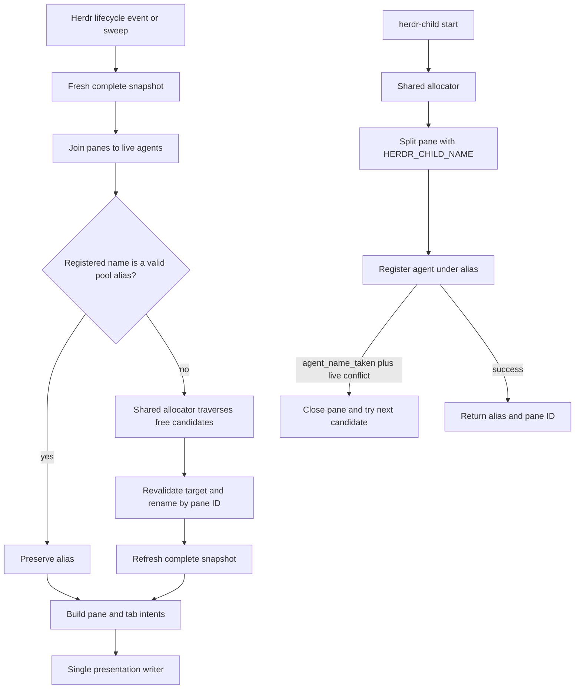

# Herdr agent aliases and presentation cutover

## Goal Capsule

- **Objective:** replace semantic task names with locally generated `color-animal` aliases for every live Herdr agent, and use the registered alias as the identity shown in panes and tabs.
- **Product authority:** the Product Contract below and the user's confirmed all-agent scope on 2026-08-23.
- **Superseded behavior:** the LLM-generated task naming contract in `docs/plans/2026-08-10-001-feat-herdr-task-sync-plan.md`; the pane-label task-slug portions of later presentation plans.
- **Preserved behavior:** runtime prefixes, process and idle labels, tab composition, Git/worktree sidebar metadata, complete-snapshot reconciliation, the sweep daemon, and the existing child callback protocol.
- **Execution profile:** cleanly separate the presentation coordinator from retired semantic naming, add one shared alias allocator, and update child launchers, managed deployment, tests, and documentation in one cutover.
- **Open blockers:** none.
- **Stop conditions:** stop implementation if `herdr agent rename <pane-id> <alias>` cannot assign an addressable registered name, if Herdr 0.8.2 does not return the structured `agent_name_taken` conflict code, or if live records do not expose the required pane, runtime, terminal, revision, and state-sequence fields. Do not invent a second identity registry to work around those failures.

## Product Contract

### Problem Frame

Semantic task names require agent-specific prompt hooks, transcript parsing, detached model calls, mutable task state, and race reconciliation. That machinery is expensive and still gives panes unstable names. Herdr already has a live agent registry and unique agent names. A short local alias such as `yellow-falcon` can serve as the registered address and the visible identity without reading prompts or calling a model.

The desired surface is intentionally mechanical:

| Surface | Grammar |
|---|---|
| Registered Herdr agent name | `<color>-<animal>` |
| Pane label | `<runtime-prefix>:<color>-<animal>` |
| Tab label | ordered pane labels joined with ` · `; all-idle tabs retain `~ <tab-index>` |
| Child start result | `{"agent":"<color>-<animal>","pane":"<pane-id>"}` |

Runtime prefixes remain `cc` for Claude Code, `oc` for OpenCode, `pi` for Pi, and `cx` for Codex. Unknown runtimes retain the current lowercase-first-letter fallback rather than blocking alias assignment.

### Requirements

**Alias identity**

- R1. Every live agent represented by exactly one complete Herdr agent record receives a locally generated alias matching `^[a-z]+-[a-z]+$` and Herdr's 32-character name limit.
- R2. The alias is the registered Herdr agent name, not presentation-only metadata. Commands that accept an agent name can address the agent by that alias.
- R3. A registered name that is already a member of this repository's alias pool remains unchanged across events, sweeps, daemon restarts, pane moves, and process-state changes.
- R4. A semantic, tracker-derived, manual, or otherwise non-pool registered name is controller-owned and is replaced on the next successful reconciliation pass. A manual rename to another valid pool alias is preserved if it remains unique, but manual renaming of an active child is unsupported; alias-plus-pane operations must fail safe when their launch identity is stale.
- R5. Alias generation is local, bounded, Bash 3.2-compatible, and independent of prompts, transcripts, models, networks, and agent-specific adapters.

**Presentation**

- R6. Agent panes render `<runtime-prefix>:<alias>`. Process panes retain the current foreground-process label, idle panes retain `~`, and tabs retain the current ordered pane-label composition.
- R7. Git/worktree resolution and the `$git_ref` sidebar token remain unchanged. Alias assignment must not weaken location metadata, stale-location behavior, process truncation, external-label repair, or idempotency.
- R8. Herdr lifecycle event payloads remain invalidation signals only. Every event and sweep derives intent from a fresh complete snapshot.

**Launch and cleanup**

- R9. `herdr-child start` no longer accepts `--name`. It allocates an alias before registration, starts the child under that name, injects the same name into `HERDR_CHILD_NAME`, and returns the registered alias plus pane ID.
- R10. `ask-in-herdr` and other callers or wrappers of `herdr-child` do not list agents or synthesize names. Only `herdr-child` and the presentation reconciler query the live registry for allocation. Callers consume the alias and pane returned by `herdr-child` for read, status, reply, and reap operations.
- R11. Claude Code, OpenCode, and Pi semantic task adapters, prompt/model execution, transcript parsing, task metadata publication, task state, and their deployed files are removed. Herdr's own agent-state integrations remain untouched.
- R12. Deployment freezes old adapter entry, disables the plugin, and quiesces every verified old sweep daemon, presentation worker, and naming worker before managed files change. An old process must not survive the cutover and restore semantic labels.
- R13. `reply` and `reap` require the alias-plus-pane pair returned at launch or reported by a child callback. Cross-pane alias reuse must never select or close a different agent. Herdr 0.8.2 has no atomic compare-and-prompt or compare-and-close operation, so the final same-pane replacement interval remains an explicit residual risk rather than a false absolute guarantee.

### Acceptance Examples

- AE1. Given three live agents named `review-auth`, `CORE-42`, and `consult-pi-123`, one successful pass registers three distinct pool aliases and renders labels such as `cc:yellow-falcon`, `oc:red-bear`, and `pi:blue-otter`.
- AE2. Given a live agent already registered as a valid pool alias, repeated events and sweeps issue no agent rename and preserve the same pane and tab labels.
- AE3. Given two allocators choose the same first candidate concurrently, Herdr accepts only one registration; the loser refreshes live state and chooses another candidate. Collision cleanup closes only a still-agent-free pane with the captured terminal identity; ambiguous cleanup preserves the pane and reports it instead of risking another agent.
- AE4. Given an agent exits or is replaced before the final pre-rename validation, the pass skips it. Given replacement occurs in Herdr 0.8.2's unavoidable interval between validation and rename, the replacement may receive the candidate intended for its predecessor; this is acceptable because aliases carry no semantic ownership and the resulting live state already satisfies R1-R6.
- AE5. Given an incomplete or contradictory snapshot, the pass performs no new presentation writes and leaves existing labels and location state intact. A later complete snapshot converges once.
- AE6. Given `herdr-child start --kind opencode --prompt-file ...`, the command returns the generated alias and pane ID; the child's environment, initial prompt, callback marker, parent reply validation, and reap hint all use that exact alias.
- AE7. Given the old task-sync adapters, cache records, and live `task` tokens exist at deployment time, old workers are drained, every live `task` token is cleared under source `task-sync`, no adapter invokes the retired engine, and no naming model restarts.
- AE8. Given all aliases are occupied at the initial read, allocation terminates before child pane creation. Given the last free alias is lost after a child pane is split, the child closes that exact pane, performs no second split, and exits non-zero. Reconciliation skips the whole presentation pass because a tab cannot satisfy R6 while one agent lacks an alias.
- AE9. Given child A's alias is later reused by child B in another pane, a delayed reply or reap carrying A's alias-plus-pane pair rejects the mismatch and never targets or closes B.

### Scope Boundaries

- Do not add `$ham Ask`, SSH routing, `ask_agent`, `ask_parent`, or any messaging protocol.
- Do not add a durable parent-child registry. The current launch-time parent pane and alias-plus-pane callback contract remain as-is; pane-renumber-safe relationship routing is separate work.
- Do not preserve semantic task names as labels, metadata, aliases, or migration fallback.
- Do not keep compatibility shims for the retired `herdr-task-sync --agent`, `--session`, `--transcript`, `--set`, or worker interfaces.
- Do not copy source code, word lists, comments, or tests from `zerodice0/herdr-agent-labels`. That repository had no license at researched commit `f26d8e460b788cfb5a73b6e828c5e4b7acc75296`; it is product prior art only.
- Do not run `chezmoi apply` on the host. The user performs the live deployment after the repository change is committed and synced into chezmoi's separate source clone.
- Do not rewrite historical plans, resolved issues, or solution records merely because they mention `herdr-task-sync`. Update only active managed configuration, current operational skills/contracts, tests, and this superseding plan.

### Verified CLI Contracts

- Local binary: `herdr 0.8.2` on 2026-08-23.
- `herdr agent rename <TARGET> <NAME>|--clear` accepts a target that the CLI resolves as a live name or pane ID; it exposes no expected-revision or compare-and-swap option.
- `herdr agent start <NAME> --kind <KIND> --pane <ID>` registers the requested name and returns structured failures.
- `herdr pane report-metadata <PANE_ID> --source <ID> --clear-token <NAME> --seq <N>` provides the source-scoped live task-token cleanup used by KTD9.
- `herdr plugin disable <PLUGIN_ID>` provides the quiescence entry point used by KTD11.
- `herdr session list --json` exposes each running session's `socket_path`; link, enable, and reload do not rerun startup hooks for already-running sessions, so the after-script must call ensure explicitly per socket.
- A live auto-detected record currently exposes `agent`, `pane_id`, `terminal_id`, `revision`, and `state_change_seq`; `agent_session` can be absent and a registered `name` is absent before explicit naming.

## Planning Contract

### Key Technical Decisions

- KTD1. **Rename the remaining engine to `herdr-pane-labels`.** The presentation coordinator becomes `home/dot_local/bin/executable_herdr-pane-labels`; `ensure.sh`, `sweep.sh`, tests, comments, and operational commands use the new name. The old executable is deleted and listed in `.chezmoiremove`. This avoids leaving a task-oriented public interface around presentation-only behavior.
- KTD2. **Use one shared repository-authored alias library.** `home/dot_local/lib/herdr-aliases.sh` owns the color list, animal list, pool validation, alias validation, and candidate traversal. Both `herdr-pane-labels` and `herdr-child` source it by a script-relative path. A test-only seed override makes candidate order reproducible without creating persisted alias state.
- KTD3. **Use a bounded full-pool traversal, not random retries.** Hash an allocation seed with a ubiquitous local primitive such as `cksum`, map it to a start offset in the Cartesian color-animal pool, then visit every candidate once in wraparound order. The seed includes the current Herdr socket identity plus stable live identity fields; child allocation also includes the launching process and current sequence. Herdr's live registry, not the hash or a preflight list, is the final uniqueness authority.
- KTD4. **Treat the registered alias as the only durable alias state.** No alias cache or semantic mapping is persisted. A valid current pool alias is preserved. A non-pool name is assigned from candidates absent from the latest live set. This makes restart and event behavior naturally idempotent.
- KTD5. **Revalidate before every agent rename and verify after mutation.** A complete live agent record requires string `pane_id`, `agent`, and `terminal_id`, plus numeric `revision` and `state_change_seq`; `name` and `agent_session` are optional because auto-detected agents may be unnamed and native session IDs may be absent. Immediately before `herdr agent rename`, re-read and compare pane ID, runtime, terminal ID, revision, state sequence, current name when present, and native session when present. Target by pane ID. After success, require a fresh complete record with the accepted alias and a valid current join before any pane, tab, or metadata write. Herdr 0.8.2 has no compare-and-swap rename. A same-pane replacement in the final command interval may receive the alias; because aliases are deliberately non-semantic and address the current live occupant, this is a valid converged outcome rather than stale task identity.
- KTD6. **Classify concurrency with structured errors plus live state.** Retry allocation only when the failed command returns exact code `agent_name_taken` and a fresh complete registry confirms another target owns the candidate. Keep exact `agent_pane_busy` retries within the same child pane. A generic failure followed by unrelated candidate occupation is still a generic failure. Malformed responses, unavailable state, or any other code abort that target safely.
- KTD7. **Keep child callback state internally consistent by retrying the whole pane allocation.** `herdr-child` chooses the candidate before `pane split` because `HERDR_CHILD_NAME` is injected at split time. Capture the split pane's terminal identity. If registration returns `agent_name_taken`, re-read the pane and close it only when that terminal identity is unchanged and no agent occupies it; ambiguity preserves the pane and aborts with a cleanup warning. After confirmed close, choose the next candidate and repeat split plus start. If the refreshed pool is exhausted, do not split again. Existing `agent_pane_busy` readiness retries remain inside one pane. Any non-conflict failure cleans up under the same safe-close rule and exits.
- KTD8. **Require a complete agent join before presentation writes.** A usable snapshot has arrays for panes, tabs, and agents; every agent-bearing pane joins by pane ID to exactly one record satisfying KTD5; no two records share a pane or terminal; and joined pane, tab, workspace, runtime, and terminal fields do not contradict each other. Any missing field, wrong type, duplicate, contradiction, malformed response, or complete-but-stale post-rename record aborts the whole presentation pass. Existing labels and retained location state remain untouched until a complete pass.
- KTD9. **Perform a selective presentation-state cutover.** The new engine uses `~/.cache/herdr-pane-labels` and presentation-only environment overrides. During quiescence, copy only validated per-socket `socket.state`, per-pane `location.state`, and the location high-water/retained-location fields needed for stale Git behavior. Do not migrate task prompts, transcript state, model claims, task metadata high-water marks, task inboxes, or worker claims. After all old workers stop, clear each live pane's old token with the deliberately unsequenced `herdr pane report-metadata <pane> --source task-sync --clear-token task`; Herdr 0.8.2 accepts this same-source clear after sequenced writes, and the migration verifies disappearance from a fresh read.
- KTD10. **Keep the prior art boundary explicit.** The implementation uses the independently selected `color-animal` product shape and a generic Cartesian allocator. Repository authors create all vocabulary and code from scratch, validate every word against the local grammar, and record no HAM-derived word-by-word correspondence.
- KTD11. **Use a before/after cutover barrier.** A new run-onchange before-script first replaces the deployed old engine entry point with a reversible no-op stub, freezing all still-loaded semantic adapters. It then disables `seigi.pane-labels`, refuses cutover while any live agent has a registered non-pool name, and drains verified owners from both legacy and current cache namespaces to a fixed point before managed files change. One shared chezmoi template library owns owner discovery, PID/start/command verification, drain-to-fixed-point, running-session socket enumeration, and per-socket ensure so before, after, and rollback cannot drift. Legacy daemon locks contain only PID, so verify exact command and repeat the live process-start check immediately before signaling; claim records additionally verify their stored process-start token. On pre-deploy failure, restore the old executable, re-enable the old plugin, explicitly invoke the restored old engine's ensure mode for every running socket, and verify rollback daemons before exiting non-zero. The after-script performs a second drain check, relinks/enables/reloads the new plugin, explicitly ensures every running socket, and verifies one lock/PID per socket. Future engine changes use the same barrier to replace loaded current daemons.
- KTD12. **Make child operations pair-addressed.** `reply` keeps `--to <alias> --pane <pane>`. Change `reap` from name-only/multi-name selection to one `--to <alias> --pane <pane>` operation with a fresh pair and terminal-identity check immediately before close. A child `ask` resolves the current alias for its current pane before emitting the callback marker, so a valid manual alias rename does not make the marker stale; launch-time environment remains initial evidence only. `ask-in-herdr` captures read/status output, validates the alias-plus-pane pair both before and after capture, and prints the output only after the second validation. Same-pane replacement after the final check remains the documented Herdr limitation.

### High-Level Technical Design

### Failure Defaults

| Scenario | Required default |
|---|---|
| Snapshot is incomplete | Perform no alias, pane, or tab rename; retry on the next invalidation or sweep. |
| Target changed before rename | Skip that target. A replacement in the unavoidable final command interval may receive the candidate and is valid because aliases have no semantic ownership. |
| Command returns `agent_name_taken` and candidate is live elsewhere | Refresh live state and continue the bounded candidate traversal. |
| Rename/start failed for an unclassified reason | Stop that target; child launch cleans up its pane and returns non-zero. |
| Alias pool is exhausted | Terminate without looping and skip the whole presentation pass; initial child exhaustion creates no pane. |
| Manual non-pool rename | Replace it on the next complete sweep. |
| Manual valid-pool rename | Preserve it if unique. |
| Old daemon or worker PID cannot be verified | Abort the before-script and the apply before managed files change. |
| Live registered non-pool name exists before cutover | Abort and require the user to drain that legacy child or clear the explicit name before retrying apply. |

## Implementation Units

### U1. Add the shared alias allocator

- **Goal:** provide one deterministic, bounded, independently authored alias vocabulary and candidate traversal for every repository-owned registration path.
- **Requirements:** R1, R3-R5. Implements KTD2-KTD4 and KTD10.
- **Dependencies:** none.
- **Files:** `home/dot_local/lib/herdr-aliases.sh` (new), `tests/scripts.bats`, `tests/smoke.bats`.
- **Approach:** define lowercase ASCII color and animal arrays whose Cartesian product contains at least 1,024 unique names and whose longest combination fits Herdr's limit. Expose functions to validate the pool, test whether a name belongs to it, and emit each candidate exactly once from a seed-derived offset. Keep the library free of Herdr calls so callers remain responsible for current occupancy and registration.
- **Test scenarios:** library parses under system Bash; every word and combination matches the grammar; all combinations are unique and at most 32 characters; the pool meets the minimum size; a fixed seed yields a stable full sequence with no repetition; wraparound reaches the last free alias; all-occupied traversal terminates; no network, `pi`, or `claude` binary is consulted; the managed library deploys under `~/.local/lib/`.
- **Verification:** focused alias tests in `tests/scripts.bats` pass and `make lint` reports no Bash 3.2 incompatibility.

### U2. Replace task sync with alias-aware presentation reconciliation

- **Goal:** make one presentation-only engine own agent aliases, pane labels, tab labels, and existing location metadata.
- **Requirements:** R1-R8. Implements KTD1 and KTD3-KTD9.
- **Dependencies:** U1.
- **Files:** `home/dot_local/bin/executable_herdr-task-sync` (delete), `home/dot_local/bin/executable_herdr-pane-labels` (new from the retained presentation code), `home/private_dot_config/herdr/plugins/herdr-pane-labels/ensure.sh`, `home/private_dot_config/herdr/plugins/herdr-pane-labels/sweep.sh`, `home/private_dot_config/herdr/plugins/herdr-pane-labels/herdr-plugin.toml`, `home/private_dot_config/herdr/config.toml`, `tests/helpers/herdr_task_sync.bash` (replace with `tests/helpers/herdr_pane_labels.bash`), `tests/herdr_task_sync_descriptor_probe.bats` (replace with `tests/herdr_pane_labels_descriptor_probe.bats`), `tests/scripts.bats`.
- **Approach:** remove the prompt CLI, detached naming worker, model chain, transcript parser, slug normalization, task inbox, task claims, task metadata publication, semantic session state, and task pruning. Retain the snapshot coordinator, location resolver, process/idle formatter, intent comparison, final guards, socket serialization, and sweep loop under presentation-only names. Join each agent pane to its live agent record, preserve or allocate its registered alias, and refresh before composing `<prefix>:<alias>` pane labels and ordered tabs.
- **Test scenarios:** known and unknown runtime prefixes; existing valid alias stays stable across restart and sweep; semantic/tracker/manual non-pool names converge; exact `agent_name_taken` chooses another alias while generic failure does not; agent exits, moves, or is replaced before rename; same-pane replacement in the final non-atomic interval receives a valid alias and produces current pane/tab intent; missing required field, wrong type, duplicate pane/terminal, contradictory join, malformed response, and complete-but-stale post-rename snapshot each abort the pass; complete follow-up snapshot converges; process, idle, tab-order, external repair, Git/worktree, detached HEAD, migrated first-pass stale location, UTF-8 icon, truncation, and idempotency regressions remain green; no task token or model process is produced.
- **Verification:** `bash -n` passes for the new engine, the focused presentation tests pass, and repeated sweeps record no writes after convergence.

### U3. Make child and peer-consult names allocator-owned

- **Goal:** ensure repository-owned child agents start directly with aliases and preserve the existing callback contract.
- **Requirements:** R1-R5, R9, R10, R13. Implements KTD2, KTD3, KTD6, KTD7, and KTD12.
- **Dependencies:** U1.
- **Files:** `home/dot_local/bin/executable_herdr-child`, `home/private_dot_claude/skills/ask-in-herdr/scripts/ask.sh`, `home/private_dot_claude/shared/child-agent-contract.md`, `home/private_dot_claude/skills/herdr/SKILL.md`, `tests/scripts.bats`, `tests/smoke.bats`.
- **Approach:** remove `--name` from `herdr-child start`, allocate internally, and keep `HERDR_CHILD_NAME`, the initial prompt identity, and return JSON aligned to the accepted launch alias. Resolve the current alias from the current pane before emitting a callback marker. Preserve alias-plus-pane validation for reply, and require the same pair for reap immediately before close. On exact registration collision, close the split pane and retry the entire allocation with the next candidate. Remove consult-specific `consult-$AGENT-$$` synthesis and preflight listing from `ask.sh`; parse and use the returned alias plus pane in every later command and hint.
- **Test scenarios:** help and invalid-option behavior reject `--name`; successful starts for Claude Code, OpenCode, and Pi return a pool alias; child environment, initial prompt, and result agree; same-first-candidate concurrent starts produce distinct aliases; initially exhausted pool performs no split; last-free race performs one split, one exact collision, one safe close, and no second split; another agent or changed terminal before cleanup preserves the pane and aborts with a warning; `agent_pane_busy` reuses one pane; generic failure followed by unrelated occupation does not retry; timeout 124 still returns alias plus pane; callback marker uses the current alias for its pane; reply and reap validate alias plus pane and terminal; cross-pane alias reuse is never closed by a stale reap; ask-in-herdr does no name preflight, buffers read/status output, and discards it when either pair validation fails.
- **Verification:** the focused `herdr-child` and `ask-in-herdr` sections of `tests/scripts.bats` pass.

### U4. Remove semantic adapters and deployed remnants

- **Goal:** leave no prompt-driven semantic naming path or deployed compatibility file.
- **Requirements:** R11. Implements KTD1 and KTD9.
- **Dependencies:** U2.
- **Files:** `home/private_dot_claude/hooks/executable_herdr-task-sync-hook.sh` (delete), `home/private_dot_config/opencode/plugins/herdr-task-sync.ts` (delete), `home/dot_pi/agent/extensions/herdr-task-sync.ts` (delete), `home/private_dot_claude/private_settings.json.tmpl`, `home/.chezmoiremove`, `tests/herdr_task_sync_descriptor_probe.bats` (rename/replace per U2), `tests/smoke.bats`, `tests/templates.bats`, `home/private_dot_claude/skills/herdr/SKILL.md`, and `home/private_dot_claude/shared/child-agent-contract.md`.
- **Approach:** remove only the custom task-sync hook entries from Claude settings while preserving Herdr's native agent-state hooks. Add `.chezmoiremove` entries for the old executable and all three deployed adapters. Replace active task-slug comments and usage examples with alias terminology. Remove obsolete model environment settings, transcript fixtures, worker timing tests, task-state helpers, and assertions; do not retain dead compatibility branches or rewrite historical artifacts.
- **Test scenarios:** rendered Claude settings have no task-sync command while native agent-state hooks remain; deployed Claude, OpenCode, and Pi task adapters are absent; old executable is absent; no managed source invokes `herdr-task-sync --agent`, `pi -p`, `claude -p`, prompt parsing, or `$task` publication; the new engine and alias library deploy; current Herdr integration files remain present.
- **Verification:** `make test-templates`, source-level assertions in `tests/scripts.bats`, the retired-interface search, and `make test-ubuntu` pass. Direct `bats tests/smoke.bats` on the host is not a checkout verification because it reads the deployed home.

### U5. Make daemon cutover safe and verify the full contract

- **Goal:** ensure deployment cannot leave old and new presentation writers competing.
- **Requirements:** R6-R8, R11, R12. Implements KTD1, KTD8, KTD9, and KTD11.
- **Dependencies:** U2, U4.
- **Files:** `home/.chezmoitemplates/herdr-pane-labels-cutover-lib.sh` (new shared shell body), `home/.chezmoiscripts/run_onchange_before_6-quiesce-herdr-pane-labels.sh.tmpl` (new), `home/.chezmoiscripts/run_onchange_after_6-link-herdr-pane-labels.sh.tmpl`, `home/private_dot_config/herdr/plugins/herdr-pane-labels/ensure.sh`, `tests/scripts.bats`, `tests/smoke.bats`.
- **Approach:** put the new engine, alias library, manifest, and wrappers in both scripts' hash inputs. The before-script installs the reversible no-op at the old engine path before disabling the plugin, checks that no live registered non-pool name can be a legacy child, and drains old/current cache owners to a fixed point using KTD11's verification rules. Any unverifiable or surviving owner restores the old executable/plugin and aborts before managed deployment. It then migrates only validated location evidence and clears live `task` tokens with unsequenced `--source task-sync --clear-token task`, verifying disappearance from a fresh live read. The after-script repeats the owner scan before enabling, relinks/enables/reloads, explicitly ensures each running socket from `herdr session list --json`, and verifies one new daemon per socket.
- **Test scenarios:** an adapter invocation after initial drain reaches the no-op and starts no worker; pre-existing registered non-pool child blocks cutover with rollback; rollback restores the old executable, re-enables the plugin, explicitly ensures every running socket, and verifies old daemons; plugin disable precedes process signaling; verified old daemon and in-flight presentation/naming workers receive `TERM` and drain before file replacement; an event during quiescence starts no writer; stale locks recover; legacy PID verification double-checks exact command/start time; unrelated or unverifiable live PID rolls back and aborts; location-only state migrates while task state and claims do not; every task clear is unsequenced and a fresh read confirms absence; second drain catches a late old process; session-list sockets receive explicit ensure calls and independent locks; a second apply replaces current-cache daemon PIDs after engine change; complete first pass assigns aliases and repairs pane/tab labels.
- **Verification:** focused daemon tests, smoke deployment, lint, and the Docker apply suite pass. Live verification remains user-driven after chezmoi sync/apply.

## Sequencing and Commit Boundaries

1. **Allocator foundation:** implement U1 and its focused tests. This may be a standalone commit because no active path uses it yet.
2. **Atomic cutover:** implement U2-U5 together so the new engine, child callers, adapter removal, and before/after barrier land in one deployable state. Do not commit or deploy between these units.
3. **Full verification:** run every gate against the atomic cutover. Deleted semantic code stays deleted.

Each implementation batch is gated on its focused tests before the next batch. The final commit boundary must contain the clean cutover rather than a compatibility period where old adapters can call the new engine.

## Verification Contract

| Command | Covers | Done signal |
|---|---|---|
| `bash -n home/dot_local/lib/herdr-aliases.sh home/dot_local/bin/executable_herdr-pane-labels home/dot_local/bin/executable_herdr-child home/private_dot_claude/skills/ask-in-herdr/scripts/ask.sh` | U1-U3 | The shared library and all Bash entry points parse under the system shell. |
| `bats tests/scripts.bats` | U1-U3, U5 | Allocator, reconciliation, race, child, consult, and daemon scenarios pass. |
| `make test-templates` | U4 | Claude settings render without task-sync hooks. |
| `make lint` | U1-U5 | Shellcheck passes with Bash 3.2-compatible code. |
| `make test-local` | U1-U5 | Chezmoi dry-run shows only the intended managed cutover. |
| `make test-ubuntu` | U1-U5 | A disposable apply and the full Linux suite pass against this checkout. |
| `rg -n 'herdr-task-sync|HERDR_TASK_SYNC|task-sync-hook|\$task' home --glob '!home/.chezmoiremove' --glob '!home/.chezmoiscripts/run_onchange_before_6-quiesce-herdr-pane-labels.sh.tmpl' --glob '!home/.chezmoitemplates/herdr-pane-labels-cutover-lib.sh'` | U4 | No retired semantic interface remains outside the explicit removal list and bounded cutover migration library; focused U5 tests constrain those intentional references. |

`make test-suite` is not sufficient for this managed-file change because it reads the already-deployed home directory instead of applying `home/` from this checkout.

## Rollout Contract

1. Commit the repository change and sync it into `~/.local/share/chezmoi`.
2. Before apply, inspect `herdr agent list` and drain any explicitly named non-pool child; the before-script enforces this and prints the blocking alias plus pane.
3. The user runs `chezmoi apply`; the agent does not run it on the host. If quiescence cannot verify or stop every old owner, apply stops before managed files change; resolve the reported PID/child and rerun apply before continuing.
4. The before/after scripts freeze old adapter entry, disable and quiesce the old plugin, migrate location-only state, clear old task tokens, deploy, relink, and enable the new plugin.
5. Verify every active socket has one new daemon, `herdr agent list` contains pool aliases, pane labels use runtime prefixes plus those aliases, and tabs join the resulting pane labels.
6. Restart any Claude Code, OpenCode, and Pi clients that were open during apply so their in-memory adapter configuration matches the deployed removal.
7. Start one child through `herdr-child` and one consult through `ask-in-herdr`; verify returned alias-plus-pane pairs support read, reply, and reap.

The old `~/.cache/herdr-task-sync` directory is not migrated wholesale. The before-script copies only the validated location subset named in KTD9; the old directory may remain on disk, but no active process or managed source may read or write it after cutover.

## Definition of Done

- Every complete live Herdr agent record converges to one unique alias from the repository-owned pool.
- Registered names, pane labels, tabs, child result JSON, and callback validation agree on the same alias.
- Existing valid aliases remain stable without a mapping database or semantic fallback.
- Concurrent allocation, target replacement, the documented non-atomic rename/close intervals, incomplete snapshots, alias reuse, and pool exhaustion have explicit safe defaults, accepted residuals, and focused tests.
- Process/idle labels, tab order, Git/worktree metadata, stale-location behavior, repair, and sweep idempotency retain regression coverage.
- The semantic adapters, model chain, prompt/transcript parsing, task state, task metadata publication, old executable, and deployed remnants are absent.
- Deployment leaves exactly one verified `herdr-pane-labels --sweep-daemon` per active socket; no old daemon or worker can restore semantic labels.
- Live `task` tokens are cleared under source `task-sync`, while validated stale-location evidence survives the cache cutover.
- `bats tests/scripts.bats`, `make test-templates`, `make lint`, `make test-local`, and `make test-ubuntu` pass with no silently skipped applicable checks.
