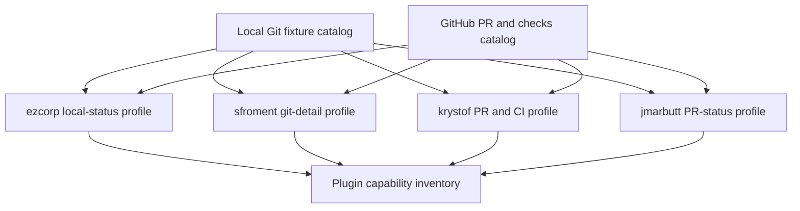
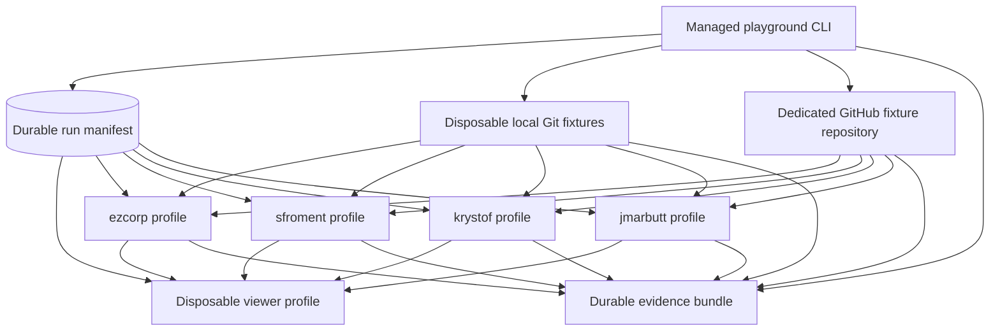

# Herdr Git Status Playground - Plan

## Goal Capsule

- **Objective:** Create a disposable playground that shows four Herdr Git and pull-request status plugins against the same controlled repository states so their information can be inventoried side by side.
- **Product authority:** Andrew is the operator and decides which observations matter for a later sidebar design.
- **Open blockers:** None for planning. Genuine approved and changes-requested pull-request states remain deferred until a second reviewer identity is available.
- **Execution profile:** A managed Python CLI provisions disposable local runtime state, while a pre-existing dedicated GitHub repository holds the remote fixtures.
- **Stop conditions:** Stop before launching any profile if isolation, dependency, authentication, fixture ownership, or durable launch intent cannot be proved. Require verified process ownership before readiness or signalling, and stop teardown with a visible failure rather than killing an unowned process.
- **Tail ownership:** Automated tests prove deterministic launcher behavior. Andrew owns the authenticated GitHub bootstrap and the real macOS visual acceptance trial.

---

## Product Contract

### Summary

A managed CLI will provision four isolated candidate profiles plus a disposable comparison viewer, expose composable lifecycle and snapshot commands, and retain attributed evidence after runtime cleanup. Every candidate receives the same local Git and GitHub pull-request catalog without changing the live Herdr profile or choosing a permanent implementation.

### Problem Frame

The managed agent sidebar currently shows agent identity and Git location through `state_icon`, `workspace`, `pane`, and `$git_ref`. Herdr's default spaces row also exposes branch and built-in ahead/behind status, but neither surface provides the local change detail, stash state, pull-request checks, or pull-request state needed to understand work at a glance.

Four candidate plugins expose different parts of that missing context. Comparing them in the live profile would mix global plugin state, background pollers, workspace label mutations, and unrelated repository conditions. Static screenshots would avoid those risks but would not establish whether each plugin reports real state correctly.

### Key Decisions

- **Use four live isolated profiles.** (session-settled: user-approved — chosen over sequential toggling and a static gallery: real concurrent sessions expose rendering, refresh, and lifecycle behavior.) Governs R1-R4.
- **Run each plugin alone.** (session-settled: user-directed — chosen over the two-by-two combination matrix: the first pass inventories each plugin's individual contribution.) Governs R1, R10-R12.
- **Use a dedicated GitHub fixture repository.** (session-settled: user-directed — chosen over this repository and existing pull requests: controlled branches and checks must not create noise in `my-mac-setup`.) Governs R5-R9, R14.
- **Inventory before selecting or designing.** (session-settled: user-directed — chosen over immediately adopting plugins or designing a combined sidebar: the first result is evidence, not a verdict.) Governs R10-R13.
- **Defer review-decision states.** (session-settled: user-directed — chosen over adding another reviewer identity: approved and changes-requested states are excluded from the first playground.) Governs R9.

### Actors

- A1. **Operator:** Starts the playground, inspects each profile, records observations, and ends the run.
- A2. **Playground:** Creates repeatable local states, launches isolated Herdr profiles, and removes their processes and disposable state.
- A3. **Herdr profile:** Runs one candidate plugin and renders the shared fixture catalog without reading or writing the live profile.
- A4. **GitHub fixture repository:** Supplies controlled pull-request and GitHub Actions states to the remote-status candidates.

### Requirements

**Profile isolation and lifecycle**

- R1. The playground must make four Herdr profiles viewable concurrently, with exactly one of the four candidate plugins enabled in each profile.
- R2. Each candidate profile and the viewer profile must have independent Herdr configuration, plugin registry, plugin configuration, session sockets, and plugin state.
- R3. The playground must ignore inherited live-session variables and must not modify the live Herdr configuration, plugin registry, workspaces, labels, sockets, or background processes.
- R4. Every run must use recorded plugin revisions and must stop all candidate-owned watchers or pollers during teardown.

**Shared fixture catalog**

- R5. Every candidate profile must open the same named spaces in the same order so observations map to identical repository conditions; the viewer displays those candidate-owned spaces without duplicating them.
- R6. The core local catalog must include a clean branch checkout, a mixed-dirty branch checkout, a clean linked worktree, and a mixed-dirty linked worktree.
- R7. Mixed-dirty fixtures must contain staged, unstaged, and untracked changes that remain distinguishable in the ground truth.
- R8. The diagnostic local catalog must include a conflict, a diverged branch with ahead and behind commits plus a stash, detached HEAD, and a non-Git directory.
- R9. The GitHub catalog must include no pull request, draft pull request, checks pending, checks failed, checks passed, and merge-conflicted pull request states; approved and changes-requested states are excluded.

**Observation and evidence**

- R10. The playground must present every profile at the same terminal dimensions and allow candidate data to reach a stable refresh before comparison.
- R11. The inventory must record each candidate's intended capability family, visible sidebar signals, companion panes or actions, agreement with Git and GitHub ground truth, refresh behavior, readability, visual footprint, displaced or duplicated baseline information, dependencies, errors, and process lifecycle. Unsupported fixture families must be `not applicable`, not `missing`.
- R12. The captured evidence must identify the profile, plugin revision, fixture state, and observation time so screenshots and notes cannot be attributed to the wrong candidate.
- R13. The inventory must describe missing or misleading information without ranking candidates or proposing the final sidebar.
- R14. Teardown must settle every run-owned transient GitHub workflow by cancelling queued or running exact matches, accepting already-terminal exact matches, or retaining every exact identity in a retryable cleanup failure.

The comparison topology is shared rather than duplicated per candidate:



### Key Flows

- F1. **Provision a comparison run**
  - **Trigger:** A1 starts the playground with GitHub authentication available.
  - **Actors:** A1, A2, A3, A4.
  - **Steps:** A2 explicitly initializes or validates the named fixture repository, bootstraps its fixtures, prepares the local catalog, creates four isolated candidate profiles with the pinned plugins installed but inactive, opens the same spaces in each profile, captures the no-plugin baseline at the target dimensions, then activates the candidates.
  - **Outcome:** Four concurrently viewable profiles show attributable data without touching the live profile.
  - **Covers:** R1-R10.
- F2. **Inventory a candidate**
  - **Trigger:** Candidate data has reached a stable refresh for the current fixture state.
  - **Actors:** A1, A2, A3, A4.
  - **Steps:** A1 compares the sidebar and available detail surfaces with the no-plugin baseline plus measured Git and GitHub state, imports notes and screenshots through `snapshot`, then finalizes the inventory only when attribution and required fields are complete.
  - **Outcome:** The candidate's new, duplicated, matching, missing, stale, misleading, and not-applicable signals are documented without selecting a winner.
  - **Covers:** R10-R13.
- F3. **Tear down the playground**
  - **Trigger:** A1 ends the comparison or the run fails.
  - **Actors:** A1, A2, A3, A4.
  - **Steps:** A2 stops the viewer, asks plugin-owned pollers to stop, stops isolated servers, settles run-owned GitHub work, verifies owned resources, releases the repository lease, and removes runtime state only after cleanup succeeds.
  - **Outcome:** Complete cleanup reaches stopped; unresolved owned resources reach a retryable cleanup failure with recovery state preserved.
  - **Covers:** R3-R4, R14.

### Acceptance Examples

- AE1. **Covers R1-R5.** Given the live Herdr server is running, when the playground starts, then four additional profiles become viewable with one candidate each and the live plugin list and workspaces remain unchanged.
- AE2. **Covers R6-R8, R11.** Given the local fixture catalog is ready, when each local-status candidate refreshes, then its visible counts and markers can be checked against the staged, unstaged, untracked, conflict, divergence, stash, detached, and non-Git ground truth.
- AE3. **Covers R9, R11.** Given the fixture repository exposes each included pull-request state, when each remote-status candidate refreshes, then its pull-request and checks signals can be checked against GitHub without requiring a review decision.
- AE4. **Covers R10-R13.** Given the no-plugin baseline and all four profiles show the same space at equal dimensions, when evidence is captured, then every screenshot and note names the candidate revision and fixture state and the inventory records visual footprint, displaced or duplicated baseline information, and observations without ranking candidates.
- AE5. **Covers R3-R4, R14.** Given candidate watchers, pollers, and a pending GitHub run are active, when teardown runs after success or failure, then all owned resources stop and the live Herdr profile remains unchanged; any unresolved resource retains its recovery identity and blocks successful teardown.

### Success Criteria

- One run exposes all four candidates concurrently against the complete included fixture catalog.
- Every reported Git or GitHub signal can be reconciled with independent ground truth or is marked as a discrepancy.
- The inventory makes each candidate's intended capability, added or duplicated baseline information, visual footprint, refresh behavior, and lifecycle behavior clear enough to support a later sidebar-design brainstorm.
- Teardown leaves no candidate-owned process, run-owned transient GitHub workflow, or mutation in the live Herdr profile.

### Scope Boundaries

- Choosing, combining, forking, or permanently installing candidate plugins is outside this inventory pass.
- The two-by-two local-plus-remote plugin matrix and final sidebar composition are deferred.
- Approved and changes-requested pull-request states are deferred until a second reviewer identity is available.
- GitLab coverage is excluded; the shared remote fixture uses GitHub so all remote candidates can be compared against one authority.
- A static snapshot gallery and automated visual regression checks are deferred until a sidebar design is selected.
- The playground observes refresh and resource behavior but does not provide a performance benchmark.
- The managed playground remains supported only through the follow-up sidebar-design decision; that work must explicitly retain it as an evaluation tool or plan removal of the command, workflow, fixtures, and maintenance tests while preserving the accepted inventory.

### Dependencies / Assumptions

- Herdr 0.8.2 remains the comparison host; named Herdr sessions alone do not isolate the global plugin registry.
- Separate configuration and state roots provide the isolation boundary, and inherited `HERDR_ENV`, socket, session, and config-path variables must not reconnect a candidate to the live server.
- The fixture repository can run controlled GitHub Actions workflows. The operator supplies separate least-privilege controller-write and candidate-read credentials scoped to that repository; preflight verifies host, account, repository ID, and effective permissions without persisting either credential.
- The playground requires Git and Cargo for `ezcorp-org/herdr-git-status`; Git, POSIX shell, Python 3, and Unix utilities for `sfroment/herdr-git-detail`; Git, Bash, `jq`, and `gh` for `krystof018/herdr-git-status`; and Git, Node.js 20+, and `gh` for `jmarbutt/herdr-spaces-pr-status`. Preflight refuses an incomplete run rather than adding these trial dependencies to the managed Brewfile.
- Genuine approved and changes-requested decisions cannot be produced by the sole pull-request author, so R9 omits them.

### Sources / Research

- `home/private_dot_config/herdr/config.toml` - current managed agent-sidebar rows.
- `home/dot_local/bin/executable_herdr-task-sync` - current `$git_ref` location grammar and publisher.
- Herdr 0.8.2 plugin lifecycle and global-state documentation: `https://github.com/herdrdev/herdr/blob/6e8b138d0f7d7d695530657a6d8dc475bd3fba2b/docs/versions/0.8.2/website/src/content/docs/plugins.mdx`.
- Herdr 0.8.2 default spaces sidebar rows: `https://github.com/herdrdev/herdr/blob/9eb521456ac0d19d3ab3d9d7cea3cca10baa8a4c/src/config/sidebar.rs#L407-L425`.
- Herdr configuration and state root resolution: `https://github.com/herdrdev/herdr/blob/9eb521456ac0d19d3ab3d9d7cea3cca10baa8a4c/src/config/io.rs#L30-L42`.
- GitHub pull-request self-review restriction: `https://github.com/github/docs/blob/b07cfbc4e1740b2d79b7b90761499df691d68d32/data/reusables/repositories/request-changes-tips.md`.
- `ezcorp-org/herdr-git-status` at `f144c8dac2860e344b6b379d2bcfee229dcf10ad`: `https://github.com/ezcorp-org/herdr-git-status/tree/f144c8dac2860e344b6b379d2bcfee229dcf10ad`.
- `sfroment/herdr-git-detail` at `b726977143adc2847dc25e3327bc0b1b4fc26455`: `https://github.com/sfroment/herdr-git-detail/tree/b726977143adc2847dc25e3327bc0b1b4fc26455`.
- `krystof018/herdr-git-status` at `fe6575a89de9006c35d9d0b9707397839d983cff`: `https://github.com/krystof018/herdr-git-status/tree/fe6575a89de9006c35d9d0b9707397839d983cff`.
- `jmarbutt/herdr-spaces-pr-status` at `8a56c5dce0bd65e47eddc9a1d862ddae870cddc3`: `https://github.com/jmarbutt/herdr-spaces-pr-status/tree/8a56c5dce0bd65e47eddc9a1d862ddae870cddc3`.

---

## Planning Contract

**Product Contract preservation:** restructured with no scope change. Added R14 and repointed F3/AE5 to give the already-required pending-workflow cleanup one normative owner; R1-R13 and all other A/F/AE meanings remain unchanged.

### Key Technical Decisions

- KTD1. **Use one Python standard-library CLI as the controller.** Python provides JSON persistence, subprocess groups, signal handling, and atomic file replacement without adding a package dependency. Bats drives the executable through its public command boundary.
- KTD2. **Expose recoverable lifecycle commands.** (session-settled: user-approved — chosen over a TTY-only launcher: operators and agents need the same `bootstrap`, `start`, `view`, `status`, `snapshot`, and idempotent `stop` controls.) `bootstrap --initialize` is the explicit first-use repository claim; `status --all` discovers active and incomplete run IDs. Every post-allocation result includes run ID, generation, lifecycle state, stable error code, and the next safe command. The run manifest is authoritative for profile identity and process ownership. Governs R1-R4, R10-R12.
- KTD3. **Use five Herdr-managed-path-isolated profiles.** (session-settled: user-approved — chosen over opening four candidate panes in the live profile: the comparison surface must not mutate live workspaces.) Distinct XDG config and state roots isolate Herdr registries, sockets, sessions, and plugin state; they are not a sandbox from the shared user home. Four profiles run candidates and a fifth renders their clients. Governs R1-R3, R10.
- KTD4. **Model each candidate as a lifecycle adapter.** Installation, configuration, activation, readiness, inspection, and teardown differ per plugin and remain data-driven rather than scattered through generic branches. Governs R1-R4, R11.
- KTD5. **Measure fixture ground truth and baseline independently.** Local truth comes from Git porcelain and ref inspection; remote truth comes from explicit-repository `gh` queries. Before candidate sidebar rows or activation, each isolated candidate profile renders a shared no-plugin configuration reproducing the current managed agent rows and Herdr default spaces row at the target dimensions. Plugin output is an observation and can never establish its own expected value. Governs R5-R13.
- KTD6. **Populate a pre-existing dedicated GitHub repository through explicit identity.** (session-settled: user-approved — chosen over creating or deleting repositories from the playground: external repository lifecycle requires an explicit operator decision.) Explicit initialization may atomically claim an otherwise empty repository by recording its canonical host/owner/name, immutable repository ID, owned paths, and fixture namespace; later bootstrap validates those values and refuses `my-mac-setup`, ambient repository selection, or unrelated content. Governs R9, R14.
- KTD7. **Treat readiness as causal state.** Local observations must follow candidate activation for the current fixture generation. Remote observations must be bracketed by unchanged authority snapshots containing repository, ref, pull-request, workflow-run, and mergeability identities. Equal stale values never establish readiness. Governs R10-R12.
- KTD8. **Keep disposable runtime recoverable until teardown succeeds.** Profile roots, plugin checkouts, sockets, local repositories, ownership manifests, and launch intents live under a durable run directory until `stopped`; successful teardown removes its `runtime/` subtree while retaining ground truth, observations, logs, inventory, and the teardown verdict. Governs R3-R4, R11-R12.
- KTD9. **Use explicit launch intents and two ownership classes.** Controller-spawned processes require durable intent before release and recorded PID, group/session, start identity, executable, and profile. Plugin-detached daemons require durable expected-resource intent and adapter-specific discovery before readiness; recovery adopts one only when plugin state, process identity, executable, and profile socket agree. Before any native lifecycle action can read a plugin-owned PID record, the controller verifies that record against the durable identity or quarantines it; only identity-checked controller signalling is allowed when the native action cannot meet this contract. Governs R3-R4.
- KTD10. **Keep authenticated integration out of CI.** (session-settled: user-approved — chosen over networked GitHub tests in the standard suite: CI must remain deterministic and credential-free.) Bats stubs Herdr, Git, GitHub, and terminal boundaries; one real macOS trial proves rendering and external behavior. Governs R3-R13.
- KTD11. **Preflight the reviewed host and optional toolchains without expanding the Brewfile.** (session-settled: user-approved — chosen over permanently installing Rust for a disposable comparison: the trial must not broaden the base machine contract.) Resolve and record the approved Herdr executable identity and reject any version other than 0.8.2. Missing Cargo, Node.js, `jq`, `gh`, or plugin runtime tools fail before profile startup. Governs R1, R4.
- KTD12. **Serialize run mutations through a durable lease and generation.** `status` is available in every state and performs read-only reconciliation without persisting changes; every mutating command claims the run, reloads and reconciles observed resources, verifies the current generation, and commits one legal lifecycle transition. Stale-owner recovery requires process start identity, not elapsed time alone. Governs R3-R4, R10-R12, R14.
- KTD13. **Allow one active mutating operation per fixture repository through an exact Git-ref lease.** The lease is `refs/heads/herdr-playground/lease`. Acquisition creates a commit containing canonical host/owner/name, immutable repository ID, operation kind and ID, host installation ID, command-owner start identity, durable lifecycle state, fixture generation when applicable, and transient-workflow intents; it pushes `<new-sha>:<lease-ref>` with `--force-with-lease=<lease-ref>:<expected-sha>`, using an empty expected SHA when absent, then verifies the remote ref and repository ID. Successful initialization atomically creates the absent default branch. Bootstrap success or clean pre-mutation failure, plus `stopped`/`startup-failed-cleaned` run cleanup, conditionally deletes the lease with `--force-with-lease=<lease-ref>:<owned-sha>`; partial or unresolved mutation retains the exact lease and recovery record. An exited command process never makes an active or cleanup-incomplete run lease stale: same-host recovery must resume that run, and a new run remains blocked. A leaked lease for a terminal run may be conditionally deleted only after local and remote ownership probes prove no unsettled resource. A foreign-host lease fails closed and reports its exact commit, refs, workflow-run IDs, and manual inspection/recovery commands; the controller does not automate foreign-host takeover. Governs R9, R14.
- KTD14. **Attach nested clients without server auto-start.** Viewer panes use the candidate's verified client socket and XDG roots with nested mode enabled. A missing or mismatched socket fails attachment and cannot create a replacement server or connect back to the viewer. Governs R1-R3, R10.
- KTD15. **Make live-profile equality a trial invariant.** The baseline covers live server and socket identity, plugin registry and revisions, workspaces, labels, pane topology, and candidate-owned processes. Any after-check mismatch fails the trial and retains recovery evidence. Governs R3-R4.
- KTD16. **Make source trust and credential authority explicit.** The playground is isolation from the live Herdr profile, not a hostile-code sandbox. Launch requires an operator-approved audit attestation keyed by each full candidate commit and fetched tree, frozen dependency resolution where available, and exact executable provenance. Candidate profiles receive only a separate short-lived read-only GitHub credential restricted to the fixture repository; controller mutations use a separate least-privilege credential that is never present in plugin, viewer, build, or evidence environments. Missing trust approval or permission mismatch blocks launch. Governs R3-R4, R9, R12.
- KTD17. **Persist only redacted, private evidence.** Run directories use owner-only permissions; durable records prefer allowlisted structured fields, redact secrets and machine identifiers before every write, and discard raw logs after successful teardown. Canary credentials prove that logs, observations, screenshots, indexes, and inventory never retain authentication material. Governs R3-R4, R11-R12.

### High-Level Technical Design

Directional guidance, not implementation specification.



The controller uses the platform state directory for the durable run bundle, including a `runtime/` subtree that remains recoverable until teardown succeeds. Each controller operation, candidate, and viewer profile gets a disposable `HOME`; candidate and viewer profiles also receive distinct configuration, state, and data roots. Controller Git commands disable system/global configuration and prompts, use the canonical remote URL, and authenticate through a run-private credential file scoped to the fixture repository. `GH_CONFIG_DIR` points explicitly to the controller's least-privilege GitHub CLI state, while repository-local Git configuration supplies fixture author identity.

After all candidate profiles are ready, the viewer server starts one workspace and builds an equal two-by-two pane layout. `active-ready` requires the viewer server, socket, and layout but not an attached operator terminal. Each pane then runs the no-auto-start client path with the candidate's verified client socket, candidate XDG roots, and nested mode enabled. Interactive `start` attaches only from `active-ready`; non-interactive startup returns the run identity and leaves `view` available to attach later.

### Candidate Adapter Contract

| Candidate | Plugin ID and revision | Activation and readiness | Teardown and known behavior |
|---|---|---|---|
| ezcorp local status | `ez-corp.git-status` at `f144c8d` | Install with the full revision, quarantine any stale plugin PID record, configure sidebar mode, start the server, invoke `status-enable`, and require updater state plus reported metadata | Atomically quarantine its PID record, stop through identity-checked controller signalling, and perform metadata cleanup without invoking a signal-capable native disable path. It can skip Herdr worktree-child spaces, which the inventory records rather than hides. |
| sfroment Git detail | `git-detail` at `b726977` | Startup enters an unsupervised shell watcher; after ownership is established, run its terminating `once` path through a generation-specific tracing shim and require successful expected queries/publications rather than trusting its exit status | No native stop or PID exists. The controller owns the profile process group and verifies the watcher is gone. Purely unstaged records may also increment the staged count. |
| krystof PR and CI | `gitlab-ci-status` at `fe6575a` | Quarantine stale plugin PID records, create spaces, invoke `start`, and require its PID plus label decoration | Atomically quarantine its PID record, stop through identity-checked controller signalling, and restore controller-snapshotted labels without invoking its signal-capable native stop path. Its CI marker reflects the newest single Actions run. |
| jmarbutt PR status | `jmarbutt.spaces-pr-status` at `8a56c5d` | Quarantine stale daemon state before any startup hook, then launch its detached daemon, disable notifications, and invoke `refresh` after spaces exist | Closing the profile socket should end the daemon; verify its recorded process is gone. It does not report merge conflicts and can cache no-PR results after `gh` failures. |

### Fixture Catalog

The local fixture builder writes a ground-truth record only after each premise is measured. Harness files never live inside a repository under observation.

| Fixture | Construction and independent premise |
|---|---|
| `checkout-clean` | Ordinary checkout with clean porcelain output |
| `checkout-dirty` | Ordinary checkout with separate staged, unstaged, and untracked files |
| `worktree-clean` | Real linked worktree opened as a Herdr worktree child and measured clean |
| `worktree-dirty` | Real linked worktree child with separate staged, unstaged, and untracked files |
| `conflict` | Expected failed merge followed by verified unmerged index entries |
| `diverged-stash` | Bare remote plus two clones produce local-only and remote-only commits; observed clone fetches and holds a verified stash |
| `detached` | Checkout detached at a recorded commit |
| `non-git` | Directory whose parent chain does not contain fixture Git metadata |

The GitHub repository exists before bootstrap and is never deleted by the controller. Explicit initialization accepts only the named empty repository and atomically creates its default branch with `.herdr-git-status-playground.json` plus `.github/workflows/herdr-git-status-playground.yml`. The marker records canonical host/owner/name, immutable repository ID, expected workflow blob, and fixture namespace. The workflow uses GitHub-hosted runners, `permissions: {}`, no secrets or environments, no `pull_request_target`, no pull-request code execution, no third-party action unless pinned by full SHA, and explicit timeout and concurrency bounds. Preflight rejects policy, secret, environment, or workflow drift. Later bootstrap validates exact prior ref object IDs and immutable pull-request IDs before conditionally updating separate base/head pairs. Every GitHub fixture also has a local checkout or linked worktree with that repository as `origin`, its exact head branch and SHA checked out, and those values recorded before spaces are created.

| Fixture | Durable or per-run construction |
|---|---|
| `no-pr` | Versioned branch name that has never had a pull request, including closed history |
| `draft` | Open draft pull request with a completed passing workflow |
| `checks-failed` | Open pull request with a deterministic failed workflow |
| `checks-passed` | Open pull request with a deterministic successful workflow |
| `merge-conflict` | Open pull request with frozen conflicting base and head refs; wait for GitHub mergeability to settle |
| `checks-pending` | Before dispatch, persist a unique per-run ref, commit, nonce-bearing run-name intent, and bounded hold input. The no-secret workflow remains running for a documented minimum observation window with a hard timeout, every remote candidate must record the pending state while it is active, every matching numeric run database ID is recorded atomically, and stop settles each exact match |

### Run State and Evidence

The controller stores each run under `${XDG_STATE_HOME:-$HOME/.local/state}/herdr-git-status-playground/runs/<run-id>/`. Ownership-critical but disposable files live in its `runtime/` subtree until verified teardown removes them; evidence remains beside that subtree.

The durable run bundle contains:

- `manifest.json` with the run ID, canonical fixture repository identity, repository lease, candidate revisions, profile roots, launch intents, sockets, process identities, workflow dispatch intents, generation, and lifecycle state.
- `ground-truth/` with local Git snapshots and GitHub pull-request, checks, workflow-run, and mergeability snapshots.
- `observations/` with timestamped Herdr workspace state and candidate-visible metadata keyed by profile and fixture.
- `inventory.md` with the human readability and information-coverage worksheet.
- `evidence-index.json` with run, generation, candidate, profile, fixture, file hashes, and authority-snapshot links for captured screenshots and raw observations.
- `logs/` with controller, server, and candidate diagnostics.
- `teardown.json` with adapter cleanup results, owned-process verification, socket verification, pending-run settlement, repository-lease release, and the live-profile after-check.

Each inventory row is keyed by candidate revision and fixture ID and requires: intended capability family; baseline signal; candidate-visible signal; companion surface/action; ground-truth classification; refresh and authority state; terminal width/height and occupied cells; displaced or duplicated information; structured readability note; dependency note; error/diagnostic link; lifecycle note; observation ID; screenshot/raw-observation hashes; and explicit `not-applicable`, `no-visible-signal`, or discrepancy reason where relevant. Controller-generated fields are immutable measurements; operator notes are separate free text without a numeric ranking.

Writes use temporary-file replacement plus a single-writer lease and monotonic generation. `status` reports read-only reconciliation in every lifecycle state. `snapshot` and `stop` claim the mutation lease before persisting reconciled resources, so neither can lose a concurrent update.

### Lifecycle State Machine

| State | Entry and command result | Permitted recovery behavior |
|---|---|---|
| `provisioning` | Preflight passed and ownership intents are durable; `start` remains in progress | `status` reads; `stop` claims the lease and reconciles partially launched resources |
| `active-ready` | All profile ownership, fixture authority, sockets, spaces, and candidate readiness are current; `start` succeeds | `view`, `status`, `snapshot`, and `stop` are available |
| `active-degraded` | The run previously reached `active-ready`, but a later ownership, readiness, or authority probe failed; the run retains diagnostics | `view` requires an explicit call; `snapshot` is diagnostic and cannot satisfy acceptance; `stop` remains available |
| `startup-failed-cleaned` | Initial activation failed and automatic cleanup removed every owned local and remote transient | Read-only status and evidence remain; repeated stop succeeds and a new run may start |
| `stopping` | `stop` owns the mutation lease and executes cleanup phases | Another stop reports the active owner or recovers only when its start identity is stale |
| `cleanup-incomplete` | One or more owned resources remain or ownership cannot be proved; `stop` fails | Runtime and evidence remain; repeated `stop` resumes incomplete safe phases |
| `stopped` | Owned local and remote transients are gone, live invariants match, and disposable roots were removed | Status and evidence remain; repeated stop succeeds without side effects |

Candidate output that is missing or misleading while ownership and authority remain healthy is inventory evidence, not `active-degraded`. Before first readiness, authentication failure, fixture drift, missing ground truth, unresolved ownership, timeout, or incomplete profile setup fails startup and enters automatic cleanup; complete cleanup reaches `startup-failed-cleaned`, otherwise `cleanup-incomplete`. After `active-ready`, the same failures transition through a mutating probe to `active-degraded` and cannot satisfy the real acceptance trial.

`status` reports both the durable lifecycle state and an unpersisted effective state derived from current ownership and authority probes. `view` and `snapshot` acquire the run lease and persist any resulting degradation before attaching or capturing. `Ctrl-C` or terminal hangup during `view` detaches only and prints the run ID plus stop command; interruption during `start` enters automatic teardown and never forwards a signal outside verified owned process groups.

### Teardown Phases

Teardown is ordered and continue-on-error: claim the run and mark `stopping`; stop the viewer and verify nested clients exit; atomically quarantine plugin-owned PID records; use identity-checked controller signalling instead of any native action that rereads signal-capable PID state; perform only non-signalling metadata and label restoration; stop candidate servers; discover and settle socket-bound or detached daemons; identity-check and escalate only remaining owned processes; re-read every exact pending workflow, cancel queued or running matches, and poll each exact ID through bounded backoff until terminal while accepting already-terminal matches as settled; verify the live-profile invariant; conditionally release the exact repository lease; then remove the disposable `runtime/` subtree. A nonterminal or unqueryable workflow at the deadline leaves `cleanup-incomplete` and retains the lease plus recovery identities.

A failed phase does not skip unrelated safe cleanup. Any unresolved process, socket, workflow, or live-profile mismatch leaves `cleanup-incomplete`, preserves runtime state needed for recovery, and records the next retryable phase.

### Output Structure

```text
home/dot_local/bin/executable_herdr-git-status-playground
Makefile
docs/herdr-git-status-playground.md
tests/helpers/herdr_git_status_playground.bash
tests/scripts.bats
tests/smoke.bats
```

The managed executable contains the controller and candidate table. The test helper provides isolated command stubs and state probes, not production logic. The runbook documents repository preparation, command flow, evidence interpretation, recovery, and known candidate discrepancies.

### Implementation Constraints

- Use Python 3 standard-library modules only and keep all subprocess arguments as arrays.
- Define separate allowlisted environments for controller GitHub operations, candidate build/install, candidate runtime, and viewer processes. Resolve controller `git`, `gh`, and `herdr` utilities to recorded approved absolute paths; scrub credential variables, SSH/GPG agent sockets, proxy credentials, dynamic-loader variables, interpreter startup hooks, `HERDR_ENV`, `HERDR_SESSION`, `HERDR_SOCKET_PATH`, `HERDR_CLIENT_SOCKET_PATH`, `GH_REPO`, `GH_HOST`, `GITHUB_REPOSITORY`, config-path, pane, tab, workspace, binary-path, and plugin-scoped variables unless that process class explicitly requires one.
- Set a disposable `HOME` plus distinct `XDG_CONFIG_HOME`, `XDG_STATE_HOME`, and `XDG_DATA_HOME` values for every candidate and viewer profile. Reject any resolved profile path equal to or beneath the live Herdr roots, and do not rely on `HERDR_CONFIG_PATH` as an isolation boundary.
- Give each controller operation a disposable `HOME`; set `GIT_CONFIG_SYSTEM=/dev/null`, an isolated `GIT_CONFIG_GLOBAL`, `GIT_TERMINAL_PROMPT=0`, the canonical HTTPS remote, and a `0600` run-private credential-store file containing only the fixture-scoped controller credential. Set the controller's `GH_CONFIG_DIR` explicitly to its least-privilege GitHub CLI directory, inject only the separate read-only fixture token into candidate runtime, and use repository-local Git identity. Remove transient credential files after the operation and never expose either credential to the wrong process class or copy tokens, credential URLs, Keychain material, or Git configuration into evidence.
- Record an operator-approved audit attestation keyed by each full candidate commit and fetched tree before launch. Audit hard-coded home paths, shared daemon locations, credential mutation, dependency resolution, startup hooks, PID handling, and Herdr commands that ignore injected profile state; reject absent or stale attestations.
- Create run directories and files as `0700` and `0600`, persist allowlisted structured fields where possible, redact secret and machine-identity canaries before every durable write, and delete raw logs after verified successful teardown.
- Register idempotent cleanup before launching the first server or pending workflow.
- Never use broad process-name matching or kill a PID without verifying the recorded start identity and process group. Validate or quarantine plugin-owned PID records before invoking any native lifecycle action that can signal them.
- Never create, delete, or repurpose a GitHub repository. Resolve canonical host/owner/name to the expected immutable ID immediately before every mutation, address it explicitly, reject redirects or identity drift, and conditionally update only resources whose exact prior object and GitHub IDs match the manifest.
- Delete disposable roots only after process, socket, remote-transient, and live-profile verification passes.
- Never run `chezmoi apply` on the host. Use Docker deployment verification for the managed executable.

### Sequencing

1. Build the run manifest, environment scrubber, dependency preflight, ownership checks, and command shell before any real profile can launch.
2. Add deterministic local Git fixtures and their independent ground-truth recorder.
3. Add safe first-use GitHub initialization and idempotent durable fixture bootstrap.
4. Add per-run remote generation, repository leasing, and pending-workflow ownership.
5. Add candidate adapters, isolated profile configuration, and candidate-specific readiness and teardown.
6. Add the disposable viewer layout and recoverable lifecycle commands.
7. Add evidence projection, operational documentation, and the real macOS acceptance trial.

### System-Wide Impact

- **Live Herdr:** The launcher records the KTD15 invariant before and after the run. It creates no live workspace, pane, label, plugin, or socket.
- **GitHub:** Bootstrap and each pending-state run mutate only the configured fixture repository and owned branch namespace. No standard test contacts GitHub.
- **Local state:** Runtime repositories and profiles are disposable and disappear at `stopped`. Each successful run retains one inventory and its selected evidence; failed runs retain only diagnostics plus ownership state required for recovery until cleanup succeeds.
- **Processes:** Five Herdr servers, four candidate clients, and candidate-owned watchers can coexist during a run. The manifest plus adapter-verified detached-resource records are the only teardown authority.
- **Agent parity:** The same lifecycle and snapshot commands work from a TTY or another process. Readability judgment, candidate selection, and sidebar design remain human decisions.
- **Deployment:** The command is a chezmoi-managed home executable. The live command changes only after the normal commit, source-clone sync, and user-run apply flow.

### Risks and Mitigations

- **Unsupervised watcher leak:** `git-detail` has no native shutdown. Start the profile in its own process group and require process-group quiescence before teardown passes.
- **Detached daemon crash window:** ezcorp and jmarbutt can detach after activation. Persist expected-resource intent first, discover through isolated plugin state, and do not mark readiness until ownership promotion succeeds.
- **Unsafe native PID handling:** Candidate lifecycle scripts can trust liveness-only PID files. Quarantine any record that does not match the durable process identity and bypass signal-capable native paths when they cannot satisfy KTD9.
- **Concurrent controller writes:** Atomic replacement cannot prevent lost updates. KTD12's lease, generation, and legal transitions serialize mutations and make stale-owner recovery identity-based.
- **PID reuse:** Some plugins validate only that a PID is alive on macOS. Store process start identity and refuse to signal a mismatched process.
- **GitHub state drift:** Pending runs expire, mergeability is temporarily unknown, and new workflow runs can replace the newest-run signal. Bracket observations with current generation snapshots and invalidate slices whose authority changes.
- **Concurrent repository mutation:** A second run can change refs or cancel the wrong workflow. KTD13 blocks overlapping ownership and requires full identity matching before cancellation.
- **Ambient identity drift:** GitHub CLI environment, working directory, remotes, or account state can target the wrong repository. Scrub ambient selectors, address canonical host/owner/name explicitly, and verify immutable repository ID immediately before mutation.
- **API quota and notification noise:** Use conservative polling intervals, disable jmarbutt notifications, stop pollers promptly, and make manual refresh attributable.
- **Authentication ambiguity:** `gh` failure can look like no pull request in a candidate. Preflight authentication and record command failures separately from plugin observations.
- **Candidate defects:** Known missing or misleading signals are expected inventory findings. The playground must not normalize them into a common model before capture.
- **Nested TUI fragility:** The equal-pane viewer is an acceptance surface, not the source of lifecycle truth. The controller remains usable through non-interactive status and stop commands if a nested client exits.

### Documentation and Operational Notes

`docs/herdr-git-status-playground.md` documents:

- Required Herdr 0.8.2 executable provenance, approved temporary toolchain setup/remediation, separate least-privilege credentials, source-audit attestation, explicit `bootstrap --initialize`, owned default-branch files, and exact-ref repository-lease inspection/recovery.
- One-time bootstrap, run discovery, normal start/view/snapshot/finalize/stop flow, signal and detach semantics, and evidence locations.
- The complete local and GitHub fixture catalog with independent verification commands.
- Lifecycle states and recovery from interrupted startup, stale leases, missing candidate processes, authority drift, and failed teardown.
- The live-profile baseline/equality contract and authenticated-trial go/no-go criteria.
- Minimum viewer dimensions, resize behavior, pending-workflow observation window, and bounded readiness deadlines.
- The rule that approved and changes-requested states remain deferred.
- Known pinned candidate behavior so an observed discrepancy is not mistaken for a harness defect.
- The post-inventory retain-or-retire decision that the follow-up sidebar work must make.

### Planning Sources

- Herdr config/state root resolution and the `HERDR_CONFIG_PATH` limitation: `https://github.com/herdrdev/herdr/blob/9eb521456ac0d19d3ab3d9d7cea3cca10baa8a4c/src/config/io.rs#L22-L42`, `https://github.com/herdrdev/herdr/blob/9eb521456ac0d19d3ab3d9d7cea3cca10baa8a4c/src/config/io.rs#L169-L174`.
- Herdr plugin runtime process handling: `https://github.com/herdrdev/herdr/blob/9eb521456ac0d19d3ab3d9d7cea3cca10baa8a4c/src/app/api/plugins/runtime.rs#L121-L179`.
- ezcorp detached updater lifecycle: `https://github.com/ezcorp-org/herdr-git-status/blob/f144c8dac2860e344b6b379d2bcfee229dcf10ad/src/daemon.rs#L150-L315`, `https://github.com/ezcorp-org/herdr-git-status/blob/f144c8dac2860e344b6b379d2bcfee229dcf10ad/src/daemon.rs#L518-L589`.
- sfroment watcher and token publication: `https://github.com/sfroment/herdr-git-detail/blob/b726977143adc2847dc25e3327bc0b1b4fc26455/git-detail.sh#L45-L108`, `https://github.com/sfroment/herdr-git-detail/blob/b726977143adc2847dc25e3327bc0b1b4fc26455/git-detail.sh#L139-L147`.
- krystof poller lifecycle and label restoration: `https://github.com/krystof018/herdr-git-status/blob/fe6575a89de9006c35d9d0b9707397839d983cff/poller-ctl.sh#L57-L155`.
- jmarbutt detached daemon and state: `https://github.com/jmarbutt/herdr-spaces-pr-status/blob/8a56c5dce0bd65e47eddc9a1d862ddae870cddc3/bin/startup.js#L7-L50`, `https://github.com/jmarbutt/herdr-spaces-pr-status/blob/8a56c5dce0bd65e47eddc9a1d862ddae870cddc3/lib/state.js#L4-L47`.
- Semantic and causal test patterns: `docs/solutions/design-patterns/semantic-regression-tests-over-source-shape.md`, `docs/solutions/design-patterns/idle-machine-wall-clock-bounds-are-latent-flakes.md`.

---

## Implementation Units

### U1. Controller foundation and durable ownership

- **Goal:** Establish a safe controller that can persist and recover a run before any managed runtime process or mutating GitHub command starts.
- **Requirements:** R2-R4, R12, R14; KTD1-KTD2, KTD8-KTD9, KTD11-KTD12, KTD16-KTD17.
- **Flows:** F1, F3.
- **Acceptance Examples:** AE1, AE5.
- **Dependencies:** none.
- **Files:** `home/dot_local/bin/executable_herdr-git-status-playground`, `Makefile`, `tests/helpers/herdr_git_status_playground.bash`, `tests/scripts.bats`.
- **Approach:** Implement argument parsing, run-ID allocation, leased and generated manifests, legal lifecycle transitions, environment scrubbing, dependency/authentication preflight, launch intents, process start-identity recording, state inspection, JSON output, signal handling, and idempotent stop from partial states. Update lint discovery to exclude executable files whose shebang selects Python rather than relying on a `.py` suffix. Start with semantic tests against stubbed process boundaries.
- **Test scenarios:**
  - Missing subcommand and unknown option fail with usage status without creating state.
  - Poisoned live Herdr variables are absent from every child environment while unrelated safe variables remain available.
  - Each subprocess class receives only its declared variables and approved executable paths; poisoned agent sockets, loaders, interpreter hooks, proxies, and command paths do not cross classes.
  - Distinct profile identities resolve to distinct home, config, state, data, and socket paths outside the live Herdr roots.
  - Missing Cargo, Node.js, `jq`, `gh`, Git, or Python dependency fails before any server or remote command starts.
  - A missing, wrong-version, or path-changed Herdr executable fails before profile startup; Herdr 0.8.2 at the approved recorded path is the nearby success control.
  - Controller Git operations use only disposable home/config, canonical remote, noninteractive prompts, and the fixture-scoped credential file; ambient helpers and broader credentials are unreachable.
  - A manifest interrupted during replacement leaves either the prior valid version or the complete new version, never partial JSON.
  - Permission, write, space, and rename failures before an intent commit prevent the associated process or API mutation; failures after spawn preserve the run ID and enter recoverable cleanup.
  - Concurrent mutating commands cannot lose ownership records, regress lifecycle state, or commit the same manifest generation.
  - Stale-lease recovery requires a mismatched owner start identity; elapsed time alone cannot steal a live lease.
  - Crash injection before spawn, after spawn, and before runtime-identity commit leaves a recoverable launch intent.
  - A second process can read status and stop a partially provisioned run by run ID.
  - `status --all` discovers active and cleanup-incomplete runs, and every post-allocation failure names the run ID, state, generation, stable error, and next safe command.
  - Interrupting `start` invokes safe teardown, while interrupting or hanging up `view` detaches without forwarding signals to candidate groups.
  - Repeated stop is successful and does not signal an unrecorded or start-identity-mismatched PID.
- **Verification:** Focused Bats cases pass with command logs proving no live socket or external mutation occurred.

### U2. Local Git fixture catalog and ground truth

- **Goal:** Produce every local repository state repeatably without contaminating clean fixtures or deriving expectations from plugins.
- **Requirements:** R5-R8, R11-R12; KTD5, KTD8.
- **Flows:** F1.
- **Acceptance Examples:** AE2.
- **Dependencies:** U1.
- **Files:** `home/dot_local/bin/executable_herdr-git-status-playground`, `tests/helpers/herdr_git_status_playground.bash`, `tests/scripts.bats`.
- **Approach:** Build repositories under the disposable run root with explicit local author identity. Create linked worktrees through real Git metadata, use a bare remote plus a second clone for divergence, and persist ground truth only after every fixture premise passes.
- **Test scenarios:**
  - Clean checkout and clean linked worktree remain clean after all harness metadata is written.
  - Both mixed-dirty fixtures independently contain one staged, one unstaged, and one untracked path.
  - Conflict setup accepts the expected failed merge but refuses to continue without unmerged index entries.
  - Diverged fixture proves positive ahead and behind counts after fetch and a nonempty stash.
  - Detached fixture records the expected commit and no symbolic branch.
  - Non-Git fixture has no Git parent within the disposable root.
  - Interruption at every fixture-construction boundary either resumes from identity-verified premises or rebuilds that disposable fixture without publishing partial ground truth.
  - Every candidate profile receives the same ordered fixture labels and paths; the viewer owns only its comparison workspace.
- **Verification:** Bats compares generated ground truth with real Git commands and includes nearby controls that differ by one state property.

### U3. GitHub repository initialization and durable fixtures

- **Goal:** Initialize and converge controlled pull-request fixtures in an operator-supplied repository without owning repository lifecycle.
- **Requirements:** R5, R9, R11-R13; KTD5-KTD6, KTD10, KTD13, KTD16-KTD17.
- **Flows:** F1.
- **Acceptance Examples:** AE3.
- **Dependencies:** U1, U2.
- **Files:** `home/dot_local/bin/executable_herdr-git-status-playground`, `tests/helpers/herdr_git_status_playground.bash`, `tests/scripts.bats`.
- **Approach:** Add explicit first-use initialization that verifies canonical repository identity, acquires the absent `refs/heads/herdr-playground/lease`, and atomically creates the absent default branch with its marker and workflow. Later bootstrap acquires the same exact-ref lease with a bootstrap operation ID, mutates only compare-and-swap-matched refs and immutable PR identities, and creates one recorded local checkout or worktree for every remote fixture before profile spaces exist. It conditionally releases its owned lease after success or a clean pre-mutation failure; partial or unresolved mutation retains the lease and recovery record.
- **Test scenarios:**
  - Initialization refuses `my-mac-setup`, nonempty repositories with unrelated content, insufficient permissions, and a repository ID that does not match the requested target.
  - Successful first initialization wins an absent-ref force-with-lease and writes the marker and workflow in the same atomic claim; a concurrent initializer loses without mutation.
  - The installed workflow has empty permissions, no secrets or environments, safe events, pinned actions, and bounded execution; repository policy drift blocks bootstrap.
  - Repeated bootstrap holds the repository lease, validates marker identity plus expected prior object and PR IDs, and converges without duplicate open pull requests or unrelated branch changes.
  - Successful initialization/bootstrap verifies then conditionally deletes its exact lease; a partial mutation retains the lease and operation recovery record, while a pre-mutation failure safely releases it.
  - Poisoned `GH_REPO`, `GH_HOST`, working directory, Git remote, and same-name repositories cannot redirect a query or mutation from the persisted canonical host/owner/name and repository ID.
  - A malformed marker, changed owned workflow, default-branch mismatch, or namespace mismatch blocks startup with recovery guidance.
  - No-PR fixture rotates rather than reusing a branch with closed PR history.
  - Passed and failed fixtures select only their intended workflow records despite unrelated records with similar names.
  - Conflict fixture waits for mergeability to become settled and records the resulting authority value.
  - Unrecorded commits, actors, PR replacements, or metadata changes inside the owned namespace are treated as ownership drift rather than overwritten.
  - Partial bootstrap records each mutation identity and either converges forward through matched compare-and-swap state or remains visibly incomplete.
  - Every remote fixture checkout has the expected `origin`, checked-out head branch, and head SHA before spaces are created.
  - Controller writes succeed only with the scoped controller identity; candidate-read credentials cannot mutate the repository and are never exposed to bootstrap commands.
  - Approved and changes-requested states are neither created nor reported as missing setup.
- **Verification:** Stateful `gh` stubs prove first initialization, convergence, ownership rejection, partial recovery, and unrelated-resource preservation.

### U4. Per-run remote generation and transient ownership

- **Goal:** Bind each run to one current GitHub fixture generation and one cancellable pending workflow before remote candidates activate.
- **Requirements:** R9-R12, R14; KTD5, KTD7, KTD12-KTD13.
- **Flows:** F1, F2, F3.
- **Acceptance Examples:** AE3, AE5.
- **Dependencies:** U3.
- **Files:** `home/dot_local/bin/executable_herdr-git-status-playground`, `tests/helpers/herdr_git_status_playground.bash`, `tests/scripts.bats`.
- **Approach:** Allocate the run's fixture generation, acquire the repository lease with that generation, snapshot durable fixture identities, and persist a unique dispatch intent before triggering the pending run. Promote every nonce-matched numeric workflow-run ID atomically into the generation containing repository ID, refs, pull requests, workflow identities, head commits, authority time, and recorded per-stage deadlines. Bracket each observation window with that generation and persist settlement plus lease-release evidence during teardown.
- **Test scenarios:**
  - A second active or cleanup-incomplete run cannot acquire the same repository lease.
  - An exited command owner cannot release or replace a lease belonging to an active or cleanup-incomplete run; recovery resumes that run, while a leaked terminal-run lease is deleted only after all ownership probes are settled. A foreign-host lease always refuses automation and reports exact read-only inspection plus manual recovery commands.
  - A nonce-bearing dispatch intent is durable before the API call; crashes before dispatch, after dispatch, and before numeric-ID promotion recover by an unambiguous repository/ref/head/workflow/event/nonce query.
  - Every dispatch attempt is recorded, and teardown settles every exact numeric run ID rather than only the newest one.
  - Unrelated newer runs, head movement, authentication expiry, rate limits, and persistent unknown mergeability invalidate readiness rather than becoming no-PR or stable evidence.
  - A pending run that completes early before first readiness is retriggered once or fails startup into automatic cleanup; after `active-ready`, early completion is persisted as `active-degraded`. It cannot silently satisfy the pending fixture.
  - The pending workflow's bounded hold exceeds the documented minimum observation window and has a hard timeout; all remote candidates must record the pending state while it remains active, with one retrigger allowed inside the overall deadline.
  - Readiness uses bounded backoff; deadline exhaustion before first readiness fails startup and preserves every dispatch identity for automatic teardown.
  - Before/after authority snapshots with any identity drift invalidate only the affected observation slice and retain diagnostics.
  - An already-terminal matching run counts as settled; cancellation must be followed by bounded exact-ID polling to a terminal state. Unknown identity, ambiguous matches, authentication failure, or a still-active run at the deadline leaves `cleanup-incomplete` and retains the repository lease for retry.
  - Terminal cleanup conditionally releases the exact expected lease and allows a new run; `cleanup-incomplete` retains it, and foreign-host ownership remains a reported manual recovery boundary.
- **Verification:** Bats uses a stateful remote model with collision-prone records and causal barriers; standard CI never contacts GitHub.

### U5. Candidate installation and lifecycle adapters

- **Goal:** Install, configure, activate, inspect, and stop each pinned candidate through one explicit adapter contract.
- **Requirements:** R1-R4, R10-R12, R14; KTD3-KTD4, KTD7, KTD9, KTD12-KTD14, KTD16-KTD17.
- **Flows:** F1, F3.
- **Acceptance Examples:** AE1-AE3, AE5.
- **Dependencies:** U1-U4.
- **Files:** `home/dot_local/bin/executable_herdr-git-status-playground`, `tests/helpers/herdr_git_status_playground.bash`, `tests/scripts.bats`.
- **Approach:** Generate only the shared no-plugin sidebar base first. Install each full SHA with activation disabled, start servers, create spaces in stable order, and capture the current-managed/default-row baseline. Then apply and reload candidate-specific sidebar rows and plugin config, persist expected detached-resource intents, activate the candidates, promote discovered ownership, poll generation-bound readiness, and record candidate-specific cleanup results.
- **Test scenarios:**
  - Each isolated registry contains exactly the expected candidate ID and resolved full revision.
  - Missing, mismatched, or unapproved source/tree/dependency audit attestation blocks launch before any candidate server or build runs.
  - Each GitHub-dependent adapter proves authentication and one repository-scoped read through its exact candidate runtime environment before activation; controller credentials are absent from that environment.
  - Candidate sidebar config exposes every token it publishes and disables notifications for the comparison run.
  - Baseline captures contain only the shared current-managed/default rows; candidate-specific rows appear only in post-baseline observations.
  - Disposable profile homes and guarded child environments prevent a plugin that drops injected variables from resolving the live Herdr roots.
  - Ezcorp enables only after server start; stale or mismatched plugin PID state is quarantined before enable or disable, and no native action can signal an unverified PID.
  - Krystof starts after spaces exist; stale or mismatched PID state is quarantined, and original labels are restored without signalling an unverified PID.
  - Planting a mismatched live process in each plugin PID record proves that startup, native cleanup, and repeated stop never signal that process.
  - jmarbutt refreshes after spaces exist and its daemon is verified gone after socket closure.
  - Sfroment runs through a generation-specific tracing `herdr` shim after watcher ownership. For signal fixtures, preloaded sentinel token values must be replaced by successful publications matching ground truth; for expected no-signal fixtures, the trace must prove successful current-generation workspace and pane/CWD queries with no failed publication. `once` exit status alone never establishes readiness, and early exit, swallowed query/publication failure, silence, or watcher leak fails startup or later degrades an active run.
  - Crashes immediately after ezcorp or jmarbutt detachment discover and adopt only the daemon whose plugin state, executable, start identity, and profile socket all match.
  - A profile whose process ownership is healthy but whose plugin reports a known missing signal remains valid inventory evidence; missing ownership or authority fails startup before first readiness and becomes `active-degraded` only after the run was ready.
  - A candidate activation failure triggers cleanup for all earlier profiles and preserves its diagnostics.
- **Verification:** Stubbed lifecycle tests assert exact ordering and ownership effects; no test relies on plugin source-string grep.

### U6. Comparison viewer and evidence snapshots

- **Goal:** Present four equal live candidate views while keeping lifecycle and evidence available outside the TUI.
- **Requirements:** R1-R5, R10-R14; KTD2-KTD3, KTD7-KTD8, KTD12, KTD14-KTD15.
- **Flows:** F1-F3.
- **Acceptance Examples:** AE1, AE4-AE5.
- **Dependencies:** U4-U5.
- **Files:** `home/dot_local/bin/executable_herdr-git-status-playground`, `tests/helpers/herdr_git_status_playground.bash`, `tests/scripts.bats`.
- **Approach:** Start the viewer as its own isolated profile, create a two-by-two pane topology, attach each no-auto-start nested client to its verified candidate socket, and make `snapshot` transactionally import optional notes/screenshots and join profile observations with the current fixture generation and stable observation ID. `snapshot --finalize` validates completeness without coupling evidence acceptance to teardown success.
- **Test scenarios:**
  - Viewer creation never calls the live socket and produces four equal pane regions whose visible headers identify run, generation, candidate revision, profile, and current fixture.
  - Preflight enforces a documented minimum terminal width and height; startup below it fails before attachment, and later resize below it marks the view diagnostic until equal regions are restored.
  - Inherited viewer sockets, a missing candidate socket, and a candidate death during attachment cannot connect to the viewer or spawn a replacement server.
  - Interactive start opens the viewer only from `active-ready`; non-interactive start returns without requiring a TTY, and degraded runs require an explicit view.
  - Candidate observations must postdate activation and match the current fixture generation; a fixed sleep or two equal stale reads cannot produce readiness.
  - Snapshot output identifies run, candidate revision, profile, fixture, ground truth, observation time, and readiness state.
  - Screenshot and raw-observation hashes are indexed against the same visibly rendered run, generation, candidate, profile, and fixture identity.
  - Finalization rejects missing or duplicate candidate-fixture records, stale authority, wrong active fixture, unequal pane dimensions, missing R11 fields, and screenshots whose indexed identity disagrees with the visible header.
  - A dead nested client does not prevent status, snapshot, or stop from another process.
  - Start-versus-stop and snapshot-versus-stop barriers cannot lose ownership records or regress lifecycle state.
  - Ordered teardown continues safe phases after one failure, retains runtime on `cleanup-incomplete`, and removes it only after all local and remote checks pass.
- **Verification:** Bats drives the public CLI with stubbed JSON responses and process markers, including interrupted startup at every profile boundary.

### U7. Runbook, inventory projection, and real acceptance trial

- **Goal:** Make the playground recoverable and produce the inventory artifact that the later sidebar-design work will consume.
- **Requirements:** R3-R4, R10-R14; KTD5, KTD8-KTD10, KTD12-KTD17.
- **Flows:** F1-F3.
- **Acceptance Examples:** AE1-AE5.
- **Dependencies:** U4-U6.
- **Files:** `docs/herdr-git-status-playground.md`, `home/dot_local/bin/executable_herdr-git-status-playground`, `tests/scripts.bats`, `tests/smoke.bats`.
- **Approach:** Generate the inventory worksheet from observation records, document setup and recovery, add deployed-command smoke coverage, then run one authenticated macOS comparison against the pinned revisions and save its evidence bundle.
- **Test scenarios:**
  - Inventory projects every candidate/fixture pair once and links it to one observation ID and ground-truth record.
  - Every inventory record includes all R11 categories and distinguishes controller-generated measurements from operator-entered readability notes.
  - The no-plugin baseline is captured at matching dimensions before candidate activation, and inventory records each signal as new, duplicated, replaced, absent, or not applicable before classifying observed correctness.
  - Missing or misleading data is rendered as an observation, not converted into a candidate rank; unsupported capability families are `not applicable` rather than candidate defects.
  - Deployed help works without Herdr, GitHub, Cargo, or network access.
  - Real-trial preflight records every optional toolchain status and fails with approved temporary installation or configured-toolchain remediation without changing the managed Brewfile.
  - Real-trial preflight records the resolved Herdr executable identity and rejects any host version other than 0.8.2.
  - A complete stubbed F1-F3 run produces one attributable observation for every candidate/fixture pair, including explicit no-visible-signal records.
  - Failure injection at every profile, remote-preparation, and teardown boundary preserves current-generation evidence and cleans or exposes every owned resource.
  - Sentinel credentials and machine paths injected through configuration, environment, stderr, screenshots, and plugin output never appear in retained logs, observations, index, or inventory; successful teardown removes raw logs.
  - Real trial shows all four candidates at equal dimensions and captures attributable evidence for every candidate/fixture pair.
  - Live server/socket identity, plugin revisions, workspaces, labels, pane topology, and candidate-owned process probes match before and after the real trial.
  - Real teardown settles every fully matched pending run, stops all owned processes and sockets, releases its exact lease, succeeds when repeated, preserves evidence, and leaves durable fixture state intact.
- **Verification:** Focused and full Bats gates pass; the runbook records the real trial's run ID and evidence path without embedding credentials or machine-specific absolute paths in the repository.

---

## Verification Contract

| Gate | Command or check | Applies to |
|---|---|---|
| Focused command behavior | `bats tests/scripts.bats` with the playground cases selected during development | U1-U7 |
| Full script behavior | `bats tests/scripts.bats` | U1-U7 |
| Shell/static quality | `make lint` | Managed shell helpers and unchanged repository shell contract |
| Disposable deployment | `make test-ubuntu` | Source-to-home deployment, executable mode, smoke coverage, and Linux-safe skips |
| Real macOS trial | Initialize/bootstrap the dedicated fixture repository, capture the no-plugin baseline, then run start/view, generation-bracketed snapshots, finalize, and repeated stop; compare the KTD15 live invariant and inspect the retained evidence bundle | AE1-AE5, U7 |

New regression tests are complete only after the intended isolation or teardown regression has been observed red and the corrected implementation has been observed green. Fixed sleeps may guard hangs but cannot serve as readiness or ordering proof.

---

## Definition of Done

- The artifact remains consistent with Product Requirements R1-R14, Flows F1-F3, and Acceptance Examples AE1-AE5.
- U1-U7 satisfy their test scenarios and dependency order without unresolved blocking questions.
- `bats tests/scripts.bats`, `make lint`, and `make test-ubuntu` complete successfully with no unexplained skips affecting the playground.
- The authenticated macOS trial identifies the reviewed revision, source-audit attestations, credential scopes, and deployed executable; captures the no-plugin baseline; displays all four pinned candidates concurrently against the complete included catalog; and retains one attributable observation for every candidate/fixture pair.
- Independent baseline and ground truth identify every candidate signal as new, duplicated, replaced, matching, missing, stale, misleading, or not applicable without producing a ranking.
- Teardown reaches `stopped` after normal completion and repeated invocation without touching an unowned process or the live Herdr profile. Initial activation failure with complete automatic cleanup reaches `startup-failed-cleaned`; injected unresolved ownership reaches `cleanup-incomplete` with successful later recovery.
- The dedicated GitHub fixture repository remains intact, every transient pending workflow is terminal, its repository lease is released, and no approved or changes-requested fixture has been introduced.
- `docs/herdr-git-status-playground.md` documents prerequisites, fixture ownership, normal use, recovery, evidence interpretation, and deferred review states.
- No credentials, absolute machine paths, raw successful-run logs, plugin build artifacts, disposable repositories, sockets, or runtime state enter the repository or retained evidence.
- No dead-end or experimental code remains in the diff.
