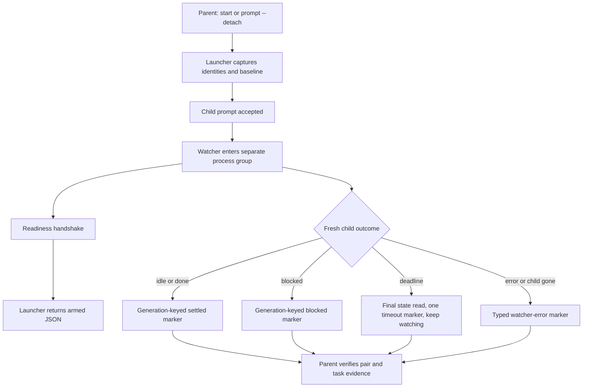

# Detached Herdr Child Supervision - Plan

## Goal Capsule

- **Objective:** make every repository-owned detached child launch self-supervising so its identity-matched parent receives a new turn when the child settles, blocks, or exceeds its supervision deadline.
- **Authority:** the user's choice of a per-child watcher owned by `herdr-child`; the current child-agent contract; the observed silent-idle incident; and the requirements below, in that order.
- **Execution profile:** five implementation units split across explicit launch modes, detached process mechanics, lifecycle classification, managed continuation, and contract migration.
- **Open blockers:** none.
- **Stop conditions:** stop if a watcher cannot survive the parent turn with all inherited harness descriptors closed, if Herdr cannot expose a fresh `state_change_seq` after prompt submission, if the parent lacks a stable `agent_session`, or if the current parent cannot be resolved without targeting an ambiguous pane.
- **Tail ownership:** the implementation run owns focused tests, disposable deployment verification, live acceptance evidence, issue updates, and any required follow-up issue.

---

## Product Contract

### Summary

`herdr-child start` gains two explicit modes: attached `--wait` and supervised `--detach`.
Detached launch returns success only after a one-child watcher is armed outside the parent turn.
The watcher reports observed lifecycle state through a versioned prompt to the identity-matched parent; it never claims that the task succeeded.

### Problem Frame

A parent launched a child in a Herdr tab, requested a final report, and ended its own turn.
The child finished after 18 minutes, wrote the report in its pane, and became `idle`.
No input returned to the parent, so the user discovered the completed work first.

The current contract covers child questions through `herdr-child ask`, but completion still depends on the parent retaining a blocking wait or remembering to poll later.
Making a completion callback mandatory would still depend on a responsive child following instructions and would not cover native `blocked`, tool failure, or deadline wake-up, so it cannot replace an external lifecycle observer.
Managed detach lets the parent yield its turn and keeps the user's active conversation available while a long child task continues in a visible pane.
The existing no-`--wait` path in `home/dot_local/bin/executable_herdr-child` is therefore fire-and-forget rather than managed detach.

### Actors

- A1. **Parent agent:** launches, verifies, reads, replies to, continues, and reaps its child.
- A2. **Child agent:** performs the delegated task in a sibling pane and may call the parent for a decision.
- A3. **Watcher:** a per-child process owned by `herdr-child` that outlives the launch turn and reports lifecycle outcomes.
- A4. **User:** observes panes and supplies decisions that neither parent nor child can make safely.

### Requirements

**Launch modes**

- R1. Every `herdr-child start` invocation selects exactly one of `--wait` or `--detach`.
- R2. Missing, repeated, or conflicting mode flags fail before allocation, pane creation, agent registration, or metadata writes.
- R3. `--wait` retains the attached contract and starts no watcher.
- R4. `--detach` returns success only after prompt acceptance and a watcher readiness handshake.
- R5. Startup/prompt `--timeout` remains separate from `--supervision-timeout`, whose detached default is 3,600,000 ms and accepted range is 1-86,400,000 ms.

**Detached supervision**

- R6. The launcher records detached mode, timeout, a 128-bit generation nonce, child terminal, child `agent_session`, parent terminal, and parent `agent_session` as namespaced, source-scoped pane tokens before arming supervision, and injects the parent identity needed by `herdr-child ask` into the child environment.
- R7. The launcher captures the pre-prompt `state_change_seq`; the watcher binds the child pane, terminal, and session, consumes that baseline, and accepts settlement only after a newer live sequence from the same child session is observed.
- R8. Under one absolute deadline, the watcher polls `agent get` by child pane at a bounded interval until `state_change_seq` advances; it classifies fresh settled or blocked state immediately and may use status-only `agent wait` for the remaining budget only after observing fresh working state.
- R9. The supervision deadline is an absolute wall-clock bound for the first parent wake, not a progress-sensitive idle timeout or a watcher-lifetime bound.
- R10. `wait-error`, `malformed-state`, `child-identity-mismatch`, `child-gone`, `parent-not-found`, `parent-session-mismatch`, `parent-blocked`, `prompt-error`, and the `timeout` outcome remain distinct typed outcomes.
- R11. Timeout wakes the parent after one final state read but never interrupts, kills, closes, or declares failure for the child; after its single timeout marker, the same-generation watcher continues until fresh settlement, managed continuation, reap, or pane closure.

**Parent delivery and continuation**

- R12. Detached launch requires a nonempty parent `agent_session`; the watcher resolves the current parent pane from captured terminal identity and requires the captured session immediately before every delivery attempt.
- R13. Parent wake delivery is keyed by generation plus event, idempotent at-least-once; an uncertain post-delivery failure may duplicate a marker, and the parent suppresses only an exact repeated event so a timeout and later settlement in the same generation both remain actionable.
- R14. A successful `herdr-child ask` remains the primary decision callback, resolves the parent through the captured terminal and session, and includes the current supervision generation when one exists; failed resolution leaves the visible waiting state and lets detached supervision provide fallback.
- R15. `herdr-child reply` advances generation and arms the next watcher only when the target has a live detached generation; an attached child receives the decision without being converted to detached supervision.
- R16. A new pair-addressed `herdr-child prompt` command owns ordinary managed follow-ups and requires an explicit `--wait` or `--detach` mode; `--wait` captures a pre-submission sequence and returns only after newer settlement.
- R17. Direct `herdr agent prompt` remains an unmanaged primitive and is not the documented continuation path for detached children.

**Evidence and failure honesty**

- R18. A supervision marker names observed outcome, typed reason when applicable, child coordinates, and generation; it never uses lifecycle state as proof of task success.
- R19. After wake, the parent verifies the live pair, reads child output, and independently checks requested commits, worktree state, tests, and artifacts.
- R20. Cleanup ownership transfers immediately before prompt submission; catchable launcher signals `INT`, `TERM`, and `HUP` or a non-definitive submission result preserve the child and return a parseable nonzero recovery record with pair, typed reason, and bounded diagnostic reference. Uncatchable termination may emit no record but cannot run destructive cleanup after ownership transfer.
- R21. A temporarily blocked parent or transient prompt failure keeps the same-generation watcher alive for bounded-backoff delivery retries; a fatal mismatch or undeliverable state publishes a visible `supervision failed` child-pane state label plus namespaced diagnostics until managed continuation, reap, or pane closure clears them.
- R22. Read-only posture remains tool suppression rather than filesystem isolation; detached mode does not strengthen that boundary.

**Attached consumers**

- R23. `ask-in-herdr` remains attached through `--wait`; this plan makes no timeout-classification changes to it.
- R24. Pane-backed `se-code-review`, `se-doc-review`, and `se-simplify` remain attached workflows and do not use detached child supervision.
- R25. While armed, the watcher refreshes a short-TTL visible `supervised` child-pane state label at least every 30 seconds; clean settlement or invalidation clears it, while watcher death lets it expire instead of leaving a false armed signal.
- R26. A detached read-write launch declares its exclusive file scope in the launch contract, and the parent does not edit those paths until settlement or explicit supervision abandonment; this remains a cooperative instruction rather than filesystem enforcement.
- R27. `reap` invalidates the current generation before pane closure, and every watcher exits silently when its generation is missing or superseded; disappearance with a still-current generation delivers `child-gone` when the parent identity remains valid.

### Key Flows

- F1. Attached child turn
  - **Trigger:** A1 needs a result before its current turn can finish.
  - **Actors:** A1, A2
  - **Steps:** A1 starts or prompts A2 with `--wait`; the command waits for fresh settlement; A1 reads and verifies the result.
  - **Outcome:** no detached watcher or supervision metadata remains.
  - **Covered by:** R1-R3, R16, R23

- F2. Detached child completion
  - **Trigger:** A1 can yield while A2 continues independently.
  - **Actors:** A1, A2, A3
  - **Steps:** A1 starts A2 with `--detach`; the launcher records generation and baseline state; A3 confirms readiness; A1 may end its turn; A3 observes a fresh settled state and prompts the identity-matched current parent pane.
  - **Outcome:** A1 receives a new turn and verifies task evidence.
  - **Covered by:** R4-R13, R18-R22, R25-R27

- F3. Detached child asks for a decision
  - **Trigger:** A2 cannot continue safely without input.
  - **Actors:** A1, A2, A3, A4
  - **Steps:** A2 sends a generation-keyed callback and publishes its waiting state; A3 suppresses the ordinary settled notification when callback delivery is known; A1 answers or asks A4; `reply` advances generation, delivers the decision, and arms the next watcher.
  - **Outcome:** A2 resumes without losing supervision for its next turn.
  - **Covered by:** R13-R17, R21

- F4. Supervision cannot deliver
  - **Trigger:** watcher arm, identity validation, parent resolution, or parent prompt fails.
  - **Actors:** A1, A2, A3, A4
  - **Steps:** the failing component targets no substitute pane, preserves A2, retries only temporary parent blockage or transient prompt failure, emits structured recovery when A1 is still present, and records bounded passive diagnostics for fatal outcomes.
  - **Outcome:** no false delivery or destructive cleanup occurs; A4 can inspect the child pane.
  - **Covered by:** R10-R13, R20-R21

- F5. Attached callback or follow-up
  - **Trigger:** an attached child asks for a decision or receives another managed turn.
  - **Actors:** A1, A2
  - **Steps:** the callback resolves A1 through captured terminal and session; `reply` delivers without generation or watcher; `prompt --wait` captures its own baseline and waits for newer settlement.
  - **Outcome:** attached work stays attached and cannot return on the prior turn's lifecycle state.
  - **Covered by:** R14-R16, R23

### Acceptance Examples

- AE1. Given a start with neither mode, when argument validation runs, then no Herdr mutation occurs and usage fails.
- AE2. Given an attached start, when the child remains behind a fixture barrier, then `start --wait` does not return before release and starts no watcher.
- AE3. Given a detached start, when the child remains behind the same barrier, then `start --detach` returns only after watcher readiness and before child release.
- AE4. Given a child that settles before watcher readiness completes, when the watcher performs its initial fresh read, then the new generation is delivered once.
- AE5. Given an initial stale `idle` state with unchanged `state_change_seq`, when supervision arms, then no marker is delivered until the sequence advances after the prompt.
- AE6. Given fresh `idle`, `done`, or native `blocked`, when the watcher classifies the child, then the parent receives the corresponding generation-keyed lifecycle marker.
- AE7. Given a deadline race where the freshness poll or wait expires as the child settles, when the final state read is fresh and settled, then settlement wins over timeout.
- AE8. Given a child that remains working through the deadline, when supervision times out, then the parent receives one `timeout`, the child stays live, and later fresh settlement produces a second same-generation wake.
- AE9. Given a successful child callback, when the child settles while waiting, then the parent handles the callback generation without a second actionable wake.
- AE10. Given callback delivery with uncertain metadata persistence, when the watcher emits the same generation and callback event, then the parent treats it as an idempotent duplicate rather than executing the request twice.
- AE11. Given a detached child that resumes after `reply` or ordinary `prompt`, when its next turn settles, then the next generation wakes the parent.
- AE12. Given the parent pane moves while terminal and session identity remain stable, when delivery occurs, then the watcher prompts the current pane.
- AE13. Given the child terminal, child session, or parent session identity changes, when validation runs, then no unrelated pane receives the marker.
- AE14. Given accepted work followed by watcher-arm failure, when `start --detach` returns nonzero, then its JSON recovery record identifies the preserved live child.
- AE15. Given the identity-matched parent is temporarily blocked, when it becomes promptable without changing session, then the watcher retries and delivers one actionable marker for that generation.
- AE16. Given the launching parent has no `agent_session`, when `start --detach` validates the request, then it fails before prompt submission and cleans only resources whose identity it can prove.
- AE17. Given the parent pane moves while terminal and session remain stable, when the child asks a question, then the callback reaches the current parent pane rather than the captured old pane.
- AE18. Given parent resolution becomes fatally ambiguous or delivery retry cannot continue safely, when the watcher stops, then the child pane visibly reports `supervision failed` and retains typed diagnostics.
- AE19. Given a watcher dies without cleanup, when its state-label TTL expires, then the child no longer advertises active supervision.
- AE20. Given `reap` invalidates a generation before closing, when the watcher observes invalidation, then it exits without a `child-gone` wake; unplanned disappearance with a current generation produces that wake.
- AE21. Given a detached read-write launch, when its contract is rendered, then it names the exclusive file scope and forbids overlapping parent edits without claiming enforcement.
- AE22. Given one parent has two detached children, when their events interleave, then pair plus generation-and-event keys route and deduplicate each child independently.
- AE23. Given an attached child receives `reply` or `prompt --wait`, when it resumes, then no watcher is armed and the prompt waits for a sequence newer than its own submission baseline.
- AE24. Given the child registers without `agent_session`, when detached readiness validates identity, then launch fails closed and returns recoverable child coordinates.

### Success Criteria

- Every active repository-owned child launch and continuation selects attached wait or managed detach.
- A detached child produces a parent wake for the supervision deadline and eventual fresh settlement without user polling.
- The parent can distinguish lifecycle state, supervision failure, and task verdict.
- Delivery suppresses known duplicate generation-and-event keys, while parent-side deduplication remains the backstop for uncertain post-prompt delivery without claiming impossible exactly-once semantics.
- Descriptor ownership tests prove the launch command reaches EOF while the watcher remains blocked.
- Armed supervision is visibly live, failed, or expired rather than remaining falsely armed after watcher death.

### Scope Boundaries

- Do not add a Herdr plugin, socket subscriber, launchd service, global daemon, or machine-wide child registry.
- Do not promise watcher crash or machine-restart survival.
- Do not migrate pane-backed `se-*` peers or headless Smithers legs into detached children.
- Do not change attached `ask-in-herdr` or shared `se-*` timeout classification in this plan.
- Do not add automatic approval answers, task-success judgment, timeout killing, worktree allocation, or filesystem sandboxing.
- Do not preserve implicit fire-and-forget compatibility.
- Do not treat terminal, pane, alias, or required session matching as authorization of the original parent or child process.
- Keep `docs/issues/2026-08-17-001-herdr-event-subscription-supervisor.md` open for crash-resilient event supervision after narrowing it around the residual scope.

### Dependencies and Assumptions

- Herdr exposes `agent wait`, `agent get`, `agent prompt`, `pane get`, `state_change_seq`, `terminal_id`, and nonempty `agent_session` on the installed lifecycle boundary.
- A parent terminal uniquely resolves to one live agent record during successful delivery.
- All same-user processes with access to the Herdr control socket are trusted control-plane principals in this iteration; pane tokens and command wrappers coordinate cooperative agents and are not authorization barriers.
- Parent and detached read-write child share one checkout; the declared write scope establishes a cooperative single-writer boundary until the child settles or supervision is abandoned.
- The default one-hour supervision deadline is a wake-up budget, not evidence that healthy tasks cannot run longer; the observed incident settled after 18 minutes, and no broader duration or failure-frequency baseline exists.
- This supervision plan lands before `docs/plans/2026-08-26-1123-feat-herdr-child-tab-mode-plan.md`; `--tab` is orthogonal to `--wait|--detach`, and the tab-mode implementation rebases its parser, cleanup, documentation, and test edits afterward.

### Sources

- `home/dot_local/bin/executable_herdr-child` - current launch, callback, reply, verification, and reap implementation.
- `home/dot_local/bin/executable_herdr-pane-labels` - detached process-group, descriptor-closing, generation, and readiness precedents.
- `home/private_dot_claude/shared/herdr-peer-launch.md` - attached two-peer lifecycle used by the local `se-*` wrappers.
- `docs/solutions/architecture-patterns/child-initiated-callback-over-in-turn-supervision.md` - why supervision must outlive the parent turn.
- `docs/solutions/design-patterns/external-review-legs-as-unreliable-subprocesses.md` - fail-closed subprocess and timeout classification.
- `docs/solutions/design-patterns/semantic-regression-tests-over-source-shape.md` - causal red/green regression-test contract.
- `docs/solutions/design-patterns/idle-machine-wall-clock-bounds-are-latent-flakes.md` - barrier-driven timing tests.
- `docs/solutions/design-patterns/completion-is-not-a-verdict.md` - lifecycle completion versus task verdict.
- `docs/issues/2026-08-18-021-harden-child-agent-ownership-and-launch-cleanup.md` - unresolved parent-scoped authorization boundary.

---

## Planning Contract

### Key Technical Decisions

- KTD1. **Make attached versus detached an explicit public choice.** Removing the default no-wait branch prevents launch prose and caller memory from deciding whether supervision exists.
- KTD2. **Use one per-child watcher process.** A mandatory child callback still trusts the child to reach its final instruction and cannot observe native blockage or a deadline; one watcher per parent would add multiplexing and parent-lifetime routing for the same measured scale of one or two children; a global event supervisor remains the crash-resilient follow-up. The selected per-child process is a reliability backstop for one observed silent-idle incident, not a claim that every covered failure mode is frequent.
- KTD3. **Reuse the proven daemon detachment substrate.** Watcher launch follows `executable_herdr-pane-labels`: a separate process group, detached standard streams, explicit inherited-FD closure, owner-only temporary state, and atomic readiness publication.
- KTD4. **Use a random generation nonce plus a launcher-captured `state_change_seq` baseline.** Nonce equality makes superseded watchers inert; a newer lifecycle sequence distinguishes post-prompt settlement from the agent's startup `idle` state. Because `agent wait` filters only status, the watcher first polls `agent get` at 500 ms intervals until the sequence advances and uses `agent wait` only after fresh working state.
- KTD5. **Separate cooperative metadata writers by stable source.** Lifecycle generation tokens, callback/waiting metadata, and watcher diagnostics use a small fixed source set to prevent accidental collisions; `--source` is caller-selected and provides no writer integrity against another same-user Herdr client.
- KTD6. **Use at-least-once delivery with generation-and-event idempotency.** Parent prompt and callback metadata cannot be atomic, so reliability takes precedence over a false exactly-once claim; exact event duplicates are suppressed while timeout and later settlement remain distinct events in one generation.
- KTD7. **Target the child by pane and refresh its alias.** The watcher binds pane, terminal, and child session; waits by pane; resolves the current alias before delivery; accepts a verified same-session rename consistently with `herdr-child ask`; and classifies same-pane session replacement as identity mismatch.
- KTD8. **Require parent terminal and session identity.** Terminal survives pane movement; nonempty `agent_session` rejects a restarted occupant. Detached launch fails before prompt submission when the parent session is unavailable.
- KTD9. **Treat one hour as a first-wake deadline.** This iteration does not infer progress from pane output or reset an idle timer; final state read prevents settlement-at-timeout from being mislabeled, one timeout marker wakes the parent, and the watcher then continues without another deadline marker until settlement or invalidation.
- KTD10. **Add managed follow-up rather than overloading decision reply.** `herdr-child prompt` handles ordinary continuations and shares the sequence-fresh wait helper; detached prompt advances and rearms generation, attached prompt never arms a watcher, and `reply` retains the marked decision protocol with the same detached-only rearm gate.
- KTD11. **Return machine-readable recovery after submission begins.** Cleanup ownership transfers immediately before invoking `herdr agent prompt`; success reports `supervision.status=armed`, while every in-flight ambiguous result or later arm failure reports `supervision.status=failed`, typed reason, pair, generation, and a bounded diagnostic identifier on stdout JSON, with human explanation on stderr.
- KTD12. **Retry only temporary parent delivery failures.** `agent_blocked` and transient prompt transport failures use capped backoff from 1 to 15 seconds while generation and session still match; identity mismatch and ambiguous parent resolution are fatal and remain passive diagnostics.
- KTD13. **Expose watcher liveness through expiring state labels.** The watcher refreshes `supervised` with a 90-second TTL every wait slice of at most 30 seconds, replaces it with persistent `supervision failed` on fatal exit, and clears it on clean settlement or generation invalidation.
- KTD14. **Own duplicate suppression at both available layers.** The watcher and callback path persist a source-scoped delivered-event receipt after confirmed parent prompt success and skip known exact repeats; uncertain receipt failure may still duplicate, so parent instructions suppress the same generation-and-event key before acting.

### High-Level Technical Design



The launcher changes cleanup ownership immediately before prompt submission because the CLI cannot prove whether a signal interrupted before or after server-side acceptance.
Before submission begins, existing identity-aware pane cleanup remains valid.
During submission and afterward, every ambiguous failure preserves the live child and returns recovery coordinates.

Watcher readiness means descriptor closure, identity capture, generation match, and wait-loop preparation completed.
It does not promise future process survival.

### Metadata Contract

Use namespaced keys no longer than Herdr's token limit and values no longer than its value limit.
The exact short names are selected during implementation, but the semantic fields are fixed:

| Field | Lifetime | Writer | Purpose |
|---|---|---|---|
| supervision mode | child pane lifetime | launcher/managed continuation | distinguish attached from detached continuation |
| supervision timeout | child pane lifetime | launcher/managed continuation | rearm with the selected deadline |
| generation nonce | one managed turn | launcher/managed continuation | invalidate superseded watchers and deduplicate markers |
| child identity | child pane lifetime | launcher | bind terminal and agent session across rename |
| parent identity | child pane lifetime | launcher | resolve callback and watcher delivery across pane movement |
| callback delivery | one callback turn | child callback command | suppress ordinary duplicate delivery when known |
| delivered event | one managed turn | watcher/callback path | suppress a known exact generation-and-event repeat |
| watcher diagnostic | until recovery or pane close | watcher | expose typed failure, posture, and undelivered supervision without redirecting |
| supervision state label | refreshed or persistent | watcher | show live supervision through TTL or a fatal failure until recovery |

Persistent lifecycle tokens and delivered-event receipts carry no TTL within the child pane lifetime.
Transient callback metadata may retain the existing one-hour TTL.
The `supervised` label uses a 90-second TTL refreshed at least every 30 seconds; `supervision failed` persists until managed continuation, explicit reap, or pane closure.
Diagnostic metadata is cleared by successful managed continuation, explicit reap, or pane closure.
These tokens partition cooperative writers but do not authenticate them; `docs/issues/2026-08-18-021-harden-child-agent-ownership-and-launch-cleanup.md` remains the owner of a future parent-scoped authorization boundary.

### Marker Contract

Watcher markers use a new versioned family rather than reusing `[child-settled v1]`, whose existing meaning says the attached answer was already read.

```text
[child-supervision v1 generation=<nonce> agent=<alias> pane=<pane-id> outcome=<idle|done|blocked|timeout|watcher-error> [reason=<typed-reason>]]
```

Typed watcher reasons are `wait-error`, `malformed-state`, `child-identity-mismatch`, `child-gone`, `parent-not-found`, `parent-session-mismatch`, `parent-blocked`, and `prompt-error`.
The marker carries only `wait-error`, `malformed-state`, `child-identity-mismatch`, or `child-gone`, and only when the identity-matched parent can receive it safely.
`parent-not-found`, `parent-session-mismatch`, `parent-blocked`, and terminal `prompt-error` exist only in retry state or passive diagnostics because the intended parent cannot safely receive them at that moment.
The idempotency key is `(generation, outcome, reason-or-empty)`; only exact retries share a key.

### Assumptions

- The selected per-child watcher is sufficient for the measured scale of one or two concurrent children.
- A rare duplicate marker is safer than a silently missed completion and is harmless after generation deduplication.
- Detached mode supports only parents with a nonempty `agent_session`; attached mode retains its current behavior.
- A detached read-write child receives exclusive ownership of its declared file scope until settlement.
- Same-user Herdr clients are trusted cooperative principals; this plan does not protect against a prompt-injected sibling that deliberately calls the Herdr control plane.

### Risks and Mitigations

| Risk | Mitigation |
|---|---|
| Watcher inherits a Bats or agent-harness descriptor and prevents EOF | Reuse the pane-label daemon FD-closing function and add a dedicated descriptor-probe test. |
| Child settles before watcher reaches `agent wait` | Capture baseline before prompt and begin with bounded `agent get` polling rather than status-only wait. |
| Stale startup `idle` triggers immediate false completion | Require `state_change_seq` newer than the prompt baseline. |
| Parent or child pane is replaced | Revalidate terminal and required session identity immediately before delivery. |
| Callback delivery succeeds but metadata write fails | Allow same-generation duplicate fallback and deduplicate in the parent contract. |
| Signal arrives while prompt acceptance is unknown | Transfer cleanup ownership before submission, preserve the child, and print the structured recovery record. |
| Old watcher survives a managed continuation | Replace generation before prompt and require equality before every delivery. |
| Detached parent and child edit overlapping files | Require a declared write scope and instruct one cooperative writer per path without claiming enforcement. |
| Watcher crashes after readiness | Let its `supervised` state label expire and keep the global event-supervisor issue open for active recovery. |
| Parent is temporarily blocked | Retry delivery with capped backoff while generation, terminal, and session remain unchanged. |
| Same-user client mutates source-scoped metadata | State the cooperative trust boundary and keep ownership hardening in its existing follow-up issue. |
| Child disappears while watched or is intentionally reaped | Deliver `child-gone` only while generation remains current; reap invalidates generation before closure so the watcher exits silently. |

### Sequencing

1. Land explicit mode parsing and watcher process substrate together so no revision accepts `--detach` without supervision.
2. Add freshness, identity, marker, and recovery semantics on the proven process substrate.
3. Add callback deduplication and managed continuation after one detached turn is reliable.
4. Align skills, contracts, concepts, issue scope, and disposable deployment coverage.

---

## Implementation Units

### U1. Require explicit launch modes

- **Goal:** remove implicit fire-and-forget before introducing the managed replacement.
- **Requirements:** R1-R5, R12.
- **Dependencies:** none.
- **Files:** `home/dot_local/bin/executable_herdr-child`, `home/private_dot_claude/shared/child-agent-contract.md`, `tests/scripts.bats`.
- **Approach:** before removing the old branch, measure and record that installed Claude, OpenCode, and Pi parent records expose nonempty `agent_session` and that a restarted occupant receives a different value; stop if the prerequisite fails. Then add mutually exclusive mode parsing to `start`, separate supervision-timeout validation, and migrate every active helper and fixture that currently reaches a deeper branch without a mode. U1 and U2 land atomically so no revision accepts `--detach` without an armed watcher.
- **Test scenarios:** session present for each supported kind; restart changes session; no mode; both modes; repeated mode; supervision timeout under `--wait`; missing, zero, over-24-hour, and malformed timeout; validation before `agent list` or `pane split`; existing posture, kind, registry, collision, readiness, and cleanup fixtures still reach their intended branches.
- **Acceptance examples:** AE1-AE2, AE16.
- **Verification:** focused CLI parser and existing `herdr-child` tests pass.

### U2. Add the detached watcher process substrate

- **Goal:** make a watcher survive the parent turn without retaining caller descriptors.
- **Requirements:** R4-R6, R20-R21, R25.
- **Dependencies:** U1.
- **Files:** `home/dot_local/bin/executable_herdr-child`, `home/dot_local/bin/executable_herdr-pane-labels`, `home/dot_local/lib/herdr-aliases.sh`, `tests/scripts.bats`, `tests/herdr_child_descriptor_probe.bats` (new).
- **Patterns:** detached process-group and inherited-FD closure in `home/dot_local/bin/executable_herdr-pane-labels`; causal readiness probes in `tests/herdr_pane_labels_descriptor_probe.bats`.
- **Approach:** move `close_inherited_descriptors` into `herdr-aliases.sh` and source it from both scripts; add an internal, undocumented watcher subcommand; create an owner-only run directory; detach the watcher into its own process group; close inherited descriptors; publish readiness atomically; transfer cleanup ownership immediately before prompt submission; trap `INT`, `TERM`, and `HUP`; preserve the child on every in-flight ambiguous result, later arm failure, or trapped signal; return structured armed or failed supervision JSON; initialize the TTL-backed liveness label before readiness.
- **Test scenarios:** a top-level descriptor probe that cannot skip drives its nested blocked child and proves launcher EOF; watcher has a different process group; readiness cannot be satisfied by PID existence alone; arm failure preserves live child; signal before submission closes safely; the prompt stub records acceptance and blocks before returning, then each catchable signal preserves the child and reports recovery; watcher and launcher clean their owned temporary files; liveness exists before armed JSON returns.
- **Acceptance examples:** AE3, AE14, AE19.
- **Verification:** the dedicated descriptor probe and focused watcher-arm tests pass without elapsed-time assertions as behavioral proof.

### U3. Implement fresh lifecycle classification and parent delivery

- **Goal:** deliver honest, pair-addressed outcomes for one detached child generation.
- **Requirements:** R6-R13, R18-R22, R25, R27.
- **Dependencies:** U2.
- **Files:** `home/dot_local/bin/executable_herdr-child`, `tests/scripts.bats`.
- **Approach:** generate a 128-bit hexadecimal nonce from `/dev/urandom` and fail closed if unavailable; capture pre-prompt sequence plus parent and child identities; poll `agent get` by child pane every 500 ms until sequence freshness; after fresh working state, use `agent wait` in at-most-30-second slices for the remaining first-wake budget and refresh liveness between slices; perform a final read at every boundary; emit one timeout marker and continue watching; classify typed watcher reasons including spontaneous `child-gone`; resolve current child alias and the session-matched parent pane; retry only temporary parent blockage or prompt transport errors with capped backoff; re-read child state before every retry so undelivered timeout is superseded by settlement; record confirmed delivered-event receipts and skip known exact repeats; compare generation before every prompt and loop; invalidate generation before reap closes the pane; publish fatal labels and passive diagnostics when delivery cannot occur.
- **Test scenarios:** unchanged stale idle; idle-to-working-to-idle between polls; fast completion; idle; done; blocked; working/unknown continuation; deadline during freshness polling; timeout racing with settlement; timeout followed by later settlement; blocked timeout delivery superseded by settlement; malformed `agent get`; non-timeout wait failure; child terminal or session replacement; same-pane alias rename; parent pane movement; missing or replaced parent session; temporarily blocked parent; transient prompt failure; absent or ambiguous parent; stale generation; confirmed delivered-event suppression; uncertain receipt failure duplicate without suppressing a later event; liveness refresh and fatal label; intentional reap exits silently; spontaneous pane loss delivers `child-gone`; two children interleave independently; no marker wording that claims task success.
- **Acceptance examples:** AE4-AE8, AE12-AE15, AE18-AE20, AE22, AE24.
- **Verification:** the stateful fake Herdr boundary observes exactly the intended marker generation and no unrelated parent prompt.

### U4. Preserve supervision across callbacks and follow-ups

- **Goal:** make multi-turn detached work remain supervised without overloading the child decision protocol.
- **Requirements:** R13-R17, R21.
- **Dependencies:** U3.
- **Files:** `home/dot_local/bin/executable_herdr-child`, `home/private_dot_claude/shared/child-agent-contract.md`, `tests/scripts.bats`.
- **Approach:** resolve callback parent through captured terminal and session; include generation and event key in detached callbacks; record confirmed callback delivery; accept uncertain exact-event duplicates; add pair-addressed `prompt` only after U3's sequence-fresh wait helper exists; advance generation before detached `reply` or `prompt`; leave attached `reply` generation-free and make attached `prompt --wait` wait for its own newer sequence; arm a watcher only for detached continuation; clear transient callback or diagnostic metadata under its owning source.
- **Test scenarios:** successful callback follows a moved parent pane and suppresses an exact ordinary duplicate; failed parent resolution leaves waiting state and gets watcher fallback; prompt success followed by metadata failure yields an idempotent exact-event duplicate; repeated generation and event is ignored while a different event remains actionable; detached decision reply and ordinary follow-up produce a later marker; attached reply and prompt arm no watcher; attached prompt against an already-working child waits for post-submission settlement; generation or rearm failure after prompt submission preserves the child and reports recovery.
- **Acceptance examples:** AE9-AE11, AE17, AE23.
- **Verification:** two-turn detached fixtures pass for decision and ordinary follow-up paths.

### U5. Align operational contracts and deployment evidence

- **Goal:** make every agent-facing instruction and deployed copy describe the implemented lifecycle honestly.
- **Requirements:** R17-R27.
- **Dependencies:** U3-U4.
- **Files:** `home/private_dot_claude/skills/herdr/SKILL.md`, `home/private_dot_claude/skills/ask-in-herdr/SKILL.md`, `home/private_dot_claude/shared/child-agent-contract.md`, `CONCEPTS.md`, `tests/smoke.bats`, `docs/issues/2026-08-17-001-herdr-event-subscription-supervisor.md`, `docs/issues/2026-08-18-021-harden-child-agent-ownership-and-launch-cleanup.md`, `docs/solutions/architecture-patterns/child-initiated-callback-over-in-turn-supervision.md`.
- **Approach:** add attached and detached recipes; define generation-and-event markers, session identity matching, liveness/failure labels, cooperative write scope, same-user trust, timeout response, and parent evidence verification; replace raw detached follow-up instructions; correct stale reap syntax; update the child-agent concept; clarify that in-turn supervision remains rejected while an external per-child watcher is now the backstop; narrow but keep the global supervisor issue open through `python3 scripts/issues`; widen the ownership-hardening issue to cover managed prompt, generation advance, and watcher invalidation by a wrong parent.
- **Test scenarios:** source and deployed docs expose both modes; detached examples declare read-write scope and parse returned pair and armed status; timeout guidance says verify working state, leave the child live, and escalate to the user only when task-specific expectations are exceeded; marker handling verifies pair plus generation and event; no active example uses mode-less start or raw detached continuation; attached workflows are explicitly unchanged; both issue validations pass.
- **Acceptance examples:** AE21 plus deployed contract coverage for AE1-AE24.
- **Verification:** source contract assertions, disposable deployment smoke tests, and repository issue validation pass.

---

## Verification Contract

| Command | Covers | Done signal |
|---|---|---|
| `bash -n home/dot_local/bin/executable_herdr-child home/dot_local/bin/executable_herdr-pane-labels home/dot_local/lib/herdr-aliases.sh` | U1-U4 | The managed shell entry points and shared library parse under system Bash. |
| `bats tests/scripts.bats tests/herdr_child_descriptor_probe.bats` | U1-U4 | Mode, process, freshness, delivery, continuation, and descriptor scenarios pass. |
| `make lint` | U1-U5 | Shellcheck passes with Bash 3.2-compatible code. |
| `make test-issues` | U5 | The residual supervisor and ownership-hardening issues remain valid and queryable. |
| `make test-local` | U1-U5 | Chezmoi dry-run reports only intended managed-file changes. |
| `make test-ubuntu` | U1-U5 | Disposable apply and the complete Linux suite pass against this checkout with no silently skipped applicable coverage. |
| `git diff --check` | U1-U5 | The implementation and plan diff contains no whitespace errors. |

`make test-suite` is not evidence for this managed-source change because it reads the already-deployed home directory.

The implementation also requires two live macOS acceptance cases after user-managed sync and apply: a detached child that settles after the parent launch turn ends, and a short-deadline child that wakes once for timeout then again for settlement.
For both cases, observe generation-and-event parent turns without polling, verify pair and task evidence, confirm liveness labels clear, and reap the child safely.

Each new lifecycle regression test must be observed red under the intended mutation and green after restoration.
At minimum, independently remove watcher launch, freshness checking, generation checking, parent delivery, and inherited-descriptor closure and prove the corresponding focused case fails.

---

## Definition of Done

- U1-U5 satisfy every cited requirement and acceptance example.
- No active repository-owned child start or managed continuation relies on implicit fire-and-forget behavior.
- Detached success means a watcher completed its causal readiness handshake, not merely that a process was spawned.
- Fresh `idle`, `done`, `blocked`, timeout, `child-gone`, watcher error, and delivery failure remain distinguishable.
- Callback and watcher races suppress confirmed generation-and-event duplicates, with parent-side handling for uncertain residual duplicates and no exactly-once claim.
- Parent and child identity mismatches fail closed and never redirect to another pane.
- Watcher liveness expires after a crash, fatal supervision is visible on the child pane, and reap invalidates the watcher before closure.
- Detached read-write instructions declare cooperative exclusive file scope without claiming filesystem enforcement.
- Attached consult and `se-*` peer lifecycles retain their existing behavior and ownership.
- Documentation states that settlement is a wake signal and read-only posture is not filesystem containment.
- Abandoned experimental watcher, metadata, and test-harness code is removed from the final diff.
- `bash -n home/dot_local/bin/executable_herdr-child home/dot_local/bin/executable_herdr-pane-labels home/dot_local/lib/herdr-aliases.sh`, `bats tests/scripts.bats tests/herdr_child_descriptor_probe.bats`, `make lint`, `make test-issues`, `make test-local`, `make test-ubuntu`, and `git diff --check` pass.
- The live acceptance run is reported separately from checkout verification and is not claimed before the user syncs and applies the managed source.
