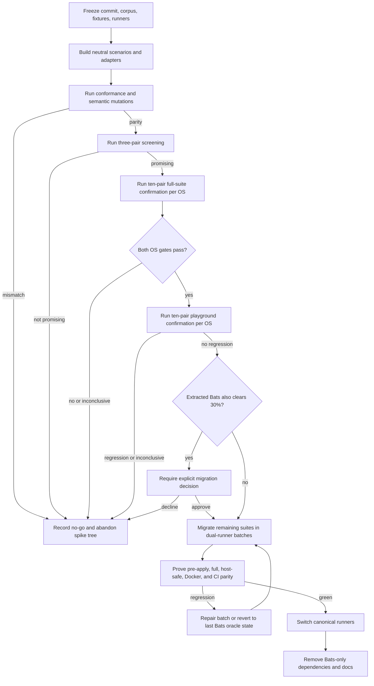

# Bashunit Performance-Gated Test Migration - Plan

## Goal Capsule

- **Objective:** Replace bats-core with bashunit only if a pinned bashunit candidate preserves the repository's test semantics and safety boundaries while reducing the current full `scripts` suite median wall time by at least 30% on both macOS and Ubuntu.
- **Authority:** Semantic regression coverage and workstation safety outrank performance; the paired benchmark protocol outranks historical timings and runner marketing; migration convenience ranks last.
- **Open blockers:** None for implementation. The candidate's performance is intentionally unresolved and is decided by the benchmark gate.
- **Execution profile:** Build a reversible dual-runner spike, execute a manually dispatched benchmark, then either remove the candidate or migrate the remaining suites incrementally.
- **Stop conditions:** Stop before timing on any parity mismatch. Stop the migration if either operating system misses the performance gate, the benchmark is inconclusive, the shared-home scheduler cannot be preserved, or candidate lifecycle cleanup is unreliable.
- **Tail ownership:** Automated conformance and parity checks prove behavior. The benchmark workflow produces the adoption verdict. Final CI and Docker gates prove cutover completeness.

---

## Product Contract

### Summary

Build a reversible A/B evaluation of bats-core and bashunit against the same `scripts` scenarios, then migrate the complete test infrastructure only if bashunit clears the correctness and performance gates on macOS and Ubuntu.

### Problem Frame

The historical 249-second macOS result describes an older, smaller suite and cannot represent current developer feedback time. Recent session evidence shows `tests/scripts.bats` growing from 212 tests in about 6 minutes to 250 tests in 20 minutes 39 seconds. The filtered `playground` workload grew from about 5 minutes to about 17 minutes. These measurements establish urgency, but changing test counts and scenario cost prevent them from attributing the regression to bats-core.

The incumbent is deeply embedded: the main branch currently has 390 Bats declarations, 482 `run` calls, 1,210 assertion or refutation calls, 124 skips, Bats temporary-directory variables, three helper libraries, a Bats-specific macOS lock adapter, and provisioning in Homebrew, Docker, and both CI operating systems. A direct syntax rewrite would change discovery, command capture, assertion control flow, skip behavior, hooks, temporary-resource cleanup, and parallel scheduling at the same time. A green candidate run would therefore be insufficient evidence.

The migration must answer two questions in order. First, can bashunit execute the same observable contracts without weakening tests or violating the shared deployed-home boundary? Second, does the safety-preserving bashunit execution shape materially reduce wall time? Only an affirmative answer to both justifies the full migration.

### Key Decisions

- **Use an A/B gate before full migration.** (session-settled: user-approved - chosen over rewriting the suite immediately: the speed claim must be measured on this repository's workload.) Governs R1-R10.
- **Make performance an acceptance requirement.** (session-settled: user-approved - chosen over trusting bashunit's published speed positioning: the candidate must demonstrate a repository-specific gain.) Governs R8-R10.
- **Gate the 30% improvement on the full `scripts` workload on both operating systems.** (session-settled: user-directed - chosen over requiring 30% in every filtered cell or accepting a macOS-only result: the full suite is representative while both supported platforms must benefit.) Governs R8-R9.

### Requirements

**Candidate and parity**

- R1. The spike must use immutable runner identities, including bashunit `0.50.1` at commit `28ea63c467f1f461a6368c93e5c264051b141c6f` with SHA-256 `18d83d590c5304f1853dd4fe4fec4ec6effbd9fe5a21831fe9f66f70afe17d93`, and a recorded immutable bats-core `v1.14.0` identity.
- R2. Extracted Bats and bashunit must execute one framework-neutral source for each benchmarked scenario; thin discovery adapters may differ, but scenario actions and assertion calls must not. Frozen original Bats remains the performance baseline and first-stage semantic oracle rather than consuming the extracted source.
- R3. A project-owned compatibility API must preserve every Bats command-capture, assertion, filesystem-match, line-match, failure, skip, hook, and temporary-resource behavior used by the benchmarked scenarios.
- R4. Correctness parity must merge framework-native machine reports for identities, statuses, and exit verdicts with a supplemental sidecar for canonical-ID mapping, dynamic skip reasons, cleanup outcomes, fixture digests, and owned-resource ledgers.
- R5. Adapter conformance must include pass, failure, skip, hook failure, timeout or interruption, empty selection, risky or assertion-free tests, and cleanup controls on macOS Bash 3.2 and Ubuntu Bash; the outer runner owns cleanup when framework hooks cannot finish.
- R6. Semantic preservation must include targeted red-state or mutation evidence for each compatibility primitive so a weakened shared scenario cannot pass merely because both runners execute the same mistake.

**Execution safety**

- R7. Both runners must preserve sequential file execution, eight-way within-file execution for ordinary suites, fully serial idempotency execution, separate pre-apply and post-apply gates, distinct full and host-safe modes, and the fail-closed `MMS_DISPOSABLE_HOME=1` boundary.
- R8. Timing must begin immediately before runner process creation and end after runner-owned reporting and cleanup; dependency installation, `chezmoi apply`, parity comparison, and evidence packaging remain outside the timed interval.

**Performance decision**

- R9. Bashunit passes the adoption gate only when, separately on macOS and Ubuntu, at least nine of ten paired full-`scripts` improvements are at least 30% and the coefficient of variation of paired time ratios is at most 10%.
- R10. The filtered `playground` workload must resolve to a non-empty frozen canonical-ID set, preserve semantic parity, and show no regression under the same exact lower-bound rule at a 0% threshold; it is a developer-feedback control rather than a second 30% adoption gate.
- R11. The experiment must use three near-balanced screening pairs per operating system and workload before spending on ten fresh confirmation pairs; screening uses a pre-registered 2/1 framework-order split and its samples must not enter confirmation statistics.
- R12. Any corpus, helper, fixture, runner, shell, runner-image cohort, scheduler, filter, timing-boundary, or evidence-protocol change invalidates the complete affected cell. One externally contaminated cell may be rerun from scratch with manual approval; a second invalid cell ends the experiment.

**Conditional migration and cutover**

- R13. A rejected, invalid, or inconclusive candidate must leave the final baseline tree and canonical Bats commands unchanged except for a durable self-verifying report package under `docs/benchmarks/`, remove the temporary default-branch workflow registration, and abandon the disposable spike tree.
- R14. A passing candidate must migrate the remaining suites in bounded batches while Bats remains the runtime oracle; read-only suites run sequentially, while state-mutating oracle and candidate suites receive separate disposable homes cloned from the same initial snapshot.
- R15. The final bashunit runner must retain explicit manifests for pre-apply, post-apply full, and post-apply host-safe execution and must continue after a file failure long enough to collect cleanup and aggregate failure evidence.
- R16. Cutover must update local commands, CI, Docker, managed package provisioning, helper libraries, contract tests, and current contributor documentation before removing Bats-only dependencies and the macOS Bats lock adapter.
- R17. Historical plans, issues, benchmarks, and learning documents must retain their original Bats references as historical evidence unless a current operational instruction inside them would otherwise become false.
- R18. A production-code or test-contract defect discovered during the migration must be fixed separately, establish a new Bats baseline, and invalidate benchmark evidence collected against the prior corpus.
- R19. Before canonical cutover, every benchmark-sensitive digest from the passing candidate must still match the frozen evidence; any drift requires rerunning every affected benchmark cell before migration can resume.
- R20. If extracted Bats independently clears the same full-suite 30% rule, the report must expose the cheaper extraction-only path and pause before migration for an explicit decision; a bashunit performance pass alone does not silently choose the larger change.

### Key Flows

- F1. **Evaluate the candidate**
  - **Trigger:** The pinned runners, neutral `scripts` scenarios, adapters, and conformance controls are ready on one frozen commit.
  - **Steps:** Establish the Bats oracle, prove cross-runner parity, run screening pairs, promote only a promising candidate, run confirmation pairs, then calculate the per-platform verdict.
  - **Outcome:** The candidate reaches `candidate-passed`, `candidate-rejected`, `experiment-inconclusive`, or `experiment-invalid` with complete evidence.
  - **Covers:** R1-R12.
- F2. **Close a failed experiment**
  - **Trigger:** Parity fails, screening is not promising, confirmation misses the gate, or evidence is invalid or inconclusive.
  - **Steps:** Generate and verify the report on the spike tree, apply only the allowlisted report package onto the frozen baseline, assert the resulting tree and canonical-command digests, rerun the baseline Bats semantic and infrastructure gates, then retire the spike ref and temporary workflow registration.
  - **Outcome:** Bats remains canonical with no dormant candidate path or compatibility layer.
  - **Covers:** R13, R18.
- F3. **Migrate after a passing experiment**
  - **Trigger:** The full `scripts` workload passes R9 on macOS and Ubuntu, the `playground` control satisfies R10, and any extraction-only decision required by R20 approves bashunit migration.
  - **Steps:** Port remaining suites in bounded batches, run both frameworks sequentially as oracle and candidate, pause and re-benchmark on evidence-invalidating drift, cut canonical entry points to bashunit, complete one clean canonical verification cycle, then remove Bats-only infrastructure.
  - **Outcome:** Every canonical test surface uses bashunit with preserved behavior and no Bats runtime dependency.
  - **Covers:** R14-R20.

### Acceptance Examples

- AE1. **Parity blocks timing.** Given a bashunit adapter omits a dynamic skip reason or changes a regex filesystem assertion, when the parity gate runs, then it reports the exact identity mismatch and no timing sample is accepted.
- AE2. **The scheduler preserves shared-home safety.** Given ordinary and idempotency files are selected, when the bashunit post-apply runner executes them, then files never overlap, ordinary tests use at most eight workers, and idempotency tests remain serial behind the disposable-home guard.
- AE3. **A performance pass is conservative.** Given ten valid paired full-suite samples on each operating system, when at least nine pairs per operating system improve by at least 30% and paired-ratio variation stays within R9, then the full-suite gate passes.
- AE4. **One weak platform rejects migration.** Given macOS clears R9 but Ubuntu does not, when the verdict is calculated, then the overall decision is no-go and full migration does not start.
- AE5. **A no-go leaves no second framework.** Given the candidate fails screening or confirmation, when experiment cleanup completes, then the original Bats suites and commands pass and no bashunit, adapter, or compatibility-only artifact remains.
- AE6. **Cutover keeps every execution mode.** Given all suites have migrated, when pre-apply, post-apply full, post-apply host-safe, Docker, Ubuntu CI, and macOS CI run, then each mode selects the same intended contracts and safety boundary as its Bats predecessor.
- AE7. **Extraction-only speedup does not force a framework migration.** Given extracted Bats also clears the full-suite 30% rule, when the report is published, then migration pauses with both paths and their attribution evidence visible for an explicit decision.

### Success Criteria

- The adoption verdict is reproducible from raw paired samples, immutable environment, corpus, helper, fixture, and runner identities, and a retained read-only verifier shipped inside the report package.
- No test disappears, changes status, changes skip reason, weakens a regression signal, leaks a resource, or crosses the shared-home concurrency boundary.
- A passing candidate clears R9 on both operating systems and does not produce a confirmed `playground` regression.
- A no-go returns the repository to one maintained Bats path with no experimental dead code.
- A successful cutover leaves one maintained bashunit path and removes all current Bats-only operational dependencies.

### Scope Boundaries

- Do not change production-script behavior to make either runner faster.
- Do not loosen assertions, remove slow scenarios, reduce fixture fidelity, or raise behavioral deadlines to manufacture a performance win.
- Do not evaluate unsafe all-files bashunit parallelism as an adoption candidate.
- Do not run real `chezmoi apply` on the workstation; deployment and idempotency proof remains in disposable Docker or CI environments.
- Do not retain an unmaintained dormant Bats fallback after cutover.
- Do not rewrite historical Bats measurements or incident records.

### Dependencies and Sources

- `tests/run-post-apply.sh` owns the current file manifests and scheduler boundary.
- `tests/helpers/common.bash` and `tests/helpers/herdr_task_sync.bash` own most framework coupling.
- `docs/decisions/0002-guard-the-idempotency-suite-with-a-disposable-home-marker.md` owns the host-safety rule.
- `docs/solutions/design-patterns/semantic-regression-tests-over-source-shape.md` owns semantic red/green proof.
- `docs/solutions/design-patterns/skip-set-parity-proves-reduced-dependencies.md` owns identity-level skip parity.
- `docs/solutions/design-patterns/idle-machine-wall-clock-bounds-are-latent-flakes.md` separates liveness guards from performance evidence.
- `docs/plans/2026-08-20-2217-perf-parallel-bats-suite-plan.md` supplies the paired-control and runner-variance precedent.
- [bashunit 0.50.1 release](https://github.com/TypedDevs/bashunit/releases/tag/0.50.1) and [pinned documentation](https://github.com/TypedDevs/bashunit/tree/28ea63c467f1f461a6368c93e5c264051b141c6f/docs) define candidate behavior.
- [Bats v1.14.0 documentation](https://github.com/bats-core/bats-core/tree/eb7f42f8d608ac693d7a4b67474f6714ea68cfc5/docs) defines the incumbent oracle.
- [NIST blocking and randomization guidance](https://www.itl.nist.gov/div898/handbook/pri/section3/pri332.htm), [Hyperfine benchmark guidance](https://github.com/sharkdp/hyperfine/blob/master/README.md), and [pyperf stability guidance](https://pyperf.readthedocs.io/en/latest/system.html) shape the benchmark protocol.

---

## Planning Contract

### Key Technical Decisions

- KTD1. **Freeze both runners and the benchmark corpus.** Download the versioned bashunit release asset through the repository installer and require the version and checksum from R1 on every platform; do not rely on the rolling Homebrew formula for exact acquisition. Resolve bats-core `v1.14.0` to commit `eb7f42f8d608ac693d7a4b67474f6714ea68cfc5` through an immutable acquisition path. Every benchmark report records runner, shell, corpus, helper, fixture, environment, and command digests.
- KTD2. **Extract one neutral scenario source with thin runner adapters.** (session-settled: user-approved - chosen over independently rewriting equivalent Bats and bashunit tests: identical scenario bodies are required for runner attribution.) Preserve frozen original Bats as the user-facing performance control. First prove original Bats against extracted Bats, then prove extracted Bats against bashunit. The 30% adoption gate compares candidate bashunit with original Bats. Extracted Bats is an attribution diagnostic, not an additional pass/fail gate; if it independently clears the adoption threshold, R20 forces an explicit choice before migration.
- KTD3. **Retain a narrow runner-neutral project test API after a successful cutover.** The neutral API owns scenario-level command capture, assertions, skips, and temporary resources. Bats globals and lifecycle emulation stay inside the disposable Bats adapter. Implement an argv-safe result tuple, regex-preserving filesystem assertions, indexed line assertions, immediate skip termination, hook cleanup, and temporary-resource ownership without `eval`.
- KTD4. **Combine native reports with supplemental evidence.** Framework-native machine reports own identity, status, and exit verdict. A fail-closed sidecar supplies canonical-ID mapping, dynamic skip reason, fixture digest, explicit cleanup outcome, and resource ledger. Missing, duplicate, malformed, or non-terminal sidecar records invalidate parity.
- KTD5. **Reproduce the scheduler and own cleanup above the framework.** Invoke bashunit once per file. Ordinary files run tests with eight workers; idempotency runs without parallelism. A Python standard-library supervisor creates a separate process session for each runner invocation, handles terminal events, performs bounded TERM/KILL escalation for the process group, finalizes evidence, and sweeps ledger-owned resources. Enable strict and fail-on-risky modes only after conformance and raw-predicate inventory prove they preserve intended Bats behavior.
- KTD6. **Separate correctness, screening, and confirmation.** Parity and conformance run before timing. Screening uses three fresh near-balanced paired blocks and promotes only when both full-suite operating-system medians show at least 20% improvement and the non-empty `playground` control is not slower. Full confirmation uses ten new three-arm jobs per operating system. Original Bats, candidate bashunit, and extracted Bats each receive a restored fixture state; the pre-registered order schedule balances original-versus-candidate and original-versus-extracted at five orders each while distributing all six three-arm permutations as evenly as ten jobs allow. Passing full confirmation triggers ten fresh two-arm `playground` pairs per operating system.
- KTD7. **Use a conservative paired acceptance rule.** For each pair calculate `g_i = 1 - candidate_i / bats_i`. Sort the ten improvements and require the second-smallest value to clear the threshold, which deterministically requires nine of ten pairs to pass without claiming population-median confidence from hosted-runner samples. Apply a 30% threshold to full `scripts`, a 0% threshold to `playground`, and a 10% coefficient-of-variation cap to paired time ratios. A stability miss is `experiment-inconclusive`.
- KTD8. **Run expensive benchmarks outside routine PR CI with an explicit cost boundary.** First register an inert, manual-only workflow at the benchmark path on the default branch because GitHub dispatch requires that path to exist there. Replace the same path with the real workflow on an immutable spike tag and dispatch that ref explicitly through the CLI with no divergent input schema. Each screening or `playground` pair keeps its two arms on one actual runner. Each full-confirmation job keeps all three arms on one runner, restores equivalent logical fixture state before every arm, and reports candidate-versus-original as the adoption comparison and extracted-versus-original as the R20 attribution diagnostic. The first attempt is bounded to 52 jobs across screening and both confirmation workloads. Pre-register every job and arm order, prohibit automatic reruns, record runner-image and hardware cohorts, and require operator approval of the numeric projected runner-minute ceiling before confirmation.
- KTD9. **Keep Bats as oracle until cutover, then remove it.** A passing benchmark promotes the exact frozen spike tree into bounded dual-runner migration. A no-go lands only the allowlisted self-verifying report package onto the frozen baseline tree and removes the temporary default-branch workflow registration. Canonical Make, CI, and Docker entry points remain Bats-owned until every execution mode reaches parity. If R18 invalidates evidence during migration, stop at the last green Bats-oracle checkpoint, freeze the corrected baseline, rerun affected cells, resume only on a new passing verdict, and otherwise execute the no-go cleanup path.

### High-Level Technical Design

The benchmark workflow has four verdict classes: `candidate-passed`, `candidate-rejected`, `experiment-inconclusive`, and `experiment-invalid`. Parity, cleanup, timeout, or candidate-execution failure rejects the candidate. Excess paired-ratio variation is inconclusive. External contamination or incomplete evidence invalidates the experiment. `candidate-passed` is a transition into migration eligibility rather than the successful-cutover terminal state, and R20 may pause that transition for an explicit architecture decision.

### Benchmark Evidence Contract

Before timing, an experiment manifest enumerates every expected cell, job ID, complete arm order, commit, protocol ID, runner identity, and immutable digest. Each raw arm records those fields plus runner-image release, hardware cohort, shell identity, timing boundary, selected-test manifest digest, fixture and helper digests, pre/post resource ledger, exit verdict, parity digest, and wall seconds. Aggregation fails closed on missing, duplicate, unexpected, mixed-attempt, mixed-protocol, checksum-invalid, or individually invalid artifacts.

The `playground` selector must resolve to a non-empty canonical-ID set on the frozen commit. Its three screening pairs control cost only. After both full-suite gates pass, ten fresh pairs per operating system must clear KTD7 at a 0% threshold. If the selector is absent because the feature branch has not landed, the experiment waits for a new frozen baseline rather than inventing a substitute workload.

### Alternatives Considered

- **Immediate full migration:** Rejected because framework semantics and scheduler differences could produce a green but weaker suite before speed is known.
- **Benchmark native rewrites in both frameworks:** Rejected because different assertions and command-capture paths make runner attribution impossible.
- **Benchmark only a small playground subset:** Rejected as the adoption gate because the subset does not represent the complete `scripts` workload or its helper cost.
- **Require 30% in both full and filtered workloads:** Rejected by the user because the full suite is the representative gate; `playground` remains a non-regression control.
- **Use one global bashunit parallel invocation:** Rejected because it overlaps files that share and mutate the deployed home.
- **Keep Bats as a permanent fallback:** Rejected because two maintained frameworks would duplicate infrastructure and allow parity to drift.

### Implementation Constraints

- Use Bash-compatible helpers that run under macOS `/bin/bash` 3.2 and Ubuntu Bash.
- Use Python standard library code for evidence normalization, deterministic statistics, and protocol validation; add no benchmark package dependency.
- Use the same Python standard-library supervisor for every measured and parity runner invocation so process-group cleanup semantics cannot drift between paths.
- Pass `--skip-env-file` and every required bashunit option explicitly so ambient `.env` or `.bashunitrc` files cannot affect evidence.
- Never translate dynamic argv arrays into evaluated command strings.
- Keep framework-native report parsing and supplemental sidecar validation separate from benchmark statistics so neither can validate its own output.
- Classify suites as read-only or state-mutating; state-mutating oracle and candidate arms never share a prepared home.
- Keep correctness synchronization causal. Benchmark wall time externally and do not convert performance thresholds into per-test timeouts.
- Preserve current test IDs in a stable canonical map even when bashunit function names require normalization.
- Continue all safe cleanup and evidence collection after a file failure, then fail the aggregate suite.
- Keep benchmark acquisition and execution separate from timed regions.

### Sequencing

1. Establish immutable inputs, the benchmark protocol, and conformance controls.
2. Extract the complete current `scripts` scenarios behind dual adapters without changing original or canonical Bats behavior.
3. Prove semantic parity and execute the candidate gate.
4. Stop and abandon the disposable spike tree on any no-go result.
5. On pass, migrate remaining suites from low-risk to safety-sensitive while Bats remains oracle.
6. Switch canonical commands only after every execution mode reaches parity.
7. Remove Bats-only infrastructure and run final end-to-end verification.

### System-Wide Impact

- **Developers:** Focused and full test commands change only after cutover. During evaluation, candidate commands remain explicit and non-canonical.
- **Local feedback evidence:** After a hosted candidate pass, record one untuned paired full-`scripts` observation on a documented representative developer Mac before migration. This observation validates direction for the primary local workflow but does not replace the reproducible R9 gates.
- **CI:** Routine PR jobs retain their existing timeouts. A manual benchmark workflow carries the expensive paired experiment and stores raw evidence.
- **Docker:** Disposable Ubuntu application and idempotency behavior remain the authoritative source-deployment proof.
- **Managed environment:** A successful migration removes the managed Bats package. Bashunit is acquired by the repository-owned checksummed installer on every platform rather than an unversioned Brewfile entry; a no-go changes no managed dependency.
- **Repository dependencies:** Successful cutover removes three Bats helper gitlinks and the Bats-specific macOS lock adapter.

### Risk Analysis and Mitigation

| Risk | Consequence | Mitigation |
|---|---|---|
| Shared assertion weakening | Both runners pass an ineffective test | Conformance fixtures plus targeted red-state mutation proof per compatibility primitive |
| Skip or discovery drift | Green suite silently loses coverage | Canonical IDs, skip-reason sidecar, fail-on-empty and fail-on-risky gates |
| Unsafe file overlap | Shared home or idempotency state races | Outer sequential file runner and serial idempotency mode |
| Hosted-runner variance | False 30% verdict | Same-runner pairs, balanced order, fresh confirmation samples, conservative nine-of-ten acceptance boundary, and ratio-variation cap |
| Resource contamination | Later arm inherits leaked state | Pre/post fixture digest and owned-resource ledger; invalidate and reprovision the whole pair |
| Candidate lifecycle defects | Cleanup or result loss under parallel failure | Minimum bashunit 0.50.1, interruption and teardown probes, repeated parity runs |
| Long benchmark cost | Workflow timeout or excessive CI spend | Manual dispatch, three-pair screening, bounded confirmation matrix, no routine PR execution |
| Compatibility facade becomes accidental product | Permanent legacy API without value | Keep it only if the candidate passes; document it as the stable project test API after cutover |
| Mid-migration production defect | Benchmark corpus and baseline drift | Stop at the last green Bats-oracle checkpoint, fix separately, establish a new frozen baseline, rerun affected cells, and execute no-go cleanup if the new verdict fails |

---

## Implementation Units

| Unit | Title | Primary files | Depends on |
|---|---|---|---|
| U1 | Freeze benchmark protocol and runner acquisition | `scripts/test-runner-benchmark.py`, benchmark fixtures | None |
| U2 | Build runner conformance and compatibility API | `tests/helpers/test-api-*.bash`, conformance suites | U1 |
| U3 | Establish scenario registry and non-Herdr scripts bridge | `tests/scenarios/scripts.bash`, `tests/scripts.bats` | U2 |
| U9 | Port Herdr task-sync core contracts | `tests/helpers/herdr_task_sync.bash`, descriptor probes | U3 |
| U10 | Complete Herdr and playground scripts bridge | `tests/scenarios/scripts.bash`, scripts adapters | U9 |
| U11 | Assemble manual benchmark workflow | `.github/workflows/benchmark-bashunit.yml` | U10 |
| U4 | Execute adoption gate | `docs/benchmarks/bashunit-migration.md` | U11 |
| U5 | Migrate pre-apply templates | template scenarios and adapters | U4 pass |
| U6 | Migrate host-safe post-apply suites | smoke, palette, and platform scenarios | U5 |
| U7 | Migrate idempotency and switch runners | post-apply runner, Make, CI, Docker | U6 |
| U8 | Remove Bats-only infrastructure | provisioning, submodules, documentation | U7 |

### U1. Freeze the benchmark protocol and runner acquisition

- **Goal:** Create reproducible runner acquisition, benchmark evidence, and verdict calculation without changing canonical test commands.
- **Requirements:** R1, R8-R12.
- **Dependencies:** None.
- **Files:** `tests/runner-versions.env`, `scripts/install-test-runner`, `scripts/test-runner-benchmark.py`, `tests/test_runner_benchmark.py`, `tests/fixtures/test-runner-benchmark/`, `docs/benchmarks/verify-bashunit-migration-report.py`.
- **Approach:** Pin and verify both runners before execution. Define the frozen protocol, paired block schedule, environment and corpus fingerprints, pre-timing manifest, sample artifact format, exact order-statistic decision rule, ratio-variation checks, and four terminal verdicts. Keep workflow assembly out of this unit until the candidate runner exists.
- **Execution note:** Prove the statistics and invalidation logic with synthetic fixtures before using costly hosted runners.
- **Patterns to follow:** `tests/test_ci_workflow.py`, `tests/test_post_apply_suite_contract.py`, and the paired-control precedent in `docs/plans/2026-08-20-2217-perf-parallel-bats-suite-plan.md`.
- **Test scenarios:**
  - Exactly nine of ten full-suite pairs improving by at least 30% clears the deterministic acceptance boundary; eight of ten does not.
  - A paired-ratio coefficient of variation exactly at 10% remains eligible while a value above it returns `experiment-inconclusive`.
  - One operating system passing and one failing returns an overall no-go.
  - Screening promotes only with three valid pairs, at least 20% median improvement on both operating systems, and no `playground` median regression.
  - A changed corpus, helper, fixture, runner, shell, scheduler, or timing digest rejects mixed samples.
  - A timeout, cancellation, parity failure, or contaminated resource ledger invalidates the complete pair rather than one arm.
  - Screening uses a pre-registered 2/1 order split; full confirmation balances both original-versus-candidate and original-versus-extracted order at five each while distributing all six three-arm permutations by counts of one or two; raw outliers remain in the report.
  - Missing, duplicate, unexpected, mixed-attempt, mixed-protocol, or checksum-invalid artifacts fail aggregation.
  - One approved external-contamination rerun replaces a complete cell; a second invalid cell ends `experiment-invalid`.
  - A downloaded candidate with the wrong digest fails before any test process starts.
  - The read-only report verifier reproduces a generated verdict and rejects altered samples, digests, protocol identity, or aggregate fields.
- **Verification:** Unit tests prove protocol determinism, immutable acquisition, invalidation boundaries, and conservative verdicts.

### U2. Build runner conformance and the compatibility API

- **Goal:** Provide one scenario-facing API whose observable semantics match Bats under both runners.
- **Requirements:** R2-R7.
- **Dependencies:** U1.
- **Files:** `tests/bootstrap.sh`, `tests/helpers/test-api.bash`, `tests/helpers/test-api-bats.bash`, `tests/helpers/test-api-bashunit.bash`, `scripts/test-runner-supervisor.py`, `scripts/test-runner-parity.py`, `tests/test_test_runner_supervisor.py`, `tests/test_test_runner_parity.py`, `tests/runner-conformance.bats`, `tests/bashunit/runner_conformance_test.bash`, `tests/fixtures/runner-conformance/`, `tests/test_lint_contract.py`, `Makefile`, `.gitignore`.
- **Approach:** Keep the existing Bats libraries authoritative in the Bats adapter. Implement only the used API surface in the bashunit adapter, including argv-safe command capture, reusable status and output data, regex file matching, line selection, fail and refute behavior, terminating dynamic skips, hook cleanup, and tracked temporary resources. Normalize framework-native reports and supplement them with fail-closed parity events. Route both frameworks through the same process-session supervisor for interruption and timeout behavior.
- **Execution note:** Add characterization and mutation controls before extracting production scenarios.
- **Patterns to follow:** `tests/helpers/common.bash`, `tests/helpers/disposable-home.bash`, and `docs/solutions/design-patterns/semantic-regression-tests-over-source-shape.md`.
- **Test scenarios:**
  - Command capture preserves arguments containing spaces, globs, empty strings, and newlines without evaluation.
  - Status 0, expected nonzero, command-not-found, empty output, missing final newline, and combined stdout/stderr produce identical neutral results.
  - Regex file assertions preserve anchors and Extended Regular Expression behavior on macOS and Ubuntu.
  - Indexed line assertions preserve empty and repeated lines.
  - A failed assertion prevents a sentinel mutation that Bats would not execute.
  - A nested helper skip records its reason, terminates the scenario, and still runs matching cleanup.
  - Setup failure, teardown failure, interruption, and timeout leave no owned temporary files or child processes.
  - Empty selection fails under both adapters with matching canonical evidence before any timing can begin.
  - An assertion-free or malformed candidate test cannot exit green under the spike flags.
  - Raw shell predicates are inventoried and converted to meaningful neutral assertions before fail-on-risky becomes mandatory.
  - Missing, duplicate, malformed, or non-terminal sidecar events fail parity even when the framework report is green.
  - First-party `.bash` helpers enter the lint boundary while vendored Bats helpers remain excluded during the spike.
  - Each neutral primitive detects a targeted red-state mutation that its green control accepts.
- **Verification:** Both conformance suites emit identical canonical events and independently detect every injected regression.

### U3. Establish the scenario registry and non-Herdr scripts bridge

- **Goal:** Establish one authoritative canonical-ID registry and migrate the non-Herdr script groups behind dual adapters while leaving original Bats canonical.
- **Requirements:** R2-R7, R13.
- **Dependencies:** U2.
- **Files:** `tests/scripts.bats`, `tests/bashunit/scripts_test.bash`, `tests/scenarios/scripts.bash`, `tests/scenarios/scripts-manifest.json`, `tests/helpers/common.bash`, `tests/test_scenario_manifest.py`, `tests/test_post_apply_suite_contract.py`.
- **Approach:** Preserve the original Bats file at the frozen baseline, then move bounded non-Herdr groups into the neutral source and registry. Generate or validate both discovery adapters from that registry so hundreds of identity mappings cannot drift. Compare original Bats with extracted Bats before comparing extracted Bats with bashunit.
- **Execution note:** Move scenarios in bounded semantic groups and require red/green plus identity parity after each group.
- **Patterns to follow:** Existing semantic groupings inside `tests/scripts.bats` and dedicated descriptor isolation in `tests/herdr_task_sync_descriptor_probe.bats`.
- **Test scenarios:**
  - Every migrated Bats identity appears exactly once in the registry and each adapter, with no candidate-only identity.
  - Missing, duplicate, renamed, reordered, or candidate-only registry mappings fail the manifest contract.
  - Pass, fail, and skip controls produce identical statuses and reasons.
  - Top-level helper initialization, current directory, exported variables, and temporary roots do not leak between scenarios.
  - Sequential and eight-worker candidate runs produce the same result manifest.
  - Removing one neutral assertion or inverting one fixture premise makes the corresponding semantic control fail under both adapters.
- **Verification:** Original and extracted Bats manifests and targeted red states agree before the candidate comparison begins; the migrated subset then reaches exact candidate parity.

### U9. Port Herdr task-sync core contracts

- **Goal:** Move descriptor, state, worker, process, and adapter contracts into the neutral scenario source without collapsing their causal failure distinctions.
- **Requirements:** R2-R7, R13.
- **Dependencies:** U3.
- **Files:** `tests/scripts.bats`, `tests/bashunit/scripts_test.bash`, `tests/scenarios/scripts.bash`, `tests/helpers/herdr_task_sync.bash`, `tests/herdr_task_sync_descriptor_probe.bats`, `tests/bashunit/herdr_task_sync_descriptor_probe_test.bash`, `tests/test_scenario_manifest.py`.
- **Approach:** Port the task-sync core in bounded semantic groups. Parameterize the nested descriptor probe at the runner boundary while preserving progress, process exit, pipe EOF, teardown, and timeout contracts. Keep liveness guards distinct from benchmark timing.
- **Execution note:** Require original-Bats versus extracted-Bats evidence before cross-runner parity for each semantic group.
- **Patterns to follow:** Dedicated descriptor isolation and causal liveness bounds in `tests/helpers/herdr_task_sync.bash` and `docs/solutions/design-patterns/idle-machine-wall-clock-bounds-are-latent-flakes.md`.
- **Test scenarios:**
  - Descriptor progress, clean exit, nonzero exit, pipe EOF, teardown, and timeout failures retain distinct identities and diagnostics.
  - Worker and process fixtures leave no process group, socket, FIFO, lock, or temporary root after pass, failure, or interruption.
  - Original Bats and extracted Bats agree on identities, statuses, skips, fixture outcomes, and targeted red states.
  - Extracted Bats and bashunit agree under sequential and eight-worker execution.
  - Extraction overhead is recorded separately so a slower Bats adapter cannot inflate candidate improvement.
- **Verification:** Every task-sync core group passes the two-stage oracle bridge and clean-resource checks before the next group moves.

### U10. Complete Herdr and playground scripts bridge

- **Goal:** Move the remaining Herdr presentation, location, sweep, hook, and playground contracts so the complete current `scripts` workload is benchmarkable.
- **Requirements:** R2-R7, R10, R13, R20.
- **Dependencies:** U9.
- **Files:** `tests/scripts.bats`, `tests/bashunit/scripts_test.bash`, `tests/scenarios/scripts.bash`, `tests/scenarios/scripts-manifest.json`, `tests/helpers/herdr_task_sync.bash`, `tests/test_scenario_manifest.py`, `tests/test_post_apply_suite_contract.py`.
- **Approach:** Finish the neutral extraction and verify that the frozen `playground` selector resolves to a non-empty canonical-ID set. If the playground feature branch is absent, stop and establish a new frozen baseline after it lands rather than inventing replacement IDs.
- **Execution note:** Treat the complete current manifest at the frozen commit as authoritative; never hardcode the historical 217 or 250 counts.
- **Test scenarios:**
  - The complete original-Bats, extracted-Bats, and bashunit manifests contain the same canonical IDs once each.
  - Full and playground selectors choose equivalent non-empty identity sets under both adapters.
  - Presentation, location, sweep, and hook pass/fail/skip controls retain semantic red/green sensitivity.
  - Sequential and eight-worker candidate runs produce identical verdict and cleanup manifests.
  - The complete extracted-Bats ratio against original Bats is recorded as attribution evidence without becoming an undeclared pass/fail gate.
- **Verification:** The complete scripts workload clears both oracle bridges and is ready for immutable workflow assembly.

### U11. Assemble the manual benchmark workflow

- **Goal:** Bind the proven candidate runner and benchmark engine into a manually dispatched, cost-bounded workflow without changing routine PR CI.
- **Requirements:** R1, R7-R12.
- **Dependencies:** U10.
- **Files:** `.github/workflows/benchmark-bashunit.yml`, `tests/test_ci_workflow.py`, `tests/test_runner_benchmark.py`.
- **Approach:** Commit an inert same-path `workflow_dispatch` registration to the default branch, replace it with the real workflow only on an immutable spike tag, and dispatch that tag explicitly. Pre-register all screening and confirmation cells and orders. Run each pair in one job and one runner, restore equivalent logical fixture state between arms, and aggregate artifacts fail closed. Require a numeric projected runner-minute ceiling and operator approval before full confirmation.
- **Test scenarios:**
  - Routine push and pull-request events cannot launch the benchmark workflow.
  - Dispatch fails closed unless the selected immutable ref contains the real same-path workflow and the expected frozen commit.
  - Each two-arm screening or `playground` job keeps both arms on one runner and never overlaps them.
  - Each full-confirmation job restores fixture state before all three arms, satisfies both five/five pairwise order balances, and emits separate adoption and extraction-diagnostic ratios.
  - Mixed runner-image releases or hardware classes invalidate the affected operating-system cell.
  - The workflow stops after screening failure and does not create confirmation jobs.
  - Full-suite confirmation completes before fresh playground confirmation begins.
  - The aggregator rejects missing, duplicate, mixed-attempt, or individually invalid pair artifacts.
  - No automatic rerun can selectively replace an unfavorable pair.
- **Verification:** Workflow contract tests prove bounded dispatch, exact pair ownership, artifact completeness, approval boundaries, and unchanged routine CI.

### U4. Execute the adoption gate and close the experiment branch

- **Goal:** Produce the binding bashunit adoption verdict and leave the experiment at a clean no-go terminal state or a clean migration-eligible handoff.
- **Requirements:** R8-R13, R20.
- **Dependencies:** U11.
- **Files:** `docs/benchmarks/bashunit-migration.md`, `docs/benchmarks/bashunit-migration.json`, `docs/benchmarks/verify-bashunit-migration-report.py`.
- **Approach:** Run parity first, then screening, then full confirmation only on promotion, followed by fresh playground confirmation only after both full-suite gates pass. Publish machine-readable arm records, a durable summary, and a read-only verifier tied to the frozen commit and protocol. On no-go, verify the report package, apply only those allowlisted paths to the frozen baseline tree, remove the temporary workflow registration, assert canonical digests, and retire the spike ref. On pass, promote that exact tree as the scaffold for U5-U8 unless R20 pauses migration for an explicit extraction-only decision.
- **Test scenarios:**
  - A parity failure records `candidate-rejected` with a parity reason and skips timing.
  - A screening failure records the valid raw pairs but does not launch confirmation jobs.
  - A confirmation pass requires both operating systems to satisfy R9 independently.
  - R20 evaluates ten extracted-versus-original full-suite ratios per operating system with the same 30% boundary and variation cap used by R9.
  - A hosted pass records one untuned paired observation on a documented representative developer Mac without treating it as an additional adoption gate.
  - A stability miss records `experiment-inconclusive`; an external contamination records `experiment-invalid`; neither can be interpreted as a candidate win.
  - A candidate timeout, cleanup, or performance miss records `candidate-rejected` with a precise reason.
  - The retained baseline tree differs from its frozen state only by the self-verifying report package; spike implementation files remain confined to the abandoned tree.
  - Report-only landing rejects any changed path outside the two report files and `docs/benchmarks/verify-bashunit-migration-report.py`, then verifies the baseline digest and canonical Bats gates before retiring the spike ref.
- **Verification:** The durable verdict is reproducible from committed machine-readable evidence; either the operational Bats baseline remains canonical with only the report package added or the exact candidate-passed tree is ready for bounded migration.

### U5. Migrate the pre-apply template suite

- **Goal:** Port template coverage without changing its pre-apply execution boundary.
- **Requirements:** R3-R7, R14-R15, R18.
- **Dependencies:** U4 with `candidate-passed` and any R20 extraction-only decision approving migration.
- **Files:** `tests/templates.bats`, `tests/bashunit/templates_test.bash`, `tests/scenarios/templates.bash`, `tests/helpers/common.bash`, `tests/test_scenario_manifest.py`.
- **Approach:** Move setup-level dependency checks into terminating scenario-level skip helpers because bashunit setup skips differ from Bats. Preserve pre-apply ordering and run Bats and bashunit sequentially against the same rendered source state.
- **Execution note:** Keep rejection and valid-control fixtures adjacent and prove template behavior before any apply step.
- **Test scenarios:**
  - Template tests run against rendered source before apply and reject a broken guard while a valid control succeeds.
  - Missing template dependencies skip the same identities with the same reasons under both runners.
  - Setup and teardown failures retain cleanup and failure classification.
  - Full pre-apply manifests have no duplicate, missing, risky, or incomplete test.
- **Verification:** Pre-apply template manifests reach cross-runner parity on both operating systems before their Bats adapter can be retired.

### U6. Migrate host-safe post-apply suites

- **Goal:** Port smoke and palette coverage while preserving deployed-home observation and host-safe selection.
- **Requirements:** R3-R7, R14-R15, R18.
- **Dependencies:** U5.
- **Files:** `tests/smoke.bats`, `tests/palette.bats`, `tests/platform.bats`, `tests/bashunit/smoke_test.bash`, `tests/bashunit/palette_test.bash`, `tests/bashunit/platform_test.bash`, `tests/scenarios/smoke.bash`, `tests/scenarios/palette.bash`, `tests/scenarios/platform.bash`, `tests/helpers/palette_boot.py`, `tests/run-post-apply.sh`, `tests/test_post_apply_suite_contract.py`.
- **Approach:** Port the host-safe files behind neutral scenarios, move platform setup skips into terminating scenario-level helpers, preserve regex and filesystem semantics, and add all three suites to the sequential bashunit file manifest without yet changing the canonical runner. Keep host-safe mode read-only against the already-applied home.
- **Test scenarios:**
  - Host-safe selection includes every intended non-idempotency file and excludes idempotency.
  - Files execute sequentially while tests within each ordinary file respect the eight-worker cap.
  - Palette process startup, cleanup, and temporary state are identical under pass and failure paths.
  - macOS-specific smoke skips and Linux controls preserve identities and reasons.
  - Platform selection chooses the same Linux-only and macOS-only contracts under both runners.
  - A post-apply source edit that has not been applied is not falsely claimed as covered by the host-safe run.
- **Verification:** Host-safe dual-runner parity is green on macOS and Ubuntu with clean resource ledgers.

### U7. Migrate idempotency and switch canonical runners

- **Goal:** Port the safety-sensitive idempotency suite and make bashunit canonical across Make, CI, and Docker only after complete parity.
- **Requirements:** R7, R14-R16, R18-R19.
- **Dependencies:** U6.
- **Files:** `tests/idempotent.bats`, `tests/bashunit/idempotent_test.bash`, `tests/scenarios/idempotent.bash`, `tests/helpers/disposable-home.bash`, `tests/run-post-apply.sh`, `tests/test_post_apply_suite_contract.py`, `Makefile`, `.github/workflows/test-dotfiles.yml`, `docker/docker-compose.yml`, `tests/test_ci_workflow.py`, `tests/test_docker_contract.py`.
- **Approach:** Keep idempotency fully serial and fail closed without `MMS_DISPOSABLE_HOME=1`. Run Bats and bashunit idempotency arms in separate disposable homes cloned from the same initial snapshot, then compare final filesystem and command-outcome digests. Prove full and host-safe manifests before replacing canonical Bats invocations with the per-file bashunit runner. Before cutover, compare every R12-sensitive digest with the passing benchmark and rerun affected cells on drift. After cutover, complete one clean canonical verification cycle while Bats remains the temporary rollback oracle, then proceed to U8.
- **Execution note:** Perform real apply and idempotency proof only in disposable Docker or CI homes.
- **Test scenarios:**
  - Idempotency refuses real commands without the disposable-home marker while guard tests remain runnable.
  - A disposable full run executes idempotency serially after ordinary files and reports aggregate failures without skipping cleanup.
  - Reversing oracle and candidate order cannot change idempotency outcomes because each arm receives an independent equivalent home.
  - Host-safe mode cannot select or indirectly launch idempotency.
  - CI and Docker select identical pre-apply, full, and host-safe manifests.
  - A file failure does not start the next file until owned processes and temporary resources settle.
  - The new canonical commands fail on empty selection, risky tests, incomplete tests, or manifest drift.
  - Any benchmark-sensitive digest drift pauses migration; a failed replacement verdict restores the last green Bats-oracle state and follows no-go cleanup.
- **Verification:** Canonical local, Docker, Ubuntu CI, and macOS CI routes use bashunit and preserve all former Bats execution modes.

### U8. Remove Bats-only infrastructure and finalize documentation

- **Goal:** Leave one maintained bashunit test stack with no operational Bats dependency or stale contributor command.
- **Requirements:** R16-R17.
- **Dependencies:** U7.
- **Files:** `tests/runner-versions.env`, `scripts/install-test-runner`, `scripts/test-runner-parity.py`, `scripts/test-runner-benchmark.py`, `docs/benchmarks/verify-bashunit-migration-report.py`, `tests/test_test_runner_parity.py`, `tests/test_verify_bashunit_migration_report.py`, `.github/workflows/benchmark-bashunit.yml`, `tests/helpers/test-api-bats.bash`, `tests/runner-conformance.bats`, current `tests/*.bats` adapters, `tests/fixtures/test-runner-benchmark/`, `home/private_dot_config/brewfiles/Brewfile.tmpl`, `docker/Dockerfile.ubuntu`, `.github/workflows/test-dotfiles.yml`, `.gitmodules`, `tests/helpers/bats-libs/`, `scripts/ci/macos-bats-flock-bin/flock`, `tests/test_macos_bats_flock_wrapper.py`, `tests/test_ci_workflow.py`, `tests/test_docker_contract.py`, `AGENTS.md`, `CLAUDE.md`, `docs/agent-setup-inventory.md`, current operational comments under `home/` and `tests/`.
- **Approach:** Remove the managed Bats package without adding the rolling bashunit formula. Centralize the accepted version and release checksum in one runner-version manifest, and make the repository installer, CI, Docker, and canonical wrapper consume that authority. Remove helper gitlinks, Bats lock compatibility, the Bats adapter, cross-runner parity code, benchmark execution workflow, acquisition-only benchmark paths, and synthetic execution fixtures. Retain the narrow neutral API, neutral scenarios, machine-readable report schema, and a read-only verdict verifier with minimal protocol fixtures so committed evidence remains reproducible without a dormant runner path.
- **Test scenarios:**
  - Fresh Ubuntu provisioning installs and verifies the pinned bashunit artifact without Bats.
  - Managed package rendering contains no current Bats package or unversioned bashunit formula; the canonical wrapper installs or verifies the exact checksummed release from the shared authority.
  - CI and Docker contract tests reject reintroduction of Bats commands or the deleted lock adapter.
  - Submodule initialization succeeds with no Bats helper gitlinks.
  - Current contributor documentation names the new canonical focused, pre-apply, host-safe, full, and Docker commands.
  - Historical plans and issues retain their original benchmark facts.
  - Path-scoped operational searches find no Bats dependency without treating historical documents as stale runtime configuration.
  - Cross-runner parity tools and sidecar fields used only for Bats comparison are absent, while canonical cleanup and manifest validation remain covered.
  - The retained read-only verifier reproduces the committed verdict from raw report evidence but cannot install or execute either runner.
- **Verification:** Current operational paths contain no Bats dependency, final canonical gates pass, and abandoned spike or benchmark-execution code is absent.

---

## Verification Contract

| Gate | Applies to | Required proof |
|---|---|---|
| Benchmark engine contracts | U1 | Python tests prove statistics, invalidation, acquisition, deterministic acceptance boundaries, retry limits, and artifact aggregation. |
| Cross-runner conformance | U2 | macOS Bash 3.2 and Ubuntu controls emit identical neutral events and detect targeted mutations. |
| Scripts oracle bridge | U3, U9-U10 | Original Bats, extracted Bats, and bashunit ID, status, skip, cleanup, fixture, and resource manifests match before timing. |
| Manual workflow contract | U11 | Workflow tests prove manual-only dispatch, one-runner pair ownership, cost bounds, staged workloads, and fail-closed aggregation. |
| Adoption benchmark | U4 | Three-pair screening and fresh ten-pair full and playground confirmation cells satisfy R8-R12, any R20 extraction-only decision is recorded, or the unchanged Bats baseline remains canonical. |
| Incremental suite parity | U5-U7 | Each migrated batch passes semantic red/green proof under both runners before its Bats adapter is retired. |
| Template gate | U5, U7-U8 | `make test-templates` proves rendered source behavior before apply. |
| Host-safe gate | U6-U8 | `make test-suite` proves the already-applied host surface only after the managed source has been deployed outside this implementation session. |
| Disposable source-deployment gate | U7-U8 | `make test-ubuntu` applies the checkout and proves full/idempotent behavior in a disposable home. |
| Full container gate | U7-U8 | `make test-docker` proves build, provisioning, apply, and complete suite behavior. |
| Static shell gate | All code-bearing units | `make lint` covers first-party `.sh` and `.bash` files and excludes only vendored helpers. |
| Cross-platform CI | U4, U7-U8 | Ubuntu and macOS jobs pass with exact test manifests and no skipped required gate. |

No performance result is valid unless correctness parity passed for the same frozen corpus and environment. No isolated or partial test pass may be reported as complete migration evidence. A stalled required suite remains incomplete and must produce a repository issue under the existing issue workflow.

---

## Definition of Done

### Successful-Cutover Terminal State

- Bashunit clears R9 on macOS and Ubuntu from valid full-suite confirmation evidence.
- The non-empty `playground` control satisfies R10 with ten fresh confirmation pairs after the full-suite gate passes.
- Any R20 extraction-only branch has an explicit recorded approval for bashunit migration.
- Every canonical test mode uses bashunit with semantic, skip, cleanup, fixture, and scheduler parity.
- `make test-templates`, `make test-ubuntu`, `make test-docker`, `make lint`, and both operating-system CI jobs pass without required skips or partial runs.
- Bats packages, helper gitlinks, lock compatibility, commands, and current operational documentation are removed.
- Historical evidence remains accurate.
- Dead adapters, abandoned benchmark attempts, temporary diagnostics, and duplicate runner paths are removed.

### No-Go Terminal State

- The durable report identifies parity failure, benchmark failure, or invalid/inconclusive evidence without claiming a speed result it did not establish.
- Canonical Bats files, identities, skip sets, commands, CI, Docker, and managed dependencies remain unchanged from the frozen baseline.
- The disposable spike tree is abandoned; bashunit binaries, adapters, compatibility helpers, the real benchmark workflow, and neutral extraction do not remain in the baseline tree, and the temporary dispatch registration is removed.
- Original Bats semantic and infrastructure gates pass after cleanup.
- The no-go report package includes the machine-readable evidence and read-only verifier so the same candidate and protocol are not repeated without a reversal trigger.

`candidate-passed` is the adoption-gate transition into U5, subject to any R20 extraction-only decision. `candidate-rejected`, `experiment-inconclusive`, and `experiment-invalid` remain distinct report verdicts within the no-go terminal state.

In either terminal state, no production behavior changes, no workstation `chezmoi apply` occurs, and no unresolved resource or partial migration remains.
