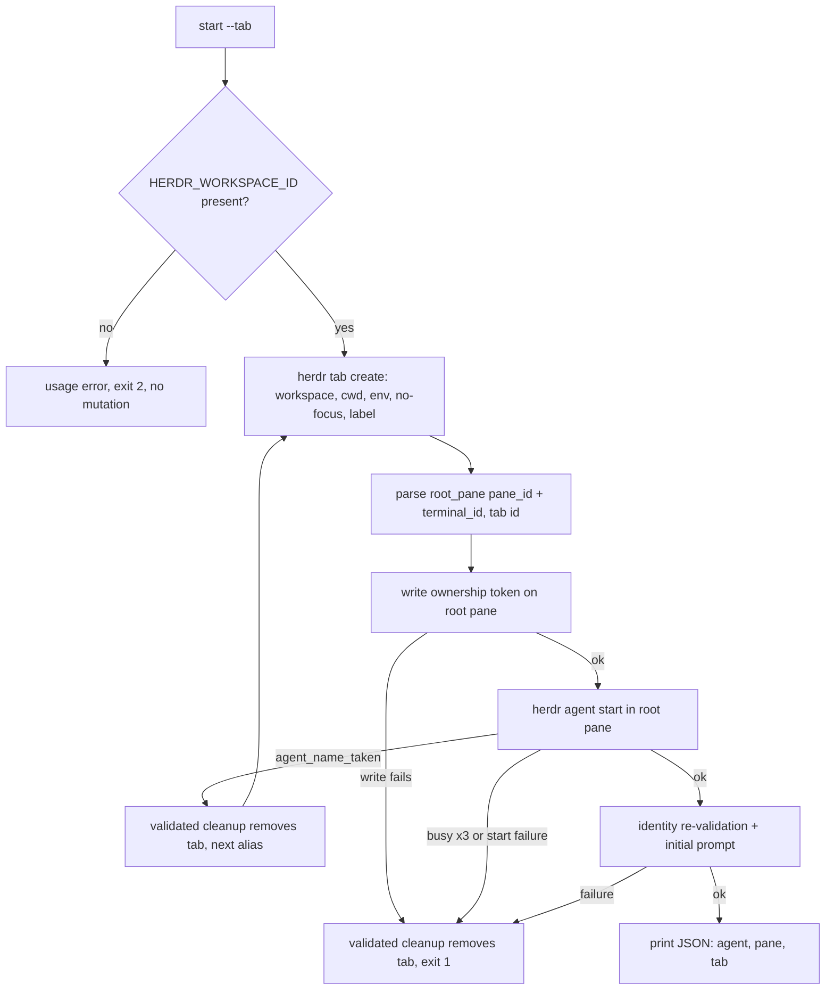
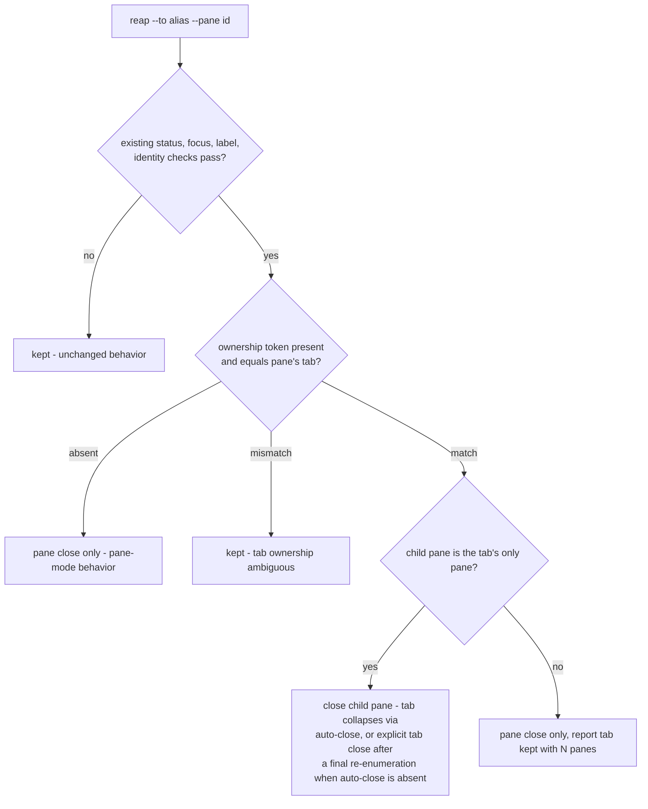

# herdr-child Tab Mode - Plan

## Goal Capsule

- **Objective:** A parent agent that needs a child in its own herdr tab gets the full sanctioned lifecycle — launch, identity verification, and reap — from `herdr-child`, so hand-assembled `herdr tab create` + `herdr agent start` launches (which lose the reap discipline and leak tabs) are no longer necessary.
- **Means:** Add a `--tab` launch mode to `herdr-child start` that creates the tab and starts the child in its root pane, with tab ownership recorded for reap (KTD1, KTD2).
- **Authority:** This plan; `home/private_dot_claude/shared/child-agent-contract.md` for the parent/child protocol; the installed `herdr` CLI for command behavior (measure, never assume).
- **Stop conditions:** Stop and surface if U1 measurement shows any of: `herdr tab create --env` does not deliver environment to the root pane's process; pane metadata tokens cannot be read back; `.result.root_pane` carries no non-empty `terminal_id` (the seed for every downstream identity check); the ownership token cannot be stored durably for a child's whole working life; or the token does not survive the child's own ask/reply metadata writes. Each invalidates KTD1 or KTD2.
- **Tail ownership:** The executor lands code and docs; `make test-ubuntu` and the live smoke run prove deployment.

---

## Product Contract

### Summary

`herdr-child start` gains a `--tab` mode (with optional `--label`) that creates a new tab in the caller's workspace and starts the child agent in that tab's root pane, instead of splitting the caller's pane. Every cleanup path — collision retry, start failure, signal, and `reap` — removes the tab it created, under the same fail-closed identity validation the pane path uses today. Reap's CLI signature does not change; it discovers tab ownership from evidence the start command records on the pane.

### Problem Frame

`herdr-child start` can only split the caller's pane (`--direction right|down`). When the user wants a child in a separate tab, the parent must hand-assemble `herdr tab create` + `herdr agent start` — which reproduces the launch but silently drops the wrapper's identity checks and reap discipline. In a recorded session this produced three settled child tabs left open as garbage. The root cause is a capability gap in the wrapper, not parent negligence.

### Key Decisions

- KD1. **Extend `herdr-child` with a `--tab` launch mode** rather than only documenting the manual tab assembly. (session-settled: user-approved — chosen over documenting manual `tab create` + `agent start` assembly: manual assembly reproduces the launch but loses the wrapper's reap discipline, which is the class of leak being fixed.) Governs R1, R6, R7.

### Requirements

**Launch**

- R1. `herdr-child start --kind <kind> --tab [--label TEXT]` creates a new tab in the caller's workspace (`HERDR_WORKSPACE_ID`) and starts the child agent in that tab's root pane.
- R2. `--label` sets the initial tab label, is valid only together with `--tab`, and is presentation metadata only — it never participates in alias, pane, or terminal identity. The label is best-effort: the deployed pane-label reconciliation sweep (`home/dot_local/bin/executable_herdr-pane-labels`) renames tabs hosting registered agents to computed labels, so a caller-supplied label may be replaced within one sweep interval.
- R3. `--tab` combined with an explicitly passed `--direction` is a usage error (exit 2) before any herdr mutation. `--tab` with no `--direction` is valid; the unused default direction is ignored.
- R4. Tab mode preserves the pane-mode launch contract unchanged: allocator-owned alias selection, `HERDR_CHILD_NAME` / `HERDR_CHILD_PARENT_PANE` env injection, posture env (`OPENCODE_PERMISSION`), post-registration identity validation, initial-prompt delivery, and `--wait` semantics.
- R5. In tab mode, start's JSON output carries the created tab id as a `"tab"` key on both print sites — the success print and the `--wait`-timeout (exit 124) print. Pane-mode output is byte-identical to today.

**Cleanup**

- R6. Every failure path that closes the child pane in pane mode removes the created tab in tab mode: alias-collision retry, pane-readiness exhaustion, agent start failure, post-registration identity re-validation failure, initial-prompt failure, and INT/TERM signal cleanup. Each removal runs only after the same identity validation its pane-mode counterpart performs, and removes the tab only under KTD3's only-pane condition — with sibling panes present it closes the child pane and reports the tab kept.
- R7. `herdr-child reap --to <alias> --pane <pane-id>` (signature unchanged) closes the created tab when the child pane is the tab's only pane. When the tab holds additional panes, reap closes only the child pane and reports the tab kept with the pane count.
- R8. Reap closes a tab only on positive ownership evidence recorded at start (per KTD2). Missing or unreadable evidence degrades reap to today's pane-only behavior — it never guesses tab ownership.
- R9. A tab or pane found missing at close time is reported as already cleaned only when ownership was positively established first (the token matched per R8, or the target was this run's own validated creation). A missing alias-pane record without that evidence stays `kept`, exactly as today.

**Documentation**

- R10. `home/private_dot_claude/skills/herdr/SKILL.md` documents `--tab`/`--label` and reap's tab behavior; `home/private_dot_claude/shared/child-agent-contract.md` gains a dated measured-behavior entry for the tab-mode CLI facts (per U1) following the file's evidence-log convention; `CONCEPTS.md` updates the child-agent contract entry's "sibling panes" wording. No behavior claim lands in any of the three docs without a measurement behind it.

### Scope Boundaries

**Deferred to Follow-Up Work**

- An `ask-in-herdr` flag that opens the consult in a tab. `ask.sh` keeps its sibling-pane launch.
- Targeting an existing tab (`--tab <tab-id>`). This plan creates new tabs only.
- A teardown policy for multi-pane tabs at reap time beyond "keep the tab and report" (R7).
- Migrating `herdr-peer-launch.md` from manual pane assembly to `herdr-child`.

**Outside this product's identity**

- Changes to the `herdr` binary itself. The wrapper composes existing CLI commands.

### Open Questions

- Deferred: should the pane-label reconciliation sweep (`executable_herdr-pane-labels`) respect an explicitly caller-supplied tab label instead of renaming it? R2 documents the label as best-effort under today's sweep; teaching the sweep to honor explicit labels is a change to that component, out of this plan's scope.

---

## Planning Contract

### Key Technical Decisions

- KTD1. **Create the tab with `herdr tab create --workspace "$HERDR_WORKSPACE_ID" --cwd ... --no-focus --env ... [--label ...]`** and read the child's `pane_id`/`terminal_id` from `.result.root_pane` plus the tab id from `.result.tab`. Every downstream identity check keeps operating on the same pane/terminal pair it uses today; only the creation call changes. Tab mode requires `HERDR_WORKSPACE_ID` (usage error when absent) so the tab lands in the caller's workspace, never the UI-focused one. The installed CLI confirms all five flags exist on `tab create`.
- KTD2. **Record tab ownership as a source-scoped pane token** (`herdr pane report-metadata --token <name>=<tab-id>` on the root pane, written after tab creation and before `agent start`); reap reads it back via `herdr pane get`. Chosen over adding a tab argument to `reap` or making start's JSON the only channel: the reap signature, the `[child-settled v1 ...]` reminder, and every existing caller stay unchanged, and the pane self-describes its ownership. Matches the source-scoped-token pattern the detached-supervision plan already adopts for `supervision-mode`. Prefer a dedicated source id (e.g. `child-agent-tab`) over the shared `child-agent` source, so the child's own ask/reply state-label writes and clears — same pane, higher `--seq`, 1-hour `--ttl-ms` — cannot expire or clobber the token if herdr scopes TTL or seq to the source bundle; U1 measures both the interleaving and the source isolation before this choice is final. A failed token write at start is fatal: clean up the tab and exit 1, so a tab-mode child never exists without reap evidence. Token durability is decided by U1 measurement — a token that cannot outlive a child's whole working life fires the Goal Capsule stop condition instead of shipping a leak-prone TTL.
- KTD3. **Fail-closed tab removal, preferring pane-close collapse.** A tab is removed only when the token names it, the named tab equals the pane's own `tab_id`, and the child pane is the tab's only pane; any other state keeps the tab and says why. The condition guards every tab-removal site — reap and the R6 failure paths alike. Mechanism: when U1 confirms that closing a tab's last pane auto-closes the tab, removal is simply `pane close` of the validated child pane — herdr owns the pane-vs-tab atomicity and the enumerate-then-close race disappears. Only when auto-close is absent does the script issue an explicit `herdr tab close`, after re-enumerating the tab's panes immediately before the call; the remaining enumerate-to-close window is then documented as a known residual race, and a pane that appears inside it is the reason the re-check exists. This extends the script's existing preserve-on-ambiguity posture (every `kept;` branch in `reap_children`) to the tab axis; tab mode must not make cleanup more destructive than pane mode.
- KTD4. **Thread one close target through the existing cleanup helpers.** Capture the mode once in `start_child` (close target = created tab vs pane) and route `close_unregistered_pane`, `close_collision_pane`, `close_registered_pane`, and the INT/TERM trap through it, preserving each helper's pre-close identity validation. Chosen over per-site handling: there are four call sites plus the collision retry loop, and partial coverage leaks a tab on exactly the paths nobody watches.
- KTD5. **Measure before relying.** `tab create --env` propagation to the root pane's process, the `tab create` JSON shape, token readback through `pane get`, token durability/TTL options, and last-pane-close behavior are all measured against the installed CLI and recorded in `child-agent-contract.md` (U1) before code depends on them. The contract file's authority is measured evidence; `--env` propagation in particular was only ever measured for `pane split`.

### High-Level Technical Design

Tab-mode start, including the collision retry and failure cleanup that must not leak tabs:

Reap's decision when the pane passes today's validations:

Flag composition after both pending plans land: `--tab` is orthogonal to `--wait`/`--detach` (mode of waiting) and to `--posture` (tool posture); it is mutually exclusive only with `--direction` (placement).

### Assumptions

- The detached-supervision plan (`docs/plans/2026-08-26-001-feat-herdr-detached-child-supervision-plan.md`) is unimplemented and edits the same argument-parsing block, cleanup helpers, and test file. This plan is written against current `main`; whichever plan lands second rebases. If the detached plan lands first, U2 adds `--tab` alongside its `--wait`/`--detach` parsing and U5 threads `--tab` guidance through its rewritten doc sections instead of the current ones.
- `ask-in-herdr` never passes `--direction` today and stays pane-split; it is unaffected.
- Without `--label`, the tab keeps herdr's default cwd-/number-based name; callers who follow the tab-naming convention pass `--label` themselves.
- `herdr tab create` returns `.result.tab` and `.result.root_pane` (documented in the herdr skill; exact JSON shape confirmed by U1 measurement before U3 consumes it).

### Sources

- `home/dot_local/bin/executable_herdr-child` — split call and retry loop (`start_child`, lines ~356-437), cleanup helpers (~284-336), signal trap (~338-348), JSON prints (~479, ~494), `reap_children` (~597-682).
- `tests/scripts.bats` — `child_stub_herdr()` stub harness (~568-689), call-order assertions (~869-879), herdr-command allowlist test (~1305).
- `home/private_dot_claude/shared/child-agent-contract.md` — evidence-log convention; `--env` propagation measured for `pane split` only.
- Institutional learnings: `docs/solutions/architecture-patterns/child-initiated-callback-over-in-turn-supervision.md` (fail-closed reap posture), `docs/solutions/design-patterns/idle-machine-wall-clock-bounds-are-latent-flakes.md` (assert causal signals, not elapsed time, in this bats suite).

---

## Implementation Units

### U1. Measure tab-mode CLI behavior and record it in the contract

- **Goal:** Replace the design's unmeasured CLI assumptions with dated evidence before any code depends on them.
- **Requirements:** R10; gates KTD1, KTD2, KTD5.
- **Dependencies:** none — runs first.
- **Files:** `home/private_dot_claude/shared/child-agent-contract.md`.
- **Approach:**
  1. In an isolated named session (`herdr --session childspike`, per the contract file's existing measurements), measure:
     - `tab create --env` delivery to the root pane's process;
     - the exact `tab create` JSON shape, including whether `.result.root_pane` carries a non-empty `terminal_id`;
     - `pane report-metadata --token` write and readback via `pane get`, with and without `--ttl-ms`, on both a dedicated source id and the shared `child-agent` source;
     - token survival across interleaved same-pane metadata traffic: after writing the token, run a `--state-label ... --ttl-ms ...` write and a `--clear-state-labels` clear with higher `--seq` values, read the pane back, and record whether TTL and seq scope to the individual field or the source bundle;
     - whether closing a tab's last pane auto-closes the tab;
     - the error shape of `tab close` on an already-closed tab, and of `pane close` on an already-closed pane (the R9 evidence for both target kinds).
  2. Append one dated measured-behavior entry in the file's existing command-plus-observed-output style.
  3. Record the chosen token source id and durability posture from what the CLI supports.
- **Execution note:** If any Goal Capsule stop condition fires (`--env` delivery, token readback, `terminal_id`, durability, or label-churn survival), stop and surface. Separately: if last-pane auto-close is confirmed, pause before U3 and surface the available simplification — tab removal reduces to `pane close` of the validated only pane (KTD3's preferred mechanism), and the explicit `tab close` branch plus its re-enumeration is dropped rather than built.
- **Test scenarios:** Test expectation: none — evidence document. Verification is the recorded entry itself plus reproducibility of its commands.
- **Verification:** The contract file carries the new dated entry; every KTD1/KTD2 CLI fact used by U3/U4 cites a measurement in it.

### U2. Parse and validate `--tab` and `--label`

- **Goal:** `start_child` accepts the new flags and rejects invalid combinations before any herdr mutation (R1, R2, R3).
- **Requirements:** R1, R2, R3.
- **Dependencies:** none (mergeable independently of U1).
- **Files:** `home/dot_local/bin/executable_herdr-child`, `tests/scripts.bats`.
- **Approach:**
  1. Add `--tab` (boolean) and `--label <text>` to the option loop and usage text.
  2. Track explicit `--direction` with a set-flag, mirroring the existing `--prompt`/`--prompt-file` exclusivity pattern, so plain `--tab` is not rejected by the direction default.
  3. Validation order: unknown-flag rejection unchanged; `--tab` + explicit `--direction` → usage error; `--label` without `--tab` → usage error; `--tab` without `HERDR_WORKSPACE_ID` → error before mutation.
- **Patterns to follow:** `fail_usage` exit-2 convention; the mutual-exclusion check at the `--prompt`/`--prompt-file` site.
- **Test scenarios:**
  - `start --tab` with valid environment proceeds past argument validation — no usage error — in a run that stops before any mutating stub call (parse-level control for the rejections below; the tab-mode happy path itself is U3's call-order scenario).
  - `start --tab --direction right` exits 2 with a mutual-exclusion message and the stub log shows zero herdr calls.
  - `start --label x` without `--tab` exits 2.
  - `start` without `--tab` behaves byte-identically to today's pane mode (existing tests stay green).
  - `start --tab` with `HERDR_WORKSPACE_ID` unset exits non-zero before any mutating stub call.
- **Verification:** New rejection tests red-before/green-after; the whole existing `herdr-child launch and return contract` section stays green.

### U3. Tab-mode launch path

- **Goal:** Tab mode creates the tab, starts the child in its root pane, records ownership, and reports the tab id (R1, R4, R5; KTD1, KTD2).
- **Requirements:** R1, R4, R5.
- **Dependencies:** U1 (measured JSON shape and token behavior), U2.
- **Files:** `home/dot_local/bin/executable_herdr-child`, `tests/scripts.bats`.
- **Approach:**
  1. In the launch loop, branch the creation call: tab mode runs `tab create` per KTD1 and parses `.result.tab` + `.result.root_pane`; pane mode keeps the current `pane split` block untouched.
  2. When `tab create` succeeds but the identity parse fails, preserve the tab and report it by id (the pane-mode precedent: the split-parse failure site preserves the new pane), then exit 1.
  3. Write the ownership token per KTD2 immediately after parse; on write failure run validated cleanup and exit 1.
  4. In tab mode only, add the `"tab"` key to both JSON print sites (success, and the `--wait`-timeout exit-124 branch); pane-mode output stays byte-identical per R1-R5.
  5. Extend `child_stub_herdr()` with a `"tab create"` case returning the U1-measured JSON shape, and a token-aware `pane get`/`report-metadata` stub.
- **Patterns to follow:** The existing `split_record` parse-and-`IFS read` idiom; stub fixture shape used by `tests/palette.bats` for `tab create`.
- **Test scenarios:**
  - Happy tab-mode call order: `agent list → tab create → pane report-metadata → agent start → agent list → agent prompt` (positional assertion on `calls.log`, mirroring the pane-mode order test).
  - Success JSON contains `agent`, `pane`, and `tab`; pane-mode JSON contains no `tab` key (control).
  - `tab create` returns JSON without a parseable root-pane identity → tab preserved and reported by id, exit 1, no token write, no `agent start`.
  - Token write failure → tab cleanup call recorded, exit 1, no `agent start`.
  - `--tab --wait` with stubbed prompt timeout → exit 124 and the printed JSON includes `tab`.
  - Env args on the `tab create` stub call include `HERDR_CHILD_NAME`, `HERDR_CHILD_PARENT_PANE`, and the posture env for `opencode`.
- **Verification:** All new scenarios green; pane-mode call-order tests unchanged and green.

### U4. Tab-aware cleanup and reap

- **Goal:** No path leaks a created tab, and reap honors R7-R9 without a signature change (KTD3, KTD4).
- **Requirements:** R6, R7, R8, R9.
- **Dependencies:** U3.
- **Files:** `home/dot_local/bin/executable_herdr-child`, `tests/scripts.bats`.
- **Approach:**
  1. Thread the close target per KTD4 through `close_unregistered_pane`, `close_collision_pane`, `close_registered_pane`, and `signal_cleanup`; each keeps its current pre-close validation and, in tab mode, removes the created tab.
  2. The collision retry loop removes the previous tab before creating the next one.
  3. In `reap_children`, after the existing validations pass: read the ownership token from `pane get`; apply the KTD3 decision tree (absent → pane close; mismatch → kept; match + only pane → remove per KTD3's mechanism; match + siblings → pane close and report the tab kept with its pane count).
  4. Tolerate already-gone targets per R9: a missing tab or pane at close time reports cleaned only after ownership was positively established; otherwise the existing `kept` behavior stands.
- **Patterns to follow:** The `kept; <reason>` reporting convention in `reap_children`; sibling-pane enumeration via `pane list` filtered by the pane's `tab_id`.
- **Test scenarios:**
  - Collision retry in tab mode: stub `agent_name_taken` once → log shows the first tab removed before the second `tab create`; no orphan.
  - `agent_pane_busy` exhaustion, post-registration identity re-validation failure, and prompt failure each remove the tab.
  - A failure path whose tab holds a stubbed sibling pane closes only the child pane and reports the tab kept (R6's only-pane guard).
  - INT/TERM during start removes the tab: real-signal test mirroring the existing `STUB_START_BLOCK`/`STUB_PROMPT_BLOCK` TERM cases in `tests/scripts.bats`, asserting the tab-removal call in `calls.log`.
  - Reap, token matches, tab has only the child pane → the KTD3 removal call in the log, success message names the tab.
  - Reap, token matches, tab has a sibling pane → only `pane close` in the log, output reports the tab kept with the pane count.
  - Reap, no token → behaves byte-identically to today's pane-mode reap (control).
  - Reap, token names a different tab than the pane's own → `kept`, nothing closed.
  - Reap, tab already closed → reports already cleaned, exit 0.
- **Verification:** Each scenario red-before/green-after where it guards new behavior; existing reap tests green.

### U5. Documentation alignment

- **Goal:** The docs describe tab mode accurately and only with measured claims (R10).
- **Requirements:** R10.
- **Dependencies:** U1, U3, U4 (documents shipped behavior).
- **Files:** `home/private_dot_claude/skills/herdr/SKILL.md`, `home/private_dot_claude/shared/child-agent-contract.md`, `CONCEPTS.md`.
- **Approach:**
  1. SKILL.md: add `--tab`/`--label` to the `herdr-child` guidance; state that reap closes a `--tab` child's tab only when the child pane is its only pane, and otherwise closes the child pane and reports the tab kept; update the lifecycle line that currently routes manually assembled tabs to manual closing.
  2. child-agent-contract.md: extend parent duty 7 (reap) with the tab behavior; the measured entry itself landed in U1.
  3. CONCEPTS.md: update the child-agent contract entry's "sibling panes" wording — coordinate with the detached-supervision plan's U5, which edits the same sentence; whichever lands second merges both changes.
- **Test scenarios:** Test expectation: none — documentation. The smoke suite's existing skill checks must stay green.
- **Verification:** `make test-templates` and the docs match the shipped flag set (`herdr-child start --help` output agrees with SKILL.md).

---

## Verification Contract

| Command | Covers | Done signal |
|---|---|---|
| `bash -n home/dot_local/bin/executable_herdr-child` | U2-U4 | Script parses under bash 3.2 syntax rules |
| `bats tests/scripts.bats` | U2-U4 | Entire `herdr-child` section green, including new tab-mode scenarios |
| `make lint` | U2-U4 | shellcheck clean |
| `make test-local` | U2-U5 | `chezmoi diff` shows only the intended managed-file changes |
| `make test-ubuntu` (manual/CI) | all | Full apply-and-test in Docker proves the checkout, not the stale deployed copy |
| Live smoke (manual, after user applies) | U3, U4 | One `--tab` child in a real herdr session: starts in a new tab, settles, `reap` removes the tab |

Bats scenarios assert on causal signals (stub call logs, exit codes, JSON keys), never on elapsed wall-clock time, per the recorded suite learning.

---

## Definition of Done

- All U1-U5 verifications pass; `validate_commands` green on a bare checkout.
- No unmeasured CLI claim remains in the R10 docs (every tab-mode behavior statement traces to the U1 entry).
- Pane-mode behavior is provably unchanged: pre-existing `herdr-child` tests pass unmodified.
- No orphan tab on any validated-identity path: every cleanup and reap scenario in U3/U4 is covered red-before/green-after. Ambiguous-identity tabs are preserved and reported, matching pane mode — preservation there is the specified behavior, not a leak.
- Abandoned experiments and scratch measurement scripts are removed from the diff; the `childspike` test session is stopped.
- The live smoke run (deployed via the user's `chezmoi apply`) is confirmed or explicitly handed to the user as the remaining step.
