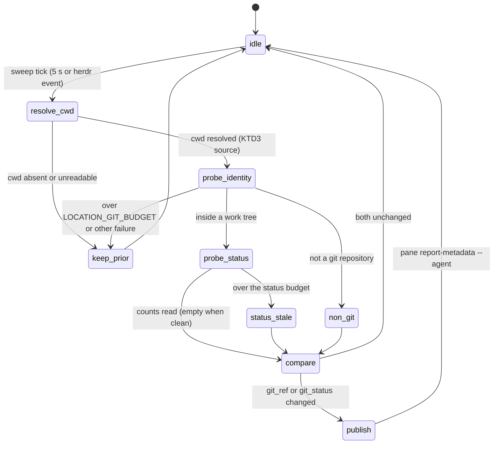

# Herdr Agent Git Status - Plan

## Goal Capsule

- **Objective:** Looking at the herdr agents sidebar, the user sees for every live agent the git state of the checkout the agent is actually working in right now — branch or worktree identity plus dirty / ahead / behind counts — including after the agent moved into a worktree mid-session.
- **Means:** Extend the existing `herdr-task-sync` location pass with a `$git_status` counts token, and feed that pass the directory the agent reports about itself instead of the pane's launch directory (KTD1, KTD3, KTD6).
- **Authority:** This plan; the acceptance matrix (AE1) is the completion authority and the KTD5 statechart is the design authority — a sweep behavior that is not a transition on it is out of scope. The user demonstrated format preference governs rendering (R2).
- **Stop conditions:** A matrix cell stays wrong after U3's fix and no cheap correction exists — stop and report the cell, do not build extra infrastructure. Never create a second sidebar label writer. Never run `chezmoi apply` on the host; the user applies.
- **Execution profile:** Smallest possible loop — every unit ends with something visible in the live sidebar or a filled matrix row. No provisioning apparatus, no isolated environments beyond throwaway panes and scratch repos that are closed and deleted the same session.

---

## Product Contract

### Summary

Add live git status to the agents-sidebar rows that herdr-task-sync already labels. Today the second sidebar row renders `$git_ref` (branch/worktree identity, no counts) derived from the pane's foreground cwd; it goes stale when an agent works in a worktree its process never `cd`s into, and it carries no dirty/ahead/behind information. This work adds a compact `$git_status` counts token and fixes the cwd source, verified cell-by-cell against a 3×3 agent/context matrix.

### Problem Frame

The user runs multiple agents (Claude Code, OpenCode, pi) and reads the agents sidebar to know where each one stands. The sidebar currently shows identity that can lag reality (e.g., still showing `main` while the agent works in a worktree) and never shows whether the checkout is dirty or ahead/behind — so the user must interrupt or inspect panes to learn basic state.

### Key Decisions

- KD1. **Matrix-first acceptance.** The verification matrix (AE1) is defined before any code and is the acceptance authority. (session-settled: user-directed — chosen over implement-then-demo: the user requires knowing exactly what is checked per agent/context before the plugin is written.) Governs R5.
- KD2. **Minimal scope, fast feedback loop.** Each unit lands something observable within hours, not days; no test playgrounds, isolated fixture environments, or credential apparatus. (session-settled: user-directed — chosen over heavyweight verification tooling: the user explicitly rejected that style of build.) Governs R1–R5.

### Requirements

- R1. Each live agent's sidebar row shows the branch or worktree identity **and** git status counts (dirty, ahead, behind) of the checkout that agent is actually working in.
- R2. Rendering is compact, in the spirit of the user's example `cc:agent main (dirty, 2pull, 1push)`: identity token plus counts token on the existing rows; exact glyphs follow the existing `$git_ref` icon conventions.
- R3. When an agent's effective working directory changes mid-session (it created or entered a worktree), the row reflects the new location within one sweep cycle (≤ ~10 s).
- R4. A directory that is not a git checkout shows identity only (existing folder rendering); no counts, no error noise.
- R5. Every cell of the acceptance matrix (AE1) is verified by direct observation of the live sidebar — once as a baseline before changes (U1) and once after (U3).
- R6. `herdr-task-sync` remains the only pane/tab label and location-token writer; no new writer process is introduced.

### Acceptance Examples

- AE1. **The verification matrix.** Rows = agent kinds; columns = git contexts of the agent's effective cwd. Each cell passes when the agent's sidebar row shows the stated content within one sweep of the state coming true.

| Agent | Folder without git | Branch + status | Worktree + status |
|---|---|---|---|
| claude code (`cc:`) | identity = folder name, no counts | branch name + dirty/ahead/behind counts | worktree identity + counts for the worktree checkout |
| opencode | same | same | same |
| pi | same | same | same |

  - **Given** for "branch + status": a checkout on a named branch with ≥1 modified file, ≥1 commit ahead and ≥1 behind its upstream. **Then** the row shows that branch with matching counts.
  - **Given** for "worktree + status": the agent started in the main checkout, then moved its work into a linked worktree (the herdr-native case: `EnterWorktree` / `cd` inside the agent). **Then** the row shows the worktree identity and the worktree's counts — not the launch directory's.
  - The baseline U1 pass fills the same matrix with *observed current behavior* (expected: identity works for static cases, worktree column stale, counts absent everywhere).
  - Evidence lives in this file: U1 appends a "Baseline observed" table and U3 an "After observed" table, both mirroring AE1's 3×3 layout, so the Definition of Done's "verified" claim points at recorded observations.

- AE1-baseline. **Baseline observed (U1, 2026-08-27, herdr 0.8.2).** Measured on throwaway panes over a scratch checkout carrying 1 modified file, 1 untracked file, 1 commit ahead and 1 behind a local bare remote. The agents sidebar is configured `rows = [["state_icon", "workspace", "pane"], ["$git_ref"]]`, so "what the row shows" is read as the pane's published `git_ref` token.

| Agent | Folder without git | Branch + status | Worktree + status |
|---|---|---|---|
| claude code (`cc:`) | **no location tokens at all** — `git_ref`, `repo`, `branch` and `worktree` are cleared, so the second row renders empty | `<branch-glyph> main <worktree-glyph> scratch-repo` — branch and repo correct, **no counts** | **stale after a mid-session move** — `EnterWorktree` put the session in `…/scratch-repo/.claude/worktrees/u1-probe` on branch `worktree-u1-probe`, and the row still read `<branch-glyph> main <worktree-glyph> scratch-repo` |
| opencode | same — no location tokens | same — branch and repo correct, no counts | correct **when the worktree is the launch directory** (`<branch-glyph> worktree-u1-probe <worktree-glyph> u1-probe`); no mid-session move exists to break it |
| pi | same — no location tokens | same — branch and repo correct, no counts | correct when the worktree is the launch directory; pi has no worktree concept at all |

  - **The stale worktree cell is persistent, not a sweep lag.** The moved Claude pane sat in `done` for several minutes, far past the 5 s sweep, and its token never changed.
  - **Divergence from AE1's own expectation, carried into U2.** AE1 predicts "identity = folder name" for a directory that is not a git checkout. Observed: the engine's `non_git` outcome **clears every location token** (`home/dot_local/bin/executable_herdr-task-sync:1294`), leaving the second sidebar row blank rather than showing a folder name. R4's "identity only (existing folder rendering)" describes a rendering that does not exist today. U2 either adds it or R4 is restated; no other part of the plan depends on which.
  - **`foreground_cwd` is not a usable signal on an agent pane**, and not for the reason the plan assumed. It does not merely equal the launch directory — it wanders into unrelated trees: a freshly started pi pane reported `/opt/homebrew/Library/Taps/schpet/homebrew-tap` and later `/opt/homebrew`, and the user's live opencode pane reported a private `/T` temp directory, all while their sessions were elsewhere. On the moved Claude pane it did happen to name the worktree. It tracks whichever child process currently holds the terminal, so it is right only by coincidence.

### Scope Boundaries

- **Deferred to Follow-Up Work:** stash/conflict indicators; per-workspace (spaces-section) status rows; any reuse of the retired playground CLI. The playground PR #84 stays closed; nothing here depends on it.
- **Out of scope:** new standalone plugin directory; changes to other herdr plugins; opencode/pi-side integrations beyond what observation in U1 proves necessary.

---

## Planning Contract

- KTD1. **Extend `herdr-task-sync`, not a new plugin.** The user asked to "write a plugin"; research shows the deployed `herdr-pane-labels` plugin manifest declares `~/.local/bin/herdr-task-sync` the only pane/tab label writer, and its location pass already derives repo/worktree/branch per pane and reports `git_ref` via `pane report-metadata --token`. A second writer would fight its stale-token cleanup and sequence numbers. Adding one token to the existing pass is the smallest change that meets the outcome. This is the plan's one challenge to the directive; the outcome the user asked for is unchanged.
- KTD2. **`$git_status` is a separate token, `$git_ref` is untouched.** Counts are volatile; identity is stable. Keeping them separate preserves `$git_ref` semantics (and its tests) and lets the config row render `["$git_ref", "$git_status"]`. Config change: second row of `[ui.sidebar.agents].rows` in `home/private_dot_config/herdr/config.toml`. Because the reconcile pass republishes tokens only when its change-detection comparison flips, the counts string must join that comparison — a counts-only change (same branch, file becomes dirty) must trigger a republish, or the token freezes after its first write.
- KTD3. **The effective cwd comes from the agent, not from the OS — the candidate order is inverted by evidence.** Settled for all three agent kinds: none of them moves its own process cwd when its work moves into a worktree. Claude Code was verified on a live pane (`docs/issues/2026-08-22-001-agent-pane-labels-miss-a-claude-code-worktree.md`: the `claude` pid stayed in the base checkout while its session worked in `.claude/worktrees/…`, and Claude's own statusline showed the worktree). opencode threads the directory as data — `PluginInput.directory` / `worktree` and `Session.Info.location.directory` — with no `process.chdir()`. pi takes `ctx.cwd` from `SessionManager.getCwd()`, fixed at session start, and spawns each bash call with an explicit cwd. Physical trace vs. logical location: an OS-level probe measures where some *process* stands, while R1's target is the checkout the agent **logically** works in — and since no agent chdirs, that trace cannot follow a mid-session move **by design**, not by accident. The earlier candidate order (`foreground_cwd` → deepest live descendant → agent report) is therefore the wrong way round. New order: **the agent-reported directory first, the pane cwd as the fallback.** The pane cwd path stays as it is for panes with no agent (`foreground_cwd`) and as the degradation path for an agent pane with no report yet — note that `resolve_pane_location` already selects `.cwd`, not `foreground_cwd`, once a pane has an agent (`home/dot_local/bin/executable_herdr-task-sync:675-680`), so today an agent row is labelled from the pane's launch directory. The deepest-live-descendant candidate is dropped: a live `herdr pane process-info` on a Claude pane returns long-lived children pinned at the launch directory (MCP servers, `caffeinate`) alongside the short-lived git calls, so the deepest descendant is both noisy and gone the moment the agent stops running commands. Override rule unchanged: when the agent report and the pane cwd are both present and disagree, the report wins — "fallback" never means "only when the pane cwd is absent", or a stale launch directory stays authoritative forever. Confirmed per agent kind by U1; if a kind has no usable report, that kind degrades to today's pane-cwd behavior instead of growing a second mechanism. Chosen source (confirmed by U1, 2026-08-27): **claude — the `statusLine` payload; opencode — nothing needed; pi — nothing needed.** Claude is the only kind that can move mid-session, and the only one whose row goes stale for it: with the session inside `…/scratch-repo/.claude/worktrees/u1-probe`, herdr's pane `.cwd` still read the launch checkout while the statusline payload read the worktree. opencode 1.18.20 ships `Worktree.create` / `worktree.ready` in its bundle but exposes no worktree command in its TUI palette, so a running session cannot be moved from the terminal; pi 0.84.3 contains no occurrence of the string `worktree` anywhere in its binary. Both therefore stay on the pane-cwd path, which the same pass observed to be correct whenever the worktree is the launch directory. Limit of this evidence: opencode was checked through its TUI command palette and its bundled symbol set, not through its plugin or server APIs — an opencode plugin that calls `Worktree.create` itself would reopen the question.
- KTD4. **Reuse the hardened conventions of the location pass.** Git probes run under the existing budgeted-command mechanism (kill-on-timeout with distinct outcome, stale marker instead of wrong data); new glyphs are generated via octal `printf` per `docs/solutions/design-patterns/generate-pua-glyphs-from-octal-printf.md`; wall-clock budgets follow the liveness/behavior split in `docs/solutions/design-patterns/idle-machine-wall-clock-bounds-are-latent-flakes.md`. The status probe gets its **own budget constant**, not `LOCATION_GIT_BUDGET`: that 75 ms bound is calibrated for scan-free `rev-parse`, while a status probe scans the working tree (tens of ms warm on a small repo, far more cold or large). Size the new budget from measurement at execution time; a status-probe timeout degrades only `$git_status` to absent/stale and never touches `$git_ref`.

- KTD5. **The statechart is the design authority, and its outcome names live in the code.** The transition table below — not surrounding prose — decides what one sweep does with one pane; a behavior that is not a transition on it is out of scope for U2 and U3. So that the code stays checkable against the chart, the status probe resolves to exactly one named outcome (`fresh`, `stale`, `absent`) returned from a single resolver, mirroring the outcome convention `resolve_pane_location` already uses (`transient` / `non_git`), and exactly one call site maps that outcome onto a `git_status` token write or clear. No state-machine framework, no dispatch table, no new module (KD2): three literal outcome strings and one mapping point are the whole of "the code follows the chart".

- KTD6. **One transport per agent kind: the agent records its directory, the sweep publishes it.** R3's freshness is a property of the sweep, not of the agent — the pass already runs every 5 s and can read a recorded value at any moment. The agent side only has to record the directory **when it changes**, and a directory never changes while an agent is idle: a move is always something the agent did. So the real requirement on a channel is that it can fire *within* a turn. A channel that fires only at prompt boundaries fails it — an agent that enters a worktree mid-turn and then waits for the user would keep a stale record until the next prompt. That is what rules out the existing `herdr-task-sync-hook.sh` events (prompt / session / compact) as the Claude transport, not freshness in general. Channels, from each agent's own documentation and source:
  - **claude — the `statusLine` command.** Claude Code feeds it JSON on stdin carrying `cwd` / `workspace.current_dir` (live), `workspace.project_dir` (the launch directory, documented as one that "may differ from `cwd` if the working directory changes during a session"), and `workspace.git_worktree` (the linked-worktree name, absent in the main tree). It runs on session start, on every new assistant message, after `/compact`, and on permission-mode change, debounced at 300 ms, with `refreshInterval` (minimum 1 s) as the documented escape hatch for an idle session (https://code.claude.com/docs/en/statusline). This repo already runs one — `home/private_dot_claude/hooks/executable_statusline.sh` reads `.workspace.current_dir` and runs `git -C` against it, which is exactly why Claude's own statusline is right while the sidebar row is wrong. Publishing the payload to a file from a statusline script is an established community pattern. U1 captured the live payload and found it richer than the documentation describes: besides `workspace.current_dir` and `workspace.git_worktree` it carries a top-level `worktree` object with `path`, `branch`, `original_cwd` and `original_branch`, plus `workspace.repo` with the host, owner and repository name. A single field — `workspace.current_dir` — is all U3 needs, since the engine derives identity from the directory itself; the rest is recorded so a later change does not re-derive it. Cadence held under the idle case the requirement cares about: after the move the session sat idle for minutes and the newest record still named the worktree, so no `refreshInterval` is needed for U3.
  - **opencode — the plugin `event` hook.** `Session.Info` carries a live `location.directory`, delivered with `session.created` / `session.updated`; `worktree.ready` announces a move but carries only name and branch, so the directory is re-read from the session. opencode has no external-command statusline and no idle heartbeat; its events are transition-triggered.
  - **pi — the extension API.** Every handler receives `ctx.cwd`. Source reading found it fixed at session start with no mid-session rebinding of a session to another directory; if U1 confirms that, pi has no worktree case to fix and its column is already correct. pi likewise has no external-command statusline.

  Prior art checked, and what it does not solve: two MIT-licensed community herdr plugins label panes from git — `khatriafaz/herdr-plugin-agent-repo` (pane header from repo and branch) and `DIodide/herdr-telemetry` (workspace/agent telemetry over the socket API). Both prefer `foreground_cwd` over `cwd` and treat it as the live directory. For an agent pane that trust is misplaced, and U1's measurement shows it is worse than a stale value: `foreground_cwd` names whichever child process currently holds the terminal, so it drifts into unrelated trees (a starting pi pane reported a Homebrew tap directory) and lands on the right one only by coincidence. That is exactly why this plan reports from the agent instead. Two herdr facilities they surface are worth recording even though neither is the transport. herdr pushes `worktree.created` / `worktree.opened` to plugin event subscriptions (both confirmed as event types in the 0.8.2 API schema), and `seigi.pane-labels` now subscribes to both — `home/private_dot_config/herdr/plugins/herdr-pane-labels/herdr-plugin.toml`, guarded by the manifest invalidation test in `tests/scripts.bats`. A worktree opened **through herdr** now invalidates the pass immediately; an agent that creates its own worktree emits no herdr event and still waits for the sweep. An extra invalidation signal, not the transport, and no unit here depends on it. herdr also answers `worktree.list` with its own resolved mapping of a checkout to its linked worktrees (path, branch, `is_linked_worktree`), and it does enumerate agent-made `.claude/worktrees/*`; identity already works through the existing git probe (KTD2), so nothing here changes on that account. Neither repo carries anything usable for pi or opencode — both talk only to herdr, not to an agent's own extension API.

  R6 is preserved by construction: no reporter calls `herdr pane report-metadata`. Each writes the directory into the engine's own state area (a per-session record under `HERDR_TASK_SYNC_STATE_DIR`, or a new flag on the existing adapters — U3 picks the smaller delta), and `herdr-task-sync` stays the only process that publishes tokens. A reporter that fails or never runs degrades to the pane cwd, which is today's behavior.

### High-Level Technical Design

One sweep, one pane, as a state machine. `resolve_cwd`, `probe_identity`, `compare`, and `publish` already exist in `herdr-task-sync`. The work is the `probe_status` / `status_stale` pair (U2) and which source `resolve_cwd` reads (U3).

| # | Transition | Guard | Required outcome | Owner |
|---|---|---|---|---|
| T1 | `idle → resolve_cwd` | sweep tick, 5 s or a herdr event | the pass runs for every live pane | existing daemon, unchanged |
| T2 | `resolve_cwd → keep_prior` | cwd empty or unreadable | both tokens keep their prior values as stale; nothing republished | existing |
| T3 | `resolve_cwd → probe_identity` | effective cwd = the agent-reported directory when one is recorded, else the existing pane cwd path; when both are present and disagree, the report wins | both probes run against the checkout the agent actually works in | U3 |
| T4 | `probe_identity → non_git` | git reports "not a git repository" / "not inside a work tree" | folder identity only, no counts, no error output (R4) | existing; U2 extends the clear to `git_status` |
| T5 | `probe_identity → keep_prior` | over `LOCATION_GIT_BUDGET`, or any other probe failure | prior identity retained as stale, never a wrong ref | existing |
| T6 | `probe_identity → probe_status` | inside a work tree | counts probe starts under its **own** budget constant (KTD4) | U2 |
| T7 | `probe_status → compare`, dirty | counts read, at least one non-zero | outcome `fresh`; token renders dirty, then ahead, then behind, each only when non-zero | U2 |
| T8 | `probe_status → compare`, clean | counts read, all zero | outcome `fresh` with an empty token | U2 |
| T9 | `probe_status → status_stale` | over the status budget | outcome `stale`: `git_status` stale or absent, `git_ref` untouched, never a wrong count | U2 |
| T10 | `non_git → compare` | — | outcome `absent`: `git_status` cleared alongside the other location tokens | U2 |
| T11 | `compare → idle` | `git_ref` and `git_status` both equal the last published pair | no republish, no token churn | U2 |
| T12 | `compare → publish` | either token differs, **including a counts-only change on the same branch** | one `pane report-metadata --agent` call writes both tokens; still the only label writer (R6) | U2 (KTD2) |

`publish → idle` and `keep_prior → idle` close the cycle; the sidebar renders the resulting pair as `["$git_ref", "$git_status"]`, e.g. `cc:agent  main  ~2 ⇡1 ⇣2`.

### Assumptions

- The staleness the user observed is the worktree/effective-cwd case, not a daemon outage. Supported by `docs/issues/2026-08-22-001-agent-pane-labels-miss-a-claude-code-worktree.md`, which recorded the split on a live tab: the agent pane showed the base branch while a plain shell pane on the same worktree resolved correctly. U1's baseline confirms it still reproduces before code is written.
- `ahead`/`behind` require an upstream; without one the counts render as absent, matching `git rev-list --left-right` semantics (implementer confirms exact plumbing at execution time).

### Open Questions

- Resolved. One review leg argued the agent-side cwd transport should be designed up front, because no OS-level signal may track Claude's logical worktree directory. That turned out to be correct, and for all three agent kinds rather than Claude alone: the agent-side report is now the primary route (KTD3, KTD6), not a last resort. Per-agent-kind parity is consequently in scope for U1 observation and U3 implementation, at the size each kind's evidence justifies.
- Resolved by U1. Neither pi nor opencode can move a running session into another directory from the terminal, so neither has a worktree column to fix and neither needs a reporter. pi 0.84.3 has no worktree concept at all; opencode 1.18.20 has the operations but no TUI command that reaches them. Whether opencode's `session.updated` carries an updated `location.directory` is therefore moot for this plan and was not measured.
- Does the composed tab label re-derive from changed tokens? A live probe recorded in issue `2026-08-22-001` overrode `git_ref` without the tab label following inside the observation window, and `compose_tab_intents` builds tab labels separately (`home/dot_local/bin/executable_herdr-task-sync:1142`). R1 is about the sidebar row, so this blocks nothing here — but a token-only change should not be called complete without checking it.

---

## Implementation Units

### U1. Fill the baseline matrix and confirm the cwd transport per agent kind

- **Goal:** The AE1 matrix filled with observed current behavior for all 9 cells, plus a recorded confirmation, per agent kind, of the reporting channel that turns the worktree column green (KTD3, KTD6).
- **Requirements:** R5, KD1.
- **Dependencies:** none.
- **Files:** none in production; record observations by filling the AE1 baseline into this plan file and the KTD3 decision line.
- **Approach:**
  1. In the live herdr session, open throwaway panes: one per agent kind (claude code, opencode, pi), each pointed at a scratch repo prepared in the three context states (no-git dir, dirty branch with ahead/behind vs a local bare remote, linked worktree).
  2. Per cell, record two things side by side: what the sidebar row shows, and what the pane reports as `cwd` / `foreground_cwd`. The pane values are expected to stay at the launch directory (KTD3); recording them is what makes the override rule checkable later.
  3. Per agent kind, record what its own channel reports for the same moment (KTD6): for claude, the `workspace.current_dir` and `workspace.git_worktree` its statusline receives; for opencode, the session's `location.directory`; for pi, `ctx.cwd`.
  4. For the worktree column, have each agent actually move its work (EnterWorktree for claude; the equivalent for opencode/pi) and observe whether its channel reports the new directory while the pane values stay behind. For pi, the expected outcome is that no move is possible at all — record that as the finding rather than forcing one.
  5. Cadence check: after the move, let the agent sit past one full sweep with no further activity, then confirm the last reported value still names the new directory (R3) — the record must survive an idle agent, not just the moment of the move.
  6. Confirm per agent kind. A kind with no usable channel is recorded as such and degrades to today's pane-cwd behavior (KTD3).
  7. Close every throwaway pane; delete the scratch repo.
- **Execution note:** This is an observation unit — no production edits. It is complete when the matrix and the KTD3 choice are written down.
- **Status: done (2026-08-27).** The baseline table sits under AE1 and KTD3 names the chosen source per kind. Method: throwaway herdr panes over a scratch checkout, one agent kind per cell, reading each pane's published tokens; the Claude transport was confirmed by temporarily teeing the statusline's stdin to a file, capturing the same session before and after `EnterWorktree`, and restoring the script from its repository copy afterwards. Every pane, the tab and the scratch checkout were removed.
- **Test scenarios:** Test expectation: none — observational unit; its output is the baseline matrix.
- **Verification:** All 9 baseline cells filled; KTD3's chosen-source line names the confirmed channel per agent kind with the observed evidence; no leftover panes or scratch dirs.

### U2. `$git_status` counts token

- **Goal:** The agents sidebar shows dirty/ahead/behind counts next to `$git_ref` for every pane whose effective cwd is a git checkout.
- **Requirements:** R1, R2, R4, R6; KTD2, KTD4, KTD5.
- **Dependencies:** U1 (baseline recorded; cwd handling unchanged in this unit).
- **Files:** `home/dot_local/bin/executable_herdr-task-sync`, `home/private_dot_config/herdr/config.toml`, `tests/scripts.bats`, `tests/helpers/herdr_task_sync.bash`.
- **Approach:**
  1. In the existing location pass, add a counts probe under its own budget (KTD4): dirty files; ahead/behind vs upstream when an upstream exists.
  2. Have that probe return one named outcome — `fresh` (with the counts string, empty when clean), `stale`, or `absent` — from a single resolver, and map the outcome onto the token write or clear at exactly one call site (KTD5). The names are the chart's states; anything that reads `git_status` reads the outcome, not a scattered re-test of the same conditions.
  3. Emit `--token git_status=<compact string>` in the same `pane report-metadata` call that writes `git_ref`; clear it wherever `git_ref` is cleared.
  4. Include the counts string in the reconcile pass's change-detection comparison so a counts-only change republishes (KTD2).
  5. Add `"$git_status"` to the second row of `[ui.sidebar.agents].rows`.
  6. Format: clean → empty token; otherwise dirty first, then ahead, then behind, each rendered only when non-zero (glyph+count, octal-printf glyphs per KTD4); exact glyphs are the implementer's choice, consistent with `git_ref_for`, but the order and the absent-when-zero rule are fixed so AE1 cells are judged consistently.
  7. "Dirty" = count of unique paths with any staged, unstaged, or untracked change.
- **Patterns to follow:** `git_ref_for()` and the location-pass token write in `executable_herdr-task-sync` (~lines 950–1510); glyph table at the top of the same file; existing `herdr_task_sync.bash` test helper fixtures.
- **Test scenarios:**
  - Clean checkout on a branch → `git_status` token empty or absent, `git_ref` unchanged.
  - Checkout with 2 modified files, 1 ahead, 2 behind → token carries exactly those counts.
  - Staged-only change and untracked-only file → each counts as dirty (Approach step 7); partially staged path counts once.
  - No upstream configured → dirty count present, ahead/behind absent, no error output.
  - Non-git directory → `git_status` cleared along with the other location tokens (R4).
  - Counts-only change between two sweeps on the same branch (a file becomes dirty, identity unchanged) → the token republishes with the new counts (KTD2).
  - Status probe exceeding its budget → `$git_status` stale/absent, `$git_ref` unaffected, never a wrong count (KTD4).
- **Verification:** New bats scenarios red before, green after; after the user applies, a deliberately dirtied repo shows counts on the agent row within one sweep.

### U3. Effective-cwd fix and matrix acceptance

- **Goal:** The worktree column goes green: an agent that moved into a worktree shows that worktree's identity and counts (R1, R3).
- **Requirements:** R1, R3, R5; KTD3, KTD5.
- **Dependencies:** U1 (source chosen), U2 (counts exist).
- **Files:** `home/dot_local/bin/executable_herdr-task-sync`, `tests/scripts.bats`, `tests/helpers/herdr_task_sync.bash`, and the one reporter U1 confirmed — `home/private_dot_claude/hooks/executable_statusline.sh`. U1 measured that opencode and pi cannot move a running session, so the opencode plugin and the pi extension are **not** touched, and no `refreshInterval` is needed: the Claude record survived an idle session past the sweep on its own.
- **Approach:**
  1. Read the recorded agent-reported directory first in `resolve_pane_location`, and keep the existing pane-cwd path underneath it as the fallback (KTD3). Add the reporting side for Claude only, by writing `workspace.current_dir` from the statusline payload into the engine's state area (KTD6). opencode and pi get no code: U1 found nothing to fix there, and their cells pass on the unchanged pane-cwd path.
  2. Verify the edited script directly (bats + a manual one-shot sweep run of the checkout copy); then the user runs `chezmoi apply`.
  3. After apply, re-run the full AE1 matrix against the live sidebar and record the "After observed" table; demonstrate the result to the user.
- **Test scenarios:**
  - Covers AE1. Simulated pane where the pane cwd and a recorded agent report are both present and disagree → location resolves per KTD3's override rule (the report wins).
  - No agent report recorded (reporter never ran, file missing or unreadable) → falls back to the existing pane-cwd behavior, no error noise.
  - Source flapping between two dirs within one sweep → last-read value wins; no token churn beyond one update per sweep.
- **Verification:** All 9 AE1 cells observed green in the live sidebar; bats scenarios green; no regression in existing `$git_ref` tests.

---

## Verification Contract

| Gate | Command | Covers |
|---|---|---|
| Lint | `make lint` | U2, U3 shell changes |
| Behavior tests | `bats tests/scripts.bats` | U2, U3 token/location logic |
| Full managed-file proof (pre-merge, once) | `make test-ubuntu` | applies the checkout; final gate only, not per-iteration (KD2) |
| Matrix acceptance (manual) | fill AE1 in the live sidebar | U1 baseline, U3 acceptance |

---

## Definition of Done

- All 9 AE1 cells verified green in the live sidebar (U3), with the baseline recorded (U1).
- `make lint` and `bats tests/scripts.bats` green; `make test-ubuntu` green once before merge.
- `$git_ref` behavior and its existing tests unchanged (R6, KTD2).
- The status probe carries the three outcome names `fresh` / `stale` / `absent`, resolved in one place and mapped to the token at one call site (KTD5).
- No leftover experiment panes, sessions, or scratch repos; no abandoned-approach code in the diff.
- The user has seen the working sidebar and run `chezmoi apply` themselves.
