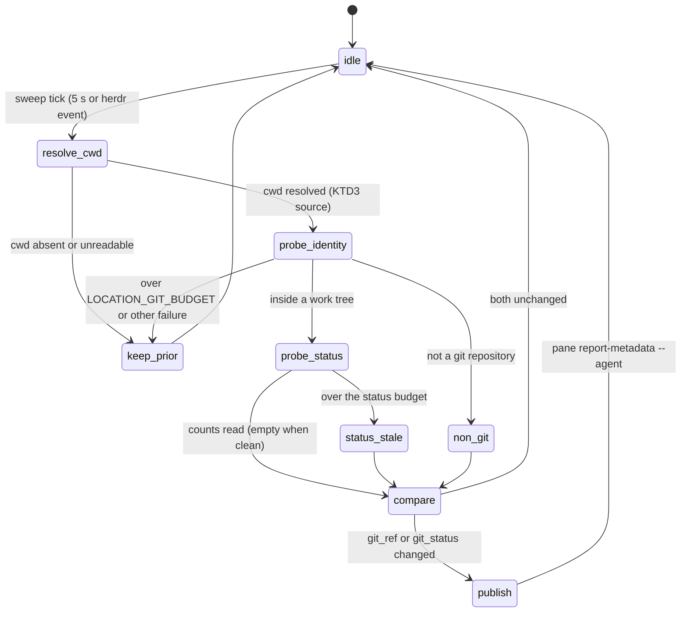

# Herdr Agent Git Status - Plan

## Goal Capsule

- **Objective:** Looking at the herdr agents sidebar, the user sees for every live agent the git state of the checkout the agent is actually working in right now — branch or worktree identity plus dirty / ahead / behind counts — including after the agent moved into a worktree mid-session.
- **Means:** Extend the existing `herdr-task-sync` location pass with a `$git_status` counts token and an effective-cwd fix (KTD1, KTD3).
- **Authority:** This plan; the acceptance matrix (AE1) is the completion authority and the KTD5 statechart is the design authority — a sweep behavior that is not a transition on it is out of scope. The user demonstrated format preference governs rendering (R2).
- **Stop conditions:** A matrix cell stays wrong after U3's fix and no cheap correction exists — stop and report the cell, do not build extra infrastructure. Never create a second sidebar label writer. Never run `chezmoi apply` on the host; the user applies.
- **Execution profile:** Smallest possible loop — every unit ends with something visible in the live sidebar or a filled matrix row. No provisioning apparatus, no isolated environments beyond throwaway panes and scratch repos that are closed and deleted the same session.

---

## Product Contract

### Summary

Add live git status to the agents-sidebar rows that herdr-task-sync already labels. Today the second sidebar row renders `$git_ref` (branch/worktree identity, no counts) derived from the pane's foreground cwd; it goes stale when an agent works in a worktree its process never `cd`s into, and it carries no dirty/ahead/behind information. This work adds a compact `$git_status` counts token and fixes the cwd source, verified cell-by-cell against a 3×3 agent/context matrix.

### Problem Frame

The user runs multiple agents (Claude Code, OpenCode, pi) and reads the agents sidebar to know where each one stands. The sidebar currently shows identity that can lag reality (e.g., still showing `main` while the agent works in a worktree) and never shows whether the checkout is dirty or ahead/behind — so the user must interrupt or inspect panes to learn basic state.

### Key Decisions

- KD1. **Matrix-first acceptance.** The verification matrix (AE1) is defined before any code and is the acceptance authority. (session-settled: user-directed — chosen over implement-then-demo: the user requires knowing exactly what is checked per agent/context before the plugin is written.) Governs R5.
- KD2. **Minimal scope, fast feedback loop.** Each unit lands something observable within hours, not days; no test playgrounds, isolated fixture environments, or credential apparatus. (session-settled: user-directed — chosen over heavyweight verification tooling: the user explicitly rejected that style of build.) Governs R1–R5.

### Requirements

- R1. Each live agent's sidebar row shows the branch or worktree identity **and** git status counts (dirty, ahead, behind) of the checkout that agent is actually working in.
- R2. Rendering is compact, in the spirit of the user's example `cc:agent main (dirty, 2pull, 1push)`: identity token plus counts token on the existing rows; exact glyphs follow the existing `$git_ref` icon conventions.
- R3. When an agent's effective working directory changes mid-session (it created or entered a worktree), the row reflects the new location within one sweep cycle (≤ ~10 s).
- R4. A directory that is not a git checkout shows identity only (existing folder rendering); no counts, no error noise.
- R5. Every cell of the acceptance matrix (AE1) is verified by direct observation of the live sidebar — once as a baseline before changes (U1) and once after (U3).
- R6. `herdr-task-sync` remains the only pane/tab label and location-token writer; no new writer process is introduced.

### Acceptance Examples

- AE1. **The verification matrix.** Rows = agent kinds; columns = git contexts of the agent's effective cwd. Each cell passes when the agent's sidebar row shows the stated content within one sweep of the state coming true.

| Agent | Folder without git | Branch + status | Worktree + status |
|---|---|---|---|
| claude code (`cc:`) | identity = folder name, no counts | branch name + dirty/ahead/behind counts | worktree identity + counts for the worktree checkout |
| opencode | same | same | same |
| pi | same | same | same |

  - **Given** for "branch + status": a checkout on a named branch with ≥1 modified file, ≥1 commit ahead and ≥1 behind its upstream. **Then** the row shows that branch with matching counts.
  - **Given** for "worktree + status": the agent started in the main checkout, then moved its work into a linked worktree (the herdr-native case: `EnterWorktree` / `cd` inside the agent). **Then** the row shows the worktree identity and the worktree's counts — not the launch directory's.
  - The baseline U1 pass fills the same matrix with *observed current behavior* (expected: identity works for static cases, worktree column stale, counts absent everywhere).
  - Evidence lives in this file: U1 appends a "Baseline observed" table and U3 an "After observed" table, both mirroring AE1's 3×3 layout, so the Definition of Done's "verified" claim points at recorded observations.

### Scope Boundaries

- **Deferred to Follow-Up Work:** stash/conflict indicators; per-workspace (spaces-section) status rows; any reuse of the retired playground CLI. The playground PR #84 stays closed; nothing here depends on it.
- **Out of scope:** new standalone plugin directory; changes to other herdr plugins; opencode/pi-side integrations beyond what observation in U1 proves necessary.

---

## Planning Contract

- KTD1. **Extend `herdr-task-sync`, not a new plugin.** The user asked to "write a plugin"; research shows the deployed `herdr-pane-labels` plugin manifest declares `~/.local/bin/herdr-task-sync` the only pane/tab label writer, and its location pass already derives repo/worktree/branch per pane and reports `git_ref` via `pane report-metadata --token`. A second writer would fight its stale-token cleanup and sequence numbers. Adding one token to the existing pass is the smallest change that meets the outcome. This is the plan's one challenge to the directive; the outcome the user asked for is unchanged.
- KTD2. **`$git_status` is a separate token, `$git_ref` is untouched.** Counts are volatile; identity is stable. Keeping them separate preserves `$git_ref` semantics (and its tests) and lets the config row render `["$git_ref", "$git_status"]`. Config change: second row of `[ui.sidebar.agents].rows` in `home/private_dot_config/herdr/config.toml`. Because the reconcile pass republishes tokens only when its change-detection comparison flips, the counts string must join that comparison — a counts-only change (same branch, file becomes dirty) must trigger a republish, or the token freezes after its first write.
- KTD3. **Effective-cwd source is decided by U1 evidence, not assumption.** Verified this session: pane JSON `foreground_cwd` tracks a shell's live `cd` (probe in an isolated session), and pane-level tokens reported with `--agent` render on the agent's sidebar row. Unverified: whether an agent *process* (claude/opencode/pi) changes its own cwd when it works in a worktree via tool subshells — likely not, which would explain the staleness. Candidate fallback order for the effective cwd: `foreground_cwd` → deepest live descendant process cwd (`herdr pane process-info` / `lsof`) → agent-side report via the Claude hook. The hook candidate is not pre-wired: `herdr-task-sync-hook.sh` does not currently forward a cwd and `herdr-task-sync` has no flag to receive one, and it fires only on prompt/session/compact events, so it cannot meet R3's sweep-cycle freshness between prompts — pick it only if both other candidates fail outright. "Cheapest" means the smallest code delta in `resolve_pane_location` that meets R3. The chosen source must be verified against all three agent kinds, or recorded as agent-kind-conditional; if no single source clears all three, U3 implements a per-agent-kind fallback instead of one universal path. Override rule: when the chosen worktree-aware source and `foreground_cwd` are both present and disagree, the worktree-aware source wins — "fallback" never means "only when foreground_cwd is absent", or a stale launch directory stays authoritative forever. Chosen source (filled by U1): _pending_.
- KTD4. **Reuse the hardened conventions of the location pass.** Git probes run under the existing budgeted-command mechanism (kill-on-timeout with distinct outcome, stale marker instead of wrong data); new glyphs are generated via octal `printf` per `docs/solutions/design-patterns/generate-pua-glyphs-from-octal-printf.md`; wall-clock budgets follow the liveness/behavior split in `docs/solutions/design-patterns/idle-machine-wall-clock-bounds-are-latent-flakes.md`. The status probe gets its **own budget constant**, not `LOCATION_GIT_BUDGET`: that 75 ms bound is calibrated for scan-free `rev-parse`, while a status probe scans the working tree (tens of ms warm on a small repo, far more cold or large). Size the new budget from measurement at execution time; a status-probe timeout degrades only `$git_status` to absent/stale and never touches `$git_ref`.

- KTD5. **The statechart is the design authority, and its outcome names live in the code.** The transition table below — not surrounding prose — decides what one sweep does with one pane; a behavior that is not a transition on it is out of scope for U2 and U3. So that the code stays checkable against the chart, the status probe resolves to exactly one named outcome (`fresh`, `stale`, `absent`) returned from a single resolver, mirroring the outcome convention `resolve_pane_location` already uses (`transient` / `non_git`), and exactly one call site maps that outcome onto a `git_status` token write or clear. No state-machine framework, no dispatch table, no new module (KD2): three literal outcome strings and one mapping point are the whole of "the code follows the chart".

### High-Level Technical Design

One sweep, one pane, as a state machine. `resolve_cwd`, `probe_identity`, `compare`, and `publish` already exist in `herdr-task-sync`. The work is the `probe_status` / `status_stale` pair (U2) and which source `resolve_cwd` reads (U3).

| # | Transition | Guard | Required outcome | Owner |
|---|---|---|---|---|
| T1 | `idle → resolve_cwd` | sweep tick, 5 s or a herdr event | the pass runs for every live pane | existing daemon, unchanged |
| T2 | `resolve_cwd → keep_prior` | cwd empty or unreadable | both tokens keep their prior values as stale; nothing republished | existing |
| T3 | `resolve_cwd → probe_identity` | effective cwd resolved by the KTD3 source; when that source and `foreground_cwd` disagree the worktree-aware source wins | both probes run against the checkout the agent actually works in | U3 |
| T4 | `probe_identity → non_git` | git reports "not a git repository" / "not inside a work tree" | folder identity only, no counts, no error output (R4) | existing; U2 extends the clear to `git_status` |
| T5 | `probe_identity → keep_prior` | over `LOCATION_GIT_BUDGET`, or any other probe failure | prior identity retained as stale, never a wrong ref | existing |
| T6 | `probe_identity → probe_status` | inside a work tree | counts probe starts under its **own** budget constant (KTD4) | U2 |
| T7 | `probe_status → compare`, dirty | counts read, at least one non-zero | outcome `fresh`; token renders dirty, then ahead, then behind, each only when non-zero | U2 |
| T8 | `probe_status → compare`, clean | counts read, all zero | outcome `fresh` with an empty token | U2 |
| T9 | `probe_status → status_stale` | over the status budget | outcome `stale`: `git_status` stale or absent, `git_ref` untouched, never a wrong count | U2 |
| T10 | `non_git → compare` | — | outcome `absent`: `git_status` cleared alongside the other location tokens | U2 |
| T11 | `compare → idle` | `git_ref` and `git_status` both equal the last published pair | no republish, no token churn | U2 |
| T12 | `compare → publish` | either token differs, **including a counts-only change on the same branch** | one `pane report-metadata --agent` call writes both tokens; still the only label writer (R6) | U2 (KTD2) |

`publish → idle` and `keep_prior → idle` close the cycle; the sidebar renders the resulting pair as `["$git_ref", "$git_status"]`, e.g. `cc:agent  main  ~2 ⇡1 ⇣2`.

### Assumptions

- The staleness the user observed is the worktree/effective-cwd case, not a daemon outage; U1's baseline confirms or corrects this before code is written.
- `ahead`/`behind` require an upstream; without one the counts render as absent, matching `git rev-list --left-right` semantics (implementer confirms exact plumbing at execution time).

### Open Questions

- Deferred (not blocking; U1 resolves it inside its own session): one review leg argued the Claude-hook cwd transport should be designed up front because no OS-level signal may track Claude's logical worktree directory. Held to the evidence-first order per KD2 (the minimal-scope decision): U1 observes first; only if both OS-level candidates fail for an agent kind does U3 build the hook transport KTD3 describes — and per-agent-kind cwd-reporting parity for opencode/pi beyond what U1 proves necessary stays in Deferred to Follow-Up Work.

---

## Implementation Units

### U1. Fill the baseline matrix and pick the cwd source

- **Goal:** The AE1 matrix filled with observed current behavior for all 9 cells, plus a recorded decision of which effective-cwd source turns the worktree column green (KTD3).
- **Requirements:** R5, KD1.
- **Dependencies:** none.
- **Files:** none in production; record observations by filling the AE1 baseline into this plan file and the KTD3 decision line.
- **Approach:**
  1. In the live herdr session, open throwaway panes: one per agent kind (claude code, opencode, pi), each pointed at a scratch repo prepared in the three context states (no-git dir, dirty branch with ahead/behind vs a local bare remote, linked worktree).
  2. Per cell, record: what the sidebar row shows, the pane's `cwd`/`foreground_cwd`, and the deepest descendant process cwd (`herdr pane process-info`, `lsof -p`).
  3. For the worktree column, have each agent actually move its work (EnterWorktree for claude; equivalent `cd` for opencode/pi) and observe whether any source tracks it.
  4. Cadence check: after the move, let the agent sit past one full sweep with no further tool activity, then confirm the candidate source still shows the new location (R3) — not just immediately after the move.
  5. Confirm the chosen source works for all three agent kinds, or record it as agent-kind-conditional (KTD3).
  6. Close every throwaway pane; delete the scratch repo.
- **Execution note:** This is an observation unit — no production edits. It is complete when the matrix and the KTD3 choice are written down.
- **Test scenarios:** Test expectation: none — observational unit; its output is the baseline matrix.
- **Verification:** All 9 baseline cells filled; KTD3 names one chosen source with the observed evidence; no leftover panes or scratch dirs.

### U2. `$git_status` counts token

- **Goal:** The agents sidebar shows dirty/ahead/behind counts next to `$git_ref` for every pane whose effective cwd is a git checkout.
- **Requirements:** R1, R2, R4, R6; KTD2, KTD4, KTD5.
- **Dependencies:** U1 (baseline recorded; cwd handling unchanged in this unit).
- **Files:** `home/dot_local/bin/executable_herdr-task-sync`, `home/private_dot_config/herdr/config.toml`, `tests/scripts.bats`, `tests/helpers/herdr_task_sync.bash`.
- **Approach:**
  1. In the existing location pass, add a counts probe under its own budget (KTD4): dirty files; ahead/behind vs upstream when an upstream exists.
  2. Have that probe return one named outcome — `fresh` (with the counts string, empty when clean), `stale`, or `absent` — from a single resolver, and map the outcome onto the token write or clear at exactly one call site (KTD5). The names are the chart's states; anything that reads `git_status` reads the outcome, not a scattered re-test of the same conditions.
  3. Emit `--token git_status=<compact string>` in the same `pane report-metadata` call that writes `git_ref`; clear it wherever `git_ref` is cleared.
  4. Include the counts string in the reconcile pass's change-detection comparison so a counts-only change republishes (KTD2).
  5. Add `"$git_status"` to the second row of `[ui.sidebar.agents].rows`.
  6. Format: clean → empty token; otherwise dirty first, then ahead, then behind, each rendered only when non-zero (glyph+count, octal-printf glyphs per KTD4); exact glyphs are the implementer's choice, consistent with `git_ref_for`, but the order and the absent-when-zero rule are fixed so AE1 cells are judged consistently.
  7. "Dirty" = count of unique paths with any staged, unstaged, or untracked change.
- **Patterns to follow:** `git_ref_for()` and the location-pass token write in `executable_herdr-task-sync` (~lines 950–1510); glyph table at the top of the same file; existing `herdr_task_sync.bash` test helper fixtures.
- **Test scenarios:**
  - Clean checkout on a branch → `git_status` token empty or absent, `git_ref` unchanged.
  - Checkout with 2 modified files, 1 ahead, 2 behind → token carries exactly those counts.
  - Staged-only change and untracked-only file → each counts as dirty (Approach step 7); partially staged path counts once.
  - No upstream configured → dirty count present, ahead/behind absent, no error output.
  - Non-git directory → `git_status` cleared along with the other location tokens (R4).
  - Counts-only change between two sweeps on the same branch (a file becomes dirty, identity unchanged) → the token republishes with the new counts (KTD2).
  - Status probe exceeding its budget → `$git_status` stale/absent, `$git_ref` unaffected, never a wrong count (KTD4).
- **Verification:** New bats scenarios red before, green after; after the user applies, a deliberately dirtied repo shows counts on the agent row within one sweep.

### U3. Effective-cwd fix and matrix acceptance

- **Goal:** The worktree column goes green: an agent that moved into a worktree shows that worktree's identity and counts (R1, R3).
- **Requirements:** R1, R3, R5; KTD3, KTD5.
- **Dependencies:** U1 (source chosen), U2 (counts exist).
- **Files:** `home/dot_local/bin/executable_herdr-task-sync`, `tests/scripts.bats`, `tests/helpers/herdr_task_sync.bash`; possibly `~/.claude/hooks/herdr-task-sync-hook.sh`'s managed source if U1 chose the agent-hook source.
- **Approach:**
  1. Implement the U1-chosen cwd source as a fallback in `resolve_pane_location` (keep `foreground_cwd` where it already works); if U1 recorded the choice as agent-kind-conditional, implement the per-agent-kind fallback KTD3 defines — nothing beyond what U1's evidence named.
  2. Verify the edited script directly (bats + a manual one-shot sweep run of the checkout copy); then the user runs `chezmoi apply`.
  3. After apply, re-run the full AE1 matrix against the live sidebar and record the "After observed" table; demonstrate the result to the user.
- **Test scenarios:**
  - Covers AE1. Simulated pane where `foreground_cwd` and the chosen worktree-aware source are both present and disagree → location resolves per KTD3's override rule (the worktree-aware source wins).
  - Chosen source unavailable (process exited, permission denied) → falls back to existing behavior, no error noise.
  - Source flapping between two dirs within one sweep → last-read value wins; no token churn beyond one update per sweep.
- **Verification:** All 9 AE1 cells observed green in the live sidebar; bats scenarios green; no regression in existing `$git_ref` tests.

---

## Verification Contract

| Gate | Command | Covers |
|---|---|---|
| Lint | `make lint` | U2, U3 shell changes |
| Behavior tests | `bats tests/scripts.bats` | U2, U3 token/location logic |
| Full managed-file proof (pre-merge, once) | `make test-ubuntu` | applies the checkout; final gate only, not per-iteration (KD2) |
| Matrix acceptance (manual) | fill AE1 in the live sidebar | U1 baseline, U3 acceptance |

---

## Definition of Done

- All 9 AE1 cells verified green in the live sidebar (U3), with the baseline recorded (U1).
- `make lint` and `bats tests/scripts.bats` green; `make test-ubuntu` green once before merge.
- `$git_ref` behavior and its existing tests unchanged (R6, KTD2).
- The status probe carries the three outcome names `fresh` / `stale` / `absent`, resolved in one place and mapped to the token at one call site (KTD5).
- No leftover experiment panes, sessions, or scratch repos; no abandoned-approach code in the diff.
- The user has seen the working sidebar and run `chezmoi apply` themselves.
