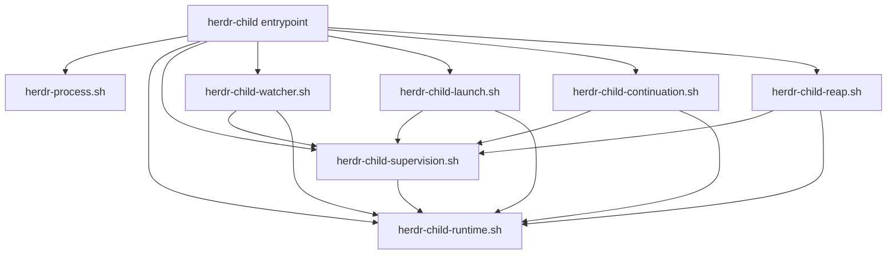

# Herdr Child Lifecycle Modules - Plan

## Goal Capsule

- **Objective:** decompose the 2,468-line `herdr-child` executable into cohesive Bash 3.2-compatible lifecycle modules while preserving the deployed command and every observable Child-agent contract behavior.
- **Authority:** repository issue `2026-08-26-001` defines refactor scope; `CONCEPTS.md` and `docs/plans/2026-08-26-001-feat-herdr-detached-child-supervision-plan.md` define normative lifecycle behavior; existing semantic tests and the executable provide verification evidence. Stop and record separate work rather than choosing silently if those sources conflict.
- **Execution profile:** six incremental extraction units, each protected by the narrowest existing semantic owner before the next boundary moves.
- **Open blockers:** none.
- **Stop conditions:** stop if an extraction requires changing public output, exit status, metadata schema, watcher argv, lifecycle ordering, or recovery semantics; stop if the complete Herdr child owner cannot finish without orphaned watchers.
- **Tail ownership:** implementation owns issue lifecycle updates, focused red/green evidence for each extraction, full disposable deployment verification, and removal of abandoned module experiments.

---

## Product Contract

### Summary

`home/dot_local/bin/executable_herdr-child` remains the only user-facing executable and command dispatcher.
Its runtime, supervision, watcher, launch, continuation, and reap responsibilities move into sibling sourced libraries under `home/dot_local/lib/`.
The refactor changes source organization only: command output, exit codes, metadata, watcher process shape, test barriers, and recovery behavior remain stable.

### Problem Frame

The executable combines argument parsing, metadata serialization, watcher delivery, callback receipts, continuation takeover, reap recovery, and owner-lock handling in one 2,468-line shell file.
Semantic coverage makes these state machines safe to change, but the monolith makes future race fixes difficult to isolate and review.
The decomposition must expose cohesive ownership without breaking the shared shell process semantics that currently couple traps, globals, dynamic scope, and `errexit` behavior.

### Requirements

**Packaging and compatibility**

- R1. `~/.local/bin/herdr-child` remains the only deployed executable and preserves the existing public subcommands and help text.
- R2. Extracted libraries remain compatible with macOS Bash 3.2 and are sourced relative to the executable rather than resolved through `PATH`.
- R3. Extracted libraries contain functions and shared state only; they add no independent dispatch, strict-mode reset, source-time trap, or executable entrypoint.
- R4. Chezmoi deploys every required library alongside the executable, and the deployed executable proves that its relative sources resolve.

**Behavior preservation**

- R5. Every existing stdout and stderr shape, exit code, metadata field, source identifier, state label, marker, and typed recovery reason remains unchanged.
- R6. Watcher generation, delivery claim, callback receipt, continuation takeover, reap invalidation, and owner recovery transitions retain their current ordering and fail-closed behavior.
- R7. The internal `__watcher` dispatch remains undocumented and keeps the existing `herdr-child __watcher` process shape used by descriptor and orphan detection.
- R8. Launch-local cleanup and signal handlers remain nested where Bash dynamic scope supplies their state.

**Verification integrity**

- R9. Existing test-only environment barriers remain adjacent to the causal transition they control and are not exposed as command options.
- R10. Each extraction is checked red/green through the existing semantic command boundary before the next extraction begins.
- R11. Tests assert command status before output and avoid source-shape assertions except for the explicit module-ownership, source-time-purity, watcher-argv, and deployed-file contracts introduced by this refactor.
- R12. Final evidence includes the complete Herdr child semantic owner,
  descriptor/process coverage, lint, issue validation, and disposable Ubuntu
  apply. The host-only chezmoi diff is supplementary because it renders real
  secret-backed configuration and does not apply this checkout.

### Acceptance Examples

- AE1. Given the refactored source tree, when the deployed `herdr-child --help` runs, then all libraries resolve and public help remains unchanged without showing `__watcher`.
- AE2. Given an unknown subcommand, when dispatch runs, then it still exits 2 and prints the same usage failure.
- AE3. Given attached and detached launches, when each lifecycle completes, then output, readiness, cleanup, and watcher creation match the pre-refactor behavior.
- AE4. Given a stale or replaced generation, when watcher delivery or continuation runs, then stale work remains unable to publish or target another pane.
- AE5. Given callback, delivery, and reap races at their existing barriers, when ordering is exercised, then exactly the existing winner, recovery state, and wake behavior remain observable.
- AE6. Given a controlled descriptor probe, when the launcher exits and the watcher remains blocked, then inherited descriptors close, process groups stay separate, and cleanup removes run state.
- AE7. Given a full disposable apply, when the suite completes, then no checkout-owned watcher survives with a dead launcher and missing run directory.

### Success Criteria

- The entrypoint contains only strict-mode setup, relative sourcing, and command dispatch plus any constants that must remain there for static analysis.
- Six cohesive libraries own runtime, synchronization, watcher, launch, continuation, and reap responsibilities without circular dependencies.
- Existing Herdr child semantic tests pass without weakening assertions or replacing causal barriers with elapsed-time checks.
- `make test-ubuntu` applies the checkout and verifies the deployed command and libraries.

### Scope Boundaries

- Do not consolidate or rewrite the embedded Python JSON predicates in this change.
- Do not rename functions, metadata fields, markers, environment barriers, or public options. Record any discovered behavior defect as separate work and do not fix it in this implementation.
- Do not introduce a framework, generated monolithic artifact, daemon, plugin, or new lifecycle capability.
- Do not change `home/dot_local/lib/herdr-process.sh`, the Child-agent contract, or watcher orphan matching unless verification reveals a concrete compatibility defect.
- Do not replace semantic tests with assertions about function locations, source order, or source-line content.

### Dependencies and Assumptions

- Sourced Bash files intentionally share shell options, traps, globals, and dynamic scope with the entrypoint.
- The current semantic suite is the primary regression evidence for normative lifecycle behavior from `CONCEPTS.md` and the detached-supervision plan; a disagreement stops the refactor for separate diagnosis.
- The existing synchronization protocol requires delivery claims, reap ownership, watcher invalidation, and recovery helpers to evolve together.
- `make test-suite` is not checkout evidence because it reads the already-applied home directory.
- `make test-local` is a supplementary host-state diagnostic, not deployment
  evidence. A stall is tracked separately and does not replace the disposable
  apply gate owned by `make test-ubuntu`.

### Sources

- `docs/issues/2026-08-26-001-decompose-herdr-child-lifecycle-engine.md` - deferred refactor scope and invariants.
- `home/dot_local/bin/executable_herdr-child` - current behavior and function dependency graph.
- `docs/plans/2026-08-26-001-feat-herdr-detached-child-supervision-plan.md` - normative lifecycle and recovery design being preserved.
- `docs/solutions/architecture-patterns/child-initiated-callback-over-in-turn-supervision.md` - generation-bound detached supervision and callback inversion.
- `docs/solutions/design-patterns/semantic-regression-tests-over-source-shape.md` - semantic ownership and red/green requirements.
- `docs/solutions/design-patterns/idle-machine-wall-clock-bounds-are-latent-flakes.md` - causal barrier testing for concurrency.
- `docs/solutions/test-failures/bats-mid-test-compound-conditionals-bypass-errexit.md` - explicit Bash failure handling.

---

## Planning Contract

### Key Technical Decisions

- KTD1. **Use sourced sibling libraries rather than generated assembly.** Chezmoi already deploys `home/dot_local/lib/herdr-process.sh`, and direct sourcing keeps reviewable source boundaries without adding a build step.
- KTD2. **Keep one foundational runtime module.** Environment validation, metadata serialization, atomic state helpers, JSON adapters, generation creation, output formatting, and generic identity predicates form the dependency floor for every lifecycle path. Cross-module configuration constants remain initialized once in the entrypoint.
- KTD3. **Keep the synchronization kernel whole.** Delivery claims, generation invalidation, reap owner guards, watcher recovery, and shared run-directory transitions move together into `herdr-child-supervision.sh` because splitting them would hide one transactional protocol.
- KTD4. **Separate watcher orchestration from synchronization primitives.** `herdr-child-watcher.sh` owns `deliver_supervision_event` and `watch_child`, while their locks, transitions, and recovery helpers remain in KTD3's kernel.
- KTD5. **Preserve command-level lifecycle ownership.** Launch, continuation, and reap each receive one module; attached and detached continuation stay together because they share freshness and generation-handoff semantics.
- KTD6. **Move code without semantic cleanup.** Function names, argument contracts, Python predicates, nested handlers, conditional contexts, and `set +e`/`set -e` boundaries stay byte-equivalent where practical so extraction risk remains independently measurable.
- KTD7. **Verify behavior through consumers and architecture through narrow structural controls.** Existing semantic suites remain the lifecycle owners. One module-loading control owns function placement, acyclic source order, and source-time purity; the descriptor probe owns real watcher argv; smoke coverage owns deployed files and relative-source resolution.

### High-Level Technical Design

The source order is `herdr-process.sh`, runtime, supervision, watcher, launch, continuation, and reap.
Runtime defines foundational helper functions before downstream modules are parsed.
Supervision owns shared mutable reap state such as `REAP_OWNER_GUARD_PID` and `REAP_OWNER_TOKEN`.
Watcher owns its local `DELIVERY_REASON` result channel because both its writer and reader live in `herdr-child-watcher.sh`.
Command modules define functions only; the executable's final case statement remains the sole dispatch boundary.

### Implementation Constraints

- Use no associative arrays, namerefs, `mapfile`, dynamic descriptor allocation, or Bash features newer than 3.2.
- Resolve modules from `SCRIPT_DIR/../lib` and add static ShellCheck source annotations.
- Do not add `set -euo pipefail` inside sourced modules.
- Keep launch cleanup and signal handlers nested inside `start_child`.
- Keep test barriers in the module that owns their causal transition; never centralize them as a generic testing layer.
- Keep `script_path` resolving the executable rather than the current sourced file.
- Keep cross-module configuration initializers in the entrypoint. Document each module's externally initialized globals and use only the narrow ShellCheck annotations needed for standalone library analysis.

### Module Loading Contract

`tests/bashunit/scripts_test.sh` gains one architecture control because module ownership is an explicit deliverable rather than an incidental implementation detail.
It sources modules in declared order inside an isolated Bash process, records the functions each source adds, and compares them with the owning module's planned function inventory.
It also snapshots shell options, traps, `PWD`, `umask`, and positional parameters before and after each source; only documented constant or shared-global initialization may change.
The control rejects command dispatch, strict-mode reset, traps, directory changes, positional-argument consumption, and cross-module function placement at source time.

| Module | Owned functions | Allowed source-time initialization |
|---|---|---|
| `herdr-child-runtime.sh` | `usage`, `fail_usage`, `require_herdr`, `require_parent`, `metadata_report_checked`, `metadata_report`, `metadata_report_if_generation`, `now_ms`, `atomic_write`, `script_path`, `generation_nonce`, `json_identity_for_pane`, `json_agent_snapshot`, `json_generation_status`, `json_resolve_parent`, `json_child_context`, `json_tab_identity`, `json_created_tab_hint`, `state_value`, `supervision_reason`, `print_supervision_failure`, `print_supervision_uncertain`, `print_start_result`, `json_has_name`, `json_has_pair`, `tab_reap_status` | none |
| `herdr-child-supervision.sh` | `wait_for_watcher_state`, `wait_for_watcher_failure`, `remove_supervision_run`, `acquire_arm_guard`, `release_arm_guard`, `begin_supervision_transition`, `finish_delivery_transition`, `request_watcher_abort`, `report_signal_supervision`, `stop_owned_watcher`, `watcher_preflight_fail`, `publish_supervision_recovery`, `watcher_invalidation_action`, `watcher_generation_current`, `watcher_hold_expired`, `watcher_publish_failed`, `watcher_fail`, `watcher_fail_without_publish`, `clear_supervision_metadata`, `clear_supervision_state_labels`, `preserve_callback_waiting_label`, `refresh_supervision_liveness`, `delivery_retry_pause`, `next_delivery_retry_delay`, `invalidate_generation`, `begin_reap_invalidation`, `start_reap_owner_guard`, `stop_reap_owner_guard`, `reap_owner_recovery_status`, `signal_reap_transition`, `publish_reap_recovery` | initialize `REAP_OWNER_GUARD_PID` and `REAP_OWNER_TOKEN` to empty |
| `herdr-child-watcher.sh` | `deliver_supervision_event`, `watch_child` | initialize `DELIVERY_REASON` to empty |
| `herdr-child-launch.sh` | `start_child`; its cleanup and signal helpers remain nested | none |
| `herdr-child-continuation.sh` | `wait_for_fresh_settlement`, `managed_detached_prompt`, `persist_callback_state`, `ask_parent`, `prompt_child`, `reply_child` | none |
| `herdr-child-reap.sh` | `reap_children` | none |

### Test Barrier Inventory

| Barrier | Destination | Causal anchor |
|---|---|---|
| `HERDR_CHILD_TEST_NOW_SEQ` | runtime | substitutes the metadata sequence clock inside the serialized metadata writer. |
| `HERDR_CHILD_TEST_REAP_OWNER_VERIFIED` | supervision | fires after reap ownership is identity-verified and before invalidation proceeds. |
| `HERDR_CHILD_TEST_HOLD_TIMEOUT_SECONDS` | supervision | bounds a held transition claim without replacing production timing. |
| `HERDR_CHILD_TEST_FAILURE_PUBLISH_BARRIER` | supervision | fires at failure publication after the terminal delivery decision. |
| `HERDR_CHILD_TEST_RETRY_LOG` | supervision | records each retry decision after reason classification. |
| `HERDR_CHILD_TEST_SKIP_RETRY_SLEEP` | supervision | bypasses only retry delay after the retry has been selected. |
| `HERDR_CHILD_TEST_WATCHER_PID_FILE` | watcher | publishes watcher identity after process detachment. |
| `HERDR_CHILD_TEST_PREPARE_FAIL` | watcher | fails watcher preparation before readiness can publish. |
| `HERDR_CHILD_TEST_ARM_BARRIER` | watcher | stops after preparation and before armed readiness. |
| `HERDR_CHILD_TEST_ARM_FAIL` | watcher | fails the arm transition before success publication. |
| `HERDR_CHILD_TEST_WATCHER_RELEASE` | watcher | releases the controlled watcher loop after descriptor assertions. |
| `HERDR_CHILD_TEST_TAB_CREATED_BARRIER` | launch | fires immediately after owned tab creation and before child submission. |
| `HERDR_CHILD_TEST_LAUNCH_POST_ARM_BARRIER` | launch | fires after watcher arm and before launcher success returns. |
| `HERDR_CHILD_TEST_BASELINE_FAIL` | continuation | fails fresh-state baseline capture before prompt mutation. |
| `HERDR_CHILD_TEST_SETUP_FAIL` | continuation | fails replacement watcher setup before takeover publication. |
| `HERDR_CHILD_TEST_TAKEOVER_METADATA_PUBLISHED` | continuation | fires after replacement metadata publishes and before prior-generation invalidation completes. |
| `HERDR_CHILD_TEST_CALLBACK_RECEIPT_BARRIER` | continuation | fires after callback delivery and before confirmed receipt persistence. |
| `HERDR_CHILD_TEST_REAP_INVALIDATED_BARRIER` | reap | fires after successful reap invalidation and before pane closure. |

Each hook remains immediately before or after the named transition.
Race-owner red controls deliberately move one hook across its anchor and require the existing test to lose or reverse its verdict before restoration.

### Sequencing

1. Establish deployed library ownership, then extract the low-coupling runtime foundation.
2. Extract launch and continuation command orchestration while the synchronization kernel remains in place.
3. Extract reap orchestration before moving the shared synchronization helpers it calls.
4. Move the synchronization kernel as one unit and stress the delivery/reap race owner.
5. Move watcher delivery and the watcher loop last, then run complete deployment evidence.

### Risks and Mitigations

| Risk | Mitigation |
|---|---|
| Sourcing changes `errexit`, conditional, or trap behavior | Move function bodies without wrapping them, resetting strict mode, or changing caller context; run status-sensitive semantic cases after every unit. |
| A module split separates one synchronization invariant | Keep delivery claims, reap owner state, invalidation, and watcher recovery in one supervision module. |
| `script_path` starts resolving a library | Leave executable resolution in runtime and verify the literal watcher argv plus suite-end orphan guard. |
| Test barriers move away from the transition they prove | Preserve the barrier inventory and calibrate race owners by temporarily moving a hook across its named anchor. |
| Smoke checks prove files exist but not that deployment works | Invoke deployed `herdr-child --help` after asserting the executable and six libraries exist. |
| Structural cleanup changes Python parse or status mapping | Defer JSON consolidation and all function renames to separate measured work. |

---

## Implementation Units

### U1. Establish the module contract and extract runtime

- **Goal:** create the foundational module boundary and prove the checkout entrypoint resolves it without source-time side effects.
- **Requirements:** R1-R5, R9-R12.
- **Dependencies:** none.
- **Files:** `home/dot_local/bin/executable_herdr-child`, `home/dot_local/lib/herdr-child-runtime.sh` (new), `tests/bashunit/scripts_test.sh`.
- **Patterns:** `home/dot_local/lib/herdr-process.sh` for a non-executable Bash 3.2 sourced library; existing deployed-command assertions in `tests/bashunit/smoke_test.sh`.
- **Approach:** leave cross-module configuration constants in the entrypoint and move validation, metadata serialization, atomic state helpers, JSON adapters, generation helpers, output formatting, and generic identity predicates without renaming or reformatting behavior. Add the module-loading contract for runtime ownership and source-time purity. Execute the checkout entrypoint's `--help` so broken relative sourcing fails before deployment testing in U6.
- **Test scenarios:** public help unchanged; internal watcher omitted from help; unknown command status remains 2; metadata sequencing and identity checks retain typed statuses; attached output remains unchanged; module sourcing adds only the intended functions and documented initialization.
- **Acceptance examples:** AE1-AE4.
- **Red control:** temporarily remove the runtime source line and require the checkout help control to fail on the missing module before restoration.
- **Verification:** Bash syntax, the `herdr_child` filter, module-loading control, checkout help control, and lint pass before U2.

### U2. Extract launch orchestration

- **Goal:** isolate parsing, allocation, cleanup, prompt submission, signal handling, and watcher readiness without changing launch semantics.
- **Requirements:** R1-R3, R5-R10.
- **Dependencies:** U1.
- **Files:** `home/dot_local/bin/executable_herdr-child`, `home/dot_local/lib/herdr-child-launch.sh` (new).
- **Approach:** move `start_child` as one function and retain its nested `cleanup_pane`, `owned_launch_signal`, and `launch_signal_handler` helpers so Bash dynamic scope continues to provide launch state. Keep validation order, ownership transfer, trap installation/restoration, and watcher invocation unchanged.
- **Test scenarios:** invalid options mutate no Herdr state; attached launch starts no watcher; detached success waits for arm; pre-submission signals clean owned resources; post-submission ambiguity preserves the child; pane and tab cleanup reports are unchanged.
- **Acceptance examples:** AE2-AE3.
- **Red control:** temporarily move cleanup ownership transfer after prompt submission and require the existing post-acceptance signal case to fail for destructive cleanup before restoration.
- **Verification:** focused launch, tab, arm, and signal cases pass red/green against the moved boundary.

### U3. Extract callback and continuation orchestration

- **Goal:** isolate fresh-state waiting, callback receipts, managed takeover, prompt, and reply while preserving generation handoff.
- **Requirements:** R3, R5-R10.
- **Dependencies:** U1-U2.
- **Files:** `home/dot_local/bin/executable_herdr-child`, `home/dot_local/lib/herdr-child-continuation.sh` (new), `tests/bashunit/scripts_test.sh`.
- **Approach:** move `wait_for_fresh_settlement`, `managed_detached_prompt`, `persist_callback_state`, `ask_parent`, `prompt_child`, and `reply_child` together. Preserve the replacement-watcher preparation, metadata publication, prior-generation invalidation, activation, prompt acceptance, and arming order.
- **Test scenarios:** callback waiting state precedes delivery; moved-parent identity resolves safely; uncertain receipts allow only an exact duplicate; attached continuation arms no watcher; detached reply and prompt advance generation; preflight failure preserves the prior watcher; a prior watcher held at `HERDR_CHILD_TEST_WATCHER_RELEASE` exits and removes its run directory after takeover without requiring release.
- **Acceptance examples:** AE4-AE5.
- **Red control:** temporarily omit prior-generation invalidation during managed takeover and require the held-old-watcher case to retain the stale PID and run directory before restoration; the hold loop observes invalidation directly and cannot pass through the later metadata-generation fence.
- **Verification:** focused ask, reply, prompt, callback, and takeover cases pass red/green before U4.

### U4. Extract reap orchestration

- **Goal:** isolate reap eligibility, identity revalidation, tab ownership interpretation, and close reporting while retaining shared invalidation primitives.
- **Requirements:** R3, R5-R10.
- **Dependencies:** U1-U3.
- **Files:** `home/dot_local/bin/executable_herdr-child`, `home/dot_local/lib/herdr-child-reap.sh` (new), `tests/bashunit/scripts_test.sh`.
- **Approach:** move `reap_children` only. Keep generation invalidation, reap owner guards, and watcher recovery helpers in the executable until U5 moves that shared kernel atomically. Add `HERDR_CHILD_TEST_REAP_INVALIDATED_BARRIER` immediately after successful invalidation and before pane closure so the existing delivery/reap harness can observe this causal boundary without elapsed-time inference.
- **Test scenarios:** only settled unfocused non-waiting children close; fresh pair mismatch preserves panes; ambiguous tabs remain; owned one-pane tabs collapse; sibling panes survive; close failure restores or publishes recoverable supervision; releasing delivery while reap is paused after invalidation produces no forbidden wake.
- **Acceptance examples:** AE5.
- **Red control:** temporarily move invalidation below the new barrier and pane close, release blocked delivery while reap is paused there, and require the race case to expose the forbidden wake or fail-closed mismatch before restoration.
- **Verification:** focused reap, tab-reap, and continuation-to-reap cases pass red/green before U5.

### U5. Extract the shared supervision synchronization kernel

- **Goal:** give the run-directory transition protocol one cohesive owner without changing lock or recovery ordering.
- **Requirements:** R3, R5-R10.
- **Dependencies:** U1-U4.
- **Files:** `home/dot_local/bin/executable_herdr-child`, `home/dot_local/lib/herdr-child-supervision.sh` (new).
- **Approach:** move watcher state waits, run cleanup, arm guards, delivery transitions, abort signaling, watcher stop/failure publication, supervision labels, retry policy, generation invalidation, reap owner guards, and reap recovery together. Keep delivery claims out of the prompt's blocking duration and preserve owner-token recovery across PID reuse.
- **Test scenarios:** invalidation-first suppresses delivery; an active delivery claim keeps reap fail-closed; dead claims are reclaimed; failed close restores supervision; owner recovery survives PID reuse and locale differences; retry exhaustion remains typed and causally observable.
- **Acceptance examples:** AE4-AE5.
- **Red control:** temporarily bypass the active delivery claim in reap and require the existing delivery/reap race owner to close prematurely before restoration.
- **Verification:** syntax and lint pass, then delivery/reap transition race cases run repeatedly before the full Herdr child owner.

### U6. Extract watcher delivery and complete deployment verification

- **Goal:** finish the decomposition by isolating parent wake delivery and the external watcher loop.
- **Requirements:** R1-R12.
- **Dependencies:** U1-U5.
- **Files:** `home/dot_local/bin/executable_herdr-child`, `home/dot_local/lib/herdr-child-watcher.sh` (new), `tests/bashunit/herdr_child_descriptor_probe_test.sh`, `tests/bashunit/smoke_test.sh`, `docs/issues/2026-08-26-001-decompose-herdr-child-lifecycle-engine.md`.
- **Approach:** move `deliver_supervision_event` and `watch_child`, leaving `__watcher` as an internal executable dispatch. Extend the controlled descriptor probe to inspect the live watcher command and assert the same resolved-checkout path plus `herdr-child __watcher` literals used by `tests/run-post-apply.sh`; the suite-end matcher itself remains unchanged. Extend deployed smoke ownership with all six module files and `herdr-child --help`, then close the issue through `python3 scripts/issues` with an evidence-based resolution.
- **Test scenarios:** stale settlement is ignored; timeout and later settlement each wake once; transient reads do not become `child-gone`; identity replacement fails closed; retry backoff remains bounded; abandoned barriers terminate watchers; descriptor closure reaches EOF; live argv contains the resolved executable followed by `__watcher`; disposable deployment resolves all six sources; the complete suite leaves no orphan watcher.
- **Acceptance examples:** AE1-AE7.
- **Red control:** temporarily make `script_path` resolve the watcher module and require the live-argv descriptor case to fail before restoration.
- **Verification:** complete Herdr child owner, descriptor probe, lint, issue
  validation, and disposable Ubuntu suite pass.

---

## Verification Contract

| Command | Covers | Done signal |
|---|---|---|
| `tests/lib/bashunit --filter 'herdr_child' tests/bashunit/scripts_test.sh` | U1-U6 | Public command, launch, watcher, callback, continuation, reap, race, and module-loading contracts pass. |
| `tests/lib/bashunit tests/bashunit/herdr_child_descriptor_probe_test.sh` | U2, U5-U6 | Process-group separation, descriptor closure, watcher survival, and run-state cleanup pass. |
| `make lint` | U1-U6 | ShellCheck accepts Bash 3.2-compatible module sourcing and code. |
| `make test-issues` | U6 | Repository issue closure remains schema-valid. |
| `make test-ubuntu` | U1-U6 | Disposable apply deploys the executable and all modules, then the complete Linux suite passes. |
| `git diff --check` | U1-U6 | The final implementation has no whitespace errors. |

For U1, source-line removal calibrates only the relative-source discovery contract.
For U2-U6, use each unit's named behavioral mutation at the causal transition, require the focused test to fail for that intended reason, then restore the implementation and run the same case green.
Do not retain temporary mutations or add tautological tests that mirror source text.
Treat any full-suite stall as incomplete evidence even if an isolated case passes; capture the exact boundary and create a repository issue for unresolved behavior.

---

## Definition of Done

- U1-U6 satisfy R1-R12 and AE1-AE7.
- `herdr-child` remains the sole executable and public dispatch boundary.
- Six sourced modules have acyclic, documented ownership and no source-time effects beyond the documented shared-global initialization.
- Synchronization, callback, continuation, and reap ordering remain unchanged under existing causal barriers.
- Public output, exit status, metadata, labels, markers, watcher argv, and typed recovery behavior are unchanged.
- Every extraction has focused red/green evidence through the semantic owner.
- The complete Herdr child owner and descriptor probe finish without orphaned watchers.
- Deployed `herdr-child --help` resolves every new module after disposable apply.
- `make lint`, `make test-issues`, `make test-ubuntu`, and `git diff --check`
  pass. The incomplete host-only diff is recorded in
  `2026-08-30-006-make-test-local-stalls-in-host-diff` and is not promoted to
  checkout deployment evidence.
- The repository issue is closed with the final verification evidence.
- No abandoned compatibility shim, generated assembly, duplicate helper, or experimental test code remains.
