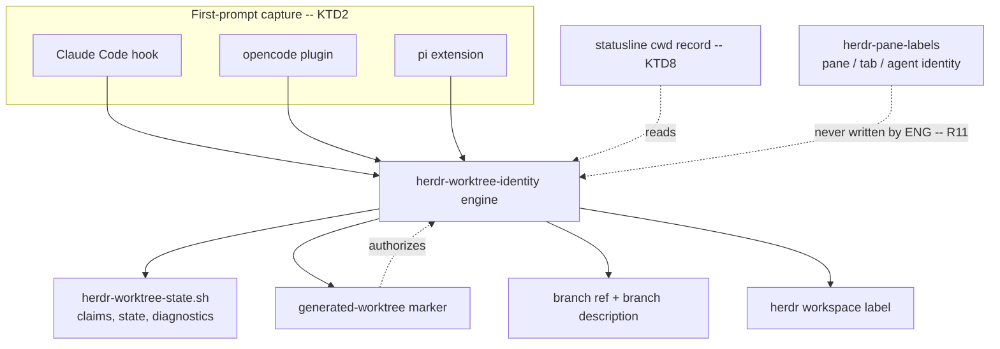
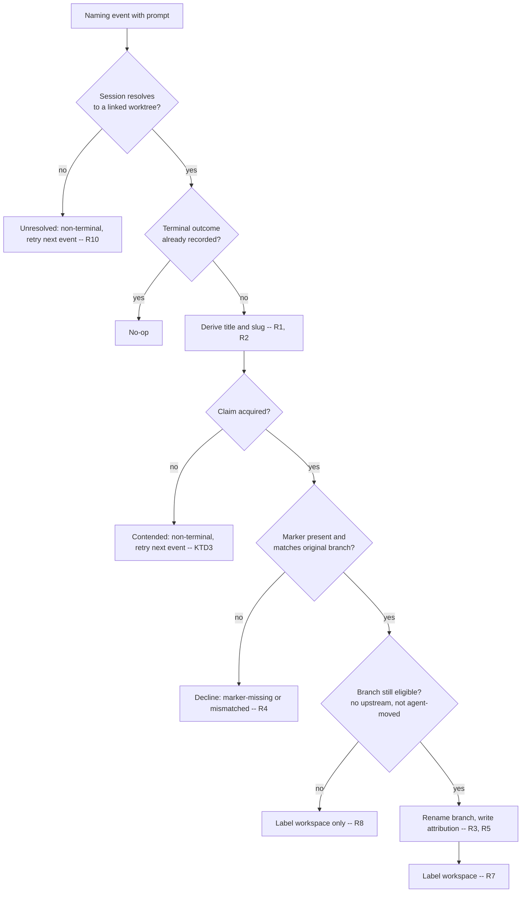
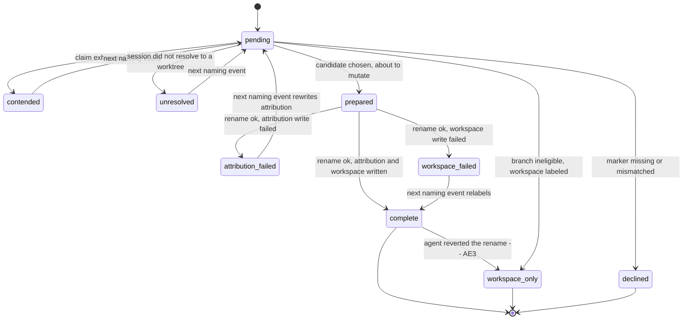

# Worktree Task Naming - Plan

## Goal Capsule

- **Objective:** After the first user prompt in a generated worktree session, the branch and the herdr workspace carry a human-readable task-derived name, and that name survives — session agents recognize it as intentional and do not revert it. The user can match any worktree, branch, or workspace to its task at a glance.
- **Means:** A new single-owner component, `herdr-worktree-identity`, driven by per-client first-prompt capture and authorized by the generated-worktree marker (KTD1, KTD2).
- **Product authority:** The user, per the 2026-09-02 debug session. The six failure findings from that session are binding requirements, not suggestions.
- **Execution profile:** Interactive, human-reviewed, shipped as one PR. No autonomous apply.
- **Tail ownership:** Agents never run `chezmoi apply` on the host. Deployment verification runs in Docker (`make test-ubuntu`); the user performs the live apply.
- **Stop conditions:** Stop and ask if the marker contract in `home/private_dot_config/herdr/plugins/worktree-setup/setup.ts` must change, or if satisfying the contention requirement forces a second long-lived daemon.
- **Open blockers:** None.

---

## Product Contract

**Product Contract preservation:** Requirements, Key Decisions, Flows, Acceptance Examples, and Scope Boundaries unchanged. Outstanding Questions resolved in place by KTD1, KTD2, and KTD3. Sources corrected with a research finding: the fixed variant referenced there exists in no commit on any ref.

### Summary

Restore task-derived naming of generated worktree branches and workspace labels as a new component that coexists with the color-animal alias system. From a session's first prompt, a model derives a task title and branch slug; the component renames the generated branch once (with attribution), sets the workspace label (independently of branch fate), and records a diagnostic for every path where it declines to act.

### Problem Frame

PR #73 replaced the prompt-derived naming engine (`herdr-task-sync`) with deterministic color-animal aliases and presentation-only pane labels. The alias half was wanted; the deletion of branch and workspace renaming was not — the user expected #73 to change only agent identity. Today nothing names worktrees by task: every generated worktree keeps its random `worktree/<name>-<hash>` branch and default workspace label.

The old engine also failed intermittently, and the 2026-09-02 debug session diagnosed why across five sessions: an unattributed mid-session branch rename read as an accident to the session's agent, which reverted it; garbage one-word model titles ("json") invited the same revert; silent `return 0` bails made failures undiagnosable; the workspace title was coupled to branch eligibility, so an upstream or a moved branch killed both; a deploy race left a worktree without its marker and therefore permanently skipped; and a 200 ms claim bound turned process contention into permanent silent abandonment (issue `docs/issues/2026-09-02-011-herdr-task-sync-gives-up-on-worktree-identity-after-a-200-ms-claim-bound-silently.md`). The restoration must design these out, not reproduce them.

### Key Decisions

- KD1. **Restore both the branch rename and the workspace label** (session-settled: user-directed — chosen over the aliases-only status quo: the user never intended #73 to remove worktree/branch naming). Governs R3, R7.
- KD2. **The alias system keeps sole ownership of pane, tab, and agent identity; this component never writes those surfaces** (session-settled: user-directed — chosen over reverting PR #73: "#73 should only have dealt with agents"). Governs R11.
- KD3. **The six debug findings are mandatory requirements** (session-settled: user-approved — the user chose "fix all four points" for the old engine before its deletion made the fix unshippable; the verified fix semantics carry over as requirements). Governs R2, R5, R8, R9, R13.
- KD4. **The generated-worktree marker in the git per-worktree admin dir remains the authorization boundary for ref mutation** (session-settled: user-approved — it was the one mechanism that worked flawlessly in the diagnosis). Governs R4.

### Requirements

**Naming derivation**

- R1. From the first user prompt of a session in a generated worktree, derive a human-readable task title and a kebab-case branch slug, using a model with a deterministic fallback.
- R2. A model slug of fewer than two words is rejected; the deterministic fallback is used instead.

**Branch rename**

- R3. The generated `worktree/*` branch is renamed to the slug at most once per worktree; the outcome is terminal.
- R4. A live ref mutation is authorized only by the generated-worktree marker in the git per-worktree admin dir; branch name text alone never authorizes one.
- R5. A successful rename leaves a durable, agent-discoverable attribution trace stating the rename is intentional, so a session agent inspecting the branch does not treat it as an accident and revert it.
- R6. A branch a session agent has moved or reverted is left alone; the component never renames against observed agent action.

**Workspace label**

- R7. The herdr workspace of the session is labeled with the task title.
- R8. Workspace labeling is decoupled from branch eligibility: when the branch cannot or must not be renamed (upstream set, agent moved it, rename reverted), the workspace still receives its title as a terminal workspace-only outcome.

**Observability**

- R9. Every path where the component declines to act writes a diagnostic record naming the reason and the observed state; no silent bails.
- R10. Diagnostics are write-only for the component: they never feed the state machine, so a transient skip cannot become a terminal outcome.

**Coexistence and capture**

- R11. The component writes only branch refs, git branch metadata, its marker, and workspace labels. Pane labels, tab labels, and agent names belong to the alias system and are never touched.
- R12. First-prompt capture exists for each agent client the old engine supported (Claude Code hook, opencode plugin, pi extension), stripped to naming duties only.

**Concurrency**

- R13. Concurrent component processes must not both mutate the same worktree, and contention must not permanently abandon identity work: a contended attempt is retried later or surfaces per R9 — never a silent terminal skip.

**Documentation cleanup**

- R14. `docs/herdr-worktrees.md` and issue `docs/issues/2026-09-02-011-…` are updated to describe the new component and the alias/identity split; both currently reference the deleted `herdr-task-sync`.

### Key Flows

- F1. Happy path
  - **Trigger:** First user prompt lands in a session whose worktree carries the generated-worktree marker.
  - **Steps:** Capture the prompt; derive title and slug (R1, R2); verify the marker authorizes mutation (R4); rename the branch with attribution (R3, R5); label the workspace (R7); record the terminal outcome.
  - **Outcome:** Branch and workspace carry the task name; the attribution trace exists.
- F2. Workspace-only path
  - **Trigger:** Naming succeeded but the branch is ineligible — upstream set, branch no longer the generated one, or a prior rename was reverted.
  - **Steps:** Skip all ref mutation (R6); label the workspace (R8); record the terminal workspace-only outcome with a diagnostic for the skipped branch (R9).
  - **Outcome:** Workspace shows the task title; the branch stays exactly as the agent left it.
- F3. Declined path
  - **Trigger:** The marker is missing or mismatched, or a claim is contended.
  - **Steps:** Mutate nothing; write the diagnostic reason (R9); leave the attempt retryable where the cause is transient (R13).
  - **Outcome:** Nothing changed, and the operator can read why from the diagnostic.

### Acceptance Examples

- AE1. **Covers R2.** Given the model returns the slug `json` for a JSON-parsing task, when naming completes, then the deterministic fallback slug derived from the prompt is used and no one-word name reaches the branch or workspace.
- AE2. **Covers R5.** Given the component renamed a branch, when a session agent inspects the branch state (reflog, branch metadata, marker), then it finds an explicit statement that the rename was intentional and who made it.
- AE3. **Covers R6, R8.** Given an agent renamed the branch back to its generated name after the component's rename, when the next naming event fires, then the branch stays where the agent put it and the workspace keeps (or receives) the task title as a workspace-only outcome.
- AE4. **Covers R8.** Given the branch acquired an upstream before the rename, when naming completes, then the branch is untouched and the workspace is titled.
- AE5. **Covers R4, R9.** Given a worktree without the generated-worktree marker (deploy race), when a naming event fires, then no ref is mutated and a diagnostic records the marker-missing reason.
- AE6. **Covers R11.** Given the component completed a rename, when pane and agent labels are read, then they still show the alias-system values; no pane or agent surface changed.

### Scope Boundaries

- Pane, tab, and agent naming stay with the alias system; this component adds no presentation, sweep, or reconciliation logic for those surfaces.
- No revert or modification of PR #73's allocator, alias pool, or `herdr-pane-labels`.
- No backfill of pre-existing worktrees; all current worktrees were recreated after the deletion.
- A redesign of the claim/contention machinery beyond R13's behavioral requirement is out of scope; planning picks the simplest mechanism that satisfies it.

#### Deferred to Follow-Up Work

- Consolidating the state and claim primitives shared by `herdr-worktree-identity` and `herdr-pane-labels` onto one library (KTD6 defers this deliberately).
- The duplicate issue ID: two files carry the `2026-09-02-011` prefix (`…-herdr-task-sync-gives-up-on-worktree-identity…` and `…-test-oracle-guard-misses-positive-tautological-tests`). Renumbering is repo hygiene outside R14.
- Resolving `docs/issues/2026-09-02-012-herdr-task-sync-tests-measure-only-an-unverified-herdr-protocol-fake.md`, which now also applies to this component's stub.
- Reporting the session working directory from opencode and pi (issues `2026-08-27-004` and `2026-08-27-005`), which would let those clients reach the same worktree-resolution accuracy the Claude adapter has.

### Sources / Research

- The pre-deletion engine and its tests: `git show 1d8c640:home/dot_local/bin/executable_herdr-task-sync` (2882 lines) and `git show 1d8c640:tests/bashunit/scripts_test.sh`. **This source predates the 2026-09-02 fixes.** A search of every ref (`git log --all -- '*herdr-task-sync*'`) found no commit carrying them: the last committed engine has bare `return 0` at each decline site, no attribution write, workspace labeling gated behind branch eligibility, slug acceptance with no word-count floor, and claim exhaustion as a silent terminal skip. R2, R5, R8, R9, R10, and R13 are therefore written fresh; the old source is a structural reference for worktree resolution and candidate-name selection, not a fix to port.
- `docs/issues/2026-09-02-011-herdr-task-sync-gives-up-on-worktree-identity-after-a-200-ms-claim-bound-silently.md` — carries the measurement that rules out raising the claim ceiling (a 2000-attempt ceiling produced `elapsed_ms=8395 allowed_ms=8136` against the fail-open guard). Governs KTD3.
- `docs/solutions/design-patterns/idle-machine-wall-clock-bounds-are-latent-flakes.md` — the causal-assertion rule this plan's concurrency and timing tests follow.
- `docs/issues/2026-09-02-012-herdr-task-sync-tests-measure-only-an-unverified-herdr-protocol-fake.md` — why herdr's own protocol semantics get no local oracle.
- `home/private_dot_config/herdr/plugins/worktree-setup/setup.ts` — writes the marker as `<branch>\n` into the per-worktree admin dir. Its single-line format is what KTD5 appends to.
- `home/private_dot_config/herdr/plugins/herdr-pane-labels/herdr-plugin.toml` — the full herdr 0.8.2 plugin event set. No prompt event exists, which is what forces KTD2.
- `home/dot_local/bin/executable_herdr-pane-labels` — the surviving implementations of the state, claim, and budgeted-command primitives this component mirrors.
- `home/.chezmoiremove` and `tests/bashunit/smoke_test.sh` — the active retirement of the four `herdr-task-sync` paths, which forces KTD1.

---

## Planning Contract

### Key Technical Decisions

- KTD1. **Name the component `herdr-worktree-identity` rather than reclaiming `herdr-task-sync`.** `home/.chezmoiremove` deletes `.local/bin/herdr-task-sync`, `.claude/hooks/herdr-task-sync-hook.sh`, `.config/opencode/plugins/herdr-task-sync.ts`, and `.pi/agent/extensions/herdr-task-sync.ts` on every apply, and `tests/bashunit/smoke_test.sh` asserts those four paths stay absent. Reusing the name makes chezmoi deploy then delete the engine, and turns a working retirement guard into a false failure. Resolves the file-layout question the Product Contract deferred.
- KTD2. **Capture lives in per-client adapters; one engine owns the work.** herdr 0.8.2 emits pane, tab, and worktree lifecycle events only — no event carries a user prompt — so a herdr plugin cannot observe the first prompt. Each client adapter passes agent, session, and prompt to the single engine and returns. Resolves the capture-ownership question the Product Contract deferred. Governs R12.
- KTD3. **Contention is a non-terminal outcome retried on the session's next naming event.** Keep a short claim bound. On exhaustion, write a `contended` diagnostic and leave the identity state without a terminal outcome, so the next prompt re-attempts. Rejected: raising the ceiling (measured to break the fail-open promptness guard, see Sources) and a background retry daemon (a second long-lived daemon beside the pane-labels sweep, with its own lock and PID-reuse surface). Governs R13. Resolves the state-machinery question the Product Contract deferred.
- KTD4. **One per-worktree state file and one repository-scoped claim; no inbox, generation, or high-water machinery.** That machinery existed to serialize the old engine's presentation coordinator, which the alias system now owns. Identity work needs mutual exclusion only around candidate selection and the ref mutation, because branch refs are repository-wide while identity state is per worktree.
- KTD5. **Attribution is written to the generated-worktree marker and the branch description.** Append attribution lines to the marker below its existing first line, so the `head -n 1` authorization read in KTD4's marker check is unchanged. Also set the renamed branch's git description, which is what a session agent sees from plain git inspection. R11 names both surfaces as ones this component may write. Governs R5.
- KTD6. **The component gets its own state library; `herdr-pane-labels` is not refactored.** `home/.chezmoiscripts/run_onchange_after_6-link-herdr-pane-labels.sh.tmpl` hash-triggers on that engine, so editing it re-runs the fail-closed cutover — session drain, plugin relink, per-socket daemon verification — on every apply. Extracting shared helpers would pay that cost for a refactor with no behavior change. Consolidation is deferred (see Scope Boundaries).
- KTD7. **Branch eligibility and workspace eligibility are evaluated on separate paths.** The workspace write is never nested inside the branch-rename success path. Governs R7, R8.
- KTD8. **The Claude adapter reuses the existing statusline working-directory record.** `home/private_dot_claude/hooks/executable_statusline.sh` already writes the session's real directory keyed by session id; its consumer was deleted with the old engine, so the record is currently orphaned. Repoint it to this component's state directory. opencode and pi cannot report their working directory (see Scope Boundaries) and fall back to the pane working directory from `herdr pane get`.
- KTD9. **Diagnostics are an append-only per-worktree log the engine never reads.** Physically separating the diagnostic sink from the state file is what makes R10 structural rather than a convention.
- KTD10. **Keep the pre-deletion engine chain shape for derivation:** one-shot `pi` first, then `claude` on a haiku-class model, prompts on stdin only, and a re-entry environment guard so the naming call cannot name itself. Governs R1.
- KTD11. **The engine detaches before the model call; adapters bound only the foreground handshake.** The foreground validates its arguments, reads the prompt from stdin, and exits. A detached worker — new session, stdio closed — performs derivation, claim acquisition, the rename, attribution, and workspace labeling. Without this boundary the adapter's bound kills the engine mid-derivation and nothing is ever named, because KTD4 removed the inbox commit the deleted engine used for the same handoff. Governs R12; constrains U2 and U6.

### High-Level Technical Design

**Component topology.** The new component sits beside the alias engine and shares no writable surface with it.

**Naming-event decision flow.** Every declining edge writes a diagnostic (R9).

**Outcome state machine.** Only `complete`, `workspace-only`, and `declined` are terminal. Every other state re-enters `pending` on the next naming event, which is how R10 holds structurally rather than by convention.

### Assumptions

- The generated-worktree marker's single-line format is stable; appending lines below line 1 does not break `home/private_dot_config/herdr/plugins/worktree-setup/setup.ts`, which only ever writes the file whole.
- `herdr workspace rename` exists and is stable on herdr 0.8.2 (verified against the installed CLI).
- A session that hits contention issues at least one further prompt, giving KTD3's retry a chance to fire. A session with exactly one prompt that is also contended ends without identity; the diagnostic records why.

### Sequencing

U1 and U2 build the foundation. U3, U4, and U5 are the behavior and depend on U2. U6 and U7 make the behavior reachable at runtime. U8 is documentation and depends on nothing but should land in the same PR.

---

## Implementation Units

### U1. State, claim, and diagnostics library

- **Goal:** Provide the atomic-write, claim, and diagnostic primitives the engine needs, with contention distinguishable from failure.
- **Requirements:** R9, R10, R13; KTD4, KTD6, KTD9.
- **Dependencies:** none.
- **Files:** `home/dot_local/lib/herdr-worktree-state.sh` (create), `tests/helpers/herdr_worktree_identity.bash` (create), `tests/bashunit/scripts_test.sh` (modify).
- **Approach:**
  1. Mirror the primitives in `home/dot_local/bin/executable_herdr-pane-labels`: `atomic_write`, `encode_key`, `encode_value`, `read_state_field`, `process_start_token`, `recover_claim`, `acquire_claim`, `release_claim`, `namespace_dir`.
  2. Return a distinct status from `acquire_claim` for an exhausted bound versus an error, so callers can tell contention from not-applicable (the defect issue `2026-09-02-011` names).
  3. Add an append-only `record_diagnostic` that writes reason plus observed state and is never read back (KTD9).
  4. Carry the malformed-claim guard from the alias engine: a claim record with an empty process-start does not auto-match as a live owner.
- **Patterns to follow:** the claim and state helpers in `home/dot_local/bin/executable_herdr-pane-labels`; the test helper shape in `tests/helpers/herdr_pane_labels.bash`.
- **Execution note:** The claim primitive is the unit whose failure mode caused the shipped bug. Write its contention and recovery tests before the engine consumes it.
- **Test scenarios:**
  - A held claim excludes a second acquirer while the owning process lives.
  - A claim whose owner process has exited is recovered by the next acquirer.
  - A claim record with an empty process-start does not match as a live owner and does not block recovery.
  - Exhausting the attempt bound returns the contended status, distinct from the error status.
  - `record_diagnostic` appends to an existing log without truncating prior lines.
  - `atomic_write` interrupted before rename leaves the previous file content intact and no partial file in place.
- **Verification:** The library's claim tests pass with a real second process holding the claim, not a simulated one.

### U2. Engine skeleton, worktree resolution, and marker authorization

- **Goal:** Resolve a naming event to a specific generated worktree and decide whether ref mutation is authorized.
- **Requirements:** R4, R9; AE5; KTD1, KTD8, KTD11.
- **Dependencies:** U1.
- **Files:** `home/dot_local/bin/executable_herdr-worktree-identity` (create), `tests/bashunit/scripts_test.sh` (modify), `tests/helpers/herdr_worktree_identity.bash` (modify).
- **Approach:**
  1. Accept agent name, session id, pane id, and workspace id as arguments and the prompt on stdin; never place prompt text on argv. Validate them, hand off to the detached worker, and exit (KTD11).
  2. Resolve the checkout from `herdr pane get` for the supplied pane id, preferring the agent-reported working directory record over the pane working directory (KTD8). When no pane id was supplied, fall back to matching the session across the herdr snapshot; when neither resolves, write a diagnostic and record the non-terminal `unresolved` state.
  3. Confirm the checkout is a linked worktree before any further work. A resolution that fails because herdr is unreachable or the pane has not settled records `unresolved`, which is non-terminal — the next naming event re-attempts (R10).
  4. Read the marker through `git rev-parse --path-format=absolute --git-path herdr-generated-worktree` and compare its first line with the branch this worktree's identity state records as the original — falling back to the branch at HEAD on first entry, before any state exists (R4). Comparing against HEAD unconditionally would decline every re-entry after the component's own rename, since the marker's first line deliberately keeps the original generated branch (KTD5). A `worktree/` prefix never substitutes for the marker.
  5. Route every declining path through `record_diagnostic` with the reason and the observed state.
- **Patterns to follow:** `worktree_git_output`, `generated_worktree_matches`, and `run_budgeted_command` in `git show 1d8c640:home/dot_local/bin/executable_herdr-task-sync`.
- **Test scenarios:**
  - Marker present with a first line matching HEAD's branch → authorized.
  - Covers AE5. Marker absent (deploy race) → no ref mutated, diagnostic names the marker-missing reason and the checkout root.
  - Marker present but its first line differs from HEAD's branch → declined, diagnostic names the mismatch and both values.
  - A branch literally named `worktree/anything` in a checkout with no marker → declined; branch text alone never authorizes.
  - A primary (non-linked) checkout → declined without reading the marker.
  - The pane read fails because herdr is unreachable → the state records `unresolved`, a diagnostic names the failure, and a later naming event reaches a terminal outcome.
  - No pane id was supplied and no snapshot entry matches the session → the state records `unresolved` and a diagnostic names the missing pane id.
  - A re-entry after the component's own rename, where the marker's first line no longer matches HEAD but does match the recorded original branch → still authorized.
- **Execution note:** Prove the re-entry case against a fixture repository whose branch was actually renamed, not against a hand-written state file — the authorization rule exists because those two values legitimately diverge.
  - The agent-reported working directory, when present, wins over a stale pane working directory.
- **Verification:** The marker fixture is produced by running the real plugin write path, not by the test hand-writing the file the engine expects.

### U3. Naming derivation with an enforced word floor

- **Goal:** Turn the first prompt into a title and a slug that never reach a surface as one word.
- **Requirements:** R1, R2; AE1; KTD10.
- **Dependencies:** U2.
- **Files:** `home/dot_local/bin/executable_herdr-worktree-identity` (modify), `tests/bashunit/scripts_test.sh` (modify).
- **Approach:**
  1. Build the naming prompt and run the engine chain: one-shot `pi`, then `claude` on a haiku-class model, prompts on stdin.
  2. Parse a single JSON object for `title` and `slug`; normalize both.
  3. Reject a slug of fewer than two words and use the deterministic fallback instead (R2).
  4. The deterministic fallback must itself yield at least two words, because AE1 forbids a one-word name on any surface. When the prompt's own text yields fewer, append a stable discriminator derived from the repository name.
  5. Export a re-entry guard so the naming subprocess cannot trigger naming (KTD10).
- **Patterns to follow:** `build_naming_prompt`, `identity_from_output`, `deterministic_identity`, and `call_engine_chain` in `git show 1d8c640:home/dot_local/bin/executable_herdr-task-sync`.
- **Test scenarios:**
  - Covers AE1. The model returns the slug `json` → the deterministic fallback is used and the resulting slug has at least two words.
  - The model returns a valid title and multi-word slug → both are used after normalization.
  - The model returns non-JSON output → fallback, no error surfaced to the caller.
  - Neither `pi` nor `claude` is on PATH → fallback, no error surfaced to the caller.
  - A one-word first prompt → the fallback still produces a slug of at least two words.
  - A slug exceeding the length cap is truncated without leaving a trailing separator.
  - The naming subprocess runs with the re-entry guard set, so a nested capture would no-op.
- **Verification:** Every path through derivation ends with a slug of at least two words and a non-empty title; no path returns a single word.

### U4. One-time branch rename with attribution

- **Goal:** Rename the generated branch once, leave a trace that reads as intentional, and never rename against observed agent action.
- **Requirements:** R3, R5, R6, R11; AE2, AE3, AE4; KTD4, KTD5.
- **Dependencies:** U2, U3.
- **Files:** `home/dot_local/bin/executable_herdr-worktree-identity` (modify), `tests/bashunit/scripts_test.sh` (modify).
- **Approach:**
  1. Hold the repository-scoped claim across candidate selection and the ref mutation, because branch refs are repository-wide while identity state is per worktree (KTD4).
  2. Choose an available branch name, suffixing on collision against both local and remote-tracking refs.
  3. Re-read the branch, upstream, and checkout identity immediately before mutating; abort if any changed since the check.
  4. Record `prepared` with the chosen candidate before `git branch -m`, so an interrupted run is recoverable rather than ambiguous.
  5. Write attribution to the marker (appended below line 1) and to the renamed branch's git description (KTD5).
  6. Retry both attribution writes when either fails after the ref has already moved. When they still fail, record the non-terminal `attribution_failed` state plus a diagnostic so a later naming event rewrites attribution rather than leaving a renamed branch that reads as an accident (R5).
  7. Skip all ref mutation when the branch has an upstream or no longer matches the recorded original branch (R6).
- **Patterns to follow:** `available_branch_name` and `branch_name_available` in `git show 1d8c640:home/dot_local/bin/executable_herdr-task-sync`.
- **Test scenarios:**
  - An authorized generated branch is renamed to the derived slug; `git branch --list` in the fixture repository shows the new name and not the old.
  - Covers AE2. After the rename, the marker's first line still holds the original generated branch and a later line states the rename was intentional and names the component; the branch description carries the same statement.
  - A candidate name already taken locally → the suffixed candidate is used.
  - A candidate name already taken by a remote-tracking ref → the suffixed candidate is used.
  - Covers AE4. The branch has an upstream → no ref is mutated and the branch name is unchanged.
  - Covers AE3. An agent moved the branch between the eligibility check and the mutation → no rename occurs; the branch stays where the agent put it.
  - Two engine processes race on the same repository, released from a barrier rather than a sleep → exactly one rename occurs and the loser records a diagnostic.
  - `git branch -m` fails → the state records the failure and no attribution is written.
  - The marker is read-only when attribution is written after a successful rename → the state records `attribution_failed`, and a later naming event finds the branch renamed and completes the attribution write.
  - The branch description write fails after a successful rename → same non-terminal outcome; the branch never sits renamed with no attribution and a terminal state.
- **Execution note:** Prove the concurrency case with a barrier that blocks both processes until both have entered the claim, per `docs/solutions/design-patterns/idle-machine-wall-clock-bounds-are-latent-flakes.md`. Do not assert on elapsed time.
- **Verification:** Branch outcomes are read back from the fixture repository with `git`, not from the component's own state file.

### U5. Workspace labeling and the outcome state machine

- **Goal:** Label the workspace on its own path and record exactly one terminal outcome per worktree.
- **Requirements:** R7, R8, R9, R10, R13; AE3, AE4; KTD3, KTD7.
- **Dependencies:** U4.
- **Files:** `home/dot_local/bin/executable_herdr-worktree-identity` (modify), `tests/helpers/herdr_worktree_identity.bash` (modify), `tests/bashunit/scripts_test.sh` (modify).
- **Approach:**
  1. Evaluate workspace eligibility independently of branch eligibility; the workspace write is never nested inside the rename success path (KTD7).
  2. Terminal outcomes are `complete`, `workspace-only`, and `declined`. `contended`, `unresolved`, `attribution_failed`, and `workspace-failed` are non-terminal and re-attempted on the next naming event (KTD3, R10).
  3. Re-verify the pane's agent, session, and workspace immediately before issuing `herdr workspace rename`, so a pane that changed occupants is not relabeled.
  4. A `complete` outcome is re-evaluated for one case only: a later naming event that observes the branch no longer carrying the component's rename moves the state to `workspace-only` (AE3). The component still never re-renames — R3 keeps the rename itself terminal.
  5. Extend the test stub with the `workspace rename` call it does not currently serve.
- **Patterns to follow:** the outcome-field state file in `write_worktree_identity` from the pre-deletion engine; the stub's existing `agent rename` and `pane rename` handlers in `tests/helpers/herdr_pane_labels.bash`.
- **Test scenarios:**
  - Rename succeeded and the workspace was labeled → the state records `complete` and a later naming event is a no-op.
  - Covers AE4. Upstream present → the workspace is labeled, the state records `workspace-only`, and no ref was mutated.
  - Covers AE3. An agent reverted the component's rename after a `complete` outcome → the next event re-renames nothing, the branch stays where the agent put it, the workspace keeps its title, and the state moves to `workspace-only`.
  - The marker was missing → the state records `declined` and no workspace write is attempted.
  - Claim exhausted → the state has no terminal outcome, a `contended` diagnostic exists, and a subsequent naming event reaches a terminal outcome.
  - `herdr workspace rename` fails → the state records `workspace-failed` and the next naming event retries the label.
  - Covers AE6. After a `complete` outcome, no pane, tab, or agent rename call was issued to herdr.
- **Verification:** The stub's recorded call log shows a workspace rename and no pane, tab, or agent rename for any scenario in this unit.

### U6. Client capture adapters

- **Goal:** Deliver the first prompt from each supported client to the engine without blocking the session.
- **Requirements:** R12; KTD2, KTD3, KTD11.
- **Dependencies:** U2.
- **Files:** `home/private_dot_claude/hooks/executable_herdr-worktree-identity-hook.sh` (create), `home/private_dot_claude/private_settings.json.tmpl` (modify), `home/private_dot_config/opencode/plugins/herdr-worktree-identity.ts` (create), `home/dot_pi/agent/extensions/herdr-worktree-identity.ts` (create), `tests/pi-herdr-worktree-identity.test.ts` (create), `tests/bashunit/templates_test.sh` (modify), `tests/bashunit/scripts_test.sh` (modify), `Makefile` (modify).
- **Approach:**
  1. Each adapter passes agent name, session id, and the pane and workspace ids from the pane environment (`HERDR_PANE_ID`, `HERDR_WORKSPACE_ID`), plus the prompt on stdin, then returns without waiting for the model call.
  2. Fire on the client's prompt-submission event so a contended attempt gets a later chance (KTD3), and gate every adapter on `HERDR_ENV=1` plus the re-entry guard.
  3. Bound only the foreground handshake, which returns as soon as the engine has forked its detached worker (KTD11). The bound must never be able to reach the model call.
  4. Register the Claude hook under `UserPromptSubmit` in `private_settings.json.tmpl`; the file currently has no such hook array.
  5. Add a make target for the pi adapter test following the existing `test-pi-agents-local` target.
- **Patterns to follow:** the deleted adapters at `git show 1d8c640:home/dot_pi/agent/extensions/herdr-task-sync.ts` and `git show 1d8c640:home/private_dot_config/opencode/plugins/herdr-task-sync.ts`, stripped to naming duties; the existing pi extension test at `tests/pi-agents-local-extension.test.ts`.
- **Test scenarios:**
  - The rendered `private_settings.json.tmpl` registers the new hook under `UserPromptSubmit` and still contains no reference to the retired hook.
  - The Claude hook exits zero and produces no output when the engine binary is absent.
  - The Claude hook passes the prompt on stdin; the prompt text never appears in the engine's argument list.
  - The hook returns while a deliberately slow engine is still deriving, proving the adapter's bound cannot reach the model call (KTD11). Prove this with a release marker the engine writes, not with elapsed time.
  - The pi adapter no-ops when `HERDR_ENV` is unset.
  - The pi adapter no-ops in a headless one-shot run with no session UI.
  - The pi adapter no-ops when the re-entry guard is set, so the naming call cannot name itself.
  - The opencode plugin no-ops when `HERDR_ENV` is unset.
  - The opencode plugin no-ops when the re-entry guard is set.
  - The opencode plugin delivers the prompt to the engine on stdin when both gates pass.
  - A second prompt in the same session invokes the engine again, which is what makes KTD3's retry reachable.
- **Verification:** Each adapter is exercised through its registered consumer boundary — the rendered settings for Claude, the extension's own event registration for pi, the deployed plugin for opencode — not by calling an internal function directly.

### U7. Deployment and retirement wiring

- **Goal:** Deploy the engine and library, and give the orphaned working-directory record a consumer again.
- **Requirements:** R12; KTD1, KTD8.
- **Dependencies:** U1, U2, U6.
- **Files:** `home/private_dot_claude/hooks/executable_statusline.sh` (modify), `tests/bashunit/smoke_test.sh` (modify).
- **Approach:**
  1. Repoint the statusline's working-directory record from `~/.cache/herdr-task-sync/agent-cwd` to this component's state directory (KTD8), and update the comment, which still names the deleted engine as the reader.
  2. Leave the four `home/.chezmoiremove` retirement entries in place; under KTD1 they guard paths this component does not use.
  3. No herdr plugin link script is needed — the component is a plain executable in `~/.local/bin`, not a herdr plugin (KTD2).
- **Patterns to follow:** the deployment assertions already in `tests/bashunit/smoke_test.sh` for managed executables.
- **Test scenarios:**
  - After apply, `~/.local/bin/herdr-worktree-identity` exists and is executable.
  - After apply, `~/.local/lib/herdr-worktree-state.sh` exists.
  - The four retired `herdr-task-sync` paths remain absent after apply.
  - The statusline hook writes its record under the new state directory and nothing writes to the old path.
- **Verification:** Deployment claims are proven by `make test-ubuntu`, which applies this checkout before asserting. `make test-suite` reads the already-applied home directory and cannot see these changes.

### U8. Documentation cleanup

- **Goal:** Make the repository's documentation describe the component that exists.
- **Requirements:** R14.
- **Dependencies:** none.
- **Files:** `docs/herdr-worktrees.md` (modify), `docs/issues/2026-09-02-011-herdr-task-sync-gives-up-on-worktree-identity-after-a-200-ms-claim-bound-silently.md` (modify), `CONCEPTS.md` (modify).
- **Approach:**
  1. In `docs/herdr-worktrees.md`, replace the two `herdr-task-sync` references with the new component and state the alias/identity ownership split (KD2).
  2. Update issue `2026-09-02-011` to name the new component, record that the silent-skip remedy is KTD3's non-terminal contention outcome, and close it when U5 lands.
  3. Confirm the `Generated-worktree marker` and `Workspace-only outcome` entries in `CONCEPTS.md` match the shipped behavior; add an entry for the component only if its meaning is not already carried.
- **Test expectation:** none — documentation only. `make test-issues` validates the issue file's frontmatter and lifecycle.
- **Verification:** No file under `docs/` refers to `herdr-task-sync` as a live component.

---

## Verification Contract

**Declare the test oracle before the first test edit.** The independent oracles available here are: real `git` in a fixture repository (branch names, upstream, description, reflog), the marker file as written by `home/private_dot_config/herdr/plugins/worktree-setup/setup.ts` (a different owner), and the filesystem for claim and diagnostic behavior. herdr's own protocol semantics have no valid local oracle — assert that the component issued the right call, never what herdr does with it (see `docs/issues/2026-09-02-012-…`).

| Command | Applies to | What it proves |
|---|---|---|
| `make lint` | all units | shellcheck passes on the engine, library, and hook |
| `tests/lib/bashunit -j 8 tests/bashunit/scripts_test.sh` | U1–U5 | engine and library behavior, run as a single file during development |
| `bun test tests/pi-herdr-worktree-identity.test.ts` | U6 | the pi adapter's registered event behavior |
| `tests/lib/bashunit tests/bashunit/scripts_test.sh` | U6 | the opencode plugin's gating and stdin delivery, following the deployed-plugin pattern in `tests/bashunit/oracle_guard_test.sh` |
| `make test-templates` | U6 | the rendered `private_settings.json.tmpl` hook registration |
| `make test-issues` | U8 | issue frontmatter and lifecycle validity |
| `make test-ubuntu` | U7, and final gate for every unit | applies this checkout, then runs the full suite including deployment and idempotency |

`make test-suite` is not sufficient for this change. It asserts against the already-applied home directory, so an unapplied edit under `home/` passes it without being covered.

**Timing discipline:** no test in this plan asserts on elapsed wall time. Concurrency is proven with barriers and release markers; wall-clock values appear only as generous hang guards, per `docs/solutions/design-patterns/idle-machine-wall-clock-bounds-are-latent-flakes.md`.

---

## Definition of Done

**Global**

- A first prompt in a freshly generated worktree renames the branch to a multi-word task slug and labels the workspace with the task title.
- Every declining path leaves a diagnostic naming the reason and the observed state; no path returns silently.
- No contended attempt ends as a terminal skip.
- No pane, tab, or agent surface is written by this component (AE6).
- `make test-ubuntu` and `make lint` pass.
- No abandoned or experimental code from discarded approaches remains in the diff.
- No file under `docs/` describes `herdr-task-sync` as a live component.

**Per unit**

| Unit | Done when |
|---|---|
| U1 | Claim contention returns a status distinct from failure, and a dead owner's claim is recoverable |
| U2 | Authorization comes only from the marker; every decline writes a diagnostic |
| U3 | No derivation path can produce a one-word slug |
| U4 | The rename happens at most once, carries attribution in the marker and the branch description, and never fires against a moved branch |
| U5 | Exactly one terminal outcome per worktree, with the workspace label reachable when the branch is not |
| U6 | All three clients deliver the first prompt without blocking, and a second prompt re-invokes the engine |
| U7 | The engine and library deploy, the retired paths stay absent, and the working-directory record has a live consumer |
| U8 | `docs/herdr-worktrees.md` and issue `2026-09-02-011` describe the shipped component |
