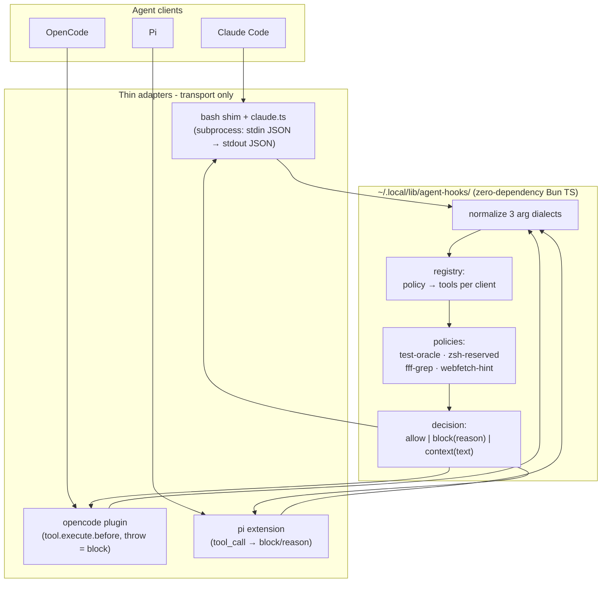
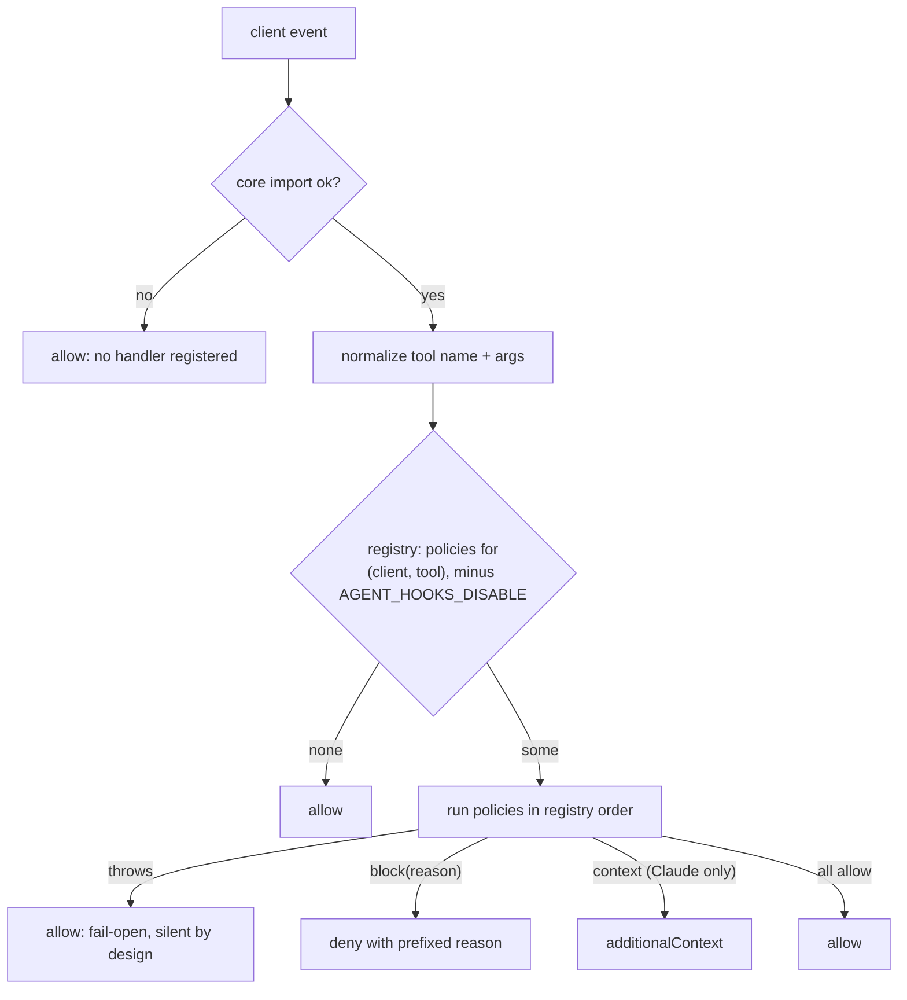
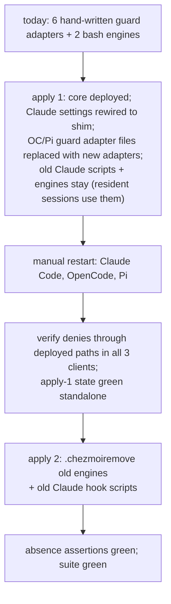

# Cross-Agent Hooks Core - Plan

## Goal Capsule

- **Objective:** A hook policy written once yields, in each of Claude Code, OpenCode, and Pi, either identical enforcement or a statically declared inapplicability — never a silent miss — and adding the next policy costs one core entry plus registry data, not three hand-written client hooks. Today's asymmetric enforcement (three Claude-only policies, one Pi-only feature) closes to that standard for the policies in scope. Named carve-outs: OpenCode subagent tool calls (platform bypass, Scope Boundaries) and agents-local on Claude Code (stays prose-instruction by design).
- **Means:** A lean zero-dependency Bun+TypeScript core deployed to `~/.local/lib/agent-hooks/`, with three thin transport adapters (KTD1, KTD3).
- **Authority:** Product behavior — the R-IDs below. Implementation mechanism — the KTDs. A unit overrides neither.
- **Stop conditions:** Stop and surface if a client's extension API cannot support a required adapter behavior (async `tool_call` handler in Pi, `experimental.chat.system.transform` semantics in OpenCode) after the empirical checks in U4–U6; do not ship a silently inert adapter. Stop if any retirement step would break a live client session (R5).
- **Execution profile:** `ce-work` on this repo; manual client restarts are part of verification (nothing restarts agent clients on `chezmoi apply`).

---

## Product Contract

### Summary

Build a small dispatch core plus three transport adapters so the five hook policies currently in use — `test-oracle-guard`, `zsh-reserved-name-guard`, `fff-grep-guard`, `webfetch-markdown-hint`, `agents-local` — run from one implementation across Claude Code, OpenCode, and Pi. The old OpenCode and Pi guard adapters are replaced in the first apply; the old Claude hook scripts and the bash engines retire in a second apply after a restart cycle (KTD9).

### Problem Frame

Every cross-client policy today is written up to three times by hand (bash for Claude, TS for OpenCode, TS for Pi), and policies added for one client never reach the others: `fff-grep-guard` and `webfetch-markdown-hint` guard only Claude, `agents-local` serves only Pi, and issue `2026-08-21-025` already queues a second hand-written copy instead of an extraction. The two guards that do span three clients (`test-oracle-guard`, `zsh-reserved-name-guard`) prove the shared-engine pattern works but still cost three adapters each, with already-divergent timeout budgets and arg-parsing dialects.

### Requirements

**Coverage and parity**

- R1. Each in-scope policy has exactly one implementation, in the shared core; per-client adapters perform transport only (event normalization delegated to the core, decision translation to the client's wire shape).
- R2. Scope is the policies in use today: `test-oracle-guard`, `zsh-reserved-name-guard`, `fff-grep-guard`, `webfetch-markdown-hint` (tool-call policies) and `agents-local` (system-prompt injection). No other events are normalized.
- R3. A blocking policy denies the same input with the same `<policy-name>:`-prefixed reason in every client where its target tool exists; where the tool or required outcome does not exist in a client, the registry declares the policy inapplicable there statically — never a silent runtime miss. The identical-deny guarantee is post-restart parity: a resident session enforces the core it loaded until restarted (KTD5).

**Safety**

- R4. Fail-open invariant: a missing runtime, missing core file, failed import, policy exception, or malformed event lets the tool call proceed. The bias is pinned by tests so a later edit cannot flip it.
- R5. Migration never leaves a running client wired to a filesystem path that may not exist. Concretely (per KTD9): Claude's old hook scripts and the shared bash engines retire only in the second apply, after a manual restart cycle; OpenCode's and Pi's old adapter files are replaced in the first apply, protected by the resident-module property a scratch-plugin check verifies first.
- R6. Deployment state and wiring state agree, and tests assert the agreement: the deployed core's presence, the Claude matcher set as the exact union of the registry's Claude tool names, and (post-retirement) the absence of every retired file.

**agents-local**

- R7. OpenCode receives local agent instructions (`AGENTS.local.md` / `CLAUDE.local.md`) through the same selection and safety logic Pi uses — one shared module for symlink resolution, project-escape rejection, and the size cap — and the injection is idempotent whatever `chat.system.transform`'s input semantics are.

**Operability**

- R8. A policy can be disabled per session via `AGENT_HOOKS_DISABLE`, read from the client process environment only — never from the intercepted tool call's arguments or command text, so an agent cannot disable a policy from within a call it is making. The selfcheck entry point reports runtime liveness, not registry introspection: runtime present, core importable, and a registry-derived known-bad canary dispatch for every block-capable (policy, client) route actually returning a block — failing if any expected block is absent. Selfcheck detects a fully dead path; an input-dependent policy exception still fails open undetected (accepted, Scope Boundaries). Selfcheck distinguishes the deployed core's identity from the identities running sessions loaded (per-session markers, KTD5), so cache skew after an apply is visible instead of a confident lie.
- R9. Every block reason carries the `<policy-name>:` prefix and states either the policy's escape-hatch token (`oracle:`, `zsh-ok:`) or a concrete alternative action. An agent that receives an unactionable deny retries blindly; this contract is structural (registry-driven test), so policy N+1 inherits it.

### Success Criteria

- Adding a hypothetical policy N+1 expressible in the existing normalized-event and three-outcome model (KTD2, KTD8) touches the core and its registry only; the union test fails if the Claude matcher was forgotten, no adapter file changes, and the parity and reason-contract tests cover the new policy without new test code (registry-driven). A policy needing a new event or outcome is an explicit contract decision, not covered by this promise.
- Adding a hypothetical fourth client within the same model is a new registry profile plus one adapter; no policy module is edited.
- `zsh-reserved-name-guard` denies the same fixture command in all three clients through the deployed artifacts, with the identical reason string.
- The asymmetric policies close observably: `fff-grep-guard` denies its fixture through the deployed artifacts in each of OpenCode and Pi whose tool identifier resolved, or the registry records evidence-backed inapplicability there — never an unresolved "unverified"; `agents-local` injects local instructions once in an OpenCode session.

### Scope Boundaries

- Out: herdr plugins and herdr's own event system; `brew-auto-update` (Pi-specific startup job); capability negotiation / `defineHook({requires})`-style machinery; session-cwd reporters (the channel is dead — issue `2026-09-03-003` — and blocks issues `2026-08-27-004`/`-005`); `pi-hooks` as a dependency; the Claude `SessionStart` entry for `herdr-agent-state.sh` (herdr-owned, unmanaged).
- Subagent enforcement is a per-client statement, not a single-client footnote. Results table (filled by U3/U5 manual checks; an observed bypass in Claude Code or Pi files a repository issue and is recorded here as an accepted known gap — recording alone does not close the item):
  - Claude Code: [unverified — U3]
  - OpenCode: known bypassed (`tool.execute.before` does not intercept task-tool subagent calls, anomalyco/opencode#5894; includes herdr-child panes); no workaround attempted.
  - Pi: [unverified — U5]
- Durable logging of caught policy exceptions is out of scope: the selfcheck canary (R8) detects a fully dead route only; an input-dependent policy exception fails open on real traffic with no detector — an explicitly accepted residual risk of the fail-open design (R4).

#### Deferred to Follow-Up Work

- Wiring or deleting `user-prompt-skill-eval.sh` (issue `2026-09-03-004`) — decided separately from this migration.
- Porting `agents-local` behavior to Claude Code (Claude reads local instructions via prose instruction today; no hook port planned).

### Outstanding Questions

- Deferred (non-blocking, resolved empirically during the owning unit): OpenCode's fff tool identifier (U4); Pi's fff tool name from `npm:@ff-labs/pi-fff` and Pi's handling of promise-returning `tool_call` handlers (U5); `experimental.chat.system.transform` input semantics and whether OpenCode natively reads `AGENTS.local.md` (U6).

---

## Planning Contract

### Key Technical Decisions

- KTD1. **Zero-dependency Bun+TS core at `home/dot_local/lib/agent-hooks/`** (deploys to `~/.local/lib/agent-hooks/`) (session-settled: user-directed — chosen over a full runtime with capability negotiation and over continuing per-client hand-written hooks: two of three clients load TS in-process natively, and the repo convention is dependency-free single-file TS with `node:*` builtins only — no `package.json`/`node_modules` machinery exists under `home/`). The `dot_local/lib` location matches the existing lib-vs-bin split, stays out of both plugin auto-discovery directories, and avoids the `executable_*` shellcheck trap in `make lint`. Layering invariant: client knowledge lives only in the registry's client profiles (KTD6); a policy module never references a client name — pinned by a static test in U1, which is what makes the policy-N+1 and fourth-client success criteria enforced rather than asserted. Governs R1, R2.
- KTD2. **Only events the in-scope policies use are normalized** (session-settled: user-directed — chosen over normalizing the union of all harness events: unused abstraction is the failure shape ADR-0001 deleted ~2000 lines for). Governs R2.
- KTD3. **The bash engines are absorbed into the core and retired via `.chezmoiremove`** — chosen over keeping them as subprocess callees: ADR-0001 names the cost ("two executors, one semantics; one fix applied twice"), and the engines' only consumers are the six adapters this plan replaces. The existing bashunit fixtures (`tests/bashunit/oracle_guard_test.sh`, `zsh_reserved_name_guard_test.sh`) are the port's behavioral oracle: they predate this change, so they were not authored to match the new code — they pin the shipped behavior the port must preserve, which is exactly the contract; the reason-contract test (R9) supplies the requirements-derived check on top. Reason strings keep the `<policy-name>:` prefix (R3); `fff-grep-guard` is the one policy whose reason *gains* its `fff-grep-guard:` prefix during the port — a deliberate R9-compliance delta from the shipped unprefixed string; its body text stays identical and the repointed `test_scripts_094` cases assert substring content, not byte equality. Never reuse a name already listed in `home/.chezmoiremove`.
- KTD4. **Claude entry point is a shellcheck-clean bash shim** at `home/private_dot_claude/hooks/` that does `command -v bun || exit 0` then `exec`s `bun ~/.local/lib/agent-hooks/claude.ts` — chosen over a `#!/usr/bin/env bun` executable: a bun shebang under an `executable_*` name turns `make lint` red (shellcheck SC1071), and the shim restores the missing-runtime fail-open that the current hooks have for `jq` (bun is absent at apply time on the macOS CI job); it also guards the core file's existence, since R4 names the missing-core-file path. The four current matchers are disjoint, so one hook fires per tool call today and consolidation trades one bash+jq spawn for one bash+bun spawn — the net latency effect is unverified and is what U3's cold-start measurement compares against the current figure, bounded by the settings `timeout`. The real benefits are one entry to wire, a union-testable matcher, and one dialect emitter. What Claude Code decides on hook timeout expiry (proceed vs. surface an error) is unverified — an Assumptions entry, checked in U3, because a timeout treated as an error would hole R4.
- KTD5. **TS adapters load the core with a module-scope top-level `await import()` in try/catch and register no handler on failure** — chosen over per-call dynamic import: Pi's handler synchronicity is unverified and a per-call `await` risks silent no-op blocks; a load-time failure is front-loaded, clean fail-open (R4). Relative imports cannot span the three deploy roots, so the import path is absolute (`$HOME/.local/lib/agent-hooks/`). Consequence — version skew: both in-process loaders resolve the core once per client process, so after any core change the Claude subprocess path is current on the next tool call while resident OpenCode and Pi sessions enforce the previously loaded core until restarted. R3's identical-deny guarantee is therefore post-restart parity; the manual-restart convention is the accepted mitigation for steady-state edits, not only for migration. Loaded-identity marker protocol (feeds R8): on successful import each in-process adapter writes a per-session marker file — pid-keyed, under a state dir such as `~/.local/state/agent-hooks/` — recording the deployed core's content hash at import time; the Claude subprocess writes none (always current by construction). Selfcheck applies a process-liveness filter to markers and reports: no live marker for a client → unknown; any live marker older than the deployed hash → at-least-one-stale, naming the sessions; it never reports "current" without marker evidence — multiple resident herdr panes are the normal case, not an edge case.
- KTD6. **Static registry of per-client profiles, enforced by a bidirectional union test.** Each client profile carries two fields: tool-name map (Claude `mcp__fff__grep` ≠ OpenCode's fff MCP id ≠ Pi's `@ff-labs/pi-fff` name) and supported outcomes — no field the code does not consume (arg-dialect normalization stays code in the core, not registry data; a stored dialect value nothing reads would be exactly the check-that-cannot-fail shape ADR-0001 rejects). Policy applicability is derived from tool presence plus outcome support — never hand-declared per client. The registry is exported through one documented machine-readable JSON entry point in the core (the same one selfcheck uses); the union test consumes that JSON and the rendered settings template with python3 (the `test_scripts_100` pattern in `tests/bashunit/scripts_test.sh`); parsing `registry.ts` textually from bash is rejected. The union test asserts the rendered Claude matcher alternatives equal the profile's tool-name union, both directions, and must fail rather than skip when bun is unavailable in the authoritative gate (`make test-ubuntu`, where bun is installed). Chosen over one broad matcher (a bun spawn on every tool call) and over an untested hand-maintained regex (the deployed-but-unwired drift shape of issue `2026-09-03-004`). The two compared sides are independent, so the test cannot pass vacuously. Governs R3, R6.
- KTD7. **The timeout budget is honestly scoped to the Claude subprocess only.** In-process adapters (OpenCode, Pi) get no fake timer: a `Promise.race` cannot interrupt a synchronous policy. Core policies must be pure, synchronous, and bounded by construction — stated as a core invariant; the Claude path keeps the settings-level `timeout` as the real kill.
- KTD8. **`webfetch-markdown-hint` is inapplicable outside Claude by derivation, not declaration** — its only outcome is `context` (`additionalContext`), and only Claude's profile supports that outcome (KTD6), so the registry derives inapplicability; it never reads as cross-client coverage it does not have (R3). The decision model stays three outcomes: `allow`, `block(reason)`, `context(text)`. Cross-client parity is asserted on the decision object — verdict plus exact reason string — via a registry-driven test that iterates every policy applicable in more than one client, so policy N+1 inherits parity coverage.
- KTD9. **Two-apply migration with per-client staging** (session-settled: user-approved — proposed after flow analysis; chosen over retiring everything in one apply: a running Claude session holds the old matchers in memory, and deleting its hook scripts makes every tool call error with exit 127 until restart). Staging is Claude-specific because only Claude separates deployment from wiring (settings.json); for OpenCode and Pi the plugin directories are auto-discovery, so deployment *is* wiring — "deployed-but-unwired" does not exist there. Apply 1: deploy the core, rewire Claude settings to the new shim, replace the OpenCode/Pi guard adapter files with the new adapters (resident sessions keep the old code in memory and the still-present engines, so nothing breaks; a restart switches a session to the new adapter atomically — no double dispatch in either state). Old Claude hook scripts and the bash engines stay deployed through apply 1 because pre-restart sessions still invoke them. Apply 2, after a restart cycle and deployed-path verification: retire the old Claude scripts and the engines with absence assertions. The apply-1 state must be fully green standalone — the window may last days. Governs R5.
- KTD10. **No `pi-hooks` dependency** (session-settled: user-approved — chosen over adopting hsingjui/pi-hooks: 4 commits, 1 maintainer, and it would make Claude's hook format canonical, which was rejected).
- KTD11. **`agents-local` ports to OpenCode via `experimental.chat.system.transform` with a heading-idempotence guard** — the append checks for the `## Local Private Project Instructions` heading already emitted by `formatLocalInstructions`, which is correct whether the hook receives the original or the accumulated system array. The selection logic (`inspectLocalInstructions` and friends) moves to a shared module under the core lib; Pi and OpenCode both import it — the symlink-escape check is never duplicated (R7). The `experimental.` prefix is an accepted upgrade-fragility risk. `ctx.ui.notify` warnings have no OpenCode equivalent and are dropped. Boundary: `local-instructions` shares the lib root with the dispatch core for deployment reasons only — no import edge exists in either direction, and KTD7's pure-and-synchronous invariant governs policy modules, not this module (it is async and touches the filesystem by design); the absence of the import edge is pinned by a test in U6.

### High-Level Technical Design

Component topology — one core, three transports:

Dispatch flow — first deny wins, every failure path falls open:

Migration — two applies, restarts between:

### Assumptions

Unconfirmed bets recorded because scoping confirmation was skipped; each is verified inside its owning unit before the dependent code ships:

- OpenCode does not natively read `AGENTS.local.md` (if it does, U6 shrinks to `CLAUDE.local.md` handling or is dropped and issue `2026-08-21-025` closes as obsolete).
- Pi accepts a promise-returning `tool_call` handler (if not, the Pi adapter must resolve the core import before registration synchronously — KTD5's load-time import already makes the per-call path synchronous, so only registration timing moves).
- The OpenCode and Pi fff tool identifiers are discoverable empirically; until verified, the registry entries for them are marked unverified and the policy is inapplicable there (R3's no-silent-miss rule).
- The existing OpenCode/Pi guard adapters' 3000 ms subprocess timeout has no in-process replacement need (KTD7); no current policy does I/O beyond the already-synchronous checks.
- Claude Code treats `PreToolUse` hook timeout expiry as proceed, not as a user-facing error (verified in U3; if wrong, R4 has a hole and the shim needs its own inner budget).
- OpenCode's and Pi's loaders execute a runtime absolute dynamic `import()` reaching outside the plugin directory, and honor the adapter's import shape — OpenCode inside its async plugin factory (the repo's existing verified plugin shape), Pi via module-scope top-level `await` or an awaited async default export (verified with a throwaway scratch plugin as the first step of U4 and U5, before any adapter code; if a loader rejects it, the shared-core layout needs redesign and the unit stops per the Goal Capsule).
- Removing an OpenCode plugin or Pi extension file does not affect a session that already loaded it — the module stays resident until restart (verified in U4 with a scratch plugin in a disposable session — load, delete the file, confirm the session keeps working — before apply 1 touches the real guard plugins; KTD9's apply-1 replacement depends on it).

### Sources

- Verified client contracts: OpenCode `packages/plugin/src/index.ts` (tool.execute.before mutates `output.args`; throw blocks; subagent bypass anomalyco/opencode#5894); Pi `packages/coding-agent/src/core/extensions/types.ts` (`ToolCallEventResult.block`, mutable `event.input`); Claude Code hooks reference (stdin JSON, exit codes, `hookSpecificOutput`).
- Repo precedent: `home/private_dot_config/herdr/plugins/worktree-setup/setup.ts` (bun-invoked TS), `home/dot_pi/agent/extensions/agents-local.ts` (typed + bun-tested extension shape), `tests/pi-agents-local-extension.test.ts` (fake-client harness pattern), `docs/decisions/0001-se-pipeline-architecture-redirection.md` (rejected abstraction shapes), `docs/solutions/design-patterns/gate-bias-follows-blast-radius.md`, `docs/solutions/design-patterns/external-review-legs-as-unreliable-subprocesses.md`, `docs/solutions/design-patterns/idle-machine-wall-clock-bounds-are-latent-flakes.md`.

---

## Implementation Units

### U1. Core module: types, registry, normalization, dispatch

- **Goal:** The dispatch core exists at `home/dot_local/lib/agent-hooks/` with the three-outcome decision type, the static per-client registry, normalization of the three arg dialects, first-deny-wins dispatch, `AGENT_HOOKS_DISABLE`, and a selfcheck entry point.
- **Requirements:** R1, R2, R4, R8. KTD1, KTD2, KTD6, KTD7.
- **Dependencies:** none.
- **Files:** `home/dot_local/lib/agent-hooks/` (new: `index.ts`, `registry.ts`, `normalize.ts`, `selfcheck.ts` — names directional), `tests/agent-hooks-core.test.ts` (new), `Makefile` (new `bun test` target).
- **Approach:**
  1. Define the decision type (`allow` / `block` with prefixed reason / `context`) and the normalized event (client, tool, file path, content, command, query, url).
  2. Registry = per-client profiles per KTD6: tool-name map and supported outcomes; applicability derived, exported through one JSON entry point shared with selfcheck.
  3. Normalize the three dialects in the core, aggregating full-content and edit fields alike (the current adapters do — omitting `content` would let Write calls bypass the guards): Claude `tool_input.content` / `file_path` / `new_string` / `edits[].new_string`, OpenCode `content` / `filePath`|`file_path` / `newString`, Pi `content` / `path` / `edits[].newText`; command/query/url fields; tool-name casing per client.
  4. Dispatch runs the applicable policies for (client, tool) in declaration order; a thrown policy error is caught and treated as allow (R4); `AGENT_HOOKS_DISABLE` is a comma-separated policy-name skip list read from the process environment only (R8).
  5. `selfcheck.ts` per R8: runtime liveness via a registry-derived known-bad canary for every block-capable (policy, client) route, deployed-vs-loaded identity from the per-session markers (KTD5), human-readable default plus `--json` (consumed by the union test and the post-apply liveness case). The blocking-canary assertion becomes meaningful only once U2's policies exist — its verification scenario lives in U2.
  6. One exported fixture module is the single home for the shared known-bad/known-good corpus; the core suite and both adapter suites import it — no per-suite copies.
- **Patterns to follow:** dependency-free `node:*`-only TS (`worktree-setup/setup.ts`); testable-export shape with env-var-overridable import path (`tests/pi-agents-local-extension.test.ts`); `Makefile:34-35` per-test-file target convention.
- **Test scenarios:**
  - Each dialect's fixture event normalizes to the same canonical event (three inputs, one expected output, per tool kind) — including a Write-shaped fixture whose text arrives only in `content`, proving full-file writes reach the policies.
  - Dispatch returns the first deny and stops running later policies (ordering fixture with two denying policies).
  - A policy that throws yields allow, and the mutation test proves the bias pin: inverting the catch to deny fails the test (fail-open pinned, per `gate-bias-follows-blast-radius`).
  - `AGENT_HOOKS_DISABLE=policy-name` skips exactly that policy; an unknown name is ignored; the same assignment appearing inside the intercepted tool call's command text does not disable anything (self-disable negative test, R8).
  - A (client, tool) pair with no applicable policy returns allow without invoking any policy; a `context`-only policy is derived inapplicable for a profile without `context` support (KTD8).
  - Decision-object parity: every registry entry applicable in more than one client yields the identical verdict and reason string for the shared fixture across all applicable dialects (registry-driven iteration, no per-policy test code).
  - Reason contract (R9), both branches: every block-capable policy's reason is prefixed and non-trivial past the prefix, and contains its escape-hatch token where one is defined or a concrete alternative action where none is — with at least one fixture for a policy that has no escape hatch.
  - Layering: a static assertion over policy modules proves none references a client name (KTD1).
  - Selfcheck marker semantics (KTD5): no live marker → unknown; a live pid-keyed marker with a hash older than the deployed core → at-least-one-stale naming that session; a dead process's marker is ignored; never "current" without marker evidence.
- **Verification:** the new `make` target runs the core suite green from the repo checkout; `make lint` stays green (no `executable_*` TS names).

### U2. Port the four tool-call policies into the core

- **Goal:** `test-oracle-guard`, `zsh-reserved-name-guard`, `fff-grep-guard`, and `webfetch-markdown-hint` live as core policies with behavior equal to the shipped implementations.
- **Requirements:** R1, R2, R3. KTD3, KTD8.
- **Dependencies:** U1.
- **Files:** `home/dot_local/lib/agent-hooks/` (policy modules), `tests/agent-hooks-core.test.ts` (calibration cases), sources read: `home/dot_local/bin/executable_test-oracle-guard`, `home/dot_local/bin/executable_zsh-reserved-name-guard`, `home/private_dot_claude/hooks/executable_fff-grep-guard.sh`, `home/private_dot_claude/hooks/executable_webfetch-markdown-hint.sh`.
- **Approach:**
  1. Port each bash policy's logic; keep the engines' `<policy-name>:` reason prefixes and the `oracle:` / `zsh-ok:` escape-hatch semantics byte-compatible (R3); `fff-grep-guard`'s reason gains its prefix as the deliberate delta KTD3 records, body text unchanged.
  2. Translate every fixture from `tests/bashunit/oracle_guard_test.sh` and `zsh_reserved_name_guard_test.sh` into core test cases before rewriting logic — red/green calibration against the pre-existing corpus (KTD3).
  3. `fff-grep-guard`: ≥2 whitespace-separated tokens containing neither `/` nor `*` → deny with the existing reason text. `webfetch-markdown-hint`: URL not containing `markdown.new` → `context` outcome; registry marks it Claude-only (KTD8).
- **Execution note:** port with the calibration corpus as failing tests first; the corpus is the oracle because it predates this change.
- **Test scenarios:**
  - Every existing bashunit fixture case for both guards passes against the TS policy (deny fixtures deny with the same prefixed reason; the paired valid controls stay allowed).
  - `oracle:`-annotated content and `zsh-ok:` escapes are honored exactly as before.
  - `fff-grep-guard`: multi-token bare query denied; single identifier, path-scoped, and glob queries allowed; malformed input allows (fail-open).
  - `webfetch-markdown-hint`: non-markdown.new URL yields `context` and never a deny; markdown.new URL yields plain allow; on a client where the registry marks it inapplicable, the policy never runs.
  - Selfcheck's blocking canary (deferred from U1): with the ported policies registered, the registry-derived canary returns a block for every block-capable (policy, client) route, and reports a failure when one route's expected block is absent (fixture with a deliberately broken route).
- **Verification:** core suite green including the full ported corpus; a spot diff of reason strings against the bash engines' output for three representative fixtures.

### U3. Claude adapter: shim, dispatcher, matcher union, anti-vacuity tests

- **Goal:** One Claude hook entry serves all four tool-call policies through the deployed core, and tests make silent total policy loss impossible.
- **Requirements:** R1, R3, R4, R6. KTD4, KTD5, KTD6.
- **Dependencies:** U1, U2.
- **Files:** `home/private_dot_claude/hooks/agent-hooks-dispatch.sh` (new shim; not `executable_*`-prefixed TS), `home/dot_local/lib/agent-hooks/claude.ts` (new), `home/private_dot_claude/private_settings.json.tmpl`, `tests/bashunit/scripts_test.sh` (`test_scripts_100`, the union test, and repointing `test_scripts_094`–`099` at the shim — those cases invoke the old fff/webfetch hook sources U7 deletes), `tests/bashunit/smoke_test.sh` (manifest + deployed-path run + selfcheck liveness case).
- **Approach:**
  1. Shim: `command -v bun >/dev/null 2>&1 || exit 0`, then `[ -f "$HOME/.local/lib/agent-hooks/claude.ts" ] || exit 0`, then `exec bun` on that path (KTD4); wired as `bash '<path>'` so the existing command shape and `timeout` stay.
  2. `claude.ts` reads stdin JSON, dispatches, and emits `permissionDecision: "deny"` or `additionalContext` per the current hooks' exact JSON shape; exit 0 on allow and on any internal failure (R4).
  3. Consolidate the four `PreToolUse` matchers into entries invoking the one shim; matcher regex alternatives = registry's Claude tool-name union (KTD6).
  4. Union test in `tests/bashunit/scripts_test.sh` (the `test_scripts_100` render-and-python3 pattern): compare matcher alternatives against the registry's JSON entry point, both directions; in `make test-ubuntu` it fails, never skips, when bun is missing (KTD6).
  5. Anti-vacuity: add the deployed core paths to the smoke manifest; add a smoke case running the core bun suite against the deployed `$HOME` path (the `smoke_test.sh:869-875` pattern); add a post-apply selfcheck liveness case (canary dispatch against the deployed core, R8); add one end-to-end deny piping a known-bad fixture through the deployed shim.
  6. Verify the Claude timeout-expiry assumption (hook exceeding `timeout` proceeds rather than erroring) and record the observed cold-start figure in the implementing PR as a latency baseline.
  7. Manual verification item: a Claude subagent attempting the known-bad fixture — record deny vs. allow in the Scope Boundaries results table; a bypass files a repository issue.
- **Test scenarios:**
  - Template render wires every registry Claude tool to the shim and nothing else (bidirectional union; fails when a tool is added to only one side).
  - Deployed shim denies the known-bad `zsh-reserved-name-guard` fixture with the prefixed reason (end-to-end, real bun, real deployed file).
  - Shim with bun absent from `PATH` exits 0, and with bun present but the deployed core file absent exits 0 silently (fail-open, R4 — no per-call error noise in a degraded state).
  - `webfetch-markdown-hint` through the dispatcher emits `additionalContext` and never `permissionDecision` (preserves the pinned `test_scripts_098/099` behavior).
- **Verification:** `make test-templates` green; `make test-ubuntu` green — it owns the union test's fail-not-skip assertion (applies the checkout, bun installed); `make lint` green.

### U4. OpenCode adapter plugin

- **Goal:** One OpenCode plugin enforces all applicable tool-call policies via the core, with the client's real fff tool identifier verified, and OpenCode plugin code gets its first test coverage.
- **Requirements:** R1, R3, R4. KTD5, KTD6.
- **Dependencies:** U1, U2.
- **Files:** `home/private_dot_config/opencode/plugins/agent-hooks.ts` (new), `home/.chezmoiremove` (old OpenCode guard plugin pair), `tests/agent-hooks-opencode-adapter.test.ts` (new), `tests/bashunit/smoke_test.sh` (deployed-path case), `Makefile`.
- **Approach:**
  1. Module-scope `await import()` of the deployed core in try/catch; on failure export a plugin registering no handlers (KTD5).
  2. `tool.execute.before` handler: normalize via core, deny by `throw new Error(prefixedReason)`, allow by return; keep the fail-open catch shape of the current plugins.
  3. First step, before any adapter code: scratch-plugin checks for the two loader assumptions (absolute external import inside the async plugin factory; resident-module-after-delete in a disposable session).
  4. Verify OpenCode's actual fff tool id empirically (run OpenCode against the configured `fff` MCP server and observe the tool name). This unit's verification does not close green on "unverified": the outcome is either a confirmed identifier in the registry or recorded evidence the tool is absent there; an identifier still unresolved when the unit closes files a repository issue naming it (R3's no-silent-miss rule — "unverified" is not a terminal state).
  5. Per KTD9, this unit also deletes the two old OpenCode guard plugin files in the same apply (`.chezmoiremove` entries + source deletion); a restarted session loads only the new adapter.
  6. Bun test with a hand-rolled fake plugin host (the `fakePi()` pattern) covering the handler contract — first coverage for any OpenCode plugin in this repo.
- **Test scenarios:**
  - Known-bad edit fixture → handler throws with the prefixed reason; valid control fixture → no throw.
  - Core import failure → plugin exports no `tool.execute.before` handler (fail-open by absence).
  - OpenCode arg dialect (`filePath`, `newString`) reaches the same policy verdicts as the Claude dialect for the shared fixtures.
- **Verification:** new bun suite green from checkout and against the deployed plugin path in the smoke case; manual: restart OpenCode, attempt a `status=$?` bash command, observe the deny.

### U5. Pi adapter extension

- **Goal:** One Pi extension replaces the two guard extensions, enforcing all applicable policies via the core, with Pi's promise handling and fff tool name verified.
- **Requirements:** R1, R3, R4. KTD5, KTD6.
- **Dependencies:** U1, U2.
- **Files:** `home/dot_pi/agent/extensions/agent-hooks.ts` (new), `home/.chezmoiremove` (old Pi guard extension pair), `tests/agent-hooks-pi-adapter.test.ts` (new), `tests/bashunit/smoke_test.sh`, `Makefile`.
- **Approach:**
  1. Same load-time import shape as U4; register `pi.on("tool_call", ...)` only on successful import.
  2. First step, before any adapter code: scratch-extension check that Pi's loader honors module-scope top-level `await` (or an awaited async default export) and the absolute external import (Assumptions).
  3. Handler returns `{ block: true, reason }` on deny; verify empirically that Pi awaits a promise-returning handler — if it does not, registration stays but the handler body must be synchronous after the load-time import (KTD5 already makes it so).
  4. Verify Pi's fff tool name from `npm:@ff-labs/pi-fff`. Same closure rule as U4: confirmed identifier or evidence of absence; an unresolved identifier at unit close files a repository issue — "unverified" is not a terminal state (R3).
  5. Per KTD9, delete the two old Pi guard extensions in the same apply.
  6. Manual verification item: a Pi subagent attempting the known-bad fixture — record deny vs. allow in the Scope Boundaries results table; a bypass files a repository issue.
- **Test scenarios:**
  - Known-bad `bash` fixture (`status=$?`) → `{block: true}` with prefixed reason; valid control → undefined/allow.
  - Pi arg dialect (`path`, `edits[].newText`) reaches the same verdicts as the other dialects for shared fixtures.
  - Import failure → `pi.on` never called (asserted via the fake host).
- **Verification:** new bun suite green from checkout and deployed path; manual: restart Pi, attempt the fixture command, observe the deny.

### U6. agents-local port to OpenCode with shared selection module

- **Goal:** OpenCode injects local agent instructions with Pi's exact selection and safety logic, idempotently; issue `2026-08-21-025` is satisfied for OpenCode.
- **Requirements:** R7. KTD11.
- **Dependencies:** U1 (lib location only; not the tool-call dispatch).
- **Files:** `home/dot_local/lib/agent-hooks/local-instructions.ts` (moved logic), `home/dot_pi/agent/extensions/agents-local.ts` (imports shared module), `home/private_dot_config/opencode/plugins/agents-local.ts` (new), `tests/pi-agents-local-extension.test.ts` (path plumbing update), `tests/agent-hooks-opencode-adapter.test.ts` or a dedicated suite.
- **Approach:**
  1. First verify: does current OpenCode natively read `AGENTS.local.md`? If yes, shrink or drop per Assumptions and update issue `2026-08-21-025` instead of porting.
  2. Move `inspectLocalInstructions` / `formatLocalInstructions` / constants into the shared module; Pi extension becomes a thin consumer (its bun test keeps passing through the updated import path and `PI_AGENTS_LOCAL_EXTENSION_PATH` plumbing).
  3. OpenCode plugin uses `experimental.chat.system.transform`, appends only when the `## Local Private Project Instructions` heading is absent from the system array (KTD11); cwd from `PluginInput.directory`.
  4. Verify transform input semantics empirically; the heading guard makes both semantics safe, but record the observed behavior in the plan's implementing PR.
- **Test scenarios:**
  - Same fixture tree yields byte-identical formatted instruction blocks from Pi and OpenCode consumers (shared-module parity).
  - Symlink escaping the project root is rejected; over-cap file is rejected with the same behavior Pi has today (existing Pi test cases keep passing unmodified in meaning).
  - Transform called twice with an already-injected system array appends nothing (idempotence).
  - Transform with no local instruction files present leaves the system array untouched.
  - No import edge exists between `local-instructions` and the dispatch core in either direction (static assertion, KTD11 boundary).
- **Verification:** `make test-pi-agents-local` green with the moved module; new OpenCode suite green; manual: OpenCode session in a repo with `AGENTS.local.md` shows the instructions once.

### U7. Retirement apply: remove old Claude scripts and engines, assert absence

- **Goal:** The bash engines and old Claude guard/hint hook scripts are retired (the OpenCode/Pi guard adapters were already replaced in U4/U5 per KTD9), with tests asserting absence and no stale test or issue debt left.
- **Requirements:** R5, R6. KTD3, KTD9.
- **Dependencies:** U3, U4, U5 verified through deployed paths and a restart cycle (KTD9); the apply-1 state was green standalone.
- **Files:** `home/.chezmoiremove` (entries for `~/.local/bin/test-oracle-guard`, `~/.local/bin/zsh-reserved-name-guard`, the four old Claude guard/hint hook scripts), source deletions under `home/`, `tests/bashunit/oracle_guard_test.sh` + `zsh_reserved_name_guard_test.sh` (retired — corpus lives in the core suite since U2), `tests/bashunit/smoke_test.sh` (absence assertions for every retired path from U4, U5, and this unit — `test_smoke_1053` pattern, with special weight on `~/.config/opencode/plugins/` where a leftover `.ts` is a live plugin), `tests/test_post_apply_suite_contract.py` ordering impact, `docs/issues/2026-09-02-011-test-oracle-guard-misses-positive-tautological-tests.md` (re-point).
- **Approach:**
  1. Land as a separate commit/apply after the restart-and-verify cycle; the invariant is R5's "never wired to a path that may not exist".
  2. Retire the two bashunit engine suites in the same change that retires the engines — their oracle (the engine binary) is gone, and the corpus already moved in U2; update the post-apply ordering contract.
  3. Resolve the `oracle:` prefix-pin comment fate: the OpenCode `startsWith` consumer died with the old plugin, so the prefix's consumer becomes the cross-client parity and reason contract (R3, R9) — rewrite the comment where the corpus now lives, naming the real consumer.
  4. Re-point issue `2026-09-02-011` (its subject moves from the deleted engine path to the core policy module) in the same apply that deletes the path it names.
- **Test expectation:** covered by the absence assertions and the surviving core/adapter suites; no new behavior.
- **Verification:** `make test-ubuntu` green end-to-end (apply + suite in disposable `$HOME`); `python3 scripts/issues` updates: `2026-08-21-025` satisfied by U6, `2026-09-02-011` re-pointed.

---

## Verification Contract

| Gate | Command | Proves |
|---|---|---|
| Core and adapter logic | `bun test tests/agent-hooks-*.test.ts` (per-file `make` targets) | policy behavior, calibration corpus, fail-open pins |
| Template wiring | `make test-templates` | settings render |
| Lint | `make lint` | shellcheck on shims; no `executable_*` TS regression |
| Applied deployment | `make test-ubuntu` | the change applied from this checkout works end-to-end, including the matcher↔registry union test, which fails rather than skips there (KTD6; the only gate that proves an unapplied `home/` edit) |
| Host post-apply | `make test-suite` | deployed `~` state after the user applies |

Any test that lets chezmoi address `$HOME` stays behind `MMS_DISPOSABLE_HOME=1` (ADR-0002). Manual step per apply: restart Claude Code, OpenCode, and Pi before judging deployed behavior — nothing restarts clients automatically.

---

## Definition of Done

- The four tool-call policies dispatch through the core in every client where the registry derives them applicable; `agents-local` consumes the shared `local-instructions` module in both its Pi and OpenCode adapters (KTD11). The selfcheck liveness case is green in the post-apply suite (R8).
- The empirical checks passed: OpenCode transform semantics and native-read question (U6), Pi loader and promise handling (U5), loader import shape (U4/U5), Claude timeout-expiry semantics (U3); the fff registry entries for OpenCode and Pi are resolved to a verified identifier or evidence of absence — never left "unverified" (a leftover unresolved identifier has a filed repository issue).
- The two-apply migration completed: the apply-1 state was fully green standalone, verified through deployed paths in all three restarted clients before apply 2 landed; all absence assertions green.
- The per-client subagent-enforcement statement in Scope Boundaries is filled in with observed results for all three clients.
- All Verification Contract gates green, including `make test-ubuntu`.
- Issues updated: `2026-08-21-025` resolved by U6, `2026-09-02-011` re-pointed by U7; no new deployed-but-unwired or wired-but-undeployed state exists (R6).
- No abandoned-attempt code remains; retired bash engines, adapters, and their orphaned tests are gone, not commented out.
