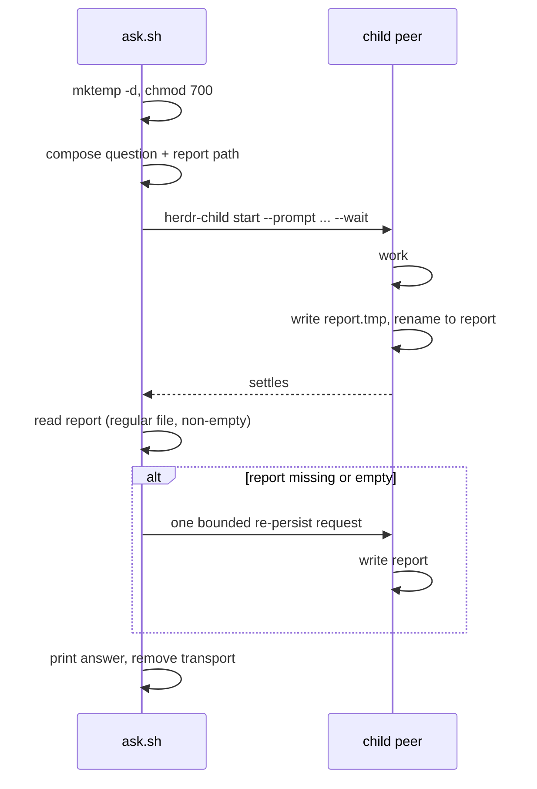

# Ask-in-Herdr Report File - Plan

## Goal Capsule

- **Objective:** Someone who asks a peer agent for a review or an answer receives it whole — not cut off at 200 lines, not silently replaced by an empty result, and still readable after the peer's pane is gone.
- **Means:** The peer writes its answer to a file the caller created and owns (KTD1).
- **Authority:** Requirements govern behavior. KTDs govern mechanism inside those requirements. Units override neither.
- **Stop conditions:** Stop and ask if a read-only child cannot write the transport file through its shell — that is the default consult path and the whole feature rests on it. Stop if the caller cannot both clean up its transport and leave it intact for a child that is still working.
- **Execution profile:** Sequential, three units, one script plus its docs and tests.
- **Tail ownership:** This plan ends when `ask.sh` returns file-backed answers. It changes no protocol and touches no library.

---

## Product Contract

### Summary

Give `ask.sh` a caller-owned report transport. The script creates a private directory, names the report path inside the question it sends, and reads the answer from that file. The 200-line pane scrape becomes a diagnostic on failure paths only.

The transport is modelled on `home/private_dot_claude/shared/herdr-peer-launch.md`, which already does this for the `se-*` peer legs and is the only file-backed answer path in the repository that works today.

### Problem Frame

`home/private_dot_agents/skills/ask-in-herdr/scripts/executable_ask.sh:115` reads the peer's answer with `herdr agent read --source visible --lines 200`. Anything longer is cut. Wrapped lines and alternate-screen content are lost. The transcript dies with the pane, so an answer that was produced but not yet read is unrecoverable.

An earlier version of this plan moved all four inter-agent message bodies — task, ask, reply, report — onto the child's generation-scoped run directory. Review found that directory is deleted by the watcher at the moment a marker is delivered, that attached children have no generation at all, and that the ordering `ask.sh` needs is impossible there: it composes its question at line 72 and starts the child at line 86, so no generation exists when the report path must be named. The report direction needs none of that machinery. This plan keeps only the report direction and drops the rest.

### Key Decisions

- **The caller owns the transport; the child only writes into it.** (session-settled: user-directed — chosen over the child's generation-scoped run directory: the run directory is destroyed on marker delivery, does not exist for attached children, and cannot be named before the question is composed.) Governs R1, R5.

### Requirements

**Answer integrity**

- R1. A peer's answer reaches the caller whole, with no truncation or loss from terminal capture.
- R2. An answer stays readable after the peer's pane closes, until the caller removes its own transport.
- R3. A report that is absent, empty, or not a regular file is a typed failure with its own status. None of them is reported as an empty answer, and none as a timeout.
- R4. The transport never sits inside the repository, a worktree, or any child's working directory.

**Transport mechanics**

- R5. The caller creates the transport directory before it composes the question, so the question can name the report path.
- R6. The report-writing instruction directs the child to write through its shell, because the default consult posture removes the child's file-writing tools.
- R7. A report appears at its final path only when complete. The caller never reads a partially written file.

**Lifetime**

- R8. The caller removes its transport only when no child can still write to it. When the script returns while the child is still working, it retains the transport and reports its path.
- R9. A settled child that wrote no report gets exactly one bounded request to persist its answer before the failure status is returned.

### Scope Boundaries

- `home/private_dot_agents/skills/ask-in-herdr/scripts/executable_ask.sh`, its `SKILL.md`, and the tests that own them.

**Deferred to Follow-Up Work**

- Ask and reply bodies as files, marker versioning, and the run-directory lifetime change they require. Review found six blocking problems in that direction; they are recorded in a repository issue rather than carried here.
- The `wait-any` fan-out utility and model-tier configuration. Both were bundled into the earlier draft and neither serves this plan's Objective.
- `docs/issues/2026-09-03-003` — cold opencode and pi launches stall. It affects the first consult of a session regardless of this plan.

**Outside this plan's identity**

- Any change to `herdr-child`, its libraries, or the child-agent contract. This plan is one script.
- Converging the two child-launch stacks.

### Sources

- `home/private_dot_claude/shared/herdr-peer-launch.md` — the working transport this plan copies: `PEER_REPORT_DIR` created before the prompts, `[peer-report-transport]` naming an explicit shell write-and-rename, `recover_peer_report` for one bounded retry, and the rule that a pane read is diagnostic only.
- `home/dot_local/lib/herdr-child-launch.sh:281` — the read-only posture strips `Edit Write NotebookEdit` from a claude child; `:156` denies `edit` for opencode. Both keep the shell.
- `home/private_dot_agents/skills/ask-in-herdr/scripts/executable_ask.sh:28,60` — `RW=0` and `posture=ro` are the defaults, so the stripped-tools path is the ordinary one.
- `docs/issues/2026-08-15-007` — a question file removed by its writer's `EXIT` trap while the reader was still starting produced a fake 30-minute timeout in zero seconds.
- `tests/bashunit/smoke_test.sh:835` — asserts the literal reap-hint string this plan's output changes.

---

## Planning Contract

### Key Technical Decisions

- KTD1. **Transport under `TMPDIR`, created by `ask.sh` before the question is composed.** `mktemp -d` plus `chmod 700`, matching `PEER_REPORT_DIR`. This is what makes the ordering work at all, and it keeps the transport out of every repository and worktree. Governs R4, R5.
- KTD2. **The atomic rename is the completeness witness.** The child writes `<path>.tmp` and renames it. A file present at the final path is complete by construction, so no digest, byte count, or separate completion record is needed. Governs R7.
- KTD3. **The transport instruction names shell commands, not a write tool.** A read-only claude child has no `Write`, and a read-only opencode child has `edit` denied; both keep the shell for the callback channel. The instruction mirrors `[peer-report-transport]` wording. Governs R6.
- KTD4. **An empty report is a failure, not an empty answer.** The Objective names a silently empty result as the thing to prevent, so zero bytes at the final path reports its own status rather than returning success. Governs R3.
- KTD5. **The transport outlives the script when the child is still working.** On the `working` outcome the script prints the transport path and removes nothing. Removing it there reproduces `docs/issues/2026-08-15-007` exactly. Governs R8.
- KTD6. **The reader rejects anything that is not a regular file.** The child can write into the transport, so it can leave a symlink at the report path. The check is a coherence guard against a misbehaving child, not a containment boundary — a same-user child is not contained by it. Governs R3.

### High-Level Technical Design

### Assumptions

- A read-only child can write a file through its shell. The posture branches keep the shell deliberately, and `herdr-peer-launch.md` relies on the same thing for its claude peer — but that peer runs with permission bypass, so the read-only case is unproven and U1 verifies it first.
- `mktemp -d` under `TMPDIR` is outside every repository and worktree on this machine.
- The child obeys a written instruction to use tmp-plus-rename. When it does not, the file simply never appears and R3's typed failure covers it.

### Sequencing

U1 establishes the transport and proves the read-only write works. U2 replaces the read path and its outcomes. U3 updates the documentation and the tests that assert on this script's literal output.

---

## Implementation Units

### U1. Caller-owned transport and the write instruction

**Goal:** `ask.sh` creates a private transport before composing its question, and a read-only child writes its answer there.

**Requirements:** R4, R5, R6, R7. Implements KTD1, KTD2, KTD3.

**Dependencies:** none.

**Files:**
- `home/private_dot_agents/skills/ask-in-herdr/scripts/executable_ask.sh`
- `tests/bashunit/scripts_test.sh`

**Approach:**
1. Create the transport with `mktemp -d` and `chmod 700` before the question file is composed, so the report path exists in time to be named in the question.
2. Append a transport instruction to the question that names the absolute report path and directs an explicit shell write to `<path>.tmp` followed by a rename. Mirror the `[peer-report-transport]` wording rather than inventing new phrasing.
3. Leave the existing `--wait` start call and its arguments unchanged.

**Execution note:** Before writing the instruction wording, run one read-only claude child and one read-only opencode child that write a file through the shell. The Assumptions record this as unproven, and every later unit depends on it.

**Patterns to follow:** `PEER_REPORT_DIR` creation and the `[peer-report-transport]` block in `home/private_dot_claude/shared/herdr-peer-launch.md`.

**Test scenarios:**
- A read-only claude child asked for an answer writes a non-empty file at the report path.
- A read-only opencode child does the same.
- The transport directory is created with mode 700 and sits outside the repository checkout.
- The question sent to the child contains the absolute report path.
- The report path is named in the question even when the caller passes `--cwd` inside a worktree.

**Verification:** Both default-posture kinds produce a file-backed answer, and the transport is outside any checkout.

### U2. Read the answer from the file, with typed outcomes

**Goal:** The answer comes from the transport file, and every way that can fail has its own status.

**Requirements:** R1, R2, R3, R8, R9. Implements KTD4, KTD5, KTD6.

**Dependencies:** U1.

**Files:**
- `home/private_dot_agents/skills/ask-in-herdr/scripts/executable_ask.sh`
- `tests/bashunit/scripts_test.sh`

**Approach:**
1. Read the answer from the report path. Require a regular file; reject a symlink or any non-regular object.
2. Send one bounded re-persist request when a settled child left no usable report, then re-read once before giving up.
3. Extend the script's status vocabulary rather than folding new failures into `undelivered`: a missing report after recovery, an empty report, and a non-regular report each get their own status and exit code, and none reuses the timeout code.
4. Demote `herdr agent read` to a diagnostic printed on failure statuses only, never as the answer.
5. Remove the transport on every path where the child cannot still write to it. On the `working` outcome, print the transport path and remove nothing.
6. Keep `answered`, `blocked`, `working`, `undelivered` and `refused` on their current exit codes.

**Execution note:** Add the failing test for the empty-report status before changing the read path — today an empty scrape and an empty answer are indistinguishable, and that is the behavior this unit must make impossible.

**Test scenarios:**
- An answer longer than 200 lines returns complete, byte-for-byte identical to the file the child wrote.
- An answer is still returned when the child's pane was closed before the read.
- A settled child that wrote nothing triggers exactly one re-persist request; when that produces a report, the answer is returned normally.
- A settled child that still wrote nothing after the re-persist request returns the missing-report status, not `undelivered` and not `working`.
- A zero-byte report at the final path returns the empty-report status, paired with a one-byte report that returns success.
- A symlink at the report path is rejected with the non-regular status and its target is never read.
- On the `working` outcome the transport directory still exists after the script exits, and its path appears on stderr.
- On every terminal outcome the transport directory is gone.
- The five existing statuses keep their current exit codes.

**Verification:** A long answer arrives intact; every failure mode has a test that produces it and a control that does not; no failure path reuses the timeout code.

### U3. Documentation and deployed-contract tests

**Goal:** The skill document describes the new flag and outcomes, and the tests that assert on this script's literal output match it.

**Requirements:** R1, R3.

**Dependencies:** U2.

**Files:**
- `home/private_dot_agents/skills/ask-in-herdr/SKILL.md`
- `tests/bashunit/smoke_test.sh`

**Approach:**
1. Document the new statuses and exit codes in the outcome-contract table, and describe the transport in one paragraph.
2. Correct the four invocation lines, which name `~/.claude/skills/ask-in-herdr/scripts/ask.sh` while chezmoi deploys the script to `~/.agents/skills/ask-in-herdr/scripts/ask.sh`.
3. Update the smoke-test assertions that pin literal strings from this script, including the reap hint at `tests/bashunit/smoke_test.sh:835`.

**Test scenarios:** Test expectation: none -- documentation and assertion updates; the behavior is covered by U1 and U2.

**Verification:** `SKILL.md` lists every status the script can return, and no smoke-test assertion pins a string the script no longer prints.

---

## Verification Contract

| Gate | Command | Applies to |
|---|---|---|
| Shell lint | `make lint` | U1-U3 |
| Owning suite during development | `tests/lib/bashunit -j 8 tests/bashunit/scripts_test.sh` | U1, U2 |
| Full suite with apply | `make test-ubuntu` | U1-U3 |

`make test-suite` reads the already-applied `~/` and cannot see an unapplied edit under `home/`. Every unit here edits `home/`, so `make test-ubuntu` is the gate that proves them.

Declare the test oracle before the first test edit. For this plan the oracle is available and independent: the bytes the child wrote to the transport file, compared against what the script returned. Do not assert on the presence of new function names in the script.

## Definition of Done

**Global**

- `make test-ubuntu` passes.
- `make lint` passes.
- No answer path reads the terminal; `herdr agent read` appears only on failure diagnostics.
- Every status in R3 has a test that produces it and a control that does not.
- Abandoned experimental code is removed, not left in the diff.

**Per unit**

| Unit | Done when |
|---|---|
| U1 | A read-only claude child and a read-only opencode child each write a file-backed answer |
| U2 | A long answer arrives intact and survives pane closure; no failure reuses the timeout code |
| U3 | `SKILL.md` matches the shipped statuses and deployed path; no stale literal assertion remains |
