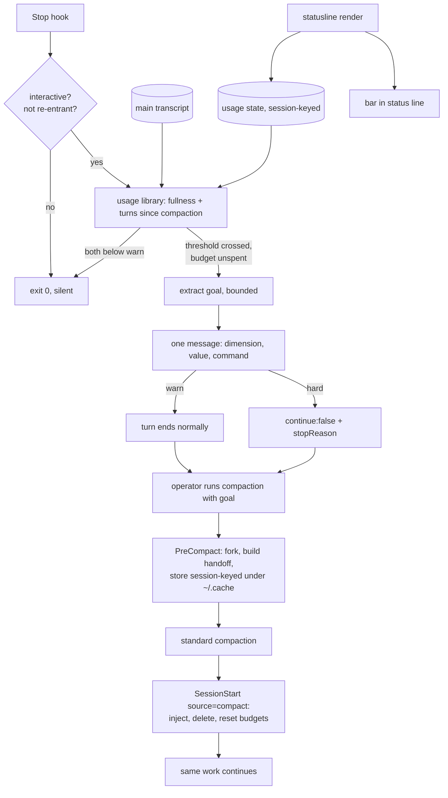
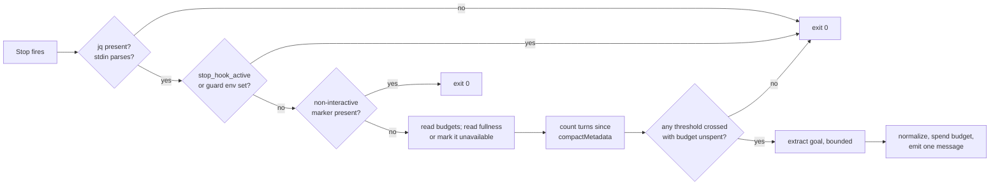

# Context Threshold Handoff - Plan

## Goal Capsule

- **Objective:** A session that has grown expensive or is running out of room says so while there is still time to act, and the compaction that follows carries the current work goal so the agent resumes the work instead of reconstructing it. Neither growth dimension can pass unannounced: a session can fill the window, or it can accumulate enough turns to be costly and unfocused long before the window is anywhere near full.
- **Means:** A shared usage library, a Stop hook that announces and then halts, and the `claude-handoff` PreCompact/SessionStart scripts vendored into this repository with their storage path and injection field fixed (KD2, KTD5, KTD8).
- **Authority:** Product behavior — the R-IDs. Implementation mechanism — the KTDs, within their cited R constraints. A unit overrides neither.
- **Stop conditions:** Stop and surface if U1 shows a Stop hook's `systemMessage` does not render to the operator — the warning path has no other channel that does not also make the agent keep working. Stop if U1 shows a Stop hook fires under `claude -p` and no positive marker distinguishes that session: R21 is the guard that keeps this feature out of the repository's headless legs, and without it the hard threshold can halt unrelated automated work.
- **Execution profile:** `ce-work` in this repository. Every unit is deployment-sensitive; `make test-ubuntu` is the publish gate. Deployment itself is the operator's step — never run `chezmoi apply` here.

---

## Product Contract

**Product Contract preservation:** changed R3, R8, R9, R19, and R20 — each for evidence gathered after the requirements were written, recorded on the entries themselves. Added R18-R24 for behavior the flow analysis showed was unspecified. AE3 removed; its ID is retired rather than reused.

### Summary

Watch two independent signs that a session has outgrown itself — how full the context window is, and how many turns it has accumulated since the last compaction — and on either one hand the operator a ready-to-run `/compact handoff:<goal>` whose goal was extracted from the work in progress. Then make sure the focused handoff that compaction produces actually reaches the model afterwards.

### Problem Frame

Auto-compact is off in this setup (`home/private_dot_claude/private_settings.json.tmpl:119`). Claude Code states the consequence directly: without it, the session hits the context limit and the conversation is lost. Today nothing stands between a long working session and that outcome except the operator noticing a progress bar.

Fullness is only half the problem, and on this machine it is the smaller half. A measurement across 2809 local sessions and 229567 requests puts the average request context at 129k tokens. Against a 1M window that is roughly 13%, so a fullness threshold set anywhere in the usual range would stay silent through nearly every session. Meanwhile 153 sessions — 5.4% of them — ran past 300 requests and account for 53% of all spend, against an average of about 82 requests per session. The expensive sessions are real and they are long, but they are not full.

Length costs in a way that is easy to miss because every request resends the whole conversation. If each turn adds `d` tokens to a starting context `S`, a session of `N` turns costs roughly `N·S + d·N²/2` — quadratic in length, so one 800-turn session costs about four times what four 200-turn sessions cost for the same work. The same accumulation that runs up the bill also blurs what the session is trying to finish.

Compaction is also lossy in a specific way. A generic summary preserves history in proportion to how much of it there was, not in proportion to what the next step needs. The upstream project `claude-handoff` already solves that half: given `/compact handoff:<goal>`, it forks the session before compaction and has a cheap model extract only what serves that goal. Three things stop it from being enough. It requires the operator to notice the moment and phrase the goal themselves, which is exactly the judgment a long session degrades. Its post-compaction injection uses `systemMessage`, which Claude Code renders to the human and never places in the model's context. And it stores the pending handoff under `.git/handoff-pending/`, which cannot be created in a linked worktree — where `.git` is a file — or in the non-repository directories this setup also works in. So it pays for a fork, produces a good handoff, and then either shows it to the wrong reader or never writes it at all.

### Key Decisions

- KD1. **The warning and the handoff both live in this repository as chezmoi-managed hooks.** (session-settled: user-directed — chosen over a standalone project, an upstream contribution, or a policy in the planned cross-agent hooks core: one deployment path, one test suite, and the hooks core is not built yet.) Governs R17.
- KD2. **Vendor the two upstream hook scripts rather than installing the plugin.** (session-settled: user-directed — chosen over installing `claude-handoff` as-is: plugin files are not chezmoi-managed and are overwritten on update, so neither defect could be fixed and kept fixed.) Governs R15, R17, R23.
- KD3. **Two independent trigger dimensions, whichever is reached first.** (session-settled: user-directed — chosen over fullness alone, and over turn count alone: measured usage shows fullness alone would stay silent through nearly every session on this machine, while turn count alone would miss a short session that pulled in several very large files.) Governs R3, R4, R5.
- KD4. **Goal extraction runs synchronously and the operator waits for it.** (session-settled: user-directed — chosen over extracting in the background and showing the command one turn later: a goal that lags the work is the failure the feature exists to prevent.) Governs R13.
- KD5. **The goal is extracted once and thereafter reused from cache.** (session-settled: user-directed — chosen over re-extracting each turn past threshold, and over re-extracting every N turns: knowing whether the goal changed requires extracting it, so the re-check would fork the whole session on every turn of exactly the sessions this feature exists to make cheaper. A goal that has gone stale is edited by hand under R14.) Governs R9, R13.
- KD9. **The warning announces once; the hard threshold keeps announcing at a shrinking interval.** (session-settled: user-directed — chosen over one hard announcement per session, and over a fixed repeat interval: extraction cost and announcement cost are separate, and collapsing them left the session unprotected after a single missed halt while auto-compact is off. Repetition reuses the cached goal, so it adds no model call.) Governs R25.
- KD6. **The hard threshold halts the agent rather than only warning louder.** (session-settled: user-directed — chosen over a stronger message, and over re-enabling auto-compact as a backstop: with auto-compact off a missed warning costs the conversation, and a halted turn is recoverable.) Governs R8.
- KD7. **The warning is addressed to the human, not the model.** `systemMessage` renders in the operator's UI without entering model context; `additionalContext` on a Stop event does the opposite and makes the agent keep working. Governs R7.
- KD8. **This feature never acts in a session no human is watching.** The repository routinely runs headless `claude -p` legs — external review legs, background agents. Halting one mid-task would be a regression in unrelated workflows, and no human is there to read a warning. Agent-driven peers launched through `home/dot_local/bin/executable_herdr-child` are a harder case: they are live pane sessions that do render a statusline, yet their reader is a parent agent that cannot run a compaction, so a halt stalls the leg. Governs R21.

### Requirements

**Measuring the moment**

- R1. One library is the sole owner of both growth numbers. The statusline bar and the announcement always report the same fullness, and neither computes it independently.
- R2. Fullness includes an allowance for the system prompt, which Claude Code does not count in the usage it reports. The allowance is defined in one place and is adjustable without touching either consumer.
- R3. Turn count is taken from the main session transcript only. Subagent turns live in separate transcript files and never reach it. *(Changed: the original requirement described filtering in-transcript subagent entries. A census of a real session that dispatched six subagents found zero such entries in the main transcript — they live under `subagents/agent-*.jsonl` — so there is nothing to filter.)*
- R4. Fullness and turn count are evaluated independently, and reaching either one is enough to act.
- R5. Each dimension has its own warning threshold and its own hard threshold, all four configurable without editing code.
- R18. Turn count restarts at each compaction boundary. The transcript is append-only across compaction, so a count over the whole file never falls when the window empties, and the hard threshold would latch permanently after the first compaction.
- R19. A turn-count threshold is calibrated against a distribution counted the same way the threshold is evaluated. The baseline measurement counted assistant entries across whole transcript files, spanning compaction boundaries and sweeping subagent files, so its "past 300 requests" figure is not directly comparable to a post-compaction main-transcript count and must be re-derived before any threshold is drawn from it. *(Changed: the original asserted the two units were already the same. R3 and R18 narrowed the count after that assertion was written, and the equivalence no longer holds.)*

**Announcing and halting**

- R6. On crossing a warning threshold the operator sees which dimension was reached, its current value, and a ready-to-run compaction command. Work is not interrupted.
- R7. The announcement reaches the operator without entering the model's context, so it costs no context and the agent does not react to it.
- R8. On crossing a hard threshold the turn ends carrying the ready-to-run command as its stated reason, and nothing continues automatically past it. The operator can still start the next turn; the hard threshold refuses autonomous continuation, it does not lock the session. *(Changed: the original stated an unconditional halt. Claude Code caps consecutive blocks and discards them on some end-turn paths, so the guarantee is bounded — see R20.)*
- R9. A warning threshold announces once per session. The goal is extracted once, when a threshold is first reached, and is never re-extracted afterwards — every later announcement reuses the cached goal. *(Changed twice: the original allowed a repeat when the goal materially changed, which requires extraction and defeats KD4's cost argument; the revision then scoped the once-only rule to the warning level, because it was silently disarming the hard level too.)*
- R25. While the session stays above a hard threshold, that threshold keeps announcing, and the gap between announcements shrinks the further past it the session goes — down to every turn. Repetition reuses the cached goal and never re-extracts, so it costs nothing; a single missed announcement must not be the difference between a compaction and a lost session.
- R10. A dimension that has already announced does not suppress the other dimension's announcement.
- R20. A hard crossing always carries an operator-visible message, independent of whether the halt itself is honoured. Claude Code discards a Stop-hook block on several end-turn paths and caps consecutive blocks, so a halt alone can vanish without a trace; the message does not depend on the halt. *(Changed: the original made the fallback conditional on measuring a low block cap, which left it with no trigger and no owning unit.)*
- R22. When both dimensions, or both levels, cross within one turn, the operator receives one message carrying one command. Crossing the hard level consumes the warning budget for the same dimension.
- R11. Compaction resets the announcement state, so a post-compaction session can announce again.
- R21. Nothing is announced and nothing is halted in a non-interactive session.

**The goal**

- R12. The goal is a single short imperative phrase, at most 20 words, naming what the agent is currently trying to finish. It is not a summary of what happened, and it carries a user constraint only when that constraint changes what finishing means.
- R13. The goal is extracted from the running session by a separate cheap model. The operator waits for it.
- R14. The suggested command runs as-is, and is editable before running. A goal the operator disagrees with costs an edit, never a lost announcement.
- R23. Extraction failure never costs the operator the announcement. When extraction times out, errors, or returns nothing usable, the announcement still fires, carrying a goal-less command and saying that extraction failed.
- R24. The goal is normalized before it reaches the operator: single line, within the word cap, and free of characters that would change the meaning of the command when pasted into a shell-adjacent prompt.

**Focused handoff**

- R15. The handoff generated before compaction is present in the model's context after compaction, demonstrated by the model's behavior rather than by the handoff appearing on screen.
- R16. A plain `/compact` with no `handoff:` prefix behaves exactly as it does today, and never receives a handoff left over from an earlier compaction.
- R17. The handoff scripts are stored in this repository, deployed by chezmoi, and covered by this repository's test suite.

<!-- ce-section: work-relationships -->
### How This Work Fits Together

This plan owns one area: detecting the moment and handing over a goal-carrying compaction command. The breakdown below is the current understanding of the surrounding work, not a committed roadmap.

- Sharpening the handoff extraction schema — replacing the upstream four-section prompt with one that separates user constraints, rejected approaches, plan progress, and verification state.
  - Depends on this plan, which vendors the script the prompt lives in.
  - Shares the goal string this plan produces, and nothing else.
- Migrating these hooks into the cross-agent hooks core (`docs/plans/2026-09-03-0833-feat-agent-hooks-core-plan.md`).
  - Depends on that plan landing first.
  - Enables the same detection on OpenCode and Pi.
  - Still to decide: that plan normalizes tool-call events only, while these are lifecycle events whose state comes from the statusline; the seam is unresolved.
- The wider token-economy practices that share this plan's diagnosis — a code map, a ban on re-reading files, delegating screenshots and wide searches to subagents, routing routine work to cheaper models.
  - Shares the cost measurement that motivated this plan.
  - Can proceed independently; these are instruction changes, not hooks.

### Key Flows

- F1. A warning threshold is reached
  - **Trigger:** A turn ends in an interactive session with either dimension at or above its warning threshold, and that budget is unspent.
  - **Steps:** The hook reads both numbers from the library; it extracts the goal once; it shows which dimension fired, its value, and the command; the turn ends normally.
  - **Covered by:** R1, R4, R6, R7, R9, R10, R12, R13, R14, R21, R22

- F2. A hard threshold is reached
  - **Trigger:** A turn ends with either dimension at or above its hard threshold.
  - **Steps:** The hook extracts the goal if it has not already; it returns the halt with the command as the reason.
  - **Covered by:** R5, R8, R12, R13, R14, R20, R21, R22

- F3. Compaction with a goal
  - **Trigger:** The operator runs the suggested command, edited or not.
  - **Steps:** PreCompact forks the session, builds a goal-focused handoff, stores it session-keyed; compaction runs; SessionStart injects it, deletes it, and clears the announcement budgets.
  - **Covered by:** R11, R15, R18

- F4. Compaction without a goal
  - **Trigger:** The operator runs a plain `/compact`.
  - **Steps:** PreCompact sees no `handoff:` prefix and does nothing. SessionStart still fires; it finds no handoff for this session and injects nothing. Announcement budgets and the turn-count boundary still reset.
  - **Covered by:** R11, R16, R18

- F5. The extraction subprocess as a session
  - **Trigger:** The Stop hook forks the session to extract a goal.
  - **Steps:** The forked `claude` process inherits the same settings, so its own Stop hook fires. The guard recognizes it and exits silently without extracting.
  - **Covered by:** R21

### Acceptance Examples

- AE1. A long session announces while the window is nearly empty
  - **Covers R4, R6.**
  - **Given** an interactive session at the turn-count warning threshold whose context sits around 13% of the window
  - **When** the turn ends
  - **Then** the operator sees the announcement, naming turn count rather than fullness.

- AE2. A short session that pulled in large files still announces
  - **Covers R4.**
  - **Given** a session well below the turn-count threshold whose context crossed the fullness warning threshold
  - **When** the turn ends
  - **Then** the operator sees the announcement, naming fullness.

- AE4. A warning announces once per session per dimension
  - **Covers R9, R10.**
  - **Given** the fullness warning already fired
  - **When** three more turns end above that warning threshold but below the hard one
  - **Then** no further fullness announcement is shown, no further extraction runs, and the turn-count budget remains able to fire on its own.

- AE12. The hard threshold keeps announcing, more often the deeper it goes
  - **Covers R25.**
  - **Given** a session that crossed a hard threshold, announced, and kept working without compacting
  - **When** it continues past that threshold
  - **Then** it is announced to again, the gap between announcements is smaller each time, no extraction runs on any repeat, and every announcement carries the goal from the first one.

- AE5. Turn count falls after compaction
  - **Covers R18.**
  - **Given** a session whose transcript holds turns from before and after a compaction
  - **When** the turn count is evaluated
  - **Then** it reflects only the turns after the compaction boundary, and a session that was above the hard threshold before compaction is below it after.

- AE6. The handoff reaches the agent
  - **Covers R15.**
  - **Given** a compaction that ran with a goal
  - **When** the new session is asked about a detail present only in the handoff and absent from the compaction summary
  - **Then** the agent can answer it, without the operator having read the handoff on screen.

- AE7. Plain compaction is untouched and inherits nothing
  - **Covers R16.**
  - **Given** a session for which an abandoned handoff is still stored under the cache path, whether from an earlier session or from this session's own interrupted compaction
  - **When** the operator runs a plain `/compact`
  - **Then** compaction proceeds normally, no fork is spawned, the stale handoff is discarded, and nothing is injected.

- AE8. The bar and the announcement agree
  - **Covers R1, R2.**
  - **Given** the status line shows a given percentage from a render in this session
  - **When** a fullness announcement fires
  - **Then** the percentage in the announcement is that same number, including the system-prompt allowance.

- AE9. A headless session is untouched
  - **Covers R21.**
  - **Given** a `claude -p` session past both hard thresholds
  - **When** its turn ends
  - **Then** nothing is announced, nothing is halted, and the exit is silent.

- AE10. Extraction failure still announces
  - **Covers R23.**
  - **Given** a session at a warning threshold where goal extraction exits non-zero or returns nothing usable
  - **When** the turn ends
  - **Then** the operator still sees the announcement with a goal-less command and a statement that extraction failed.

- AE11. The handoff store works where the operator works
  - **Covers R15.**
  - **Given** a session running in a linked git worktree, where `.git` is a file
  - **When** a goal-carrying compaction runs
  - **Then** the handoff is written and later injected, with no dependence on a writable `.git` directory.

### Success Criteria

- No session is lost to a limit reached without warning.
- Sessions past 300 turns become rare, and the share of spend they carry falls well below the measured 53%.
- After compaction, the operator does not need to say "we already did this" or re-state a constraint given earlier in the same session.
- The suggested goal is close enough to what the operator would have written that editing it is occasional rather than routine.
- The announcement is not experienced as noise. If it is being dismissed reflexively, the thresholds or the once-per-session rule are wrong.
- The silent path stays cheap enough that no turn feels slower for having the hook installed.

### Scope Boundaries

- Running the compaction automatically from the hook. The operator keeps the compaction boundary; a hook cannot execute a slash command anyway.
- Replacing compaction with a hand-written carry note plus a fresh session. That is the cheaper answer to the cost half of the problem, but it does not make continuation survive the boundary automatically.
- Preserving conversation chronology in the manner of `magic-compact`. This work optimizes for continuing the current task, not for reconstructing the conversation.
- The wider token-economy practices that share this diagnosis. They are instruction and agent-configuration changes, not hooks.
- Cross-client coverage for OpenCode and Pi. The shared hooks core is planned and unbuilt.

#### Deferred to Follow-Up Work

- Rewriting the handoff extraction prompt. Vendoring makes it a cheap follow-up; this work fixes storage and injection and keeps the existing schema.
- Sending the injection-field fix upstream as a pull request.
- Pruning stale entries in `~/.cache`. No component in this repository prunes its cache today; a sweep belongs with a decision covering all of them.

### Dependencies and Assumptions

- Verified against a real compaction: `hookSpecificOutput.additionalContext` from `SessionStart` with `source: "compact"` reaches the model. In the same run the compaction summary lost a fact stated in the session's first turn while the injected text survived.
- Verified in an interactive session: `continue: false` from a Stop hook renders its `stopReason` and leaves the session alive for the next prompt. It re-renders on every turn that returns it.
- Verified by transcript census: compaction appends to the same file under the same session id, marked by a `compactMetadata` entry; subagent turns live in separate `subagents/agent-*.jsonl` files; assistant entries carry `.message.usage` with the three fields the statusline sums.
- Verified in this checkout: in a linked worktree `.git` is a file, so `mkdir -p .git/handoff-pending` fails outright.
- Measured in U1 — a `command`-type Stop hook **does** fire under `claude -p`, and `CLAUDE_CODE_ENTRYPOINT` is the positive marker that separates the two: `cli` in an interactive TUI session, `sdk-cli` under `claude -p`. The child process sets it itself; unsetting it in the launching shell does not change what the hook sees. Other values the 2.1.236 bundle carries are `sdk-py`, `sdk-ts`, `mcp-cli`, `vscode`, and `jetbrains`. Command: an isolated `--settings` file whose Stop hook dumped stdin and `env` to a file, run once as `claude -p` and compared against the launching interactive session's own environment.
- Measured in U1 — a Stop hook's `systemMessage` **does** render to the operator. In the TUI it appears under the assistant's message as `⎿ Stop says: <text>`; on the `stream-json` channel it is `{"type":"system","subtype":"informational","level":"notice","content":"Stop says: <text>"}`. The `Stop says: ` prefix is added by Claude Code, so the announcement must read well after it. Commands: a Stop hook returning only `systemMessage`, run under `claude -p --output-format stream-json --verbose`, then confirmed live in a herdr pane.
- Measured in U1 — goal extraction on a near-threshold fork takes **8–9 seconds** with `--model haiku`. Three runs against real 349- and 350-turn sessions of 1.0 MB and 4.8 MB returned in 8.9 s, 8.2 s, and 8.3 s, each with a usable one-line goal. Command: `claude -p '<extraction prompt>' --resume <session-id> --fork-session --model haiku`. This sets KTD11's extraction-bound default at 30 s, with generous headroom over the measurement, and U4's declared hook `timeout` above that.
- Measured in U1 — the Stop-hook block cap is **8 consecutive blocks by default**, raised by `CLAUDE_CODE_STOP_HOOK_BLOCK_CAP`, and it counts `decision: "block"` results (`blockingErrors`), not `continue: false`. `continue: false` sets `preventContinuation`, which ends the turn rather than blocking it from ending, so the cap does not govern the repeat cadence R25 asks for. The real exposure is different and confirms R20 directly: on the end-turn paths that discard a Stop-hook result — turn ended by tool result, MCP end-turn, or loop tick, with no model re-invoke — Claude Code drops `blockingError` **and** `preventContinuation` while still yielding the hook's message. The `systemMessage` survives exactly the path that swallows the halt. Command: `strings` over the 2.1.236 bundle around `CLAUDE_CODE_STOP_HOOK_BLOCK_CAP` and `[end-turn] Stop hook block discarded`.
- Measured in U1 — the `SessionStart` payload for `source: "compact"` carries the **same `session_id`** the `PreCompact` payload carried, and the same `prompt_id`. KTD5's session-keyed lookup holds. The same run confirmed `custom_instructions` reaches `PreCompact` with the `handoff:` prefix intact and `trigger: "manual"`. Command: a live `/compact handoff:…` in a herdr pane under an isolated `--settings` file whose `PreCompact` and `SessionStart` hooks appended their stdin to files.
- Re-derived in U1 (R19) — the session-length distribution under KTD4's rule, assistant entries in the main transcript after the last `compactMetadata` entry, over 3352 main transcripts: p50 16, p75 74, p90 179, p95 253, p98 356, p99 427; 12.4% of sessions past 150 turns, 8.1% past 200, 5.2% past 250, 3.1% past 300. The original baseline's "153 sessions past 300 requests, 5.4%" counted whole files including subagent transcripts; the same sweep restricted to whole main transcripts gives 156 sessions past 300 (4.7%), and KTD4's post-compaction rule gives 105 (3.1%). Only 2.4% of main transcripts carry a `compactMetadata` entry at all, so the two rules diverge mostly through the subagent exclusion. Subagent transcripts are both `subagents/agent-*.jsonl` and `agent-*.jsonl` beside the main file; the hook is unaffected either way, since it reads the `transcript_path` the payload hands it. Command: a read-only `python3` sweep of `~/.claude/projects/**/*.jsonl` applying both counting rules side by side.
- The window size is available only from the statusline payload. `.message.model` in the transcript reads `claude-opus-5` with no marker separating the 1M-context variant, so a model-to-window table cannot be built from the transcript alone.
- The system-prompt allowance is empirical. Its current value of 20 percentage points compensates for a system prompt whose size Claude Code does not report.
- The measured distribution is historical and spans all projects. Thresholds calibrated on it need revisiting if the working style changes.
- The vendored scripts derive from `kylesnowschwartz/claude-handoff` at `26f5b4c` (MIT), inactive since 2026-01-05 with no open issues. Upstream fixes will not arrive on their own.

### Open Questions

- Deferred: the shape of R25's shrinking interval — its first gap and how fast it contracts. Pick it in U4 alongside the thresholds; the requirement fixes the direction, not the curve.
- Deferred: the four threshold values. Both dimensions wait on U1 — turn count on the re-derived distribution (R19), fullness because the measured average sits far below any candidate. Pick them in U4 and record the reasoning.
- Deferred: whether a fork created by `--fork-session` should inherit the announcement budgets of the session it forked from. The default is that a fork starts fresh, which is correct for a real fork and made harmless for the extraction subprocess by KTD6.
- Deferred: agent-driven peers launched through `home/dot_local/bin/executable_herdr-child` render a statusline, so KTD7 classifies them interactive and a hard halt would stall the leg with a message no human reads. The clean fix is for `herdr-child` to export KTD6's guard marker into every child it launches, which is outside this plan's files. Record the exposure; fix it in the unit that owns that script.

### Sources and Research

- Local measurement across `~/.claude/projects/**/*.jsonl`: 2809 sessions, 229567 requests, 129k average request context, 153 sessions past 300 requests carrying 53% of spend.
- "5,75 миллиарда токенов за полгода: как я перестал жечь контекст в Claude Code" (habr.com/ru/articles/1077658/) — the two-dimension trigger, the `N·S + d·N²/2` cost shape, and the wider checklist listed under Scope Boundaries.
- `home/private_dot_claude/hooks/executable_statusline.sh:73-84` — the existing fullness computation and the 20-point allowance; `:9-31` — the session-keyed state-file pattern and the shared library it sources.
- `home/private_dot_claude/private_settings.json.tmpl:115,119` — `autoCompactWindow: 400000` and `autoCompactEnabled: false`.
- Claude Code 2.1.236 bundled hook schema — `systemMessage` is "Display a message to the user (all hooks)"; `hookSpecificOutput.additionalContext` is "Text injected into model context". The same bundle carries `CLAUDE_CODE_STOP_HOOK_BLOCK_CAP` and `[end-turn] Stop hook block discarded`.
- Controlled experiments on this machine: two `SessionStart` hooks differing only in output field (the `systemMessage` run returned `NONE`, the `additionalContext` run returned the token); a real compaction with a `source == "compact"`-gated hook; an interactive session whose Stop hook returned `continue: false`.
- `kylesnowschwartz/claude-handoff` at `26f5b4c` — `handoff-plugin/hooks/entrypoints/pre-compact.sh`, `session-start.sh`, `hooks/lib/logging.sh`.
- `docs/solutions/design-patterns/gate-bias-follows-blast-radius.md` — the fail-open standard this hook must satisfy.
- `docs/solutions/design-patterns/semantic-regression-tests-over-source-shape.md` — coverage ownership across the suites.

---

## Planning Contract

### Key Technical Decisions

- KTD1. **The library is a sourced shell module with no source-time side effects.** It follows `home/dot_local/lib/herdr-worktree-state.sh`. The module-hygiene test at `tests/bashunit/scripts_test.sh:7774` snapshots shell options, traps, `PWD`, `umask`, `PATH`, `HOME`, `IFS`, and positional parameters across sourcing — but it iterates a hardcoded module list at `:7866-7873`, not the directory, so the new library gets no coverage until it is added to that list. Governs R1.
- KTD2. **The statusline publishes; the hook consumes.** The statusline writes the raw usage numbers to a session-keyed state file using the tmp-plus-rename pattern it already uses for herdr; the hook reads that file. The statusline gains a write, never the threshold logic. (session-settled: user-directed — chosen over the hook deriving fullness itself, and over moving the bar's arithmetic into the module: Claude Code hands the raw counts to the statusline only, and two independent counters would let the bar and the announcement disagree.) Governs R1, R2.
- KTD3. **Fullness degrades to unavailable rather than to a guess, and never silences turn count.** The statusline is a render callback, not a hook, so a resumed session has no state file until its first render and a long turn's file can predate the turn's own growth. Whenever fullness cannot be read or trusted — file unreadable, truncated, or older than the current turn — that dimension is skipped and the turn-count dimension still evaluates. A transcript-derived numerator is not substituted, because the window size it would need is unavailable there. Governs R1, R4.
- KTD4. **Turn count is assistant entries in the main transcript after the last `compactMetadata` entry.** Assistant entries are what the baseline measurement counted, so thresholds drawn from it transfer directly; the `compactMetadata` entry is the only reliable in-file compaction boundary. Governs R3, R18, R19.
- KTD5. **The pending handoff lives under `~/.cache`, session-keyed, deleted on consumption.** Upstream's `.git/handoff-pending/` cannot be created in a linked worktree and does not exist in non-repository directories, and an unkeyed path lets concurrent worktree sessions overwrite each other. Reuse `encode_key` and `atomic_write` from `home/dot_local/lib/herdr-worktree-state.sh`. Governs R15, R16.
- KTD6. **Re-entrancy is blocked twice: by `stop_hook_active` and by an environment marker the hook exports into the extraction subprocess.** The extraction is a `claude` process inheriting the same settings, so its Stop hook fires; a fork of an already-long session would meet the threshold immediately and extract again. Governs R21.
- KTD7. **Non-interactive detection keys on a positive signal, never on a missing state file.** The marker is `CLAUDE_CODE_ENTRYPOINT`, measured in U1: the process sets it to `cli` in an interactive TUI session and to `sdk-cli` under `claude -p`. A session is treated as non-interactive when that variable matches an `sdk-` prefix or `mcp-cli`, and as interactive otherwise — so `cli`, `vscode`, and `jetbrains` all announce, and an unset variable fails safe towards announcing rather than towards silence. Absence of a statusline state file is reserved entirely for KTD3's fullness-unavailable path, because the two conditions are indistinguishable from the file alone and reading absence as "headless" would silence a resumed interactive session — the long-session case this feature exists for. U1 confirmed a `command`-type Stop hook does fire under `claude -p`, so this decision stands on its positive marker and neither fallback applies. Governs R21.
- KTD8. **The vendored SessionStart hook emits `hookSpecificOutput.additionalContext` with `hookEventName: "SessionStart"`.** Upstream emits `systemMessage`, which the operator sees and the model never does. Governs R15.
- KTD9. **Every failure path exits 0 and silent, except the hard threshold's deliberate halt.** This follows the repository's hook standard and `docs/solutions/design-patterns/gate-bias-follows-blast-radius.md`: an advisory gate over a mutating agent fails open. The one exception is intentional and is the only place the hook returns anything other than success. Governs R6, R8, R23.
- KTD10. **One writer per state file. Announcement state lives in its own session-keyed file, separate from usage.** Both files are written with the tmp-plus-rename pattern, which replaces a file whole rather than merging fields, so a shared file would let the statusline's next render silently erase state the hook had just written — the once-per-session guarantee would then hold in tests that stage the file directly and fail in every live session. The announcement file holds the warning budgets, the cached goal, and the turn each hard threshold last announced at. The statusline owns the usage file; the Stop hook owns the announcement file; the SessionStart injector removes it after compaction. Governs R9, R10, R11, R22, R25.
- KTD12. **The hard-threshold repeat interval is a function of distance past the threshold, not a counter.** Deriving the next announcement turn from the current turn count and the threshold keeps the announcement file free of a decaying counter that a resume or fork could carry stale, and makes the cadence reproducible from state the hook already reads. U1 measured the block cap and found it does not govern this path: the cap counts `decision: "block"` results, eight consecutive by default, while `continue: false` sets `preventContinuation` and ends the turn instead of blocking it. The exposure R20 covers is the other one U1 found — the end-turn paths that discard a Stop-hook result drop `preventContinuation` and `blockingError` alike while still yielding the hook's message, so the unconditional `systemMessage` is what keeps the crossing visible exactly where the halt vanishes. Governs R25.
- KTD11. **Tunables are read from the process environment, defaulted in the library.** The set is the four thresholds, the system-prompt allowance, and the goal-extraction time bound. This matches `HERDR_WORKTREE_IDENTITY_STATE_DIR` and the repository's other tunables, and gives U8's registration test a default to compare the declared hook `timeout` against instead of a restated magic number. The cost is that a change needs both a `chezmoi apply` and a client restart; that cost is stated rather than designed around. Governs R5, R13.

### High-Level Technical Design

The silent path is the hot path. The hook runs at the end of every turn of every session in this setup, so its cost when nothing is near threshold is a design constraint, not an afterthought.

Everything left of `I` is file reads and arithmetic. The model call happens once or twice in a session's life.

### Assumptions

- Reading and counting a large transcript on every turn is cheap enough for the hot path. If U1 or U4 shows otherwise, the count can be cached in the same state file with the transcript's size and mtime as the invalidation key; that optimization is not planned up front.
- The operator's terminal lets them select the suggested command from a `systemMessage`. "Ready-to-run" means correctly formed, not one keystroke.

---

## Implementation Units

### U1. Measure the unverified platform behaviors and re-derive the turn-count baseline

- **Goal:** Replace every load-bearing platform assumption with a measurement, and give U4 a threshold baseline counted the way the hook will count.
- **Requirements:** R8, R19, R20, R21, R23
- **Dependencies:** none
- **Files:** none in `home/`; probe scripts, the re-derivation script, and notes under the session scratchpad, with results folded into this plan's Dependencies, Assumptions, and KTD7
- **Approach:**
  1. Find the positive marker that distinguishes a non-interactive session, and whether a `command`-type Stop hook fires there at all. KTD7 depends on this; a null result downgrades it to the stated weaker rule.
  2. Confirm that a Stop hook returning `systemMessage` renders that text to the operator at end of turn. The whole warning path rests on this and only the `SessionStart` field behavior was measured; the Stop-hook experiment covered `continue: false` and `stopReason` only.
  3. Measure end-to-end goal-extraction latency on a forked session sized near each candidate hard threshold. This sets the extraction bound in KTD11 — the platform's tolerance for an overrunning hook does not, since U5 bounds the call itself.
  4. Measure how many consecutive `continue: false` returns are honoured before the block cap discards them, and whether `CLAUDE_CODE_STOP_HOOK_BLOCK_CAP` changes it.
  5. Confirm that the `SessionStart` payload for `source: "compact"` carries the same `session_id` the PreCompact payload carried. KTD5's session-keyed lookup depends on it.
  6. Re-derive the session-length distribution under KTD4's counting rule — assistant entries in the main transcript after the last `compactMetadata` entry — and record its percentiles beside the original request-count figures (R19).
- **Execution note:** Run each probe in a disposable directory with an isolated `--settings` file so the operator's live configuration is never touched. Interactive probes belong in a sibling herdr pane. The re-derivation is a read-only sweep of `~/.claude/projects/`.
- **Patterns to follow:** the canary-hook technique — two runs differing in exactly one field, with a control.
- **Test scenarios:** Test expectation: none — this unit produces measurements, not behavior. Its outputs are the amended Assumptions section, the extraction bound, and the re-derived distribution.
- **Verification:** Every question has a recorded answer with the command that produced it. If probe 1 finds no positive marker, KTD7's weaker fallback is recorded as a known gap. If probe 2 shows `systemMessage` does not render from a Stop hook, stop and surface — the warning path has no other channel.

### U2. Shared context-usage library

- **Goal:** One module owns fullness, turn count, threshold comparison, and the announcement budgets.
- **Requirements:** R1, R2, R3, R4, R5, R9, R10, R18, R19, R22, R25
- **Dependencies:** U1
- **Files:** `home/dot_local/lib/context-usage.sh`, `tests/bashunit/scripts_test.sh`
- **Approach:**
  1. Expose a reader and a statusline-facing writer for the usage file, and a separate reader and hook-facing writer for the budget file — one writer per file, per KTD10 — both using the tmp-plus-rename pattern from `home/dot_local/lib/herdr-worktree-state.sh`.
  2. Expose fullness as a percentage including the system-prompt allowance, with the allowance defined once (R2), and an explicit unavailable result per KTD3.
  3. Expose the turn count per KTD4, and a comparison that returns which dimension and level crossed, honouring the warning budgets per R22 and the hard-level repeat cadence per KTD12.
  3a. Derive the next hard announcement point from distance past the threshold, so the cadence needs no decaying counter in the file (KTD12).
  4. Read the four thresholds, the allowance, and the extraction bound from the environment with defaults in the module (KTD11).
  5. Append `context-usage.sh` to the module-hygiene list at `tests/bashunit/scripts_test.sh:7866-7873`. That test iterates a hardcoded list, not the directory, so the new library is otherwise uncovered (KTD1).
- **Patterns to follow:** `home/dot_local/lib/herdr-worktree-state.sh` for `encode_key`, `atomic_write`, and the `${THING}_STATE_DIR` default shape. No `#!/usr/bin/env bash` behavior at source time (KTD1). Bash 3.2 only: no `declare -A`, no `readarray`.
- **Test scenarios:**
  - Covers AE5. A transcript fixture containing turns before and after a `compactMetadata` entry yields only the count after it.
  - A transcript fixture with no `compactMetadata` entry yields the full assistant-entry count.
  - A transcript fixture whose assistant entries interleave `user` and tool-result entries counts only assistant entries.
  - Covers AE8. Given a state file holding known usage and window numbers, the reported percentage equals the statusline's own arithmetic on the same numbers, allowance included.
  - Both dimensions crossing warn in one call return a single crossing result naming both.
  - A dimension crossing hard when its warn budget is unspent consumes that warn budget.
  - Covers AE12. Successive calls at increasing distance past a hard threshold return announce-now at shrinking gaps, and the gap reaches every turn.
  - A call between two hard announcement points returns nothing to announce.
  - The cached goal is returned unchanged on every hard repeat, and no call asks for a fresh one.
  - An unreadable, absent, or truncated usage file yields "fullness unavailable" rather than zero or an error, and leaves the turn count computable.
  - Writing the usage file does not clear a spent budget, and writing a budget does not disturb the usage numbers.
  - Sourcing the module changes no shell option, trap, `PWD`, `umask`, `PATH`, `HOME`, `IFS`, or positional parameter.
- **Verification:** `tests/lib/bashunit -j 8 tests/bashunit/scripts_test.sh` passes, and the module-hygiene test's list now names `context-usage.sh` — confirmed by watching it fail when a deliberate source-time side effect is added, then pass when removed.

### U3. Statusline publishes usage state

- **Goal:** The numbers Claude Code gives only the statusline become readable by the hook, without moving threshold logic into the statusline.
- **Requirements:** R1, R2
- **Dependencies:** U2
- **Files:** `home/private_dot_claude/hooks/executable_statusline.sh`, `tests/bashunit/scripts_test.sh`
- **Approach:**
  1. Source the new library behind an env-overridable path with a `[ -r ] || return 0` guard, mirroring the existing herdr block at `:9-31`.
  2. Write the raw usage numbers, the window size, and a timestamp to the session-keyed state file.
  3. Leave the bar's existing arithmetic in place, now reading the allowance from the library so R2 has one owner.
- **Execution note:** This is the most frequently executed script in the setup. Prefer a smoke check that the bar still renders identically for a given payload over broad new unit coverage.
- **Patterns to follow:** `home/private_dot_claude/hooks/executable_statusline.sh:9-31` — the whole shape, including the local-variable discipline and returning 0 on every guard.
- **Test scenarios:**
  - Given a payload with known `context_window` values, the rendered bar is byte-identical to the current implementation's output for the same payload.
  - The same run leaves a state file whose contents round-trip through the library's reader.
  - A payload with no `context_window` object renders the current zero-percent bar and writes no state file.
  - A read-only state directory leaves the bar rendering normally.
- **Verification:** The existing statusline coverage at `tests/bashunit/scripts_test.sh:250` still passes, and the state file appears after a run with a full payload.

### U4. Stop hook: detection and announcement

- **Goal:** The operator learns a threshold was crossed, with a correctly formed command, and the agent halts at the hard level.
- **Requirements:** R4, R5, R6, R7, R8, R9, R10, R20, R21, R22, R25
- **Dependencies:** U1, U2, U3
- **Files:** `home/private_dot_claude/hooks/executable_context-threshold.sh`, `home/private_dot_claude/private_settings.json.tmpl`, `tests/bashunit/scripts_test.sh`
- **Approach:**
  1. Follow the house preamble: `set -uo pipefail`, `command -v jq || exit 0`, `input=$(cat) || exit 0`, every extraction guarded.
  2. Apply the guards in the order given in the High-Level Technical Design: re-entrancy first (KTD6), non-interactive second (KTD7), then the library. A missing usage file is never a non-interactive signal.
  3. Emit `systemMessage` at the warning level. At the hard level emit `continue: false` with `stopReason` **and** the same `systemMessage`, so the crossing is visible even on an end-turn path that discards the block (R20). One message per turn per R22.
  4. Register the hook under `Stop` in the settings template in this same commit, with a declared `timeout` above the extraction bound KTD11 defaults. A deployed-but-unregistered hook is a tracked defect class here (`docs/issues/2026-09-03-004-user-prompt-skill-eval-hook-is-deployed-but-never-wired.md`).
  5. Ship this unit with a goal-less command; U5 adds the goal. This keeps a working announcement in place before the expensive part exists.
  6. Choose the four threshold values against U1's re-derived distribution, and the first gap and contraction of R25's cadence, recording the reasoning for both.
- **Execution note:** Land the announcement without extraction first and use it for a day. The hot-path cost and the noise level are both easier to judge on a hook that does nothing expensive.
- **Patterns to follow:** `home/private_dot_claude/hooks/executable_test-oracle-guard.sh:15-23` for the preamble; `executable_herdr-worktree-identity-hook.sh:10-13` for env gating; the mandatory header comment ending in the fail-open declaration.
- **Test scenarios:**
  - Covers AE1. A payload plus a state file at the turn-count warning threshold with fullness low produces a `systemMessage` naming turn count.
  - Covers AE2. The mirror case produces a `systemMessage` naming fullness.
  - Covers AE9. A payload carrying the non-interactive marker produces empty output and success, even above both hard thresholds.
  - A payload with no usage file but a turn count above threshold still announces, naming turn count. This is the resumed-interactive case KTD3 protects and KTD7 must not swallow.
  - A payload whose usage file predates the current turn announces on turn count and omits fullness.
  - A payload with `stop_hook_active` true produces empty output and success.
  - A payload with the guard environment marker set produces empty output and success.
  - Covers AE4. A second invocation at the same warning level with the budget spent produces empty output and success.
  - Covers AE12. A session held above a hard threshold announces again after the cadence gap, carrying the cached goal, with no extraction call.
  - Covers R20. A hard crossing produces one response carrying `"continue": false`, a `stopReason`, and a `systemMessage` with the same command.
  - Covers AE4, R10. With the fullness budget spent, a turn-count crossing still announces.
  - Malformed stdin produces empty output and success.
  - Both dimensions crossing in one turn produce exactly one message.
  - The rendered settings register this hook under `Stop` with a declared `timeout` greater than the library's extraction-bound default.
- **Verification:** `tests/lib/bashunit -j 8 tests/bashunit/scripts_test.sh` passes, and a live session in a sibling herdr pane — under an isolated `--settings` file, as U1's probes are — with lowered thresholds shows the announcement and then the halt.

### U5. Goal extraction

- **Goal:** The suggested command carries what the session is trying to finish.
- **Requirements:** R12, R13, R14, R23, R24
- **Dependencies:** U4, U6
- **Files:** `home/private_dot_claude/hooks/executable_context-threshold.sh`, `tests/bashunit/scripts_test.sh`
- **Approach:**
  1. Fork the session with the cheap model and the extraction prompt, bounded by KTD11's extraction bound as measured in U1, exporting the guard marker from KTD6 into the child.
  2. Normalize the result per R24 — single line, word cap, characters that would change the command's meaning removed.
  3. On empty output, non-zero exit, timeout, or a result that fails normalization, announce anyway with the goal-less command and a one-line note (R23).
  4. If the measured bound would exceed the `timeout` U4 declared for the Stop hook, raise that declared timeout in the same commit so the platform never truncates a call the hook is already bounding.
- **Patterns to follow:** the upstream fork invocation in the vendored PreCompact script (U6), so both call sites use one shape. The extraction prompt is prose in the script, not a template.
- **Test scenarios:**
  - A stubbed extractor returning a clean phrase yields a command containing it.
  - Covers AE10. A stubbed extractor exiting non-zero yields the goal-less command and the failure note, and the announcement still fires.
  - A stubbed extractor returning an empty string yields the same.
  - A stubbed extractor returning multiple lines yields a single-line goal.
  - A stubbed extractor returning a phrase over the word cap yields a goal within the cap.
  - A stubbed extractor returning backticks, `$(…)`, or quotes yields a goal with those sequences neutralized.
  - A stubbed extractor that sleeps past the bound yields the goal-less command within the bound.
- **Verification:** The scenarios above pass with a stub on `PATH`; one live run in a herdr pane produces a goal recognizably describing the session's current work.

### U6. Vendor the PreCompact handoff builder

- **Goal:** A goal-carrying compaction produces a stored handoff, in every directory the operator actually works in.
- **Requirements:** R15, R16, R17
- **Dependencies:** none
- **Files:** `home/private_dot_claude/hooks/executable_handoff-pre-compact.sh`, `home/private_dot_claude/private_settings.json.tmpl`, `tests/bashunit/scripts_test.sh`
- **Approach:**
  1. Copy the upstream script and its logging helper, keeping the MIT notice, the pinned upstream commit `26f5b4c`, and a note that upstream is inactive.
  2. Replace the `.git/handoff-pending/` store with the session-keyed `~/.cache` path per KTD5, reusing `encode_key` and `atomic_write` from `home/dot_local/lib/herdr-worktree-state.sh`.
  3. Keep the `^handoff:` match against `custom_instructions`. On every other compaction, delete any handoff already stored for this session before exiting 0 — PreCompact is the only point that knows whether this compaction asked for a goal, and a handoff left from an interrupted compaction would otherwise be injected into the next plain one (R16).
  4. Register the hook under `PreCompact` in the settings template in this same commit.
- **Patterns to follow:** upstream `handoff-plugin/hooks/entrypoints/pre-compact.sh` at `26f5b4c` for the fork invocation and prompt; `home/dot_local/lib/herdr-worktree-state.sh` for `encode_key` and `atomic_write`.
- **Test scenarios:**
  - Covers AE11. Run with `cwd` set to a linked worktree where `.git` is a file; the handoff is written and readable.
  - Run with `cwd` set to a directory that is not a git repository; the handoff is written and readable.
  - A payload whose `custom_instructions` lack the `handoff:` prefix writes nothing and exits successfully.
  - A payload with `trigger: "auto"` and null `custom_instructions` writes nothing.
  - Covers AE7. A payload without the `handoff:` prefix, run when a handoff for this same session is already stored, leaves no stored handoff behind.
  - Two payloads with different session ids write two distinct files, neither overwriting the other.
  - Malformed stdin exits successfully and writes nothing.
  - The rendered settings register this hook under `PreCompact`.
- **Verification:** `tests/lib/bashunit -j 8 tests/bashunit/scripts_test.sh` passes and a real `/compact handoff:<goal>` leaves a file under the cache path.

### U7. Vendor the SessionStart injector

- **Goal:** The stored handoff reaches the model after compaction, and never reaches a compaction that did not ask for one.
- **Requirements:** R11, R15, R16
- **Dependencies:** U2, U6
- **Files:** `home/private_dot_claude/hooks/executable_handoff-session-start.sh`, `home/private_dot_claude/private_settings.json.tmpl`, `tests/bashunit/scripts_test.sh`
- **Approach:**
  1. Copy the upstream script, keeping the `source == "compact"` gate.
  2. Emit `hookSpecificOutput.additionalContext` with `hookEventName: "SessionStart"` per KTD8.
  3. Look up the handoff by this session's id only, and delete it after emitting.
  4. Remove the session's budget file so announcements re-arm, and let the turn-count boundary reset naturally through KTD4 (R11).
  5. Add this hook as a second entry in the existing `SessionStart` array in the settings template, in this same commit. The herdr entry stays first and untouched.
- **Patterns to follow:** upstream `session-start.sh` at `26f5b4c` for the gate and cleanup; `executable_webfetch-markdown-hint.sh:25-30` for the `hookSpecificOutput` emission shape.
- **Test scenarios:**
  - A payload with `source: "compact"` and a stored handoff for that session emits `additionalContext` containing it, and the stored file is gone afterwards.
  - Covers AE7. A payload with `source: "compact"` and a stored handoff belonging to a *different* session emits nothing and leaves that file untouched.
  - A payload with `source: "compact"` and no stored handoff emits nothing.
  - A payload with `source: "startup"` emits nothing and deletes nothing.
  - The emitted JSON contains `additionalContext` and does not contain `systemMessage`.
  - After a `source: "compact"` payload, the session's budget file is gone.
  - Malformed stdin exits successfully.
  - The rendered settings list both the herdr agent-state hook and this injector under `SessionStart`, with herdr's entry still present.
- **Verification:** The field assertion above is the local oracle. End-to-end proof of R15 is AE6, which needs a live compaction and belongs to the deployment check in U8.

### U8. Prove the deployed wiring end to end

- **Goal:** The three registrations U4, U6, and U7 each made survive rendering and deployment together, and the handoff chain works on a live session.
- **Requirements:** R15, R17
- **Dependencies:** U4, U5, U6, U7
- **Files:** `tests/bashunit/templates_test.sh`, `tests/bashunit/smoke_test.sh`
- **Approach:**
  1. Extend the rendered-settings contract test with one assertion covering all three registrations together — each unit already asserts its own, and this catches a later edit that drops one.
  2. Add a deployed-settings scenario in the smoke suite: the walk over `$HOME/.claude/settings.json` finds the `Stop`, `PreCompact`, and second `SessionStart` entries this plan adds.
  3. Extend the contract tests rather than writing a new suite file; a new file would need an unused global order number.
- **Execution note:** This unit adds no `home/` file. Registration lives with each hook per its own unit; this is the proof that they agree after rendering and apply.
- **Patterns to follow:** `tests/bashunit/templates_test.sh:274-286` for the rendered-settings assertion shape; `tests/bashunit/smoke_test.sh:787-800` for the deployed-settings walk.
- **Test scenarios:**
  - The rendered settings carry all three registrations at once — `Stop`, `PreCompact`, and a second `SessionStart` entry alongside herdr's.
  - Every hook command **this plan registers** resolves to a chezmoi-managed source path. The pre-existing `herdr-agent-state.sh` entry is deliberately outside the assertion: it is installed by `herdr integration install` from `home/.chezmoiscripts/run_onchange_after_3-setup-herdr-integrations.sh.tmpl` and has no chezmoi source path.
  - The deployed `settings.json` contains all three registrations after apply.
- **Verification:** `make test-templates` passes and the smoke suite's new scenario passes against an applied home. One green `make test-ubuntu` on the final state, per the publish gate. After the operator applies and restarts, AE6 is proved by a live goal-carrying compaction.

---

## Verification Contract

This change adds new managed paths, edits a `.tmpl`, and depends on the deployed location — three separate reasons it is **deployment-sensitive** under `docs/agent-verification.md`. That classification takes precedence, and its evidence requirement is the publish gate.

| Check | Command | Applies to | Proves |
|---|---|---|---|
| Hook and library behavior | `tests/lib/bashunit -j 8 tests/bashunit/scripts_test.sh` | U2, U3, U4, U5, U6, U7 | Source-level logic, fail-open paths, module hygiene |
| Rendered settings contract | `make test-templates` | U8 | The three registrations render correctly across config branches |
| Deployed wiring | `tests/lib/bashunit -j 8 tests/bashunit/smoke_test.sh` | U8 | Cross-component behavior no narrower suite can prove |
| Shell lint | `make lint` | every unit | shellcheck over each new `executable_*` and `home/dot_local/lib/*.sh` |
| Publish gate | `make test-ubuntu` | the final state | The only valid evidence for a deployment-sensitive change |

`make test-local` and `make test-suite` are not sufficient here: the first is the content-only row's evidence, and the second reads the already-applied home directory, which cannot contain an unapplied edit.

`make test-ubuntu` is a long-running Docker workload. With `HERDR_ENV=1`, launch it in a visible sibling herdr pane, persist its exit status as a terminal marker, and observe that marker before reporting a verdict. Do not let the Bash tool's 120-second timeout bound it.

**Where coverage does not belong.** R15's end-to-end behavior is owned by Claude Code's compaction, an upstream system with no valid local oracle. Prove the field emitted (U7) and the storage round-trip (U6) locally; prove the injection itself by AE6 on a live session after deployment. Do not reimplement compaction to make R15 unit-testable. The same applies to U1's measurements — they describe platform behavior and are recorded as assumptions, not asserted by tests.

---

## Definition of Done

**Global**

- Every unit's test scenarios exist and pass, in the suite named in its `Files`.
- `make lint` is clean over the new hooks and the new library.
- One green `make test-ubuntu` on the final deployment-relevant state.
- U1's measurements and its re-derived turn-count distribution are recorded in this plan's Dependencies and Assumptions, replacing the "unverified until U1" entry.
- The four threshold values are recorded in U4 with the reasoning that produced them, and the deferred Open Question about them is removed.
- No ad-hoc probe scripts or experimental settings files from U1 remain in the working tree. The extractor stub the U5 scenarios depend on lives inside the test suite and stays.
- Both the Ubuntu and macOS pull-request jobs are green.

**Per unit**

- U1: every question answered, each with the command that produced the answer. KTD7 stands on a positive marker, falls back to its weaker rule, or is recorded as collapsed.
- U2: the module-hygiene list names `context-usage.sh`, and a statusline write provably does not clear a spent budget.
- U3: the bar renders identically for a given payload, and the usage file round-trips.
- U4: a live session with lowered thresholds warns once and stays silent at that level; held above a hard threshold it announces repeatedly at shrinking gaps with no extraction call; a session with no usage file still announces on turn count.
- U5: extraction failure still announces; one live run produces a recognizable goal.
- U6: the handoff is written in a linked worktree and in a non-repository directory, and a plain compaction clears a stale one.
- U7: the emitted JSON carries `additionalContext` and not `systemMessage`.
- U8: all three registrations are present together in the rendered and the deployed settings, and no hook this plan adds is deployed unregistered.
