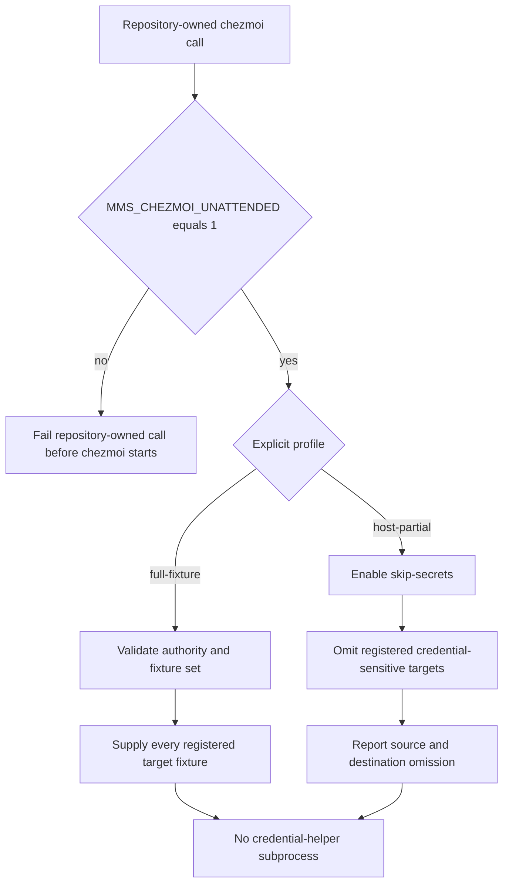
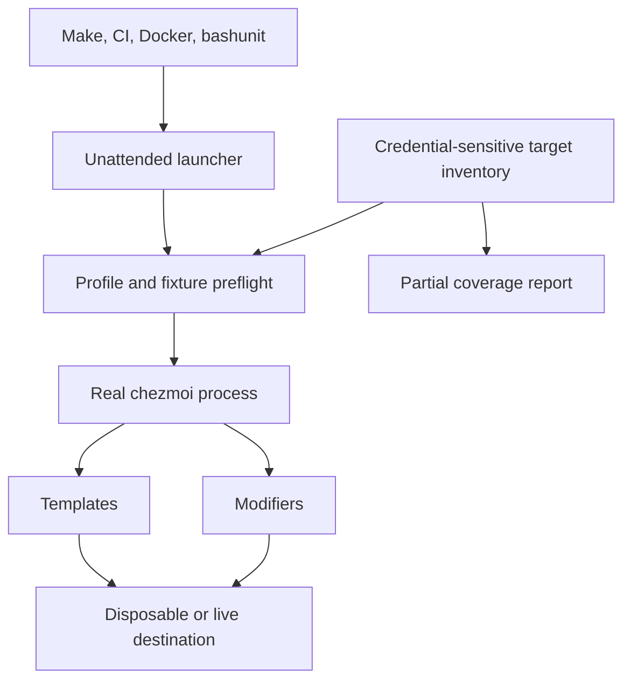
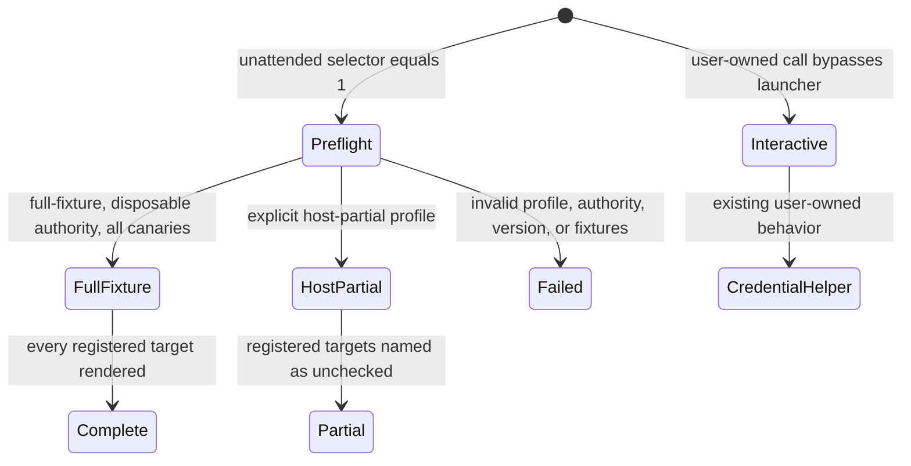

# Unattended Chezmoi Execution - Plan

## Goal Capsule

- **Objective:** agents, continuous integration, and repository tests can run every repository-owned chezmoi operation to completion without interactive credential access, while reporting exactly which managed state was and was not checked.
- **Means:** one unattended launcher selects an explicit full-fixture or host-partial profile and applies the profile contract at the subprocess boundary (KTD1-KTD4).
- **Authority:** this plan governs product and implementation scope. `docs/issues/2026-08-30-006-make-test-local-stalls-in-host-diff.md` governs the confirmed failure evidence. `AGENTS.md` governs repository conventions and outranks this plan where they conflict.
- **Execution profile:** six dependency-ordered units across test infrastructure, managed templates and modifiers, CI, Docker, verification policy, and issue lifecycle.
- **Stop conditions:** stop if any repository-owned unattended invocation still reaches `op`; stop if full-fixture automation can omit a registered credential-sensitive target and remain green; stop if `make test-local` can report complete coverage while `.zshenv` or `.claude.json` is unchecked.
- **Tail ownership:** the implementation workflow owns verification, issue closure, commit, push, and pull-request lifecycle.
- **Open blockers:** none.
- **Product Contract preservation:** changed R2, R3, and R6-R9 after the user approved distinct full-fixture and host-partial profiles; all other Product Contract intent and IDs are preserved.

## Progress

- [x] U1 · unattended launcher and credential-sensitive target inventory (`13f114e`)
- [x] U2 · profile-aware secret-backed template rendering (`0339751`)
- [x] U3 · credential-preserving Claude modifier
- [x] U4 · test-owned chezmoi call migration
- [x] U5 · Make, CI, and Docker migration
- [ ] U6 · verification policy and issue closure

---

## Product Contract

### Summary

Introduce one unattended launcher for every agent-, CI-, and test-owned chezmoi command. Disposable automation fully renders credential-sensitive targets with fixture credentials, while host diff skips and names those targets. Neither profile invokes credential helpers, and interactive user-owned apply keeps its current 1Password behavior.

### Problem Frame

`make test-local` can wait indefinitely because rendering `home/modify_dot_claude.json` invokes a real `op read` and waits for interactive authorization. The confirmed reproduction remained blocked for more than eight minutes; removing `op` from `PATH` reduced the same diff to less than one second.

The current workaround is not a valid repository-wide contract. It applies only to part of the test suite, removes every binary colocated with `op`, allows secret-backed templates to render as if credentials do not exist, and lets the Claude modifier remove credentialed MCP entries from existing state. Direct chezmoi calls also remain in the Makefile, CI, Docker, and test helpers.

### Key Decisions

- **Use one explicit unattended mode.** (session-settled: user-directed — chosen over PATH surgery, a 1Password service account, and relying on timeouts: unattended verification must be autonomous without hiding unrelated tools or depending on network authorization.) Governs R1-R5, R13-R16.
- **Use full fixtures in disposable automation and partial coverage on host diff.** (session-settled: user-approved — chosen over making every unattended run skip secrets: disposable environments should prove the full render, while host diff cannot compare fixture values with live secrets honestly.) Governs R2-R9.
- **Preserve credentialed state when credentials are absent.** (session-settled: user-directed — chosen over rebuilding credentialed entries as absent: an unattended run must not interpret unavailable credentials as requested deletion.) Governs R10-R12.

### Actors

- A1. **Automation caller:** an agent, CI job, or repository test that needs a deterministic chezmoi verdict without human input.
- A2. **Developer:** reviews the unattended verdict and supplies focused evidence when changing a skipped credential-sensitive target.
- A3. **Interactive operator:** runs ordinary user-owned chezmoi commands outside unattended mode and retains the existing credential-enabled behavior.

### Requirements

**Unattended execution contract**

- R1. The exact value `MMS_CHEZMOI_UNATTENDED=1` selects the repository's unattended chezmoi mode; absent or different values do not silently opt an interactive user into it.
- R2. Every chezmoi command launched by repository agents, CI, or tests uses one shared unattended invocation path with an explicit `full-fixture` or `host-partial` profile.
- R3. The `full-fixture` profile requires the complete repository-owned fixture credential set and exact disposable-home authorization, never adds `--skip-secrets`, and supplies the canaries needed for deployment gates to render all registered credential-sensitive targets.
- R4. Unattended mode prevents credential-helper subprocesses before they start; no `op read` may be attempted and a timeout is not the primary prevention mechanism.
- R5. Unattended mode preserves the caller's ordinary `PATH`, including binaries located beside `op`.

**Coverage honesty**

- R6. The `host-partial` profile enables `--skip-secrets`, closes prompt-capable stdin, and excludes every registered credential-sensitive destination from state-comparison target arguments so those destinations remain untouched and cannot enter diff output.
- R7. The host-partial result reports each registered source and destination omission and labels the verdict as partial coverage without printing credential values.
- R8. `make test-local` preserves chezmoi diff semantics: visible differences do not change the exit status, while launcher, render, profile, and inventory errors fail the command.
- R9. A change to a registered credential-sensitive target requires a successful full-fixture deployment gate before merge; `make test-local` alone cannot satisfy verification for that target.

**State preservation**

- R10. In unattended mode, a modifier that receives no replacement credential preserves each corresponding credentialed entry already present in the destination state.
- R11. On a clean disposable home, a credentialed entry remains absent when unattended mode receives neither an existing entry nor a replacement credential.
- R12. Explicit credentials supplied through the unattended environment may create or replace their corresponding credentialed entries without requiring a credential helper.

**Migration and enforcement**

- R13. Existing `PATH_WITHOUT_OP` use is retired after all test-owned chezmoi calls adopt the shared unattended invocation path.
- R14. Direct repository-owned chezmoi calls in tests, Make targets, CI, and Docker either use the shared unattended path or are proven to be interactive user-owned exceptions.
- R15. Every unattended command that can write to `$HOME` requires the existing exact-value disposable-home authorization before chezmoi starts; `full-fixture` requires that authorization for every subcommand.
- R16. The unattended launcher applies `--no-tty` and `--no-pager`, preserves chezmoi arguments, output, signals, and terminal status, and prevents ordinary commands from consuming interactive stdin.

### Key Flows

- F1. Disposable full-fixture verification
  - **Trigger:** A1 launches the disposable deployment verification gate.
  - **Actors:** A1
  - **Steps:** The shared path validates disposable-home authority and the complete fixture set, selects full-fixture behavior, and runs apply plus post-apply verification without starting a credential helper.
  - **Outcome:** The command reaches a terminal verdict after rendering every registered credential-sensitive target.
  - **Covers:** R1-R5, R9, R14-R16.
- F2. Partial host diff
  - **Trigger:** A1 runs `make test-local` and the source contains a credential-sensitive target.
  - **Actors:** A1, A2
  - **Steps:** The shared path selects host-partial behavior, derives a NUL-safe managed-target set without registered credential-sensitive destinations, compares that remaining state under `--skip-secrets`, and reports each source and destination omission.
  - **Outcome:** The diff completes without claiming the registered target was verified.
  - **Covers:** R6-R9.
- F3. Credentialed modifier without credentials
  - **Trigger:** An unattended run evaluates a modifier against existing or clean destination state without an injected credential.
  - **Actors:** A1
  - **Steps:** The modifier avoids credential lookup and retains any matching existing entry; no entry is invented on clean state.
  - **Outcome:** Credential unavailability causes neither a prompt nor unintended deletion.
  - **Covers:** R4, R10-R12.
- F4. Repository caller migration
  - **Trigger:** A2 evaluates the final repository caller inventory after test, Make, CI, and Docker migrations.
  - **Actors:** A1, A2
  - **Steps:** Each repository-owned chezmoi call resolves through the launcher, then the obsolete `PATH_WITHOUT_OP` workaround is removed.
  - **Outcome:** Automation has one unattended process boundary and no directory-removing fallback.
  - **Covers:** R13-R14.

### Acceptance Examples

- AE1. **Covers R2-R5, R16.** Given `op` shares a directory with another required binary, when any test-owned chezmoi command runs through either unattended profile, then no `op` process starts and the neighboring binary remains available.
- AE2. **Covers R6-R8.** Given a host whose registered credential-sensitive targets are unchanged, when `make test-local` completes, then it preserves ordinary non-sensitive diff output, emits no existing credential, and reports each skipped source and destination plus the partial-coverage limitation.
- AE3. **Covers R3, R9.** Given a change to a registered credential-sensitive target, when merge readiness is evaluated, then full-fixture deployment renders the target with deterministic canary values and must pass.
- AE4. **Covers R10.** Given an existing Jina or Tavily MCP entry and no corresponding injected credential, when the Claude modifier runs unattended, then that entry remains unchanged.
- AE5. **Covers R11.** Given a clean disposable home and no injected credentials, when the same modifier runs unattended, then no credentialed MCP entry is created.
- AE6. **Covers R10-R12.** Given existing Jina and Tavily entries and one injected fixture credential, when the modifier runs unattended, then only the corresponding entry is replaced, the other entry is preserved, and no credential helper starts.
- AE7. **Covers R1, R15.** Given unattended mode is unset on a developer machine, when a write-capable test reaches its safety guard, then existing interactive behavior and disposable-home protections remain authoritative.
- AE8. **Covers R13-R14.** Given the final repository caller inventory, when migration verification runs, then every automation-owned chezmoi call reaches the launcher and no `PATH_WITHOUT_OP` definition or use remains.

### Scope Boundaries

**In scope:** all repository-owned agent, CI, Docker, Make, and test invocations of chezmoi; explicit full-fixture and host-partial profiles; truthful skipped-target reporting; credential-preserving modifier behavior; full-fixture coverage for credential-sensitive targets; migration away from `PATH_WITHOUT_OP`; verification-policy alignment; and resolution of issue `2026-08-30-006` after local deployment verification.

**Out of scope:** provisioning a 1Password service account; network-backed secret access in ordinary tests; treating fake credentials as a substitute for host diff; changing interactive user-owned apply behavior; and using a timeout as the unattended credential policy.

### Dependencies / Assumptions

- Chezmoi 2.72.1 or newer is available wherever the host-partial profile runs; 2.72.1 is the earliest release whose required omission behavior this plan verified.
- Chezmoi preserves the observed v2.72.1 behavior where `apply`, `diff`, and `verify` silently omit an evaluated secret-backed target under `--skip-secrets`.
- `execute-template` retains its command-specific behavior and fails when it evaluates a secret function under `--skip-secrets`.

### Sources / Research

- `docs/issues/2026-08-30-006-make-test-local-stalls-in-host-diff.md` — confirmed reproduction, impact, and existing issue boundary.
- `tests/helpers/common.bash:11-22` — current directory-removing `PATH_WITHOUT_OP` workaround.
- `tests/helpers/common.bash:60-65,162-194` — current helper-owned `init` and `execute-template` paths.
- `tests/bashunit/idempotent_test.sh:42-64` — direct test-owned `apply`, `diff`, and `verify` operations.
- `tests/bashunit/smoke_test.sh:155-167` and `tests/helpers/herdr_pane_labels.bash:1074-1075` — direct `managed` and `execute-template` operations.
- `Makefile:44-45`, `.github/workflows/test-dotfiles.yml:170-183,283-293`, and `docker/docker-compose.yml:79-94,135-140` — direct host, CI, and Docker invocations.
- `home/modify_dot_claude.json:20-53` — current credential lookup and complete `.mcpServers` replacement.
- `home/dot_zshenv.tmpl:96-103` — current secret-backed template target.
- `tests/bashunit/scripts_test.sh:7193-7285` — existing no-credential and single-credential modifier coverage.
- [Chezmoi global flags](https://www.chezmoi.io/reference/command-line-flags/global/) — `--no-tty`, `--no-pager`, and `--skip-secrets` contracts.
- [Chezmoi v2.71.1 release history](https://www.chezmoi.io/reference/release-history/#v2711) — introduction of `--skip-secrets`.
- [Chezmoi v2.72.1 source-state handling](https://github.com/twpayne/chezmoi/blob/v2.72.1/internal/chezmoi/sourcestate.go#L793-L799) — silent omission in apply-state operations.
- [Chezmoi v2.72.1 `execute-template`](https://github.com/twpayne/chezmoi/blob/v2.72.1/internal/cmd/executetemplatecmd.go#L258-L316) — command-specific error propagation.

---

## Planning Contract

### Key Technical Decisions

- KTD1. **Use one standalone launcher with explicit profiles.** Callers select `full-fixture` or `host-partial`; the launcher never infers the profile from `CI`, Docker detection, or `MMS_DISPOSABLE_HOME`. It validates write authority separately under KTD3. (session-settled: user-approved — chosen over one skip-secrets policy for every unattended run: disposable automation should prove the full render while host diff must avoid fixture-versus-live-secret comparisons.) Governs R1-R3, R6-R9, R14.
- KTD2. **Replace the launcher process with chezmoi after preflight.** A thin `exec` boundary preserves signals, output, and exit status. Ordinary commands receive `/dev/null`; stream-based template calls opt into finite stdin explicitly. Governs R4-R5, R16.
- KTD3. **Validate write authority and dedicated fixture variables before execution.** Any write-capable operation requires the existing exact-value disposable-home verdict, and full-fixture requires that verdict for every subcommand. Full-fixture accepts only repository-namespaced canary inputs and fails before chezmoi starts when authority or any registered fixture is absent. Ambient production API variables do not satisfy the preflight. Governs R3-R4, R9, R12, R15.
- KTD4. **Own credential-sensitive target policy in one repository inventory.** Chezmoi v2.72.1 exposes no skipped-target identities or path-level exclusion flag, so the inventory maps each registered source to its destination, target class, host omission policy, and required fixtures. The same inventory drives NUL-safe host target selection and reporting, full-fixture validation, and focused behavioral coverage. Governs R6-R9.
- KTD5. **Branch templates before evaluating secret functions.** Full-fixture reads the dedicated canaries; host-partial reaches the secret function under `--skip-secrets`; interactive execution keeps the existing `lookPath "op"` and `onepasswordRead` path. This avoids eager secret evaluation and keeps the three contexts distinct. Governs R3-R4, R6, R9, R12.
- KTD6. **Merge credentialed MCP entries independently.** In unattended mode, a non-empty fixture replaces only its matching Jina or Tavily entry; an absent fixture preserves that matching existing entry; clean input stays absent. Credential-free managed entries still reconcile and unrelated stale entries keep the current removal behavior. Governs R10-R12.
- KTD7. **Prove behavior at executable boundaries.** Wrapper tests use controlled executables for argument, stdin, signal, status, helper-launch, and `PATH` observations. Real chezmoi tests own target skip and full-render semantics. Source-text assertions do not substitute for these behaviors. Governs R4-R9, R16.
- KTD8. **Migrate callers only after the launcher and target behavior are proven.** Test helpers move first, followed by Make, CI, Compose, and the Docker image build. `PATH_WITHOUT_OP` is deleted only after the reconciled inventory has no remaining caller. Governs R2, R13-R15.
- KTD9. **Pin the earliest verified behavior and test current behavior.** The launcher rejects missing, malformed, or pre-2.72.1 chezmoi versions before execution; compatibility tests capture the required state-operation and `execute-template` semantics on the installed version. Future upgrades fail the focused contract instead of silently changing coverage. Governs R3, R6-R9.

### High-Level Technical Design

The launcher is the only repository-owned process boundary for automated chezmoi execution. It validates policy before replacing itself with the real binary. Templates and modifiers receive the selected profile through the unattended environment, while tests observe outcomes at the destination boundary.

The profile state machine separates coverage policy from write authority. `MMS_DISPOSABLE_HOME` continues to guard destinations; it does not select a coverage profile.

### Assumptions

- The standalone launcher and inventory will live under `tests/helpers/`, which is available to local tests and can be mounted or copied into every Docker path without becoming a managed home file. Both stay portable to macOS system Bash 3.2.
- The full-fixture set will contain repository-namespaced canaries for Linear, Tavily, Jina, Context7, and Vector Prime. Jina and Tavily values will also feed the Claude modifier.
- CI, Compose, Make overrides, and Docker build arguments define these values as literal non-sensitive test canaries; no secret store or production-shaped value supplies them.
- `home/dot_zshenv.tmpl` is the only current chezmoi secret-function target. `home/modify_dot_claude.json` is also inventory-owned because its destination preserves credential-bearing entries and must be omitted from host diff even though it invokes `op` directly rather than through a chezmoi secret function.
- Empty and unset fixture variables both mean unavailable. Neither form requests deletion of an existing credentialed MCP entry.
- `full-fixture` is used only with an already-declared disposable home. `host-partial` is read-only and is the only profile used by `make test-local`.

### Sequencing

U1 establishes the launcher and inventory contract. U2 and U3 make the two current credential consumers profile-aware. U4 migrates test-owned invocations away from `PATH_WITHOUT_OP`. U5 migrates Make, CI, Compose, and Docker build paths, then deletes the obsolete workaround. U6 aligns verification policy and closes the issue after local deployment verification.

### System-Wide Impact

- **Agents and developers:** `make test-local` becomes bounded and describes its exact coverage instead of requiring knowledge of 1Password prompt behavior.
- **CI and Docker:** credential-sensitive targets gain deterministic full-render coverage without production credentials or network authorization.
- **Test infrastructure:** one launcher replaces repeated `PATH` surgery across bashunit helpers and direct invocations.
- **Interactive machines:** user-owned apply keeps 1Password behavior because the unattended selector remains opt-in and exact-value gated.

### Risks and Mitigations

- **Inventory drift:** upstream provides no skipped-target enumeration. Keep one inventory owner, document registration as part of adding a credential-sensitive target, and require a real omission/full-render control for each registered mapping; retain the residual risk rather than cloning chezmoi's secret-function classifier with source-text tests.
- **Prompt leakage through stdin:** `--no-tty` can still read stdin. Close stdin by default and require an explicit finite-input mode for stream templates.
- **Fixture coverage becoming optional:** full-fixture must fail before chezmoi starts when its registered canary set is incomplete.
- **Unpinned upstream behavior:** CI installs current chezmoi. Focused compatibility tests guard the required skip and `execute-template` semantics.
- **Wrapper absent during image build:** copy the launcher and required inventory before the Dockerfile's build-time `execute-template` step.
- **False green from CI dry-run:** remove `|| true` so profile, fixture, and render errors remain failures while ordinary diff output keeps chezmoi's status behavior.

### Alternative Approaches Considered

- **Remove directories containing `op` from `PATH`:** rejected because it hides unrelated colocated binaries and changes template behavior rather than defining coverage.
- **Use a 1Password service account:** rejected because tests would depend on network authorization and production-adjacent secret infrastructure.
- **Wrap `op read` in a timeout:** rejected as the primary unattended policy because the helper still starts and may prompt; a generous timeout may remain only as interactive containment.
- **Use fixture credentials for host diff:** rejected because fixture values differ from live destination secrets and create a false diff.
- **Let focused tests call raw chezmoi:** rejected because it creates a second execution path and weakens caller migration enforcement.

---

## Implementation Units

### U1. Unattended launcher and credential-sensitive target inventory

- **Goal:** establish one executable boundary for profile selection, non-interactive process behavior, and coverage metadata.
- **Requirements:** R1-R9, R16. Covers F1-F2 and AE1-AE3. Cites KTD1-KTD4, KTD7, KTD9.
- **Dependencies:** none.
- **Files:** create `tests/helpers/chezmoi-unattended`, `tests/helpers/chezmoi-unattended-targets.tsv`, and `tests/bashunit/chezmoi_unattended_test.sh`; modify `Makefile` so lint selects the extensionless launcher explicitly.
- **Approach:**
  1. Define wrapper-owned arguments for profile selection and finite stdin before a delimiter; pass every later argument to chezmoi unchanged.
  2. Validate exact unattended selection, the profile, the real binary and its parsed version, write authority, and full-fixture inputs before execution. Fail non-zero with missing policy identities but no values.
  3. Apply shared root flags before the chezmoi subcommand. Add `--skip-secrets` only for host-partial; for state comparison, derive target arguments from NUL-delimited `chezmoi managed` output after removing exact inventory destinations.
  4. Print source and destination omissions from the inventory only in host-partial. Never print fixture values or environment dumps.
  5. Use direct process replacement for the final chezmoi operation after preflight and any host target discovery so status and signals remain owned by that operation.
  6. Keep implementation Bash-3.2-clean: parse TSV and NUL-delimited paths with sequential `read` loops, not associative arrays, `readarray`, or newer parameter expansions.
- **Execution note:** Start with causal subprocess tests. The oracle is the controlled child process and filesystem marker, independent of the launcher source.
- **Patterns to follow:** `tests/helpers/disposable-home.bash` for a dependency-light exact-value gate; `docs/solutions/design-patterns/semantic-regression-tests-over-source-shape.md` for subprocess status, controls, and coverage ownership.
- **Test scenarios:**
  - Exact unattended value `1` plus each valid profile reaches the controlled chezmoi child; unset, empty, `0`, and `true` fail before launch. A standard invocation means either valid profile without finite-input mode.
  - Host-partial prepends the shared flags and `--skip-secrets`; full-fixture prepends the shared flags without `--skip-secrets`.
  - A required neighboring executable remains reachable when fake `op` occupies the same directory, proving `PATH` is unchanged.
  - A fake `op` launch marker remains absent in both profiles.
  - Missing disposable-home authority rejects write-capable operations in either profile and every full-fixture operation before the controlled chezmoi child starts; the complete authorized set reaches it.
  - Missing, malformed, and pre-2.72.1 versions fail preflight; 2.72.1 and a newer controlled version reach the child.
  - A standard invocation gives the child immediate stdin EOF; finite-input mode forwards the exact payload and rejects terminal stdin.
  - Arbitrary quoted arguments, stdout, stderr, exit status, and a causally signaled termination pass through unchanged.
  - Host-partial output names the registered source and destination and labels coverage partial without containing fixture values.
  - A malformed profile or inventory row fails closed with no chezmoi launch.
- **Verification:** the focused launcher suite distinguishes preflight failure, complete execution, and partial execution without timing assertions.

### U2. Profile-aware secret-backed template rendering

- **Goal:** make disposable automation render `.zshenv` with deterministic canaries while host diff skips the complete target and interactive apply retains 1Password.
- **Requirements:** R3-R9, R12. Covers F1-F2 and AE2-AE3. Cites KTD3-KTD5, KTD7, KTD9.
- **Dependencies:** U1.
- **Files:** modify `home/dot_zshenv.tmpl`, `tests/bashunit/templates_test.sh`, and `tests/helpers/chezmoi-unattended-targets.tsv`.
- **Approach:**
  1. Make the template choose the full-fixture branch before any secret function can evaluate.
  2. Make host-partial reach the existing secret function under `--skip-secrets`, regardless of whether `op` happens to be installed.
  3. Preserve the existing interactive `lookPath "op"` behavior outside unattended mode.
  4. Register the source, destination, and five required fixture identities in the shared inventory.
- **Execution note:** Add behavior coverage before changing the branch order. The oracle is the rendered or untouched destination consumed by zsh, not template source text.
- **Patterns to follow:** the environment-first branching in `home/.chezmoi.yaml.tmpl`; template rendering helpers in `tests/helpers/common.bash`.
- **Test scenarios:**
  - Covers AE3. Full-fixture renders all five exports with distinct canary values and no template delimiters remain.
  - Covers AE2. Host-partial leaves an existing destination sentinel byte-identical and reports the registered source and destination.
  - A nearby non-secret managed target changes under the same host-partial operation, proving the command did real work instead of skipping everything.
  - Full-fixture with one missing canary fails before rendering and creates no partial destination.
  - Interactive rendering with no `op` retains the existing credential-free output branch.
  - The real chezmoi compatibility case confirms `execute-template --skip-secrets` remains non-zero when a secret function is evaluated, while state operations omit the target.
- **Verification:** focused template tests prove all three contexts and the final disposable apply places the canary-backed `.zshenv` in `$HOME`.

### U3. Credential-preserving Claude modifier

- **Goal:** prevent direct `op` access in unattended mode and make Jina and Tavily transitions independent.
- **Requirements:** R4, R6-R12. Covers F2-F3 and AE2, AE4-AE6. Cites KTD3-KTD4, KTD6-KTD7.
- **Dependencies:** U1.
- **Files:** modify `home/modify_dot_claude.json`, `tests/bashunit/scripts_test.sh`, and `tests/helpers/chezmoi-unattended-targets.tsv`.
- **Approach:**
  1. Select unattended behavior before resolving `op`; read only dedicated fixture inputs in that branch.
  2. Reconcile credential-free managed entries as today.
  3. For Jina and Tavily independently, replace from a non-empty fixture, otherwise preserve the matching existing entry, otherwise omit it.
  4. Keep interactive credential lookup and the no-`jq` pass-through guard unchanged outside unattended mode.
  5. Register the Claude source and destination as credential-sensitive so host-partial state comparison omits it and full-fixture remains its deployment owner.
- **Execution note:** Strengthen the existing modifier owner. The oracle is the resulting JSON plus an independent fake-helper launch marker.
- **Patterns to follow:** current per-credential jq branches in `home/modify_dot_claude.json`; existing valid controls in the Claude modifier section of `tests/bashunit/scripts_test.sh`.
- **Test scenarios:**
  - Covers AE4. Existing Jina and Tavily entries both remain byte-equivalent at their entry boundaries when no fixture is supplied.
  - Covers AE5. Clean input gains neither credentialed entry when no fixture is supplied.
  - Covers AE6. Jina-only injection replaces Jina and preserves existing Tavily; the mirrored Tavily-only case replaces Tavily and preserves Jina.
  - Both fixtures on clean input create both entries with their distinct canaries.
  - Empty fixtures behave as unavailable and never request deletion.
  - An executable fake `op` that would block or fail leaves its launch marker absent in every unattended case.
  - Host-partial leaves an existing credential-bearing Claude destination byte-identical, names its omission, and emits neither raw nor transformed credential values across combined stdout and stderr.
  - Unset, `0`, and `true` unattended values retain the existing interactive branch and its per-credential behavior.
  - Unrelated stale MCP entries remain removed, while unrelated top-level JSON remains preserved.
  - Missing `jq` returns the input unchanged in both interactive and unattended contexts.
- **Verification:** the existing Claude modifier focused filter passes with the expanded state matrix, and the host-partial control emits no credential value across combined stdout and stderr.

### U4. Test-owned chezmoi call migration

- **Goal:** route every bashunit and helper invocation through the launcher before deleting `PATH_WITHOUT_OP`.
- **Requirements:** R2-R5, R13-R16. Covers F1, F4 and AE1, AE7-AE8. Cites KTD1-KTD3, KTD8.
- **Dependencies:** U1-U3.
- **Files:** modify `tests/helpers/common.bash`, `tests/helpers/herdr_pane_labels.bash`, `tests/bashunit/idempotent_test.sh`, `tests/bashunit/templates_test.sh`, `tests/bashunit/scripts_test.sh`, `tests/bashunit/platform_test.sh`, `tests/bashunit/smoke_test.sh`, and `home/private_dot_config/brewfiles/empty_Brewfile.macos.tmpl`.
- **Approach:**
  1. Expose launcher helpers for standard, finite-stdin, full-fixture, and host-partial calls without depending on the test DSL.
  2. Migrate source discovery, init, apply, diff, verify, managed, dump-config, and each stream/file `execute-template` site.
  3. Preserve `require_disposable_home` before all write-capable test operations.
  4. Stop all test callers from using `PATH_WITHOUT_OP`, but retain the dead builder until U5 proves no repository automation caller remains; U5 owns its deletion and stale-comment cleanup.
- **Execution note:** Treat this as a behavior-preserving migration. Existing suites are the oracle for each caller, while U1 owns launcher mechanics.
- **Patterns to follow:** `chezmoi_test_init()` for isolated init config; `require_disposable_home()` for write authority; existing render helpers for stream ownership. The empty macOS Brewfile is the existing file-based `execute-template` fixture migrated in this unit.
- **Test scenarios:**
  - Existing init and template helpers preserve their generated output under full-fixture.
  - Idempotent apply, second apply, diff, and verify still run only with a declared disposable home and now include secret-backed output.
  - Source-path, dump-config, managed, and file-based template calls reach the launcher and retain their prior outputs.
  - Stream template calls receive their exact stdin payload; standard calls cannot inherit a prompt-capable stream.
  - The full post-apply suite runs with an `op` trap available on the unchanged `PATH` and never triggers it.
  - No test loses availability of a binary colocated with the `op` trap.
- **Verification:** the affected bashunit files pass through their canonical pre-apply or post-apply owners, and no test runtime references `PATH_WITHOUT_OP`.

### U5. Make, CI, and Docker migration

- **Goal:** make every repository automation entry point select the correct launcher profile and propagate failures.
- **Requirements:** R2-R5, R8-R9, R13-R16. Covers F1-F2, F4 and AE1-AE3, AE7-AE8. Cites KTD1-KTD4, KTD8-KTD9.
- **Dependencies:** U1-U4.
- **Files:** modify `Makefile`, `.github/workflows/test-dotfiles.yml`, `docker/docker-compose.yml`, `docker/Dockerfile.ubuntu`, `tests/test_docker_contract.py`, and `tests/test_post_apply_suite_contract.py`.
- **Approach:**
  1. Route `make test-local` through host-partial and keep its runtime notice visible.
  2. Supply deterministic fixture canaries and full-fixture selection to both CI jobs and all disposable Docker services.
  3. Pass the same non-secret canary set as Docker build arguments, scope exports to the build-time launcher invocation, and copy the launcher and inventory before that render.
  4. Migrate the `make test-templates` Compose override, including its direct init, to an authorized full-fixture call with complete canaries.
  5. Remove CI dry-run error suppression so launcher and rendering failures propagate.
  6. Update Docker and post-apply contract tests to recognize and execute launcher-based apply paths while preserving apply-to-post-suite coverage.
  7. Delete the now-unowned `PATH_WITHOUT_OP` builder and stale comments after the final repository caller search is empty.
- **Execution note:** Prove orchestration through executable service scripts, not configuration-string presence alone. The oracle is each staged script's terminal status and resulting filesystem.
- **Patterns to follow:** existing fail-open changed-path selection in `.github/workflows/test-dotfiles.yml` for deciding when stronger coverage runs; existing Docker service staging and valid-control pattern in `tests/test_docker_contract.py`.
- **Test scenarios:**
  - `make test-local` selects host-partial, preserves normal non-sensitive diff output, prints the `.zshenv` and `.claude.json` omissions, and fails on invalid profile or inventory state.
  - Both CI jobs and both full-apply Docker services supply the complete fixture set and select full-fixture.
  - A missing fixture makes the service fail before init or apply; the complete-set control reaches post-apply tests.
  - Docker staging copies the launcher and inventory into the writable worktree before first use.
  - The Docker image build renders its Brewfile through full-fixture with the complete deterministic canary set available.
  - The `make test-templates` override uses full-fixture; a missing canary fails before init and the complete-set control reaches template tests.
  - A failing dry-run or apply propagates through each service script and CI command without `|| true` masking it.
  - Each CI job recognized as applying dotfiles still runs `tests/run-post-apply.sh full` after its launcher-based apply.
  - Ubuntu and macOS full jobs render the expected canary-backed `.zshenv` and credentialed MCP entries without starting `op`.
- **Verification:** Docker contract tests exercise both failure and success controls, and the full Ubuntu deployment gate completes from the staged checkout.

### U6. Verification policy and issue closure

- **Goal:** make partial evidence actionable for agents, close the tracked defect after complete local deployment evidence exists, and retain pull-request jobs as the publish and merge gate.
- **Requirements:** R7-R9, R13-R15. Covers AE2-AE3, AE7. Cites KTD4, KTD7-KTD9.
- **Dependencies:** U1-U5.
- **Files:** modify `docs/agent-verification.md`, `CONCEPTS.md`, and `docs/issues/2026-08-30-006-make-test-local-stalls-in-host-diff.md`.
- **Approach:**
  1. Define target-scoped evidence: host-partial can satisfy checked non-secret paths, but an inventory-listed changed path requires full-fixture evidence.
  2. Align the canonical unattended chezmoi mode definition with both explicit profiles.
  3. Update the issue diagnosis and scope to the shipped contract, then transition it through the repository issue CLI after focused checks and the local `make test-ubuntu` deployment gate pass. Pull-request jobs remain the later publish and merge gate, not a prerequisite for recording the locally verified resolution.
- **Patterns to follow:** `docs/agent-verification.md` risk-class matrix; `CONCEPTS.md` glossary style; the `repository-issues` lifecycle contract.
- **Test scenarios:**
  - A non-secret managed-file change can cite a successful host-partial result plus applicable focused evidence.
  - A registered credential-sensitive change cannot cite host-partial as sufficient and requires the completed full-fixture gate.
  - Issue validation passes after the status, short description, and resolution reflect the verified implementation.
- **Verification:** documentation gives an agent one unambiguous evidence path for each profile, and `python3 scripts/issues validate` accepts the closed record.

---

## Verification Contract

| Gate | Applies to | Proves | Required outcome |
|---|---|---|---|
| `tests/lib/bashunit -f unattended tests/bashunit/chezmoi_unattended_test.sh` | U1 | launcher profiles, stdin, process propagation, inventory, and helper prevention | All focused scenarios pass with no fake-helper launch marker. |
| `tests/lib/bashunit -f zshenv tests/bashunit/templates_test.sh` | U2 | fixture render, host skip, and upstream compatibility behavior | Full-fixture renders all canaries; host-partial leaves the target untouched. |
| `tests/lib/bashunit -f 'Claude settings modifier' tests/bashunit/scripts_test.sh` | U3 | modifier transition matrix | Preservation, clean absence, and independent replacement cases pass. |
| `python3 -m unittest tests.test_docker_contract tests.test_post_apply_suite_contract` | U5 | Compose staging, launcher reachability, fixture preflight, apply-to-post-suite detection, and failure propagation | Valid and failure controls produce their expected status, and both CI apply jobs retain their post-apply owner. |
| `make lint` | U1-U5 | shell syntax and static shell quality | No shellcheck or repository lint failure. |
| `make test-issues` | U6 | issue schema and CLI behavior | The updated issue corpus and issue CLI tests pass. |
| `make test-local` | U2-U3, U5-U6 | checked host state and honest omission reporting | Command terminates, prints partial coverage for `.zshenv` and `.claude.json`, emits no credential material, and reports no unexpected checked-target drift. |
| `make test-ubuntu` | U1-U6 | final deployment-sensitive behavior in a disposable home | Full apply and suite pass with fixture-backed credential-sensitive targets and no 1Password access. |
| Pull-request Ubuntu and macOS jobs | U1-U6 | cross-platform merge readiness | Both jobs pass on the final commit state. |

`make test-ubuntu` is a long-running Docker gate and follows `docs/agent-verification.md` plus the repository's supervised-process contract. A focused pass does not replace it after managed templates, CI, Compose, or Docker build behavior changes.

---

## Definition of Done

- U1 is done when the launcher rejects invalid policy, old chezmoi, and unauthorized full-fixture execution before the final operation; preserves that operation's process contract; and reports registered host omissions without exposing credentials.
- U2 is done when `.zshenv` has behavioral evidence for interactive, host-partial, and full-fixture contexts.
- U3 is done when every Jina/Tavily existing-state and fixture-input transition has an independent expected result, host-partial omits `.claude.json` without credential output, and no unattended case launches `op`.
- U4 is done when every test-owned chezmoi invocation uses the launcher and no test runtime calls `PATH_WITHOUT_OP`; deletion waits for U5's repository-wide migration.
- U5 is done when Make, the template-test override, both CI jobs, both full Docker services, and the Docker build use the appropriate profile with failure propagation intact, post-apply job detection still works, and `PATH_WITHOUT_OP` is deleted.
- U6 is done when verification policy describes target-scoped partial evidence and issue `2026-08-30-006` is closed through the issue CLI after local deployment verification, with validation passing.
- The Product Contract, Planning Contract, units, tests, and verification commands have complete R/F/AE/KTD traceability with no launch-blocking question.
- `make test-ubuntu`, `make lint`, `make test-issues`, the focused suites, and both pull-request jobs pass on evidence that covers the final relevant state.
- No production credential, transformed credential, or credential-bearing diagnostic is added to fixtures, logs, or tracked files.
- Abandoned wrapper variants, temporary fixtures, stale PATH workarounds, and dead comments are absent from the final diff.
