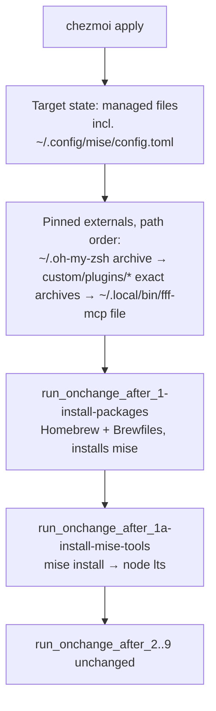

# Declarative Mise Config and Chezmoi Externals - Plan

## Goal Capsule

- **Objective:** A machine owner changes a tool version, a shell plugin, or the fff-mcp binary by editing one declarative source file in this repo; `chezmoi apply` converges the machine. The machine keeps the same tool set, the same deployed paths, and a working zsh startup. Every dependency is pinned: nothing updates without a source edit.
- **Means:** Extend the repo's existing declarative surfaces — a chezmoi-managed mise config for tool versions (KTD1) and pinned archive/file externals in `.chezmoiexternal.toml` (KTD3, KTD4, KTD5) — instead of imperative commands inside run scripts.
- **Authority:** This plan > repo conventions (`CLAUDE.md`, `docs/agent-verification.md`) > implementer discretion. Product behavior questions return to the user.
- **Stop conditions:** Stop and report if the docker oracle contradicts any assumption listed in Assumptions (externals apply ordering, exact-archive adoption, file-external overwrite, node verification in docker, `mise upgrade` config stability, silent second apply) — do not work around a broken assumption silently.
- **Execution profile:** Two independent PRs: U1 first (PR 1), then U2 + U3 (PR 2). Deployment/smoke verification first; no permanent test additions (KTD6).
- **Tail ownership:** Implementer owns the `make test-ubuntu` verdict and the deletion of throwaway checks before each PR.

---

## Product Contract

### Summary

Replace three imperative blocks in `home/.chezmoiscripts/run_onchange_after_1-install-packages.sh.tmpl` with declarative equivalents: the `mise use --global node@lts` call becomes a managed mise config file plus a hash-triggered `mise install` script; the Oh My Zsh installer, four zsh-plugin `git clone` blocks, and the fff-mcp `curl | bash` install become pinned archive/file entries in `home/.chezmoiexternal.toml`. An appendix documents a per-tool protocol for later Brewfile-to-mise migrations without implementing any.

### Problem Frame

Tool versions and cloned dependencies are invisible as data: the node version exists only as a side effect of a script line, and the plugin set exists only as `git clone` commands. Changing either requires editing shell logic instead of a declaration. This came out of a mise-adoption analysis whose verdict was: reject full mise bootstrap, adopt the declarative-over-scripted idea using surfaces the repo already owns.

### Key Decisions

- **Partial adoption of the mise approach — declarative config and externals only, no mise bootstrap surfaces** (session-settled: user-approved — chosen over full `[bootstrap.*]`/`[dotfiles]` migration: that surface is ~2 months GA, has no 1Password secrets story, and no precedent of migrating a live chezmoi setup). Governs R1-R6.
- **No permanent package-inventory tests; throwaway verification only** (session-settled: user-directed — chosen over adding tests for installed packages: the package list is flexible and inventory assertions are source-shape tests the repo doctrine forbids). Governs R8, R9.
- **Two separate PRs, mise slice first** (session-settled: user-approved — chosen over one combined PR: independent revert paths and smaller review surface). Governs the Execution profile.

### Requirements

**Declarative tool versions**

- R1. The node version is declared in a chezmoi-managed mise config deployed to `~/.config/mise/config.toml`, following the LTS channel exactly as the current setup does (the resolved minor version may drift within the channel; that is today's behavior too).
- R2. `chezmoi apply` converges installed tools when the mise config changes, without re-running unrelated package installation.
- R3. The repo documents the convention that tool versions change only by editing the source config, never via `mise use --global`.

**Externals**

- R4. Oh My Zsh and the four zsh plugins (`zsh-autosuggestions`, `fast-syntax-highlighting`, `zsh-history-substring-search`, `zsh-defer`) land at their current deployed paths via `home/.chezmoiexternal.toml`, on both a fresh machine and a machine provisioned by the old script.
- R5. The fff-mcp binary lands at `~/.local/bin/fff-mcp` from a pinned, checksum-verified release, for both macOS and Linux on both architectures.
- R6. `home/.chezmoiscripts/run_onchange_after_1-install-packages.sh.tmpl` no longer installs Oh My Zsh, the plugins, node-via-mise, or fff-mcp; the deprecated `zsh-syntax-highlighting` cleanup block stays.

**Verification**

- R7. `make test-ubuntu` passes on the final state of each PR (deployment-sensitive gate per `docs/agent-verification.md`).
- R8. No permanent test asserts the presence or identity of installed packages, plugins, or binaries; the one existing render assertion on the fff-mcp URL in `tests/bashunit/scripts_test.sh` is updated when its subject moves.
- R9. A second `chezmoi apply` after convergence produces no changes (existing `tests/bashunit/idempotent_test.sh` expectations hold).

**Documentation**

- R10. The plan's appendix protocol for per-tool Brewfile-to-mise migration is preserved in this plan document only; no protocol step is implemented.

### Scope Boundaries

- Out of scope: mise `[bootstrap.packages]`, `[bootstrap.repos]`, `[dotfiles]`, and `mise bootstrap`; any change to which tools or plugins are installed; Oh My Zsh configuration changes; secrets handling.

### Deferred to Follow-Up Work

- Per-tool migration of leaf CLIs from `home/private_dot_config/brewfiles/Brewfile.tmpl` to mise `[tools]`, one tool at a time via the Appendix protocol.
- Extend `update-all` in `home/dot_aliases` to check the pinned external and tool versions against upstream and offer each bump interactively (y/n); replaces the removed `omz update` call. Tracked as a repository issue.
- Capturing the pinned-externals and mise-config-location decisions as a `docs/solutions/` learning after the work lands.

---

## Planning Contract

### Key Technical Decisions

- KTD1. **Mise config is a plain managed file at `home/private_dot_config/mise/config.toml`** deploying to `~/.config/mise/config.toml` with `[tools]` `node = "lts"`. No `.tmpl` suffix: the content has no secrets and no OS branching. This is the exact file `mise use --global` writes today, so the imperative and declarative paths converge on one location (mise docs: `--global` targets `~/.config/mise/config.toml`).
- KTD2. **A separate hash-triggered script `home/.chezmoiscripts/run_onchange_after_1a-install-mise-tools.sh.tmpl` runs `mise install`.** Chosen over folding `mise install` into the install-packages script: a version edit would re-run `brew bundle` (~90s+) there, while a dedicated script re-runs only `mise install`. The name sorts lexically after `run_onchange_after_1-install-packages.sh.tmpl` (`-` < `a`) and before `run_onchange_after_2-…`, so the mise binary from the Brewfile exists before the script runs. The script keeps the existing `command -v mise` guard so CI-minimal environments without mise behave exactly as today.
- KTD3. **Oh My Zsh itself becomes an external at `~/.oh-my-zsh`, replacing the vendor installer.** Required, not optional: chezmoi applies externals as part of the target state, before `run_..._after_` scripts, so plugin externals would create `~/.oh-my-zsh/custom/plugins/*` first — and the vendor `install.sh` aborts when `~/.oh-my-zsh` already exists, leaving a broken half-install on a fresh machine. Making the parent an external puts creation into chezmoi's path-ordered externals pass. The installer's other job (templating `.zshrc`) is already owned by `home/dot_zshrc.tmpl`. OMZ's own self-updater is disabled in the managed zshrc (`zstyle ':omz:update' mode disabled`) so the clone has exactly one owner; the `omz update` call in `home/dot_aliases` `update-all` is removed (superseded by the follow-up in Deferred).
- KTD4. **Every external is pinned: `type = "archive"` at a fixed tag or commit for OMZ and the four plugins, no refresh, no git at runtime.** (session-settled: user-directed — chosen over 168h auto-refresh git-repo externals and over clone-once git-repo externals: shell code sourced at every zsh startup must not track upstream unattended, and git-repo entries cannot pin a revision cleanly — a `--branch <tag>` clone leaves a detached HEAD that a later `git pull` rejects.) Updating a plugin is an explicit source edit of the pinned ref. Consequences: no network after first provision (offline `chezmoi apply` keeps working), no divergence failure mode, and the idempotency expectations of R9 hold by construction. Plugin entries use `exact = true` so adoption on an existing machine replaces the old clone wholesale (stale `.git` removed); the OMZ parent entry stays non-exact so it cannot delete the managed plugin children under `custom/plugins/` — the old parent clone's inert `.git` is removed once by the existing cleanup block in the install-packages script.
- KTD5. **fff-mcp becomes a `type = "file"` external pinned to release v0.10.6 with per-platform sha256 and `executable = true`.** The vendor `install-mcp.sh` is itself a pinned-release binary downloader (assets `fff-mcp-<target>` at `github.com/dmtrKovalenko/fff/releases`, with `.sha256` siblings), so the external replicates it exactly while removing the `curl | bash` trust step. `.chezmoiexternal.toml` is always processed as a template, so the URL and checksum branch on `.chezmoi.os` / `.chezmoi.arch` (darwin/linux × amd64/arm64). Version bumps become an explicit source edit: URL tag plus four checksums. Considered and rejected: declaring fff-mcp in the new mise config via the ubi/github backend — rejected because the binary must stay installable when mise is absent (CI-minimal), and the external carries explicit per-platform checksums the backend does not.
- KTD6. **Verification is the docker oracle plus throwaway checks deleted before each PR** (inherits the session-settled Key Decision on inventory tests). The oracle is `make test-ubuntu` (full disposable-home apply); throwaway checks cover the assumptions below and are removed from the tree before the PR opens.

### Assumptions

Verified empirically during implementation (stop condition if contradicted):

- Chezmoi applies externals in target-path order, so `~/.oh-my-zsh` materializes before `~/.oh-my-zsh/custom/plugins/*`, and a non-exact archive parent leaves the managed plugin children intact.
- An `exact = true` archive external replaces a pre-existing unmanaged git clone at its target path (existing machines carry old plugin clones), and a `type = "file"` external overwrites the pre-existing unmanaged `~/.local/bin/fff-mcp`.
- `mise install` for `node = "lts"` succeeds inside the docker oracle without `MISE_NODE_VERIFY=false` (the GitHub workflow sets it at job level; `docker/docker-compose.yml` does not).
- `mise upgrade` (called by the `update-all` alias in `home/dot_aliases`) does not rewrite the `"lts"` spec in the config file — mise docs state only `--bump` rewrites version strings. Owned by a U1 throwaway check.
- A second `chezmoi apply` after convergence is silent and diff-clean with the pinned externals in place — the existing expectations of `tests/bashunit/idempotent_test.sh` are the owner of this check.

### High-Level Technical Design

Apply sequence after both slices, on a fresh machine:

Existing machines hit the same sequence; the exact plugin archives replace the old clones wholesale, and the file external replaces the unmanaged binary. After first provision the externals are cached — no network on later applies.

---

## Progress

- [x] U1 · declarative mise config + hash-triggered install (PR 1)
- [x] U2 · Oh My Zsh + zsh plugins as pinned archive externals (PR 2, part 1)
- [ ] U3 · fff-mcp as a pinned file external (PR 2, part 2)
- [ ] Finish · se-code-review pass + DoD closeout

---

## Implementation Units

### U1. Declarative mise config with hash-triggered install

- **Goal:** Node version becomes declarative data; the imperative `mise use --global node@lts` is removed.
- **Requirements:** R1, R2, R3. Implements KTD1, KTD2.
- **Dependencies:** none.
- **Files:**
  - `home/private_dot_config/mise/config.toml` (new)
  - `home/.chezmoiscripts/run_onchange_after_1a-install-mise-tools.sh.tmpl` (new)
  - `home/.chezmoiscripts/run_onchange_after_1-install-packages.sh.tmpl` (remove the "Initialize mise" block)
  - `CLAUDE.md` (one-line convention: tool versions change by editing `home/private_dot_config/mise/config.toml`, never `mise use --global`)
- **Approach:**
  1. Create the config with `[tools]` `node = "lts"` and a header comment naming the convention (R3).
  2. Create the script following the install-packages script's conventions: the `# {{`/`}}` comment-delimiter directive, a hash-trigger comment `include`-ing `private_dot_config/mise/config.toml`, `set -e`, `command -v mise` guard, then `mise install`.
  3. Remove the "Initialize mise" block from the install-packages script; leave everything else untouched.
  4. Add the one-line convention to `CLAUDE.md`: tool versions change by editing `home/private_dot_config/mise/config.toml`, never via `mise use --global` (R3).
- **Execution note:** Pure config and packaging — prefer deployment/smoke verification over unit coverage.
- **Patterns to follow:** Hash-trigger comment block and delimiter directive at the top of `home/.chezmoiscripts/run_onchange_after_1-install-packages.sh.tmpl`; `MMS_DISPOSABLE_HOME` skip in `run_onchange_after_9-sync-agent-skills.sh.tmpl` is a known pattern but is deliberately NOT copied — `mise install` must run in the oracle.
- **Test scenarios:** Test expectation: none — deployment-sensitive config change; the oracle and throwaway checks below carry verification (R8 forbids permanent inventory tests). No existing test asserts the removed `mise use` line (verified by grep).
- **Verification:**
  - `make test-ubuntu` passes; inside the run, node resolves through mise (`mise current node` reports an LTS version) — throwaway check, deleted before PR.
  - Second `chezmoi apply` in the oracle produces no output (R9, existing idempotent expectations).
  - Editing the config in a scratch apply re-runs only the new script, not `brew bundle` — throwaway check.
  - `mise upgrade` after install leaves the deployed config still reading `node = "lts"` (Assumptions owner) — throwaway check.
  - Existing-machine adoption: the live `~/.config/mise/config.toml` was written by `mise use` and is unmanaged; `chezmoi apply` will overwrite it. Before the host apply, review `make test-local` diff and move any entries beyond node into the source file first — record this in the PR description.
  - `make lint` passes for the new script.
  - If node verification fails in docker (Assumptions), stop and surface; the likely fix is `MISE_NODE_VERIFY` in `docker/docker-compose.yml`, but that is a finding to report, not a silent workaround.

### U2. Oh My Zsh and zsh plugins as pinned archive externals

- **Goal:** OMZ and the four plugins are declared as pinned archives in `home/.chezmoiexternal.toml`; the script blocks that installed them are removed; the clone has one owner.
- **Requirements:** R4, R6. Implements KTD3, KTD4.
- **Dependencies:** U1 (only for PR sequencing; no code dependency).
- **Files:**
  - `home/.chezmoiexternal.toml` (populate: five `archive` entries)
  - `home/.chezmoiscripts/run_onchange_after_1-install-packages.sh.tmpl` (remove the OMZ-installer block and the four clone blocks; keep the deprecated `zsh-syntax-highlighting` cleanup and extend it to remove the old `~/.oh-my-zsh/.git` once)
  - `home/dot_zshrc.tmpl` (disable the OMZ self-updater: `zstyle ':omz:update' mode disabled`, per KTD3)
  - `home/dot_aliases` (remove `omz update` from `update-all`, per KTD3)
  - `tests/bashunit/scripts_test.sh` (remove the now-stale assertion on the OMZ installer URL and reanchor the test case's positive control on the retained cleanup block)
- **Approach:**
  1. Add `[".oh-my-zsh"]` first (`type = "archive"`, GitHub archive URL at a pinned tag or commit, `stripComponents = 1`, non-exact per KTD4), then the four `[".oh-my-zsh/custom/plugins/<name>"]` entries (`type = "archive"`, pinned ref, `stripComponents = 1`, `exact = true`). Pin each ref to the current upstream release or HEAD commit at implementation time and record the five refs in the entry comments.
  2. Remove the script blocks; extend the retained cleanup block to also delete `~/.oh-my-zsh/.git` if present (old vendor-installer clone metadata, inert once the archive owns the tree).
  3. Disable the OMZ self-updater in `home/dot_zshrc.tmpl` and drop `omz update` from `update-all` — with a pinned archive there must be exactly one writer.
  4. Update `tests/bashunit/scripts_test.sh`: the render assertion on the OMZ installer URL becomes stale when the block leaves the script; remove it and keep the test case's positive control anchored on content that survives (the cleanup block).
  5. There is no in-repo external entry to pattern-match (the file is currently empty); the schema comes from the chezmoi reference (Sources).
- **Execution note:** Verify the fresh-machine ordering assumption (KTD3) before anything else: seed an empty home, apply, and confirm `~/.oh-my-zsh/oh-my-zsh.sh` and all four plugin dirs exist.
- **Test scenarios:**
  - `tests/bashunit/scripts_test.sh` passes after the assertion update (removes coverage of a block that no longer exists; adds none).
  - Throwaway checks, deleted before PR (R8):
    - Fresh docker apply: `~/.oh-my-zsh/oh-my-zsh.sh` exists and each plugin dir contains its `*.plugin.zsh` (zsh startup would fail without them; `home/dot_zshrc.tmpl` sources `zsh-defer` eagerly and defers the other three).
    - Adoption: pre-seed `~/.oh-my-zsh` and all four plugin dirs as shallow (`--depth=1`) clones — the state the old script produced — apply, confirm the exact plugin archives replaced the clones (no stale `.git` in plugin dirs), the parent tree is intact, and zsh starts.
    - Idempotency: a second apply is silent and `chezmoi diff` is empty (owner: existing `tests/bashunit/idempotent_test.sh` expectations).
- **Verification:** `make test-ubuntu` passes end-to-end (externals download once in the fresh oracle; no per-apply network afterward); interactive zsh in the container starts without plugin-sourcing errors.

### U3. fff-mcp as a pinned file external

- **Goal:** The fff-mcp binary is declared, pinned, and checksum-verified; the `curl | bash` block is removed.
- **Requirements:** R5, R6, R8. Implements KTD5.
- **Dependencies:** U2 (same file, same PR; land after the archive entries).
- **Files:**
  - `home/.chezmoiexternal.toml` (add the `[".local/bin/fff-mcp"]` entry)
  - `home/.chezmoiscripts/run_onchange_after_1-install-packages.sh.tmpl` (remove the fff-mcp block)
  - `tests/bashunit/scripts_test.sh` (update the CI-minimal render assertion that expects the `install-mcp.sh` URL in the rendered script)
- **Approach:**
  1. Add the entry with `type = "file"`, `executable = true`, URL `https://github.com/dmtrKovalenko/fff/releases/download/v0.10.6/fff-mcp-<target>` where `<target>` branches on `.chezmoi.os`/`.chezmoi.arch` (darwin/linux × amd64/arm64; map to mise-style rust targets `{x86_64,aarch64}-{apple-darwin,unknown-linux-musl}`), and per-platform `checksum.sha256` taken from the release's `.sha256` assets.
  2. Remove the script block; the target path `~/.local/bin/fff-mcp` must not change — `home/modify_dot_claude.json` and `home/private_dot_config/opencode/opencode.json.tmpl` reference it.
  3. Update `tests/bashunit/scripts_test.sh`: the render assertion on the `install-mcp.sh` URL becomes obsolete when the block leaves the script; remove that assertion rather than repointing it (an assertion on the external entry would be a new inventory test, which R8 forbids). U2 already removed the OMZ-URL assertion from the same test case; keep the rest of the case intact.
- **Test scenarios:**
  - `tests/bashunit/scripts_test.sh` passes after the assertion update (it removes coverage of a block that no longer exists — it adds none).
  - Throwaway, deleted before PR: pre-seed a dummy executable at `~/.local/bin/fff-mcp`, apply, confirm the managed binary replaced it (Assumptions: file external overwrites unmanaged file) and `fff-mcp` is executable.
  - Throwaway: render `.chezmoiexternal.toml` for **all four** platform branches — darwin/amd64, darwin/arm64, linux/amd64, linux/arm64 (template test pattern with `--refresh-externals=never`, see `tests/bashunit/templates_test.sh`) — and confirm each yields the correct asset URL and the sha256 matching the release's `.sha256` sibling. R5 commits to all four; the container executes only one, so the render check is the only pre-ship evidence for the other three.
- **Verification:** `make test-ubuntu` passes; the deployed binary at `~/.local/bin/fff-mcp` executes (`--help` or version exits 0) in the container — throwaway check.

---

## Verification Contract

| Check | Command | Applies to | Gate |
|---|---|---|---|
| Docker oracle (deployment-sensitive) | `make test-ubuntu` | U1, U2, U3 | Required green on each PR's final state (`docs/agent-verification.md`) |
| Shellcheck | `make lint` | U1 (new script) | Required |
| Targeted suite after test edits | `tests/lib/bashunit -j 8 tests/bashunit/scripts_test.sh` | U2, U3 | Required |
| Host diff safety | `make test-local` | all | Recommended before PR; never `chezmoi apply` on the host |
| Throwaway checks | ad hoc, per unit | U1-U3 | Must be deleted from the tree before the PR opens (R8) |

Existing suites must stay green; this plan adds no permanent tests. The oracle run that counts is the one on the final state of each PR.

---

## Definition of Done

- R1-R9 hold; R10 preserved in this document.
- Per unit: the unit's Verification outcomes observed, including the assumption checks it owns.
- Both slices shipped as separate PRs in order (U1, then U2+U3), each with a green `make test-ubuntu` on its final state.
- All throwaway verification code is deleted; no abandoned or experimental code remains in either diff.
- The convention line (R3) is present in `CLAUDE.md`.
- The `update-all` follow-up (version check with interactive bumps) is recorded as a repository issue.
- Reminder recorded in the PR or follow-up notes to sync the chezmoi source clone and run `chezmoi apply` on the host (the repo checkout is not the live chezmoi source).

---

## Appendix

### Per-tool protocol: Brewfile → mise `[tools]` (not implemented by this plan)

One tool per pass, each pass independently revertable (move the line back):

1. **Pick a leaf CLI** from `home/private_dot_config/brewfiles/Brewfile.tmpl` — a self-contained binary with no runtime delegates or services (good first candidates: `fzf`-class tools; bad candidates: anything like ImageMagick with delegate libraries, anything other formulas depend on).
2. **Grep for path coupling** before moving: search `home/` for `/opt/homebrew/opt/<tool>`, `/home/linuxbrew/.linuxbrew/opt/<tool>`, `brew --prefix <tool>`, and the tool's share/completions paths. Any hit means the config expects the brew install layout — fix the reference or skip the tool.
3. **Move the declaration:** delete `brew "<tool>"` from the Brewfile, add `<tool> = "latest"` (or a pin) to `home/private_dot_config/mise/config.toml`.
4. **Verify on both legs:** `make test-ubuntu` green; on macOS, `make test-local` then a host apply by the user; confirm the tool resolves via mise shims (`command -v <tool>` points into mise) and its shell integration still loads.
5. **Measure:** compare `brew bundle` and `mise install` timing for the moved tool (rough wall-clock from the oracle logs is enough); record the delta in the PR.
6. **Revert path:** one-line move back to the Brewfile; mise leaves no state that blocks reinstalling via brew.

### Sources

- chezmoi externals reference (archive/file types, `exact`, `stripComponents`, checksums, template processing, `--refresh-externals`): https://www.chezmoi.io/reference/special-files/chezmoiexternal-format/
- mise config precedence and `--global` target: https://mise.jdx.dev/configuration.html · `mise use`: https://mise.jdx.dev/cli/use.html · `mise upgrade` vs `install`: https://mise.jdx.dev/cli/upgrade.html
- fff-mcp installer (pinned release, per-target sha256, asset naming): https://raw.githubusercontent.com/dmtrKovalenko/fff.nvim/main/install-mcp.sh
- Hash-triggered installer pattern: `home/.chezmoiscripts/run_onchange_after_1-install-packages.sh.tmpl` (Brewfile hash comments)
- Verification doctrine: `docs/agent-verification.md`; test-shape doctrine: `docs/solutions/design-patterns/semantic-regression-tests-over-source-shape.md`
- Current imperative blocks: `home/.chezmoiscripts/run_onchange_after_1-install-packages.sh.tmpl` (OMZ installer, plugin clones, mise init, fff-mcp)
- Consumers pinning the fff-mcp path: `home/modify_dot_claude.json`, `home/private_dot_config/opencode/opencode.json.tmpl`
