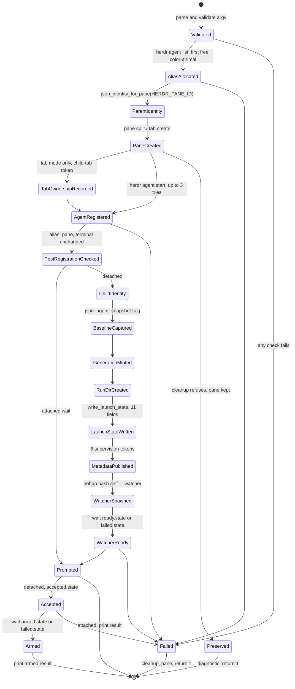
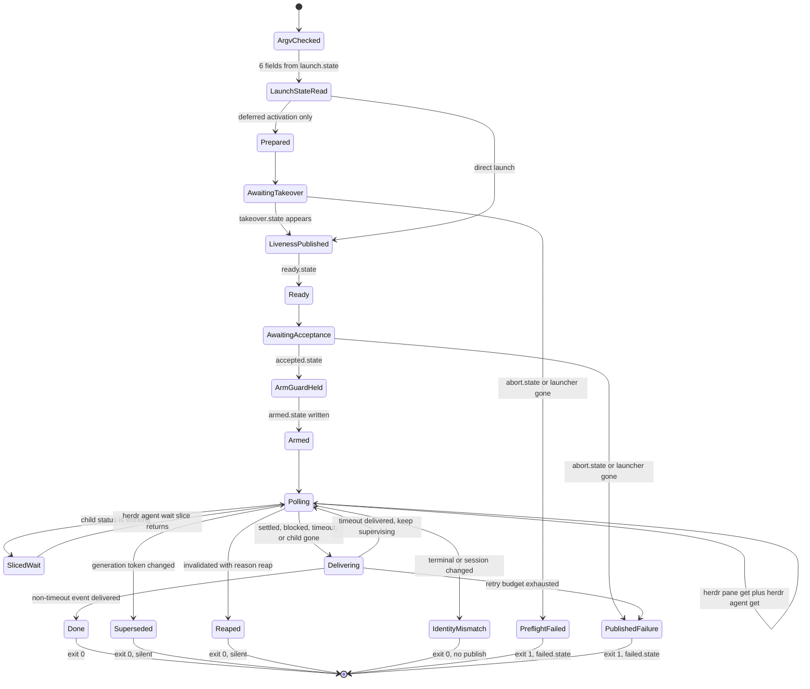
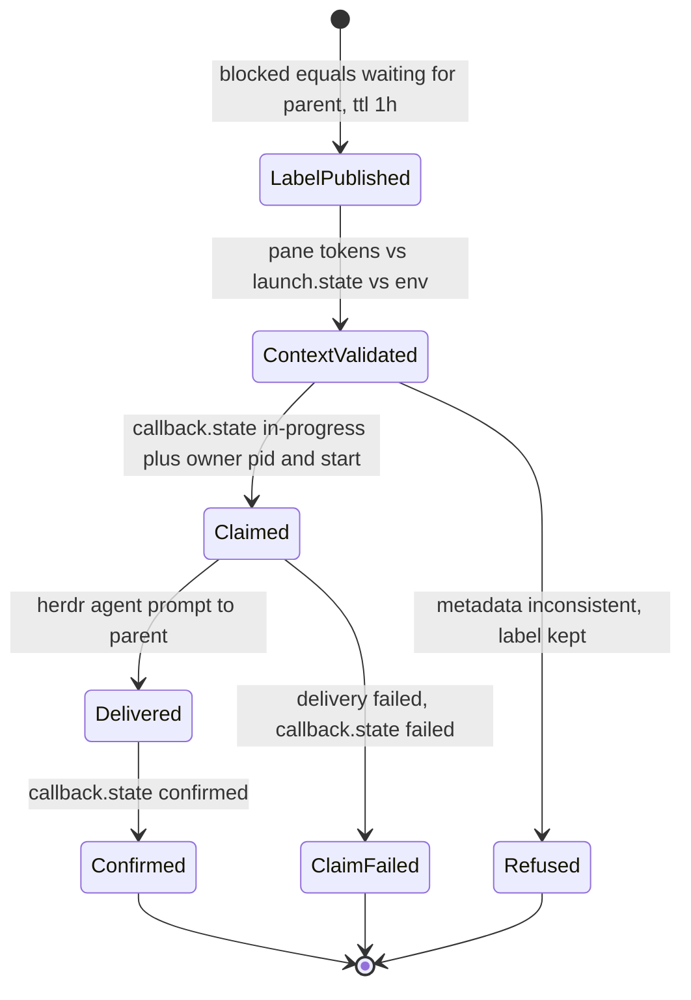
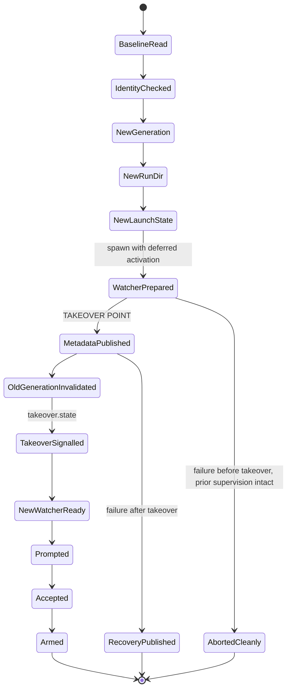
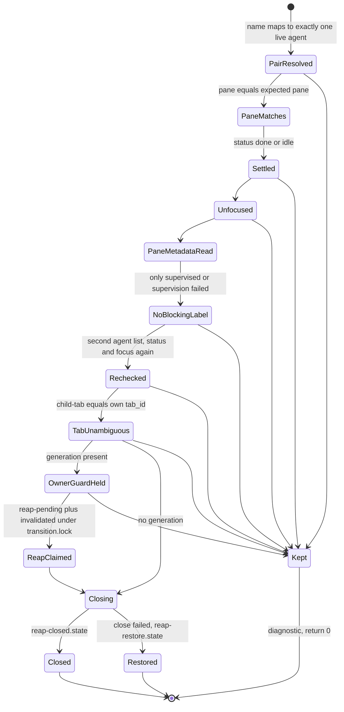

# Herdr Child Lifecycle Simplification - Research

## What this document is

`herdr-child` launches coding agents into sibling Herdr panes and supervises
them after the launching turn ends. Its engine is one entrypoint plus six
sourced Bash modules. This document maps the engine's state machines, measures
where its bulk actually sits, and answers whether the engine can be made
meaningfully smaller without changing what a parent agent observes.

**Headline finding, stated up front so the rest can be read against it: the
engine is close to minimal for what it does.** The behaviour-preserving
simplification ceiling measured here is roughly **2% of 2,778 lines**, rising to
roughly **4%** if a medium-risk consolidation of JSON parsing is also accepted.
The remaining complexity is not accidental duplication. It is the cost of a
multi-process protocol coordinated through a shared directory over an external
CLI that offers no transaction.

Every number below is produced by a command reproduced next to it. Where a claim
is inference rather than measurement it says so. The final section lists what was
not checked.

### Scope note

Three defects previously made the current race behaviour unsafe to treat as a
contract: a superseded watcher could refresh stale liveness metadata, abandoned
callback claims never expired, and transient pane-read failures retried without
bound. All three are resolved and their issue records are closed. The behaviour
described here is therefore the intended contract, not a snapshot mid-repair.

---

## 1. State machine map

The engine runs **six state machines across up to four concurrent OS
processes**: the parent-side launcher, the detached watcher, the child's own
callback caller, and a parent-side reaper. They share no memory. They coordinate
entirely through files in one run directory.

### 1.1 The shared substrate

Supervision state lives at `$STATE_DIR/runs/<generation>/`, where `generation`
is a 32-hex-character nonce minted per supervised run. Measured, the modules
reference **25 distinct artifacts** in that directory:

```bash
# lists every $run_dir/… path and python-side run-dir filename in the modules
python3 - <<'PY'
import re
L="home/dot_local/lib/"
mods=["herdr-child-runtime.sh","herdr-child-supervision.sh","herdr-child-watcher.sh",
      "herdr-child-launch.sh","herdr-child-continuation.sh","herdr-child-reap.sh"]
names=set()
for m in mods:
    s=open(L+m).read()
    names |= set(re.findall(r'\$run_dir/([A-Za-z0-9._${}-]+)', s))
    names |= set(re.findall(r'os\.path\.join\(run_dir, "([A-Za-z0-9._-]+)"\)', s))
    names |= set(re.findall(r'atomic_write\("([A-Za-z0-9._-]+)"', s))
clean={re.sub(r'\$\{?[A-Za-z_]+\}?','<token>',n) for n in names}
for n in sorted(clean): print(" ", n)
print("\ndistinct run-directory artifacts:", len(clean))
PY
```

| Artifact | Written by | Read by | Direction |
|---|---|---|---|
| `launch.state` | launcher / continuation, once, before the watcher starts | watcher, continuation, `ask` | write-once |
| `prepared.state` | watcher | continuation | watcher → parent |
| `ready.state` | watcher | launcher, continuation | watcher → parent |
| `armed.state` | watcher (under `arm.guard`) | launcher, continuation | watcher → parent |
| `failed.state` | watcher | launcher, continuation | watcher → parent |
| `takeover.state` | continuation | watcher | parent → watcher |
| `accepted.state` | launcher / continuation | watcher | parent → watcher |
| `abort.state` | launcher / continuation (under `arm.guard`) | watcher | parent → watcher |
| `arm.guard` | `mkdir` mutex | both | arbitration |
| `invalidated.state` | any superseder, or reap under `transition.lock` | watcher, delivery | epoch revocation |
| `callback.state` | child (`ask`) | watcher | child → watcher |
| `delivered.<event>` | watcher | watcher | idempotence receipt |
| `delivery-pending.state` | watcher, under `transition.lock` | reap | claim |
| `transition.lock` | `flock` | delivery and reap | arbitration |
| `reap-pending.state`, `reap-closed.state`, `reap-restore.state` | reaper | watcher | reap → watcher |
| `reap-owner.lock`, `reap-owner-<token>.{ready,release,gone}` | reap owner guard | watcher | liveness proof |
| `pane-get.err`, `delivery-pane-get.err`, `reap-pane-get.err` | transient stderr capture | same writer | scratch |

**Three ownership invariants hold the whole design together.**

- **I1 — Generation is the epoch token.** Exactly one generation is live per
  child pane at a time. A superseded process discovers this by reading the
  pane's `supervision_generation` token, not by being signalled. Every metadata
  write that could clobber a successor goes through
  `metadata_report_if_generation`, which re-validates generation, terminal, and
  session *inside* the per-pane metadata lock before writing
  (`herdr-child-runtime.sh:125`, `:65`). The check and the write cannot be
  separated by a takeover.
- **I2 — Identity is the triple (pane_id, terminal_id, agent_session).** A pane
  id alone is reusable. Every consumer re-validates all three; a mismatch means
  the pane now belongs to someone else and is fail-closed *without publishing*
  (`watcher_fail_without_publish`), because publishing would write onto a
  stranger's pane.
- **I3 — A claim is only honoured while its owner is alive.** Both the delivery
  claim and the callback claim record `owner_pid` plus the kernel's process
  start timestamp (`process_start_marker`, `herdr-process.sh:21`). PIDs are
  reused; the pair is not. A claim whose owner is gone is expired, not trusted.

### 1.2 Launch machine — `start_child` (`herdr-child-launch.sh:5`)

Parent-side, foreground, runs inside the parent's turn. Attached `--wait` stops
at `prompted`; detached `--detach` continues through the supervision arming
handshake.



The `Failed` and `Preserved` split is the launch machine's real subtlety.
`cleanup_pane` (`herdr-child-launch.sh:166`) never closes a pane it cannot
prove it still owns: it re-lists agents, checks alias ownership or pane
emptiness depending on whether registration succeeded, and re-checks the
terminal id. Any doubt preserves the pane and says so. This is why the launch
module has 17 cleanup call sites rather than one `trap`.

### 1.3 Watcher machine — `watch_child` (`herdr-child-watcher.sh:97`)

Detached, one process per generation, spawned under `nohup` with `set -m` so it
gets its own process group. It is the only machine with an unbounded main loop.



The four distinct terminal exits are the contract's core: **a superseded or
reaped watcher must be silent**, an identity mismatch must be silent *and*
publish nothing, and only a genuine supervision failure may write a failure
label onto the pane.

### 1.4 Callback machine — `ask_parent` (`herdr-child-continuation.sh:219`) and `callback_owner_alive` (`herdr-child-supervision.sh:352`)

Child-side, running inside the child agent's own turn. Its purpose is to stop
the watcher from also waking the parent about the same blockage.



Watcher-side reading of the same three states:

| `callback.state` status | Watcher behaviour |
|---|---|
| `in-progress`, owner alive | suppress the blocked wake, keep polling |
| `in-progress`, owner dead | terminal failure `callback-owner-lost`, **waiting label preserved** |
| `confirmed` | preserve the waiting label, tear down the run, exit 0 |
| `failed` | deliver the blocked event with `preserve_waiting=1` |

The waiting label surviving every one of those branches is deliberate: the child
is still blocked on a human or parent decision, and reap must keep refusing that
pane.

### 1.5 Continuation machine — `managed_detached_prompt` (`herdr-child-continuation.sh:32`)

Parent-side. Replaces a live generation with a new one without ever leaving the
child unsupervised. The ordering is the whole point.



`--deferred-activation` exists solely so the new watcher can be *started and
proven healthy* before the old generation is revoked. Before the takeover point
a failure is free — the old watcher still owns the child. After it, failure must
publish a recovery marker, because the old generation is already dead.

### 1.6 Delivery machine — `deliver_supervision_event` (`herdr-child-watcher.sh:7`)

Runs inside the watcher. Owns idempotence, parent resolution, and the arbitration
against reap.

```mermaid
stateDiagram-v2
    [*] --> ReceiptCheck
    ReceiptCheck --> AlreadyDelivered: delivered.event exists
    ReceiptCheck --> InvalidationCheck
    InvalidationCheck --> ChildRevalidated: not invalidated
    ChildRevalidated --> ParentResolved: identity triple still matches
    ParentResolved --> ClaimTaken: parent not blocked, transition.lock held
    ClaimTaken --> Prompted: herdr agent prompt
    Prompted --> ReceiptWritten
    ReceiptWritten --> [*]: status 0
    AlreadyDelivered --> [*]: status 0
    InvalidationCheck --> ReapSeen: status 13
    InvalidationCheck --> Superseded: status 20
    ChildRevalidated --> ChildGone: status 32
    ChildRevalidated --> Mismatch: status 33
    ChildRevalidated --> PaneReadFailed: status 12
    ParentResolved --> ParentMissing: status 30 or 31
    ClaimTaken --> ParentBlocked: status 10
    Prompted --> PromptError: status 11
```



Statuses 10 and 11 are retryable against a shared budget. 12 charges the
pane-read budget. 13 and 20 are silent terminations. 30, 31, 33, 34 are
immediately terminal.

### 1.7 Reap machine — `reap_children` (`herdr-child-reap.sh:5`)

Parent-side. Nine sequential preconditions, each of which prints a distinct
`kept;` reason and returns 0 — reap never fails loudly, it declines.



The reap owner guard is a background `python3` process holding an exclusive
`flock` on `reap-owner.lock`. It exists so that a *watcher* can distinguish "a
reaper is still working on this" from "a reaper died mid-reap". If the guard's
lock can be taken, the reaper is gone, and the watcher restores supervision
rather than waiting forever.

### 1.8 Where the machines meet

| Boundary | Arbitrated by | Losing side does |
|---|---|---|
| launcher abort vs watcher arm | `arm.guard` (`mkdir` mutex) | launcher reports `uncertain` rather than guessing |
| delivery claim vs reap claim | `transition.lock` (`flock`) | reap keeps the pane; delivery returns 13 |
| old watcher vs new generation | pane `supervision_generation` token | old watcher exits 0 silently |
| watcher wake vs child callback | `callback.state` | watcher suppresses its own blocked wake |
| any writer vs pane metadata | per-pane `metadata-<sha256>.lock` + monotonic `metadata-seq` | write is refused with status 20 |

---

## 2. Measurements

All commands are run from the repository root. Line numbers are as of this
document's commit.

### 2.1 Size

```bash
wc -l home/dot_local/bin/executable_herdr-child home/dot_local/lib/herdr-child-*.sh
```

| File | Lines |
|---|---:|
| `bin/executable_herdr-child` | 54 |
| `lib/herdr-child-runtime.sh` | 465 |
| `lib/herdr-child-supervision.sh` | 521 |
| `lib/herdr-child-watcher.sh` | 464 |
| `lib/herdr-child-launch.sh` | 566 |
| `lib/herdr-child-continuation.sh` | 522 |
| `lib/herdr-child-reap.sh` | 186 |
| **Total** | **2,778** |

Function definitions:

```bash
grep -hE '^[[:space:]]*[a-z_][a-z0-9_]*\(\)[[:space:]]*\{' \
  home/dot_local/bin/executable_herdr-child home/dot_local/lib/herdr-child-*.sh | wc -l
grep -nE '^[[:space:]]+[a-z_][a-z0-9_]*\(\)[[:space:]]*\{' home/dot_local/lib/herdr-child-*.sh
```

**80 functions** in the child engine (plus 2 in the shared `herdr-process.sh`,
for 82 in the reachable set), of which **4 are nested**: `cleanup_pane`
(`launch.sh:166`), `owned_launch_signal` (`launch.sh:194`),
`launch_signal_handler` (`launch.sh:480`), `continuation_signal_handler`
(`continuation.sh:97`). All four nest because they close over launcher-local
state that would otherwise become another dozen globals.

### 2.2 Cross-module call graph

The script is reproduced in full because its conclusions drive section 5.

```bash
python3 - <<'PY'
import re, collections
files=[("entrypoint","home/dot_local/bin/executable_herdr-child"),
 ("runtime","home/dot_local/lib/herdr-child-runtime.sh"),
 ("supervision","home/dot_local/lib/herdr-child-supervision.sh"),
 ("watcher","home/dot_local/lib/herdr-child-watcher.sh"),
 ("launch","home/dot_local/lib/herdr-child-launch.sh"),
 ("continuation","home/dot_local/lib/herdr-child-continuation.sh"),
 ("reap","home/dot_local/lib/herdr-child-reap.sh"),
 ("process","home/dot_local/lib/herdr-process.sh")]
text={m:open(p).read() for m,p in files}
defre=re.compile(r'^[ \t]*([a-z_][a-z0-9_]*)\(\)[ \t]*\{',re.M)
owner={n:m for m,p in files for n in defre.findall(text[m])}
rows=[]
for name,home in sorted(owner.items()):
    callers=collections.Counter()
    for m,p in files:
        n=0
        for line in text[m].splitlines():
            if re.match(r'^[ \t]*'+re.escape(name)+r'\(\)[ \t]*\{',line): continue
            n+=len(re.findall(r'(?<![A-Za-z0-9_./-])'+re.escape(name)+r'(?![A-Za-z0-9_-])',line))
        if n: callers[m]=n
    ext={m:c for m,c in callers.items() if m!=home}
    rows.append((name,home,sum(callers.values()),sum(ext.values()),ext))
print("never called anywhere:",[n for n,h,t,e,x in rows if t==0])
print("exactly 1 call site:",sum(1 for n,h,t,e,x in rows if t==1))
print("2+ call sites:",sum(1 for n,h,t,e,x in rows if t>=2))
print("called only inside own module:",sum(1 for n,h,t,e,x in rows if t>0 and e==0))
for name,home,t,e,x in sorted(rows,key=lambda r:(-r[3],-r[2]))[:12]:
    print(f"{name:36} {home:12} calls={t:3} cross-module={e:3} {dict(x)}")
PY
```

Results:

- **1 function is never called anywhere: `json_has_name`** (`runtime.sh:332`).
- 23 functions have exactly one call site.
- 58 functions have two or more.
- Only **12 of 82 functions are called solely inside their own module.**

The twelve most-shared functions:

| Function | Owner | Calls | Cross-module | Callers outside owner |
|---|---|---:|---:|---|
| `fail_usage` | runtime | 75 | 68 | launch 37, continuation 23, reap 7, entrypoint 1 |
| `watcher_fail` | supervision | 26 | 26 | watcher 26 |
| `state_value` | runtime | 26 | 23 | watcher 10, supervision 8, continuation 5 |
| `atomic_write` | runtime | 25 | 24 | supervision 11, continuation 6, watcher 4, launch 3 |
| `remove_supervision_run` | supervision | 22 | 17 | watcher 11, continuation 3, launch 3 |
| `supervision_reason` | runtime | 11 | 11 | watcher 4, continuation 3, launch 2, supervision 2 |
| `metadata_report` | runtime | 9 | 9 | supervision 4, continuation 3, launch 2 |
| `print_supervision_failure` | runtime | 9 | 9 | continuation 4, launch 3, supervision 2 |
| `now_ms` | runtime | 7 | 7 | watcher 5, continuation 2 |
| `print_start_result` | runtime | 7 | 7 | launch 4, continuation 2, supervision 1 |
| `json_identity_for_pane` | runtime | 6 | 6 | continuation 4, launch 2 |
| `wait_for_watcher_state` | supervision | 7 | 5 | continuation 3, launch 2 |

**Interpretation.** The module split follows a real dependency gradient:
`runtime` ← `supervision` ← {`watcher`, `launch`, `continuation`, `reap`}. The
two lower modules own 66 of 80 definitions and are called from every module
above them. No module is a thin wrapper around another. This is measured, and it
is the single strongest argument against merging modules.

### 2.3 Embedded Python

```bash
# counts python3 -c blocks, their physical extent, and byte-identical duplicates
python3 - <<'PY'
import hashlib
files=["home/dot_local/lib/herdr-child-runtime.sh","home/dot_local/lib/herdr-child-supervision.sh",
 "home/dot_local/lib/herdr-child-watcher.sh","home/dot_local/lib/herdr-child-launch.sh",
 "home/dot_local/lib/herdr-child-continuation.sh","home/dot_local/lib/herdr-child-reap.sh"]
tot=py=0; seen={}
for p in files:
    lines=open(p).read().splitlines(); i=0
    while i<len(lines):
        if "python3 -c" in lines[i]:
            seg=lines[i].split("python3 -c",1)[1]; body=[seg]; j=i; q=seg.count("'")
            while q%2==1 and j+1<len(lines):
                j+=1; body.append(lines[j]); q+=lines[j].count("'")
            tot+=1; py+=j-i+1
            seen.setdefault(hashlib.sha1("\n".join(x.strip() for x in body).encode()).hexdigest(),[]).append(p)
            i=j+1
        else: i+=1
print("blocks:",tot,"physical lines:",py,"distinct bodies:",len(seen))
PY
```

| Metric | Value |
|---|---:|
| Embedded `python3 -c` blocks | **28** |
| Physical lines they occupy | **365** (13.1% of the engine) |
| Byte-identical duplicate blocks | **0** |

Classified by the JSON document each block parses:

| Count | Shape parsed | Sites |
|---:|---|---|
| **11** | `result.agents` (`herdr agent list`) | runtime 184, 233, 334, 343, 351, 376, 386, 396; continuation 314; reap 22, 84 |
| 7 | `result.pane` (`herdr pane get` / `pane split`) | runtime 70, 215, 253, 413; launch 250; reap 58, 110 |
| 4 | no JSON — filesystem, lock, or clock primitive | runtime 134; supervision 51, 422, 466 |
| 2 | `result.root_pane` + `result.tab` | runtime 268; launch 227 |
| 2 | `result.tab` | runtime 281, 454 |
| 1 | `result.agent` (`herdr agent get`) | runtime 197 |
| 1 | `error.code` from a stderr file | runtime 404 |

**No two blocks are byte-identical, but two pairs are semantically redundant**,
confirmed by diff rather than by reading:

1. **`continuation.sh:314` is the exact logical negation of `json_pane_has_no_agent`
   (`runtime.sh:394`).** Same parse, same field, same fallback; the inline copy
   drops the `not`. It is an anonymous predicate re-implementing a named one
   already in scope.
2. **`launch.sh:227` is a strict superset of `json_tab_identity` (`runtime.sh:267`).**
   Both parse the same `tab create` response and validate the same three fields;
   the inline copy prints a 3-tuple where the helper prints a 2-tuple. Both call
   sites are in the *same function's* control flow — `json_tab_identity`'s only
   caller is `owned_launch_signal` at `launch.sh:198`.

### 2.4 Repeated metadata parsing

```bash
grep -hoE 'herdr (agent|pane|tab) [a-z-]+' \
  home/dot_local/bin/executable_herdr-child home/dot_local/lib/herdr-child-*.sh \
  | sort | uniq -c | sort -rn
```

| Invocation | Sites |
|---|---:|
| `herdr agent list` | 10 |
| `herdr pane get` | 9 |
| `herdr agent prompt` | 7 |
| `herdr agent get` | 5 |
| `herdr pane close` | 2 |
| `herdr tab get` | 1 |
| `herdr agent wait` | 1 |
| `herdr agent start` | 1 |
| **Total literal invocation sites** | **36** |

Plus two dynamic invocations (`herdr "${split_args[@]}"`, `launch.sh:223` and
`:246`) for pane split and tab create.

So `herdr agent list` is fetched at 10 sites and parsed by 11 distinct Python
predicates. That is the measured metadata-parsing duplication, and it is the
largest single consolidation target in the engine.

The same is *not* true of metadata publication, which is already centralised:

```bash
grep -nE '(metadata_report|metadata_report_if_generation) ' home/dot_local/lib/*.sh
```

Every write goes through one of three wrappers over the single locked
`metadata_report_checked` — 13 call sites, one implementation. Publication needs
no work.

### 2.5 Retry and wait policy

```bash
grep -nE '(^|[^a-zA-Z])sleep ' home/dot_local/lib/herdr-child-*.sh
grep -nE 'attempt=\$\(\(attempt \+ 1\)\)' home/dot_local/lib/herdr-child-*.sh
```

**24 sleep sites**, in **13 distinct wait policies**:

| # | Policy | Site | Bound | Liveness check |
|---:|---|---|---|---|
| 1 | watcher-state wait | `supervision.sh:9` | 500 × 0.01s | `kill -0` on watcher |
| 2 | arm guard acquire | `supervision.sh:35` | 500 × 0.01s | run dir exists |
| 3 | watcher stop, TERM phase | `supervision.sh:152` | 100 × 0.01s | `kill -0` |
| 4 | watcher stop, KILL phase | `supervision.sh:159` | 100 × 0.01s | `kill -0` |
| 5 | reap invalidation wait | `supervision.sh:196` | **unbounded by design** | owner-lock probe every 100 ticks; liveness refresh every 3000 |
| 6 | reap owner guard ready | `supervision.sh:437` | 500 × 0.01s | `kill -0` |
| 7 | delivery backoff | `supervision.sh:378` | `MAX_DELIVERY_RETRIES` (12), 1s doubling to 15s | budget |
| 8 | deferred takeover wait | `watcher.sh:140` | unbounded | `kill -0` on launcher, `abort.state` |
| 9 | acceptance wait | `watcher.sh:150` | unbounded | `kill -0` on launcher, `abort.state` |
| 10 | watcher main poll | `watcher.sh:462` | unbounded by design | run dir, generation token, budgets |
| 11 | pane-read retry | `watcher.sh:281`, `:398` | `MAX_DELIVERY_RETRIES` (12) × `POLL_INTERVAL` | budget |
| 12 | agent-start retry | `launch.sh:315` | 3 × `PANE_BUSY_RETRY_DELAY` | error code is `agent_pane_busy` |
| 13 | fresh-settlement wait | `continuation.sh:10` | wall-clock deadline | identity triple |

Plus **6 test-only barrier holds**, of which 3 are bounded by
`watcher_hold_expired` (120s default) and **3 are not**:

```bash
grep -nE 'while \[ ! -e .*(BARRIER|RELEASE).*\]; do sleep' home/dot_local/lib/herdr-child-*.sh
```

`launch.sh:243`, `launch.sh:557`, `continuation.sh:329`. **This is already
tracked as an open issue** (bound remaining herdr-child test barriers); it is
recorded here as an observation, not as new scope.

**No two of the 13 policies are interchangeable.** Each differs in bound
mechanism, liveness signal, or failure meaning. Policies 1, 2, and 6 share the
same shape (500 × 0.01s with a liveness probe) but different probes and different
return-code contracts. There is no measured retry-policy duplication to remove.

One genuine finding: **policies 7 and 11 share a single tunable.** Both compare
against `MAX_DELIVERY_RETRIES` while counting independent things — delivery
failures and pane-read failures. Splitting the tunable would be
behaviour-preserving at current defaults but is a configuration change, not a
simplification.

### 2.6 Cleanup

```bash
grep -nE 'cleanup_pane [a-z-]' home/dot_local/lib/herdr-child-launch.sh
grep -nE 'remove_supervision_run ' home/dot_local/lib/herdr-child-*.sh
```

| Helper | Call sites | Distribution |
|---|---:|---|
| `cleanup_pane` | 17 | all in `launch.sh` |
| `remove_supervision_run` | 22 | watcher 11, supervision 5, launch 3, continuation 3 |

The `cleanup_pane` sites cluster into one repeated idiom. Measured extent:

```bash
python3 - <<'PY'
import re
lines=open("home/dot_local/lib/herdr-child-launch.sh").read().splitlines()
tot=n=0
for i,l in enumerate(lines):
    if not re.search(r'cleanup_pane [a-z-]+ \|\| true',l): continue
    j=i
    while j>0 and not (lines[j].rstrip().endswith('|| {') or lines[j].rstrip().endswith('then')):
        j-=1
        if i-j>8: break
    k=i
    while k<len(lines)-1 and lines[k].strip() not in ('}','fi'):
        k+=1
        if k-i>4: break
    if 3<=k-j+1<=10: n+=1; tot+=k-j+1
print("blocks:",n,"physical lines:",tot,"mean:",round(tot/n,1))
PY
```

**16 blocks occupying 98 physical lines, mean 6.1 lines each.** Twelve of them
are the uniform five-or-six-line shape:

```
<operation> || {
  printf 'herdr-child: <diagnostic>\n' >&2
  cleanup_pane <context> || true
  return 1
}
```

Those twelve occupy 63 lines. The other four carry extra branch logic
(`start-failure` also inspects the error code, `watcher-readiness` also stops
the watcher, `prompt-failure` also distinguishes a stall).

`remove_supervision_run`'s 22 sites are **not** a duplication finding: each
appears at a distinct terminal transition with a different accompanying action
(`exit 0` silent, `exit 1` after publishing, `return 1` after cleanup). There is
no common suffix to factor.

### 2.7 Status-code protocol

```bash
grep -hoE '\breturn [0-9]+' home/dot_local/lib/herdr-child-*.sh | sort -n -k2 | uniq -c
grep -hoE 'SystemExit\([0-9]+\)' home/dot_local/lib/herdr-child-*.sh | sort | uniq -c
```

Beyond 0 and 1, the engine uses **13 distinct numeric statuses** as a
cross-function and cross-language protocol: 2, 10, 11, 12, 13, 20, 21, 30, 31,
32, 33, 34, 124. Python `SystemExit` values 2, 3, 4, 10, 20, 34 are consumed by
Bash `case` arms. The 20-family means "superseded", the 30-family "parent
problem", the 32–34 family "child problem".

This is the engine's least readable feature and its most load-bearing one. Each
code corresponds to a different observable outcome, and section 3 shows most of
them are individually tested. It is *not* a simplification target: collapsing
codes would collapse behaviours.

### 2.8 Test coverage

```bash
grep -cE '^function test_scripts_[0-9]+_herdr_child' tests/bashunit/scripts_test.sh
grep -nE '^function test' tests/bashunit/herdr_child_descriptor_probe_test.sh
```

**87 semantic tests** own this engine: 86 in `tests/bashunit/scripts_test.sh`
plus `test_herdr_child_detached_watcher_closes_launcher_descriptors` in
`tests/bashunit/herdr_child_descriptor_probe_test.sh`. Deployment is separately
covered by `test_smoke_1051_herdr_alias_pane_label_and_child_files_are_deployed`
and `test_smoke_1052_herdr_child_and_consult_contracts_use_allocator_owned_p`
in `tests/bashunit/smoke_test.sh`.

Two of the 87 protect the module structure itself:

- `test_scripts_269_herdr_child_modules_source_cleanly_without_source_time_effects`
  — sources each module in order and asserts no shell-state change, no output,
  no function redefinition, and no global mutation at source time.
- `test_scripts_271_herdr_child_shared_lifecycle_primitives_keep_con` — pins
  `write_launch_state`'s eleven positional arguments to the keys `state_value`
  reads back, and pins `wait_for_watcher_state`'s three-way return contract.

A coverage gap worth recording. Measuring which `printf 'herdr-child: …'`
diagnostics have any verbatim fragment asserted in the suite:

```bash
python3 - <<'PY'
import re
tests=open("tests/bashunit/scripts_test.sh").read()
W=16
for name in ["launch","continuation"]:
    src=open(f"home/dot_local/lib/herdr-child-{name}.sh").read()
    msgs=sorted(set(re.findall(r"printf 'herdr-child: ([^'\\]{12,})",src)))
    unc=[m for m in msgs if not any(re.sub(r'%[a-z]',' ',m)[i:i+W] in tests
         for i in range(len(m)-W+1))]
    print(f"{name}.sh: {len(msgs)} diagnostics, {len(msgs)-len(unc)} asserted, {len(unc)} not")
PY
```

At a 16-character fragment threshold: **`launch.sh` has 42 distinct diagnostics,
20 asserted, 22 with no verbatim assertion anywhere.** At a 20-character
threshold the unasserted count rises to 31. The true figure lies between; the
threshold is the only reason it is a range.

This cuts both ways. It means the diagnostic *text* is not an externally pinned
contract, so refactoring the launch error path is safer than it looks. It also
means 22 or more distinct failure explanations have no oracle at all — a reader
cannot tell from the suite whether `detached-baseline-read` and
`detached-baseline-validation` are meant to be distinguishable. What *is*
strongly tested is the behaviour underneath: tests 071–074 assert the presence
or absence of `^pane close wT:p9` in the stubbed Herdr call log, which is an
oracle independent of any string the patch could change.

---

## 3. Removable states and mergeable helpers

Each candidate is paired with the specific existing test that protects it. Where
no test protects it, that is stated.

### C1 — Delete `json_has_name` (dead code)

**Measured:** zero call sites anywhere in the repository.

```bash
grep -rn 'json_has_name' home/ tests/
git log --oneline -S 'json_has_name' -- home/
```

Only the definition at `runtime.sh:332` and two prose mentions in `docs/`. It
became unreachable in `21aaaf0` when semantic task names were replaced by
`color-animal` aliases, and the collision check moved to
`json_validate_agents_and_list_names`. A repository issue already noted it as a
"near-duplicate JSON predicate"; the stronger fact — that nothing calls it — is
measured here.

- **Size:** 8 lines.
- **Protecting test:** none, and none should be written. Deleting unreachable
  code has no behavioural oracle; an absence assertion over source text would be
  a source-shape test. The correct evidence is the zero-call-site measurement
  plus the 87-test suite staying green.

### C2 — Replace the inline predicate at `continuation.sh:314` with `json_pane_has_no_agent`

**Measured:** identical parse and field access, differing only by `not`
(diff in section 2.3).

- **Size:** about 4 lines.
- **Protecting test:** **none.** No test in the repository asserts this branch's
  diagnostic:

  ```bash
  grep -rn 'no live parent occupies' tests/
  ```

  returns nothing. The branch is the attached-mode `ask` path where the recorded
  parent pane no longer holds an agent. `test_scripts_048_herdr_child_attached_ask_follows_captured_parent`
  and `test_scripts_077_herdr_child_ask_leaves_the_label_when_parent_loo` cover
  neighbouring paths but not this one.
- **Therefore this is a proposal to write a test first.** The oracle is
  available and independent: drive `ask` in attached mode with a stubbed
  `herdr agent list` whose agents array contains no entry for
  `HERDR_CHILD_PARENT_PANE`, and assert non-zero exit plus the absence of
  `clear-state-labels` in the stub call log — the waiting label must survive.
  That oracle reads the stub's recorded calls, not the source.

### C3 — Fold `json_tab_identity` and the inline block at `launch.sh:227` into one helper

**Measured:** the same three-field validation of the same `tab create` response,
differing only in projection (section 2.3). `json_tab_identity` has exactly one
caller, `owned_launch_signal` at `launch.sh:198`, and the inline block's caller
is the same function's normal path.

- **Size:** about 8 lines.
- **Protecting tests:** `test_scripts_065_herdr_child_tab_mode_records_ownership_before_st`,
  `test_scripts_066_herdr_child_tab_launch_signal_closes_a_parsed_cr`,
  `test_scripts_068_herdr_child_tab_mode_preserves_malformed_creatio`.
  Test 066 is the important one: it exercises `json_tab_identity` specifically,
  through the signal path that must recover the pane id from a tab-create
  response the launcher had not yet parsed. Test 068 pins the malformed-response
  behaviour that the merged helper must preserve (preserve the tab, report the
  hint).

### C4 — A shared launch abort helper

**Measured:** 16 blocks, 98 lines; 12 of them uniform at 63 lines (section 2.6).

Introducing `abort_launch <context> <message>` that prints the diagnostic and
runs `cleanup_pane <context> || true` collapses each uniform block to a single
`|| { abort_launch ctx 'msg'; return 1; }`. The four non-uniform blocks stay.

- **Size:** roughly 63 lines becoming 24, for a **reduction near 39 lines**, less
  the helper's own 5 lines — call it **~35 lines net**.
- **Protecting tests:** `test_scripts_071_herdr_child_retries_only_the_pane_readiness_star`,
  `test_scripts_072_herdr_child_closes_its_pane_after_three_readines`,
  `test_scripts_073_herdr_child_distinguishes_a_stalled_initial_prom`,
  `test_scripts_074_herdr_child_preserves_a_working_pane_when_the_wa`,
  `test_scripts_027_herdr_child_detached_mode_fails_closed_without_a`,
  `test_scripts_028_herdr_child_detached_mode_closes_only_its_new_pa`,
  `test_scripts_030_herdr_child_detached_arm_failure_preserves_the_c`.
  These assert the pane-close *behaviour* through the stubbed Herdr call log,
  which is the oracle that matters: whether the pane was closed or preserved,
  not what was printed.
- **Caveat, measured:** 22 or more of the 42 launch diagnostics have no verbatim
  assertion (section 2.8). A helper that changes their wording would break
  nothing in the suite. That is a reason to keep the strings verbatim by
  discipline, not a reason to trust the suite to catch a change.

### C5 — Consolidate the 11 `result.agents` parsers (not recommended now)

**Measured:** 11 blocks over 105 physical lines parse the same document shape.

A single `agent_query <mode> [args]` dispatcher could plausibly land in 45–55
lines, for a **~50-line reduction**. Against that:

- The eleven predicates expose **six different exit-code contracts** consumed by
  distinct `case` arms (`json_resolve_parent` alone uses 2, 3, 4).
- The blast radius covers every parent-side command: `start`, `ask`, `reply`,
  `prompt`, `verify`, `reap`.
- The saving is ~1.8% of the engine.
- **Protecting tests exist and are strong** — 048, 052, 055, 075–080, 082–092
  cover the pair-validation and parent-resolution paths — but they are spread
  across every command, so a red/green cycle means running the whole 87-test
  suite for a cosmetic gain.

Recommendation: defer. Revisit only if a *behavioural* change needs to touch
this layer anyway.

### C6 — Merging modules (rejected)

**Measured:** only 12 of 82 functions are called solely inside their own module;
58 have two or more call sites; `runtime` and `supervision` own 66 of 80
definitions and are called from every module above them (section 2.2).

Merging would remove six file headers — about 24 lines — reduce nothing else,
and forfeit the boundary guarantee that
`test_scripts_269_herdr_child_modules_source_cleanly_without_source_time_effects`
provides. That test enumerates the modules by name, so a merge would have to
edit the test's own fixture, which makes it a weak oracle for the merge itself.
Rejected.

### C7 — Removable *states* (none found)

Every state in section 1 was checked against the question "what breaks if this
is removed?". None is removable:

| State | Why it cannot go |
|---|---|
| `prepared.state` | the only signal that a continuation watcher is healthy *before* the old generation dies |
| `ready.state` vs `armed.state` | ready means "supervising"; armed means "the parent's prompt was accepted". A launcher that treated them as one would arm supervision over an unaccepted prompt |
| `takeover.state` | separates "watcher exists" from "watcher owns this child" |
| `accepted.state` | same distinction on the direct-launch path |
| `abort.state` | the only way a foreground launcher can retract a watcher it has already spawned |
| `arm.guard` | the mutex making abort-versus-arm decidable |
| `delivered.<event>` | delivery idempotence across a retried loop iteration |
| `delivery-pending.state` | lets reap see an in-flight delivery it must not race |
| `reap-restore.state` | the only path back from a failed reap to live supervision |
| `reap-owner-<token>.gone` | distinguishes "reaper working" from "reaper died" |
| `callback.state` | prevents a duplicate parent wake for one blockage |

The closest thing to a redundant state is the `ready`/`armed` pair on the
*direct launch* path, where the launcher waits for both in sequence. But the
continuation path genuinely needs them separated by the takeover, and one
watcher implementation serves both.

---

## 4. Bash versus a runtime boundary

### 4.1 What is already depended on

```bash
grep -hoE '(^|[^a-zA-Z0-9_/.-])(python3|herdr|ps|od|jq|awk|sed) ' \
  home/dot_local/lib/herdr-child-*.sh home/dot_local/lib/herdr-process.sh | sort | uniq -c
grep -rn 'jq\|python' home/private_dot_config/brewfiles/
```

| Runtime | Invocation sites in the engine | Status in this repository |
|---|---:|---|
| `python3` | **28** | **declared system requirement**, installed directly by `docker/Dockerfile.ubuntu`, named in `README.md`, deliberately *not* a Homebrew formula because every target OS ships it |
| `herdr` | 36 literal + 2 dynamic | the subject of the integration |
| `ps` | 1 (`process_start_marker`) | POSIX |
| `od` | 1 (`generation_nonce`) | POSIX |
| `jq` | **0** | present in `Brewfile.tmpl` unconditionally, but the engine never calls it |
| `awk`, `sed` | 0 | — |

So the only runtime already carrying the engine's structured-data work is
`python3`, and it is already an owned dependency rather than an accident. `jq`
would be a *new* dependency for this engine even though the formula is
installed, and it cannot do what the four non-JSON Python blocks do anyway.

### 4.2 The Bash 3.2 constraint

The engine ships to macOS system `/bin/bash` (3.2) and to Linux CI/Docker.
Bash-4-only features are unavailable: `declare -A`, `mapfile`/`readarray`,
`${var^^}`, `coproc`, and `printf -v` array targets.

```bash
grep -rn 'declare -A' home/
```

returns only a prose mention in `home/private_dot_claude/CLAUDE.md` — the engine
contains no Bash-4 construct. The constraint has already shaped the code in ways
that are visible and correct:

- `state_value` (`runtime.sh:286`) is a linear file scan because there is no
  associative array to hold parsed key–value state.
- The alias search (`launch.sh:100–111`) walks a candidate *file* rather than
  reading 8,064 entries into an array, with a comment recording that the array
  form cost about 180 ms per launch.
- `herdr-process.sh:7` explicitly reserves descriptor 255 because Bash 3.2 uses
  it for the running script.

Any proposal that reaches for a map, a sorted set, or nested data in Bash is
already excluded. That is part of why 28 Python blocks exist.

### 4.3 The boundary is already drawn, and drawn correctly

The four non-JSON Python blocks are exactly the operations Bash 3.2 cannot do
safely, and they are already on the Python side:

| Block | Lines | Why Bash cannot own it |
|---|---:|---|
| `metadata_report_checked` (`runtime.sh:70`) | 47 | needs `flock` across two locks, a monotonic counter with atomic replace, and generation revalidation *inside* the lock |
| `begin_supervision_transition` (`supervision.sh:51`) | 56 | needs `flock`, atomic `os.replace`, and owner pid+start identity, in one critical section |
| `start_reap_owner_guard` (`supervision.sh:422`) | 14 | needs a non-blocking `flock` held by a live process, released on parent death |
| `reap_owner_recovery_status` (`supervision.sh:466`) | 39 | needs a non-blocking `flock` probe plus conditional multi-file unlink |

Bash has no `flock` builtin, no atomic rename primitive beyond `mv`, and no way
to hold a file lock across a subshell boundary. Those 156 lines are in Python
because they must be.

### 4.4 Could more move behind `python3`?

Two candidates, assessed against the hard constraint that detached supervision
behaviour must not change.

**Candidate A — the JSON predicate layer (18 of 28 blocks).** Already Python.
The open question is consolidation, not ownership; see C5. Verdict: a real but
small opportunity, deferred.

**Candidate B — the deterministic state transitions themselves.** This is the
issue's actual question, and the answer is no. The transitions are not
in-process state changes that a runtime could own. They are *inter-process
facts*: the existence of `armed.state` is observed by a launcher that is a
different OS process from the watcher that wrote it, and often a different
process from the reaper that will later invalidate it. There is no single
long-lived process to host the machine. Moving the watcher loop into Python
would additionally require re-implementing:

- signal traps that write `failed.state` and re-publish metadata before exiting
  (`watcher.sh:133–135`),
- `nohup` + `set -m` process-group semantics so `stop_owned_watcher` can escalate
  `TERM` then `KILL` to the whole group (`supervision.sh:157`, `:165`),
- descriptor hygiene on a detached descendant (`herdr-process.sh:7`), currently
  proven by a dedicated test,
- subprocess supervision of 36 `herdr` invocations.

That is a rewrite of the supervision layer, not a simplification of it — and the
issue's scope explicitly puts behavioural change to detached supervision out of
bounds. **Inference, not measurement:** I did not prototype a Python watcher, so
the claim that it would be larger rather than smaller is reasoned from the
feature list above, not measured.

**A missing interface, recorded rather than worked around.** The delivery-versus-reap
arbitration and the generation-epoch check both exist because the `herdr` CLI
offers no compare-and-swap on pane metadata and no transactional
"prompt-if-still-current". If `herdr` grew a conditional metadata write, the
`transition.lock` machinery and much of `metadata_report_checked` could
collapse. That is a request to make of `herdr`, not something to reimplement
locally.

---

## 5. Staged recommendation

Stages are ordered by risk. Each is independently landable and independently
revertible. Line figures are estimates derived from the measured extents in
section 2, **not from an executed refactor**.

### Stage 1 — Delete dead code (risk: none)

**Change:** remove `json_has_name` (C1).
**Expected reduction:** 8 lines (0.3%).
**Behaviour impact:** none; zero call sites.
**Migration risk:** none.
**Verification:** red/green is not applicable — there is no behaviour to make
fail. The evidence is the zero-call-site measurement, then
`tests/lib/bashunit --filter herdr_child tests/bashunit/scripts_test.sh`,
`tests/lib/bashunit tests/bashunit/herdr_child_descriptor_probe_test.sh`, and
`make lint` all green. **Write no new test**: an assertion that a function is
absent would be a source-shape test with no consumer.

### Stage 2 — Fold the two redundant inline predicates (risk: low)

**Change:** C2 and C3.
**Expected reduction:** ~12 lines (0.4%).
**Behaviour impact:** none intended. C3 must preserve the malformed-response
path exactly (preserve the tab, emit the hint).
**Migration risk:** low, but C2 is currently untested.
**Verification:**
- C3 is red/green today: temporarily break `json_tab_identity`'s validation and
  confirm `test_scripts_066_…` and `test_scripts_068_…` fail; restore; land the
  merge; confirm green.
- C2 has **no protecting test, so the first commit of this stage writes one.**
  Oracle: stub `herdr agent list` with an agents array lacking the parent pane;
  drive `herdr-child ask` in attached mode; assert non-zero exit and that the
  stub call log contains no `clear-state-labels`. That oracle lives in the
  stub's recorded calls — independent of the source this patch changes. Confirm
  it fails against a deliberately inverted predicate before landing the merge.

### Stage 3 — Shared launch abort helper (risk: low-to-moderate)

**Change:** C4.
**Expected reduction:** ~35 lines net (1.3%).
**Behaviour impact:** none intended. Every diagnostic string and every
`cleanup_pane` context label must survive verbatim.
**Migration risk:** moderate, for one measured reason: 22 or more of `launch.sh`'s
42 diagnostics have no verbatim assertion, so the suite will not catch a wording
regression. Mitigation is mechanical — diff the extracted strings against the
pre-change file and require an empty diff.
**Verification:**
- Red first: break `cleanup_pane`'s terminal-identity guard and confirm
  `test_scripts_074_…` (pane must be preserved) and `test_scripts_072_…`
  (pane must be closed) both fail. Restore.
- Land the helper. Green: the full `--filter herdr_child` set, all 86 tests.
- Add a mechanical string-preservation check to the change's own review: extract
  `printf 'herdr-child: …'` literals before and after, require identical sets.
  This is a review step, **not a new test** — a test comparing source strings to
  source strings would have no independent oracle.

### Stage 4 — Consolidate the `result.agents` parsers (risk: moderate; defer)

**Change:** C5.
**Expected reduction:** ~50 lines (1.8%).
**Behaviour impact:** none intended, but the change touches all six commands.
**Migration risk:** the six distinct exit-code contracts are the hazard. A
dispatcher that flattens them silently changes which `case` arm runs.
**Verification:** the full 87-test suite plus `make test-ubuntu`, for a 1.8%
gain. **Recommendation: do not schedule this on its own.** Fold it into the next
change that must touch the agent-query layer for a behavioural reason.

### Stage 5 — Module merging (rejected, not scheduled)

See C6. Measured evidence says it reduces nothing and costs a structural
guarantee.

### Cumulative outlook

| Through | Estimated reduction | Share of 2,778 |
|---|---:|---:|
| Stage 1 | 8 | 0.3% |
| Stages 1–2 | 20 | 0.7% |
| Stages 1–3 | 55 | 2.0% |
| Stages 1–4 | 105 | 3.8% |

**The behaviour-preserving ceiling is about 2%, or about 4% including a
consolidation whose cost exceeds its benefit today.**

### Out of scope, recorded

- The three unbounded test barriers (`launch.sh:243`, `launch.sh:557`,
  `continuation.sh:329`) are tracked by an existing open issue and are not part
  of this recommendation.
- `MAX_DELIVERY_RETRIES` governing two independent budgets (section 2.5) is a
  configuration clarity issue, not a simplification.
- In the watcher's main-loop tail, `now` is captured at `watcher.sh:334` and
  re-read at `:453` only on the sliced-wait path; on the delivery-retry path the
  `next_refresh` comparison at `:458` can use a value up to one retry delay
  (max 15 s) stale. With `SUPERVISED_TTL_MS` at 90,000 ms and a 30,000 ms refresh
  cadence there is 60 s of slack, so this **cannot** expire the liveness label.
  Recorded as observed-and-benign, not as a defect.

---

## 6. The two open decisions

### Decision 1 — Is meaningful simplification possible without changing detached supervision behaviour?

**Answered: no, not meaningfully. Roughly 2% behaviour-preserving, ~4% with a
consolidation not worth scheduling alone.**

The evidence is that the engine's bulk maps one-to-one onto observable contract
behaviour rather than onto implementation choices:

- 87 semantic tests own the engine — roughly one per 32 lines.
- 36 literal `herdr` invocation sites, each a distinct interaction with an
  external process that can fail independently.
- 25 distinct run-directory artifacts, every one of which section 1.8 and C7
  tie to a decidable race.
- 13 distinct wait policies, no two interchangeable.
- 13 distinct numeric statuses, each mapping to a different terminal outcome.
- 15 distinct supervision failure reasons published to pane metadata.
- Only one dead function and two redundant inline predicates in 2,778 lines.

The four searches most likely to find accidental complexity all came back
close to empty: zero byte-identical Python blocks, zero interchangeable retry
policies, one unreachable function, and a module split where only 12 of 82
functions are module-local. A codebase carrying accidental duplication does not
measure like that.

**Where the complexity actually comes from**, and why it is essential: this is a
four-process protocol over a CLI with no transactional primitive. Two of the
processes outlive the turn that created them. Panes, terminals, and sessions are
all independently reusable identifiers, so every actor must re-validate identity
before every write. There is no shared memory, so all coordination is
filesystem-mediated, which means every transition needs a lock, a claim, or an
epoch token. Remove any one of those and a documented race returns.

### Decision 2 — Does Bash remain the lowest-risk owner for every state transition?

**Answered: yes for the transitions; no for the parsing, which is already
Python. The boundary is already in the right place.**

For transitions: the state machine's states are files observed by processes that
never share an address space. Bash's `trap`, `nohup`, process groups, and
`kill -0` are what the launcher, watcher, and reaper actually need, and Bash 3.2
supplies all of them. The four operations Bash genuinely cannot do — `flock`,
atomic replace, monotonic sequencing, and process-start identity — are already
in Python, at 156 lines across four blocks. That split is not accidental and
should not move.

For parsing: 18 of 28 blocks are pure functions of one JSON document and are
already Python. The open question there is consolidation (Stage 4), and it is a
question of line count, not of ownership.

**No new runtime dependency is justified.** `python3` is the only structured-data
runtime the engine uses and is an explicitly declared system requirement of this
repository. `jq` is installed but uncalled, and adopting it would add a
dependency for this engine while still leaving the four lock-and-atomicity
blocks in Python.

**The one thing that would genuinely shrink this engine is not a language
change.** It is a `herdr` API that offers a conditional metadata write. That
would let `metadata_report_checked` and much of the `transition.lock`
arbitration collapse into single calls. That is a request to make upstream, not
a local reimplementation.

---

## 7. Honesty ledger

### Measured

Every table in section 2, and the C1–C6 line counts, come from commands
reproduced in this document and run against this commit. The dead-code finding,
the two redundant-predicate diffs, the 28/365 Python figures, the 13 wait
policies, the 25 run-directory artifacts, the call-graph distribution, the
87-test count, and the diagnostic-coverage range are all measurements.

### Inferred

- **Every line-count reduction in section 5 is an estimate**, derived from the
  measured extent of the code a refactor would touch. No refactor was executed.
  The Stage 3 figure in particular assumes the twelve uniform blocks collapse to
  two lines each; the true figure could be several lines either way.
- The claim in 4.4 that a Python watcher would be **larger** rather than smaller
  is reasoned from an enumerated feature list, not from a prototype.
- The claim that a `herdr` conditional-write API would collapse the transition
  machinery is architectural reasoning; the API does not exist and its shape was
  not designed here.
- C7's "no removable states" is the result of checking each state against a
  removal question. It is a considered negative, not a proof.

### Not checked

- **The test suite was not run against any modified engine.** No red/green cycle
  in section 5 has been executed; they are proposed strategies.
- **No performance measurement.** The 180 ms alias-array figure quoted in 4.2 is
  a comment in the source, not something re-measured here.
- **`herdr`'s own API surface was not audited** for a primitive that could
  replace the arbitration machinery. Section 4.4 asserts one is absent based on
  what the engine works around, not on reading `herdr`'s documentation.
- **The `result.pane` parser family (7 blocks) was not diffed pairwise** the way
  the `result.agents` family was. There may be a redundancy there comparable to
  C2 or C3; it was not looked for.
- **Deployment behaviour was not exercised.** No `chezmoi apply` was run; this
  document changes no code.
- **The three unbounded test barriers were not analysed** beyond confirming they
  exist and are already tracked.
