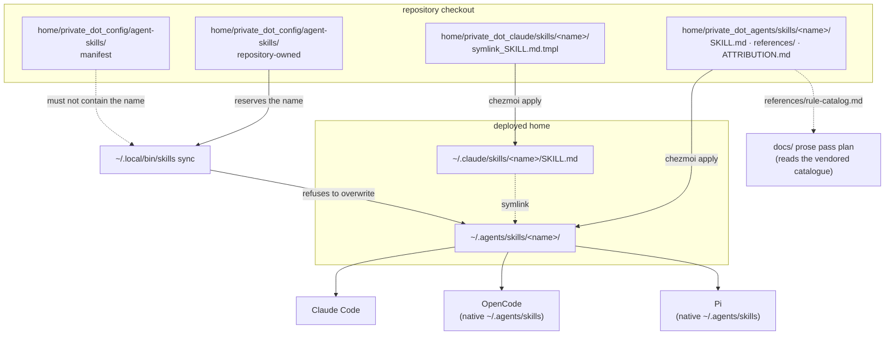

# Document Writing Style Skill - Plan

## Goal Capsule

- **Objective:** When a person asks for a technical document in this environment — a README, runbook, incident report, release note, error-message string, or piece of UI copy — a reader outside the field understands the result on one read, and the rule set is the same whether Claude Code, OpenCode, or Pi produced it.
- **Means:** Fork the document-facing half of the MIT-licensed `simple-english` skill into one repository-owned model-invocable skill (KTD1, KTD2).
- **Authority hierarchy:** The repository `CLAUDE.md` blocks on agent skills and verification outrank this plan. This plan outranks the upstream skill text. Where the new skill and `home/.chezmoitemplates/writing-style.md` disagree, KTD4 decides.
- **Execution profile:** One branch, one pull request. Standard depth, five units, one of them conditional.
- **Stop conditions:** Stop and ask before editing `home/.chezmoitemplates/writing-style.md` (ODEC-5 is the one decision that would change this), before adding an OpenCode command adapter or a Pi symlink adapter, before adding any entry to `home/private_dot_config/agent-skills/manifest`, and before running `chezmoi apply` on the host. Stop and ask if the U4 behavioral check (R16) shows the skill does not improve a real document.
- **Tail ownership:** The implementer owns the branch through `make test-ubuntu`, the R16 behavioral check, and the pull request. The user owns `chezmoi apply` and the client restarts.

---

## Product Contract

### Summary

Add one repository-owned, model-invocable agent skill that governs how technical **documents** get written when a person asks for one. Its body is a trimmed fork of `skills/simple-english/SKILL.md` from `AminBlg/SimpleEnglish` (MIT), pinned at version 2.0.2: the "The Document" register, plus the `use-cases.md`, `word-swaps.md`, and `rule-catalog.md` references. The fork drops the "The Reply" register, `strict-vocabulary.md`, and Strict mode. It cites the always-on writing style instead of restating the sentence-level rules that style already owns, and it states one precedence rule for the places where the two disagree.

The pinned revision is not the version the upstream author audited as useless. It is his rebuild in response to that audit. KTD2 records the audit, the rebuild, and the structural mechanism the rebuild used — moving the rule catalogue out of the always-loaded file rather than deleting rules. This fork copies that shape deliberately (R17). R16 keeps a behavioral gate anyway, because the rebuild's document-side evidence is mixed and its own author reads it as parity rather than as a ranking.

### Problem Frame

`home/.chezmoitemplates/writing-style.md` is always on. It reaches Claude Code as an output style, OpenCode through the `instructions` array in `home/private_dot_config/opencode/opencode.json.tmpl`, and Pi through `home/dot_pi/agent/APPEND_SYSTEM.md.tmpl`. Commit `0c5c33a` extended it with sentence-level language rules ported from ASD-STE100.

That style is written for the reader of an agent message. Its first line claims more — "They also apply to PRs, reports, documents, and every other artifact" — but every rule it carries shapes a turn: what comes first, when to number, how to end, what the pre-send check scans for. It says nothing about the shape of a document artifact: how to tell a procedural passage from a descriptive one, how long a paragraph runs, when a heading is too thin, what pattern an error message or an incident report follows. Documents written under it inherit message habits, most visibly bold lead-ins and a `**Next:**` label in a README where neither belongs.

The claim in that first line is also the source of the conflict this plan must resolve rather than ignore: the style explicitly names error messages, PRs, and documents as its own, and requires formatting on them that a document should not carry.

### Key Decisions

- **Fork, do not track.** The upstream skill is vendored at a pinned revision and diverges on purpose. `Governs R10, R11, R14`
- **Vendor the rule catalogue rather than downloading it at run time** (settles ODEC-2). This skill directory owns the pinned copy of `references/rule-catalog.md`, and the sibling markdown prose pass in `docs/plans/2026-09-08-1712-docs-markdown-prose-ste-pass-plan.md` reads it from there instead of fetching it. That plan now depends on U1 landing. Vendoring also matches how upstream itself resolved the dilution problem: the catalogue is a file loaded on demand, not text held in every turn. `Governs R15, R17`
- **A separate model-invocable skill, not an extension of the always-on style.** The document rules could be appended to `home/.chezmoitemplates/writing-style.md`, which already claims documents and already reaches all three clients through existing wiring. That path is cheaper to build and was rejected on running cost: the style is injected into every turn in all three clients, so the per-artifact patterns and the substitution table would occupy context on every turn that produces no document at all. A model-invocable skill loads only when a document is being written. The upstream rebuild in KTD2 is direct evidence for this: it fixed a diluted skill by moving bulk out of the always-loaded file. `Governs R8, R17`
- **The always-on style keeps every rule it already owns.** The new skill adds document-only rules and cites the rest. `Governs R2, R4, R5`
- **Agent instruction files stay with their current owner.** The upstream `writing-for-agents` skill already owns `AGENTS.md`, `CLAUDE.md`, and skill prose. `Governs R1`
- **Authoring is the primary claim; rewriting is the weaker one.** Upstream issue #29 is an open report that the skill rewrote an existing document by splitting sentences and stripping formatting without removing the underlying phrasing. The plan claims authoring and qualifies rewriting rather than promising both equally. `Governs R1, R16`

### Requirements

**Skill content**

- R1. The skill governs document artifacts: READMEs, runbooks, incident reports and postmortems, release notes and changelogs, error-message and CLI-output text, commit messages and pull-request bodies, and UI copy and empty states. It applies to writing a new document and to rewriting an existing one, and it states that rewriting an existing document is the weaker path: the rules reliably change sentence shape and formatting, and they do not reliably remove entrenched phrasing. It does not govern the agent's own chat turns, and it does not govern agent instruction files.
- R2. The skill carries the parts of the upstream "The Document" register that the always-on style does not already own: passage classification into procedural and descriptive, paragraph limits, first-use definition of a concept term with its product-name exemption, the document formatting rules, American spelling, canonical-term examples, and the warning pattern. The never-touch list and the condition-before-command rule are cited to the always-on style, not restated, because R4 forbids a second copy.
- R3. The skill omits the upstream "The Reply" register, `references/strict-vocabulary.md`, and Strict mode. "The Reply" forbids headers, bullets, and bold and caps a reply at five sentences, which contradicts the numbered steps, bold lead-ins, and `**Next:**` label the always-on style requires.
- R4. The skill does not restate a rule that `home/.chezmoitemplates/writing-style.md` already states. It cites `~/.config/agents/writing-style.md` as that rule's owner.
- R5. The skill states one precedence rule, expressed by where the text ships rather than by artifact-versus-message, so a reader never has to guess which document wins for an error string, a commit body, or a pull-request body.
- R6. The skill treats the upstream 20-word and 25-word sentence limits as a self-check trigger for ordinary prose, and as a hard cap only for runbook steps and UI copy, the two cases the upstream `references/use-cases.md` states as a firm limit.
- R7. The skill carries `references/use-cases.md` and `references/word-swaps.md`. `use-cases.md` drops the Strict-mode-dependent entry and re-points its agent-instruction entry at the rules' real owners. `word-swaps.md` is carried verbatim under a header naming it a superset of the always-on style's filler list; it is a substitution table, not a rule set, so R4 does not require trimming its overlap with that list.
- R15. The skill carries `references/rule-catalog.md` and a CHECK register: the register is not the default, it opens the catalogue before reporting, it never cites a rule number from memory, and it names each violated rule in words with its number in parentheses.
- R17. The always-loaded part of the skill stays small. Every reference file is loaded on demand and never inlined into `SKILL.md`, and the implementer records `SKILL.md`'s token count in the pull-request description so a later reader can see whether the file grew. Upstream's rebuilt `SKILL.md` is 1,825 tokens with the 53-rule catalogue held in a separate file; this fork carries less than that, because R2 and R4 remove the sentence rules the always-on style already loads.

**Packaging and ownership**

- R8. The skill is stored in `home/private_dot_agents/skills/<name>/`, receives a Claude Code symlink adapter under `home/private_dot_claude/skills/<name>/`, and is discovered natively by OpenCode and Pi from `~/.agents/skills`.
- R9. The skill name appears in `home/private_dot_config/agent-skills/repository-owned` and in no entry of `home/private_dot_config/agent-skills/manifest`, so the Skills CLI and chezmoi never claim the same effective name.
- R10. The skill directory carries the upstream MIT license text, the upstream copyright line, the upstream repository URL, the pinned upstream revision, the upstream version number that revision corresponds to, and a statement that the content is modified.
- R11. The skill's `ATTRIBUTION.md` records the refresh procedure, names the repository owner as the person who runs it, and names the trigger: a refresh happens only when someone deliberately opens the upstream repository, never on a schedule and never automatically.
- R14. The pinned upstream revision is recorded as a full commit SHA, not a branch name.

**Documentation and verification**

- R12. `docs/agent-setup-inventory.md` names the new skill under Skill Ownership.
- R13. The change reaches a passing `make test-ubuntu` verdict before the pull request is published, because it adds new managed paths.
- R16. Before the pull request is published, the change carries behavioral evidence, not only deployment evidence. The evidence is produced by the style A/B harness in `tests/style-ab/` (`docs/plans/2026-09-08-1713-test-style-ab-harness-plan.md`) run with a skill-loaded arm, and the verdict is a human reader-value judgement by the repository owner, not a model judge. It covers one authored document and one rewritten document, reported separately per the Key Decision on rewriting. It also records that each of Claude Code, OpenCode, and Pi lists the skill, fires it on a document request, and does not fire it on an ordinary question.

### Scope Boundaries

**Deferred to follow-up work**

- The one-off CHECK pass over `docs/`, owned by `docs/plans/2026-09-08-1712-docs-markdown-prose-ste-pass-plan.md`. That plan consumes the catalogue this plan vendors; this plan runs no pass of its own.
- Test coverage for drift between `home/private_dot_config/agent-skills/repository-owned` and the `home/private_dot_agents/skills/` source tree, and for well-formedness of that manifest. No test anywhere under `tests/` reads the real file. U5 opens a repository issue instead.

**Outside this change**

- Agent instruction files. The upstream `writing-for-agents` skill, installed through `mattpocock/skills writing-for-agents` in `home/private_dot_config/agent-skills/manifest` and deployed at `~/.agents/skills/writing-for-agents/`, already owns skills, `AGENTS.md`, and `CLAUDE.md`. Claiming that class would create a second precedence problem with no rule to settle it.
- A promise that rewriting an existing document removes entrenched phrasing. Upstream issue #29 is open and unresolved on exactly this point. R1 states the limit; U4 measures both paths and reports them separately. Closing this gap is upstream's work, not this plan's.
- Documents an agent produces incidentally inside another workflow, with no user request. A model-invocable skill loads when the model decides to load it, so a README written as a side effect of an implementation task may never reach it. ODEC-5 is the only path that would change this.
- Editing `home/.chezmoitemplates/writing-style.md` or any of its three client adapters, unless ODEC-5 is answered "yes".
- An explicit-only adapter set. This skill is model-invocable, so the `CLAUDE.md` explicit-only block and its `home/.chezmoitemplates/explicit-only-*` pattern do not apply.
- An entry in `home/.chezmoiexternal.toml`. That file carries archives and release binaries. Skills are not managed there.
- An entry in `home/private_dot_config/agent-skills/manifest`. That file selects upstream skills installed by the Skills CLI, which is a different owner from chezmoi.
- Rewriting existing repository documents at scale. The two documents used under R16 are evidence, not a migration.

### Outstanding Questions

Four decisions are open. Each has a recommendation and a default, so an implementer who receives no answer is not blocked. All four are **deferred**, not launch-blocking. ODEC-2 is closed: the repository owner chose to vendor the rule catalogue, and that choice now lives in Key Decisions, R15, R17, and KTD6.

- **ODEC-1 (skill name).** Recommendation: `document-style`. It is descriptive and does not collide with any name in `~/.agents/skills` today. Alternatives considered: `simple-english` (matches upstream, but claims an upstream identity for a fork that drops half of it, and is the name most likely to collide if the manifest ever adds that source), `technical-writing` (broad enough to fire on chat turns), `plain-docs` (vague about what it produces). Note that `validate_manifest_collisions` in `home/dot_local/bin/executable_skills` skips wildcard entries, so a future wildcard install carrying the same name surfaces only at sync time as a hard failure; a name unlikely to appear upstream is worth a little awkwardness. Default if unanswered: `document-style`.
- **ODEC-3 (word limits).** Recommendation: soften. Reasoning in KTD5.
- **ODEC-4 (attribution shape).** Recommendation: one `ATTRIBUTION.md` inside the skill directory. Reasoning in KTD8.
- **ODEC-5 (reciprocal yield in the always-on style).** The new skill yields to the always-on style inside chat turns, but the always-on style never yields back: its first line claims documents, PRs, and error messages, and it is injected unconditionally while the skill loads only on demand. Precedence declared only by the lower-authority document may not hold in practice. Adding one sentence to `home/.chezmoitemplates/writing-style.md` — that its message-formatting rules yield to the document skill inside text that ships in the repository or the product — would make the precedence two-sided and would also give ambient document writing a pointer to the skill. The instrument that settles it is the R16 harness run, so this question is answered after U4, not before. Recommendation: yes, if R16 shows the skill earns it. Default if unanswered: no edit, and the plan's stop condition stands.

### Sources

- Upstream skill: `https://github.com/AminBlg/SimpleEnglish`, MIT, copyright 2026 AminBlg. Pinned at `d88aa463ae075748db1b07d979e077c8841360d2` (2026-09-08), whose `SKILL.md` declares `version: "2.0.2"`. Repository head at plan time: `61ee200efbd423050aab982eed94226229891ae0`.
- `evals/results/WHY-USELESS-2026-09-02.md` — the audit of version 2.0.0. Historical context for KTD2, not a verdict on the pinned version.
- `evals/results/rebuild-2026-09-02/RESULTS.md` — the re-measurement of the rebuilt 2.0.1 that answered that audit. Read its "Limits" section with the numbers; the document rows are one run per cell.
- `CHANGELOG.md` entries for 2.0.1 (2026-09-04 to 2026-09-06) and 2.0.2 (2026-09-08) — the record that `SKILL.md` is 1,825 tokens and that the 53-rule catalogue moved to a reference file.
- Upstream issue #29, "Issues updating existing docs?", opened 2026-09-04, still open — the rewriting limitation R1 records.
- `home/.chezmoitemplates/writing-style.md` — the always-on style this skill must not duplicate. Its first line is the source of the precedence conflict KTD4 settles.
- Commit `0c5c33a` — the commit that ported the ASD-STE100 sentence-level rules into that style. It is the direct evidence for the overlap analysis in KTD3.
- `docs/plans/2026-09-08-1713-test-style-ab-harness-plan.md` — the harness R16 runs on. It lands before U4.
- `docs/plans/2026-09-08-1712-docs-markdown-prose-ste-pass-plan.md` — the CHECK pass that consumes the catalogue U1 vendors.
- `docs/plans/2026-09-08-1714-feat-vendored-prose-lint-target-plan.md` — vendors `ste_lint.py` from the same upstream. See the pin-coherence assumption below.
- `home/private_dot_config/agent-skills/manifest` line 2, `mattpocock/skills writing-for-agents` — the existing owner of agent instruction files.
- `home/dot_local/bin/executable_skills` lines 350 to 400 — `load_repository_owned`, `repository_owns`, and `validate_manifest_collisions`, the collision guard that R9 satisfies.
- `home/private_dot_config/agent-skills/repository-owned` — the name reservation list. No test under `tests/` reads this file.
- `tests/bashunit/smoke_test.sh` test 019 — iterates every directory under `home/private_dot_agents/skills/` and asserts the Claude symlink and canonical `SKILL.md`. This is why U1 and U2 need no new test. It asserts `SKILL.md` only; reference files and `ATTRIBUTION.md` are covered by the U4 deployment diff.
- `tests/bashunit/scripts_test.sh` tests 275 and 277 — exercise `load_repository_owned` and the collision guard against temporary fixtures under `BATS_TEST_TMPDIR`, never against the repository's own manifest.
- `Makefile` line 31, `test-ubuntu: test-issues build-docker` — the dependency that fixes U5's position in the sequence.
- `docs/agent-verification.md` — the risk-class table that selects `make test-ubuntu` for R13.
- `home/private_dot_claude/skills/plan-explainer/symlink_SKILL.md.tmpl` — the one-line adapter pattern U2 copies.

---

## Planning Contract

### Key Technical Decisions

- KTD1. **Package as a repository-owned model-invocable skill.** Store the body at `home/private_dot_agents/skills/<name>/SKILL.md`, add the Claude Code symlink adapter, and reserve the name in `home/private_dot_config/agent-skills/repository-owned`. Rationale: this is the mechanism `CLAUDE.md` names for repository-owned model-invocable skills, and it needs no new wiring. Rejected: the explicit-only three-adapter pattern (the skill must fire on its own when a document is being written, so `disable-model-invocation: true` defeats its purpose), `home/.chezmoiexternal.toml` (that file carries archives and binaries, and pulling upstream unmodified is exactly what the fork rejects), `home/private_dot_config/agent-skills/manifest` (that owner is the Skills CLI, and R9 forbids two owners for one name), and appending the rules to the always-on style (see the Key Decision that owns that rejection). `Governs R8, R9`

- KTD2. **Vendor a fork at a pinned revision; do not track upstream, and record the full evidence trail.** Copy the selected files into the repository, record `d88aa463ae075748db1b07d979e077c8841360d2` as the base, and never wire an automatic refresh. The repository owner runs a refresh only on a deliberate visit to the upstream repository: read `git log d88aa463..HEAD -- skills/simple-english`, decide file by file whether the change touches the kept subset, apply what is wanted by hand, and bump the recorded SHA in the same commit.

  The evidence trail runs in three stages and must be recorded whole, because the first stage alone reads as a reason not to do this work at all.

  **The audit.** `evals/results/WHY-USELESS-2026-09-02.md` measured version 2.0.0 and concluded that its gains were "Grammar obedience, not readability", that "the skill optimizes for `evals/ste_lint.py`, and 50+ rules dilute the 5 that matter", and that an eight-line micro prompt beat the full skill "on everything a reader sees".

  **The rebuild.** The pinned revision is version 2.0.2, which descends from the 2.0.1 rebuild the author wrote in answer to that audit. `evals/results/rebuild-2026-09-02/RESULTS.md` re-measured it. Over two runs of eight reply scenarios the shipped build produced 134 and 158 words, 7.4 and 8.5 sentences, 2 and 3 em-dashes, 0 and 2 bold spans, 0 headers, and 0 and 4 bullets, at linter 1.75 and 1.70. The micro prompt that beat 2.0.0 scored 150 words, 5.8 sentences, 2 em-dashes, 0 bold, 0 bullets, and linter 3.34. The rebuild therefore matched the micro prompt on what a reader sees and beat it on the linter. Pooled visible defects fell from 406 at baseline and 321 at 2.0.0 to 58. A blind pairwise judge preferred the shipped build over 2.0.0 in 14 of 16 pairs, or 28 of 32 when the first draft is pooled in.

  **The document side, which stays mixed.** The rebuild's eight document scenarios scored 4.09 violations per 100 words at baseline against 0.91 for the shipped build, a 77.8% reduction. The audit's first line pointed the other way on a different corpus of fresh generations: 0.00 with no skill against 0.98 and 1.27 with one. The rebuild page is explicit that its document rows are one run per cell and that "one run moves by about 0.5 on this model, so read the document rows as parity or better, not as a ranking". The document evidence is genuinely mixed, and R16 is the guard that does not depend on resolving it.

  The mechanism matters more than the numbers. The author did not distil the rules down to five. He moved the 53-rule catalogue out of the always-loaded `SKILL.md` into an on-demand reference and left 1,825 tokens always loaded. Dilution was cured by structure, not by selection. R17 makes this fork follow the same shape on purpose. `Governs R10, R11, R14, R17`

- KTD3. **Cite the always-on style; do not restate its rules.** The overlap between upstream "The Document" and `writing-style.md` after commit `0c5c33a` is large and specific. Both already own: one idea and one instruction per sentence, condition before action, active voice with a named actor, one term per concept, simple tenses with no present perfect, no `-ing` clause after a comma, no em-dash and no semicolon, no contractions with articles and "that" kept, noun chains longer than three words broken with a preposition, a required "should" becoming "must" and an optional one deleted, explaining an unfamiliar term once at first use, and the never-alter list of code, identifiers, commands, flags, paths, quoted error text, product names, and facts. Restating any of these creates two copies that drift.

  R2 is written to match this rule exactly, so the implementer never has to choose between them. The forked skill states only what is genuinely new: passage classification with its per-class shape, paragraph limits, the sub-ten-word bound on a first-use definition and its product-name exemption, the document formatting rules, American spelling, the canonical-term examples (`make sure that`, `configuration`), the per-artifact patterns in `use-cases.md`, and the substitution table in `word-swaps.md`. Everything else is one line: *"The always-on writing style at `~/.config/agents/writing-style.md` owns the sentence-level rules. This skill does not repeat them."* Removing those rules is also the fork's own contribution to the dilution problem KTD2 describes: the always-loaded text shrinks without any rule being lost, because the style already carries it in every turn. `Governs R4`

- KTD4. **Precedence by destination, not by artifact-versus-message.** Text that ships in the repository or the product follows the skill: READMEs, runbooks, incident reports, release notes, changelogs, error-message and CLI-output strings, commit bodies, pull-request bodies, and UI copy. Inside that text the skill's formatting rules win — no bold lead-ins, no `**Next:**` label, no emoji, no heading covering fewer than three sentences, a vertical list only for three or more parallel items. The agent's own chat turn follows the always-on style unchanged, including its bold lead-ins and its `**Next:**` label. Where the two agree, `writing-style.md` is the owner and the skill cites it.

  The boundary is drawn by destination because the artifact-versus-message split leaves the three artifacts an agent produces most often unresolved: the always-on style's first line explicitly claims error messages, PRs, and documents, and it gives error messages a dedicated section. Naming those three in the rule is what closes the gap. A chat message that quotes or previews a document is still a chat message. `Governs R5`

- KTD5. **Word limits become a self-check trigger, with two hard exceptions.** For ordinary document prose the skill states the numbers as a detector, not a cap: *"A procedural sentence past about 20 words, or a descriptive sentence past about 25, is usually carrying two instructions or two ideas. Split it. Do not pad or truncate to hit a number."* The number's real work is finding a sentence that violates one-idea-per-sentence, which `writing-style.md` already requires, so a hard cap adds enforcement noise without adding a rule. A hard cap also fights the style's own "Cut words, not correctness" rule and produces telegraph style, which upstream rule 6 forbids. Upstream's own audit reached the same place from the other direction: obedience to a sentence counter was the metric it named as the wrong target. Two exceptions keep the hard cap because upstream states the limit firmly for each: a runbook step, which upstream calls "not negotiable" for an operator under pager stress, and UI copy, which upstream gives "hard length limits" because it must fit a control. Error messages are not a third exception: upstream calls them "the highest-value target" but sets no firm number, so they take the trigger and the `use-cases.md` pattern. `Governs R6`

- KTD6. **Vendor the rule catalogue and keep a thin CHECK register.** Settled by the repository owner, closing ODEC-2. `references/rule-catalog.md` ships in this skill directory at the pinned revision, and `SKILL.md` gains at most three lines describing the CHECK register. Two things pay for it. The sibling markdown prose pass now reads the catalogue from here rather than downloading it at run time, so one pinned copy serves both plans and neither drifts. And upstream's rebuild proves the structure is safe: a catalogue held in a file loaded on demand is what let 2.0.1 keep 53 rules without diluting the ones that matter, so keeping it costs nothing in the always-loaded budget R17 protects. The residual risk is unchanged and is handled by wording: ASD-STE100 rule numbers are aerospace compliance vocabulary, so R15 requires each finding to name the rule in words with the number in parentheses. `Governs R15`

- KTD7. **The skill fires on named artifacts, not on a mood.** The `description` frontmatter is the whole trigger surface, and a description that reads as "write clearly" will fire on every turn and fight the always-on style. It must name the artifact nouns, and the generic readability phrases must require an artifact in the same request rather than standing alone. Draft: *"Write or rewrite a technical document so a reader outside the field understands it on one read: READMEs, runbooks, incident reports, release notes, changelogs, error-message text, commit messages, pull-request bodies, and UI copy. Use when the user asks to write, rewrite, tighten, or de-slop one of those artifacts, including when they describe the goal as plain English, no jargon, readable, or written for non-native readers — the request must name one of those artifacts, not only the goal. Does not govern chat replies; the always-on writing style owns those. Does not govern skills, `AGENTS.md`, or `CLAUDE.md`; the `writing-for-agents` skill owns those."* The last two sentences are load-bearing and must survive editing. `Governs R1, R3`

- KTD8. **Name the attribution file `ATTRIBUTION.md`, not `LICENSE` or `README.md`.** `home/.chezmoiignore` carries bare `README.md` and `LICENSE` entries. Chezmoi matches an ignore pattern against the full target path, and the repository already proves a nested one deploys: `home/private_dot_claude/shared/README.md` is managed and deployed. `ATTRIBUTION.md` is still the cheaper choice because it removes the question entirely at zero cost while carrying the same MIT text. U4 confirms the file appears in `make test-local` output either way. `Governs R10`

- KTD9. **Add no new automated test.** The oracle line does not complete for this change. Test 019 in `tests/bashunit/smoke_test.sh` iterates every directory under `home/private_dot_agents/skills/` and asserts both the canonical `SKILL.md` and the Claude symlink, so creating the directory extends existing deployment coverage automatically with no edit. Tests 275 and 277 in `tests/bashunit/scripts_test.sh` already own the repository-owned collision guard generically, through temporary fixtures. The only assertion left available — that the new name appears in the `repository-owned` manifest — would compare two files this same patch writes, which is the inventory anti-pattern the repository test rules and the global test-oracle gate both reject. The genuine uncovered relationship is that no test reads the real manifest at all, which predates this change and is not this change's to fix. U5 routes it to a repository issue. R16's behavioral evidence comes from the style A/B harness and ends in a human judgement, so it is evidence, not a test, and is recorded as such. `Governs R13`

- KTD10. **Prove behavior on the shared harness, not on an ad hoc comparison.** Every check the repository offers proves that files land in the right place. None of them shows that the skill changes what an agent writes. R16 therefore runs on `tests/style-ab/`, the harness the sibling plan lands first, with a skill-loaded arm added — rather than a one-off comparison invented here. Two consequences follow. The verdict is a human reader-value judgement by the repository owner, because the harness supplies paired evidence and deliberately returns no verdict of its own, and because upstream's own blind judge was a model from the same family as the texts it scored. And the run covers an authored document and a rewritten document separately, because upstream issue #29 reports that those two paths do not perform alike and the plan must not average them into one number. `Governs R16`

### High-Level Technical Design

Three owners must stay disjoint on names, and one path carries the content to three clients.

Rule ownership after the change:

| Rule family | Owner | The other documents |
|---|---|---|
| Sentence-level language (tense, voice, modals, punctuation, noun chains, never-alter list, first-use explanation) | `home/.chezmoitemplates/writing-style.md` | Skill cites it, states nothing |
| Message shape (first line, numbering, `**Next:**`, pre-send check) | `home/.chezmoitemplates/writing-style.md` | Skill declares itself out of scope |
| Passage classification, paragraph limits, document formatting, definition bounds, American spelling | The new skill | Style says nothing |
| Per-artifact pattern (error message, runbook, incident report, release note, commit, UI copy) | The new skill, `references/use-cases.md` | Style says nothing |
| Slop-to-plain substitutions | The new skill, `references/word-swaps.md`, superset of the style's filler list | Style keeps its shorter list for messages |
| The 53 numbered ASD-STE100 rules | The new skill, `references/rule-catalog.md`, on demand only | The `docs/` prose pass reads this copy |
| Formatting conflict in text that ships | The new skill, per KTD4 | Style yields inside shipped text only |
| Skills, `AGENTS.md`, `CLAUDE.md` | The installed `writing-for-agents` skill | Both the style and the new skill stay out |

### Assumptions

No synchronous user was present when this plan was written, so these bets were recorded rather than confirmed.

- The four remaining ODEC decisions can be answered at implementation time without reopening the plan. Each carries a default.
- `document-style` is free in the Skills CLI global lock. U2 verifies before the name is committed.
- Pi and OpenCode need no adapter file, because `docs/agent-setup-inventory.md` states they discover `~/.agents/skills` natively and `OPENCODE_DISABLE_EXTERNAL_SKILLS` is deliberately unset. R16 turns this from an assumption into recorded evidence before publish.
- The style A/B harness lands before U4 and can accept a skill-loaded arm without redesign. If it slips, U4 blocks rather than substituting an ad hoc comparison.
- Extra keys in a `SKILL.md` frontmatter block are tolerated by all three clients. U1 avoids relying on this by keeping frontmatter to `name` and `description` and putting the upstream pin in `ATTRIBUTION.md`.
- One register serves every artifact in R1. A commit body read by a teammate and a UI empty state read by a stranger are treated as one audience. `use-cases.md` already varies the pattern per artifact, which is judged sufficient; if the R16 check shows expert-facing artifacts get worse, that is the signal to split the register.
- Two other plans vendor from this same upstream: the prose pass reads `references/rule-catalog.md` from this skill, and `docs/plans/2026-09-08-1714-feat-vendored-prose-lint-target-plan.md` vendors `ste_lint.py`. The pins are allowed to differ, because the linter and the catalogue are separate artifacts with separate reasons to move. If the owner wants one pin across all three, that is a decision to raise before U1 lands, not a defect this plan resolves.
- The implementer has network access to `github.com` at implementation time to fetch the pinned upstream files.

### Sequencing

The style A/B harness lands first; it is a dependency of R16, not of this plan's code. Within this plan, U1 and U2 are independent and may land in either order, but the skill is not discoverable until both exist, so they belong in one commit. U3 follows content. **U5 runs before U4**, because `make test-ubuntu` depends on `test-issues`, so a `docs/issues/` record created after the verdict would invalidate it. U4 verifies the whole set last. The sibling `docs/` prose pass starts only after U1 lands the vendored catalogue.

---

## Implementation Units

### U1. Vendor and trim the skill body

- **Goal:** The forked skill content exists in the repository with correct attribution, and the catalogue the sibling prose pass depends on is in place.
- **Requirements:** R1, R2, R3, R4, R5, R6, R7, R10, R11, R14, R15, R17. Implements KTD2, KTD3, KTD4, KTD5, KTD6, KTD7, KTD8.
- **Files:**
  - `home/private_dot_agents/skills/<name>/SKILL.md` (new)
  - `home/private_dot_agents/skills/<name>/references/use-cases.md` (new)
  - `home/private_dot_agents/skills/<name>/references/word-swaps.md` (new)
  - `home/private_dot_agents/skills/<name>/references/rule-catalog.md` (new)
  - `home/private_dot_agents/skills/<name>/ATTRIBUTION.md` (new)
- **Approach:**
  1. Resolve ODEC-1, or take its default. Fix `<name>` for every later step.
  2. Read `evals/results/rebuild-2026-09-02/RESULTS.md` and the `CHANGELOG.md` entries for 2.0.1 and 2.0.2 at the pinned revision before writing anything, so the structural mechanism in KTD2 is in mind while trimming. Read `evals/results/WHY-USELESS-2026-09-02.md` for the history, and note it audits 2.0.0, not the version being vendored.
  3. Fetch `SKILL.md`, `references/use-cases.md`, `references/word-swaps.md`, and `references/rule-catalog.md` at `d88aa463ae075748db1b07d979e077c8841360d2` into a scratch directory. Do not fetch from `main` or `HEAD`. `ATTRIBUTION.md` is authored, not fetched.
  4. Write `SKILL.md`: frontmatter with `name` and the KTD7 description; a short opening naming the artifacts in R1 and stating the rewriting limit; the citation line from KTD3; the R2 subset of "The Document" with every KTD3 duplicate removed and the never-touch list and condition-before-command rule reduced to citations; the KTD4 precedence rule stated by destination; the KTD5 word-limit paragraph with its two hard exceptions; the upstream before-and-after example; a self-check that scans only for what this skill owns; the R15 CHECK lines; the upstream "Limits" paragraph about marketing copy; and a references list.
  5. Copy `use-cases.md`, dropping the "Translation and localization prep" entry, which is the only entry that depends on Strict mode. Rewrite the "Instructions for AI agents" entry to point at `~/.config/agents/writing-style.md` and the `writing-for-agents` skill rather than restating the no-"should" rule that KTD3 assigns to the style. Soften the error-message entry's word-limit language to match KTD5.
  6. Copy `word-swaps.md` verbatim, adding only a header line naming it a superset of the always-on style's filler list. R7 makes the verbatim copy the correct outcome: a substitution table is data, not a rule, so the overlap with the style's eleven filler words is a superset relationship rather than a duplicated rule.
  7. Copy `rule-catalog.md` unchanged. It is a vendored reference, it is never edited, and the sibling prose pass reads this copy.
  8. Measure `SKILL.md`'s token count and confirm it is below upstream's 1,825. Record the number for the pull-request description, per R17. If it is not below, the KTD3 trimming is incomplete; fix that before continuing.
  9. Write `ATTRIBUTION.md`: the full upstream MIT text, `Copyright (c) 2026 AminBlg`, the upstream URL, the pinned SHA with its date and the upstream version number `2.0.2`, the list of files taken and the list dropped, a one-paragraph statement of modification naming KTD3 through KTD6, pointers to both evaluation pages and to open issue #29, and the KTD2 refresh procedure with its owner and trigger.
- **Test scenarios:** None. `Test expectation: none -- content-only skill prose; deployment is covered by existing smoke test 019, and behavior is covered by the R16 harness run in U4. See KTD9.`
- **Verification:** Read `SKILL.md` against KTD3 and R2 and confirm no rule owned by `home/.chezmoitemplates/writing-style.md` is restated. Confirm the frontmatter carries no `disable-model-invocation` key. Confirm no reference file's content was inlined into `SKILL.md`, per R17. `make lint` does not apply: it runs shellcheck over `*.sh`, `run_*`, and `executable_*` files, none of which this unit produces.

### U2. Register ownership and wire the Claude adapter

- **Goal:** The skill deploys to all three clients and no other owner can claim its name.
- **Requirements:** R8, R9. Implements KTD1.
- **Files:**
  - `home/private_dot_claude/skills/<name>/symlink_SKILL.md.tmpl` (new)
  - `home/private_dot_config/agent-skills/repository-owned` (edit)
- **Approach:**
  1. Confirm the name is free: it must not appear in `~/.agents/skills`, in `${XDG_STATE_HOME:-$HOME/.local/state}/skills/.skill-lock.json`, or in `home/private_dot_config/agent-skills/manifest`. If it is taken, fall back to the ODEC-1 alternatives before writing any file.
  2. Create the adapter with the single line `{{ .chezmoi.homeDir }}/.agents/skills/<name>/SKILL.md`, copying `home/private_dot_claude/skills/plan-explainer/symlink_SKILL.md.tmpl` exactly.
  3. Insert the name into `home/private_dot_config/agent-skills/repository-owned` in alphabetical position. Leave the comment header untouched.
  4. Add no entry to `home/private_dot_config/agent-skills/manifest`.
- **Test scenarios:** None. `Test expectation: none -- smoke test 019 iterates the source tree and extends to this directory with no edit; scripts tests 275 and 277 already own the repository-owned collision guard. See KTD9.`
- **Verification:** Read the edited `repository-owned` file back by hand and confirm one valid name per line, no duplicate, and correct alphabetical position. No automated check covers this: every test that touches `load_repository_owned` points `SKILLS_REPOSITORY_OWNED_MANIFEST` at a temporary fixture, so `scripts_test.sh` validates the parsing and collision logic generically and would not fail on a bad edit to the real file. Run `tests/lib/bashunit -j 8 tests/bashunit/scripts_test.sh` anyway to confirm the guard logic is intact, but do not treat it as evidence for this edit.

### U3. Document the new skill

- **Goal:** A person reinstalling this setup finds the skill and its ownership without reading the source tree.
- **Requirements:** R11, R12.
- **Files:** `docs/agent-setup-inventory.md` (edit)
- **Approach:** Add one sentence under "Skill Ownership" naming the skill, its purpose in one clause, and the fact that it is a pinned MIT fork whose attribution and refresh procedure live in the skill's own `ATTRIBUTION.md`. Add a second sentence stating that `writing-for-agents` keeps ownership of skills, `AGENTS.md`, and `CLAUDE.md`. Add a third naming the vendored `references/rule-catalog.md` as the copy the `docs/` prose pass reads. Do not restate the refresh procedure; KTD2 and `ATTRIBUTION.md` give it one owner. Do not add a `CLAUDE.md` block: the existing agent-skills block already covers this skill's mechanism.
- **Test scenarios:** None. `Test expectation: none -- documentation edit with no runtime consumer.`
- **Verification:** Read the edited section and confirm it does not contradict the existing paragraph on `eli5` and `open-questions`, which are explicit-only and are not the pattern this skill follows.

### U4. Verify deployment, discovery, and behavior

- **Goal:** The new managed paths deploy correctly, all three clients find and fire the skill, and the harness shows the skill improves a real document.
- **Requirements:** R13, R16. Implements KTD10.
- **Files:** None. The harness inputs and outputs live under `tests/style-ab/`, which the sibling plan owns.
- **Approach:**
  1. Run `make test-local` as a one-shot Bash call with a transport timeout large enough to reach its own verdict. Confirm the diff shows `.agents/skills/<name>/SKILL.md`, each of the three reference files, `ATTRIBUTION.md`, and `.claude/skills/<name>/SKILL.md` as a symlink. Confirm `ATTRIBUTION.md` is present and not swallowed by an ignore rule, per KTD8.
  2. Run `make test-ubuntu`. It is a long-running Docker workload: read `~/.claude/shared/long-running-work.md` first, and when `HERDR_ENV=1` launch it in a visible sibling Herdr pane with a persisted exit marker rather than in the Bash tool. Report the verdict; a failed or incomplete run blocks the pull request.
  3. Hand off host deployment, which is the user's step: commit here, `git pull` in `~/.local/share/chezmoi`, `chezmoi apply`, then restart Claude Code, OpenCode, and Pi from the managed zsh environment.
  4. R16, discovery leg. In each of Claude Code, OpenCode, and Pi: confirm the skill is listed; confirm a document request fires it; confirm an ordinary question does not. Record the three results. Deployment evidence alone does not satisfy this — the skill can deploy and still fail to load or fail to trigger.
  5. R16, authoring leg. Run the `tests/style-ab/` harness with a skill-loaded arm over prompts that ask for a new document. This is the primary claim, so it is measured first and reported first.
  6. R16, rewriting leg. Run the same harness over prompts that ask for an existing repository document to be rewritten — a `docs/solutions/` entry is a good size. Report it separately from the authoring leg. Upstream issue #29 predicts a weaker result here: rules applied, sentences split, formatting stripped, entrenched phrasing left in place. Record what actually happens rather than assuming either outcome.
  7. The repository owner judges both legs for reader value. The harness supplies paired evidence and returns no verdict, and no model judge substitutes for the human one. If the authoring leg does not improve, stop and raise it rather than publishing. If only the rewriting leg is flat, that is the predicted result: publish, and confirm R1's stated limit matches what was observed.
- **Test scenarios:** None. `Test expectation: none -- this unit runs existing canonical checks and a harness-supported human judgement; it adds no code.`
- **Verification:** One successful `make test-ubuntu` verdict on the final state of the branch, plus the three recorded discovery results and the two recorded harness legs with the owner's judgement on each.

### U5. Open a repository issue for manifest coverage (conditional)

- **Goal:** The uncovered relationship KTD9 names is recorded rather than forgotten.
- **Requirements:** None. Follow-up work.
- **Files:** `docs/issues/` (new record, created through `python3 scripts/issues`)
- **Approach:** Load the `repository-issues` skill and apply its ownership gate first. If the gate passes, record: no test under `tests/` reads the real `home/private_dot_config/agent-skills/repository-owned` file, so neither manifest well-formedness nor drift against `home/private_dot_agents/skills/` is checked anywhere; a missing or malformed line leaves a skill unprotected, so a wildcard install through `skills sync` can overwrite its canonical tree and record an upstream lock claim over it; the honest fix is a semantic check that exercises the real `skills` wrapper against a stubbed `npx`, in the shape of existing scripts test 277, not a file-to-file comparison. If the gate fails, skip the unit and say so.
- **Test scenarios:** None. `Test expectation: none -- issue record, no runtime behavior.`
- **Verification:** `make test-issues`.

---

## Verification Contract

| Check | Command | Applies to | Gate |
|---|---|---|---|
| Skills CLI logic | `tests/lib/bashunit -j 8 tests/bashunit/scripts_test.sh` | U2 | Must pass. Validates the collision guard through temporary fixtures only; it does **not** read the repository's own `repository-owned` file, so it is not evidence for U2's edit |
| Manifest read-back | Manual read of `home/private_dot_config/agent-skills/repository-owned` | U2 | One valid name per line, no duplicate, alphabetical position. This is the only check covering the edit |
| Always-loaded size | Token count of `SKILL.md` | U1, R17 | Below upstream's 1,825 tokens; the number is recorded in the pull-request description |
| Issue validation | `make test-issues` | U5 | Must pass if U5 runs. Runs before U4 so the `test-ubuntu` verdict covers the issue record |
| Source-to-home diff | `make test-local` | U4 | Must show every new managed path, including all three reference files and `ATTRIBUTION.md` |
| Full apply in Docker | `make test-ubuntu` | U4 | Required before publish; deployment-sensitive class |
| Three-client discovery | Manual, after host apply and restart | U4, R16 | Each of Claude Code, OpenCode, and Pi lists the skill, fires on a document request, and stays silent on an ordinary question. Results recorded |
| Authoring behavior | `tests/style-ab/` harness, skill-loaded arm, new-document prompts | U4, R16 | The repository owner judges the skill arm better for reader value, or the work stops |
| Rewriting behavior | `tests/style-ab/` harness, skill-loaded arm, rewrite prompts | U4, R16 | Reported separately. A flat result is the predicted outcome and confirms R1's stated limit rather than blocking |
| Pull-request CI | Ubuntu and macOS jobs | All | Both must pass before merge |

`make lint` is not listed: it runs shellcheck over `*.sh`, `run_*`, and `executable_*` files plus `check_bats_assertions.py`, and this change produces none of those.

Risk class is **deployment-sensitive** under `docs/agent-verification.md`, because the change adds new managed paths and a new `.tmpl`. A `make test-suite` run is not substitute evidence: it reads the already-applied `~/`, which this branch has not reached.

## Definition of Done

**Global**

- The skill deploys to `~/.agents/skills/<name>/` and is symlinked from `~/.claude/skills/<name>/SKILL.md` in `make test-local` output.
- The name appears in `home/private_dot_config/agent-skills/repository-owned` and in no manifest entry, confirmed by read-back.
- `SKILL.md` restates no rule owned by `home/.chezmoitemplates/writing-style.md`, and states the KTD4 precedence rule once, by destination, naming error messages, commit bodies, and pull-request bodies.
- `SKILL.md` excludes skills, `AGENTS.md`, and `CLAUDE.md` from its scope in its own description, and states the rewriting limit from R1.
- `SKILL.md` is below 1,825 tokens, no reference content is inlined into it, and the count is in the pull-request description.
- `references/rule-catalog.md` is vendored unchanged at the pinned revision, so the sibling `docs/` prose pass can read it.
- `ATTRIBUTION.md` carries the MIT text, the copyright line, the upstream URL, the full pinned SHA, the upstream version `2.0.2`, the modification statement, pointers to both evaluation pages and open issue #29, and the refresh procedure with its owner and trigger.
- `docs/agent-setup-inventory.md` names the skill, the `writing-for-agents` boundary, and the vendored catalogue.
- One successful `make test-ubuntu` verdict exists for the final branch state, taken after U5.
- The three-client discovery results are recorded, and both harness legs are recorded with the owner's judgement on each.
- No new test file and no new test case were added, and KTD9 records why.
- No abandoned scratch copy of the upstream files remains in the working tree.
- `home/.chezmoitemplates/writing-style.md` and its three client adapters are unchanged, unless ODEC-5 was answered "yes" after the R16 run and the user approved the edit.

**Per unit**

| Unit | Done when |
|---|---|
| U1 | Five files exist, the token budget holds, and a read-through against KTD3 and R2 finds no duplicated style rule |
| U2 | Adapter and manifest line exist, the name is confirmed free in the Skills CLI lock, the manifest read-back passes, and `scripts_test.sh` still passes |
| U3 | Inventory names the skill, the `writing-for-agents` boundary, and the vendored catalogue, without duplicating the refresh procedure |
| U5 | Issue exists and `make test-issues` passes, or the ownership gate failed and that is stated |
| U4 | `make test-local` shows every path, `make test-ubuntu` returns a passing verdict, and all three R16 legs are recorded |
