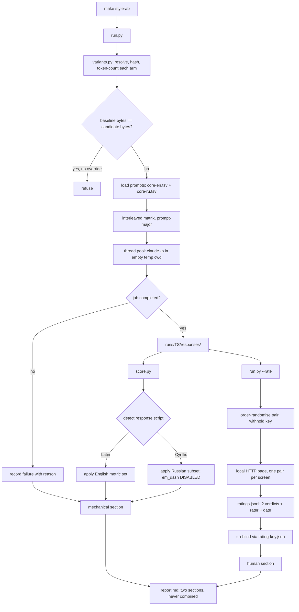

# Style A/B Harness - Plan

## Goal Capsule

- **Objective:** a reviewer can check a change to the shared agent writing style against evidence — mechanical counts of what it did to the prose, in both languages the agent writes, plus a blind human read of whether the answers got easier to act on — months after the change was written, without the author being present.
- **Means:** port the working scratchpad A/B harness into `tests/style-ab/` as a manually invoked Python CLI with two independent legs: a deterministic language-aware counter and a blind pairwise human rating loop (KTD1, KTD2, KTD9).
- **Authority:** `home/.chezmoitemplates/writing-style.md` is the measured artifact and is not edited by this work. `docs/agent-verification.md` owns which checks a change must run. This plan owns only the harness, its documentation, and its isolation from CI.
- **Stop conditions:** stop before building any Russian morphological analyser (KTD8). Stop before combining the human and mechanical legs into one score (R21). Stop before taking the report exemption silently — it is claimed and enumerated, never assumed (R37).
- **Execution profile:** one PR. No managed path under `home/` changes, so the risk class is checkout logic, not deployment-sensitive.
- **Tail ownership:** the implementer runs `make test-issues`, `make lint`, and the reference runs; the repository owner is the rater and owns OQ2 through OQ7.

---

## Product Contract

### Summary

Move the A/B evaluation harness for the agent writing style out of a session scratchpad and into `tests/style-ab/`. The harness runs three arms of headless `claude` over a fixed bilingual prompt set and reports two things that are never combined: deterministic counts of mechanical prose defects, and a blind human verdict on which answer is easier to act on.

The port makes four changes to the scratchpad version. It resolves its arms from git refs and the working tree rather than frozen copies, so it compares whatever the next style edit actually is. It routes each response by detected script and applies only the metrics valid for that language, so Russian output is measured rather than dropped. It replaces the discarded model judge with a blind, order-randomised human rating loop the owner completes in about five minutes. And it quarantines what it genuinely cannot measure — failed jobs, half-complete pairs, metrics with no meaning in the response's language — instead of scoring them as zero.

### Problem Frame

Commit `0c5c33a` rewrote the sentence-level rules in `home/.chezmoitemplates/writing-style.md` and justified the rewrite with numbers: em-dashes down 77 percent, semicolons down 100 percent, filler down 43 percent, contractions down 32 percent, at equal word count with 12 percent more sentences. Those numbers came from a harness in `/private/tmp`. The harness dies with the session that made it.

The style will be edited again. The next editor has two options today: assert that the edit is an improvement, or rebuild the harness. `docs/solutions/design-patterns/measure-the-cost-prove-the-equivalence.md` already names this fork and its answer: a throwaway harness "is not defensible if the rewrite is expected to be revisited. Decide which case you are in, and say so." This is the revisited case.

Three problems shape the design.

**A mechanical counter can be gamed by the rules it counts, and the failure has been observed and then fixed in a comparable project.** The author of the `simple-english` skill audited their own work at `evals/results/WHY-USELESS-2026-09-02.md` (commit `d88aa463`) and found version 2.0.0 winning only on its own linter: over eight reply scenarios, the 50-rule skill scored 2.65 violations per 100 words against an eight-line micro prompt's 3.34, while the micro prompt produced 5.8 sentences, 2 em-dashes, 0 bold spans and 0 bullets against the skill's 13.4, 17, 24 and 22. The reader-preferred condition scored worse. The stated cause was dilution: "the skill optimizes for evals/ste_lint.py, and 50+ rules dilute the 5 that matter."

That finding is now historical. The author rebuilt in response, and `evals/results/rebuild-2026-09-02/RESULTS.md` records the result: shipped 2.0.1 reached 134 and 158 words, 7.4 and 8.5 sentences, 2 and 3 em-dashes, 0 and 2 bold spans, 0 headers, 0 and 4 bullets, at 1.75 and 1.70 violations per 100 words — roughly half the micro prompt's linter score while matching it on the reader-visible columns in run 1 and coming close in run 2. Pooled visible defects fell 81.9 percent against 2.0.0. A blind pairwise judge run in both orders with no labels preferred the shipped 2.0.1 over 2.0.0 in 14 of 16 pairs across two runs, with no ties.

**The mechanism of the fix is the part that generalises, and it applies here.** The author did not cut to five rules. He moved the 53-rule catalogue out of the always-loaded `SKILL.md` into an on-demand reference, leaving 1,825 tokens always loaded. Dilution was cured structurally, by what sits in context on every turn, not by deleting rules. This repository's `home/.chezmoitemplates/writing-style.md` is 234 lines and is always loaded through all three adapters, which is the same shape the audit condemned — so the question is live here, the remedy is known, and the harness should be able to see it. That is why R11 records each arm's always-loaded token count and why the micro-prompt arm is the recommended next measurement.

So the Goodhart risk is real, has a known structural remedy, and is not currently an indictment of the upstream tool. The guard stays; the framing is past tense.

**The pairwise model judge could not separate brevity from information loss.** In its first generation, 7 of 7 "information loss" flags landed on whichever answer was shorter. A second generation declared length not to be quality and required an exact quote for every claimed missing item; the longer answer still won 8 of 9 non-tie pairs. Neither generation ran the two controls that would have separated bias from accuracy — a swap-consistency gate, and a word-count restriction on which pairs are judged. The honest status is unvalidated, not disproven. The difference from the upstream rebuild is precise and worth naming: both harnesses randomised presentation order, but the upstream judge scored *every pair in both orders* and this one drew one order per pair, so a verdict here was never required to survive the swap that would have exposed a positional or length preference. The protocol failed, not the idea. This harness replaces the judge with a human rater running the upstream's blind both-orders shape, which removes the length-bias question entirely.

**A large share of the agent's real output is Russian, and the scratchpad harness could not see any of it.** The style carries the rule "Match the reader's language: answer in the language the reader used", and this repository's owner writes Russian. Six of the thirteen metrics are English-morphology and return a structural zero on Cyrillic text — verified directly: contractions, present perfect, the `-ing` clause after a comma, the filler list, forbidden openers, forbidden closers all return 0 on a Russian sample containing none of those constructions and no defects either. One metric is actively inverted: the em-dash is normative Russian punctuation that replaces an omitted copula, introduces a generalisation, and marks direct speech, so counting it scores correct Russian as defective. That single counter is the worst failure mode available here. The rest — word count, sentence count, semicolons, bold, headers, bullets — tokenise correctly on Russian: a 64-word, 9-sentence Russian sample split at exactly the right nine boundaries.

### Requirements

**Harness placement and invocation**

- R1. The harness lives in `tests/style-ab/` and is invoked as `python3 tests/style-ab/run.py`.
- R2. `make style-ab` is the canonical invocation. The target name does not begin with `test-`.
- R3. A run executes three arms: an empty-system-prompt control, a baseline, and a candidate. Baseline and candidate are arguments, each resolving from a git ref, a file path, or the working tree.
- R4. A run writes one directory under `tests/style-ab/runs/<UTC timestamp>/` holding raw responses, `scores.json`, `ratings.jsonl`, `rating-key.json`, and `report.md`.
- R5. `run.py` refuses to start when the resolved baseline and candidate bytes are identical, printing both resolutions and the override. `--allow-identical` overrides it and is how an A/A calibration run is taken.
- R6. Every `claude` job runs with its working directory set to an empty temporary directory outside any repository, so no `CLAUDE.md` is auto-discovered into any arm.

**Bilingual measurement**

- R7. The prompt set has an English half and a Russian half. Prompt ids are aligned across languages (`p1` / `p1-ru`) so the same task can be compared across languages.
- R8. Every prompt is self-contained: answerable with no repository, no file, and no prior turn. This binds both halves equally.
- R9. `score.py` routes each response by detected script and applies only the metrics valid for that language. A metric that does not apply is reported as "not measured for this language", never as zero, and never enters an aggregate.
- R10. The em-dash counter is **disabled** for Russian responses — not inverted, not counted, not reported as a defect. The dash is normative Russian punctuation.
- R11. The report header records each arm's always-loaded token count, so a rule set that grows without changing behaviour is visible.
- R12. `language_match` is a metric: a response whose script does not match its prompt's declared language is counted and reported, because the style's own "match the reader's language" rule is what it measures.

**The human rating leg**

- R13. Rating is blind. The rater sees two responses labelled A and B and is never told which arm produced which.
- R14. Presentation order within each pair is randomised from a rating seed independent of the job-order seed. The mapping is written to `rating-key.json`, which the rating interface never serves and which is read only at report time.
- R15. Two fixed questions per pair, whose exact wording is stored in `ratings.jsonl` so a later run can detect that it changed:
  - "Which response gets you to the next action faster, with less re-reading?" — A / B / no difference.
  - "Does either response leave out something important that the other has?" — A / B / neither.
  Plus an optional one-line free-text note. There is no numeric scale.
- R16. `run.py --rate <run dir>` serves one pair per screen on a local stdlib HTTP server with single-key bindings, and writes each verdict to `ratings.jsonl` as it is given. Rating is resumable: a re-invocation skips pairs already rated.
- R17. The default rating batch is 8 pairs, sampled deterministically from the run and stratified across prompts and languages. `--all` rates every pair.
- R18. Each verdict records the rater identity, an ISO timestamp, the run id, and the question-text hash. One person on two different days is not one instrument, and the report says so when a run's verdicts span more than one date.
- R19. The report states the batch size and its resolving power: at 8 pairs only a 7-1 or 8-0 split separates from chance, so a 5-3 split is reported as no signal.

**What the report says, and what it refuses to say**

- R20. The report classifies each mechanical metric per run as **instructed** (a rule that differs between the two arms names it) or **uninstructed**, and states that instructed movement confirms the model read the rule while uninstructed movement is the informative signal.
- R21. Human verdicts and mechanical counts are reported in two separate sections and are never combined into a single score, ranking, or verdict. The report states that when they disagree, the human leg is the one about reader value and the counters are about rule obedience.
- R22. The report prints no verdict word for the mechanical leg — no pass, fail, better, worse, improved, or regression — and carries fixed statements naming its own limits: mechanical counts measure rule obedience; obedience is not known to track reader value; the Russian metric set is a strict subset of the English one; and the human leg is a small-sample single-rater judgement.
- R23. The mechanical report pairs the arms per prompt. Repeats are averaged within a prompt before any direction is counted, and the count is reported as "N of <prompt count> prompts", never as a pair count multiplying prompts by repeats.
- R24. The report header records the model identifier, the `claude` CLI version, a SHA-256 of every arm's resolved bytes, the commit id a ref resolved to, the prompt-set paths and hashes, `score.py`'s content hash, the repeat count, the job working directory, both seeds, and every quarantine and failure count. It attests that `--settings '{"outputStyle":"default"}'` and `--allowed-tools ""` were applied to every invocation.
- R25. Identical headers do not make two runs comparable. Responses are sampled, so the report states that only within-run paired deltas are trustworthy.
- R26. Each metric's regex, normalisation, direction, and per-language validity is documented as a versioned spec in `tests/style-ab/README.md`.

**What the harness refuses to measure**

- R27. A job that fails or times out is recorded with its reason and counted in the header, never silently absent.
- R28. A prompt whose arms are not all complete is excluded from the paired counts and reported separately, so a one-sided exclusion is visible.
- R29. The harness ships no model judge.

**CI and cost isolation**

- R30. No CI job and no `make test-*` target invokes the harness, directly or as a prerequisite. The rating server is never started by any automated gate.
- R31. `python3 -m unittest discover -s tests -p 'test_*.py'` never resolves a test id under `tests/style-ab/`. No `__init__.py` exists anywhere under `tests/style-ab/`.
- R32. `tests/style-ab/runs/` is gitignored. Generated responses are never committed.

**Evidence gate for style edits**

- R36. A change to `home/.chezmoitemplates/writing-style.md` carries a style-ab report as required evidence, unless it is exempt. An edit is exempt only when **all five** hold: it changes no normative verb (must, never, always, do not, prefer, avoid, and their equivalents); it adds no rule and removes no rule; it changes the membership of no enumerated list; it moves no numeric threshold; and it alters no statement of scope or applicability. What remains exempt is the intended class — typo and grammar fixes, rewording an example without changing what it illustrates, formatting, and reordering that does not change precedence.
- R37. The exemption is claimed, never assumed. An agent taking it states in its verification report which of the five legs it checked and asserts the claim explicitly. A silent exemption is indistinguishable from a skipped check and is treated as one.
- R38. When a human is present, the human's assessment overrides the agent's in both directions: a human may require a report on an edit the agent called exempt, and may waive one the agent thought it needed.

**Documentation and discovery**

- R33. `tests/style-ab/README.md` states what each leg measures and refuses to measure, the per-run API cost, the exact commands, the R26 metric spec with its per-language validity table, the R20 reading rule, and the R22 limits with their upstream citations.
- R34. `CLAUDE.md` carries an `<important if>` block routing an agent editing `home/.chezmoitemplates/writing-style.md` to the harness, the reading rule, and the rating step.
- R35. The discarded pairwise judge is recorded as a durable learning that states it is unvalidated rather than disproven, names the two controls never run, and names the exact protocol difference from the upstream judge that succeeded: every pair scored in both orders, rather than one order drawn per pair.

### Key Decisions

- **The reader-value leg is a human, run blind.** Governs R13–R19, R29. The owner volunteered to rate. This is the leg the model judge failed to provide, and a human running the blind both-orders protocol has no length bias to control for.
- **Russian is measured, not quarantined.** Governs R7–R12. Quarantining Cyrillic meant never measuring the half the owner actually reads.
- **The two legs are never combined.** Governs R21. They answer different questions and have incomparable sample sizes and error modes.
- **The harness compares refs, not frozen copies.** Governs R3.
- **A style-edit report is mandatory, with a published exemption test.** (session-settled: user-directed — chosen over making it merely recommended: "recommended" degrades to never done, while mandatory-with-a-published-exemption keeps trivial edits free and stays auditable.) Governs R36, R37, R38.

### Success Criteria

- A person who did not write the harness can reproduce the direction of movement reported in `0c5c33a` from `tests/style-ab/README.md` alone, using the explicit historical refs the README names.
- An A/A calibration run's directional counts are recorded in the README as the noise floor a candidate delta must clear, for each language separately.
- A rating session over 8 pairs takes under ten minutes end to end, measured once and recorded.
- A reviewer reading only `report.md` can tell which metrics the edit instructed, which language each number covers, and that the two legs are separate instruments.
- `make test-issues` and `make lint` stay green and stay free of API calls.

### Scope Boundaries

**Deferred for later**

- **A micro-prompt arm.** The recommended next measurement, and now much stronger than when it was only a mechanical comparison. The upstream author settled the "does the long rule set beat a short distillation" question with a model judge; this repository will have a human rater and the same blind protocol, so it can settle it better. Adding a `--micro <path>` fourth arm asks whether the 234-line always-loaded style beats an eight-line distillation on the reader-visible columns and on the human's verdict. If it does not, the upstream structural remedy applies directly: move the catalogue into an on-demand reference and leave a short core always loaded. R11's token count is the other half of that measurement.
- **A Russian-specific counter.** Genitive noun chains are the one style defect that transfers — the English rule "noun chains broken with a preposition" has a real Russian analogue in stacked genitive constructions. It is still declined now. Distinguishing genitive from nominative and accusative needs morphology; Russian case endings are ambiguous without it, so a regex heuristic would fire on ordinary prose and there is no calibration corpus to tune it against. Building it means a `pymorphy` or `spacy` dependency, which this repository declines on cold-machine paths for weaker reasons (see the `jq` decline in `docs/solutions/design-patterns/measure-the-cost-prove-the-equivalence.md`). The Russian signal comes from word count, sentence count, mean sentence length, markup counts, `language_match`, and the human leg — which now reads Russian, and is the reason this decline is affordable.
- **A full Russian linter.** Explicitly out of scope.
- **A length-controlled model judge.** Superseded by the human leg. If it is ever revisited, the design is: judge each response alone so no length is comparable, union the claim sets across arms, gate on swap consistency, restrict pairs to within 10 percent on word count.

**Outside this work**

- Any edit to `home/.chezmoitemplates/writing-style.md`. The harness measures the style; it does not change it.
- Any CI job gaining the harness or any other API-spending step. The free isolation test U6 adds to the existing Python suite is in scope.

### Outstanding Questions

- OQ2 (blocking for U1's default). Does the control arm run by default? It is a third of every run's cost and feeds no paired comparison. Drop it to calibration-only, or keep it with a stated reported role as the distance the style moves the model off its untouched defaults.
- OQ3 (blocking for U1's default). Default run size. Both languages, 11 prompts each, 2 repeats, 3 arms is 132 calls. Options: keep it; drop to 1 repeat (66) and rely on more prompts instead of more repeats; or default to one language with `--lang both` opt-in. Statistical power is the real question, not only cost — the A/A calibration run in U4 is what tells you which.
- OQ4 (deferred). Does the rendered `report.md` and its `ratings.jsonl` get committed to a tracked `tests/style-ab/reports/` path with the style edit? Committing makes the "months later" case work from the checkout alone and makes rating sessions comparable over time; not committing keeps generated content out of the repository.
- OQ5 (deferred). Ship `run.py --validate` at all? It serves a future prompt-set author, has no independent oracle so it ships untested, and both shipped sets are hand-curated.
- OQ6 (deferred). Do the three quarantined English prompts (`p4`, `p6`, `p7`) ship as `prompts/quarantined.tsv` with the reason each was cut?
- OQ7 (deferred). Is the discarded-judge learning (R35) authored inside this PR's U7, or routed through `ce-compound`?

### Sources

- Working harness, session-scoped and not durable: `/private/tmp/claude-501/-Users-andrew-b-Projects-my-mac-setup/9e91385b-1e20-4ffb-908d-0eb34b73d1c3/scratchpad/ab/`. U0 exists because this path can disappear before U1 runs.
- Upstream audit of a comparable skill: `https://raw.githubusercontent.com/aminblg/simpleenglish/d88aa463/evals/results/WHY-USELESS-2026-09-02.md` — the 2.0.0 overfit finding and the dilution diagnosis.
- Upstream rebuild that resolved it: `https://raw.githubusercontent.com/aminblg/simpleenglish/HEAD/evals/results/rebuild-2026-09-02/RESULTS.md` — the 2.0.1 numbers, the 14-of-16 blind judge result for the shipped version, and the both-orders no-labels protocol this plan's human leg follows. The page's judge table has four rows; the two `v3` rows are an unshipped first draft and are not 2.0.1 evidence.
- Commit `0c5c33a` — the measurement this harness produced, and the reason it exists.
- `docs/solutions/design-patterns/measure-the-cost-prove-the-equivalence.md` — interleave rather than block, report pairs rather than means, and the throwaway-harness fork this plan resolves.
- `docs/solutions/design-patterns/semantic-regression-tests-over-source-shape.md` — the discriminating-control rule the CI-isolation test follows.
- `docs/agent-verification.md` — risk classes; this change is checkout logic.
- `tests/test_issues.py`, `load_issues_module()` — the precedent for loading a non-importable module by path through `importlib.machinery.SourceFileLoader`.
- `home/.chezmoitemplates/writing-style.md` — 234 lines, zero Go template actions, always loaded through three adapters.

---

## Planning Contract

### Key Technical Decisions

- KTD1. **The harness stays Python and gets no bashunit wrapper.** Governs R1. It already works in Python; the work is a thread pool over subprocesses, regex counting, JSON aggregation, and a local HTTP server, none of which bash 3.2 does. And a bashunit suite returns a verdict, which R22 forbids.
- KTD2. **Destination is `tests/style-ab/`.** Governs R1, R30, R31. `tests/` is walked by three things: `unittest discover` from `make test-issues`, `find . -name "*.sh"` from `make lint`, and `scripts/check_bats_assertions.py tests` also from `make lint`. The third globs only `bashunit/*_test.sh`, `helpers/**/*.bash`, and `bashunit/*.bash`, so a Python harness is invisible to it; the harness ships no `.sh` file, so the shellcheck list is unchanged; the first is handled by R31 and KTD3. Rejected: `scripts/style-ab/`, which sidesteps all three but files a verification tool next to the issue CLI. R30, R31, and most of U6 exist because of this placement, and R34's `CLAUDE.md` block — not the directory name — is the real discovery path.
- KTD3. **`unittest discover` skips the directory because it has no `__init__.py`, not because of the hyphen.** Governs R31. `unittest/loader.py:_find_test_path` returns early for any directory lacking `__init__.py`, before the name is examined; that is already why `tests/bashunit/`, `tests/helpers/`, and `tests/lib/` are skipped and none is hyphenated. The hyphen is a second, independent barrier but not the mechanism, and a maintainer who adds `__init__.py` breaks the protection while believing the name still guards it. Tests load harness modules by path through `importlib.machinery.SourceFileLoader`, following `load_issues_module()`.
- KTD4. **Arms resolve from refs and paths, and every arm is hashed and token-counted.** Governs R3, R11, R24. `base` is an empty system prompt; `baseline` defaults to `HEAD:home/.chezmoitemplates/writing-style.md`; `candidate` defaults to the working-tree file. The file has zero Go template actions, so reading it directly gives the rule text the adapters deploy — each adapter prepends a constant wrapper, identical across arms, which cancels in a paired delta. A ref can move and a path is mutable, so the header records the resolved commit id and a SHA-256, not the ref name. The always-loaded token count is recorded because the upstream dilution failure was a property of context size, not of any response.
- KTD5. **Two `claude` flags and one working directory are load-bearing, and all three are asserted.** Governs R6, R24. `--settings '{"outputStyle":"default"}'` neutralises the operator's deployed output style, which would otherwise leak into all three arms. `--allowed-tools ""` keeps arms tool-free. Every job runs in an empty temporary directory outside any repository: the scratchpad harness ran in `/private/tmp` where no `CLAUDE.md` exists, and a port running from the repository root would let `claude` auto-discover this repository's `CLAUDE.md` and the user's global one into every arm, making the control not a control.
- KTD6. **Arms interleave inside one run, and the paired unit is the prompt.** Governs R23. The job list is built prompt-major and arm-minor so the arms of one prompt land adjacent in time, then executed through a thread pool with a fixed job-order seed. Repeats of one prompt are correlated draws, so they are averaged within the prompt before any direction is counted; reporting "18 of 22 pairs" from eleven prompts doubles the denominator without adding information.
- KTD7. **Metrics are language-scoped, and the em-dash counter is disabled for Russian.** Governs R9, R10, R12. Detection routes on the response's script, and the prompt set declares its own language so a mismatch becomes the `language_match` metric rather than a silent mis-scoring. The per-language validity table, verified directly against a Russian sample:

  | Metric | English | Russian | Why |
  |---|---|---|---|
  | `em_dash` | valid | **disabled** | Normative Russian punctuation: omitted copula, generalisation, direct speech. Counting it scores correct prose as defective. |
  | `contractions` | valid | not measured | No Russian surface. Returns a structural zero. |
  | `present_perfect` | valid | not measured | Russian has no perfect tense. Structural zero. |
  | `ing_after_comma` | valid | not measured | The analogue is the participial chain, which needs morphology. Structural zero. |
  | `filler` | valid | not measured | English word list. A Russian list is buildable but uncalibrated; see Scope Boundaries. |
  | `opener` / `closer` | valid | not measured | English phrase patterns. Same reasoning as `filler`. |
  | `semicolon` | valid | valid, lower confidence | Punctuation, not morphology. Russian uses it in complex enumerations, so a nonzero count is weaker evidence of a defect than in English. |
  | `bold` / `headers` / `bullets` | valid | valid | Markdown markup, language-independent. |
  | `words` / `sentences` / mean sentence length | valid | valid | Verified: a 64-word Russian sample split at exactly its nine sentence boundaries. |
  | `language_match` | valid | valid | New. Measures the style's own "match the reader's language" rule. |

  Six of thirteen ported metrics therefore do not survive into Russian, one is disabled outright, and six survive. The report says "not measured for this language" for every one of the seven, never zero, so a Russian response can never read as clean because nothing applied to it.
- KTD8. **No Russian-specific counter is built now.** Governs the Scope Boundaries decline. Genitive noun chains are the one transferable defect, and they are still declined: Russian case endings are ambiguous without morphology, so a regex would fire on ordinary prose, and there is no corpus here to calibrate against. The dependency cost is the same one this repository has declined for stronger measured wins. What makes the decline affordable is KTD9 — the human rater reads Russian, so the language is not unmeasured, only not mechanically counted.
- KTD9. **The reader-value leg is a blind human rating loop, and it is a first-class part of the harness.** Governs R13–R19, R21, R29. Four design choices, each with its reason.

  **Blind and order-randomised, following the protocol that worked upstream.** The rater sees A and B, never arm names, with per-pair order drawn from a rating seed independent of the job-order seed and the mapping withheld in `rating-key.json` that the rating interface does not serve. The upstream rebuild's judge ran exactly this shape — every pair judged in both orders, no labels — and produced a usable 14-of-16 result for the shipped version, while this repository's two judge generations randomised order per pair without ever requiring a verdict to survive the swap, and did not.

  **A local HTTP page, not a terminal and not a file to edit.** `run.py --rate <run dir>` starts a stdlib `http.server` presenting one pair per screen with single-key bindings, POSTing each verdict to `ratings.jsonl` as it is given. Rejected: rating in the terminal, because scrolling two 150-word responses in a pane is the workflow that gets abandoned. Rejected: a plain file the rater edits in place, because it forces reading responses in one window and typing verdicts in another, and a half-finished file is indistinguishable from a finished one. Rejected: a static HTML file, because it cannot write results back without a download or a copy-paste step. The server needs no dependency, works offline, and writing per verdict makes the session resumable and crash-safe.

  **Two fixed binary questions, no numeric scale.** The wording is fixed in R15 and its hash is stored with every verdict, because "which is easier to act on" and "which is better written" are different questions and a drifting question makes two sessions incomparable. The first question matches the style's own stated goal — that the reader can start the next action with minimal friction — rather than a generic quality judgement. The second covers information loss, which is precisely what the model judge existed to catch and precisely what it failed at; a human can answer it, and the length that biased the model is not a bias for a reader who is asked what is missing rather than which is better. A 1-to-5 scale is rejected: with 8 pairs it clusters mid-scale and invites drift between sessions, and a forced binary with a tie is what this sample size can actually support.

  **Eight pairs by default, with the resolving power stated.** Twenty-two pairs at roughly a minute each is a twenty-minute session that will not be repeated. Eight pairs, sampled deterministically and stratified across prompts and languages, is about five minutes. The cost is honest and must be printed: under the null, an 8-0 split has probability 0.008 and a 7-1 split about 0.07, so only those two outcomes are distinguishable from chance and a 5-3 split is reported as no signal. `--all` exists for when a finer answer is worth twenty minutes.
- KTD10. **The two legs are reported separately and never combined.** Governs R21, R22. They have different sample sizes, different error modes, and answer different questions: the counters ask whether the rules were obeyed, the human asks whether the answer got easier to use. A combined score would let a strong mechanical delta outvote a human verdict, which is the exact failure the mechanical-only design was criticised for. When they disagree, the report says which one is about reader value rather than resolving the disagreement.
- KTD11. **Everything genuinely unmeasurable is quarantined with a reason and a count.** Governs R27, R28. A failed or timed-out job is recorded rather than left absent, because `score.py` globs the files that exist and a vanished job silently shrinks the denominator. A prompt whose arms are not all complete is dropped from the paired counts and reported separately, because scoring the surviving side hides a regression on the excluded arm.
- KTD12. **Generated responses stay out of git; the rendered report is the artifact.** Governs R4, R32. Whether the report and ratings are also committed is OQ4.

### High-Level Technical Design

Module split:

- `run.py` — arguments, prompt-set loading and validation, arm resolution and identity guard, matrix construction, execution, failure recording, run-directory layout. Hosts `--rate` and `--validate`.
- `variants.py` — resolve an arm into a system-prompt file plus content hash, resolved commit id, and token count. The one module with a genuinely independent test oracle.
- `score.py` — pure text-to-counts, language routing, the instructed/uninstructed split, and report rendering. No network, no subprocess.
- `rating.py` — blinding, deterministic pair sampling, the HTTP handler, and verdict persistence.

### Assumptions

- The `claude` CLI keeps `--append-system-prompt-file`, `--allowed-tools`, and `--settings`. All three were confirmed on `claude` 2.1.236; `--append-system-prompt-file` is functional but absent from the alphabetical help list, so a help-scrape check would not see it.
- `--settings '{"outputStyle":"default"}'` is honoured rather than ignored. The header attests the flag was passed, not that it took effect; nothing available today proves the latter.
- Script detection is a sufficient language proxy for this corpus. A response mixing English prose with an isolated Cyrillic quotation would route to the Russian set; the report shows the detected script per response so the rater can see it.
- The model alias is pinned per run and the immutable model identifier recorded when the CLI exposes one.
- Prompts are single-turn and context-free, while the agent's real output is mostly repo-grounded and multi-turn. The measured surface is not representative of production usage.
- The rater is the repository owner, reads both languages, and is a single rater. Single-rater judgements carry no inter-rater agreement figure, which is why R18 records identity and date and R19 states the resolving power.

### Sequencing

U0 → U1 → U2 → U3 → U4. U6 can land alongside U1. U5 is conditional on OQ5. U7 lands last and carries the evidence-gate rule (R36-R38) into `docs/agent-verification.md`. U1 ships the default arm set and run size named by OQ2 and OQ3.

### Test oracle position

A test for a measurement harness is circular whenever its expected value comes from the harness that produced it. This plan declines most of that surface.

Four tests are proposed. Each carries its oracle line.

- **T1** — Consumer: the `make test-issues` CI step. Observable failure: a pull-request run starts consuming API credits, or starts a rating server, because `tests/style-ab/` became discoverable. Oracle independent of this patch: the real `unittest` loader's own discovery result, paired with a control asserting it still finds `tests/test_issues.py` ids.
- **T2** — Consumer: an engineer measuring a style edit. Observable failure: the harness injects stale or unrendered text. Oracle independent of this patch: the bytes of `home/.chezmoitemplates/writing-style.md`, a file this change does not touch.
- **T3** — Consumer: the reviewer reading `report.md`. Observable failure: a Russian response is scored on English-only metrics and reads as clean, or its normative em-dashes are counted as defects. Oracle: for a Cyrillic response containing two em-dashes, `em_dash` is absent from the report rather than reported as 2 or as 0, and the six English-morphology metrics are absent rather than zero; a Latin-script control response takes the opposite path on every one of them. The Russian punctuation fact is external to this repository, which is what keeps the fixture from being the oracle.
- **T4** — Consumer: the rater. Observable failure: the rating interface leaks which arm produced which response, so the verdicts are not blind and the whole leg is worthless. Oracle: the bytes the HTTP handler serves for a pair contain neither arm name, neither variant path, and no ordering that correlates with the key — checked against `rating-key.json`, which is generated independently of the handler. Control: the same pair after un-blinding does carry the arm names.

**Declined, deliberately.** No test asserts the contents of the filler list, the opener list, the closer list, or any counting regex. Every such assertion would read back a string this same change writes into `score.py`. Zero tests there is the correct outcome, not a gap.

---

## Implementation Units

### U0. Preserve the port source before it disappears

- **Goal:** the harness can be ported from something durable.
- **Files:** `tests/style-ab/PORT-SOURCE.md`, or a copy outside `/private/tmp` named in the PR.
- **Approach:** the only cited source for `drive.py`, `score.py`'s metric definitions, and both judge rubrics is a session-scoped path the plan itself labels not durable — the same failure this plan exists to fix, one level up. Copy the tree somewhere that survives the session, or transcribe the thirteen regexes and both rubrics as a review artifact. U1, U2, and U7 port from the durable copy.
- **Test scenarios:** none. Test expectation: none — preserves an input, no behaviour to protect.
- **Verification:** the source is readable from a path not under `/private/tmp`, or every regex appears in the transcript.

### U1. Driver, bilingual prompt sets, and arm resolution

- **Goal:** `python3 tests/style-ab/run.py` executes the matrix and leaves a run directory.
- **Requirements:** R1, R3, R4, R5, R6, R7, R8, R11, R24, R27, R32. Implements KTD4, KTD5, KTD6.
- **Files:** `tests/style-ab/run.py`, `tests/style-ab/variants.py`, `tests/style-ab/prompts/core-en.tsv`, `tests/style-ab/prompts/core-ru.tsv`, `tests/test_style_ab_variants.py`, `.gitignore`.
- **Approach:** the prompt sets land here because U1's own verification needs them. Port the eleven English prompts the scratchpad `CLEAN` list kept (`p1`, `p2`, `p3`, `p5`, `p8`, `q1`–`q6`); do not port `p4`, `p6`, `p7`, each of which silently needed repository context so both styled arms answered by asking for it. Author `core-ru.tsv` as the same eleven tasks in natural Russian with aligned ids (`p1-ru`), reviewed by the owner — parallel rather than independent prompts, so the same task can be compared across languages, at the stated cost that translated tasks may not be what a Russian speaker would spontaneously ask. Each row carries its declared language. Port `drive.py`, replacing the hardcoded absolute path with a repository-derived run directory, replacing `jobs2.txt` with an interleaved prompt-major matrix, and setting every job's `cwd` to a fresh empty temporary directory outside any repository. Keep the thread pool, the 300-second timeout, the skip-if-present behaviour, and both `claude` flags; add explicit recording of a timeout or non-zero exit. `variants.py` resolves `base` to an empty file, a ref through `git show <ref>:home/.chezmoitemplates/writing-style.md` plus its commit id, and a path to that file's bytes, returning a SHA-256 and a token count in every case and raising on `{{`. Add the identity guard, `--lang`, `--seed`, `--rating-seed`, `--runs`, `--model`, `--limit`, `--baseline`, `--candidate`, `--allow-identical`.
- **Test scenarios:** T2 in `tests/test_style_ab_variants.py`, loading `variants.py` via `SourceFileLoader` per KTD3. Resolving the working-tree candidate returns the exact bytes of `home/.chezmoitemplates/writing-style.md` and a matching SHA-256; a copy containing `{{ .name }}` raises; `base` returns empty. Control: a path arm returns that file's bytes unchanged.
- **Verification:** `run.py --limit 1 --runs 1 --lang both` produces one response per arm per language and exits zero. `make test-issues`.

### U2. Language-aware scorer and the mechanical report section

- **Goal:** a run directory becomes `scores.json` and the mechanical half of `report.md`.
- **Requirements:** R9, R10, R12, R20, R22, R23, R25, R28. Implements KTD7, KTD11.
- **Files:** `tests/style-ab/score.py`, `tests/test_style_ab_scoring.py`.
- **Approach:** port the thirteen metrics and the code-stripping pass (fenced blocks then inline spans, before counting). Add script detection ahead of scoring and gate each metric on the KTD7 validity table — `em_dash` is skipped entirely for Cyrillic responses, and the six English-morphology metrics are skipped rather than computed. Add `language_match` by comparing detected script against the prompt's declared language. Add mean sentence length. Compute the instructed/uninstructed split by diffing the two arms' rule text. Render the mechanical section as: the R24 header, a per-language paired block giving directional counts labelled "N of <prompt count> prompts" with instructed and uninstructed metrics visually separated, the aggregate table with "not measured for this language" in every gated cell, and a "not measured" block listing failed jobs and incomplete prompts with reasons. Emit the R22 statements and the R25 caveat as literal text.
- **Test scenarios:** T3 in `tests/test_style_ab_scoring.py`, loading `score.py` by path. A fixture run directory with one Latin response and one Cyrillic response, each containing two em-dashes and no other defect: the Latin response reports `em_dash: 2`; the Cyrillic response reports `em_dash` as not measured, absent from the aggregate, and the six English-morphology metrics likewise absent rather than zero; `words` and `sentences` are present and correct for both. Control: `language_match` is 1 for a Russian prompt answered in Russian and 0 for one answered in English.
- **Verification:** `python3 tests/style-ab/score.py <run dir>` on U1's output. `make test-issues`.

### U3. Blind human rating loop

- **Goal:** the owner rates 8 pairs in about five minutes without ever seeing an arm name.
- **Requirements:** R13, R14, R15, R16, R17, R18, R19, R21. Implements KTD9, KTD10.
- **Files:** `tests/style-ab/rating.py`, `tests/style-ab/run.py` (the `--rate` path), `tests/test_style_ab_blinding.py`.
- **Approach:** sample 8 pairs deterministically from the run, stratified across prompts and languages, from `--rating-seed`. For each pair, draw a presentation order and write the mapping to `rating-key.json`; the HTTP handler loads only the responses and never that file. Serve one pair per screen from a stdlib `http.server` bound to loopback on an ephemeral port: two panes, the R15 questions below them, single-key bindings for A / B / tie and A / B / neither, an optional note field, and a progress counter. POST each verdict immediately to `ratings.jsonl` with the pair id, prompt id, language, displayed order, both answers, the note, the rater identity, an ISO timestamp, the question-text hash, and the harness version. On restart, skip pairs already present. At report time, join `ratings.jsonl` against `rating-key.json` and render the human section: the two questions' tallies per arm, the R19 resolving-power statement, the batch size, and a warning when verdicts span more than one date. The human section sits beside the mechanical one under its own heading and shares no number with it.
- **Test scenarios:** T4 in `tests/test_style_ab_blinding.py`. Build a fixture run directory, generate the pair payloads the handler would serve, and assert none contains an arm name, a variant path, or a run-directory path that reveals provenance; assert the A-position across the sampled pairs is not a constant function of the arm, checked against the independently generated key. Control: the un-blinded report join does carry the arm names, proving the key is what carries provenance and the payload is what withholds it.
- **Verification:** `run.py --rate <run dir>` serves, records 8 verdicts, and is resumable after interruption. Time one full session and record it against the third Success Criterion.

### U4. Calibration: the A/A noise floor

- **Goal:** a reviewer knows what this harness returns when nothing changed.
- **Requirements:** R5's `--allow-identical` path, and the second Success Criterion.
- **Files:** `tests/style-ab/README.md` (the calibration section).
- **Approach:** with eleven prompts per language and a sampled model, several metrics drift in one direction by chance every run. Without a null distribution a reviewer cannot tell an eight-of-eleven result from noise, and OQ3's smaller options would shrink an already-uncalibrated design. Run `run.py --baseline HEAD --candidate HEAD --allow-identical --lang both` once and record the per-metric, per-language directional counts in the README as the floor a candidate delta must clear. Rate the A/A run too: the human tally on identical arms is the human leg's noise floor and the check that the blinding works. Re-record whenever the model or prompt sets change.
- **Test scenarios:** none. Test expectation: none — this unit produces a recorded measurement, and its correctness is the measurement.
- **Verification:** the README carries an A/A table per language with its own R24 header fields, and the A/A human tally.

### U5. Prompt-set validator (ships only if OQ5 says yes)

- **Goal:** a future prompt-set author can check a new set before trusting it.
- **Files:** `tests/style-ab/run.py` (the `--validate` path), `tests/style-ab/README.md`.
- **Approach:** run the styled arms — not the control, since the three cut prompts failed because both *styled* arms asked for context — over a prompt set at one repeat, flagging responses that match a documented, versioned context-request predicate enumerated exhaustively in the README, in both languages. Drop any shortness precondition: a long response that asks for context is the same defect. State in the README and in the output that this is a heuristic warning and that human review is what admits a prompt to a core set.
- **Test scenarios:** none. Oracle line cannot be completed: self-containment is a property of a live model's response, so any local assertion would restate the phrase list this unit writes.
- **Verification:** `--validate` flags nothing on either core set, and flags a deliberately context-dependent control prompt in each language.

### U6. CI and cost isolation

- **Goal:** no automated gate can spend API credits or start a server.
- **Requirements:** R2, R30, R31.
- **Files:** `Makefile`, `tests/test_style_ab_isolation.py`.
- **Approach:** add a `style-ab` target — not `test-style-ab` — to `.PHONY` and `make help` with its API cost on the help line. No prerequisites, nothing depends on it.
- **Test scenarios:** T1 — run discovery **in process** with `unittest.TestLoader().discover('tests', pattern='test_*.py')` and walk the suite for `id()` values. Stdlib `unittest discover` has no list or dry-run flag, so a subprocess would execute every test to enumerate ids, and a discovery-loaded test spawning discovery recurses. Assert no id's top-level module is or begins with `style-ab` or `style_ab`, and — the discriminating control — that `test_issues` ids are present. A second case asserts no workflow step and no `test-*` target names `style-ab` or `tests/style-ab`, valid as a literal assertion because the literal invocation string is the contract CI consumes. A third asserts no `__init__.py` under `tests/style-ab/`, the invariant KTD3 identifies as the real protection.
- **Verification:** `make test-issues`. `make lint` — the shellcheck file list must be byte-identical to its pre-change output.

### U7. Documentation, routing, and the durable learnings

- **Goal:** the next person finds the harness, reads both legs correctly, and does not rebuild the judge.
- **Requirements:** R26, R33, R34, R35, R36, R37, R38.
- **Files:** `tests/style-ab/README.md`, `CLAUDE.md`, `docs/solutions/design-patterns/measuring-a-writing-style-obedience-language-and-the-judge.md`, `docs/agent-verification.md`.
- **Approach:** the README carries the exact commands including the historical refs that reproduce the `0c5c33a` direction (the defaults compare `HEAD` against an unchanged working tree and would measure nothing), the per-run cost for each `--lang` and repeat combination, the R26 metric spec with the KTD7 validity table, the R20 reading rule, the A/A floors from U4, the rating protocol and its resolving power, and the R22 limits. Add an `<important if you are editing home/.chezmoitemplates/writing-style.md>` block to `CLAUDE.md` naming `make style-ab`, the rating step, and the reading rule. Write one solutions record covering three lessons: that a mechanical counter measures obedience and can invert against reader value, with the upstream audit *and* the rebuild that fixed it, and the structural remedy that worked — moving a 53-rule catalogue out of always-loaded context, leaving 1,825 tokens, rather than deleting rules; that a metric set silently becomes a language filter, with the em-dash inversion as the worked example; and that the pairwise model judge here is unvalidated rather than disproven — report 7-of-7 and 8-of-9, state that neither the swap-consistency gate nor the word-count restriction was run, and name the exact protocol difference from the upstream judge that worked — every pair scored in both orders, against one order drawn per pair here — so the record says the protocol failed rather than the idea.

  Land the `docs/agent-verification.md` rule. It goes in the Select Evidence section as its own short block, sized so someone editing the style reads it rather than skims past it: a style change carries a style-ab report unless all five exemption legs hold (R36), the exemption is claimed by naming the legs checked rather than taken silently (R37), and a human present overrides the agent in either direction (R38). State the self-certification risk in one sentence in the same block: the party claiming the exemption is usually the party that made the edit, so the five-leg test mitigates that conflict rather than removing it, and R38 is what covers the residue. Mirror the same rule in the `CLAUDE.md` block so an agent meets it at the point of editing rather than at the point of verifying.
- **Test scenarios:** none. Test expectation: none — documentation unit.
- **Verification:** a reader who has not seen this plan can run both legs and read the report correctly from the README alone.

---

## Verification Contract

Risk class per `docs/agent-verification.md`: **checkout logic**. No path under `home/` changes and no template, `.chezmoiignore`, run script, or external changes, so `make test-ubuntu` is not required and adds no assurance. State that reasoning in the PR rather than skipping silently.

| Check | Command | Applies to | Cost |
|---|---|---|---|
| Python suite and issue validation | `make test-issues` | U1, U2, U3, U6 | free |
| Shell lint | `make lint` | U6 | free |
| Harness end-to-end | `run.py --limit 2 --runs 1 --lang both` then `score.py` | U1, U2 | ~12 calls |
| Rating loop | `run.py --rate <run dir>` on the above | U3 | free |
| A/A calibration, both languages | `run.py --baseline HEAD --candidate HEAD --allow-identical --lang both` plus a rating session | U4 | ~132 calls |
| Prompt-set validation | `run.py --validate --lang both` | U5, if shipped | ~44 calls |
| Historical reference run | `run.py --baseline 0c5c33a^ --candidate 0c5c33a --lang en` | the whole harness | ~66 calls |

Counts assume eleven prompts per language, two repeats, three arms. OQ2 removes a third of every three-arm figure; OQ3 can halve the rest.

The evidence gate (R36) makes this cost conditional on what the edit does, which is the point of the exemption. A typo fix, a reformatting, or a reworded example in `home/.chezmoitemplates/writing-style.md` costs nothing: the editor claims the exemption by naming the five legs it checked. Any edit that touches a normative verb, adds or removes a rule, changes an enumerated list's membership, moves a numeric threshold, or alters scope costs a full run plus a rating session. Note which side of that line commit `0c5c33a` falls on — it grew the filler list from three terms to eleven, so leg three alone would have required a report. The historical reference run is English-only on purpose: `0c5c33a` was measured on English prompts, and adding a Russian half would not be a reproduction.

The historical reference run is the only evidence the port preserved the scorer's behaviour, and it must use the explicit refs above — the defaults would compare the working tree against `HEAD` and measure nothing in a harness-only PR. The criterion is **directional**: em-dash, semicolon, filler, and contraction counts must move in the direction `0c5c33a` reported. Magnitudes will differ, because the shipped set drops three of the original fourteen prompts. Paste the report's two sections into the PR body.

---

## Definition of Done

Global:

- `make test-issues` and `make lint` pass, and neither makes a network call or binds a port.
- The A/A calibration tables (per language, both legs) are in the README, and the historical reference run's report is in the PR body, each with a complete R24 header.
- No file under `tests/style-ab/runs/` is tracked by git, and no `__init__.py` exists under `tests/style-ab/`.
- `git grep -n 'style-ab' .github/ Makefile` shows the `style-ab` target and no CI reference.
- `report.md` carries two clearly separate sections that share no number, no verdict word in the mechanical section, and every R22 statement.
- No Russian response in any report shows a zero for a metric that does not apply to Russian, and no report shows an `em_dash` count for a Cyrillic response.
- No abandoned port artifact remains: no `judge*.py`, no `run_one.sh`, no `jobs*.txt`, no committed `variants/` directory.

Per unit:

- U0 — the port source is durable, or every regex and both rubrics are transcribed.
- U1 — a run leaves a complete run directory with both prompt sets; the identity guard refuses an unchanged pair; T2 passes.
- U2 — the mechanical section carries the header, the per-language split, the instructed/uninstructed split, the aggregate with "not measured for this language" cells, and the failure block; T3 passes.
- U3 — a full 8-pair session completes, is resumable, and its duration is recorded; T4 passes.
- U4 — the README carries A/A directional counts per language and the A/A human tally.
- U5 — shipped with its versioned predicate documented, or deferred with OQ5 recorded.
- U6 — T1 passes; `make help` lists `style-ab` with its cost.
- U7 — the solutions record covers all three lessons, states the judge is unvalidated, and names the both-orders protocol difference; `CLAUDE.md` routes to both legs and carries the exemption test; the `docs/agent-verification.md` block states the five legs, the claim obligation, the human override, and the self-certification risk.
