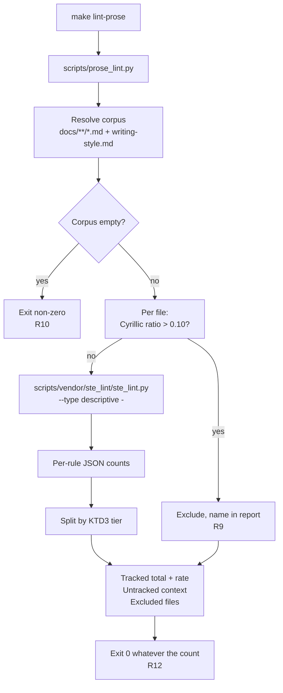

# Vendored Prose Lint Target - Plan

This document follows the repository writing style it is about. It contains no em-dash, no semicolon, and no contraction.

---

## Goal Capsule

- **Objective:** A person maintaining the shared agent writing style can see whether the Markdown this repository produces is drifting away from that style, as a number that moves between two commits, without reading the documents and without trusting the model to report on itself.
- **Means:** Vendor `ste_lint.py` at a recorded upstream revision and drive it from a first-party wrapper behind a new `make lint-prose` target (KTD1, KTD3, KTD5).
- **Authority hierarchy:** `home/.chezmoitemplates/writing-style.md` decides which rules are repository policy. The vendored linter decides counting semantics and is never edited. The wrapper decides corpus scope, language admission, and which counters are summed. When the linter and the style guide disagree, the style guide wins and the wrapper drops the counter from the tracked total. The counter never arbitrates whether writing is good. KTD10 owns that boundary and the evidence behind it.
- **Stop conditions:** Stop and ask before editing any file under `home/`. Stop if the tracked baseline cannot be reproduced twice in a row on an unchanged tree. Never wire the target into CI, never add it to `make lint`, and never let its exit status depend on the count. KTD10 makes that prohibition binding and records why.
- **Execution profile:** Repo-only change. No chezmoi-managed path is created, renamed, or removed.
- **Tail ownership:** The implementer runs the verification contract below and stops. Publishing is a separate decision.

---

## Product Contract

### Summary

Add a vendored copy of the third-party prose linter `ste_lint.py`, a first-party wrapper that scopes and interprets it, and a `make lint-prose` target that reports how many writing-style regressions the repository Markdown contains. The target reports and does not block. It counts only the rules the repository has actually adopted, it refuses to score text it cannot score honestly, and it records the upstream revision it measures against so two runs are comparable.

### Problem Frame

Commit `0c5c33a` added sentence-level language rules to `home/.chezmoitemplates/writing-style.md`: no em-dash, no semicolon, simple tenses, no "-ing" clause after a comma, no contractions, an eleven-word filler list, and a literal-string scan in the pre-send check. Those rules reach the model through four adapters and nothing else.

A measured A/B run showed the model obeys the em-dash ban roughly half the time even with the explicit rule and the self-scan step present. Every component of the style system currently depends on the model choosing to comply, including the component that is supposed to verify compliance. There is no observer outside the model.

That commit also declined to add tests, on the correct grounds that any assertion would read back strings the same change wrote into the source. The gap is real and the previous fix was correctly refused. A counter that runs outside the model closes it without repeating that mistake.

The same upstream repository also carries the argument against leaning on that counter too hard. An interim audit by the tool author found that optimizing against `ste_lint.py` produced worse writing on every dimension a reader actually notices. KTD10 records that evidence, states what the counter cannot see, and makes the diagnostic boundary binding. This plan adopts the counter as a drift signal and rejects it as a target.

### Requirements

**Measurement**

- R1. A single command reports the number of writing-style violations in the repository Markdown corpus, broken down per rule.
- R2. The report separates a **tracked total**, which is the headline number, from **untracked context counters**, which are shown but never summed into it.
- R3. The report includes a per-hundred-words rate alongside the absolute total, because the absolute total grows whenever documents are added and cannot show drift on its own.
- R4. Two runs of the command against the same tree and the same vendored revision produce identical numbers.

**Rule selection**

- R5. A counter enters the tracked total only when it corresponds to a rule stated in `home/.chezmoitemplates/writing-style.md`.
- R6. The `banned_modal` counter is never tracked, because the style guide keeps `may`, `might`, and `could` where the uncertainty is real, and states that "Make certainty visible" outranks the modal rule.
- R7. Untracked counters remain visible in the report, so the person reading it can see what the linter measured and chose not to score.

**Honest scope**

- R8. The corpus is English Markdown. The repository writing style already requires English for documents, plans, commits, and pull request descriptions, so this is a stated precondition rather than a new constraint.
- R9. A Markdown file that is not English is excluded from the corpus and named in the report as excluded, with its measured language ratio. It is never scored silently.
- R10. When the corpus resolves to zero files, the command fails loudly rather than reporting zero violations. A broken glob must not read as a clean result.
- R11. The vendored linter is byte-identical to a recorded upstream revision, and the recorded revision is verifiable from inside the repository.
- R14. YAML frontmatter is removed before a file is scored. Frontmatter is structured metadata, not prose, and 126 of the 141 corpus files carry it.

**Boundaries**

- R12. The command reports and does not gate. R15 owns the exit-status contract.
- R13. No file under `home/` changes.

**Diagnostic boundary**

- R15. The exit status never depends on the violation count. A corpus with violations exits zero. Exactly three conditions exit non-zero, and none of them is a count: the corpus could not be resolved (R10), a required vendored file is missing (KTD2), or the vendored self-test failed so the tool itself is not trustworthy (KTD1). A reader can therefore treat any non-zero exit as a broken measurement, never as a prose verdict.
- R16. The report prints, in its own output, the statement that a falling count is not evidence that writing improved, and names what the counter cannot see.
- R17. The target is never added to `make lint`, never added to a CI job, and its output is never cited as verification evidence under `docs/agent-verification.md`. KTD10 governs.

### Key Decisions

- **The style guide outranks the linter on rule selection.** The linter ships an opinion about English that is stricter than the rules this repository adopted. Adopting the tool must not silently adopt its opinion. Governs R5, R6, R7.
- **Report, do not gate.** The corpus is roughly three hundred thousand words written before the rules existed. A gate would fail on day one and be disabled by the end of the week. Governs R12.
- **Refuse rather than mismeasure.** Both the empty-corpus case and the non-English case produce a low number that reads as success. Both must be loud. Governs R9, R10.

### Scope Boundaries

**In scope**

- Vendoring the linter and its data file, the wrapper, the make target, the baseline snapshot, and the narrow tests named in U5.

**Deferred to follow-up work**

- Wiring the target into `.github/workflows/test-dotfiles.yml`. See Open Question OQ3.
- A ratcheting mode that fails when the tracked total rises above the recorded baseline.
- Extending the corpus to `home/private_dot_claude/skills/**` or other Markdown outside `docs/`.

**Outside this work**

- Promoting the counter to a gate in any form: adding it to `make lint`, adding it to a CI job, failing a build on the count, or citing its output as verification evidence. R17 and KTD10 forbid this, and the evidence is in KTD10 so a future editor meets the argument before reopening the question.

- Teaching the linter Russian, or any non-English language. Nine of its eleven checks are English word lists or English morphology, and its dash rule is actively wrong on Russian, where the dash is normative punctuation. That is a separate and much larger piece of work. This plan excludes non-English text instead.
- Editing `home/.chezmoitemplates/writing-style.md` or any of its four adapters.
- Changing what `make lint` does.

### Open Questions

All four are non-blocking. Each has a recommended default recorded as an assumption, so the plan is executable without an answer.

- OQ1 (deferred). Corpus scope. Corpus A is all of `docs/**/*.md` plus `home/.chezmoitemplates/writing-style.md`. Corpus B removes `docs/plans/` and `docs/issues/`. Measured numbers for both are in the Appendix. Default: Corpus A.
- OQ2 (deferred). Whether `slop_word` joins the tracked total. The repository filler list has eleven terms. The upstream list has sixty-nine. Default: report `slop_word`, do not track it.
- OQ3 (deferred). Whether CI runs the target as a non-gating reporting step. Default: do not wire it into CI in this change.
- OQ4 (deferred). Whether the baseline snapshot is committed now or after the first real drift observation. Default: commit it in U3.
- OQ5 (deferred). Whether a `make` target is the honest shape at all, given KTD10. A Makefile entry is discoverable, which is why an unused diagnostic gets run, but it also sits next to the gates and invites promotion. The alternative is an on-demand command with no Makefile entry, which is harder to promote by accident and easier to forget. Default: keep `make lint-prose` and rely on the R15 exit-status test plus the R16 self-caveat as the structural guards, because a diagnostic nobody can find is worth less than one that states its own limits.

### Sources

- Upstream tool: `https://github.com/AminBlg/SimpleEnglish`, MIT licensed, file `evals/ste_lint.py`.
- Counter-evidence against optimizing on the tool, governing KTD10: `https://raw.githubusercontent.com/aminblg/simpleenglish/d88aa463/evals/results/WHY-USELESS-2026-09-02.md`, pinned at revision `d88aa463`, marked interim, dated 2026-09-02.
- Upstream response to that audit: the 2.0.1 entry in the repository `CHANGELOG.md`, dated 2026-09-04 to 2026-09-06.
- Governing style rules: `home/.chezmoitemplates/writing-style.md`, section "Keep the grammar plain" and section "Make certainty visible".
- Test standard: `docs/solutions/design-patterns/semantic-regression-tests-over-source-shape.md`.
- Vendored-dependency oracle rule: `docs/solutions/design-patterns/fakes-need-the-real-binary-as-oracle.md` and the `Test oracle` entry in `CONCEPTS.md`.
- Verification rules: `docs/agent-verification.md`, risk class "Checkout logic".
- Vendoring precedent: `tests/lib/bashunit`, pinned at 0.50.1 with the version readable only from inside the file. Pin-comment precedent: `home/.chezmoiexternal.toml`.

---

## Planning Contract

### Key Technical Decisions

- KTD1. **Vendor the file verbatim and never edit it.** The linter carries a `--self-test` whose assertions were authored upstream. That self-test is the only available oracle for the tool's counting semantics, and it stays valid only while the file matches its pin. An edited vendor has no oracle and its numbers stop being comparable across a pin bump. Governs R11.

- KTD2. **Vendor `slop.tsv` alongside it.** Line 34 of the linter resolves `slop.tsv` from its own directory and falls back to a sixteen-term built-in list when the file is absent. The fallback is silent. Vendoring only the Python file would make the `slop_word` count depend on a file that is not there, which breaks reproducibility in a way no error message would reveal. This silent fallback is a false-clean risk of the same family as the empty-corpus case R10 guards: the run completes, the number looks valid, and nothing states that the measurement basis changed. The wrapper therefore treats a missing `slop.tsv` as a corpus-resolution failure under R15 rather than scoring against the reduced list. Measured difference on the current corpus is 167 against 22. Governs R4, R11.

- KTD3. **Rule tiering lives in the first-party wrapper, not in a fork or a flag.** The linter emits per-rule counts as JSON. The wrapper reads that JSON and decides which counters are summed. This resolves the modal conflict without touching the vendored file, without a fork to maintain, and without an upstream feature request. The tracked tier is the mechanized form of the literal-string scan already written into the style guide pre-send check. Governs R2, R5, R6, R7.

  | Counter | Tier | Owning rule in `writing-style.md` |
  |---|---|---|
  | `em_dash` | tracked | "Do not use an em-dash or a semicolon" |
  | `semicolon` | tracked | "Do not use an em-dash or a semicolon" |
  | `contraction` | tracked | "Do not use contractions" |
  | `perfect_tense` | tracked | "Simple tenses. Replace present perfect" |
  | `ing_clause` | tracked | "No '-ing' clause after a comma" |
  | `slop_word` | reported | Filler list, but eleven terms against sixty-nine. See OQ2 |
  | `banned_modal` | reported | Conflicts. The style guide keeps real hedges |
  | `sentence_over_limit` | reported | No numeric word cap is repository policy |
  | `trailing_condition` | reported | Not a repository rule |
  | `latin_abbrev` | reported | Not a repository rule |
  | `synonym_rotation` | reported | Not a repository rule |

- KTD4. **A Cyrillic-ratio language guard, with a threshold of 0.10.** The guard is crude on purpose and the corpus validates it. Across all 141 candidate files, two are Russian-dominant at ratios 0.59 and 0.46, one sits at 0.03, and the remaining 138 sit below 0.004. Any threshold between 0.05 and 0.30 separates them cleanly. The cost of not guarding is concrete: `docs/plans/2026-07-14-001-feat-smithers-pipeline-plan.md` is the single largest contributor to the unguarded corpus total at 511 violations, of which 226 are dashes that are correct Russian punctuation, while its eight English-only counters produce 5 hits across 27,000 Cyrillic characters. Governs R8, R9.

- KTD5. **A new `make lint-prose` target, and `make lint` is untouched.** `make lint` is the shellcheck gate and it runs in CI. Adding a reporting command to it would change a gate into a mixed gate, and `tests/bashunit/scripts_test.sh` lines 1216 to 1260 already distinguishes shellcheck failure from the Python-checker failure inside that recipe. A separate target keeps both contracts intact. Governs R12.

- KTD6. **Vendored code lives at `scripts/vendor/ste_lint/`.** `scripts/` is where repository-only Python already lives and is excluded from every `make lint` sweep. The `vendor/` segment marks the boundary between code this repository owns and code it does not. The wrapper sits at `scripts/prose_lint.py` as first-party code, importable by a test under `tests/`.

- KTD7. **Provenance is recorded in a committed `UPSTREAM.md` next to the vendored file.** The bashunit precedent records its version only inside the vendored blob, and its upstream URL only in a plan document. That is thinner than a third-party MIT file needs. Record the repository, the commit that last touched the file, the git blob hash of each vendored file, the license, and the retrieval date, in the same explicit-edit spirit as the `home/.chezmoiexternal.toml` header. The blob hashes make R11 checkable with `git hash-object`. Note that `home/dot_local/bin/executable_update-pins` will not see this pin, because it discovers only GitHub archive URLs, release download URLs, and mise config lines. Bumping is manual and deliberate.

- KTD8. **Stdlib only, Python 3.9 floor.** The repository has no `pyproject.toml`, no requirements file, and no virtual environment. `tests/helpers/common.bash` sets `PYTHON3_MIN_VERSION="3.9"`. The vendored linter imports only `json`, `pathlib`, `re`, and `sys`, so it already complies. The wrapper must too.

- KTD9. **The wrapper strips YAML frontmatter, because the linter does not.** The linter strips fenced code, inline code, headings, URLs, and table syntax, but it has no concept of frontmatter and scores it as prose. This was found by running the linter against this plan document: its only dash hit was the `title: Vendored Prose Lint Target - Plan` line, which the plan section contract requires to be written that way. Across the corpus, frontmatter contributes 77 tracked violations, of which 51 are dashes and 20 are semicolons in metadata that no author should rewrite. The cost is small but the hits are unfixable by design, and an unfixable hit teaches a reader to ignore the number. Governs R14.

- KTD10. **The counter is a diagnostic, never a target and never a gate.** The tool author's own interim audit, at `https://raw.githubusercontent.com/aminblg/simpleenglish/d88aa463/evals/results/WHY-USELESS-2026-09-02.md`, measured three conditions over 8 chat scenarios on sonnet-4-6.

  | Condition | Words | Sentences | Em-dashes | Bold spans | Bullets | `ste_lint` viol/100w |
  |---|---:|---:|---:|---:|---:|---:|
  | No skill | 249 | 18.9 | 32 | 52 | 35 | 5.93 |
  | Full skill 2.0.0 | 171 | 13.4 | 17 | 24 | 22 | 2.65 |
  | Eight-line micro prompt | 150 | 5.8 | 2 | 0 | 0 | 3.34 |

  The author's conclusion is "Skill wins only on its own linter. Micro wins on everything a reader sees." The diagnosis is that "the skill optimizes for evals/ste_lint.py, and 50+ rules dilute the 5 that matter." The condition a reader would prefer scored worse on the counter than the condition the author judged worse. That is Goodhart's law reached through this exact tool, and it is why R15, R16, and R17 exist.

  **Scope of the finding, stated honestly.** The decisive run measures chat replies and scored them with the tool's `reader_check` path, which is the `--type reply` mode this plan does not use. The file is marked interim and dated 2026-09-02. It tested skill version 2.0.0 while 2.0.2 is current. The document leg is two runs per condition. What survives those caveats is the diagnosis of cause, not the effect sizes. Two things raise its weight rather than lower it. Line 1 of the audit is document mode, which is this plan's mode, and it reports 0.00 violations per 100 words with no instrument against 0.98 and 1.27 with one. And upstream acted on the finding: the 2.0.1 changelog says the old benchmark "measured obedience to the linter, not what a reader sees."

  **What the counter cannot see.** Sentence rhythm. Whether the answer leads with the useful thing. Whether a caveat was dropped. Whether the reader can act on the text. It also cannot see length, structure density, bullet padding, organization, or whether a claim is true, and upstream states it has no passive-voice detection. The five tracked counters see five punctuation and tense patterns. Nothing more.

  **Structural guards, so the boundary survives future editing.** The wrapper never exposes the vendored `--gate` flag. R15 is tested in U5 by exit status. The report carries its own caveat under R16, so a reader who never opens this plan still meets the argument. This plan already narrows the "50+ rules" failure mode by tracking five counters rather than eleven, which is the same "5 that matter" insight the audit reaches, but narrowing reduces the surface to game and does not make a falling count into evidence of better writing.

### High-Level Technical Design

The wrapper never reimplements a counter. It resolves a file list, admits or excludes each file, hands admitted text to the vendored linter, and arithmetic-sums the subset of returned counters that KTD3 marks tracked.

### Assumptions

Each is the recorded default for an open question or an unstated detail. An implementer proceeds on these unless the user redirects.

- The corpus is Corpus A: `docs/**/*.md` plus `home/.chezmoitemplates/writing-style.md`. OQ1.
- `slop_word` is reported and not tracked, so the tracked tier is exactly five counters. OQ2.
- The target is not wired into CI in this change. OQ3.
- The baseline snapshot is committed as part of U3. OQ4.
- The language guard threshold is 0.10 and the guard measures Cyrillic against Latin letters only. Other scripts are out of scope because no other script appears in the corpus.
- `--type descriptive` is the mode for documents. The `--gate` flag is never passed, per R12. The `--type reply` mode of the tool is about chat replies and is not used.
- The style guide file scores cleanly enough to include: it currently reports zero em-dashes and zero semicolons, because it quotes the forbidden characters inside inline code spans, which the linter strips.

### Sequencing

U1 has no dependency. U2 depends on U1. U3 depends on U2. U4 depends on U2. U5 depends on U2 and U4. U3 and U4 are independent of each other.

---

## Implementation Units

### U1. Vendor the linter with recorded provenance

- **Goal:** A byte-identical copy of the upstream linter and its data file live in the repository, with their origin recorded and checkable.
- **Requirements:** R4, R11.
- **Dependencies:** none.
- **Files:**
  - `scripts/vendor/ste_lint/ste_lint.py` (create, verbatim)
  - `scripts/vendor/ste_lint/slop.tsv` (create, verbatim)
  - `scripts/vendor/ste_lint/LICENSE` (create, upstream MIT text)
  - `scripts/vendor/ste_lint/UPSTREAM.md` (create)
- **Approach:**
  1. Retrieve both files from `AminBlg/SimpleEnglish` at the revision recorded below and commit them without modification, including the shebang and the executable bit on the Python file.
  2. Copy the upstream `LICENSE` verbatim. MIT redistribution requires the license text and the copyright notice to travel with the code.
  3. Write `UPSTREAM.md` recording repository, upstream URL, license, the commit that last touched `evals/ste_lint.py`, the git blob hash of each vendored file, and the retrieval date. State in it that the files are never edited and that a bump is a deliberate manual replacement, mirroring the `home/.chezmoiexternal.toml` header wording.
  4. State in `UPSTREAM.md` that `home/dot_local/bin/executable_update-pins` does not cover this pin.

  The revision to record, verified during planning:

  | Item | Value |
  |---|---|
  | Upstream repository | `AminBlg/SimpleEnglish` |
  | License | MIT |
  | Commit last touching `evals/ste_lint.py` | `43d6c26d6726d6dfc9aa730cd16357f22b6cd2cd` |
  | Blob hash, `ste_lint.py` | `61234e78b77f52ae07ae58c93ae23953af81756b` |
  | Blob hash, `slop.tsv` | `cce8ecbbddeb9bcd50e9cd3c8cec1d72528699f1` |

- **Patterns to follow:** `tests/lib/bashunit` for a committed single-file third-party dependency. `home/.chezmoiexternal.toml` header for explicit-pin wording.
- **Execution note:** This is packaging. The right first proof is that `python3 scripts/vendor/ste_lint/ste_lint.py --self-test` exits zero from a clean checkout, and that `git hash-object` on each file reproduces the hash written into `UPSTREAM.md`.
- **Test scenarios:** Test expectation: none. This unit adds no first-party behavior. The counting semantics are upstream-owned and are exercised through the upstream interface `--self-test`, which U4 invokes as a step of the target. Writing a local test that asserts the tool's counts would reimplement upstream semantics, which `CONCEPTS.md` names as having no valid local oracle.
- **Verification:** The self-test prints its OK line and exits zero. Both blob hashes match `UPSTREAM.md`. `make lint` still passes, confirming the new directory falls outside every shellcheck sweep and outside `scripts/check_bats_assertions.py`.

### U2. First-party wrapper: corpus, language guard, rule tiering

- **Goal:** A wrapper turns the vendored linter into a repository-scoped, policy-aware report.
- **Requirements:** R1, R2, R3, R5, R6, R7, R8, R9, R10, R12, R13, R14, R15, R16.
- **Dependencies:** U1.
- **Files:**
  - `scripts/prose_lint.py` (create)
- **Approach:**
  1. Resolve the corpus from an explicit path list rather than a shell glob expanded by make, so the empty case is detectable inside Python. Default corpus per the Assumptions.
  2. Fail with a non-zero exit and a named reason when the resolved list is empty, when a configured root does not exist, or when `scripts/vendor/ste_lint/slop.tsv` is missing, per KTD2. These are corpus-resolution failures. Under R15 they are the only non-zero exits the wrapper produces, and the violation count never affects the exit status.
  3. For each file, compute the Cyrillic-to-Latin letter ratio. Above the KTD4 threshold, exclude the file and record its path and ratio for the report.
  4. Strip a leading YAML frontmatter block from each admitted file before scoring, per KTD9. Measure the language ratio on the body, not on the frontmatter.
  5. Import or invoke the vendored linter for each admitted file in `descriptive` mode. Prefer invoking it as a subprocess with `-` on stdin over importing it, so the vendored module namespace stays untouched and the wrapper depends only on the documented CLI.
  6. Sum only the KTD3 tracked counters. Compute the rate as tracked total per hundred words, using the word count the linter itself reports.
  7. Print the tracked total and rate, the tracked per-rule breakdown, the untracked counters under a heading that says they are not summed, and the excluded-file list with ratios. Print the R16 caveat in the same output: a falling count is not evidence that writing improved, and the counter cannot see sentence rhythm, whether the answer leads with the useful thing, whether a caveat was dropped, or whether the reader can act on the text.
  8. Accept an optional argument to print machine-readable JSON, so U3 can produce the baseline from the same code path that produces the human report.
- **Patterns to follow:** `scripts/issues` for argparse structure, a module docstring, `from __future__ import annotations`, and stdlib-only imports. Python 3.9 floor per KTD8.
- **Technical design:** Directional only. The tracked-counter list and the threshold are two module-level constants, so a future policy change is a one-line edit and a reviewer can see the whole policy in one place.
- **Test scenarios:** Covered in U5, which owns the oracle statement for this unit. Do not add tests inside this unit.
- **Verification:** Running the wrapper against the default corpus prints a tracked total, a rate, an untracked block, and exactly the two excluded Russian files named in KTD4. Running it against a directory containing no Markdown exits non-zero with a stated reason.

### U3. Record the baseline snapshot

- **Goal:** A committed snapshot makes the next run's delta readable without rerunning history.
- **Requirements:** R3, R4.
- **Dependencies:** U2.
- **Files:**
  - `docs/prose-lint-baseline.json` (create)
- **Approach:**
  1. Generate the file from the wrapper's JSON output, not by hand.
  2. Record the vendored `ste_lint.py` blob hash inside it, so a baseline measured against a different linter revision is identifiable rather than silently compared.
  3. Record the corpus definition used, the tracked total, the rate, the per-rule tracked and untracked counts, and the excluded-file list.
  4. Do not add comparison logic to the target in this change. The snapshot is a reference point a human or a later change reads. Ratcheting is deferred.
- **Test scenarios:** Test expectation: none. This unit writes measured data. An assertion on its values would compare the file against the numbers the same change produced, which is the tautology `CONCEPTS.md` and the `0c5c33a` commit body both name. The reproducibility property that matters is R4, and U5 owns it.
- **Verification:** Regenerating the file on an unchanged tree produces a byte-identical result.

### U4. Make target and help wiring

- **Goal:** `make lint-prose` runs the report, and the Makefile contract stays intact.
- **Requirements:** R1, R11, R12.
- **Dependencies:** U2.
- **Files:**
  - `Makefile` (modify)
- **Approach:**
  1. Add `lint-prose` to the hand-maintained `.PHONY` line and to the `help` echo block. Both are maintained by hand and both drift silently if missed.
  2. The recipe runs the vendored `--self-test` first, then the wrapper. A vendored file that no longer passes its own self-test must stop the run before it produces numbers that look valid. This is the KTD1 oracle at its point of use.
  3. Leave the `lint` recipe unchanged, per KTD5.
  4. Do not add a CI step. R17 and KTD10 forbid it outright, and the OQ3 default agrees. Do not add the target to the `lint` recipe.
- **Patterns to follow:** the existing `test-issues` recipe, which runs a validation command and then a Python command in sequence.
- **Test scenarios:** Test expectation: none for the recipe text itself. Three existing Python contract tests parse this Makefile: `tests/test_docker_contract.py`, `tests/test_post_apply_suite_contract.py`, and `tests/test_ci_workflow.py`. They own the Makefile contract already. Adding a fourth assertion that the recipe contains the string this unit writes would be a source-shape assertion with no independent oracle. The correct action is to confirm the three existing tests still pass, which the verification contract requires.
- **Verification:** `make lint-prose` prints the self-test OK line, then the report, and exits zero. `make help` lists the new target. `make test-issues` passes, confirming the three Makefile-parsing contract tests are unbroken. `make lint` passes unchanged.

### U5. Narrow regression coverage for the wrapper

- **Goal:** The two failure modes that would make the report lie are protected by a test with an oracle outside this change.
- **Requirements:** R9, R10, R15, and R4 by reproducibility.
- **Dependencies:** U2, U4.
- **Files:**
  - `tests/test_prose_lint.py` (create)
- **Approach:** Keep the file small. It protects the wrapper's admission and refusal behavior only. It asserts nothing about the vendored linter's counting semantics and nothing about the tracked-rule list.

  **Oracle statement, required before the first test edit.** Consumer: anyone running `make lint-prose` to decide whether the prose is drifting. Observable failure: the command reports a low or zero tracked total that reads as "clean" when it in fact measured nothing, because the corpus resolved empty or because a file was excluded without saying so. Oracle: process exit status, plus the counts of admitted and excluded files established from a purpose-built fixture directory by `os.listdir` and by a `grep`-equivalent character scan. Both are outside `scripts/prose_lint.py`, outside the vendored linter, and outside every file this change writes a count into.

  **Second oracle statement, for the anti-gate guard.** Consumer: anyone who runs `make lint-prose` from a hook, a CI job, or a script that checks exit status. Observable failure: the diagnostic is promoted to a gate and starts failing builds on prose, which is the outcome KTD10 forbids. Oracle: process exit status against a fixture whose em-dash count is greater than zero, established by a `grep`-equivalent scan rather than by the wrapper's own tables. The expected value is the constant zero, fixed by R15, and it does not come from any count this change writes.

  **Deliberately not written, and why.** No test asserts that the tracked-counter list equals the list KTD3 writes into the wrapper, because the expected value would come from the same patch. No test asserts the values in `docs/prose-lint-baseline.json`, for the same reason. No test reimplements or asserts `ste_lint.py` counting behavior, because that behavior is upstream-owned and is exercised through `--self-test` in U4.

- **Patterns to follow:** `python3 -m unittest` discovered by `make test-issues`, matching `tests/test_issues.py` structure. Build fixtures in a `tempfile.TemporaryDirectory`, never against the real `docs/` tree.
- **Test scenarios:**
  - Empty corpus is loud. Point the wrapper at a temporary directory containing no Markdown file. Assert the exit status is non-zero before inspecting any output. This is the R10 protection.
  - Valid control reaching success. The same temporary directory containing one small English Markdown file returns exit status zero and reports one admitted file. Without this control, the empty-corpus case could pass because every input fails for an unrelated reason.
  - Non-English file is excluded and named. A fixture file of Russian prose is not counted, is listed as excluded, and the admitted-file count is lower than the total file count by exactly one. Assert the exclusion is reported, not merely that the total is small.
  - English control alongside it. A fixture directory holding one Russian and one English file admits exactly one and excludes exactly one. This is the discriminating control the repository test standard requires for a rejection fixture, and it is what proves the guard discriminates rather than excluding everything.
  - Reproducibility. Two consecutive runs over the same fixture directory produce identical JSON output. This is the R4 protection.
  - Violations present, exit status still zero. A fixture file containing at least one em-dash and one semicolon produces a non-zero tracked total and an exit status of zero. This is the R15 protection and the structural guard behind KTD10. Assert the exit status first, then that the tracked total is greater than zero, so a run that scored nothing cannot pass this scenario by accident.
  - Missing data file is loud. With `slop.tsv` absent, the wrapper exits non-zero rather than scoring against the reduced built-in list. This is the KTD2 false-clean guard.
- **Execution note:** Prove the red state for the two guard scenarios before accepting them. The cheapest faithful method is to temporarily raise the language threshold above 1.0, which must turn the exclusion scenarios red, and to temporarily let the empty case return zero, which must turn the first scenario red. Restore and require green. A guard test observed only green is uncalibrated.
- **Verification:** `make test-issues` passes with the new tests discovered and running. Each guard scenario was observed red at least once.

---

## Verification Contract

Risk class is **Checkout logic** under `docs/agent-verification.md`. No path under `home/` changes, no template changes, no `.chezmoiignore` or `.chezmoiexternal.toml` entry changes, and no managed path is added, renamed, or removed. The narrowest canonical checks own this diff.

| Check | Applies to | Why it is the owner |
|---|---|---|
| `python3 scripts/vendor/ste_lint/ste_lint.py --self-test` | U1 | The only valid oracle for upstream counting semantics, invoked through its real interface |
| `make test-issues` | U2, U4, U5 | Owns Python unittest discovery and the three Makefile-parsing contract tests |
| `make lint` | U1, U4 | Confirms the new directory falls outside every shellcheck sweep and that the `lint` recipe is unchanged |
| `make lint-prose` | U2, U3, U4 | The new target proving itself end to end against the real corpus |

The output of `make lint-prose` is never cited as evidence in a verification report, per R17 and KTD10. It measures drift, not correctness.

**Not required, and why.** `make test-local` is explicitly excluded: `docs/agent-verification.md` adds it only when the diff also contains a managed file, and this diff contains none. `make test-ubuntu`, `make test-docker`, and `make test-suite` are deployment-sensitive or already-applied-home evidence and prove nothing about an unapplied repository-only change.

Both the Ubuntu and macOS pull request jobs must pass before merge. Neither runs the new target, per OQ3.

---

## Definition of Done

**Global**

- The vendored files are byte-identical to the recorded revision, and `git hash-object` reproduces both hashes in `UPSTREAM.md`.
- The MIT license text and copyright notice ship with the vendored code.
- `make lint-prose` reports a tracked total, a rate, an untracked block, and the excluded-file list, and exits zero.
- No file under `home/` is modified.
- Every check in the verification contract passed on the final state.
- The report prints the R16 caveat naming what the counter cannot see.
- `make lint-prose` exits zero on a corpus that contains violations, and the target appears in no CI job and in no `make lint` recipe.
- No dead-end or experimental code from an abandoned approach remains in the diff.

**Per unit**

| Unit | Done signal |
|---|---|
| U1 | Self-test exits zero, both blob hashes match `UPSTREAM.md`, `make lint` unchanged and passing |
| U2 | The report names exactly the two Russian files as excluded, and an empty corpus exits non-zero |
| U3 | Regenerating the baseline on an unchanged tree is byte-identical |
| U4 | `make lint-prose` and `make help` behave as specified, and `make test-issues` passes |
| U5 | Each guard scenario observed red once and green after restore, and `make test-issues` discovers the new file |

---

## Risks and Dependencies

- **The number becomes the goal.** This is the named risk and the reason for KTD10. The tool author measured writing that scored better on this counter while reading worse on every dimension a reader notices. A falling tracked total is not evidence that writing improved. Mitigation: R15 keeps the exit status independent of the count, R16 makes the report state its own limits, R17 forbids gate promotion and forbids citing the output as verification evidence, and U5 tests the exit status rather than trusting the prohibition to hold by convention.

- **The vendored pin drifts from upstream and nobody notices.** `update-pins` does not cover it. Mitigation: `UPSTREAM.md` states that bumping is manual, and the recorded blob hashes make drift detectable. Accepted risk, matching the existing bashunit precedent.
- **A pin bump silently changes the numbers.** A new upstream revision may add or retune a counter, so the baseline stops being comparable. Mitigation: U3 records the linter blob hash inside the baseline file, so a mismatched comparison is identifiable.
- **The language guard is crude and could misfire on a future file.** A short English file quoting a long Russian error message could exceed the ratio. Mitigation: exclusions are always named in the report with their ratio, so a misfire is visible rather than silent. This is the reason R9 requires naming rather than silent skipping.
- **Inline code spans still leak.** The linter strips fenced blocks and inline code, but quoted shell commands inside prose that are not marked as code will contribute semicolons the author cannot remove. The corpus is 10.8 percent fenced-code lines, so residual noise is expected and is a reason the number is a trend rather than a target.
- **A future contributor adds the target to `make lint`.** That would convert a report into a gate that fails immediately. Mitigation: KTD5 rationale is recorded here and the `lint` recipe stays untouched.

---

## Appendix: measured baseline

Measured during planning against the git-tracked working tree at commit `48bc690`, using the vendored revision recorded in U1, `--type descriptive`, with `slop.tsv` present, YAML frontmatter stripped per KTD9, and the KTD4 language guard applied. The corpus is enumerated from `git ls-files`, so uncommitted drafts do not move the number. There are 141 git-tracked candidate files, of which 126 carry frontmatter.

| Corpus | Files scored | Files excluded | Words | Tracked total (5 counters) | Rate per 100 words |
|---|---|---|---|---|---|
| A. `docs/**/*.md` plus `writing-style.md` | 139 | 2 | 285,781 | 5,598 | 1.96 |
| B. A minus `docs/plans/` and `docs/issues/` | 33 | 0 | 58,569 | 1,281 | 2.19 |

Per-counter detail. Tracked counters are the five that map onto a rule in `writing-style.md`.

| Counter | Tier | Corpus A | Corpus B |
|---|---|---|---|
| `em_dash` | tracked | 2,414 | 765 |
| `semicolon` | tracked | 3,028 | 439 |
| `contraction` | tracked | 62 | 46 |
| `perfect_tense` | tracked | 87 | 29 |
| `ing_clause` | tracked | 7 | 2 |
| `slop_word` | reported | 160 | 76 |
| `banned_modal` | reported | 623 | 146 |
| `sentence_over_limit` | reported | 2,689 | 635 |
| `trailing_condition` | reported | 773 | 185 |
| `latin_abbrev` | reported | 39 | 13 |
| `synonym_rotation` | reported | 175 | 41 |

The two excluded files in both corpora are `docs/plans/2026-07-14-001-feat-smithers-pipeline-plan.md` at ratio 0.59 and `docs/plans/2026-07-16-se-pipeline-0.28-migration-handoff.md` at ratio 0.46.

Supporting measurements that shaped the decisions above.

- Language separation is clean. Of the 141 candidates, 11 contain any Cyrillic. Two are Russian-dominant at 0.59 and 0.46, the next is 0.03, and the remaining 138 sit below 0.004. Any threshold between 0.05 and 0.30 separates them.
- Guarding matters most where it is least visible. Without the guard, `docs/plans/2026-07-14-001-feat-smithers-pipeline-plan.md` is the single largest contributor to the whole-corpus total at 511 violations, of which 226 are dashes correct in Russian, while its eight English-only counters return 5 hits across 27,000 Cyrillic characters.
- The em-dash counter is trustworthy on English here. Of 769 dash detections in the unstripped Corpus B, 768 are a real em-dash and 1 is an en-dash. None are the spaced-hyphen pattern, so there is no list-marker false-positive problem in this corpus.
- Frontmatter stripping removes 77 tracked hits, of which 51 are dashes and 20 are semicolons. The effect on the rate is under two percent, but every removed hit was unfixable by an author.
- `slop.tsv` matters for reproducibility, not for the headline. Its presence moves `slop_word` from 22 to 167 on the unstripped corpus, and `slop_word` is not tracked by default.
- The `banned_modal` conflict is smaller than it looks. Of its hits, 200 are the hedges `may`, `might`, and `could` that the style guide protects. The remainder are `should` and `would`, which the style guide treats under a separate rule.
- `home/.chezmoitemplates/writing-style.md` scores zero em-dashes and zero semicolons against itself, because the characters it forbids appear inside inline code spans that the linter strips. It is safe to include in the corpus.
- This plan document scores 0 tracked hits across 4,938 words, after its own two present-perfect verbs were rewritten. Its one dash hit was the frontmatter title, which produced KTD9 rather than an edit.
