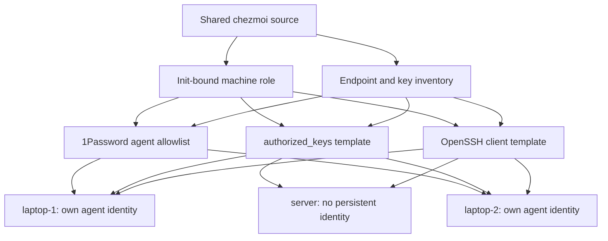
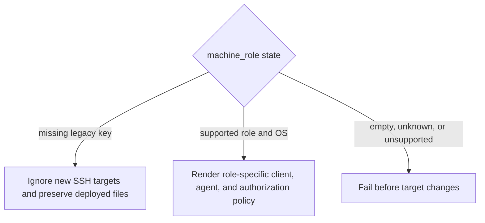

# Role-Based SSH Access - Plan

## Goal Capsule

- **Objective:** Either laptop can reach the other laptop and the home server through stable SSH aliases, while the server holds no persistent outbound private key and every retained inbound credential remains visible in one repository policy.
- **Means:** Bind one machine role at `chezmoi init`, render OpenSSH client and authorization policy from shared templates, and select the role's private key for managed aliases through the local 1Password SSH Agent (KTD1-KTD5).
- **Authority:** This plan > repository instructions and `docs/agent-verification.md` > implementer discretion. OpenSSH, chezmoi, and 1Password documentation own their external interfaces.
- **Stop conditions:** Stop before each destination apply if any existing SSH client stanza, 1Password agent selector, or authorized key lacks a declared disposition; if either laptop's public key cannot be matched to its 1Password fingerprint; if the destination account differs from the inventory; if the host-key fingerprint is unverified; or if tested local recovery and a destination-local rollback copy are unavailable.
- **Execution profile:** One deployment-sensitive change followed by a staged rollout. Preserve old access until every fresh-session path succeeds.
- **Tail ownership:** The implementer owns the Docker verdict and source changes. The user owns the attended 1Password checks, the first apply on each real machine, and the live connectivity matrix.

---

## Product Contract

### Summary

Standardize SSH access for `laptop-1`, `laptop-2`, and `server` through one role-aware chezmoi source. Each laptop uses its own key from 1Password to reach the other laptop and server. The server keeps no persistent outbound key and receives a forwarded laptop agent only for an explicit temporary session.

### Problem Frame

The three machines need different SSH identities and inbound authorization sets, but three independently maintained configurations would drift. Chezmoi already owns the machine setup, yet it has no machine-role datum or managed SSH paths. Moving the policy into chezmoi must not overwrite an undeclared recovery key, expose private material, break unattended rendering, or leave an existing initialized machine with an empty `authorized_keys` file.

### Requirements

**Machine identity and inventory**

- R1. Each role-enabled installation has exactly one role from `laptop-1`, `laptop-2`, or `server`, bound during `chezmoi init` rather than inferred from a mutable hostname.
- R2. One committed inventory maps each role to its SSH alias, Tailscale MagicDNS hostname, local and remote Unix user, public-key source, authorization options, and optional 1Password item selector.
- R3. Existing installations with no role preserve every existing SSH-managed target until the operator deliberately re-initializes with a role; an unknown role or unsupported role and operating-system combination fails before any SSH file changes.

**Outbound authentication**

- R4. `laptop-1` offers only the `laptop-1` identity and `laptop-2` offers only the `laptop-2` identity for managed machine aliases through the macOS 1Password SSH Agent; unrelated declared agent keys remain available to their own consumers.
- R5. Both laptops can reach the other laptop and `server` through ordinary OpenSSH over Tailscale without copying a private key into `~/.ssh`.
- R6. `server` renders no persistent `IdentityAgent`, `IdentityFile`, or identity-limiting directive that would override or exclude a forwarded `SSH_AUTH_SOCK`.
- R7. Agent forwarding stays disabled by default and is enabled only by an explicit invocation for a temporary server session.

**Inbound authorization**

- R8. `laptop-1` authorizes the `laptop-2` public key, `laptop-2` authorizes the `laptop-1` public key, and `server` authorizes both laptop public keys.
- R9. Chezmoi owns the complete `authorized_keys` content after migration, including every retained emergency or transitional public key declared before the first role-enabled apply.
- R10. No private key, private-key fixture, decrypted key value, or 1Password item secret enters the repository, template output, test log, or generated artifact.
- R11. Key rotation supports an overlap period in which old and new public keys are accepted until the new identity succeeds from a fresh session to every required destination.

**Deployment and recovery**

- R12. The rollout preserves an existing session or local console path while each destination adopts the managed authorization policy, and every first managed connection verifies the destination host-key fingerprint through an independent channel.
- R13. The live acceptance check uses fresh non-multiplexed, public-key-only sessions and records the accepted fingerprint for `laptop-1` to `laptop-2` and `server`, `laptop-2` to `laptop-1` and `server`, an ordinary server session with no forwarded agent, and one explicit temporary forwarded session from a laptop through `server` to a laptop.

### Key Decisions

- **Chezmoi remains the single owner of all retained SSH policy** (session-settled: user-directed — chosen over maintaining three independent SSH configurations: the user wants one standardized source for all machines). Governs R1-R3, R8, R9.
- **The server has no persistent outbound private key** (session-settled: user-directed — chosen over provisioning a permanent server identity: outbound server access is exceptional and should use temporary forwarding). Governs R6, R7, R13.

### Acceptance Examples

- AE1. **Covers R3.** Given an existing chezmoi configuration with no `machine_role`, when the new source is evaluated or applied, then its current SSH client configuration and `authorized_keys` remain untouched.
- AE2. **Covers R4, R5, R8.** Given each laptop's role-aware configuration, when it connects to a managed destination, then OpenSSH selects that source laptop's public identity and the destination accepts the matching key.
- AE3. **Covers R6, R7.** Given a normal login from a laptop to `server`, when the user inspects the server session, then no forwarded agent is available; when the user starts an explicit forwarding session, the server can use the laptop agent only for that session.
- AE4. **Covers R9, R12.** Given existing manual or recovery entries, when the first role-enabled apply is prepared, then every retained entry appears in the committed policy before chezmoi replaces the destination file.
- AE5. **Covers R11.** Given a laptop key rotation, when the new public key is deployed alongside the old key, then both work until fresh-session verification succeeds and a later apply removes the old key.

### Scope Boundaries

- In scope: OpenSSH client aliases, identity selection, 1Password agent allowlists, public-key deployment, complete `authorized_keys` ownership, role binding, migration safety, and verification.
- Out of scope: enabling macOS Remote Login or the Linux SSH daemon, replacing ordinary OpenSSH with Tailscale SSH, managing Tailscale grants or host firewalls, managing `known_hosts`, disabling password authentication, and automating Herdr saved-machine registration.
- The out-of-scope services are rollout prerequisites. MagicDNS resolution, TCP port 22 reachability, and the SSH daemon must already work before live acceptance.

---

## Planning Contract

### Key Technical Decisions

- KTD1. **Bind `machine_role` as init-time data through `MMS_MACHINE_ROLE` and validate it once before SSH target selection.** Interactive new initialization offers the three supported roles. Unattended initialization requires a supported nonempty role. An existing config with no key enters legacy preservation mode. This mode distinction does not depend on detecting an explicitly empty environment variable, which the current truthiness-based prompt pattern cannot distinguish from an unset value.
- KTD2. **Keep endpoint metadata in one committed chezmoi data file and public keys in separate plain source files.** Public keys are non-secret and remain canonical for fingerprints and `IdentityFile`. Per-destination authorization metadata separately owns the complete `authorized_keys` line so existing options are preserved or deliberately replaced. Role names remain separate from hostnames and Unix users. The local account running chezmoi must match the destination account before SSH targets become managed.
- KTD3. **Render one OpenSSH client template with a role-specific directive matrix.** Laptop roles use the documented macOS 1Password socket, their own public key as `IdentityFile`, and `IdentitiesOnly yes`. The server omits those directives so an explicitly forwarded `SSH_AUTH_SOCK` remains usable. All roles keep `ForwardAgent no` as the default.
- KTD4. **Render one complete local 1Password `agent.toml` allowlist per laptop role and no agent config for the server.** Use stable item IDs instead of display names. Inventory the existing agent policy and every Git, SSH, signing, and graphical client that consumes it before replacement. Preserve required non-machine selectors; KTD3 limits managed machine aliases to the local role key. Because a valid selector can match no key, the real 1Password agent and fingerprint comparison own acceptance rather than a local semantic clone of 1Password behavior.
- KTD5. **Own the complete `authorized_keys` file after a guarded migration.** Chosen over a managed marker block because the requested single-source policy must also revoke stale keys. Before role enablement, inventory the existing file and add every retained recovery or transitional key to committed inputs. The first apply runs with an independent recovery path and an existing session kept open.
- KTD6. **Use real consumers as the test oracle without adding a local SSH-server clone.** Automated tests use OpenSSH to parse effective client configuration and chezmoi to prove legacy preservation and deployment. Live non-multiplexed OpenSSH handshakes own intended acceptance, rejection, and revocation because this repository has no independent SSH daemon fixture. Expected values do not come from template literals or the public-key inventory changed by this work.

### Assumptions

- The supported deployment matrix is `laptop-1` on macOS, `laptop-2` on macOS, and `server` on Linux. Other combinations are rejected until deliberately added.
- Tailscale MagicDNS already resolves the three inventory hostnames and network policy already permits the intended port 22 paths.
- The two laptop keys either already differ or will be generated as separate Ed25519 keys. A per-machine 1Password allowlist improves attribution and prevents accidental key offers, but it is not hardware binding because the same 1Password account can access both items.
- The current `~/.ssh/config`, `~/.ssh/authorized_keys`, and 1Password `agent.toml` content on all machines can be inventoried before implementation. Missing remote inventory triggers the Goal Capsule stop condition.
- The server can obtain this repository through a public HTTPS remote or another non-SSH bootstrap path when no forwarded agent is present.
- An independent local or console recovery path exists for each machine during rollout. Recovery-key design beyond preserving an existing declared public key is outside this plan.

### High-Level Technical Design





### Output Structure

```text
home/
├── .chezmoidata/
│   └── ssh.yaml
├── private_dot_ssh/
│   ├── private_config.tmpl
│   ├── private_authorized_keys.tmpl
│   ├── laptop-1.pub
│   └── laptop-2.pub
└── private_dot_config/
    └── 1Password/
        └── private_ssh/
            └── private_agent.toml.tmpl
```

The implementation may adjust chezmoi attribute prefixes after verifying the target modes. The deployed paths stay `~/.ssh/config`, `~/.ssh/authorized_keys`, the two public-key files, and `~/.config/1Password/ssh/agent.toml`.

### Sequencing

1. Establish role data, endpoint inventory, legacy preservation, and test fixtures before any managed SSH target exists.
2. Prepare laptop identities, client rendering, and the complete 1Password agent policy without applying them to a real laptop.
3. Add the complete inbound authorization policy after current keys and recovery paths are inventoried.
4. Install each new public key on every destination before activating that source laptop's managed client identity.
5. Roll out one destination at a time, verify a fresh session, and remove old access only after the full matrix passes.

---

## Implementation Units

### U1. Machine role and SSH inventory

- **Goal:** Establish validated per-machine data and safe behavior for configurations initialized before this feature.
- **Requirements:** R1-R3, R10. Implements KTD1 and KTD2.
- **Dependencies:** none.
- **Files:**
  - `home/.chezmoi.yaml.tmpl`
  - `home/.chezmoidata/ssh.yaml` (new)
  - `home/.chezmoiignore`
  - `.github/workflows/test-dotfiles.yml`
  - `docker/docker-compose.yml`
  - `tests/bashunit/templates_test.sh`
  - `tests/helpers/common.bash`
- **Approach:**
  1. Add `MMS_MACHINE_ROLE` initialization with one validation boundary for the supported role and operating-system matrix.
  2. Add the endpoint and key metadata schema without private material.
  3. Make a missing legacy role ignore every new SSH target. Make an explicit invalid role stop rendering rather than select a default or shared superset.
  4. Supply a deterministic role to every CI, Docker, and test initialization path that cannot answer a prompt.
- **Execution note:** Start with role-binding and legacy-preservation coverage because a wrong default can overwrite authentication files during the first apply.
- **Patterns to follow:** Init-time binding in `home/.chezmoi.yaml.tmpl`; per-mode render controls in `tests/bashunit/templates_test.sh`; unattended environment setup in `.github/workflows/test-dotfiles.yml` and `docker/docker-compose.yml`.
- **Test scenarios:**
  - Initialize separate configs for each supported role and confirm each exposes the expected role datum after a successful render.
  - Covers AE1. Render with an existing config that lacks `machine_role` and apply against planted SSH sentinel files; the command succeeds and leaves both sentinels unchanged.
  - Initialize with an unknown role, `laptop-1` on Linux, or `server` on macOS; each case fails before any planted SSH sentinel changes. An absent role in an existing config remains the separate legacy case.
  - Run unattended initialization with its declared fixture role; it completes without reading interactive input.
- **Verification:** All supported modes render. Legacy mode preserves deployed SSH state. Invalid and unsupported modes fail without partial writes.

### U2. Role-aware OpenSSH client and 1Password agent policy

- **Goal:** Give both laptops deterministic 1Password-backed outbound identities while leaving the server compatible with temporary forwarding.
- **Requirements:** R4-R7, R10. Implements KTD3, KTD4, and KTD6.
- **Dependencies:** U1.
- **Files:**
  - `home/.chezmoidata/ssh.yaml`
  - `home/private_dot_ssh/private_config.tmpl` (new)
  - `home/private_dot_ssh/laptop-1.pub` (new)
  - `home/private_dot_ssh/laptop-2.pub` (new)
  - `home/private_dot_config/1Password/private_ssh/private_agent.toml.tmpl` (new)
  - `home/.chezmoiignore`
  - `tests/bashunit/templates_test.sh`
- **Approach:**
  1. Import or generate one Ed25519 key per laptop in 1Password and commit only verified public-key exports with neutral comments.
  2. Render every managed host alias from the central inventory. Apply the laptop and server directive matrix from KTD3.
  3. Inventory the existing 1Password agent policy and its consumers. Render a macOS-only complete allowlist that includes the local role's item ID plus every retained non-machine selector. Omit the target for `server` and Linux rather than creating an empty file.
  4. Keep all unmanaged OpenSSH stanzas discovered during inventory in the managed template or in a deliberate included fragment before replacing the live config. Validate precedence across `Host *`, `Match`, and `Include` content because OpenSSH uses the first obtained value.
- **Execution note:** Use OpenSSH as the parser and behavior oracle. Do not implement a local clone of 1Password selector semantics.
- **Patterns to follow:** OS conditionals in `home/dot_zshenv.tmpl`; permission attributes under `home/private_dot_config/`; official 1Password key matching and agent config documentation.
- **Test scenarios:**
  - Covers AE2. Render each laptop config, inspect its effective OpenSSH configuration for every managed destination, and confirm only that laptop's public identity is selected with the documented agent socket.
  - Render the server config and confirm its effective OpenSSH configuration does not override `SSH_AUTH_SOCK` or restrict a forwarded identity.
  - Render the macOS agent policy for each laptop and confirm its declared selector set remains complete; render the server and Linux paths and confirm chezmoi does not manage `agent.toml` there.
  - Parse both committed public keys with `ssh-keygen` and compare their fingerprints against the attended 1Password item details; the fingerprints differ and each item matches its exported public key.
- **Verification:** `ssh -G` accepts every rendered alias and resolves the intended hostname, user, identity, agent, forwarding, and multiplexing posture after retained stanzas are composed. On each real laptop, `ssh-add -L` through the unlocked 1Password agent includes the role fingerprint and every declared non-machine selector, with no undeclared key.

### U3. Deterministic inbound authorization and safe rotation

- **Goal:** Make the complete inbound authorization matrix declarative without dropping existing or recovery access during adoption.
- **Requirements:** R8-R12. Implements KTD2, KTD5, and KTD6.
- **Dependencies:** U1, U2, and a complete inventory of existing `authorized_keys` on all three machines.
- **Files:**
  - `home/private_dot_ssh/private_authorized_keys.tmpl` (new)
  - `home/.chezmoidata/ssh.yaml`
  - `tests/bashunit/templates_test.sh`
  - `tests/bashunit/idempotent_test.sh`
- **Approach:**
  1. Add every retained daily, emergency, and transitional public key to the canonical source before managing the destination file. Preserve or deliberately replace the full options prefix attached to each existing authorization line.
  2. Render the inbound matrix from R8. Never render a zero-key file for a supported role.
  3. Preserve overlap entries in data during rotation. Remove an old entry only in a later change after the new identity passes every destination from a fresh session.
  4. Confirm the chezmoi source names deploy `.ssh` and authorization files with OpenSSH-compatible ownership and restrictive modes without making the directory exact.
- **Execution note:** Keep an existing session open during first adoption. Verify a new session before closing it or removing any old key.
- **Patterns to follow:** Deployment ownership in `docs/agent-verification.md`; semantic render and deployment tests in `docs/solutions/design-patterns/semantic-regression-tests-over-source-shape.md`.
- **Test scenarios:**
  - Covers AE4. Seed a destination with the inventoried retained keys, apply the matching role, and confirm the managed result preserves every declared key with no undeclared additions.
  - Render each supported role and parse every key payload with `ssh-keygen`; malformed, duplicate, and zero-key outputs fail. Preserve the approved options prefix for each retained authorization entry.
  - Covers AE5. Render a rotation overlap with old and new fixture public keys, then prove acceptance and final revocation through the live handshake owner in U4.
  - Apply the same role twice in a disposable home; the second apply leaves the managed SSH files unchanged.
- **Verification:** The rendered and deployed authorization sets match R8 plus explicitly retained recovery or overlap entries. File ownership targets the inventory's destination account, and modes satisfy OpenSSH `StrictModes` expectations.

### U4. Lockout-safe rollout and live acceptance

- **Goal:** Move all three machines to the managed policy and prove normal and exceptional access paths without leaving stale private keys.
- **Requirements:** R5-R7, R10-R13. Uses KTD3-KTD5.
- **Dependencies:** U1-U3 and working Tailscale, MagicDNS, SSH daemons, and local recovery paths.
- **Files:**
  - `README.md`
- **Approach:**
  1. Document role selection, required 1Password item IDs, the signed-off SSH and agent-policy inventory, destination-local rollback copies, and the revision equality check between checkout, source clone, preview, and apply.
  2. Before any client activation, install the overlapping authorization set on `server`, then the laptop with the strongest tested local recovery, then the remaining laptop. Keep an existing destination session open until a fresh non-multiplexed login succeeds.
  3. Verify both laptop identities directly against every destination. Only then activate the role-aware client and agent policy on each laptop in the same recovery-ranked order.
  4. After each destination apply, compare deployed fingerprints, owner, and modes with the approved preview. Roll back from the destination-local copy immediately if any expected result differs, then prove the previous credential through a fresh session before touching another machine.
  5. Run the complete ordinary access matrix. Then use one dedicated non-multiplexed forwarding session for the exceptional server-to-laptop path and prove that a newly opened normal server session cannot use the laptop agent after logout.
  6. Remove old local private-key files and stale authorization entries in a separate cleanup stage only after an observation checkpoint and the full matrix pass.
- **Execution note:** This unit is an attended deployment procedure. Never run `chezmoi apply` on the host from an agent session.
- **Patterns to follow:** The three-copy chezmoi deployment model and host-apply prohibition in `AGENTS.md`; first-apply safety in `docs/agent-verification.md`.
- **Test scenarios:**
  - Covers AE2. From each laptop, open fresh non-multiplexed public-key-only sessions to the other laptop and server through the managed aliases; record the accepted fingerprint and reject password, keyboard-interactive, host-based, or unrelated-agent fallback as proof.
  - Covers AE3. In a normal server session, confirm no usable forwarded agent exists. In an explicit forwarding session, connect onward to the intended laptop and confirm the capability ends at logout.
  - Attempt each retired key after cleanup and confirm it no longer authenticates.
  - Interrupt one destination rollout before cleanup and confirm the preserved session or local console path still permits recovery.
- **Verification:** Every destination passes its preview, recovery, apply, fresh-session, and rollback-readiness gate before rollout advances. The complete live matrix in R13 passes. Each laptop's local private-key file is absent only after its 1Password-backed path succeeds. The server contains no persistent outbound private key.

---

## System-Wide Impact

- **Authentication boundary:** 1Password owns laptop private-key use. Chezmoi owns public identity mapping and server authorization. Tailscale owns network reachability. A role-specific allowlist prevents accidental offers but does not isolate laptops that can access the same 1Password account.
- **Existing installations:** They remain unchanged until re-initialized with `MMS_MACHINE_ROLE`. Re-initialization is the explicit migration boundary.
- **CI and Docker:** Every unattended init path gains a fixture role. Linux verifies `server`; template coverage renders both laptop branches without pretending to exercise the macOS 1Password application.
- **Operations:** Full ownership of `authorized_keys` makes key revocation reliable, but an incomplete pre-migration inventory can cause lockout. The rollout order and stop conditions mitigate that risk.

---

## Risks & Dependencies

- **Lockout from incomplete inventory:** Keep an independent recovery path and do not enable a role until every retained key and client stanza has a declared destination.
- **Authorization options lost during migration:** Preserve the complete options prefix of every retained `authorized_keys` line or record its deliberate replacement before apply.
- **A valid 1Password selector matches nothing:** Use stable item IDs and verify the real agent output against the committed public-key fingerprint after locking and unlocking 1Password.
- **Unrelated 1Password consumers lose keys:** Inventory the global agent policy and preserve every required selector before chezmoi takes ownership.
- **Forwarded-agent abuse on the server:** Keep forwarding off by default and disable connection multiplexing for the dedicated forwarded session. Any process under the server account, plus privileged processes, can request signatures from an approved forwarded key until that session ends.
- **Rollback does not follow from removing the role:** Legacy mode preserves the already deployed files. Capture destination-local pre-apply copies with ownership and modes, and restore those copies through the tested local recovery path.
- **1Password socket or client compatibility changes:** The current documented macOS socket and public-key `IdentityFile` pattern are authoritative for implementation. Recheck official documentation after major 1Password or OpenSSH upgrades.
- **External prerequisites drift:** This plan does not enforce Tailscale grants, firewall policy, SSH daemon settings, or MagicDNS. A network failure is not evidence that key policy rendered incorrectly.

---

## Verification Contract

| Check | Command | Applies to | Gate |
|---|---|---|---|
| Focused template suite | `tests/lib/bashunit -j 8 tests/bashunit/templates_test.sh` | U1-U3 | Required after template or test changes |
| Shell lint | `make lint` | Any changed shell helper or modify script | Required when applicable |
| Checkout-to-home diff | `make test-local` | U1-U4 | Required review before user deployment; never applies changes |
| Disposable deployment oracle | `make test-ubuntu` | U1-U3 | Required on the final deployment-sensitive state before publication |
| Real macOS agent check | `ssh-add -L` plus fingerprint comparison | U2, U4 | Required attended check on both laptops |
| Destination preview and rollback gate | `make test-local` plus destination-local file comparison | U4 | Required before each real-machine apply |
| Live connectivity matrix | Fresh SSH sessions for every R13 path | U4 | Required before deleting old credentials |

The implementation workflow must state KTD6's oracle line before the first test edit. The Docker run proves rendering and deployment on Linux. It does not replace the two attended macOS 1Password checks. Both Ubuntu and macOS pull-request jobs must pass before merge.

---

## Definition of Done

- R1-R13 hold on the final source and live three-machine state.
- Each implementation unit's verification outcomes are observed on the final state that it covers.
- Both laptop public-key fingerprints match their 1Password items, no private key exists in the repository, and the server has no persistent outbound private key.
- Legacy configurations without a role preserve existing SSH files. Invalid explicit roles fail without partial target changes.
- The complete inbound authorization matrix and every retained recovery key are declared in the repository.
- Every retained `authorized_keys` option and 1Password agent selector has an explicit disposition.
- `make test-ubuntu` passes after all deployment-sensitive edits settle. The attended macOS and live connectivity checks are recorded separately.
- Old private-key files and authorization entries are removed only after fresh-session proof. No abandoned migration fixture or experimental configuration remains in the diff.
- The user can recover the deployment sequence from `README.md` without relying on this conversation.

---

## Appendix

### Sources

- 1Password SSH Agent: https://developer.1password.com/docs/ssh/agent
- 1Password SSH Agent configuration: https://developer.1password.com/docs/ssh/agent/config
- 1Password host-to-key matching: https://developer.1password.com/docs/ssh/agent/advanced#match-key-with-host
- 1Password agent forwarding: https://developer.1password.com/docs/ssh/agent/forwarding
- OpenSSH client configuration: https://man.openbsd.org/ssh_config
- OpenSSH server authorization: https://man.openbsd.org/sshd.8
- Chezmoi target types and permission attributes: https://chezmoi.io/reference/target-types/
- Repository verification policy: `docs/agent-verification.md`
- Semantic test ownership: `docs/solutions/design-patterns/semantic-regression-tests-over-source-shape.md`
- Unattended secret boundary: `docs/solutions/design-patterns/capturing-child-output-hides-the-prompt.md`
