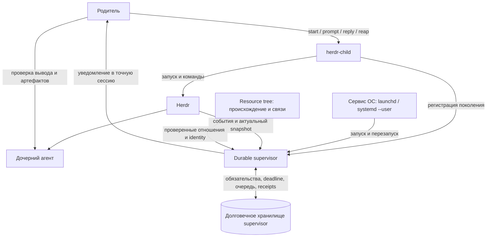
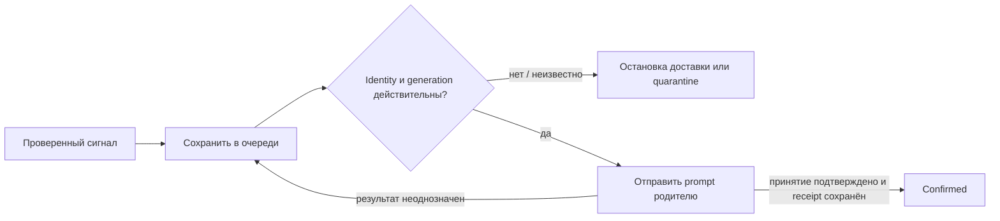

# Устойчивое наблюдение за дочерними агентами в Herdr

> **Работа отменена как преждевременная по решению пользователя.** Resource tree с инъекцией контекста закрывает восстановление отношений и ресурсов; существующий watcher обеспечивает обычные пробуждения родителя. Отдельный durable supervisor пока не оправдан наблюдаемой потребностью. Переход к спецификации и реализации отменён. Ниже сохранено объяснение рассмотренного проекта, а не действующий план.

**Что рассматривали:** отдельный сервис, который помнит, за каким дочерним агентом нужно наблюдать и какого родителя уведомить. Падение самого наблюдателя не должно стирать эти обязательства.

**Где мы сейчас:** Resource tree уже реализован. Новый supervisor не реализован и не развёрнут; связанные задачи закрыты как преждевременные.

Это объяснение принятого проекта, а не дополнительный план работ. Канонические решения и их уточнения находятся в [карте durable supervision](https://github.com/Seigiard/my-mac-setup/issues/285) и связанных issues; ссылки собраны в конце.

## 1. Зачем это нужно

Родитель запускает ребёнка и заканчивает свой ход. Кто-то должен продолжить наблюдение и снова вызвать родителя, когда потребуется его внимание.

```text
Родитель: «Сделай задачу»
  └─ Ребёнок работает
       ├─ закончил ход → позвать родителя проверить результат
       ├─ ждёт ответа → позвать родителя разобраться
       ├─ истёк срок проверки → позвать родителя посмотреть прогресс
       └─ неожиданно исчез → сообщить родителю о потере ребёнка
```

Сейчас это делает отдельный watcher для каждого detached-запуска. Он хранит часть состояния во временных файлах и в собственной памяти. Если этот механизм исчезнет, восстановить наблюдение автоматически некому.

Новый сервис сохраняет обязательства, очередь уведомлений и подтверждения доставки независимо от родительского хода и процесса наблюдателя.

> Уведомление означает «проверь ребёнка». Оно никогда не означает «задача выполнена правильно».

## 2. Общая картина: кто за что отвечает



| Участник | Его ответственность | Что ему не поручаем |
|---|---|---|
| **Herdr** | Текущее расположение панелей, native session identity и наблюдаемое состояние агентов | Историю пропущенных событий и оценку результата задачи |
| **Resource tree** | Кто создал ресурс, кто запустил агента, как восстановить эти отношения | Хранение task-state, очередь уведомлений или вторую базу расположения панелей |
| **`herdr-child`** | Управляемые запуски, продолжения, ответы ребёнку и явное освобождение ресурсов | Независимую вторую доставку для поколения, которым уже владеет supervisor |
| **Supervisor** | Наблюдение, deadline, восстановление и доставку сигналов | Вывод «работа успешна» или автоматическое закрытие ресурсов |
| **Родитель** | Проверку вывода, кода, тестов, коммитов и других артефактов | Хранение единственной копии очереди доставки в контексте беседы |
| **Сервис ОС** | Запуск и перезапуск supervisor | Управление задачами дочерних агентов |

Supervisor один на локальный Herdr server. Он работает как пользовательский сервис: **`launchd` на macOS, `systemd --user` на Linux**. Стартует вместе с пользовательской сессией или при доступности локального Herdr; после сбоя перезапускается с ограниченной задержкой повторных попыток.

Остановка Herdr, выход из пользовательской сессии и рестарт supervisor сами по себе не являются командой закрыть дочерние ресурсы и не доказывают завершение задачи.

## 3. Что именно мы запоминаем

**Agent session** — конкретная беседа агента. Compaction и resume могут сохранять её identity; новая беседа в той же панели — другая сессия.

**Поколение, generation** — одна управляемая попытка работы ребёнка. Продолжение создаёт новое поколение, даже если родитель, ребёнок и панель остались прежними.

**Supervision interest** — долговечное обязательство уведомлять определённого родителя об этом поколении.

Короткий словарь остальных обозначений:

| Термин | Смысл |
|---|---|
| `snapshot` | Снимок текущего состояния Herdr |
| `pending` / `active` | Регистрация ещё не подтверждена / наблюдение активировано |
| `settled` | Агент закончил ход; это не оценка качества результата |
| `receipt` | Сохранённая отметка о подтверждённом принятии уведомления |
| `quarantine` | Обязательство сохранено, но действия приостановлены до безопасной проверки |
| `recovery-needed` | Просьба проверить состояние и вывод, потому что автоматике не хватает доказательств |
| `occurrence ID` | Идентификатор отдельного случая, например одного разрыва наблюдения |
| `tombstone` | Краткая запись об отменённом или сменившемся поколении, предотвращающая его случайное возрождение |

```text
Supervision interest
├── область конкретного локального Herdr server
├── точная Agent session родителя
├── точная Agent session ребёнка
├── связь с тем же ресурсом ребёнка
├── generation
├── delivery owner: legacy watcher ИЛИ supervisor
├── фаза регистрации: pending / active / неопределённость
├── исходный deadline и данные для проверки времени
└── связанные сигналы, очередь и подтверждения доставки
```

Это смысл записи, не утверждённая схема таблиц.

**Alias и pane ID — адреса для текущего обращения, а не достаточное доказательство личности.** Перед доставкой адреса обновляются по Herdr. Переименование или перемещение панели не меняет сессию, если непрерывность ресурса доказана. Совпадение имени, соседство, общая вкладка или новый обитатель старой панели не позволяют перенаправить уведомление.

Resource creator, Parent agent и delivery owner — разные отношения: создатель панели не обязательно запустил её нынешнего обитателя, а право отправлять уведомления не даёт владения ресурсом.

## 4. Главное архитектурное решение: заменить watcher

```diff
 Новое detached-поколение
-  отдельный watcher наблюдает, отправляет и хранит свои receipts
-  рядом может появиться резервный supervisor с собственной доставкой
+  только supervisor наблюдает и отправляет
+  его durable store — единственный источник receipts этого поколения
```

**Мы выбрали замену, а не параллельный резерв.** Это явно меняет прежнюю идею backstop: два независимых отправителя могут оба успешно уведомить родителя об одном событии.

Переход организован по поколениям:

```text
Старое поколение G1 → прежний watcher до завершения / явной отмены
Новое поколение G2  → supervisor

G1 не передаётся supervisor автоматически.
Receipts G1 не импортируются как будто их всегда вёл supervisor.
Если supervisor недоступен, новый запуск не включает watcher молча.
```

Перед продолжением нужно исключить незавершённую отправку от старого поколения. **Прочитать identity перед отправкой недостаточно:** между чтением и отправкой другой процесс мог уже отменить поколение.

Поэтому отправка, продолжение и `reap` согласуются через единую границу эксклюзивного доступа. Если нельзя доказать, что прежний отправитель больше не отправит, операция сообщает неопределённость, сохраняет ребёнка и не повторяет prompt автоматически. Два экземпляра самого supervisor тоже не должны одновременно получить право доставки.

Attached `--wait` сохраняет свою роль. Канал вопроса ребёнка `ask` и ответа `reply` не заменяется новым мессенджером.

## 5. Как начинается управляемое наблюдение

Регистрация существует только на управляемом пути detached-запуска или продолжения. Произвольного API «забери себе наблюдение за любым ребёнком» не вводим.

```text
on(managed detached submission)
  сериализовать операции для этого ребёнка
  проверить точные identity и допустимое исходное состояние
  исключить доставку от прежнего поколения при продолжении

  сохранить pending:
    parent, child, resource, generation, delivery owner
    исходный status/revision, duration и данные времени

  отправить prompt ровно один раз

  if принятие prompt или identity не удалось подтвердить
    сохранить явную неопределённость
    не объявлять новое поколение active
    не повторять prompt автоматически
    return recovery / диагностика

  сохранить active и исходный deadline
  допускать только проверенные сигналы
```

`pending` записывается **до** отправки. `active` появляется **после** подтверждения принятия prompt и проверки сессии ребёнка. Сбой между этими шагами не даёт права угадать, что prompt точно был принят или точно не был принят.

Управляемый обычный follow-up допускается из проверенного settled-состояния. Работающему ребёнку не назначается новое обычное поколение поверх текущего. `reply` — отдельный путь из подтверждённого ожидания ответа родителя.

Точные повторы регистрации идемпотентны по области сервера, паре сессий, ресурсу и generation. Конфликтующие регистрации отвергаются: обязательства не сливаются и не «перехватываются».

## 6. Как supervisor подключается к Herdr

Herdr 0.9.0 предоставляет живую raw-socket подписку, но **не предоставляет публичный replay, cursor или идентификатор события**, позволяющий запросить пропущенную историю. CLI-команды `events.subscribe` нет; сервис должен использовать socket API.

Порядок подключения обязателен:

```text
1. Открыть подписку
2. Получить acknowledgement
3. Буферизовать поступающие события
4. Получить актуальный snapshot
5. Установить snapshot
6. Обработать буфер по порядку и продолжать слушать
```

Если сначала прочитать snapshot, а потом подписаться, между ними возникнет незамеченный промежуток.

У supervisor **один широкий поток событий на сервер**, а не отдельная подписка на каждого ребёнка. События фильтруются локально по точным активным interests. Эпоха подключения используется для диагностики, но не превращается в идентификатор lifecycle-события.

Текущее совпадение статуса, которое Herdr может выдать при установке фильтрованной подписки, — наблюдение настоящего, а не восстановленная история.

## 7. Почему событие `idle` ещё не означает конец нового задания

В native event нет нашей generation и надёжной метки задания. Два задания могут выполняться в одной Agent session.

```text
Старое задание заканчивается → событие задержалось в пути
Новое задание принято        → generation уже другая
Старое событие приходит      → нельзя объявлять новое задание завершённым
```

Принято следующее правило:

```text
on(native event для активного interest)
  считать событие поводом проверить актуальное состояние
  перечитать server / resource / session / status / revision

  if это непротиворечивое промежуточное наблюдение
    сохранить свидетельство и продолжить наблюдать
  else if подтверждён ход нового lifecycle после принятия prompt
     and наблюдение непрерывно
    допустить соответствующий lifecycle-сигнал
  else
    создать recovery-needed: «проверь вывод и состояние ребёнка»
```

Изменившаяся revision и совпавшая session сами по себе недостаточны. Пока запись `pending`, lifecycle-сигналы не отправляются; ранние наблюдения сохраняются как свидетельства либо интервал отмечается неопределённым.

**Быстро завершившийся ребёнок не должен исчезнуть из внимания родителя.** Если он закончил раньше, чем удалось надёжно увидеть новый цикл, родитель получает запрос проверки вместо выдуманного `settled`.

Так же обрабатываются неоднозначное принятие prompt, сброс revision, `unknown`, потеря потока и конкурирующая внешняя активность. Это договорённость для совместно работающих managed-клиентов, а не обещание точно различить любые задания при произвольных сторонних prompt.

## 8. Timeout — сохранённый срок проверки, а не диагноз ребёнка

Deadline привязан к наблюдению успешного принятия prompt. Активация сохраняет этот исходный срок вместе с поколением. Повторное подключение или задержка доставки не сдвигают его.

Для расчёта нужны сохраняемые данные elapsed time с проверяемой областью часов/загрузки ОС, включая время сна машины. Перевод настенных часов не должен молча укоротить или продлить ожидание. Если достоверность времени или непрерывность сервера потеряна, вместо восстановления таймера нужна явная recovery-диагностика.

```text
                     исходный deadline
                              │
Запуск ───── сбой supervisor ──┼──── рестарт
                              │         └─ deadline уже прошёл
                              │            → один timeout
                              │            → продолжить наблюдение
```

| Ситуация | Поведение |
|---|---|
| Завершающий lifecycle-сигнал надёжно сохранён до наступления timeout | Отключить таймер, даже если сигнал ещё не доставлен |
| Timeout уже попал в очередь, позже пришёл settlement | Сохранить оба; сначала timeout, затем settlement |
| Deadline прошёл во время простоя, ранее записанного завершения нет | После восстановления создать один timeout: родителю пора проверить ребёнка |
| Ребёнок мог закончить во время простоя | Timeout не утверждает обратного; отдельно остаётся неопределённость наблюдения |
| Нельзя доказать тот же сервер или ход времени | Не оживлять старый таймер; показать recovery-needed / quarantine |

При восстановлении просроченные таймеры обрабатываются до новых post-reconnect lifecycle-наблюдений. Уже сохранённый FIFO-порядок не переписывается. Исторический порядок пропущенных переходов не угадывается.

Timeout доставляется один раз на generation при подтверждённой доставке; неоднозначная доставка может повториться. После timeout наблюдение продолжается. Проверенный завершающий сигнал заканчивает обычную фазу наблюдения этого хода, но не удаляет receipts, очередь или само обязательство и не закрывает панель.

## 9. Доставка: долговечная очередь, но не exactly-once



**Гарантия — at-least-once, а не exactly-once.** При неопределённом результате попытка повторяется. Если prompt дошёл, но процесс упал до сохранения receipt, родитель может увидеть повтор.

Подтверждение доставки означает **принятие prompt транспортом плюс сохранённый receipt**, а не то, что модель прочитала сообщение, проверила результат или закончила задачу. Неудачная попытка никогда не становится confirmed.

```text
Пример одной очереди на interest:

timeout → settlement → recovery notice
   ↑
   пока эта доставка неопределённа, последующая её не обгоняет

Другой ребёнок → независимая очередь
```

Порядок есть внутри одного interest; глобального порядка между детьми нет. FIFO отражает порядок сохранённого допуска сигналов, а не неизвестную хронологию событий во время простоя.

Точный confirmed-ключ подавляет повтор. Для обычного сигнала основа ключа — interest, generation, outcome и typed reason; для recovery дополнительно нужен идентификатор конкретного случая. Receipts и in-flight-состояние принадлежат хранилищу supervisor, не родителю и не Herdr.

## 10. Разрыв наблюдения и повторный разрыв — разные случаи

**Observation gap** — промежуток, когда supervisor не мог надёжно видеть события. Snapshot после него показывает настоящее, но не объясняет, что происходило в промежутке.

```text
generation G7

наблюдение ── разрыв A ── retry ── retry ── восстановление ── разрыв B
                 └──── один occurrence ID ────┘                 └─ новый ID

notice(G7, gap=A) и notice(G7, gap=B) — разные уведомления
retry notice(G7, gap=A)             — повтор того же уведомления
```

- ID сохраняется при reconnect-попытках и повторных падениях в рамках того же незавершённого простоя.
- Если при старте нет надёжной отметки непрерывности, это неопределённость, а не доказательство отсутствия пропущенных событий.
- Разрыв заканчивается после успешного subscribe → snapshot → проверки identity. Если identity конкретного interest всё ещё неясна, этот interest остаётся в quarantine.
- Восстановление наблюдения **не удаляет** ожидающее доставки сообщение. Родитель мог быть недоступен весь этот период.
- Следующий разрыв получает новый ID, даже если generation не изменилась. Receipt первого разрыва не подавляет второй.
- Неопределённость на границе prompt — отдельное recovery condition со своей устойчивой identity; она не маскируется под прежний observation gap.

Ключ recovery-уведомления:

```text
(interest, generation, recovery-needed, typed reason, occurrence ID)
```

Родителю не нужно подтверждать «я прочитал результат», чтобы закончить период потери наблюдения. **Восстановление наблюдения, доставка сообщения и оценка задачи — три разных факта.**

## 11. Если родитель или ребёнок недоступен

| Наблюдаемая ситуация | Решение |
|---|---|
| Родитель временно `blocked` или prompt transport временно не работает | Повторять доставку с ограниченной сверху задержкой, пока generation актуальна и identity совпадает |
| Точная сессия родителя отсутствует | Quarantine: удерживать обязательство, не искать «похожего» адресата |
| Та же сессия вернулась в той же доказанной области сервера | Продолжить доставку оставшихся сигналов и notices по FIFO |
| Родителя заменила новая сессия | Терминальный `parent-session-mismatch`; остановить доставку этого interest, ребёнка оставить доступным для осмотра |
| Ребёнок неожиданно исчез при актуальном generation | `child-gone`, когда точный родитель достижим; иначе удерживать событие для безопасного восстановления |
| Исчезновение пришлось на ненаблюдаемый промежуток | Не сочинять историю исчезновения из одного snapshot; сообщить неопределённость |
| Identity ребёнка или непрерывность ресурса неизвестны | Quarantine; никакого переназначения на нового обитателя панели |
| Родитель выполнил `reap` | Сначала инвалидировать generation, затем закрывать; не генерировать `child-gone` от собственного освобождения |
| Herdr холодно перезапустился / машина перезагрузилась | Старые delivery authority и timer не оживают только из-за похожих ID или восстановленной беседы |

Данные переживают рестарт supervisor. Но **сохранить данные — не значит доказать непрерывность после рестарта Herdr**: native restore может восстановить беседу или координаты, не доказав, что ресурс и server scope прежние.

У interest нет wall-clock срока годности: отсутствие родителя не стирает его по таймеру. Его срок жизни ограничен явной отменой / reap, supersede новым поколением, закрытием ребёнка или терминальным несовпадением identity. Это не то же самое, что inspection deadline.

После смены или отмены generation старое поколение не возрождается. Для старых поколений остаётся ограниченное окно tombstones/receipts, более старые записи сворачиваются в типизированные итоги. Pending deliveries и receipts актуального поколения нельзя выбрасывать по этой политике очистки истории.

Диагностика показывает точную пару, generation, typed reason, известные координаты ребёнка и следующий шаг проверки. На ресурсе ребёнка должны различаться **pending/recovery** и **failed supervision**. Состояния очищаются только соответствующим восстановлением того же поколения, явной отменой/reap или закрытием ребёнка; сообщение не отправляется новой сессии вместо недоступного прежнего родителя.

## 12. Что намеренно остаётся за границами

- Перестройка уже сделанного resource tree или вторая авторитетная база расположения панелей.
- Хранение прогресса/успеха задач, вывод об успешности по `idle`/`done`, подтверждения чтения результатов.
- Передача ответственности за ресурсы, автоматическое закрытие и уборка панелей.
- Замена Intercom, канала `ask`/`reply` или реализация доставки из отдельной задачи о коммуникации агентов.
- Удалённые машины, федерация серверов, новый графический интерфейс.
- Exactly-once создание, доставка или восстановление пропущенных native-событий там, где API не даёт необходимых доказательств.

## 13. Что уже принято, а что предстоит построить

```text
Уже есть
  Resource tree: происхождение, parentage, reconciliation, CLI/JSON,
  контекст для Claude / OpenCode / Pi

Принято в этой работе
  отдельный OS user service → один observer на server
  один delivery owner на generation → замена watcher для новых поколений
  pending до prompt → active после подтверждения
  сохранённый deadline → timeout после рестарта без продления срока
  нет доказательства turn → recovery-needed
  отдельные occurrence ID → независимые notices последовательных разрывов
  durable FIFO + receipts → at-least-once с явными ограничениями
  точные identity → quarantine вместо подмены адресата

Прежний маршрут, теперь отменён
  спецификация → задачи реализации → код и deployment → проверка поведения
```

Технология хранения, конкретный механизм эксклюзивной доставки, socket transport, service units и исполняемые проверки ещё не реализованы. Проверка Markdown и закрытые decision tickets не являются runtime-доказательством устойчивости.

Ключевые сценарии будущей проверки: отсутствие двух отправителей при переходе, deadline через рестарт, быстрое/неоднозначное завершение нового хода, два последовательных разрыва без коллизии receipts. Отдельно проверяется отсутствие ложной доставки после отмены поколения или смены сессии.

## Источники решений

| Артефакт | Что в нём |
|---|---|
| [Карта durable supervision](https://github.com/Seigiard/my-mac-setup/issues/285) | Индекс решений и граница завершённого планирования |
| [Ограничения lifecycle API](https://github.com/Seigiard/my-mac-setup/issues/288#issuecomment-5732252342) | No replay, порядок подписки и ограничения восстановления |
| [Исследование Herdr 0.9.0](https://github.com/Seigiard/my-mac-setup/blob/301fd8b/docs/plans/2026-09-18-herdr-subscription-constraints-research.md) | Подробные источники и измеренные ограничения |
| [Hosting и restart owner](https://github.com/Seigiard/my-mac-setup/issues/287#issuecomment-5733008797) | Один пользовательский сервис на локальный сервер |
| [Регистрация interests](https://github.com/Seigiard/my-mac-setup/issues/289#issuecomment-5733683333) · [уточнение](https://github.com/Seigiard/my-mac-setup/issues/289#issuecomment-5735158797) | Pending/active, identity, generations и граница prompt |
| [Итоговый пересмотренный контракт](https://github.com/Seigiard/my-mac-setup/issues/290#issuecomment-5735147920) | Единственный отправитель, deadline, неопределённость turn и occurrence IDs; заменяет первоначальное неполное решение |
| [Recovery](https://github.com/Seigiard/my-mac-setup/issues/286#issuecomment-5734719191) · [уточнение](https://github.com/Seigiard/my-mac-setup/issues/286#issuecomment-5735158817) | Недоступный родитель, quarantine и независимость восстановления от доставки |
| [Исходная задача](https://github.com/Seigiard/my-mac-setup/issues/214) | Resource tree завершён; оставшаяся реализация supervisor отменена как преждевременная |
| [Resource tree](herdr-resource-tree.md) | Уже реализованная основа, которую используем |
| [ADR-0019](decisions/0019-use-one-delivery-owner-per-supervision-generation.md) | Отмена проекта и рассмотренный вариант с одним владельцем доставки на generation |
| [Глоссарий](../CONCEPTS.md) | Общие термины |
