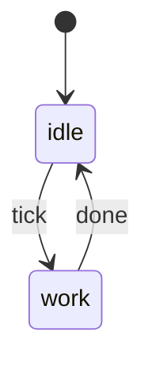

# Section catalogue

Each entry names the plan content that feeds it, the visual form, and a markup sketch. A section ships when a plan passage feeds it.

Classes referenced here are defined in `page-craft.md`.

---

## 1. The whole picture

**Feeds on:** the plan's problem frame and summary.

**Form:** one large drawn scene of the situation the plan lives in — the screen, the system, the people. Mock the real interface rather than describing it: a terminal window, a form, a dashboard. End with one sentence naming the thing the rest of the page will talk about.

**Why it works:** a reader with no context needs a place to stand before any term means anything.

---

## 2. Vocabulary

**Feeds on:** every domain term the page is about to use.

**Form:** a grid of small cards. Each card is one term: a big glyph or mock on top, one sentence under it. Four to six cards carry the non-obvious reader-facing terms; a further specialist term gets defined inline where it first appears.

```html
<div class="grid g2">
  <div class="card"><div class="big">📁 📁</div><p><b>Worktree</b> — a second folder of the same project, on another branch.</p></div>
</div>
```

**Rule:** a later term is a hole when a reader with zero context cannot infer it from the sentence around it. Ordinary plan labels and command names are not holes. Walk the finished page and check.

---

## 3. Now vs. wanted

**Feeds on:** the problem frame and the requirements.

**Form:** two panels side by side, same shape, same mock — one showing today, one showing the target. Strike through or redden exactly what is wrong today.

**Why it works:** the gap is the whole reason the plan exists, and two identical frames make it a single glance.

---

## 4. The behavior

**Feeds on:** a plan that describes a cycle, a daemon, a request path, a state machine.

**Form:** a horizontal pipeline of boxes for a simple flow, marking which boxes are new and which already exist. When the plan defines states and transitions, use a mermaid `stateDiagram-v2` instead, and follow it with a legend of the distinct outcomes.

````

````

**Rule:** name the outcomes the way the plan names them. When the plan gives the code an outcome vocabulary, put those exact words in the legend — that is the bridge between picture and implementation.

**Skip it** when the plan describes no runtime behavior.

---

## 5. The route

**Feeds on:** the stages, their dependencies, and the decision that gates them.

**Form:** stations in a row, one per stage, in fixed order. Each station carries a name, one sentence of what happens, and a refusal badge — the thing this stage must not do. Under the row, a highlighted panel for the decision that a later stage waits on, with its candidate branches; render an unlikely candidate at low opacity.

```html
<div class="route">
  <div class="station"><div class="stn">Station 1</div><h4>Look</h4><p>…</p><span class="no">no code at all</span></div>
</div>
<div class="switchbox">
  <p class="t">What station 1 sees decides which station 3 gets built.</p>
  <div class="branches"><div class="branch">…</div><div class="branch faint">…</div></div>
</div>
```

**Why it works:** it answers "why this order" instead of asserting it. Drawing the branches makes the cost of starting late visible.

---

## 6. The refusals

**Feeds on:** the plan's technical decisions and scope boundaries — most of them are phrased as "instead of X, do Y".

**Form:** one row per refusal. Left: a large grey block with the rejected option, struck through, its height scaled to the work avoided. Right: a small bright block with what happens instead.

```html
<div class="pair">
  <div class="no-block" style="min-height:88px">A plugin of its own</div>
  <div class="yes-block">One change inside the program that already exists</div>
</div>
```

**Why it works:** this is the honest answer to "how hard is this". Scale is carried by grey mass against bright mass, so no invented difficulty scale is needed. A negative decision has no other way to become a visible object.

---

## 7. The scoreboard

**Feeds on:** acceptance examples, matrices, checklists, definition of done, verification gates.

**Form:** the plan's own acceptance table, drawn large. Tint each cell by the stage that closes it, and add a legend for the tints. Under the scoreboard, a strip of gate pills — the commands that must be green — with any human-only step in a distinct colour.

**Why it works:** it is the plan's own artifact rather than a retelling, and it converts "done" into a countable thing.

---

## 8. What each stage hands back

**Feeds on:** each stage's declared output — a filled table, a recorded decision, changed behavior, tests — plus any cleanup obligation.

**Form:** one card per stage. Each card carries a small monospace mock of the actual artifact: the table as it will look filled in, the row as it will look changed, the decision line as it will be written.

```html
<div class="card">
  <span class="tag t-acc">after stage 1</span>
  <p>A filled table, and one decision</p>
  <div class="paper">cc  <span class="ok">✓</span> <span class="ok">✓</span> <span class="nope">✗</span>

<b>folder read from: ____</b></div>
  <p>How it behaves today, written into the plan. Nothing installed.</p>
</div>
```

**Why it works:** it answers "what do I get" in objects rather than promises, and it exposes any stage whose only output is internal — which is exactly the stage worth questioning.

State the cleanup obligation once, above the cards.

---

## 9. The inventory (optional)

**Feeds on:** the labelled families counted in step 1 of the workflow.

**Form:** a row of drawer cards, each with a big count, the family's code, a plain-language name, and one line of what it is for. Follow with the items themselves, one short line each: code chip on the left, plain sentence on the right.

**Use it** when the user asks what is in the plan, or when the plan's labels will show up elsewhere in the reader's life. Skip it when the reader only needs the story.

---

## 10. What is still open

**Feeds on:** the plan's open questions, deferred items, and any decision it marks as pending or "to be filled by stage N".

**Form:** a short list, one card per open item: the question in plain words, what will settle it, and when. Render a decision that is already scheduled differently from one that is genuinely unresolved.

**Why it works:** a reader who cannot see the holes assumes there are none, then discovers them mid-execution. A plan that names its unknowns is stronger, not weaker — showing them makes the honesty visible.

**Rule:** carry each open question exactly as the plan states it. A pending placeholder in the plan stays pending on the page.

---

## Framing devices that fail groundedness

Each of these looks like content and carries none, because the plan never stated it. The grounded move is given beside it.

| Tempting device | The grounded move |
|---|---|
| A difficulty scale — dots, stars, t-shirt sizes | Section 6: let the mass of refused work carry the scale |
| A generic risk or trap list | Name the risks the plan names, and stop there |
| A time estimate the plan never gives | Report the duration as unstated |
| A prose summary of the pictures | Let the pictures be the summary |
